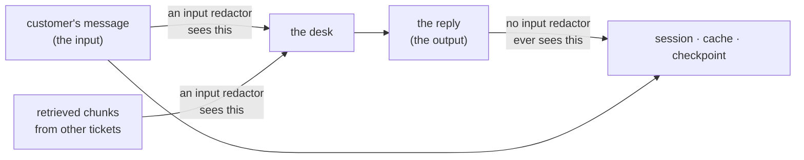

# 2.4 — The reply is personal data too

## One-line answer

The desk's own output quotes the customer back at them — *"Hello Lin Zhou…"* — so the generated half
of every stored exchange is personal data that no redactor pointed at the **input** will ever see.

## The story

You go for an eye test. Afterwards a letter arrives.

*Dear Mr Adeyemi, following your appointment on the 14th we are writing to confirm the prescription
for your right eye and to note that you mentioned difficulty reading at your desk. We have sent a
copy to your GP.*

You did not write that letter. The optician did. Every fact in it about you came out of your mouth in
a small room twenty minutes earlier, and now it exists in a second document, in a second building,
addressed to a third party.

If somebody asked the practice to delete what they hold about you, and they thought only about the
form you filled in at reception, they would miss the letter entirely. The letter is not something you
gave them. It is something they made.

## The idea in plain language

Redaction is almost always designed as a filter on the way **in**. Text arrives, it is cleaned, the
clean version is stored. Day 48's rule was exactly this and it was the right rule
([4.1](../../../day-48-memory-design/parts/04-privacy-and-erasure/4.1-redact-before-you-write.md)):
the cheapest personal data to protect is the personal data you never wrote down.

An agent breaks the shape of that rule, because an agent **produces text**, and the text it produces
is about the person it is helping. A support reply that does not mention the customer's problem is
not a support reply. So the output carries:

- **What the customer said, restated.** Any decent reply confirms the problem back, because that is
  how you show you understood it.
- **What the agent looked up.** Account numbers, plan names, dates — pulled out of a database and
  written into prose, where [1.3](../01-who-a-record-names/1.3-the-box-marked-anything-else.md)'s
  argument applies to them from the moment they land.
- **What retrieval brought in.** If the desk cites a prior ticket, the reply now contains a fragment
  of *another* conversation, which may be a different customer's.

That last one deserves its own sentence. Days 49 and 50 built retrieval so the desk could answer
"have we seen this before?" by pulling in prior tickets. Every retrieved chunk becomes part of the
prompt, and anything the model repeats out of it becomes part of the reply, and the reply is stored.
So the output store can accumulate text belonging to people who are not party to the conversation
that produced it.

There is a structural point underneath all this. A filter on input has a well-defined place to sit:
one function, at the boundary, before the write. A filter on output has to sit somewhere too, and
"somewhere" is a different door — Day 67's distinction between an input guardrail and an output
guardrail is exactly this, and today is the privacy-shaped instance of it. **Two doors, not one**, and
a system with only the first door has covered the half that was easy to think about.

## Why Sutra needs it

[2.1](2.1-one-sentence-seven-places.md) counted thirteen copies of one address and the count came out
higher than the number of stores. Part of the reason is that the cache and the checkpoint each hold
the value twice — once in the prompt and once in the response.

That doubling is not an artefact of the lab. It is what an agent is: a thing that reads text about a
person and writes more text about the same person. Any accounting of where personal data lives that
counts inputs and not outputs is out by roughly a factor of two before it starts, and the half it
misses is the half that no input filter can reach.

## The mechanism

`_desk.py` stores a recorded reply for each ticket — recorded rather than generated, because the day
spends nothing and because what gets written down is the same either way. Look at what is in it.

```bash
cd days/day-69-pii-and-data-boundaries/lab
uv run python copies.py > /dev/null
cat state/checkpoint.json
```

**Line by line:**

- The checkpoint is Day 61's store: the state a killed run would resume from. On this desk that is
  the stage it reached, the draft it had written, and the input it was working on.
- `cat` again rather than a summary, because the claim of this part is about what is literally in the
  file.

Measured on 2026-09-06:

```json
{
  "ticket:7006": {
    "stage": "review",
    "draft": "Hello Lin Zhou, the downgrade did not apply because the change was made mid-cycle. I have corrected the plan.",
    "input": "From: lin.zhou@example.com\n\nDowngrade did not take effect. Plan still shows Pro after a week.\n\n-- \nLin Zhou\n+44 7700 900318\nlin.zhou@example.com"
  }
}
```

Two fields carrying the customer's name. `input` is the ticket, and every rule anybody has written so
far applies to it. `draft` is the desk's own sentence, and it opens with the customer's name because
that is what a polite reply does.

Now the arithmetic that shows this is not a rounding error:

```bash
uv run python copies.py --needle "Lin Zhou"
```

**Line by line:**

- `--needle` counts a different string. The name is the right one to count here because it appears in
  the reply as well as the message, whereas the telephone number appears only in the message.

```text
after one run of the desk, 'Lin Zhou' appears in:

  store        times  written because
  archive          1  it is the ticket
  session          2  Day 47 persisted the conversation
  memory           1  Day 48's policy kept a memo
  index            1  Day 49 stored the chunk it indexed
  cache            2  Day 51 cached the prompt and reply
  log              1  Day 22 logged an excerpt
  checkpoint       2  Day 61 saved the run state

  stores holding it   7 of 7
  total copies        10
```

Compare the `archive` row with the `session`, `cache` and `checkpoint` rows. The archive has the name
**once** — the customer typed it once, in their sign-off. The other three have it **twice**, and the
second occurrence in each is the desk's own words.

Three of the ten copies of this person's name were written by the system rather than by them. Delete
the ticket and you have removed one of ten.



## When it breaks

🎬 **The scene:** the redaction plugin ships. It sits on the model-call path, scrubs the request, and
a test proves that a ticket with an email address in it reaches the provider with
`[REDACTED-EMAIL]` in place of the address. Everybody is satisfied, correctly, that the input side is
handled.

😬 **The naive fix:** none, because it looks finished. The boundary in
[2.2](2.2-a-boundary-is-a-line-you-can-name.md) named *desk → provider*, and the door is on it.

💥 **Why it fails:** the model still knows the customer's name, because it was in the retrieved
context, or in the session history, or because the customer signed the message and the redactor
matched addresses rather than names — which
[5.3](../05-measuring-the-redactor/5.3-the-wall-called-a-name.md) shows is the normal case. It writes
*"Hello Lin Zhou"*. That sentence is generated **after** the input filter has run, it is stored by
three separate stores, and none of them applies any filter at all, because none of them believes it
is handling untrusted input. The redaction rate on the dashboard stays high and is measuring one
direction.

💡 **The insight:** an agent is not a pipe with a filter at the front. It is a **loop**, and the
output re-enters the system as stored state and as the next turn's history. A filter that runs once,
at the entrance, cleans the thing that is about to go round again and never the thing that came back.

The second break is the one with somebody else's data in it. A retrieved chunk from another
customer's ticket lands in the prompt, the model quotes a sentence of it into the reply, and the
reply is stored under *this* customer's session. The name in that stored record now belongs to a
person who has no relationship with this conversation at all — so an erasure request from the second
customer has to reach a record filed under the first, and nothing in the key structure will lead
anyone there.

## In production

**What a professional writes instead.** Two doors, and they are different code. The input door is
about what leaves for the provider and is the natural fit for a plugin's `before_model_callback` —
verified against `google-adk==2.7.1` with
`python -c "import inspect; from google.adk.plugins.base_plugin import BasePlugin;
print(inspect.signature(BasePlugin.before_model_callback))"`, which gives
`(self, *, callback_context, llm_request)`. The output door is about what gets **stored**, and it
belongs on the write path of each store rather than on the model path, because the checkpoint and the
session are written by the runtime rather than by the reply-formatting code. `adk.dev/safety/` (page
fetched 2026-09-06) describes the redaction plugin pattern for the first door and is silent about the
second, which is worth knowing rather than assuming.

**What degrades at scale.** Output volume overtakes input volume. A ticket is written once; the desk
may draft, revise under a critic, summarise for a memo and produce a customer-facing reply — four
generated artefacts per input, each quoting the person. The generated half of your stored corpus
grows faster than the half people are thinking about.

**The failure mode that only appears with real traffic.** Models are polite. Instruction tuning
pushes them towards addressing people by name and restating their problem, so the *rate* at which
identifiers appear in output is high and stable — it is a property of the model's manners, not of
unusual inputs. You cannot reduce it by fixing an edge case, and a sample of ten replies will show it
immediately, which is why sampling stored output is a standing task rather than a one-off audit.

**The review comment a senior engineer leaves:** *"The plugin redacts `llm_request.contents`. What
redacts the response before we put it in the session, the cache and the checkpoint? Right now the
only thing standing between a generated name and three stores is that the model chose to be polite,
and it always chooses to be polite."*

**The interview question:** *"Your agent's inputs are redacted. Is that enough?"* The answer that shows
you have done this: *"No, and the counting is the fastest way to see it. I traced one customer's name
through our stores after a single run: ten copies across seven stores, and three of them were in text
the system generated rather than text the customer sent — the reply opened with their name, and the
session, cache and checkpoint each stored it. An input filter cannot reach any of those, because they
are written after it runs. So you need a second door on the store-write path, and the harder version
of the problem is retrieved context: if the model quotes another customer's ticket into this reply,
you have just filed one person's data under another person's key, and no erasure path will find it."*

## Check yourself

```bash
cd days/day-69-pii-and-data-boundaries/lab
uv run python copies.py > /dev/null
uv run python copies.py --needle "Lin Zhou"
cat state/checkpoint.json
```

Count how many of the ten copies of the name are in text the customer wrote and how many are in text
the desk wrote. Then open `state/session.json` and say which of its two entries an input redactor
would never have touched.

**Out loud, without scrolling up:** say why an agent needs two redaction doors rather than one, and
name the store that would still hold a generated name after the input door did its job perfectly.

**Next:** [3.1 — Three providers, three answers](../03-the-line-at-the-provider/3.1-three-providers-three-answers.md).
