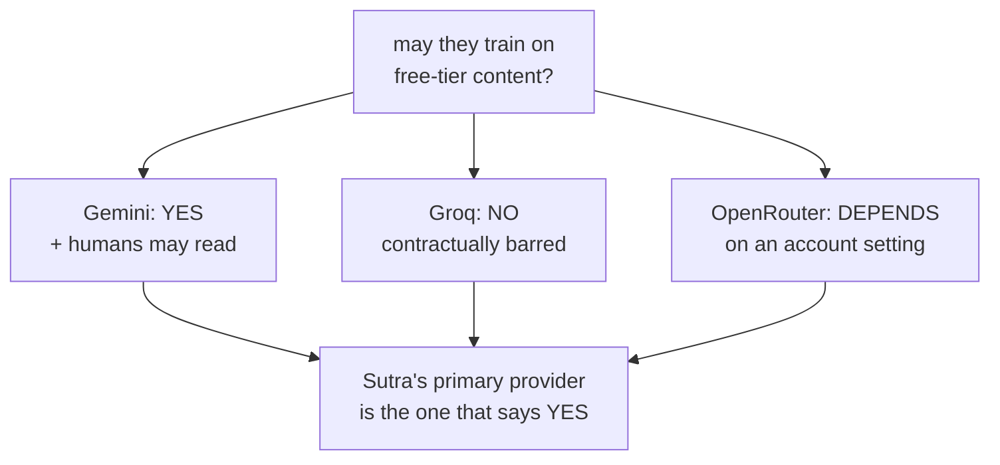

# 3.1 — Three providers, three answers

## One-line answer

Asked whether they may train on what a free tier sends them, Sutra's three providers give three
different answers — **yes**, **no**, and **it depends on a setting** — and the one that says yes is
the primary.

## The story

You park in three different car parks in the same week.

The first is behind a supermarket. The sign says two hours free for customers, and you have always
treated that as what car parks are like.

The second is a council one. The sign says pay and display, and there is a small line at the bottom
about the barrier closing at eleven, which you do not read, because you have read a car park sign
before and you know what they say.

The third belongs to a retail park. Its sign says the same things in the same order, and about two
thirds of the way down it says that vehicles left after closing are removed at the owner's expense.

Three signs. You glanced at all three and read none of them, because after the first one you were not
reading any more — you were confirming. And the third car park is the one where it matters.

## The idea in plain language

"Free tier" is not a thing. It is a word that three companies each use for their own arrangement, and
the arrangements differ in the way that matters most here: **what the provider is allowed to do with
what you send.**

There are really three separate questions hiding inside "do they train on my data", and keeping them
apart is most of the work.

1. **Is the content used to improve or train models?** The one everybody asks.
2. **Do humans read it?** Different question, different risk. A model trained on your text is a
   statistical risk; a person annotating your text is a disclosure.
3. **How long is it retained, and by whom?** A provider that does not train may still hold the text
   for abuse monitoring, and may hold it in a jurisdiction you did not choose.

The answers are not intuitable from the company, the price or the reputation. They are written down,
they differ, and they change. Addendum 02 has said since it was written that free tiers *commonly*
permit training — and "commonly" is doing real work in that sentence, because when you actually read
all three, one of them says the opposite.

That is the point of this part. The rule is not "free means they train on you". The rule is **read
the specific document for the specific tier, and write down what it said and when you read it** —
which is Principle 7 pointed at a legal page instead of a version number, and it bites for the same
reason. A wrong version pin fails loudly on the next `uv sync`. A remembered belief about a
provider's terms fails silently, for as long as you keep believing it.

## Why Sutra needs it

Every day of this curriculum runs on free tiers, and Addendum 02 is the document that makes that a
feature rather than a limitation. Its rule for this specific case is one sentence: never feed real
personal or employer data through free endpoints.

That sentence is unenforceable until somebody has done the reading in this part, because it does not
say which endpoints or on what grounds. After the reading it becomes a boundary with a rule on it —
crossing **B3** in [2.2](../02-where-the-copies-are/2.2-a-boundary-is-a-line-you-can-name.md) — and
[3.3](3.3-what-follows-for-sutra.md) turns it into a decision the whole repository already depends
on.

## The mechanism

Every row below was read from the provider's own page on **2026-09-06**. `lab/terms.py` is the record
of that reading, in the same spirit as a `docs/PACKAGES.md` row: a claim about a document, attributed
to the document, with the date it was opened.

```bash
cd days/day-69-pii-and-data-boundaries/lab
uv run python terms.py
```

**Line by line:**

- `terms.py` holds no logic and makes no request. It is a table of quotes with their sources, printed.
- It is deliberately **not** a live fetch. A script that fetches on demand tells you what is true at
  the moment you run it, while the lesson written around it was written on a particular day — and the
  two silently diverging is worse than either. `--recheck` prints the commands to go and look again.

Measured on 2026-09-06:

```text
may the provider train on what a free tier sends it?

  provider           trains   checked      source
  Gemini (unpaid)    YES      2026-09-06   https://ai.google.dev/gemini-api/terms
  Gemini (unpaid)    YES      2026-09-06   https://ai.google.dev/gemini-api/docs/pricing
  Groq               NO       2026-09-06   https://console.groq.com/docs/legal/services-agreement
  Groq               n/a      2026-09-06   https://groq.com/privacy-policy/
  OpenRouter         DEPENDS  2026-09-06   https://openrouter.ai/docs/features/privacy-and-logging

  providers that DO train on free-tier content: Gemini
  Sutra's primary provider is Gemini. That is the whole of SEC-13.
```

Now the sentences themselves, because a table of verdicts is a summary and the wording is the
evidence:

```bash
uv run python terms.py --quotes
```

**Line by line:**

- `--quotes` prints each row's text as it appeared on the page, with the URL above it.
- Quoting rather than paraphrasing matters more here than almost anywhere else in this curriculum: a
  paraphrase of a licence is an opinion about a licence.

**Gemini, the unpaid services** — from `https://ai.google.dev/gemini-api/terms`, under *How Google
Uses Your Data*:

> "Google uses the content you submit to the Services and any generated responses to provide,
> improve, and develop Google products and services and machine learning technologies"

and, in the same section:

> "Do not submit sensitive, confidential, or personal information to the Unpaid Services."

The same page states that human reviewers may read, annotate and process API input and output, with
the data disconnected from the Google Account, API key and Cloud project before they see it. That is
question 2 above, answered explicitly, and it is a different answer from question 1.

The pricing page says the same thing in table form. Its *"Used to improve our products"* row reads
**Yes** for the free tier and **No** for the paid tier, and its footer says *"Last updated 2026-09-04
UTC"* — two days before this reading, which is a useful reminder of how live these documents are.

**Groq** — from the services agreement:

> "Groq is not permitted to use Inputs or Outputs for training or fine-tuning any AI Model Services
> or other models, unless explicitly granted permission or instructed by Customer."

No free-versus-paid distinction is drawn. The provider that costs nothing and is fastest is, on this
one question, the strictest of the three. Nothing about the pricing predicted that.

**OpenRouter** — from the privacy and logging documentation:

> "On your account settings page, you can set whether you would like to allow routing to providers
> that may train on your data."

> "There are separate settings for paid and free models."

> "This setting has no bearing on OpenRouter's own policies and what we do with your prompts."

The answer here is not a fact about OpenRouter; it is a fact about **your account**, and it is a
different fact for free models than for paid ones. Two people using the same `:free` model string
with different account settings are in different situations, and neither can tell from the code.



## When it breaks

🎬 **The scene:** somebody needs to reproduce a customer-reported bug. The synthetic archive does not
reproduce it, because the bug depends on something about the real ticket. They copy the real ticket
into a local script and run the agent on it.

😬 **The naive fix:** it is one ticket, on a laptop, for five minutes, and it is being deleted
afterwards. Nobody is publishing anything.

💥 **Why it fails:** the deletion is of the local copy. The content was submitted to the unpaid
service, and the terms quoted above describe what the provider may then do with it — improve and
develop machine learning technologies, with human reviewers permitted to read and annotate. There is
no revocation path, because there was never a transaction to revoke. The local file was never the
copy that mattered.

💡 **The insight:** this boundary is **one-way and irreversible**. Every other store in this project
can be deleted from — section 6 does exactly that, across seven of them. The provider is the one
crossing where "undo" is not a thing you have, which is why it is the crossing that gets a rule
enforced in code rather than a retention policy.

The second break is a stale belief rather than an action. A team reads a page like this once, writes
"the free tier trains on submissions" in an onboarding document, and reasons from that sentence for
two years. Then a provider changes its terms — the Gemini pricing page above was updated two days
before it was read here — and the belief is now wrong in an unknown direction. It may have got
stricter, in which case you are being needlessly cautious. It may have got looser. Nobody re-reads,
because the sentence in the onboarding document does not look like a version pin, and nothing runs
`uv sync` on a legal page.

## In production

**What a professional writes instead.** They keep a **provider register**: one row per provider and
tier, with the four answers (trains, humans read, retention, jurisdiction), the URL, and the date
someone last opened it — reviewed on a schedule, exactly like a dependency. And they treat the answer
as **configuration rather than knowledge**: the code says *this endpoint may not receive customer
text*, and which endpoints those are is data, so that a terms change is a one-row edit rather than an
argument.

**What degrades at scale.** The number of providers grows past what one person can hold. Aggregators
make this materially harder — OpenRouter's answer above is not one answer but a routing decision
across many downstream providers, each with its own policy, so the honest register entry is *"varies
by route, controlled by an account setting we must verify is still set"*. Verifying an account
setting is not something a code review can do.

**The failure mode that only appears with real traffic.** The dangerous requests are not the ordinary
ones. Ordinary traffic is synthetic here by construction. The traffic that carries real data is
incident traffic — reproducing a bug, testing a fix against a real payload, running an eval on
production samples — and it arrives on the worst day, under pressure, from the most senior person
present.

**The review comment a senior engineer leaves:** *"This says 'free tiers may train on your data' and
cites nothing. Which tier, which provider, which page, read on what date? Groq's agreement says the
opposite and we are using Groq. Put the register in the repo with URLs and dates, because right now
we are cautious for a reason none of us can source."*

**The interview question:** *"Can you send customer data to a free model API?"* The answer that shows
you have done this: *"Depends on the provider, and I would not answer from memory. When I actually
read the three we use, on the same day, I got three different answers: Google's unpaid terms say
content is used to improve their products and that human reviewers may read it, and the page tells
you outright not to submit personal information. Groq's services agreement contractually bars
training on inputs or outputs, with no free-versus-paid split. OpenRouter's answer is an account
setting, with separate settings for free and paid models. So the policy cannot be 'free means they
train' — it has to be a register with a URL and a date per provider, reviewed like a dependency,
because one of those pages had been updated two days before I read it."*

## Check yourself

```bash
cd days/day-69-pii-and-data-boundaries/lab
uv run python terms.py --quotes
uv run python terms.py --recheck
```

Run one of the `--recheck` commands and compare what you find with the quote in the table. If it has
changed, that is not a broken lab — it is this part's argument arriving on schedule, and the fix is a
new row with today's date.

**Out loud, without scrolling up:** name the three separate questions hidden inside "do they train on
my data", and say which of Sutra's providers answers "no" to the first one.

**Next:** [3.2 — The page that does not answer](3.2-the-page-that-does-not-answer.md).
