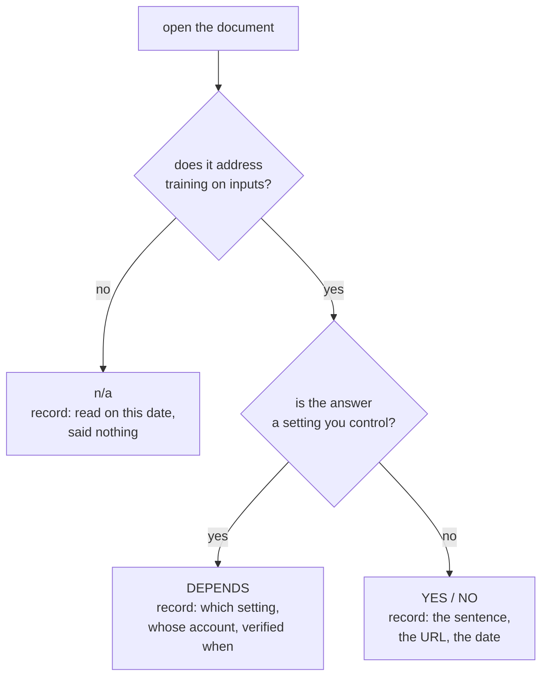

# 3.2 — The page that does not answer

## One-line answer

When a provider's page does not address whether it trains on what you send it, the honest row is
**"read on this date, did not say"** — and a row that guesses is worse than one that admits the
document was silent, because a guess is indistinguishable from a fact six months later.

## The story

Your bicycle is taken from the shed, so you get the home insurance booklet out.

It runs to forty pages. You read the part about theft, the part about outbuildings, and the list of
things that are never covered. The word "bicycle" is not in any of them. Not *bicycles are not
covered* — the word is simply not there.

Your neighbour says every home policy covers a bike up to five hundred pounds. That sounds about
right, and it is why people ring a claims line already believing something.

Then somebody points out that the booklet was never going to answer you. The booklet is the general
wording, the same for everybody on the street. Your answer is on the one-page schedule that came
with it, the sheet that lists which parts you actually bought — and there is a line about bicycles
on it, and it says the optional cover was not taken. The page you read first was silent rather than
wrong, which is exactly why reading it carefully did not help.

The schedule is also the page that quietly changed at the last renewal, and nobody wrote to tell
you which line moved.

## The idea in plain language

[3.1](3.1-three-providers-three-answers.md) read three providers' pages and got three different
answers. That is the visible half of the result. The half this part is about is what happens when
you open the page and it does not answer at all.

There are three things a document can do with the question *may you train on what my free tier
sends you?*, and `lab/terms.py` writes each one down as a different verdict.

| Verdict | What the document did | What the row then owes |
| --- | --- | --- |
| `YES` / `NO` | answered it | the sentence quoted, the URL, and the date it was read |
| `DEPENDS` | answered "it is a setting" | which setting, whose account, and who last looked at it |
| `n/a` | did not address it | that this page was read on this date and said nothing about it |

**`YES` and `NO` are the easy ones.** The page states a position, you quote the sentence, and the
row is a fact with a date on it. It can go out of date — everything below is about that — but while
it holds, anybody who doubts it can click the URL and read the sentence for themselves.

**`DEPENDS` is not a fact about the provider at all.** OpenRouter's page says you can choose, on
your account settings page, whether to allow routing to providers that may train on your data. So
the row is about **your account**, not about OpenRouter, and two engineers running the identical
model string are in different situations with no difference in the code to show for it. Worse, an
account setting is a thing a person can change — a colleague tidying up settings, a new account
created in a hurry for an evaluation — and nothing in your repository will notice. A `DEPENDS` row
is only worth having if it names who verified the setting and when.

**`n/a` is the row this part is named for, and it is the one people quietly convert into something
else.** The Groq privacy policy does not answer the question. It says it does not apply to
information processed as a data processor on behalf of customers of the Cloud Services, and it
points at the services agreement instead. Read on its own it is silent, and silence pulls in two
directions:

- Somebody reads the silence as **permission**: *the privacy policy does not say they train, so they
  do not.* That is the neighbour and the five hundred pounds.
- Somebody reads the silence as **prohibition**: *it does not say they may, so assume the worst.*
  This one feels safe, and it costs you something real — in this case it would have you avoiding
  the one provider of the three whose agreement flatly bars training.

Both are the same mistake, which is treating an absence of words as a statement. The only honest
move is to record the absence: this document, read on this date, does not address it — and then say
which document might. That is what makes the Groq pair of rows in `terms.py` useful rather than
untidy. One row says the services agreement answers `NO`; the row above it says the privacy policy
was read too, on the same day, and was silent. Together they tell you which document is
load-bearing, which is a thing you would otherwise have to rediscover every time.

## Why Sutra needs it

`terms.py` is deliberately a **record of a reading** rather than a live fetch, and its docstring
says why:

> a claim about a legal document has to be attributable to a document and a date, and a script that
> fetches on demand tells you what is true now while the lesson around it was written then.

That is the same discipline as `docs/PACKAGES.md`, which does not ask PyPI what version you have —
it records what was pinned, by whom, on which day. It is Principle 7, *never invent a version
number*, pointed at a legal document instead of a package: look it up live, write down what you
found, and date it.

The reason Sutra needs the `n/a` verdict specifically is that
[3.3](3.3-what-follows-for-sutra.md) turns this table into a decision that constrains every other
day of this curriculum. A decision is only as good as its worst row. If the Groq privacy-policy row
had been filled in by inference rather than by reading, the table would still print, the decision
would still be made, and nobody downstream could tell which rows were read and which were assumed.

## The mechanism

Start with the table, which is the summary, and note what the summary is careful **not** to do.

```bash
cd days/day-69-pii-and-data-boundaries/lab
uv run python terms.py
```

**Line by line:**

- `cd` into the lab first because these scripts import their siblings by plain name; run from the
  repository root and Python will not find `terms`.
- No flags prints the verdict column only. This is the view you would paste into a design
  discussion, and it is the view most likely to be wrong in a year, which is why every row carries
  its own URL and date rather than a footnote at the bottom.

Measured on 2026-09-06:

```text
may the provider train on what a free tier sends it?

  provider           trains   checked      source
  Gemini (unpaid)    YES      2026-09-06   https://ai.google.dev/gemini-api/terms
  Gemini (unpaid)    YES      2026-09-06   https://ai.google.dev/gemini-api/docs/pricing
  Groq               NO       2026-09-06   https://console.groq.com/docs/legal/services-agreement
  Groq               n/a      2026-09-06   https://groq.com/privacy-policy/
  OpenRouter         DEPENDS  2026-09-06   https://openrouter.ai/docs/features/privacy-and-logging
```

Five rows for three providers. The count is the first thing worth noticing: a provider is not a row,
a **document** is a row. Gemini appears twice because two pages address the question, and Groq
appears twice because one page answers it and one does not.

Here is the shape every row has to fill in:

```python
@dataclass(frozen=True)
class Row:
    """One provider's answer to: may you train on what the free tier sends you?"""

    provider: str
    trains: str
    url: str
    checked: str
    quote: str
```

**Line by line:**

- `@dataclass(frozen=True)` makes a row immutable after it is built. A record of a reading that
  code can edit at run time is not a record; freezing it means the only way to change what this file
  claims is to edit the file, in a commit, with a diff somebody can review.
- `provider` is the account you would be billed under, not the company — `"Gemini (unpaid)"` rather
  than `"Google"`, because the paid tier's answer differs and the tier is the part that decides.
- `trains` is a string rather than a boolean, and that is the whole design. A boolean has two states
  and the world has four: yes, no, it-depends-on-your-account, and the-document-did-not-say.
  Forcing `n/a` into `False` is precisely the conversion of silence into a claim that this part
  exists to stop.
- `url` and `checked` travel **together and inside the row**, not in a header comment. A citation
  without a date is a rumour with a link on it, and a date that is not next to the claim it dates
  will eventually be applied to the wrong claim.
- `quote` is the evidence. It is last because it is the longest field, and it is present so that
  nobody has to trust the `trains` column: the verdict is somebody's reading, and the quote is what
  they read.

And here is the entry that made the `n/a` verdict necessary — one element of the `ROWS` tuple,
shown on its own:

```python
Row(
    provider="Groq",
    trains="n/a",
    url="https://groq.com/privacy-policy/",
    checked="2026-09-06",
    quote=(
        'The privacy policy does not answer the question. It says it "does not apply to the '
        "information that we process as a 'data processor' on behalf of customers\" of the "
        "Cloud Services, and points at the services agreement instead. The page you would "
        "naturally read is the wrong page."
    ),
)
```

**Line by line:**

- `trains="n/a"` is a verdict, not a gap. There is a real difference between a row nobody has filled
  in and a row somebody filled in with *this document does not address it*, and the second one is
  worth writing precisely because it looks like the first.
- The `quote` field holds a description of the silence plus the sentence that produced it. That is
  the one case where the quote is not simply the answer copied out: you cannot quote a document
  saying nothing, so you quote the sentence that sends you somewhere else and you say where.
- *"The page you would naturally read is the wrong page"* is the finding. Somebody looking for a
  privacy answer opens the page called privacy policy, which is the reasonable thing to do and is
  how a whole team ends up sourcing its belief from a document that never made the claim.
- Keeping this row **next to** the Groq services-agreement row rather than deleting it is what makes
  the record honest. Delete it and the table still reads `Groq NO`, and the next person repeats the
  wasted reading.

The verdict a row gets is decided by two questions, in order:



Now the evidence, because a verdict column is a summary of somebody's reading and the wording is
what they actually read:

```bash
uv run python terms.py --quotes
```

**Line by line:**

- `--quotes` adds the sentences **after** the table rather than instead of it, so the verdict and
  the wording that produced it are always on the same screen. You cannot copy a verdict out of this
  script without the evidence for it being immediately below.
- The quotes are split on `" ... "` and printed one per line, so a row that leans on two separate
  sentences from one page shows them as two, rather than as a single run-on quotation that reads as
  one continuous passage the page never contained.

Measured on 2026-09-06:

```text
may the provider train on what a free tier sends it?

  provider           trains   checked      source
  Gemini (unpaid)    YES      2026-09-06   https://ai.google.dev/gemini-api/terms
  Gemini (unpaid)    YES      2026-09-06   https://ai.google.dev/gemini-api/docs/pricing
  Groq               NO       2026-09-06   https://console.groq.com/docs/legal/services-agreement
  Groq               n/a      2026-09-06   https://groq.com/privacy-policy/
  OpenRouter         DEPENDS  2026-09-06   https://openrouter.ai/docs/features/privacy-and-logging

  providers that DO train on free-tier content: Gemini
  Sutra's primary provider is Gemini. That is the whole of SEC-13.

  --- Gemini (unpaid) | 2026-09-06 ---
  https://ai.google.dev/gemini-api/terms
    "Google uses the content you submit to the Services and any generated responses to provide, improve, and develop Google products and services and machine learning technologies"
    "Do not submit sensitive, confidential, or personal information to the Unpaid Services." (section: How Google Uses Your Data, under Unpaid Services)

  --- Gemini (unpaid) | 2026-09-06 ---
  https://ai.google.dev/gemini-api/docs/pricing
    The pricing table's "Used to improve our products" row reads "Yes" for the free tier and "No" for the paid tier. Page footer: "Last updated 2026-09-04 UTC."

  --- Groq | 2026-09-06 ---
  https://console.groq.com/docs/legal/services-agreement
    "Groq is not permitted to use Inputs or Outputs for training or fine-tuning any AI Model Services or other models, unless explicitly granted permission or instructed by Customer." No free/paid distinction is drawn.

  --- Groq | 2026-09-06 ---
  https://groq.com/privacy-policy/
    The privacy policy does not answer the question. It says it "does not apply to the information that we process as a 'data processor' on behalf of customers" of the Cloud Services, and points at the services agreement instead. The page you would naturally read is the wrong page.

  --- OpenRouter | 2026-09-06 ---
  https://openrouter.ai/docs/features/privacy-and-logging
    "On your account settings page, you can set whether you would like to allow routing to providers that may train on your data."
    "There are separate settings for paid and free models."
    "This setting has no bearing on OpenRouter's own policies and what we do with your prompts." The answer is a setting, not a fact.
```

Read the Groq pair together. The agreement is a sentence you could put in front of a lawyer. The
privacy policy entry has no sentence to offer about training and says so. That asymmetry is what an
honest register looks like, and a register where every row is confident is a register where somebody
has been filling in the gaps.

The last piece is the mechanism that keeps the record from becoming folklore:

```bash
uv run python terms.py --recheck
```

**Line by line:**

- `--recheck` **prints commands rather than running them.** That is the deliberate part. A script
  that fetched the pages would give you a wall of HTML and a false sense that the row had been
  re-verified, when what has to happen is that a person opens the page and reads the section.
- The commands are `curl -s <url> | less` rather than a diff against a stored copy, because the
  question is not "did any byte change" — marketing pages change constantly — but "does this
  paragraph still say this". No script can answer that.
- Every row's URL is in the list, including the `n/a` one. The page that did not answer last time is
  exactly the page that might answer next time, so dropping it from the re-check would freeze the
  most fragile row in the table.

Measured on 2026-09-06:

```text
may the provider train on what a free tier sends it?

  provider           trains   checked      source
  Gemini (unpaid)    YES      2026-09-06   https://ai.google.dev/gemini-api/terms
  Gemini (unpaid)    YES      2026-09-06   https://ai.google.dev/gemini-api/docs/pricing
  Groq               NO       2026-09-06   https://console.groq.com/docs/legal/services-agreement
  Groq               n/a      2026-09-06   https://groq.com/privacy-policy/
  OpenRouter         DEPENDS  2026-09-06   https://openrouter.ai/docs/features/privacy-and-logging

  providers that DO train on free-tier content: Gemini
  Sutra's primary provider is Gemini. That is the whole of SEC-13.

# Re-verify every row above. Read the page yourself; do not trust this file's date.
curl -s https://ai.google.dev/gemini-api/terms | less
curl -s https://ai.google.dev/gemini-api/docs/pricing | less
curl -s https://console.groq.com/docs/legal/services-agreement | less
curl -s https://groq.com/privacy-policy/ | less
curl -s https://openrouter.ai/docs/features/privacy-and-logging | less
```

*"Do not trust this file's date"* is a strange line for a file to print about itself, and it is the
most useful line in it. The file's job is to tell you what was true on a day and to hand you the
five commands that tell you whether it still is.

## When it breaks

🎬 **The scene:** the table is read, the decision in [3.3](3.3-what-follows-for-sutra.md) is taken,
`terms.py` is committed, and the day is finished. Nobody touches it again. Seasons pass.

😬 **The naive fix:** none is attempted, because nothing looks broken. The script still runs. The
table still prints. The rows still carry URLs.

💥 **Why it fails:** every one of those rows is a claim about a document that other people are
editing without telling you. The Gemini pricing page in the table above carried *"Last updated
2026-09-04 UTC"* when it was read on the 6th — a two-day-old document. A provider can change a
tier's data handling, add a free tier, remove one, or move the answer to a different page entirely,
and the only thing in your repository that would notice is a person.

Watch the record age. There is no traceback in this section, and that absence **is** the finding:

```bash
cd days/day-69-pii-and-data-boundaries/lab
uv run python -c "
import datetime
import terms

MAX_AGE_DAYS = 90
for asof in (datetime.date.today(), datetime.date(2027, 1, 1)):
    stale = [r.url for r in terms.ROWS if (asof - datetime.date.fromisoformat(r.checked)).days > MAX_AGE_DAYS]
    print(f'as of {asof}: {len(stale)} of {len(terms.ROWS)} rows older than {MAX_AGE_DAYS} days')
"
```

**Line by line:**

- `datetime.date.fromisoformat(r.checked)` parses the `checked` string. It is stored as a string so
  that the row reads like the citation it is, and parsing it here is what turns a citation into
  something a check can reason about.
- The loop runs the same comparison twice against two different reference dates — today, and a date
  in the future — so the check demonstrates both of its states without anybody editing a file. This
  is an ablation in the sense Day 66 used the word: proving the check can go red is what makes its
  green meaningful.
- `MAX_AGE_DAYS = 90` is a choice, not a fact, and it belongs to whoever owns the register. Ninety
  days is one quarter, which is short enough that a terms change is caught in the same quarter it
  happened and long enough that nobody starts ignoring the warning.

Measured on 2026-09-06:

```text
as of 2026-09-06: 0 of 5 rows older than 90 days
as of 2027-01-01: 5 of 5 rows older than 90 days
```

Today the record is fresh, because it was read today. On the second line every row is stale, and
**nothing in this repository will print that line for you.** `terms.py` has no expiry: run it in a
year and it prints exactly the same five confident rows with a date on them that nobody reads,
because a date in a column is not a warning.

💡 **The insight:** a fact with a date on it is not self-maintaining. Somebody has to compare the
date with today, and "somebody will notice" is not a mechanism. The fix is to attach the re-reading
to something that already happens on a schedule. Addendum 02 already has one: the phase-gate
freshness check, which says to *"re-check all three providers' free limits"* and to amend the plan
first if a pinned model lost its free tier. That check exists because **quota** changes were seen to
move without notice. The terms move the same way and are checked by nobody, so the honest cadence
is to widen that existing gate — same providers, same pages, one more column — rather than to
invent a review nobody will attend.

The second break is subtler and shows up on a `DEPENDS` row. Somebody re-reads the OpenRouter page
at the phase gate, finds the wording unchanged, and marks the row verified. The wording *is*
unchanged. The account setting it refers to was changed by a colleague three weeks ago. Re-reading
the document verifies the document, and a `DEPENDS` row makes a claim about something the document
does not control — which is why its row owes a name and a date for the setting as well as for the
page.

## In production

**Who is actually allowed to make this claim.** Deciding what a provider's terms permit is a legal
question with an engineering consequence, and the two halves belong to different people. Legal,
procurement or a data protection officer owns the **verdict**: whether a contract permits sending a
class of data. Engineering owns the **evidence** and the **enforcement**: which endpoints exist,
what actually crosses them, and the check on the path that
[2.2](../02-where-the-copies-are/2.2-a-boundary-is-a-line-you-can-name.md) named. What happens in
practice is that an engineer answers the whole thing from a blog post or a summary table, because
the question arrives as *"can we send this to the model?"* in a stand-up and somebody has to answer.
The professional version is to answer with a row rather than a sentence — URL, quote, date — and to
route anything that reads `n/a` or `DEPENDS` to the person who can turn it into a contract. That is
not bureaucracy; it is the difference between a claim that survives being asked "who decided that?"
and one that does not.

**The free tier and the enterprise tier are different products with different answers.** The Gemini
pricing page above states it in one row: *"Used to improve our products"* reads Yes for the free
tier and No for the paid tier. That difference is the single most expensive assumption in this area,
and it is expensive in both directions. Somebody reads their employer's negotiated enterprise
agreement — real contractual promises about training, retention and human review — and then uses a
personal free key for a quick experiment on the same data, carrying the enterprise answer across a
boundary where it does not apply. Somebody else reads a free-tier warning and concludes the vendor
cannot be used for customer data at all, when the paid tier was purchasable. The underlying reason
is structural rather than commercial: a paid arrangement is a **contract you hold**, negotiated,
versioned and enforceable, while a free tier is a **published policy that can be changed
unilaterally** while you sleep. A register row must therefore name the tier, and any row whose tier
is blank is a row about nothing.

**What degrades at scale.** The register grows as providers × tiers × documents × regions, and each
cell is a page somebody has to have read. Aggregators multiply it again, because a routing decision
resolves to a downstream provider with its own policy. The scalable half is mechanical: fetch each
URL on a schedule, store a hash of the relevant section, and raise a ticket when it changes. The
half that does not scale is the verdict, because a page can be rewritten entirely without changing
its meaning, and can change meaning with one inserted word. So the automation is a **change
detector**, never a verdict generator, and a team that lets a diff tool populate the `trains` column
has automated the wrong half.

**The failure mode that only appears with real traffic.** The `n/a` rows are the ones that get
quietly resolved under pressure. Nobody argues with a row that says `YES`. But a row that says *the
document does not address it*, read at the moment a launch is waiting on an answer, is enormously
tempting to convert into whichever verdict unblocks the launch, and the conversion leaves no trace
because the row still has a URL and a date on it. The defence is that the `quote` field must contain
the sentence the verdict came from, so a verdict with no quotable sentence is visibly a verdict with
no evidence.

**The review comment a senior engineer leaves:** *"Row four says `n/a` and I want to keep it exactly
as it is — do not delete it because it looks untidy next to the `NO`. But two things are missing.
The `DEPENDS` row needs a person and a date for the account setting, not just for the page, because
re-reading the docs tells us nothing about whether somebody flipped that toggle. And this table has
no expiry: add the age check to the phase-gate freshness step we already run for quotas, so a
ninety-day-old row shows up as a finding instead of as a confident line of output."*

**The interview question:** *"You checked whether a provider trains on your data and the page
doesn't mention it. What do you write down?"* The answer that shows you have done this: *"That the
document was read, on that date, and did not address it — as a verdict of its own, not as a blank
and not as a no. Silence is not a denial and it is not permission, and both readings are the same
mistake. On our register that came up on Groq: the privacy policy is the page you would naturally
open and it explicitly does not cover data processed on behalf of customers, it points at the
services agreement — and the services agreement is the one that flatly bars training on inputs and
outputs. So we kept both rows, because the pair is what tells the next person which document is
load-bearing. I would add two things I have learned to insist on. A verdict of 'it depends on an
account setting' is not a fact about the provider, so its row needs a name and a date for who
verified the setting, not just for the page. And the register needs an age check wired into
something that already runs on a schedule, because the row does not get worse — it gets older, and
nothing fails when it does."*

## Check yourself

```bash
cd days/day-69-pii-and-data-boundaries/lab
uv run python terms.py --quotes
uv run python terms.py --recheck
```

Take the fourth `curl` line, open that page yourself, and try to answer the question this table
asks using **only** that document. Then write the row you would commit today, with its verdict, its
quote and today's date, and compare it with the row in the file.

**Out loud, without scrolling up:** say what the verdict `n/a` claims, what it does **not** claim,
and why a `DEPENDS` row needs a second date that a `YES` row does not.

**Next:** [3.3 — What follows for Sutra](3.3-what-follows-for-sutra.md).
