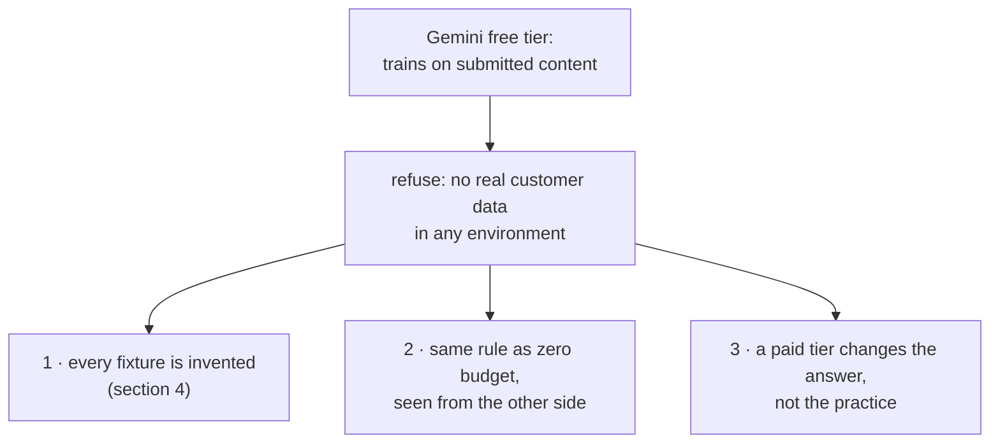

# 3.3 — What follows for Sutra

## One-line answer

Sutra's primary provider trains on free-tier content, so **no real personal data may enter this
repository** — a refusal rather than a worry, and one this curriculum has been quietly obeying since
long before anybody wrote it down.

## The story

You borrow a book from the library, and on page sixty there is a paragraph you want to keep.

You reach for a pencil and stop. Nobody told you not to write in it. There is no sign at the desk
and no line about it on the card. You just do not, because the book is not yours and somebody else
gets it next, in whatever state you leave it.

So you keep a notebook instead. Page number, the sentence, what you thought about it. For one book
that is slower than a pencil line in the margin, and it feels like a workaround.

Months later you buy a copy of a different book, your own, and you could write in it as much as you
like. You open the notebook anyway — because everything you have ever read is now in one place, and
a margin note only ever helps the person holding that particular copy.

The rule was about the borrowing. The habit turned out to be about the reading.

## The idea in plain language

Day 66 built a threat model and ended it with a vocabulary of exactly three words, one of which
every risk must get (Day 66, part 7.3, *Accept, mitigate, refuse*). The three are worth restating
here, because this part is a worked example of the third and hardest one:

| Verdict | What it means | What it obliges you to write down |
| --- | --- | --- |
| **accept** | we are not going to do anything about this | the conditions under which accepting is reasonable |
| **mitigate** | we are reducing it, and it will still be there | who is doing it, and when |
| **refuse** | we are giving up the capability that creates it | what we lose, and why that is affordable |

`mitigate` is the comfortable column. Nothing is given up, work is scheduled, and everyone leaves
the room feeling that a decision was made. `refuse` is the uncomfortable one: it costs a capability,
today, in exchange for a risk never arriving.

Section 3 has produced exactly one decision, and it is a refusal.
[3.1](3.1-three-providers-three-answers.md) read three providers' pages and found that the one Sutra
uses for nearly everything says yes, it may use free-tier content to improve and develop its
products, and tells you outright not to submit personal information to the unpaid services.
[3.2](3.2-the-page-that-does-not-answer.md) showed how that row is recorded so it can be checked
rather than believed. What follows is a single line:

> **Refused: real customer data in any environment this curriculum runs.** Not redacted first, not
> for one ticket, not on a laptop. It does not enter the repository, the fixtures, the lab or the
> prompt.

Say plainly what that costs, because a refusal that costs nothing was never a decision. It gives up
reproducing a customer-reported bug against the ticket that produced it. It gives up scoring the
redactor on the text it will actually meet. It gives up evaluating the desk on production samples.
Those are real losses, and they are affordable **here** for one reason: this curriculum has no
customers. That is the condition on the refusal, and it is the sentence Day 66 insists every verdict
carries.

## Why Sutra needs it

Because the decision is not new. It is already written into two documents, and this part is where
the reasoning behind them finally lands.

Addendum 02, the zero-budget addendum, has said it in its rules for the free lane since it was
written: *"Sutra's 'company data' is synthetic anyway (the plan already does this) — keep it that
way: **never feed real personal or employer data through free endpoints.**"* Read that sentence
carefully and notice what it does. It observes an existing practice, then makes it a rule — but
without a source for the claim about free endpoints, which is exactly what
[3.1](3.1-three-providers-three-answers.md) went and got.

Day 66's threat model then wrote the same thing as a row with a verdict on it, and named this day as
the justification. So every day from here has been leaning on a decision whose evidence did not
exist yet. This part supplies it, which is the only thing left to do.

## The mechanism

The input to the decision is the last two lines of the table, not the table itself:

```bash
cd days/day-69-pii-and-data-boundaries/lab
uv run python terms.py
```

**Line by line:**

- The five rows are the reading; [3.2](3.2-the-page-that-does-not-answer.md) is about how they are
  recorded and re-checked. This run is here for the summary the script computes from them.
- The summary is computed rather than typed — `terms.py` collects the providers whose `trains` field
  is `"YES"` — so it cannot drift out of step with the rows above it. Edit a row and the conclusion
  changes with it, which is the property a decision input needs.

Measured on 2026-09-06:

```text
may the provider train on what a free tier sends it?

  provider           trains   checked      source
  Gemini (unpaid)    YES      2026-09-06   https://ai.google.dev/gemini-api/terms
  Gemini (unpaid)    YES      2026-09-06   https://ai.google.dev/gemini-api/docs/pricing
  Groq               NO       2026-09-06   https://console.groq.com/docs/legal/services-agreement
  Groq               n/a      2026-09-06   https://groq.com/privacy-policy/
  OpenRouter         DEPENDS  2026-09-06   https://openrouter.ai/docs/features/privacy-and-logging

  providers that DO train on free-tier content: Gemini
  Sutra's primary provider is Gemini. That is the whole of SEC-13.
```

*Providers that DO train on free-tier content: Gemini.* Sutra's primary provider is the one on that
list. Nearly every model call this curriculum makes goes to a tier whose own terms say the content
may be used to improve and develop the provider's products and machine learning technologies.

That is not a scandal and it is not a reason to stop. It is a **fact about the environment**, and
the decision it forces is one row in a table Day 66 already built:

```bash
cd days/day-66-injection-threat-model/lab
uv run python -c "
import model
for verdict, what, why in model.DECISIONS:
    if verdict == 'refuse':
        print(f'{verdict}  {what}')
        print(f'          {why}')
"
```

**Line by line:**

- The filter is `verdict == 'refuse'` because those are the only rows that cost a capability. Day 66
  printed the `accept` rows alongside them; here the interest is narrower — what this curriculum
  gave up, and whether the reason still holds.
- The `why` column is printed this time, indented under its row. In Day 66's run it was dropped to
  show how short the list of real decisions is. Here the reason is the whole point, because it is
  the reason this part exists to check.

Measured on 2026-09-06:

```text
refuse  an outbound fetch tool in the answering path
          the trifecta closes without it; nothing we need requires it
refuse  real customer data in any environment this curriculum runs
          Addendum 02 and Day 69: synthetic only, and the free tier is the reason
```

The second row is this day's — one element of the `DECISIONS` tuple in
`days/day-66-injection-threat-model/lab/model.py`, shown on its own:

```python
(
    "refuse",
    "real customer data in any environment this curriculum runs",
    "Addendum 02 and Day 69: synthetic only, and the free tier is the reason",
)
```

**Line by line:**

- `"refuse"` and not `"mitigate"`. A mitigation would be *redact before sending*, and section 5 of
  this day measures what that would actually be worth: the redactor's recall on free text, which is
  the text a support desk is made of. A control you have measured and found leaky cannot be the
  reason you allow the data in.
- *"in any environment this curriculum runs"* is doing deliberate work. Not "in production", not "in
  the repository" — **any environment**, because
  [2.2](../02-where-the-copies-are/2.2-a-boundary-is-a-line-you-can-name.md) showed the crossing that
  matters is desk → provider, and a laptop reaches the same provider as a server does. A refusal
  scoped to production is a refusal that permits exactly the debugging session that breaks it.
- The `why` column names two sources rather than giving an argument, and that is the convention Day
  66 enforces: a row points at where the reasoning lives, so the table stays a table.
- *"and the free tier is the reason"* is the honest half of the sentence, and it is the one people
  leave out. The refusal is not a claim that this is how software should always be written. It is
  conditional on the tier — which means it has a trigger, and the trigger is somebody moving Sutra
  to a paid tier.

Three things follow from that row, and the rest of this day is built on all three.



**One: every fixture in this repository is synthetic, and that is an engineering practice rather
than a compromise.** Section 4 is where that argument is made properly, and this row is why it has
to be made at all. The archive this day measures against is invented down to the ranges the
telephone numbers come from — the drama range reserved by the regulator, and the domains RFC 2606
reserves for documentation — so that a fixture cannot reach a real person even if somebody runs it
by accident. Nothing about that is a downgrade from "real data we could not get". It is the only
kind of fixture you can commit to a public repository, hand to a stranger, paste into an issue, and
run against a provider that may keep it.

**Two: the zero-budget rule and this privacy rule are the same rule seen twice.** Addendum 02 exists
because Sutra spends nothing, and spending nothing is what makes ninety-seven days of daily model
calls possible for anyone with a laptop. The same sentence — *this runs on the free tier* — is
simultaneously the reason the curriculum is runnable and the reason it cannot hold a single real
person's data. There is no version of this project that keeps the first half and escapes the second.
That is the library book: the fact that it cost you nothing to open is the same fact that keeps the
pencil in your pocket.

**Three: a paid tier would change the answer and not the practice.** The Gemini pricing page read in
[3.1](3.1-three-providers-three-answers.md) says so in one row — *"Used to improve our products"* is
Yes for the free tier and No for the paid one. So paying moves the verdict. It does not move the
habit, for three reasons that have nothing to do with training. The provider still holds the text,
under a retention window somebody has to read. The other six stores from
[2.1](../02-where-the-copies-are/2.1-one-sentence-seven-places.md) still fill up, and a paid tier
says nothing about your own disk. And an erasure request still has to reach thirteen copies. A
practice that only holds while the tier is free is not a practice; it is a side effect of being
broke, and it evaporates on the day somebody adds a billing account — which is precisely the day the
system starts carrying real people.

## When it breaks

This rule has a boundary of its own, and it is worth naming before somebody walks over it.

🎬 **The scene:** a reader finishes this curriculum and takes the desk into a real support team. The
architecture carries across cleanly — the stores, the redactor, the boundary map, the gate. The
tickets, however, are now written by actual customers, and the provider is on a paid contract their
employer negotiated.

😬 **The naive fix:** carry the rule across as written. *No real customer data, ever.* It worked
here, it is strictly safer, and it is one line in a README.

💥 **Why it fails:** the rule is now false and it will be ignored within a week, which is worse than
never having written it. A support desk that may not hold customer text cannot answer a customer.
The refusal above was affordable because this curriculum has no customers, and that condition is the
first thing to go. Once a rule that cannot be followed is on the page, every rule beside it becomes
advisory.

💡 **The insight:** a refusal is a trade, and a trade has to be re-priced when the terms change. What
transfers is the **method** — read the tier's document, record it with a date, name the crossing,
put the check on it. What does not transfer is **this particular verdict**, which was one team's
answer to one set of conditions.

Concretely, here is what has to be re-derived and what can be carried over unchanged:

| Re-derive | Carry across unchanged |
| --- | --- |
| the provider row: which tier, which contract, what retention, who may read it | the method: quote, URL, date, verdict — including `n/a` |
| the verdict on customer data — almost certainly `mitigate`, not `refuse` | the four crossings and the rule on each ([2.2](../02-where-the-copies-are/2.2-a-boundary-is-a-line-you-can-name.md)) |
| retention and erasure, which are now live legal obligations rather than an exercise | the counting: one sentence, seven stores, thirteen copies |
| the redactor's recall, measured on real text | two doors, input and output ([2.4](../02-where-the-copies-are/2.4-the-reply-is-personal-data-too.md)) |

The fourth row is the trap, and it is the one most likely to be missed. This day's redactor scores
against an archive whose author also wrote the redactor, so section 4 spends a part on exactly that
circularity. Carrying a measured recall number from synthetic fixtures into a real desk is not
carrying a measurement across; it is carrying a flattering guess across and giving it a percentage
sign.

## In production

**"We do not send personal data" is a policy. It needs to be a tested property.** Those are
different things, and a team can hold the first with complete sincerity for years while the second
is false. A policy lives in a document and is enforced by everybody remembering it at the moment
they are busiest. A tested property lives in a check that fails, and the difference shows up on the
day a fixture is added in a hurry.

The version in this lab is one of `gate.py`'s six findings, and it is the smallest useful shape of
the idea:

```python
    # 6 - every fixture value is from a range reserved for fiction
    for ref in TICKETS:
        text = whole(ref)
        for addr in EMAIL_ANY.findall(text):
            if not SAFE_DOMAIN.search(addr):
                out.append(f"{ref} carries {addr!r}, which is not an RFC 2606 domain")
        for num in PHONE_ANY.findall(text):
            if not SAFE_PHONE.search(num):
                out.append(f"{ref} carries {num!r}, which is not a reserved drama number")
```

**Line by line:**

- It is an **allowlist, not a blocklist**. The check does not look for real addresses and real
  numbers, which is unbounded and hopeless; it asserts that every address matches the reserved
  documentation domains and every number matches a range regulators set aside for fiction. Anything
  else is a finding by default. Day 40's argument about allowlists
  ([1.3](../../../day-40-filtering-and-allowlists/parts/01-the-list-you-agreed-to/1.3-the-filter-is-on-your-side.md))
  is the same argument, pointed at data instead of tools.
- `whole(ref)` is used rather than the structured sender field, because
  [1.3](../01-who-a-record-names/1.3-the-box-marked-anything-else.md)'s finding is that the
  identifiers live in free text. A check that only inspects the typed fields inspects the half that
  was never the problem.
- The message names the ticket and quotes the offending value with `!r`, so a failure says which
  fixture and which string. A check that says "fixtures are unsafe" leaves the reader to do the
  search that the check just did.
- It runs over `TICKETS` — the whole corpus, every time — rather than sampling. The corpus is small
  by construction, and this is the check that must never pass by luck.

It is a check, so it must be able to go red. Put one plausible real address in a fixture and watch:

```bash
cd days/day-69-pii-and-data-boundaries/lab
uv run python -c "
import _archive
import gate

before = len(gate.findings())
sender, body = _archive.TICKETS['ticket:7004']
_archive.TICKETS['ticket:7004'] = ('t.abiodun@gmail.com', body)
after = gate.findings()
print(f'findings before: {before}   after: {len(after)}')
print(f'  - {after[-1]}')
"
```

**Line by line:**

- The ticket's body is kept and only the sender is replaced, so the single variable is the domain.
  The point is not that the fixture became unsafe in general — it is that changing `example.com` to
  a real mail provider is the entire distance between a committable fixture and one that is not.
- `gate.findings()` is called before and after, and the counts are printed together. Four findings
  before and five after is the evidence that this specific check moved, rather than that the gate
  was red anyway — which it is, because the build brief is not done.
- `after[-1]` prints the new finding. The fixture check appends last, so the tail is the line the
  edit produced.

Measured on 2026-09-06:

```text
findings before: 4   after: 5
  - ticket:7004 carries 't.abiodun@gmail.com', which is not an RFC 2606 domain
```

That is what the policy looks like when it has teeth: a sentence naming the record and the value,
produced by the same gate that has to be green before the day is finished.

**What degrades at scale.** One repository with one fixture corpus is easy. A real system has
fixture files in twenty repositories, snapshots taken from production for load testing, anonymised
exports for analytics, and screenshots in bug reports — and the check above only guards the corpus
somebody pointed it at. The organisational version is a scanner in continuous integration that runs
over the whole diff rather than over one tuple, and its hard problem is names: an address matches a
pattern and a person's name does not, which is section 5's finding arriving in a new place.

**The failure mode that only appears with real traffic.** Nobody violates this rule on purpose. It
gets violated by a bug reproduction at the worst moment, by an evaluation run on a sample of real
tickets because synthetic ones did not reproduce the failure, and by the most senior person present,
who is the one nobody stops. The mitigation is not more policy. It is that the path to the provider
carries the check, so the crossing is loud — which is what today's build brief asks for and why
`sutra/data_boundary.py` is a module rather than a paragraph.

**The review comment a senior engineer leaves:** *"I am happy with the refusal, and I want the
condition written in the row rather than in the day document, the way Day 66 asks. 'We refuse real
customer data' reads as a permanent principle, and it is not one — it is our answer while the
primary provider is a free tier whose terms say it trains on submissions. Write it so that moving to
a paid tier has to come back through this row, because otherwise the first person with a billing
account will assume the refusal expired and they will be half right."*

**The interview question:** *"Your project uses free model APIs. What does that mean for the data
you can put through it?"* The answer that shows you have done this: *"It means we refused real
customer data outright, and I can source that rather than assert it. We read the three providers'
pages on one day and recorded them with URLs and dates: our primary provider's unpaid terms say
submitted content is used to improve and develop their products and that human reviewers may see it,
and the page tells you not to submit personal information. So the verdict was refuse, not mitigate —
we could have said 'redact first', but we had measured our redactor on free text and it was well
under the floor we set, and you cannot use a control you have measured and found leaky as the reason
to let the data in. What I would emphasise is that the refusal came with its condition attached: it
is affordable because this system has no real customers, and the free tier is the reason it is
required. The same sentence makes the project runnable and makes it unable to hold personal data.
And the practice it produced — invented fixtures, from number ranges reserved for fiction, with a
check that fails if a fixture ever carries anything else — is one I would keep on a paid tier, where
the training answer flips but retention, our own seven stores and erasure are all unchanged."*

## Check yourself

```bash
cd days/day-69-pii-and-data-boundaries/lab
uv run python terms.py
uv run python gate.py; echo "exit: $?"
```

Write the refusal out as a Day 66 row of your own, in three columns: the verdict, what is refused,
and the **condition** it is affordable under. Then write the one sentence that would make the
condition false, and say which file in this repository would have to change first when it does.

**Out loud, without scrolling up:** say why this row is `refuse` rather than `mitigate`, and give
the one fact that is simultaneously the reason this curriculum can run at all and the reason it may
not hold real personal data.

**Next:** [4.1 — Why invent the customers](../04-invented-on-purpose/4.1-why-invent-the-customers.md).
