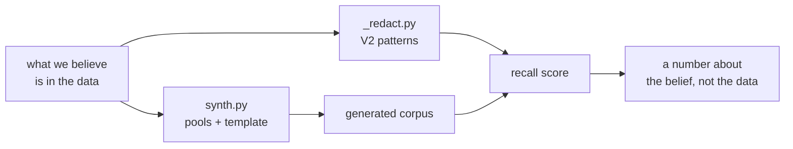

# 4.2 — A generator is a specification

## One-line answer

Writing the generator forces you to put every shape you believe your data contains into code, which
turns a belief you cannot argue with into a file you can read, diff and disagree with — and turns
the shapes you never thought of into a **visible absence** instead of an invisible assumption.

## The story

Somebody asks you to write down the thing you cook most often. You have made it since you were a
child, you have never once looked at a recipe for it, and you assume this will take three lines.

Onions. How many onions? Two, unless they are the big ones, and then one and a bit. Oil — you have
never measured the oil in your life; you pour until the bottom of the pan looks right, and you know
what right looks like and you cannot say it in millilitres. Then the salt, and here you stop
completely, because you genuinely do not know. You have salted this dish hundreds of times by taking
a pinch between two fingers, and there is no number anywhere in your head.

So you write *salt to taste*, which is what every recipe writes, and it is the phrase that means the
person writing it did not know either.

Your friend cooks it and it is not the same dish. Nothing in what you wrote is wrong. The parts you
had never once had to say out loud are the parts that did not travel — and you only found out which
parts those were at the moment you tried to write them down.

## The idea in plain language

A generator is a **specification that runs**.

That sounds like a slogan, so here is the concrete version. Somewhere in every project there is a
sentence like *"we remove personal data before it leaves the system"*. It sits in a policy document
or a design note or a ticket description, and everybody who reads it nods, and nobody can tell you
what it covers. It cannot be tested. It cannot be wrong in a way anybody notices. And crucially, it
cannot be **incomplete in a way anybody notices**, because prose has no shape — a paragraph that
never mentions postcodes reads exactly like a paragraph that decided postcodes do not matter.

A generator is the same belief written so that a machine can act on it. Every pool of values in it
is a claim: *our customers' addresses look like this*. Every template is a claim: *our tickets are
laid out like this*. Every identifier the generator inserts is a claim that this kind of thing
appears in this kind of place.

Written that way, the belief gains three properties it did not have as prose.

**You can read it for what is missing.** The pools are a list. A kind of identifier with no pool is
a kind of identifier you do not believe is in your data, and it is visible as a gap in a short file
rather than as a silence in a long paragraph. When [4.1](4.1-why-invent-the-customers.md) counted
three kinds against the answer key's six, that count came from reading the pools. Nobody could have
counted the missing three out of a policy document.

**You can diff it.** A change of belief becomes a commit with a date, a message and an author. Six
months later, when somebody asks why the generator started emitting postcodes, the answer is in the
history rather than in somebody's memory. The generator becomes the place where *what counts as
personal data here* is versioned, which is exactly what a specification is for.

**You can run it.** Two hundred examples of the belief, on demand, that you can look at. A
specification you can only read is checked by reading, which is to say checked by whoever is least
tired; a specification you can run produces evidence.

This is where the two ideas from section 1 land in code.
[1.1](../01-who-a-record-names/1.1-the-list-of-fields-is-not-the-answer.md) argued that a list of
field names is not a definition of personal data, and here is the list, in the open, short enough to
count. [1.3](../01-who-a-record-names/1.3-the-box-marked-anything-else.md) argued that most of the
identifiers on a support desk are in free text rather than in fields, and the generator has to take
a position on that too: it decides what goes in the body and where in the body it goes. There is no
way to write a generator without answering both questions, which is the point. Prose lets you not
answer them.

## Why Sutra needs it

The generator and the redactor are the same list of shapes, written twice.

`lab/_redact.py` holds the redactor's patterns. Its `V2` dictionary contains six regular
expressions: an address, three telephone shapes, a postcode and an account number — and the account
pattern, `\b\d{2}-\d{4}\b`, is not a general rule about the world at all. It is knowledge about this
specific desk, which is the argument
[1.4](../01-who-a-record-names/1.4-the-number-that-only-means-something-here.md) makes.

`lab/synth.py` holds the generator's pools, and they encode the same knowledge from the other side:
addresses shaped like `x.surname@example.com`, telephone numbers shaped like `07700900xxx`, account
numbers shaped like `NN-NNNN`. One file says *this is what we look for*. The other says *this is
what is there*. Section 5 then scores the first against the second and calls the result recall.

Two views of one belief is a useful arrangement right up until you notice that a belief agreeing
with itself is not evidence. That is where this part stops and
[4.3](4.3-the-corpus-that-flatters-your-detector.md) starts.

## The mechanism

Open `lab/synth.py` and read the top of the file before any function. Everything the generator
believes is in these four tuples.

```python
SURNAMES = ("menon", "zhou", "abiodun", "silva", "okafor", "nguyen", "kowalski", "rahimi")
DOMAINS = ("example.com", "example.net", "example.org")
SUBJECTS = (
    "Invoice shows the wrong company name.",
    "Charged twice in one month.",
    "Cannot change the billing email.",
    "Downgrade did not take effect.",
    "The export is missing the tax registration number.",
)
CLOSERS = (
    "Please advise.",
    "Let me know if you need anything else.",
    "Thanks in advance.",
)
```

**Line by line:**

- `SURNAMES` is a claim about who the customers are. Eight surnames from several naming traditions,
  because a pool of eight English surnames would produce a corpus on which any name detector looks
  far better than it is. The pool is small and that is a limitation the part returns to below.
- They are lower case, which is not cosmetic. They are lower case because they are about to be
  spliced into an email address, and the generator only ever uses them there. A surname pool that
  never produces a capitalised human name is a generator that has silently decided names do not
  appear in ticket bodies — and the hand-written archive has `Raghav Menon`, `Lin Zhou` and
  `Joan Whitfield` in exactly that position. The absence is right there in the case of the strings.
- `DOMAINS` is three domains RFC 2606 reserves for documentation. Nobody can register them, so no
  generated address can deliver mail to a real person. Compare Principle 13: the containment arrives
  with the capability, in the pool rather than in a warning comment.
- `SUBJECTS` is a claim about what customers write about — billing, plans, exports. Five of them.
  Notice what is not there: no complaint about an agent's tone, no password reset, no call note
  written by a member of staff. The hand-written archive has all three, and each one is where an
  identifier hides that the generator will never produce.
- `CLOSERS` is a claim about how a message ends. Three neutral sign-offs, none of which contains a
  name. This single choice is why the generated corpus has no names in sign-offs, which is the exact
  shape [1.3](../01-who-a-record-names/1.3-the-box-marked-anything-else.md) opened with. Writing
  `CLOSERS` down is the moment you find out you had never decided whether your customers sign their
  messages.
- All four are tuples rather than lists, so nothing downstream can append to them. A pool that can
  be mutated at run time is a specification that changes while it is being used.

Now the template that assembles them, from inside `make`:

```python
        text = (
            f"From: {email}\n\n{rng.choice(SUBJECTS)} Account {account}. "
            f"Reachable on {phone}. {rng.choice(CLOSERS)}"
        )
        out.append((text, [email, phone, account]))
```

**Line by line:**

- `f"From: {email}\n\n..."` reproduces the shape the desk actually stores: a sender line, a blank
  line, then the body. `_archive.py`'s `whole()` builds the hand-written tickets the same way, so a
  redactor cannot tell the two corpora apart by their layout.
- The address is placed in the `From:` line **and only there**. That is a claim, and it is the claim
  [1.3](../01-who-a-record-names/1.3-the-box-marked-anything-else.md) spent a part disproving: in
  the real archive an address also turns up inside a sign-off and inside a quoted reply, so the same
  value exists in two places with two completely different natures. The generator believes in one.
- `Account {account}.` places the account number mid-sentence in free text, which *is* faithful —
  this is the generator getting something right that a field-based mental model would get wrong.
- `Reachable on {phone}.` places the telephone number in prose too, with a full stop straight after
  it. Every generated number therefore sits between a space and a full stop, which is the
  friendliest possible neighbourhood for a regular expression with `\b` word boundaries at both
  ends. Nothing
  here is wrong. It is simply the easy version of a hard problem, and 4.3 measures how easy.
- The template is one f-string with no branches. There is no path in which a ticket has two
  identifiers instead of three, or none, or an identifier inside a quoted block. Every generated
  ticket has exactly the same anatomy.
- `out.append((text, [email, phone, account]))` is the specification producing its own answer key.
  The three values were substituted in, so they are known to be present. Compare `_archive.py`,
  where a person had to read fourteen tickets and hand-write twenty `Item` rows — that key can
  contain things nobody generated, and this one, by construction, cannot.

Run it and look at what those claims produce.

```bash
cd days/day-69-pii-and-data-boundaries/lab
uv run python synth.py
```

**Line by line:**

- No flags, so the seed is `1` and the corpus is the one this document was written against.
- The script prints the first two of the two hundred, then the identifier list for each, so the
  specification and its consequence are on screen together.

Measured on 2026-09-06:

```text
generated 200 tickets from seed 1. The first two:

    From: s.abiodun@example.com

    Downgrade did not take effect. Account 25-9117. Reachable on 07700900261. Let me know if you need anything else.
    -> contains ['s.abiodun@example.com', '07700900261', '25-9117']

    From: z.kowalski@example.com

    Downgrade did not take effect. Account 72-1464. Reachable on 07700900096. Let me know if you need anything else.
    -> contains ['z.kowalski@example.com', '07700900096', '72-1464']
```

Now put that beside a ticket nobody generated —
[1.3](../01-who-a-record-names/1.3-the-box-marked-anything-else.md) quotes it in full — and read the
two as if you were the redactor:

```text
Forwarding from the customer:

> From: p.oyelaran@example.net
> I have been charged twice this month. Both charges show on the card ending 4417.
> Please call me on 07700 900142 before 5pm.

Assigning to billing.
```

Three differences, and every one of them is a sentence the generator does not contain. The address
is inside a quoted reply rather than in the sender field. The telephone number has a space in the
middle of it, because a person typed it for another person to read. And `card ending 4417` is a kind
of identifier that has no pool at all — there is no `CARDS` tuple in `synth.py`, so no run of the
generator, at any size, with any seed, will ever produce one.

That is the whole idea of this part, and it is worth stating as plainly as possible: **the missing
`CARDS` tuple is the honest form of a belief nobody ever wrote down.** In a policy document the
same belief is invisible. In this file it is a gap in a list of four things, and anybody reading the
first page of the script can see it.

Which sets up the correspondence section 5 runs on:



The generator writes the belief forwards, into data. The redactor writes the same belief backwards,
into patterns. Scoring one against the other closes a loop that never leaves the author's head.

## When it breaks

The break is not in the generator. The generator is doing exactly what it was told.

🎬 **The scene:** you have written the pools, you have written the templates, and you have written
the redactor's patterns. All three came out of the same afternoon and the same head, because that is
how one person builds a thing. You run the score and it is excellent.

😬 **The naive fix:** trust it, and move on to the next task. The number is high, the code is
committed, the tests are green. Nothing about the situation looks like a problem.

💥 **Why it fails:** the generator emits the shapes its author thought of, and the redactor matches
the shapes its author thought of, and it was the same author. `synth.py` puts an address in a
`From:` line and `_redact.py` has a pattern for addresses. `synth.py` puts `07700900261` in prose
and `_redact.py` has `\b0\d{10}\b`. Every value in the corpus was placed by a template written by
the person who also decided what to look for. A score computed on that pairing measures the
consistency of one person, and consistency is the thing you can be most confident of.

💡 **The insight:** the generator being a specification is exactly what makes this trap so easy to
walk into. A specification is *supposed* to be the thing you build against, so building the detector
against it feels like doing the job properly. The missing step is that a specification is a
statement about the world which the world has not yet confirmed, and the confirmation cannot come
from the specification.

Everything after this sentence is a measurement, and it belongs to the next part.
[4.3](4.3-the-corpus-that-flatters-your-detector.md) scores this redactor against this generated
corpus and against the fourteen hand-written tickets, and the two numbers are twenty points apart.

## In production

**What a professional writes instead.** They keep the generator honest by **feeding it from
incidents**. Every time a real identifier gets through — reported by a customer, found in an audit,
spotted by somebody reading a log — the shape goes into the generator as a new pool or a new
template branch, in the same commit as the fix to the detector. The generator stops being a thing
one person wrote once and becomes a growing record of everything the system has been surprised by,
which is the only way a specification written from imagination converges on reality.

**Version-control it as a specification, not as a test helper.** That means three habits. The pools
live in one place and are named after what they claim, not after where they are used. A change to a
pool gets a commit message saying what was learned and where — *"tickets can carry a card fragment;
seen in INC-2291"* — because in a year that message is the only surviving explanation. And the file
is reviewed by whoever owns the privacy question, not only by whoever owns the code, because the
diff is a change to what the organisation believes personal data is.

**What changes at ten thousand.** The pools become the bottleneck rather than the volume. Eight
surnames across two hundred tickets is twenty-five repeats each; across ten thousand it is more than
a thousand, and any detector with a memory — an embedding model, a cache keyed on text, a learned
classifier — starts recognising the pool rather than the shape. The generated corpus develops a
signature. Teams handle this by drawing from large public name and address lists rather than
hand-typed tuples, and by asserting in a test that no single generated value appears more than some
small number of times.

**The failure that only shows with real traffic.** Templates cannot drift, and real writing does.
The generator's ticket bodies will read the same way in three years; real ones will not, because the
product will have changed, the support macros will have changed, and customers will have started
pasting in whatever their new phone puts on the clipboard. A generator that is not fed from
incidents ages into a portrait of the traffic on the day it was written, and it goes on producing a
confident score the entire time.

**The review comment a senior engineer leaves:** *"This generator is our written definition of what
personal data looks like here, so review it as one. It has pools for three kinds and our answer key
has six — no names, no postcodes, no card fragments — and every telephone number it emits is
surrounded by whitespace, which is the one case our regular expression is guaranteed to catch. Add
the missing kinds, add one template that puts an identifier inside a quoted reply, and put the
incident reference in the commit message when you do."*

**The interview question:** *"How do you decide what your test data should contain?"* The answer
that shows you have done this: *"I write the generator first, and I treat it as the specification,
because it is the only document about our data that cannot be vague. On a support archive I wrote
pools for addresses, telephone numbers and account numbers, and the act of writing the sign-off
template is what made me realise I had never decided whether customers sign their messages — our
hand-labelled sample had three names in sign-offs and my generator could not produce one. After that
I fed the generator from incidents: whenever something got through in production, the shape went
into the pools in the same commit as the detector fix, with the incident reference in the message.
And I stopped scoring the detector on the generated corpus, because the generator and the patterns
were both mine and they agreed with each other by construction."*

## Check yourself

```bash
cd days/day-69-pii-and-data-boundaries/lab
uv run python synth.py
```

Read the four pools at the top of `synth.py`, then read the twenty `Item` rows in `TRUTH` at the
bottom of `_archive.py`. Write down every `kind` in the answer key that has no pool in the
generator, and for each one write the single line you would add to `synth.py` to fix it.

**Out loud, without scrolling up:** say what a missing tuple in a generator tells you that a missing
sentence in a policy document does not.

**Next:** [4.3 — The corpus that flatters your detector](4.3-the-corpus-that-flatters-your-detector.md).
