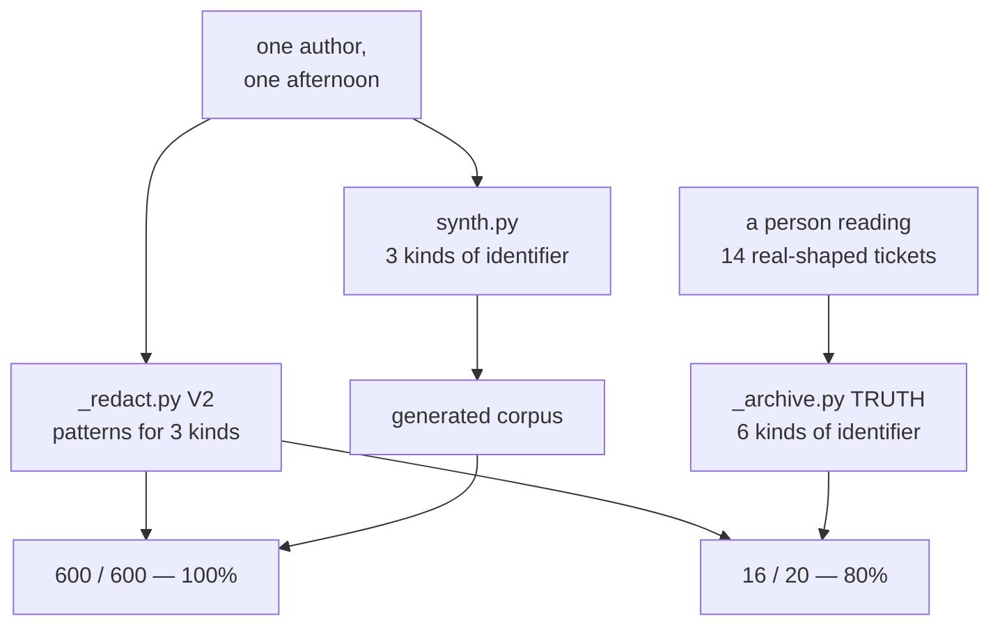

# 4.3 — The corpus that flatters your detector

## One-line answer

A generator emits the shapes its author thought of and a redactor matches the shapes its author
thought of, so when the same person wrote both, the score measures the person: **100%** on two
hundred generated tickets against **80%** on the fourteen hand-written ones, and the twenty-point
gap is not a better redactor.

## The story

Four of you go away for a few days and share the costs, and at the end somebody has to work out who
owes what.

You volunteer. You collect the receipts, you type each amount into the calculator on your phone in
the order the receipts are stacked, and you get a total. Then you stop, because it feels high, and
you do the sensible thing: you check it. You go back to the top of the stack and add the same
amounts again, in the same order, on the same phone.

Same total. You relax. It has been checked.

On the train home somebody mentions the taxi from the station on the first night, which they paid
for and which you have never seen a receipt for, because there was never a receipt. It was not in
the stack. It was not in either addition. Both of your totals were arithmetically perfect and both
of them were answers to the question *what do these receipts add up to*, when the question everybody
actually cared about was *what did the trip cost*.

You did not check your work. You re-ran it.

## The idea in plain language

Two files in this lab were written by the same person in the same sitting.

`synth.py` decides what goes into the data: an address in a `From:` line, an account number
mid-sentence, a telephone number with a full stop after it. `_redact.py` decides what to look for: a
pattern for addresses, a pattern for eleven-digit numbers, a pattern for `NN-NNNN`. One writes the
belief forwards into text; the other writes the same belief backwards into regular expressions.
[4.2](4.2-a-generator-is-a-specification.md) called those two views of one belief, and that framing
was doing useful work right up to this point.

Score one against the other and you have added the receipts twice. The result is not a measurement
of the redactor. It is a measurement of whether one person was internally consistent across an
afternoon, and people are very consistent across an afternoon. The number comes out high, it comes
out high for a reason that has nothing to do with quality, and it comes out high **in exactly the
situations where you have the least independent evidence** — a new detector, a new codebase, a rare
identifier kind somebody has just added.

Be precise about the direction of this finding, because it is easy to overstate and the overstated
version is wrong. The generated corpus is **not incorrect**. Every ticket in it is well formed,
every identifier in it is genuinely an identifier, and the answer key attached to it is exact rather
than approximate. It is not a corpus of lies. It is a corpus that is **easy**, and easy in one
specific and traceable way: every value in it was placed by a template that the redactor's author
also wrote. The address is in the position the pattern expects. The telephone number has no space in
it, because the template did not put one there. Nothing is hidden, nothing is quoted, nothing is
signed off by a human being with a name.

The shape of this is not new to Day 69. Day 67, part 5.4, ran the same experiment on a guardrail:
the ladder of checks scored **6 of 6** against the fixtures its author had written, and **2 of 5**
against the same instruction rewritten by somebody trying to get past it — and **0** when the
instruction was split across two rows. Different subject, different mechanism, identical failure. A
detector scored against the imagination that produced it reports the size of that imagination.

## Why Sutra needs it

Section 5 is about to produce the numbers this day is built on: recall on structured fields, recall
on free text, and the gap between them. Section 6 then measures a deletion sweep across seven
stores. Those numbers go into a checklist, and from a checklist they go into the kind of sentence
that gets quoted in a review — *"the redactor catches 80% of the identifiers in the archive"*.

Whether that sentence is worth anything depends entirely on which corpus it was measured against,
and this part is where the day settles that. Every recall figure from
[5.1](../05-measuring-the-redactor/5.1-the-answer-key-comes-first.md) onwards is measured against
`_archive.py` — the fourteen tickets a person wrote and hand-labelled — and never against the two
hundred the generator produced. That is a deliberate constraint, and this is the measurement that
justifies paying its cost.

## The mechanism

`synth.py --score` runs one redactor over two corpora and prints both numbers next to each other.
The redactor is `V2` from `_redact.py` in both cases: same patterns, same code path, same call. Only
the data differs.

```python
def recall(pairs: list[tuple[str, list[str]]]) -> tuple[int, int]:
    """(found, total) for a list of (text, identifiers-it-contains)."""
    hits = 0
    total = 0
    for text, wanted in pairs:
        seen = found(text, V2)
        for value in wanted:
            total += 1
            hits += value in seen
    return hits, total


def real_recall() -> tuple[int, int]:
    """The same score against the hand-written archive, which nobody generated."""
    hits = 0
    total = 0
    cache: dict[str, set[str]] = {}
    for item in TRUTH:
        if item.ref not in cache:
            cache[item.ref] = found(whole(item.ref), V2)
        total += 1
        hits += item.value in cache[item.ref]
    return hits, total
```

**Line by line:**

- `found(text, V2)` is the redactor, unchanged, from `_redact.py`. It returns the **set of distinct
  substrings** the patterns matched — the matched text itself, not the spans — so a value can be
  looked up in it directly.
- `hits += value in seen` is the scoring rule, and it is deliberately generous: an identifier counts
  as found if the redactor matched that exact string anywhere in the ticket. No credit is given for
  a near miss and no penalty is charged for matching something harmless, because recall is the
  question this day cares about. A stricter rule would make both numbers worse without changing the
  gap between them, which is the finding.
- `total` is incremented once per identifier in the key rather than once per ticket. A ticket
  carrying three identifiers is three chances to be wrong, which is the right denominator: the
  question is *how many of the people in this archive are still named*, not *how many tickets were
  touched*.
- `recall` takes `pairs` — the `(text, identifiers)` tuples `make` produced in
  [4.1](4.1-why-invent-the-customers.md). The answer key came out of the generator at the moment of
  generation and is therefore exact and free.
- `real_recall` takes no arguments at all, because its data is not a parameter. It walks `TRUTH`,
  the twenty hand-written `Item` rows in `_archive.py`, each one typed by a person who read a ticket
  and decided a value in it named somebody. That key cost effort and it is the only thing in this
  lab that the generator did not produce.
- `whole(item.ref)` rebuilds the ticket exactly as the desk stores it — `From:` line, blank line,
  body — which is what a redactor actually receives. Scoring against the body alone would quietly
  hand back the field identifiers for free.
- `cache` exists because `TRUTH` lists several identifiers per ticket and running six regular
  expressions over the same text once per identifier would be wasteful. It changes no number; it is
  keyed on `item.ref`, and every row with the same `ref` sees the same match set.
- The two functions return `(hits, total)` rather than a percentage. The percentage is computed once
  at the point of printing, so the raw counts stay visible — `16 of 20` says something that `80%`
  does not, which is that the whole archive is twenty identifiers and four of them are still there.

Run it:

```bash
cd days/day-69-pii-and-data-boundaries/lab
uv run python synth.py --score
```

**Line by line:**

- `--score` switches the script from printing sample tickets to scoring, and it uses the same seeded
  generator, so the two hundred tickets being scored are the ones the previous two parts printed.
- The seed is echoed in the heading, because a recall number without the corpus it was measured on
  is not a fact anybody can check.

Measured on 2026-09-06:

```text
redactor V2, scored two ways (seed 1)

  corpus                      found    of   recall
  generated (200 tickets)       600   600     100%
  hand-written (14 tickets)      16    20      80%

  the generated corpus is 20 points easier, and it is not a better redactor.
```

Six hundred of six hundred. Not one miss in two hundred tickets. If that number were the one on the
dashboard, there would be nothing left to do on this day.

Sixteen of twenty on the hand-written archive, and the four that got away are worth naming, because
each is a shape the generator cannot produce:

| Missed | Ticket | Why the redactor did not find it |
| --- | --- | --- |
| `Raghav Menon` | 7001 | A name in a sign-off. `V2` has no name pattern, and section 5 explains why no version of it will |
| `Lin Zhou` | 7006 | The same, under a `--` separator, with the address and telephone number beneath it |
| `Joan Whitfield` | 7012 | The same again, after `Regards` |
| `4417` | 7002 | A card fragment inside a quoted reply. Four bare digits match nothing in `V2` |

Now compare that column against `synth.py`'s pools. There is no name pool, so no generated ticket
has a name in it. There is no card pool, so no generated ticket has a card fragment. `CLOSERS`
contains three sign-offs and not one of them is a person's name. **Every single identifier the
redactor missed is a kind the generator does not emit** — which is not a coincidence and is not bad
luck. It is the same list of shapes, twice, agreeing with itself.



The left-hand path is a closed loop: the arrow that produced the data and the arrow that produced
the detector both start at the same box. The right-hand path has a second source in it, and that
second source is the only reason the day learns anything.

Two more things about the twenty-point gap, both of which matter when somebody argues with you about
it.

**It is a floor, not a ceiling.** The hand-written archive is fourteen tickets that one person
wrote. A person writing fixtures is still imagining, just imagining differently and with more
patience — [1.1](../01-who-a-record-names/1.1-the-list-of-fields-is-not-the-answer.md) already
pointed out that `ticket:7011` names somebody by description and the answer key deliberately does
not count it. Against genuinely uncontrolled traffic the number would be lower again. The honest
claim is *"at least twenty points of the generated score was free"*, not *"the true recall is 80%"*.

**Making the generator bigger cannot close it.** Raise `n` to twenty thousand and the left-hand
number stays at 100%, because every extra ticket is drawn from the same four pools through the same
template. Volume is not variety. The gap closes only when a *different source of belief* enters the
picture, and there is no flag on this script that does that.

## When it breaks

The wrong lesson to take from the table above is that synthetic data is untrustworthy. It is not,
and everything [4.1](4.1-why-invent-the-customers.md) argued still holds: the reproducibility, the
shareability and the ability to place the rare case on purpose are all real, and none of them is
damaged by anything measured here. The generated corpus is doing its job perfectly. It is being
asked the wrong question.

🎬 **The scene:** a reviewer reads the 100% and asks, reasonably, whether the team should stop
maintaining the awkward little hand-written archive and just generate everything. It is fourteen
tickets against two hundred, one of them costs somebody an afternoon of careful reading and the
other costs a command.

😬 **The naive fix:** delete `_archive.py`'s `TRUTH`, generate a much larger corpus with more pools
and more templates — names this time, and card fragments, and a quoted reply — and score against
that. The generator now covers all six kinds. The gap disappears.

💥 **Why it fails:** the gap disappears because the second measurement was deleted, not because the
redactor improved. Whoever adds a name pool to the generator will add it in the shape they also
teach the redactor to find, in the same sitting, for the same reason as last time. The loop has been
made wider and it is still a loop. The number goes back to 100% and now there is nothing in the
repository that can ever contradict it.

💡 **The insight:** the rule is not *stop generating*. The rule is **never score on a corpus you
generated from the same beliefs as the detector.** Generate all you like — for regression tests, for
load, for the rare case, for CI — and keep one corpus that the detector's author did not write, and
report that one.

**What a held-out set looks like here**, concretely, so this is not just advice:

- It is **small**. Fourteen tickets and twenty labelled identifiers is enough to move a percentage
  by five points, which is enough to argue about. Held-out sets fail from being unmaintained far
  more often than from being small.
- Its **labels are written before the detector is run**, never derived from the detector's output.
  `_archive.py` says this in its own docstring, and it is the same rule Day 50 followed when it
  wrote the gold set before tuning a chunk size.
- It contains **kinds the detector has no pattern for**. A held-out set with nothing unfamiliar in
  it is a regression fixture wearing a different name. The three names and the card fragment above
  are not an oversight in the archive; they are the reason it exists.
- It is **refreshed from incidents**, not written once. Every real miss becomes a row.
- **Somebody other than the detector's author writes it.** This is the load-bearing rule and it is
  the one that gets negotiated away, because it costs another person's attention. On a small team it
  can be as light as one colleague reading a sample and labelling it before seeing your patterns —
  the requirement is independence of belief, not headcount. If it genuinely has to be you, then put
  the greatest possible distance in: label the sample first, from real-shaped text you did not
  compose, and do not look at your own patterns until the labels are committed.

## In production

**How this failure looks in a report.** It does not look like a failure. It looks like a
paragraph saying the detector achieves 100% recall on a two-hundred-record corpus, with the
methodology written out honestly and the corpus committed to the repository so anybody can check it.
Everything in it is true. The detector then ships, meets traffic, and behaves quite differently —
and the difference does not arrive as an alert, because the whole subject of this day is that
missing an identifier is silent. It arrives as a customer noticing their name in a place it should
not be, or as an auditor asking which sample the number came from. The gap between the report and
the behaviour was never a lie; it was a category error about what the number described.

**The practice that prevents it.** Report the corpus with the number, always, in the same sentence:
*"80% on the fourteen hand-labelled tickets; 100% on the generated regression set"*. Two numbers,
each named, is not more complicated than one and is the difference between a measurement and a
slogan. Then make the discipline mechanical rather than remembered — the scoring job reads the
held-out set and the regression job reads the generated one, and they are separate jobs so that
nobody can quietly point one at the other's data. And put the held-out recall in the runbook next to
the thing it constrains, so that raising it is a decision somebody makes rather than a side effect
of an afternoon's refactoring.

**What changes at ten thousand.** The two corpora diverge in cost and therefore in attention. The
generated one grows for free and ends up in every dashboard, every test count and every graph; the
held-out one stays small because every row is somebody's careful reading, and it slowly stops being
refreshed. Within a year the only number anybody quotes is the one from the corpus that measures the
least. The countermeasure is a budget rather than an intention: a standing allocation of labelling
effort per quarter, and a rule that a detector change cannot ship without the held-out number being
re-measured, however old the set is.

**The review comment a senior engineer leaves:** *"100% recall on data we generated is not a result,
it is a consistency check on the generator. Same author, same afternoon, same list of shapes — of
course the patterns match. Give me the number on the hand-labelled archive, and put both figures in
the summary with the corpus named next to each. Ours is 16 of 20, and all four misses are kinds the
generator cannot produce, which tells you the generated number was never going to find them."*

**The interview question:** *"Your detector scores 100% on your test set. What do you do next?"* The
answer that shows you have done this: *"I find out who wrote the test set. On a support archive I
had a redactor at a hundred per cent across two hundred generated tickets and eighty per cent — 16
of 20 — on fourteen tickets a person had hand-labelled, and the twenty-point gap was not a quality
difference. Every value in the generated corpus had been placed by a template I wrote, and the
patterns were mine as well, so the score was measuring my consistency. All four misses on the real
archive were kinds my generator had no pool for: three names in sign-offs and a card fragment inside
a quoted reply. I had seen the same shape on a guardrail earlier in the year — six of six on the
author's own fixtures, two of five against somebody rewriting the instruction. So the practice I
took away is that you can generate as much as you like, but you never report a number measured on a
corpus that came out of the same beliefs as the detector, and the held-out set has to be written by
somebody else."*

## Check yourself

```bash
cd days/day-69-pii-and-data-boundaries/lab
uv run python synth.py --score
uv run python synth.py --score --seed 7
```

The generated recall will not move. Say why a different seed cannot change it, and then say what
kind of change to `synth.py` could — and whether that change would make the number mean any more
than it does now.

**Out loud, without scrolling up:** somebody shows you a detector with a perfect recall score. Name
the one question you ask before you believe it, and say what the answer would have to be for the
score to count as evidence.

**Next:** [5.1 — The answer key comes first](../05-measuring-the-redactor/5.1-the-answer-key-comes-first.md).
