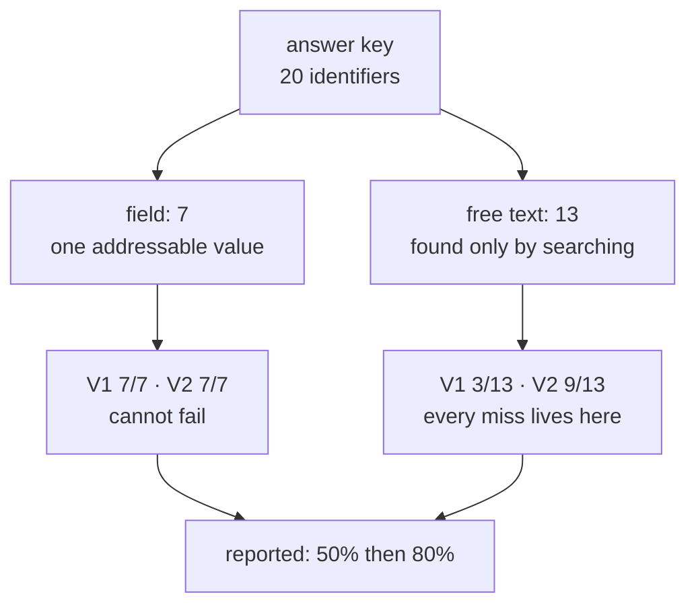

# 5.2 — Fifty per cent, and it looked fine

## One-line answer

`V1` catches **10 of 20** identifiers, which reads as half a job done and something to keep chipping
away at — until the same run is split by where each value was sitting, and it is **7 of 7 in the
structured field and 3 of 13 in free text**: a redactor that is perfect on the half that was never
the problem.

## The story

In your house the internet works about half the time. That is how everyone in it describes the
situation, and it sounds like what it sounds like: a service that is a bit flaky, that somebody
should probably ring up about, that will presumably need a new box eventually.

You do ring up. The person on the phone runs a test from their end and says the line to the property
is healthy. An engineer comes out, stands in the hall next to the box with a handset, and gets the
same answer. Both of them are telling the truth. Both of them measured in the one place in the house
that has never given anybody any trouble, because it is the place with the socket in it.

So you do something duller. For a week, every time something stops and stutters, you write down
where you were standing.

At the end of the week the list has fourteen lines on it and every single one says *back bedroom* or
*upstairs landing*. Not most of them. All of them. The house is not working half the time. The
downstairs is working every single time and the upstairs is working almost never, and the sentence
"it works about half the time" was an average of two completely different situations, only one of
which was ever a problem.

You put a booster on the landing. Upstairs goes from unusable to mostly fine. Downstairs does not
change at all, and could not have, because downstairs was already perfect.

## The idea in plain language

A single recall figure over a mixed population is an average, and an average of two groups tells you
about neither of them when the groups are not alike.

[1.3](../01-who-a-record-names/1.3-the-box-marked-anything-else.md) already argued that a support
ticket has two halves that are not alike at all. A **structured field** is a named slot with a
schema — here, the sender address — and finding an identifier in it requires no searching whatever:
you read `record["sender"]`, and you are certain you have all of it, in every row, for ever. **Free
text** is the box a human typed into, and there is no `record["the customer's name"]`, so the only
way to find anything in it is to search, and searching is where the possibility of missing something
comes from.

Those are not two difficulties on the same scale. They are two different activities, and one of them
cannot fail. Averaging them is like averaging the hall and the back bedroom.

Three consequences follow, and the third is the one that turns this from a presentation quibble into
a finding.

**The aggregate flatters, always in the same direction.** The easy half drags the number up, so the
combined figure is never lower than the free-text figure and is usually far higher. Nobody has to be
dishonest for this to happen; it is arithmetic.

**The aggregate hides which fix is available.** A 50% score invites the response *"keep improving
the redactor"*, applied to the whole thing. Split, it says something much more specific: there is
nothing to do on the field side, and everything to do on the free-text side, and the two need
different kinds of work — a field needs a **test**, because it is complete or it is not, while free
text needs a **measurement**, because it is never complete.

**The aggregate can be moved without touching the code at all.** This is the sharp one. The overall
figure is a weighted average, and the weights are the composition of the sample: seven field rows
and thirteen free rows. Add seven more tickets whose only identifier is a sender address — the
easiest tickets in the world to label — and the field rows go to fourteen while the free rows stay
at thirteen, and the overall score rises from 10 of 20 to 17 of 27, which is 63%. Thirteen points of
apparent improvement, no change to a single pattern, no additional person protected. A number that
can be raised by changing the fixture is not a measurement of the detector.

## Why Sutra needs it

This is the part [1.1](../01-who-a-record-names/1.1-the-list-of-fields-is-not-the-answer.md)
promised when it said that a redactor built from a list can only ever find the list, and it is the
measured form of [1.3](../01-who-a-record-names/1.3-the-box-marked-anything-else.md)'s claim that a
support desk keeps the things that matter in the box a human typed into. That claim has been an
argument for four parts. Here it is a table.

It also sets up the shape of the rest of the day. Section 6 deletes a customer from seven stores and
finds the copies that a scan cannot reach; section 7 puts a free-text recall floor into a gate that
is currently red on purpose ([7.2](../07-in-production/7.2-the-boundary-written-down.md)). Both of
those are built on the split, not on the aggregate — which is why `recall.py` prints three rows
rather than one.

## The mechanism

Start with the redactor being scored. `V1` in `lab/_redact.py` is the honest first attempt: the
shapes that come to mind when somebody says "personal data".

```python
EMAIL = re.compile(r"[A-Za-z0-9._%+-]+@[A-Za-z0-9.-]+\.[A-Za-z]{2,}")

# A telephone number "obviously" looks like one of these two, which is exactly the assumption 5.2
# takes apart: eleven digits with no separators, or the North American 555 shape.
PHONE_PLAIN = re.compile(r"\b0\d{10}\b")
PHONE_DASHED = re.compile(r"\b\d{3}-\d{4}\b")

V1: dict[str, re.Pattern[str]] = {
    "email": EMAIL,
    "phone": PHONE_PLAIN,
    "phone_dashed": PHONE_DASHED,
}
```

**Line by line:**

- `EMAIL` is the pattern everybody writes and it is genuinely good, because an email address has a
  **closed shape**: something, an `@`, something with a dot in it. The `@` is a delimiter that
  occurs in almost nothing else, which is why this one pattern accounts for every field hit in the
  archive.
- `PHONE_PLAIN` requires eleven digits with **no separators at all** — `\b0\d{10}\b`. That is a UK
  mobile number as a database would store it, and as a template would generate it. It is not how a
  person types one.
- `PHONE_DASHED` is `\b\d{3}-\d{4}\b`, which matches `555-0173` in `ticket:7003`. It also happens to
  be the only reason `V1` scores anything at all on a telephone number in free text.
- The value is a `dict` keyed by kind rather than a list of patterns, because `redact()` builds the
  replacement marker from the key: a match on `email` becomes `[REDACTED-EMAIL]`. The key is not
  decoration; it is what keeps the redacted text readable.
- What is **not** here is the whole subject of this part. No name pattern, no postcode, no card
  fragment, no account number. Each absence is a decision somebody made without noticing they were
  making it, by writing down the shapes they could think of.

Now score it against the answer key from [5.1](5.1-the-answer-key-comes-first.md):

```bash
cd days/day-69-pii-and-data-boundaries/lab
uv run python recall.py
```

**Line by line:**

- `cd` first: the lab's scripts import their siblings by plain name.
- With no flags `recall.py` scores `V1` and prints three rows — `all`, `field` and `free` — because
  every row of the answer key records `where` the value was sitting.

Measured on 2026-09-06:

```text
redactor V1

  where     found   of   recall
  all          10   20      50%
  field         7    7     100%
  free          3   13      23%
```

Read the first row on its own, the way it would appear in a report. **50%.** Half. That is a number
with a comfortable story attached to it: an early version, working, roughly as good as you would
expect a first attempt to be, and the obvious next step is to keep going in the same direction.

Now read the other two. **100% on the structured field.** Seven of seven, and it could not have been
anything else, because the field is one addressable value and the pattern that reads it has an `@`
to aim at. **23% on free text.** Three of thirteen. Ten people in this archive are still named after
the redactor has run, and the redactor has reported a passing grade.

The miss list makes the shape unmistakable:

```bash
uv run python recall.py --misses
```

**Line by line:**

- `--misses` prints the same table and then names every answer-key row the patterns did not find, as
  `ref`, `kind`, `where`, `value`.
- `where` is in that output on purpose. It is the column to read down.

Measured on 2026-09-06:

```text
redactor V1

  where     found   of   recall
  all          10   20      50%
  field         7    7     100%
  free          3   13      23%

  not found:
    ticket:7001    name      free   'Raghav Menon'
    ticket:7001    account   free   '88-4471'
    ticket:7002    phone     free   '07700 900142'
    ticket:7002    card      free   '4417'
    ticket:7005    account   free   '88-4471'
    ticket:7006    name      free   'Lin Zhou'
    ticket:7006    phone     free   '+44 7700 900318'
    ticket:7009    postcode  free   'SW1A 2AA'
    ticket:7012    name      free   'Joan Whitfield'
    ticket:7014    account   free   '88-6120'
```

Ten misses. **Every single one says `free`.** Not most of them — all of them, the way every line on
the week's list said *upstairs*. There is no mixed picture to interpret and no judgement call to
make: the field column has no failures in it because the field column cannot have failures in it,
and every failure this redactor has ever had is in prose.

Read the `kind` column and the misses group into four causes, each of which is a different way the
first attempt went wrong:

| Kind | Missed | Why |
| --- | --- | --- |
| `phone` | 2 | People put spaces and country codes in telephone numbers. `\b0\d{10}\b` requires neither |
| `account` | 3 | `88-4471` is this system's own shape, and nobody puts customer numbers on a PII list |
| `postcode` | 1 | An agent wrote a security answer into a note. No pattern was ever proposed for it |
| `name` | 3 | A name has no shape at all, which is [5.3](5.3-the-wall-called-a-name.md) |

Three of those four are fixable by reading the miss list and writing a pattern, which is exactly
what `V2` in `lab/_redact.py` is:

```python
# People put spaces and country codes in telephone numbers, because people are writing them for
# other people to read rather than for a regular expression to match.
PHONE_SPACED = re.compile(r"(?:\+\d{1,3}\s?)?\b0?\d{4}\s?\d{6}\b")

# A UK postcode. Two letters, one or two digits, an optional letter, a space, then a digit and two
# letters. Written out rather than copied because 1.4 needs the reader to see how specific it is.
POSTCODE = re.compile(r"\b[A-Z]{1,2}\d{1,2}[A-Z]?\s?\d[A-Z]{2}\b")

# The desk's own account number shape. This one is not a general pattern at all - it is knowledge
# about this system, which is 1.4's whole point.
ACCOUNT = re.compile(r"\b\d{2}-\d{4}\b")

V2: dict[str, re.Pattern[str]] = {
    "email": EMAIL,
    "phone": PHONE_PLAIN,
    "phone_dashed": PHONE_DASHED,
    "phone_spaced": PHONE_SPACED,
    "postcode": POSTCODE,
    "account": ACCOUNT,
}
```

**Line by line:**

- `PHONE_SPACED` allows an optional country code — `(?:\+\d{1,3}\s?)?` — then an optional leading
  zero, four digits, an **optional space**, and six digits. The optional space is the entire fix for
  `07700 900142`, and the country-code group is the entire fix for `+44 7700 900318`. Neither is
  clever. Both are things a person does when writing a number for another person to read.
- `POSTCODE` is written out rather than copied from anywhere, and it is worth noticing how
  *specific* it is: two letters, one or two digits, an optional letter, an optional space, a digit,
  two letters. A pattern this narrow can only be written by somebody who knows what a UK postcode
  is, which is the first hint of what happens when a value has no shape to know.
- `ACCOUNT` is `\b\d{2}-\d{4}\b`, four characters of pattern, and it is **not a general pattern at
  all**. It encodes knowledge about this one system, which is
  [1.4](../01-who-a-record-names/1.4-the-number-that-only-means-something-here.md)'s point: the fix
  was never unavailable technically, it was unavailable to anybody who still believed an account
  number is internal bookkeeping rather than an identifier.
- `V2` is `V1` **plus** three entries. Nothing was removed and nothing was tuned. The three original
  patterns still do exactly what they did, which is why the field column is about to not move.

Score the new one:

```bash
uv run python recall.py --v2
```

**Line by line:**

- `--v2` selects the second dictionary and prints its label, so two runs in a terminal cannot be
  confused with each other.
- Same key, same scoring code, same archive. The only thing that changed between the two runs is
  three regular expressions.

Measured on 2026-09-06:

```text
redactor V2

  where     found   of   recall
  all          16   20      80%
  field         7    7     100%
  free          9   13      69%
```

Read the three rows against the previous three, in this order.

**Free text: 23% → 69%.** Three of thirteen became nine of thirteen. Six more people are no longer
named in this archive, and each of the six can be attributed to exactly one of the three new
patterns: `PHONE_SPACED` took `07700 900142` and `+44 7700 900318`, `POSTCODE` took `SW1A 2AA`, and
`ACCOUNT` took `88-4471` twice and `88-6120` once. That is the entire improvement, item by item.

**Structured field: 100% → 100%.** The column did not move, and could not have. It was already
perfect, in the same way the hall was already perfect, and every unit of work that went into `V2`
was spent on the half that was actually failing. That is what the split bought: it said where to
point the effort before the effort was spent.

**Overall: 50% → 80%.** This is the number that will be quoted, and notice that it is the least
informative of the three. It went up by thirty points, of which the field half contributed nothing.
It is going to be read as *"the redactor is 80% good"*, when what the run actually says is *"the
redactor is complete on a seventh of the archive and misses roughly a third of the rest."*



The two branches meet in one box at the bottom, and that box is the only one anybody reads.

## When it breaks

🎬 **The scene:** the redaction work is finished and somebody writes it up. The pull request says the
redactor was measured against a hand-labelled archive and catches 80% of the identifiers in it, up
from 50%. Every word of that is true, the labelled set is committed, and the reviewer can re-run the
number themselves.

😬 **The naive fix:** there is nothing to fix. It is a good pull request. It cites a real measurement
against an independent key, which is more than most redaction work ever does, and the honest next
step is to keep improving the patterns and watch the number climb towards 100%.

💥 **Why it fails:** the number cannot climb towards 100%, and the report does not contain the
reason. Seven of the twenty rows were never at risk, so the remaining twenty points are **entirely**
in free text, where four identifiers are left and three of them are names. The aggregate has quietly
folded together a component that is finished and a component that is close to a wall, and the
resulting figure moves smoothly enough that nobody can see the wall in it. Then the archive grows.
Real traffic is far more prose than fixture traffic, so the free-text share of the key rises, and
the aggregate **falls** while the redactor is unchanged and while every individual pattern still
works exactly as well as it did. The team now has a metric that goes down when nothing has broken,
which is the fastest way to make people stop looking at a metric.

💡 **The insight:** **report the number you can act on, not the number that summarises.** Split any
score by the property that makes the cases different — here, whether the value was addressable — and
report each half with its counts. One number over two populations is a weighted average of the
sample's composition, and the composition is not a fact about your system.

There is a second break, and it is the one that turns this from bad reporting into a bad incentive.
A recall figure that is watched — on a dashboard, in a quarterly report — is a figure somebody is
responsible for raising. The cheapest way to raise this one is not to write a pattern. It is to add
tickets to the labelled set whose identifiers sit in the sender field, which is also, conveniently,
the fastest kind of row to label. The arithmetic in *The idea in plain language* above is the whole
attack: seven easy rows take the overall figure from 50% to 63%. Nobody involved has to intend
anything dishonest, because "let's grow the labelled set" is unambiguously the right instinct. The
defence is structural rather than moral: **the number in the gate is `free`, never `all`** — which
is precisely what [7.2](../07-in-production/7.2-the-boundary-written-down.md) does — because the
free-text column cannot be improved by adding easy rows to the sample.

## In production

**Why the aggregate is the one that gets reported.** Not because anybody prefers it. Because a
report has one line per thing, a dashboard tile has one number, a status update has one sentence,
and a comparison across quarters needs a single series to plot. Every part of the machinery around
the measurement pushes towards one figure, and the figure that survives that pressure is the average
— the one that is comparable, plottable and wrong. Knowing this is what lets you design around it
instead of being annoyed by it: put the split in the artefact that has teeth, not in the artefact
that has an audience.

**What a 69% redactor means downstream, in copies rather than in percentages.** This is the part
that does not fit in a percentage at all.
[2.1](../02-where-the-copies-are/2.1-one-sentence-seven-places.md) counted one customer's address
appearing thirteen times across seven stores after a single ordinary run, and
[2.4](../02-where-the-copies-are/2.4-the-reply-is-personal-data-too.md) counted ten copies of one
customer's *name* across the same seven. So a missed identifier is not one exposure. It is one
exposure multiplied by the number of stores that were written on that request, and each store has
its own retention period, its own access list and its own erasure story:

- **The reply.** The desk drafts using the text it was given, so an identifier the input filter
  missed is available to be repeated in the output — and the output is generated **after** the
  filter runs and is stored by three stores that apply no filter at all
  ([2.4](../02-where-the-copies-are/2.4-the-reply-is-personal-data-too.md)).
- **The cache.** Day 51's cache holds the prompt and the response, keyed on a hash of the prompt. A
  missed identifier is in it twice, and
  [6.2](../06-the-delete-that-did-not/6.2-the-store-you-cannot-address.md) is the part where a
  customer cannot be addressed in it at all.
- **The index.** Days 49 and 50 chunked the ticket text and stored the chunks. A missed identifier
  is now inside a retrieval corpus, which means it will be *handed back* — to a later query, from a
  different customer, possibly after the original ticket has been deleted. That is
  [6.1](../06-the-delete-that-did-not/6.1-deleted-and-still-retrievable.md), measured.

So four identifiers left in fourteen tickets is not four problems. Multiply each of them by the copy
count section 2 actually measured — ten to thirteen, across seven stores — and the misses are a few
dozen stored copies, in seven places, with no single delete that reaches them.

**What degrades at scale.** The mix shifts towards the hard half and keeps shifting. Forms get
better at capturing the routine cases, so the tickets that still reach a human are
disproportionately the unusual ones, which are disproportionately prose. Meanwhile schemas grow
structured fields — and every new structured field adds rows to the easy side of the sample and
pushes the aggregate up while the free-text figure sits still. Both effects push the two numbers
apart, so the longer a system runs the more misleading its combined recall figure becomes.

**The failure mode that only appears with real traffic.** People write identifiers in shapes no
fixture author invents, and they do it for human reasons rather than adversarial ones: a number
broken across a line wrap in a pasted email, an address written as `name (at) example.com` by
somebody who has been told not to put addresses in tickets, a postcode typed without its space, a
telephone number with the country code in brackets. `V2` handles the archive's spacing because
somebody read this archive's misses. It has no defence against the next spacing, and the only thing
that will ever tell you about the next spacing is a refreshed sample
([5.1](5.1-the-answer-key-comes-first.md)).

**The review comment a senior engineer leaves:** *"80% is a weighted average of a column that cannot
fail and a column that is our actual risk. Give me the two rows: it is 7 of 7 on the sender field
and 9 of 13 in free text, and the seven were never at stake. Put `free` in the gate and leave `all`
out of it — otherwise the first person under pressure to raise this number will do it by adding
sender-only tickets to the sample, which is the cheapest row to label and improves nothing."*

**The interview question:** *"Your PII redactor reports 80% recall. What do you want to know?"* The
answer that shows you have done this: *"Where the misses were sitting. I split ours by whether the
value was in a structured field or in free text and the picture changed completely: the first
version was 10 of 20 overall, which reads like half a job, and underneath that it was 7 of 7 on the
sender field and 3 of 13 in free text. Every single miss was in prose, because the field is one
addressable value and finding it cannot fail. Adding three patterns — spaced phone numbers,
postcodes and our own account-number shape — took free text from 3 of 13 to 9 of 13 and moved the
field column not at all, which is the point: the split told me where the work was before I spent
any. And I put the free-text figure in the gate rather than the combined one, because the combined
one can be raised by adding easy rows to the labelled set instead of by protecting anybody."*

## Check yourself

```bash
cd days/day-69-pii-and-data-boundaries/lab
uv run python recall.py --misses
uv run python recall.py --v2 --misses
```

Take the four rows still missing from the `V2` list and sort them into *fixable with a pattern* and
*not fixable with a pattern*. For each one in the first group, write the pattern. For each one in
the second, say what a pattern would have to know that a regular expression cannot express — then
read [5.3](5.3-the-wall-called-a-name.md).

**Out loud, without scrolling up:** somebody hands you one recall figure for a detector. Name the
property you would split it by, say which half you expect to be perfect, and say why the combined
number can rise without a single person being better protected.

**Next:** [5.3 — The wall called a name](5.3-the-wall-called-a-name.md).
