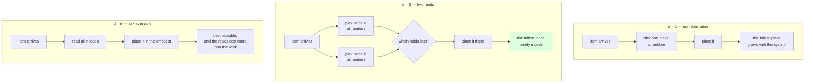

# The power of two choices in randomized load balancing

> *The power of two choices in randomized load balancing* · `doi:10.1109/71.963420` ·
> IEEE Transactions on Parallel and Distributed Systems, Volume 12, Issue 10, pages 1094–1104, 2001
> · <https://doi.org/10.1109/71.963420>
>
> Record checked live on 2026-09-06 via `https://api.crossref.org/works/10.1109/71.963420`; the
> title, journal, volume, issue, pages and year above are copied from that record. The record
> carries no abstract, and this document says out loud, in *The idea in plain language*, exactly
> which parts of the result it is willing to state and which it is not.

## One-line answer

Spreading work over several servers had two settled options — choose blindly and watch one server
end up badly overloaded, or ask every server how loaded it is and pay more for the asking than the
work is worth — and this is the document that established that asking **two** buys almost everything
asking all of them would have bought, while asking three buys almost nothing more.

## The story

It is the evening load-out at a small courier depot, and six vans are backed up to the platform with
their doors open. All six go to the same part of the city in the morning. Parcels come down a roller
to one person, and that person's whole job is to decide which van each parcel goes into.

You cannot tell how full a van is from the platform. The vans are packed to the roof at the front
and empty at the back, so the only way to know is to climb in and look.

So there are two ways to do this job, and both of them are bad.

The first way is to not look at all. Take the parcel, turn round, put it in whichever van you happen
to be standing next to, take the next parcel. It costs nothing, and it goes fast, and at the end of
the night five vans have room to spare and one is stuffed solid. The parcels that would not fit in
that one are the parcels that miss the morning run. Nobody remembers the five vans that were fine.

The second way is to look properly. Before each parcel you walk the line, climb into all six, and
put the parcel where there is most room. Now the vans finish beautifully even, and you are still on
the platform at the end of the shift with parcels around your feet, because climbing into six vans
costs far more than placing one parcel ever did.

Everybody who has loaded anything knows both of these, and knows that the answer is somewhere in
between. What nobody could say, before this document, was **where** in between — how much looking
actually buys you, and whether a little looking gets you a little of the benefit or most of it.

## The idea in plain language

Strip the depot down to its bones and you get the setting this result is stated in.

There are **n** places to put things — call them lanes, servers, queues, bins, vans; the argument
does not care. Items arrive one at a time. For each item you choose a place, put it there, and move
on. You never move an item afterwards, and you never coordinate with anybody else.

The number everyone cares about is not the average. The average is fixed: if a hundred items go into
ten places, the average is ten, whatever policy you use. The number that decides whether the system
is in trouble is the **maximum load** — how full the *fullest* place ends up. That is the van that
cannot take the last parcel. On Sutra's router it is the lane that returns HTTP 429 first, which is
why the demo below prints one column and calls it `peak`.

Now the policy. Let **d** be how many places you look at before you commit:

- **d = 1** is the first way of loading. Pick one place at random, put the item there, do not look.
- **d = 2** is the middle way. Pick two places at random, look at both, put the item in the emptier
  one.
- **d = n** is the second way. Look at all of them and take the emptiest.

The claim of this document, in one sentence: **the step from d = 1 to d = 2 is a change in kind, and
every step after it is a change in degree.**

That is a stronger statement than "more looking is better", and it is the reason the result is
famous. It says the benefit is not spread evenly across the amount of information you gather. Almost
all of it arrives with the *first* extra sample. Going from one to two transforms how the fullest
place behaves as the system grows; going from two to three shaves a little off; going from three to
all of them shaves off almost nothing, and by then you are paying the full cost of asking everyone.

**How the improvement is usually written.** Under one choice, the fullest place grows steadily as
the system gets bigger: double the number of servers and the worst one gets meaningfully worse.
Under two choices, the fullest place grows so slowly with the size of the system that over any range
you will ever operate in, it is effectively flat. Part
[2.4](../parts/02-choosing-a-lane/2.4-everyone-read-the-same-board.md) states this in the form it is
usually quoted in — a maximum load growing like `log n / log log n` with one choice and like
`log log n` with two, which is an exponential improvement from one extra sample. You do not need to
be comfortable with logarithms to use the result. The demo below shows the same thing as a table you
can read: from four lanes to sixty-four, the fullest lane under two choices does not move, and under
one choice it climbs the whole way.

**What this document will not quote, and why.** The bibliographic record above was verified live;
the record carries no abstract, and this part was written from that record and from the runnable
demo rather than from the full text. So there are no constants, no lower-order terms and no theorem
numbers here, and there is no claim about which of the two standard settings — items dropped into
bins and counted at the end, or customers arriving at queues and being served over time — the exact
statement in this paper is proved in. Those are things a reader must take from the paper itself, and
*Check yourself* ends with the lookup. What is asserted here is the shape of the result and the
measured behaviour of the procedure, and the second of those you can reproduce on your own machine
in the section after next. Principle 7 applies to the literature exactly as it applies to a version
pin: a remembered constant is an invented constant.

## Why Sutra needs it

Not for the reason you would expect, and saying so plainly is the whole value of putting this
document at the end of Day 70 rather than at the front.

**Sutra does not need it yet.** The router this day builds holds four lanes — Gemini, Groq,
OpenRouter and Ollama — inside one process, and it owns all four counters itself. There is no
network between the decision and the numbers it is made from. The information is complete and it is
true at the instant you act on it, which is exactly the condition part
[2.3](../parts/02-choosing-a-lane/2.3-with-perfect-information-greedy-is-fine.md) named and then
measured: over 270 requests, the crude "first capable lane" policy served **258** and the
two-sampling policy served **251**. On Sutra's own benchmark, the paper's rule *loses*.

That measurement is not an embarrassment to hide before citing the paper. It is the paper's own
lesson pointed back at us. This result exists because asking everyone is expensive; where asking
everyone is free, the result has nothing to sell you.

**So what Sutra needs is the condition, not the rule.** Part
[2.4](../parts/02-choosing-a-lane/2.4-everyone-read-the-same-board.md) ends by asking you to name
the condition that has to be true before sampling two is worth anything. Here it is, and it has two
halves that must both hold:

1. **Your view of the load is out of date at the moment you commit to it** — because it came from a
   snapshot, a cache, a counter on the other side of a network, or another worker that has acted
   since you read it.
2. **You cannot cheaply make it current.** If one atomic read would fix it, fix it. Sampling two is
   what you reach for when you have already done that and the staleness is structural.

The moment Sutra's router is replicated — one instance per worker, each with its own view of the
same provider quotas — both halves become true at once, and that is the case part
[6.1](../parts/06-in-production/6.1-one-till-two-cashiers.md) takes up. Part
[2.4](../parts/02-choosing-a-lane/2.4-everyone-read-the-same-board.md) already measured the near
version of it: fourteen workers deciding from one shared snapshot, where sampling two spilled
**zero** of fifty-six requests while taking the single emptiest lane spilled one and the crude
policies spilled two and three. And it measured the boundary too — give each worker a fresh read and
all four policies score fifty-six out of fifty-six, because there is no longer anything for the
sampling to be better than.

That is why this document sits here. A reader who has built the router by hand, watched greedy win
on one benchmark and lose on another, can be told which half of the paper they need and which half
they do not. A reader who met the paper first would have shipped the rule and never known what it
was for.

## The mechanism

The procedure, written out as something you could hand to a person on a loading platform.

**The setup.** There are `n` places. Items arrive one at a time; there are `m` of them. Each item is
placed and never moved. Nothing is coordinated: whoever places an item consults nobody, keeps no
history, and cannot see any place it did not sample.

**The baseline, d = 1.** For each item, choose one of the `n` places uniformly at random. Put the
item there. Notice that this policy never reads a load at all — it does not need to, and that is why
it is cheap.

**The rule, d = 2.** For each item:

1. Choose one place uniformly at random. Call it **a**.
2. Choose another place uniformly at random, independently, and with replacement — it is allowed to
   be the same place. Call it **b**.
3. Read the current load of **a** and of **b**. Two reads, never `n`.
4. Put the item in whichever of the two holds less. Break a tie however you like.

Three details in that list are load-bearing, and each of them is a place where an implementation
quietly goes wrong:

- **Uniformly at random**, not round-robin and not "wherever this tenant's hash lands". A sampler
  with a bias recreates hot spots on purpose, and the argument below depends on every place being
  equally likely to be one of the two.
- **Independently**, so the two draws are unrelated. If **b** is chosen as "the neighbour of **a**",
  the two samples stop being a random pair and the guarantee is not the one that was proved.
- **The load read in step 3 is the load right now.** This is the assumption that *When it breaks*
  spends most of its length on, because it is the one that fails in every real system.

**Why two changes the kind of thing that happens.** The informal explanation, the one that is worth
being able to say out loud in a design review, goes like this. Under one choice, a place gets tall
by sheer bad luck of the draw: nothing about being tall makes it less likely to be chosen again.
Under two choices, being tall is self-limiting — a tall place is only chosen when *both* samples are
at least as tall, so the taller it gets the harder it is for it to get taller. The pressure against
height is not constant; it compounds with the height. That is the whole difference between a maximum
load that grows steadily with the size of the system and one that barely grows at all, and it is why
the second sample matters so much more than the third: the third sample tightens a screw that the
second one already turned.



The diagram is the paper's contribution in one picture: the middle column costs one more read than
the left column and lands next to the right column.

## The paper in one demo

The contribution, stripped to nothing but itself: **the same placement procedure, twice, differing
only in how many places it looks at.**

```text
days/day-70-the-quota-router/lab/papers/two-choices/
├── balance.py   # place items into lanes, sampling d of them; measure the fullest lane
└── demo.py      # the same experiment at five fleet sizes, with d as the ablation switch
```

Two files. No router, no lanes with capabilities, no windows, no model, no network — everything this
day built is deliberately absent, because none of it is the paper's claim. What is left is a loop
that puts numbers into a list and a function that takes a maximum. Addendum 02 is satisfied
trivially: nothing here calls a provider, so there is no key, no quota and no HTTP 429 to handle.

`balance.py` opens by saying which single number the whole file exists to produce:

```python
"""The paper and nothing else: sample one lane, or sample two and keep the emptier.

Everything here exists to measure one number - the load on the fullest lane - because that is the
quantity the paper is about and, for a quota router, it is the lane that returns 429 first.
"""

from __future__ import annotations


def draws(count: int, seed: int) -> list[int]:
    """A reproducible stream of non-negative integers.

    A named generator rather than `random` so that every run of this demo, on every machine,
    prints the same table. The paper's claim is about the shape of the distribution, and a claim
    you cannot reproduce is not one a reader can check.
    """
    out, x = [], seed
    for _ in range(count):
        x = (x * 1103515245 + 12345) % 2147483648
        out.append(x >> 16)
    return out
```

**Line by line:**

- The docstring names the measured quantity in its second line, and it is the only quantity the file
  computes. If you deleted the maximum and printed the average instead, both arms of the ablation
  would print the same number and the demo would prove nothing — the average does not depend on the
  policy.
- `draws` is a hand-written pseudo-random generator rather than `random.random()`. That is not
  distrust of the standard library; it is reproducibility. The table printed below has to be the
  table you get, on your machine, so that you can check the claim rather than take it. Seeding
  `random` would do the same job, but a generator written out in four lines also lets a reader see
  that nothing about the stream depends on `d`.
- `x = (x * 1103515245 + 12345) % 2147483648` is a linear congruential generator with the constants
  from the classic C library formulation. Its statistical quality is mediocre and irrelevant here:
  the demo needs an arbitrary, evenly-spread, reproducible sequence, not cryptographic randomness.
- `out.append(x >> 16)` keeps the **high** bits by discarding the low sixteen. The low bits of a
  linear congruential generator are notoriously non-random — the lowest bit alternates — and the
  values are about to be used with `% lanes`, which reads exactly those low bits. Dropping them is
  the difference between a demo that measures the paper and one that measures a generator artefact.

The placement procedure itself, which is the paper reduced to eight lines:

```python
def place(lanes: int, balls: int, d: int, seed: int) -> list[int]:
    """Place `balls` requests into `lanes` lanes, sampling `d` lanes per request.

    Args:
        lanes: how many identical quota pools there are.
        balls: how many requests arrive.
        d: how many lanes to look at before committing. `1` is the paper's baseline; `2` is its
            contribution. Nothing else about the procedure changes.
        seed: which reproducible stream to use.

    Returns:
        The load on each lane.
    """
    load = [0] * lanes
    rng = draws(balls * d + 8, seed)
    for _ in range(balls):
        first = rng.pop(0) % lanes
        if d == 1:
            load[first] += 1
            continue
        second = rng.pop(0) % lanes
        load[first if load[first] <= load[second] else second] += 1
    return load
```

**Line by line:**

- `lanes: how many identical quota pools there are` — **identical** is the modelling assumption of
  the entire demo, stated in the docstring where it belongs. The paper's places are
  interchangeable. Sutra's four lanes are not, which is the second item in *When it breaks*.
- `d` is the only parameter that carries the idea, and the docstring says so: `1` is the baseline,
  `2` is the contribution, *nothing else about the procedure changes*. That sentence is what makes
  this an ablation rather than two programs.
- `load = [0] * lanes` is the entire state of the system. There is no queue, no service time and no
  departure: items arrive and stay. That is the static form of the model, and it is the right one for
  a quota window, where a request consumed against a per-minute ceiling does not come back until the
  window rolls.
- `rng = draws(balls * d + 8, seed)` draws the whole stream up front, sized to exactly what this `d`
  will consume. The `+ 8` is slack so that a small change to the loop cannot run the list dry.
- `first = rng.pop(0) % lanes` is sample one. `pop(0)` consumes the stream from the front, so each
  draw is used once and the sequence is walked in order.
- `if d == 1: ... continue` is the baseline, and note what it does **not** do: it never reads
  `load[first]`. The one-choice policy is blind by definition, and writing it as an early `continue`
  keeps that visible instead of hiding it inside a comparison that happens to have one operand.
- `second = rng.pop(0) % lanes` is sample two, drawn from the same stream, independently and **with
  replacement** — it may equal `first`. The paper's rule allows that, and forbidding it would change
  the distribution being measured into a different one.
- `load[first if load[first] <= load[second] else second] += 1` is step 4 of the mechanism. The `<=`
  breaks ties towards the first sample, which is itself a uniformly random lane, so tie-breaking
  introduces no positional bias. Using `<` instead would break ties towards the second draw, which is
  equally fine; breaking them towards *lane zero* would not be, and is the bug part
  [1.5](../parts/01-what-headroom-is/1.5-twelve-left-means-two-different-things.md) found on a fresh
  fleet.
- The two arms consume different numbers of draws per item, which is why `rng` is sized with
  `balls * d`. The two runs are therefore not walking the same random numbers — they are walking the
  same *generator*, with the same seeds, under two policies. Forcing both arms to consume two draws
  would make the streams line up and change nothing about the conclusion.

The last function turns one run into a measurement:

```python
def maxload(lanes: int, balls: int, d: int, trials: int) -> tuple[float, int]:
    """Mean and worst fullest-lane load over `trials` independent arrival streams."""
    peaks = [max(place(lanes, balls, d, seed=1 + 97 * t)) for t in range(trials)]
    return sum(peaks) / len(peaks), max(peaks)
```

**Line by line:**

- `max(place(...))` is the fullest lane of one run. Everything else in the returned list is thrown
  away, on purpose: the paper is a claim about that one number.
- `for t in range(trials)` repeats the experiment with a different arrival stream each time. A single
  run of a random procedure tells you almost nothing, and one lucky run is exactly how a demo
  accidentally lies.
- `seed=1 + 97 * t` spaces the seeds out rather than using `t` directly. Consecutive seeds in a
  linear congruential generator produce streams that start close together; a stride keeps the trials
  visibly independent. `97` is arbitrary and any coprime stride would do.
- Two numbers come back, and both are needed. `sum(peaks) / len(peaks)` is the **mean peak** — what
  the fullest lane typically holds — and `max(peaks)` is the **worst peak**, the worst fullest lane
  seen in any trial. The mean is the trend; the worst is the one that pages you.

`demo.py` is the experiment and the ablation switch:

```python
"""How full does the fullest lane get? One sample per request, or two.

    uv run python demo.py          # d = 2, the paper's rule
    uv run python demo.py --off    # d = 1, the paper's contribution switched off

The ablation is the whole point: `--off` changes exactly one number, `d`, and nothing else. If the
two tables agreed, this demo would have shown that code ran, not that the idea did anything.
"""

from __future__ import annotations

import sys

from balance import maxload

TRIALS = 200
SIZES = ((4, 40), (8, 80), (16, 160), (32, 320), (64, 640))
```

**Line by line:**

- The docstring's last sentence is the rule from §17.4.2 written into the file: a demo that cannot be
  switched off has proved that some code ran, not that this idea mattered.
- `TRIALS = 200` is the number of independent arrival streams behind every row. It is large enough
  that the mean is stable and small enough to run instantly on a laptop with no dependencies.
- `SIZES` pairs each fleet size with **ten times as many requests**: four lanes take forty, sixty-four
  lanes take six hundred and forty. Holding the ratio fixed is what makes the rows comparable. If the
  request count stayed at forty while the lanes grew, the fleet would get emptier down the table and
  the peak would fall for a reason that has nothing to do with `d`.
- The sizes double five times, from four to sixty-four. That range is chosen to cover Sutra's actual
  fleet at one end — four lanes — and a fleet sixteen times larger at the other, so the reader can see
  which way each policy moves as the system grows rather than being handed a single number.

```python
def main() -> int:
    off = "--off" in sys.argv
    d = 1 if off else 2

    print(f"d = {d}   ({'one lane sampled, committed to' if off else 'two sampled, emptier wins'})")
    print(f"{TRIALS} independent arrival streams per row, 10 requests per lane on average\n")
    print(f"  {'lanes':>6} {'requests':>9} {'mean peak':>11} {'worst peak':>11}")
    for lanes, balls in SIZES:
        mean, worst = maxload(lanes, balls, d, TRIALS)
        print(f"  {lanes:>6} {balls:>9} {mean:>11.2f} {worst:>11}")
    print("\n  peak = requests landing on the fullest lane; the lane that 429s first")
    return 0


if __name__ == "__main__":
    raise SystemExit(main())
```

**Line by line:**

- `off = "--off" in sys.argv` and `d = 1 if off else 2` are the ablation, read once, and they set a
  single integer. Everything downstream — the sizes, the trials, the seeds, the generator, the loop —
  is untouched by the flag. That is what makes the two tables a comparison rather than two results.
- The header line prints `d` and what it means, so a pasted output can never be misread as the other
  arm. Output that does not say which arm produced it is output you cannot use as evidence.
- `10 requests per lane on average` states the ratio in the header rather than leaving the reader to
  divide the two columns. The even share is therefore always `10`, which turns every `mean peak`
  value into a directly readable overshoot.
- The `f"{mean:>11.2f}"` formatting pins the mean to two decimals and right-aligns the columns, so
  the two tables can be read against each other line by line without counting digits.
- The closing legend defines `peak` in the vocabulary of this day: *the lane that 429s first*. The
  paper measures a maximum load; a quota router experiences that maximum as the first refusal.
- `return 0` and `raise SystemExit(main())` make the exit status explicit. This demo is a measurement
  rather than a pass/fail check, so both arms exit `0` and the evidence is the table — unlike the
  refusal-shaped demos of Days 67 and 68, where the exit code carried the verdict.

Run it both ways, from inside the demo's own directory because `demo.py` imports `balance` by plain
name:

```bash
cd days/day-70-the-quota-router/lab/papers/two-choices
uv run python demo.py
uv run python demo.py --off
```

**Line by line:**

- `cd` first: `from balance import maxload` resolves against the current directory, so running this
  from the repository root fails with `ModuleNotFoundError: No module named 'balance'`.
- The two commands differ by one flag. Same file, same constants, same seeds, same generator — the
  only thing that changes between them is the integer `d`.

Measured on 2026-09-06, the paper's rule — **d = 2**:

```text
d = 2   (two sampled, emptier wins)
200 independent arrival streams per row, 10 requests per lane on average

   lanes  requests   mean peak  worst peak
       4        40       10.91          13
       8        80       11.16          13
      16       160       11.32          13
      32       320       11.49          12
      64       640       11.80          13

  peak = requests landing on the fullest lane; the lane that 429s first
```

Measured on 2026-09-06, the ablation — **d = 1**, one lane sampled and committed to:

```text
d = 1   (one lane sampled, committed to)
200 independent arrival streams per row, 10 requests per lane on average

   lanes  requests   mean peak  worst peak
       4        40       13.18          18
       8        80       14.80          21
      16       160       15.96          22
      32       320       17.07          24
      64       640       18.20          24

  peak = requests landing on the fullest lane; the lane that 429s first
```

**What the ablation proves.** Read the two tables against each other. The arrival streams are the
same, the seeds are the same, the fleet sizes are the same, the ten-requests-per-lane ratio is the
same, and two hundred trials stand behind every row on both sides. One integer differs.

**The column that carries the argument is `worst peak`**, because the fullest lane is the one that
returns 429 first. Under `d = 2` it reads 13, 13, 13, 12, 13 — the fleet grows sixteenfold and the
worst lane does not move. Under `d = 1` it reads 18, 21, 22, 24, 24, climbing the whole way. That
difference in *shape* is the paper's claim made visible: not "two is a bit better", but "two stops
the problem growing with the system".

The `mean peak` column says the same thing in gentler numbers, and it is worth converting to
percentages because the even share is always ten. Under two choices the fullest lane holds about
nine per cent more than an even share at four lanes and about eighteen per cent more at sixty-four.
Under one choice the same figures are about thirty-two per cent and about eighty-two per cent. One
extra look per request turned a fleet where the worst lane carries nearly double its share into a
fleet where it carries a fifth more.

And notice the row that matters most for this day: at **four lanes** — Sutra's actual fleet — the
gap is 10.91 against 13.18 on the mean and 13 against 18 on the worst. Real, and not the asymptotic
argument at all. At four lanes there is no "as the system grows"; what you are seeing is one extra
sample removing the tail of bad luck. That distinction is the third item in the next section.

## When it breaks

The result is a theorem about a procedure, and five of the procedure's assumptions are things a real
system does not give you.

**It assumes the two loads you read are current.** Step 3 of the mechanism says *read the current
load*, and the analysis is about a process where each placement sees the truth. Sample two **stale**
numbers and you have sampled two numbers that were already wrong. Part
[2.4](../parts/02-choosing-a-lane/2.4-everyone-read-the-same-board.md) measured what happens then:
with fourteen workers deciding from one shared snapshot, sampling two still came out best — zero
spilled requests against one for take-the-emptiest and two and three for the crude policies — but
that is a *measurement on one workload*, not the paper's guarantee, and the reason it helped is not
the reason the paper gives. What helped there was that the randomness made fourteen workers choose
differently from an identical board. The comparison of two loads contributed almost nothing, because
both numbers were equally out of date.

Push the staleness further and the advantage goes. If the snapshot is old enough that both sampled
values are wrong in the same direction — which is exactly what in-flight requests do when a counter
is incremented on *response* rather than on *attempt*, the bug part
[5.1](../parts/05-failure-lab/5.1-the-tally-that-counts-only-sales.md) is built around — then you
are choosing the emptier of two numbers that both describe a fleet that no longer exists. You have
paid for two reads and bought the herd anyway.

**It assumes the places are interchangeable.** `place()` says so in its own docstring — *how many
identical quota pools there are*. Sutra's lanes are not identical, and part
[2.2](../parts/02-choosing-a-lane/2.2-the-lane-that-cannot-do-the-job.md) is the part that
establishes it — the lanes differ in what they can do, so the set of candidates is not the fleet.
They also differ in size, and part
[2.3](../parts/02-choosing-a-lane/2.3-with-perfect-information-greedy-is-fine.md) measured the cost
of ignoring that: spreading pushed work onto Ollama, whose ceiling is six a minute, and the sampling
policies served 251 where packing the big lanes served 258. On an unequal fleet, "the emptier of
these two" can be the wrong answer even when it is computed correctly, because emptier is not the
same as *cheaper to use next*. The honest fix is to compare a normalised quantity — headroom as a
fraction of the lane's own ceiling, which is what part
[1.5](../parts/01-what-headroom-is/1.5-twelve-left-means-two-different-things.md) is about — and to
know that you are then running a variant of the rule rather than the rule that was proved.

**It is an asymptotic result, and Sutra has four lanes.** Every statement about how the maximum load
grows is a statement about what happens as the number of places gets large. Four is not large. The
`d = 2` improvement visible in the four-lane row of the demo — 13 against 18 on the worst peak — is
real, and it is not the theorem doing the work; it is one extra sample trimming the tail of a
distribution over a handful of bins. So if you adopt this rule in Sutra, the reason you give in the
code comment must be the one you can defend: *our view of the counters is stale and randomising the
choice stops every worker picking the same lane*. The reason you must not give is *the maximum load
grows like log log n*, because with four lanes that sentence is not describing anything you are
running.

**It measures the maximum load, not throughput, latency or cost.** The demo prints one column and it
is the fullest lane. Part
[2.3](../parts/02-choosing-a-lane/2.3-with-perfect-information-greedy-is-fine.md) optimised a
different quantity — requests served — and got a different winner. Neither measurement is wrong;
they are answers to different questions, and a policy argument that does not say which quantity it
is about is an argument nobody can settle. Before quoting this result, say what you are minimising.

**And the sampling has to be uniform.** The mechanism's first detail said it and it is the one that
rots quietly. Sample by hashing a tenant identifier, or by picking "this lane and the next one", or
from a list that a service registry returns in a stable order, and the two draws stop being a random
pair. The code still runs, the table still prints, and the property that made two better than one is
gone with no error message anywhere.

## In production

**What survived: the strategy, under exactly this name.** "Power of two choices" — often written
**P2C**, sometimes "two random choices" — is a standard load-balancing option in the tools engineers
reach for, alongside round-robin and least-connections. The reason it is offered is the property in
the mechanism section: it needs **no coordination**. Every decider acts alone, from two reads,
consulting nobody. That is what makes it survive replication, and it is why it appears in systems
where "ask the load balancer" is not an option because there are eight load balancers.

**What also survived, and travelled much further than load balancing: the shape of the finding.** A
small amount of information buys most of the benefit of complete information. Once you have that
sentence you start seeing the decision everywhere — sampling a fraction of traces instead of all of
them, checking two replicas instead of a quorum of all, reading two shards' depths instead of the
whole cluster's. The engineering question stops being *how do I get the true state* and becomes *how
much of the benefit does the cheapest read buy*, which is a question you can actually answer with a
measurement.

**What did not survive: the idea that it is the right answer everywhere.** It is not, and Sutra is
the counterexample. The rule exists to avoid the cost of complete information; where complete
information is one attribute lookup on an object you already hold, there is nothing to avoid. Part
[2.3](../parts/02-choosing-a-lane/2.3-with-perfect-information-greedy-is-fine.md) measured the cost
of adopting it anyway: seven requests out of 270, paid for nothing. A team that adopts P2C because
it is what serious systems use has bought a solution to a problem it does not have, and will keep it
long after anyone can say why it is there.

**What also did not survive: the pure form.** Real implementations rarely compare true load, because
true load is the thing you cannot see — that is the premise. They compare a **proxy**: the number of
requests currently in flight to each of the two, which the caller knows without asking anybody. That
is a different quantity from the one in the model, it is available locally, and it is close enough.
The same substitution is what Sutra would have to make: a lane's headroom in *your* replica's view
is a proxy for its headroom at the provider, and part
[6.1](../parts/06-in-production/6.1-one-till-two-cashiers.md) is where the gap between those two
gets its own treatment.

**What degrades at scale.** Nothing about the placement rule — that is the point of the flat
`worst peak` column. What degrades is the freshness of the two numbers you read, and it degrades in the
direction that matters: more workers means more decisions per unit of staleness, so the two sampled
values describe a fleet that is further behind. Sampling two is protection against workers choosing
identically, not against the numbers being old, and the second problem grows while the first is
being solved.

**The review comment a senior engineer leaves:** *"We have four providers and one router object that
owns all four counters in-process. Sampling two here is cargo cult — take the max, it is one line,
it is cheaper to read and it produces reproducible traces we can debug. Put the condition in the
comment so nobody re-litigates it: switch to two-choices the day the router runs in more than one
process, and when you do, write down the staleness horizon of the counters, because that number is
what decides whether this helps at all."*

**The interview question:** *"When would you use power-of-two-choices, and when would you not?"* An
answer with evidence behind it: *"I would use it when several deciders are choosing between backends
from a view of load that is already out of date and cannot cheaply be made current — replicas of a
router, say, each with its own cached counters. Randomising which two you look at stops every
replica computing the same answer and stampeding one backend. I would not use it when one process
owns the true state, and I measured that case on my own router: with one decider and live counters,
taking the first capable provider served 258 of 270 requests and the sampling policy served 251, so
it actively lost. The thing I would say in a design review is that the result is about the maximum
load — the backend that rate-limits first — and it is an asymptotic result, so with four backends
the reason to adopt it is the randomisation, not the growth rate."*

## Check yourself

```bash
cd days/day-70-the-quota-router/lab/papers/two-choices
uv run python demo.py
uv run python demo.py --off
```

Now break the ablation's fairness on purpose, and see whether the result survives it. In `maxload`,
change the seed stride from `seed=1 + 97 * t` to `seed=1 + t` so the two hundred trials use
nearly-consecutive seeds, and run both arms again. Record whether the `worst peak` columns still
tell the same story. Then say in one sentence which property of the experiment you weakened — the
independence of the trials, or the independence of the two draws within a placement — and why only
one of those two would have invalidated the claim.

Then make the lanes unequal, which is the assumption Sutra actually violates. `place()` treats every
lane as an identical pool; give lane `0` half the capacity of the others by comparing
`load[i] / cap[i]` instead of `load[i]`, and decide for yourself what "the fullest lane" should even
mean when the lanes are different sizes. Leave it as a `TODO(me)`: the point is the definition, not
the code.

`TODO(me)` — read the full text at <https://doi.org/10.1109/71.963420> and write down, in your own
notes, the exact statement of the result: which setting it is proved in, what quantity it bounds,
and what the constants and lower-order terms are. This document deliberately quotes none of them,
for the reason given in *The idea in plain language*, and the gap is yours to close rather than to
trust.

**Out loud, without scrolling up:** *what did this paper actually claim, and what do we do
differently now?* The claim is that looking at two randomly chosen places and using the emptier
gives almost all of the benefit of looking at every place, at the cost of one extra read, and that
the third look adds little. What we do differently is narrower than the headline: we use it where
deciders are many and their view of load is stale, we compare a locally-known proxy rather than true
load, and on a single-process router with four counters we do not use it at all — because the
expense the paper exists to avoid is not one we are paying.

**Next:** back to the hub, [Day 70](../LESSON.md), and its §11 ledger.
