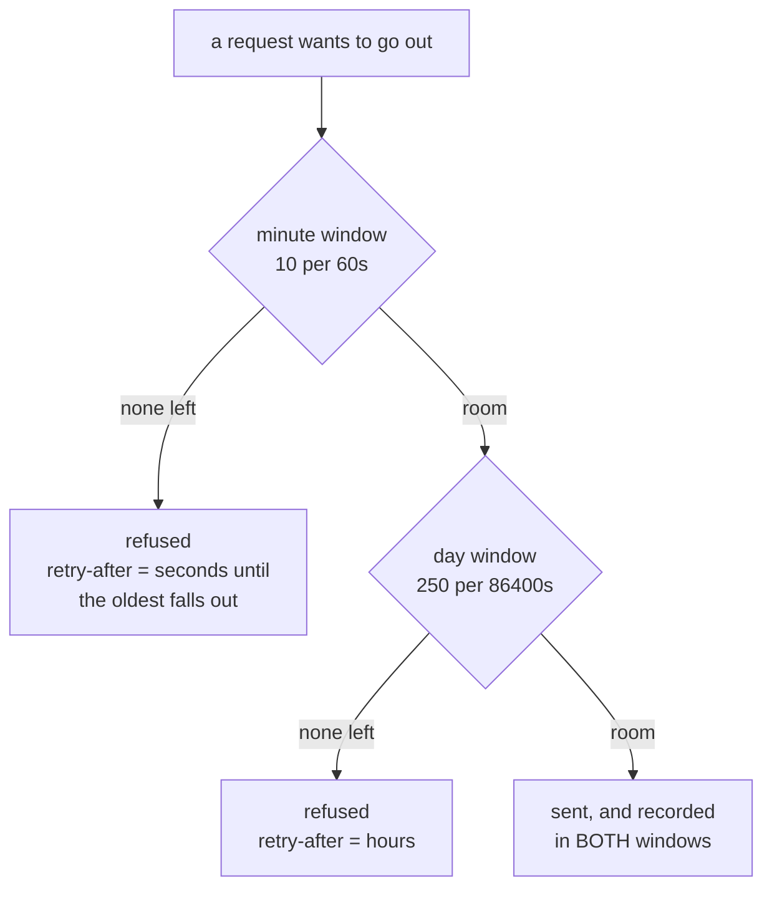

# 1.1 — A ceiling is a window, not a number

## One-line answer

"Ten requests per minute" is not a quantity you own, it is a **shape**: a limit paired with a span
of time, and every question about whether you may send now is really a question about which span
you are asking over.

## The story

Your office canteen gives everyone three coupons a day for tea.

On your first morning you take one at nine, one at eleven, one at three, and at five you are told
there are none left. That is fine. You understood the rule before anyone explained it: three, then
wait for tomorrow.

Now a colleague joins in the afternoon of her first day. She takes three coupons between two and
five. The next morning at nine she takes three more. In the twenty-four hours from two on Monday to
two on Tuesday, she has had **six** cups of tea, and nobody stopped her, and she did not cheat.

Both of you followed the same rule. The rule says three a day. What it does not say — what nobody
in the queue ever says out loud — is *which* day. The canteen means "the day on the calendar". Her
six cups fit because they straddled midnight, and the counter on the wall went back to zero at a
moment that had nothing to do with when she started drinking tea.

The number on the sign was three. The thing that actually decided what she could have was the
**window**, and the window was invisible.

## The idea in plain language

Every free-tier limit you will meet has two parts, and people quote only the first one.

- **The limit** — how many. Ten, thirty, fifty.
- **The window** — over what span of time. A minute, a day.

A limit without its window is not a rule, it is half a rule. "Ten requests" is meaningless. "Ten
requests per minute" is a rule, and it means something very specific: *for every stretch of sixty
seconds you could point at, no more than ten of your requests fall inside it.*

Read that sentence again, because the phrase doing the work is **every stretch you could point at**.
Not every stretch starting on the minute. Not every stretch since you last checked. Every one.

Two more words, both of which this day will use constantly.

- **Headroom** — how many requests you may still send right now without breaking the rule. It is a
  number you compute, not a number the provider hands you, and computing it correctly is the whole
  of section 1.
- **A quota pool** — the thing the limit is attached to. This matters more than it sounds and
  [5.3](../05-failure-lab/5.3-two-cards-one-household.md) is built on getting it wrong: free tiers
  meter per project, per organization or per account, **not** per model. Two model names can share
  one allowance.

[Day 24](../../../day-24-token-accounting-and-budgets/parts/02-two-ceilings/2.1-two-ceilings-one-clears.md)
introduced the idea that Sutra lives under two ceilings at once and that only one of them clears
when you wait. This part is the layer underneath that: before you can say which ceiling binds, you
have to be able to say what a ceiling *is*, and the answer is that it is a window with a number on
it.

## Why Sutra needs it

Everything in this day is arithmetic over windows. The router in
[3.4](../03-the-plugin/3.4-answering-instead-of-the-agent.md) chooses a lane by comparing headroom,
and a headroom number computed against the wrong window is worse than no number, because the router
will act on it with confidence.

It is also the difference between two failures you will meet later.
[1.2](1.2-the-burst-every-counter-approved.md) sends twice the limit through a counter that says
everything is fine, and the only reason it can is that the counter was built around the wrong idea
of a window. [4.1](../04-when-a-lane-says-no/4.1-reading-the-refusal.md) reads a `retry-after` value
off a refusal, and that value is nothing but the provider telling you where the edge of its window
is.

## The mechanism

Sutra's lanes are described in one place, `lab/_lane.py`, and a lane is a name, the jobs it can do,
and **two** windows:

```python
@dataclass
class Lane:
    name: str
    model: str
    rpm: int
    rpd: int
    skills: frozenset[str]
    clock: Clock
    minute: Sliding = field(init=False)
    day: Sliding = field(init=False)

    def __post_init__(self) -> None:
        self.minute = Sliding(self.rpm, 60.0, self.clock)
        self.day = Sliding(self.rpd, 86400.0, self.clock)

    def headroom(self) -> int:
        """The smaller of the two windows: a lane is only as free as its tightest ceiling."""
        return min(self.minute.remaining(), self.day.remaining())
```

**Line by line:**

- `rpm` and `rpd` are the two limits. They are stored as plain integers because they are
  configuration, not state — the state is in the two window objects built from them.
- `minute` and `day` are `field(init=False)`, so nothing constructs a `Lane` by passing counters in.
  The counters are derived from the limits in `__post_init__`, which means a lane cannot exist with
  a window whose limit disagrees with the number written beside it. That is one class of bug removed
  by construction rather than by care.
- `86400.0` is a day in seconds, written as a literal rather than `24 * 60 * 60` because it appears
  in refusal messages too, and a reader tracing a number through the code should meet the same
  spelling each time.
- `clock` is passed in rather than read from the system. Wall-clock time would make every
  measurement in this day depend on how fast your machine is; a clock the test moves by hand makes
  the window edges exact, which is what
  [1.2](1.2-the-burst-every-counter-approved.md) needs to land on a boundary precisely.
- `headroom` takes the **minimum** of the two, and that is the whole content of the method. A lane
  with 900 requests left today and none left this minute has zero headroom. A lane with 8 left this
  minute and none left today also has zero. You are as free as your tightest ceiling, never as free
  as your roomiest.

Here is the shape of it, with the two windows drawn as what they are:



The diagram says something the code says too, and it is easy to miss: a successful request is
recorded in **both** windows. It is not "spent from the minute budget"; it is one event that two
different counters both saw. That is why
[1.4](1.4-two-windows-and-the-one-that-bites-last.md) can show a router happily obeying one ceiling
while destroying the other.

## When it breaks

The break here is not an exception, it is a misreading, and the error message is designed to stop
it. Ask a lane for a request it cannot serve and it does not say "no":

```text
429 gemini: minute window exhausted, retry-after 55s
```

Three facts in one line, and each is there because leaving it out causes a real bug.

- **`gemini`** — *which* lane. A router talking to four providers that logs `429` alone cannot tell
  you which allowance it just hit, and you will spend an evening finding out.
- **`minute`** — *which window*. This is the field people omit, and omitting it is how a team
  concludes that a service is "rate limited" and adds a wait of a few seconds, when the ceiling that
  actually bit was the daily one and the wait needed to be until tomorrow.
- **`retry-after 55s`** — *how long*. Not a guess and not a constant, but the distance to the edge of
  the window that refused. [4.1](../04-when-a-lane-says-no/4.1-reading-the-refusal.md) is entirely
  about what to do with this number, and [4.2](../04-when-a-lane-says-no/4.2-a-cold-lane-not-a-broken-one.md)
  measures what it costs to ignore it.

## In production

**What a professional writes instead of `rpm = 10`.** They do not write the number in code at all.
Limits are configuration, loaded per environment, because the same code runs against a free project
and a paid one and the only difference is two integers. More importantly they write down the
**pool** the limit belongs to — the project id, the organization, the account — because that is what
the provider is actually metering, and a config keyed by model name is the bug
[5.3](../05-failure-lab/5.3-two-cards-one-household.md) measures.

**What degrades at scale.** A window is cheap to track for one process. The moment there are two
processes, "how many of my requests fall in the last sixty seconds" stops being a local question,
because half of them were made by somebody else. Every serious rate limiter is therefore a shared
data structure with a locking story, and that is
[6.1](../06-in-production/6.1-one-till-two-cashiers.md).

**The failure that only appears with real traffic.** Limits are usually documented as a single
number per model, and real providers apply several at once: requests per minute, tokens per minute,
requests per day, and sometimes concurrent requests. A system tuned against the request ceilings can
be refused on a token ceiling it never modelled, and the refusal looks identical. The honest posture
is to treat your model of the provider's limits as **incomplete**, which is why
[4.1](../04-when-a-lane-says-no/4.1-reading-the-refusal.md) insists on reading the refusal rather
than predicting it.

**The review comment a senior engineer leaves:** *"`headroom()` returns `min(minute, day)`, which is
right, but the caller logs it as `remaining` with no unit and no window. When this pages someone at
2am they need to know whether they are waiting a minute or waiting until tomorrow. Put the binding
window in the log line."*

**The interview question:** *"What does 'ten requests per minute' actually mean?"* Most people answer
with the number. An answer that shows you have built one: *"It means no sixty-second interval
anywhere on the timeline contains more than ten of my requests. The reason that phrasing matters is
that the obvious implementation — a counter that resets every minute — enforces a different and much
weaker rule, and it lets twice the limit through at the boundary. I measured that on my own lane:
ten allowed at fifty-nine seconds, ten more allowed at sixty-one, twenty inside a two-second span
against a limit of ten, and not one of them refused."*

## Check yourself

```bash
cd days/day-70-the-quota-router/lab
python -c "from _lane import Clock, fleet; c=Clock(); [print(f'{l.name:<11} rpm={l.rpm:<4} rpd={l.rpd:<7} headroom={l.headroom()}') for l in fleet(c)]"
```

Now change one lane's `rpd` to `0` in `_lane.py`, re-run, and watch its headroom go to zero while its
`rpm` is untouched.

**Out loud, without scrolling up:** state what "twenty requests per day" forbids, using the phrase
"every stretch of time you could point at". Then say which of a lane's two windows decides its
headroom.

**Next:** [1.2 — The burst every counter approved](1.2-the-burst-every-counter-approved.md).
