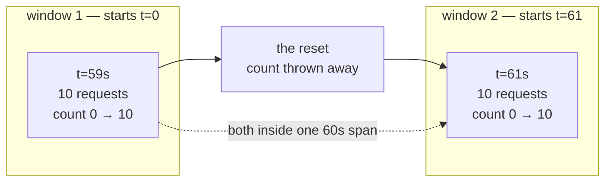

# 1.2 — The burst every counter approved

## One-line answer

The obvious per-minute counter — an integer and the time the current minute started — allows
**twenty** requests through a limit of ten, and refuses none of them, because it enforces a rule
about calendar minutes rather than about any sixty seconds.

## The story

The library near you lends three books at a time and the loan resets at midnight.

You are moving house on Saturday and you want something to read in the new flat. At 11:55 on Friday
night you borrow three books. You walk to the end of the road, wait, and at 12:05 you walk back in
and borrow three more.

The librarian scans them without a word. Nothing is wrong. The screen says you have three books out,
because the screen was cleared at midnight and it only knows about what you took after that.

You now have six library books in a bag, which is twice what the rule allows, and you got them ten
minutes apart from a system that was working exactly as designed. Nobody made a mistake. The rule
was never enforced on "any given period"; it was enforced on "since midnight", and you simply
stepped across the moment when the counting started again.

## The idea in plain language

The counter in that story is called a **fixed window**, and it is what almost everybody writes
first, because it is the cheapest thing that could possibly work.

It keeps two values: how many requests have been made, and when the current window began. When a
request arrives it asks whether the window has aged past its span. If it has, it throws the count
away and starts again from zero. Then it checks the count against the limit.

That is genuinely a rate limiter. It will stop a client that sends continuously. What it cannot do
is stop a client that sends **at the seam**, because at the seam it deliberately forgets everything.

The rule you meant, from [1.1](1.1-a-ceiling-is-a-window-not-a-number.md), was *no sixty seconds
anywhere contains more than ten requests*. The rule a fixed window enforces is *no window that
started when I happened to reset contains more than ten requests*. Those two sentences agree
almost everywhere, and where they disagree is exactly where the trouble is: **the worst case is
twice the limit, and it happens in the two seconds around a boundary.**

The reason this matters more for an agent than for a web server is that agents burst by nature. A
graph that fans out (which [Day 54](../../../day-54-sequential-parallel-loop/LESSON.md) built) fires
its branches together. A nightly job wakes at a fixed time. Neither of those spreads its requests
politely across a minute; both arrive in a clump, and a clump landing on a boundary is precisely the
input that breaks this counter.

## Why Sutra needs it

The router is going to ask a lane "have you got room?" thousands of times, and it is going to
believe the answer. If the answer comes from a fixed window, the router is confidently wrong twice a
minute, and the symptom is not a warning in your logs — it is a `429` from the provider that your
own counters say should not have happened.

That confusion is expensive to debug because the two sides disagree about reality. Your dashboard
says you sent ten. The provider says you sent twenty. Both are telling the truth about different
windows. [5.1](../05-failure-lab/5.1-the-tally-that-counts-only-sales.md) is a different way to
arrive at the same disagreement, and once you have seen both you will recognise the shape.

## The mechanism

`lab/windows.py` runs the library story with numbers. It fires a full burst at fifty-nine seconds,
then another full burst at sixty-one seconds, and reports what each counter allowed.

```python
def burst(counter: Fixed | Sliding, clock: Clock, at: float, n: int) -> int:
    """Try `n` requests at instant `at`. Return how many the counter allowed."""
    clock.now = at
    allowed = 0
    for _ in range(n):
        try:
            counter.take()
            allowed += 1
        except Refused:
            break
    return allowed
```

**Line by line:**

- `clock.now = at` sets the time directly rather than sleeping. The experiment is about what happens
  at fifty-nine and sixty-one seconds, and the only honest way to be exactly there is to say so.
- The loop `break`s on the first refusal rather than continuing. A real client stops when it is told
  no; counting how many *more* it could have been refused would measure nothing.
- The counter is passed in, so the identical function drives both implementations. If the two runs
  differed in any way other than the class under test, the comparison would prove nothing.

Run it:

```bash
cd days/day-70-the-quota-router/lab
uv run python windows.py
```

**Line by line:**

- No arguments means the `Fixed` counter — the naive one, and the default deliberately, because
  this is the version the reader is most likely to have written.

Measured on 2026-09-06:

```text
limit 10 requests per 60s, fixed window

  t=59s   asked 10   allowed 10
  t=61s   asked 10   allowed 10

  allowed across the 2s from t=59 to t=61:  20
  the limit for any 60s window:              10
  OVER by 10 requests, and no counter ever said no
```

**Twenty requests inside a two-second span, against a limit of ten per minute.** Not one of them was
refused. There is no error to catch, no warning to log, no exception anywhere in that run. From
inside the process everything worked.

The last line is the one to sit with: *no counter ever said no*. This is not a limiter that failed
to stop an abusive client. It is a limiter that **approved** the burst, and would approve it again
tomorrow, and will keep approving it until the provider starts refusing and somebody goes looking
for a bug in the wrong place.

Here is the same two seconds drawn out:



The dotted line is the rule that was actually broken. Neither window can see it, because neither
window is looking at that span — and the span nobody is looking at is the span the provider meters.

## When it breaks

The break is silent by construction, so the way you meet it is from the other side. The lane refuses
at a moment your own numbers say is impossible:

```text
429 gemini: minute window exhausted, retry-after 55s
```

You look at your dashboard. It says nine requests this minute against a limit of ten. You look
again a minute later; still nine. The graph is green and the provider is refusing.

The smallest fix is not to add a safety margin, and this is worth saying plainly because adding a
margin is what people do. Dropping your local limit from ten to eight does not fix a boundary
problem; it moves it, so the burst is sixteen instead of twenty, and you have paid twenty per cent of
your quota for a bug that is still there. The fix is to change what the counter remembers, which is
[1.3](1.3-the-counter-that-remembers-when.md).

There is also a quieter way to reach this. The `Fixed` counter resets lazily, inside `remaining()`:

```python
def remaining(self) -> int:
    """Requests this counter believes are still available right now."""
    if self.clock.now - self.window_start >= self.span:
        self.window_start = self.clock.now
        self.used = 0
    return self.limit - self.used
```

**Line by line:**

- The reset happens on **read**, not on a timer. That is the usual implementation and it is the
  right one for a single process — no background task, no drift.
- `self.window_start = self.clock.now` is the subtle line. The new window starts *when somebody
  asked*, not on a clock boundary. So two processes asking at different moments have differently
  aligned windows, and a client that goes quiet for two minutes gets a window starting from its next
  request rather than from any shared grid.
- The consequence is that this counter's boundaries are not even stable within one deployment, which
  makes the twenty-through-ten burst reproducible in production and very hard to reproduce on
  purpose.

## In production

**What a professional writes instead.** Nobody defends the fixed window on correctness; it survives
because it is cheap. The two things done in practice are the sliding log of
[1.3](1.3-the-counter-that-remembers-when.md), when the limits are small enough that storing a
timestamp per request is nothing, and the **sliding window counter** — an approximation that keeps
the current window's count and the previous window's count and blends them by how far into the
current window you are. It is one extra integer and it removes most of the boundary error. For
Sutra's ceilings, which are measured in tens per minute, the exact log is simpler and cheaper than
the approximation, so this day uses it.

**What degrades at scale.** The boundary burst gets worse the more clients you have, because they do
not share a boundary. Ten processes with independently aligned fixed windows do not produce a burst
of twice the limit at one instant; they produce a smear of over-limit moments spread across the
minute, which is harder to see and just as expensive. This is the same problem
[6.1](../06-in-production/6.1-one-till-two-cashiers.md) solves by making the counter shared.

**The failure mode that only appears with real traffic.** Under light load you will never see it.
The burst requires ten requests to arrive within a second or two of a boundary, and a system doing
one request every few seconds simply does not do that. Then you add a fan-out node, or a nightly
batch, or a retry storm, and the traffic shape changes from a trickle to a clump — and a limiter
that was adequate for a year starts producing `429`s that nobody can explain, with no code change to
blame.

**The review comment a senior engineer leaves:** *"This resets `used` to zero inside `remaining()`.
That is a fixed window and it permits `2 × limit` across a boundary. Our fan-out nodes fire together,
so we will hit exactly that shape. Either switch to a timestamp deque or use the two-counter
approximation, but do not just lower the limit — that hides it at the cost of real quota."*

**The interview question:** *"How would you implement a per-minute rate limit?"* The answer that
shows experience does not start with an implementation: *"The first question is whether the limit
means calendar minutes or any sixty seconds, because the naive counter enforces the first and every
provider means the second. I wrote the naive one and measured it: ten requests at fifty-nine seconds
and ten more at sixty-one, twenty inside two seconds against a limit of ten, and it refused none of
them. Then I kept a timestamp per request and dropped the ones older than the span, which costs a
deque and gets the rule right. For small limits like a free tier's, that exact version is cheaper
than reasoning about the approximation."*

## Check yourself

```bash
cd days/day-70-the-quota-router/lab
uv run python windows.py
```

Change `burst(counter, clock, 61.0, LIMIT)` to `burst(counter, clock, 120.0, LIMIT)` and run it
again. The over-count disappears. Then work out why that run proves nothing about whether the
counter is correct.

**Out loud, without scrolling up:** explain why lowering the limit from ten to eight does not fix
this, and say what the fixed window forgets at the moment it resets.

**Next:** [1.3 — The counter that remembers when](1.3-the-counter-that-remembers-when.md).
