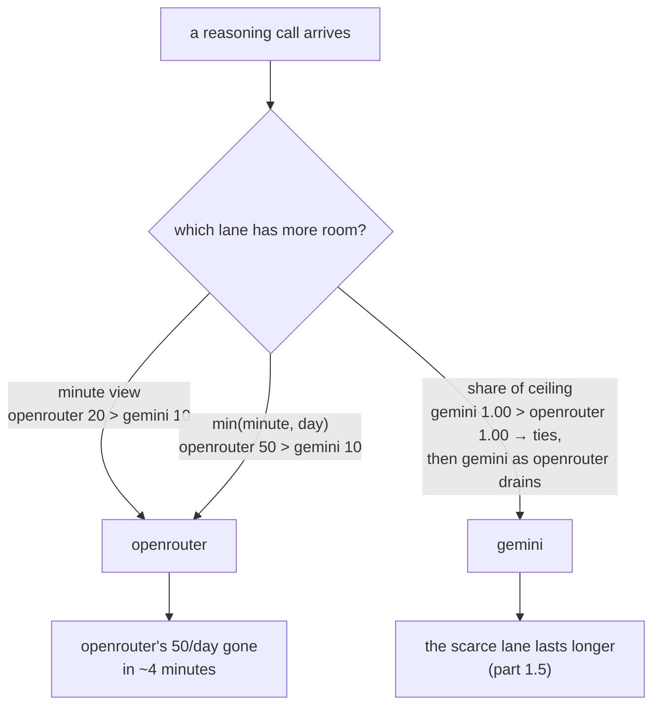

# 1.4 — Two windows, and the one that bites last

## One-line answer

A router that compares lanes on their minute window alone spends the scarcest daily allowance in the
fleet first: routing 300 reasoning calls by minute headroom empties OpenRouter's whole day in **4.1
minutes** and drops 78 requests, while the same run judged on both windows drops 75.

## The story

Your bank card has two limits on cash withdrawals, and you only ever think about one of them.

There is a per-transaction limit — ten thousand at a time — and a daily limit, twenty-five thousand
across the whole day. For years you only meet the first one. You ask for fifteen and the machine
gives you ten, so you take ten, and you have learned that the number is ten.

Then comes the Saturday you are paying a deposit in cash. You take ten in the morning from the
machine near the market. Ten more at lunchtime from the one by the station. In the afternoon you go
back for five, and the screen says no.

You stand there confused, because five is well under ten and ten is the limit you know. You try
another machine, because the first one must be broken. Same answer.

Nothing is broken. You met the other limit — the one you had never bumped into, the one that does
not reset when you walk to a different machine or wait ten minutes. It resets tomorrow.

## The idea in plain language

Every free tier Sutra uses has both shapes at once: **requests per minute** and **requests per day**.
They behave completely differently and the difference is not a detail.

- The **minute** window clears constantly. Wait a minute and it is empty again. It is a
  *throughput* limit: it shapes how fast you may go.
- The **day** window barely clears at all during a working session. It is a *budget*: it decides how
  much you may do in total before tomorrow.

[Day 24](../../../day-24-token-accounting-and-budgets/parts/02-two-ceilings/2.1-two-ceilings-one-clears.md)
made the first distinction — two ceilings, and only one of them clears while you wait. This part is
what that costs a **router**, which is a different problem from what it costs a caller. A caller that
hits the minute ceiling waits. A router that hits the minute ceiling *moves to another lane* — and
in doing so it makes a decision about the daily budget of the lane it moves to, usually without
knowing it.

The trap is that the two windows rank the lanes differently. Consider the two lanes that can do
Sutra's reasoning work:

| Lane | Requests per minute | Requests per day |
| --- | --- | --- |
| gemini | 10 | 250 |
| openrouter | 20 | 50 |

On a minute view, OpenRouter is twice as roomy as Gemini and wins every comparison. On a day view it
has a fifth of Gemini's allowance and is the scarcest thing Sutra owns. A router looking at one
number is going to pour work into the lane it should be conserving.

## Why Sutra needs it

Sutra's day is not a burst, it is a shift. The desk answers tickets for hours, and the nightly
re-triage that Day 73's ambient job will run uses the same allowances. A policy that
optimises the next sixty seconds and ignores the next twenty-four hours will finish the morning
strongly and have nothing left after lunch.

This is also where the router stops being a load balancer. A load balancer's resources refill
continuously; it can be greedy because being greedy costs nothing later. A quota router is spending
from a budget that does not refill until midnight, which makes every choice partly a choice about
the future. [4.3](../04-when-a-lane-says-no/4.3-every-lane-dry.md) is what the end of that budget
looks like.

## The mechanism

`lab/twowindows.py` sends 300 reasoning calls, one every four seconds, and lets you choose how the
router compares lanes. Only the comparison changes between runs.

```python
def by_minute(lane: Lane) -> float:
    """Requests left in the minute window. Ignores the daily ceiling entirely."""
    return float(lane.minute.remaining())


def by_requests(lane: Lane) -> float:
    """Requests left in the tighter of the two windows, counted absolutely."""
    return float(lane.headroom())
```

**Line by line:**

- Both return `float` although both are counts, so that the third comparison in
  [1.5](1.5-twelve-left-means-two-different-things.md) — which is genuinely fractional — can be
  swapped in without changing the calling code. The router's `max(...)` never learns which one it
  is using.
- `by_minute` deliberately reads `lane.minute.remaining()` rather than `lane.headroom()`. That single
  substitution is the bug this part is about, and it is one word long in a real codebase.
- `by_requests` is `lane.headroom()`, which is `min(minute, day)` from
  [1.1](1.1-a-ceiling-is-a-window-not-a-number.md). It is the obvious correct answer, and
  [1.5](1.5-twelve-left-means-two-different-things.md) shows it is still not the best one.

The router is one line, and the mode selects the key:

```python
def pick(lanes: list[Lane], mode: str) -> Lane | None:
    """The roomiest capable lane under one way of measuring room."""
    options = [ln for ln in lanes if ln.can(SKILL) and not ln.cold() and ln.headroom() > 0]
    return max(options, key=MODES[mode]) if options else None
```

**Line by line:**

- The filter uses `headroom() > 0` in every mode, including the minute-only one. That is deliberate
  and it makes the experiment *fairer* to the naive policy: even the bad router is prevented from
  choosing a lane with nothing left today. What differs between the modes is only which lane it
  **prefers** among usable ones, so the measured gap is caused by preference alone.
- `ln.can(SKILL)` is the capability filter that [2.2](../02-choosing-a-lane/2.2-the-lane-that-cannot-do-the-job.md)
  explains. Here it is what reduces the fleet to the two lanes in the table above.
- `max` with no tie-breaking returns the first maximum, so ties resolve by declaration order. With
  two lanes and integer headroom, ties are common, and leaving the behaviour to `max` rather than
  randomising keeps the run reproducible.

Run both:

```bash
cd days/day-70-the-quota-router/lab
uv run python twowindows.py
uv run python twowindows.py --both
```

**Line by line:**

- No flag is the minute-only comparison — the naive router.
- `--both` compares `min(minute, day)`. Everything else about the two runs is identical: same
  arrivals, same spacing, same lanes, same seed.

Measured on 2026-09-06, minute-only:

```text
300 reasoning calls, one every 4s
comparing lanes by: minute window only

  lane         served   rpm     rpd
  gemini          172    10     250
  openrouter       50    20      50

  served 222, dropped 78
  openrouter spent its whole day by t=244s (4.1 min in)
```

And judged on both windows:

```text
300 reasoning calls, one every 4s
comparing lanes by: min(minute, day) in requests

  lane         served   rpm     rpd
  gemini          175    10     250
  openrouter       50    20      50

  served 225, dropped 75
  openrouter spent its whole day by t=284s (4.7 min in)
```

Two things in those numbers, and the second is more important than the first.

**The improvement is small.** Three more requests served out of three hundred. Looking at both
windows is correct and it is not a fix. Anyone expecting the daily view to rescue the run will be
disappointed, and it is better to be disappointed here than in production.

**OpenRouter's entire daily allowance is gone either way**, in under five minutes of a shift that is
meant to last hours. `min(minute, day)` deferred the moment by about thirty-five seconds. It did not
prevent it, because while OpenRouter has fifty left today and Gemini has ten left this minute,
`min` still says fifty is bigger — and it keeps saying so until OpenRouter is nearly empty.

That is the finding, and it is a negative one: **comparing absolute headroom is not enough, because
fifty out of fifty and fifty out of two hundred and fifty are not the same fifty.**
[1.5](1.5-twelve-left-means-two-different-things.md) changes the unit and measures what that buys.



## When it breaks

The refusal names the window, which is the only reason this is debuggable at all:

```text
429 openrouter: day window exhausted, retry-after 86200s
```

`86200` seconds is a little under twenty-four hours. That number is the whole story: this is not a
lane to retry, back off from, or jitter around. It is gone until tomorrow, and any retry ladder
applied to it — the 1s, 2s, 4s, 8s of
[Addendum 02's §6](../../../day-24-token-accounting-and-budgets/parts/02-two-ceilings/2.3-denominated-in-quota-not-dollars.md)
— is fifteen seconds of pointless waiting followed by the same answer.

The dangerous version of this break is the one where the message does **not** say which window,
because then `retry-after` is the only clue and a caller that ignores it will treat a day-long outage
as a transient blip. That is why `Refused` in `_lane.py` carries the window name as a field rather
than only in the formatted string.

## In production

**What a professional writes instead.** They separate the two windows in the config, in the metrics
and in the alerts, because they mean different things operationally. Minute-window exhaustion is
normal and self-healing; it should shape traffic and never page anybody. Day-window exhaustion is an
outage with a known end time, and it should page somebody *before* it happens — at seventy or eighty
per cent — because once it lands there is no engineering response available except waiting.

**What degrades at scale.** The daily window is where multi-tenancy bites. A minute window shared
across tenants recovers constantly, so one noisy tenant costs the others a moment. A daily window
shared across tenants means one tenant's batch job can consume the entire company's allowance before
anyone is awake, and there is no way to give it back. Serious systems therefore sub-divide the daily
budget per tenant even when the provider does not, which is cost attribution — see
[6.2](../06-in-production/6.2-the-gauge-shows-what-is-left.md).

**The failure that only appears with real traffic.** The daily window's damage is invisible on the
timescale anyone tests at. Every integration test, every staging run, every demo finishes inside a
minute, so the only ceiling ever exercised is the minute one. The daily ceiling is met for the first
time in production, usually on the first day the system does real volume, and it presents as a total
outage rather than as slowness.

**The review comment a senior engineer leaves:** *"`pick` sorts on `minute.remaining()`. That will
drain OpenRouter's fifty-a-day inside the first ten minutes of every shift and leave us with nothing
for the evening. Sort on the tighter window at least, and put a separate alarm on daily consumption
— by the time the minute alarm fires, the daily one has already cost us the rest of the day."*

**The interview question:** *"You are rate limited by requests per minute and per day. Which do you
optimise for?"* The answer that shows scars: *"They are different problems. The minute limit shapes
throughput and I solve it by spreading load; the daily limit is a budget and I solve it by
conserving. The mistake I made was routing on minute headroom alone — I measured it, and it emptied
my scarcest provider's whole daily allowance in four minutes of a multi-hour shift. Fixing the
comparison to the tighter of the two windows recovered three requests out of three hundred, which
told me the comparison was still wrong: absolute headroom is not comparable across providers with
different ceilings, so I switched to comparing each lane's remaining share of its own limit."*

## Check yourself

```bash
cd days/day-70-the-quota-router/lab
uv run python twowindows.py
uv run python twowindows.py --both
```

Now change `REQUESTS` from `300` to `60` and run both again. The gap between the two policies
disappears. Say why, in one sentence, before you look at the lane table.

**Out loud, without scrolling up:** explain why a minute ceiling and a day ceiling need different
alarms, and say which one you would want to be paged about.

**Next:** [1.5 — Twelve left means two different things](1.5-twelve-left-means-two-different-things.md).
