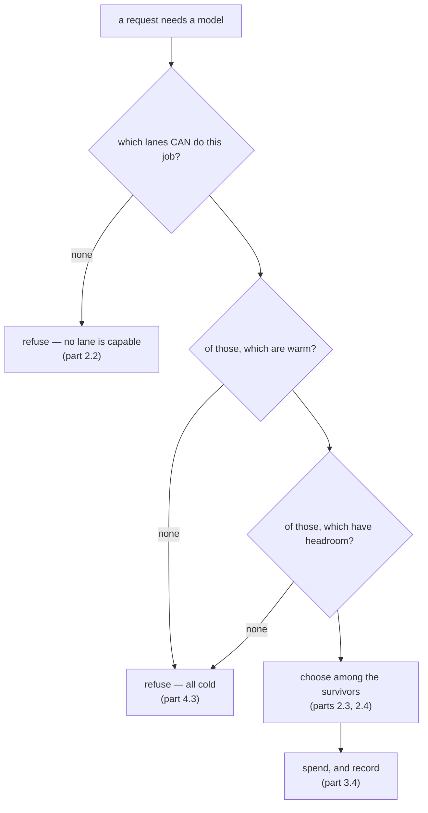

# 2.1 — Headroom is not a preference

## One-line answer

Routing is a **scheduling** decision over a resource that runs out and refills on a clock, not a
choice about which model you like best — and the moment you write it as a preference you have built
something that cannot survive its own busiest hour.

## The story

You go into a bank branch to deposit a cheque. There are five counters open and a single queue.

You have been here before and you know that the woman at counter three is quick and never gets the
paperwork wrong. So when you reach the front, you let the person behind you go to counter one, and
then the next person go to counter four, because you are waiting for three.

For a few minutes this looks clever. Then the queue behind you builds up, someone says something, and
the guard asks you to move along. Counter three is not free and the two people you waved past are
already done.

The mistake was not that you were wrong about counter three. You were right; she *is* the best.
The mistake was answering the wrong question. You answered *"who is best?"* when the question the
queue was asking was *"who is free?"* — and in a busy branch, those two questions have different
answers almost all the time.

## The idea in plain language

There are two completely different questions people mean when they say "routing", and this day is
about the second one.

- **Which model is best for this job?** That is a *quality* question. It is answered by measuring,
  once, offline — which is what [Day 9](../../../day-09-four-free-providers/parts/04-the-benchmark/4.2-the-mileage-on-the-sticker.md)
  did with its four-provider benchmark. The answer is stable and lives in a table.
- **Which lane can serve this request right now?** That is a *scheduling* question. It is answered
  per request, from live state, and the answer changes second by second.

A **lane**, as [1.1](../01-what-headroom-is/1.1-a-ceiling-is-a-window-not-a-number.md) defined it,
is a quota pool with limits attached. Scheduling over lanes has three properties that a preference
does not:

1. **The resource is consumed.** Choosing a lane makes it less available to the next request. A
   preference has no such cost; it is the same decision every time.
2. **It refills on a clock, not on demand.** You cannot ask for more. You can only wait, and how long
   you wait depends on which window emptied ([1.4](../01-what-headroom-is/1.4-two-windows-and-the-one-that-bites-last.md)).
3. **The choice is constrained, not free.** Some lanes cannot do some jobs at all, which is
   [2.2](2.2-the-lane-that-cannot-do-the-job.md), and that turns this into a constrained assignment
   problem rather than a sort.

Put those together and the shape of the thing is clear: a quota router is a **scheduler with a
budget**, and the closest familiar relative is not a load balancer but a rota.

The distinction is not academic, because it changes what "good" means. A preference-shaped router is
judged by whether it picks the best model. A scheduling-shaped router is judged by how much work the
fleet completes before it runs out — and those two scores disagree exactly when it matters.

## Why Sutra needs it

Sutra has four lanes and a workload bigger than any one of them.
[Day 9](../../../day-09-four-free-providers/parts/05-routing/5.1-which-queue-do-you-join.md) already
raised the question of which queue to join and left it as a comparison; this day has to answer it as
a mechanism, because Phase 10's gate says *quota router live* and a preference is not a router.

Everything downstream depends on getting the framing right. If routing is a preference, it belongs in
the agent's configuration — one line naming a model, chosen once. If routing is scheduling, it cannot
live there at all, because the agent has no idea what the rest of the system has spent. That argument
decides where the code goes, and it is [3.1](../03-the-plugin/3.1-where-a-router-has-to-stand.md).

## The mechanism

The mechanism is a shape, not yet code, so here is the shape:



Read the order, because the order is the design. **Capability first, availability second, preference
last.** Each stage can only ever shrink the set, and each has its own refusal, which is why
[4.3](../04-when-a-lane-says-no/4.3-every-lane-dry.md) can tell a caller *why* nothing was available
rather than only that nothing was.

In `lab/_router.py` the first three stages are one comprehension:

```python
def candidates(self, skill: str) -> list[Lane]:
    """Capable, warm, and believed to have headroom."""
    return [ln for ln in self.lanes if ln.can(skill) and not ln.cold() and ln.headroom() > 0]
```

**Line by line:**

- `ln.can(skill)` is the capability filter, and it is **first** deliberately. A lane that cannot do
  the job is not a fallback, however much room it has, and putting this test anywhere later invites
  the bug in [4.4](../04-when-a-lane-says-no/4.4-the-part-that-will-do.md) where an incapable lane
  answers because it was the only thing left.
- `not ln.cold()` skips lanes still inside a `retry-after` from a previous refusal
  ([4.2](../04-when-a-lane-says-no/4.2-a-cold-lane-not-a-broken-one.md)). This is the router
  remembering; without it, every request re-discovers the same refusal.
- `ln.headroom() > 0` is section 1's arithmetic, finally being used.
- The three tests are cheap and pure, so this can run per request without a cache. It matters that
  none of them performs I/O: a routing decision that needs a network call to decide where to make a
  network call is a design that fails when the network is the problem.
- Returning a **list** rather than the single best lane is the important choice. Selection is a
  separate step, and keeping the survivors lets [2.4](2.4-everyone-read-the-same-board.md) sample
  among them. A `candidates` that returned one lane would have quietly made the policy decision here,
  where it cannot be swapped or measured.

## When it breaks

The characteristic break of a preference-shaped router is that it does not break at all until it
does, and then it breaks completely. The lane is named in configuration, every request goes to it,
and one day the shift is busier than the ceiling:

```text
429 gemini: minute window exhausted, retry-after 55s
```

There is no other lane in the code path, so there is nowhere to go. The system does not degrade; it
stops. Three other providers sit unused with full allowances, and nothing in the design can reach
them, because the model was chosen at configuration time and the request arriving now has no say.

[3.4](../03-the-plugin/3.4-answering-instead-of-the-agent.md) measures exactly this: 24 tickets, all
of them to the agent's own lane, against a ceiling of ten a minute.

## In production

**What a professional writes instead.** They keep the two questions in two places. A static table
says which lanes are *allowed* for each kind of work, derived from a benchmark and reviewed when
models change. A live component decides which of those to use right now. The table is code review;
the decision is runtime. Collapsing them into one config line labelled `MODEL=` is the thing this
part exists to prevent.

**What degrades at scale.** A scheduler's job gets harder as utilisation rises, and the interesting
property is that it gets harder *suddenly*. Below about half the fleet's capacity almost any policy
works and the whole of section 2 is a waste of effort. Above it, choices start to matter, and past
about ninety per cent nothing helps because the constraint is capacity
([2.4](2.4-everyone-read-the-same-board.md) measures that band exactly). Knowing which regime you are
in is more useful than any individual policy.

**The failure that only appears with real traffic.** Preference-shaped systems pass every test,
because tests run one request at a time and one request always fits. The failure needs
*concurrency* and *sustained load* together, which is precisely the combination a test suite is
designed not to have.

**The review comment a senior engineer leaves:** *"This picks the model in the agent constructor,
which means the choice is made before we know anything about what the fleet has left. It will work
until the first busy hour. Move the decision to request time and give it the live counters — the
agent should say what kind of work this is, not which provider does it."*

**The interview question:** *"How do you choose between several LLM providers at runtime?"* An answer
that has done it: *"I separate quality from availability. Which providers are good enough for a given
job is a measurement I make offline and keep in a table, because it is stable. Which of those to call
right now is a scheduling decision against live quota, and it has to be made per request, because the
resource is consumed and refills on a clock. The mistake I made first was putting the model name in
the agent's config, which is a preference — it worked until the load exceeded one provider's
per-minute ceiling, and then it had nowhere to go while three other providers sat idle."*

## Check yourself

```bash
cd days/day-70-the-quota-router/lab
python -c "
from _lane import Clock, fleet
from _router import Router
c = Clock(0.0); r = Router(lanes=fleet(c), clock=c)
print('reason  :', [l.name for l in r.candidates('reason')])
print('classify:', [l.name for l in r.candidates('classify')])
"
```

Two different jobs, two different candidate sets, from the same fleet at the same instant. Now set
`c.now = 0.0` and call `r.send('reason')` eleven times, then ask for candidates again.

**Out loud, without scrolling up:** state the difference between "which model is best" and "which
lane is free", and say which of the two changes between two requests one second apart.

**Next:** [2.2 — The lane that cannot do the job](2.2-the-lane-that-cannot-do-the-job.md).
