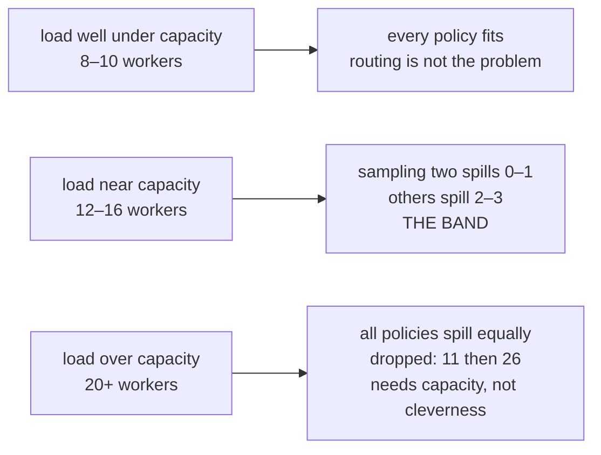

# 2.4 — Everyone read the same board

## One-line answer

When fourteen workers decide from one snapshot, sampling two lanes and keeping the emptier spills
**zero** requests while taking the single best lane spills one and the crude policies spill two and
three — and outside a narrow band of load, none of it matters.

## The story

A train is cancelled and the board changes.

Two hundred people are standing on the concourse looking up at the same screen at the same moment. It
says the 18:40 to the same city is leaving from platform 6. Everybody reads it, everybody works out
that platform 6 is the answer, and everybody starts walking to platform 6.

The train fills in ninety seconds. The people at the back of the walk arrive to a train that is
already full, and they watch it leave. Platform 9 has a slower service to the same place, half empty,
which every one of them would have taken happily if they had known.

Nobody was foolish. Everybody did the correct thing given the information on the board. The problem
is that the board told two hundred people the same thing at the same instant, and the correct thing
stopped being correct the moment the second person acted on it.

## The idea in plain language

[2.3](2.3-with-perfect-information-greedy-is-fine.md) held two conditions fixed: one decider, and
information that is true when you act on it. This part breaks the second, which in practice means
breaking the first.

Call it **staleness**. Several workers read the lanes' headroom, all of them see the same numbers,
and then they all commit. The first one to act was working from truth. The fourteenth was working
from a snapshot that thirteen requests had already invalidated.

The policy that suffers most from this is the one that looks smartest. "Take the lane with the most
headroom" is a function of the snapshot alone, so every worker computes the **same answer**, and they
all pile onto one lane — the platform-6 stampede, exactly. Being clever about a shared snapshot
concentrates the herd.

The fix, and it is counter-intuitive, is to make the decision **partly random**:

> Pick two capable lanes at random. Compare only those two. Use the emptier.

Randomness stops everyone choosing identically. Comparing two, rather than committing to one, stops
the choice being blind. Neither half works alone: pure random spreads but ignores load, pure best
uses load but concentrates.

That rule is not folklore, and it is not this day's invention. It is a result with a proof, and the
proof says the improvement is not marginal but a change in the *growth rate* of the worst-loaded
lane. Two samples are enough; three barely help.

## The paper behind it

> **The power of two choices in randomized load balancing** · `doi:10.1109/71.963420` ·
> IEEE Transactions on Parallel and Distributed Systems 12(10), 1094–1104 · 2001 ·
> <https://doi.org/10.1109/71.963420>

It showed that assigning each item to the emptier of **two** randomly sampled bins, rather than to
one random bin, reduces the maximum load from growing like `log n / log log n` to growing like
`log log n` — an exponential improvement from one extra sample.

The mechanism, the proof sketch, the demo and what the field kept are in
[the paper part](../../papers/01-the-power-of-two-choices.md), which is written to be read after
this section.

## Why Sutra needs it

Sutra will not stay single-process. The triage graph fans out
([Day 54](../../../day-54-sequential-parallel-loop/LESSON.md) built parallel branches), the ambient
job on Day 73 runs beside the interactive desk, and any deployment with more than one replica has as
many deciders as replicas. Each of those makes the snapshot older than the decision.

More immediately, this is the argument for the shape of `Router.choose` in section 3. Without this
part, sampling two lanes looks like an eccentric choice that
[2.3's](2.3-with-perfect-information-greedy-is-fine.md) benchmark actively argues against.

## The mechanism

`lab/stale.py` gives every worker in a round the same snapshot, taken before any of them commits.

```python
def snapshot(lanes: list[Lane]) -> dict[str, int]:
    """Headroom as it looked at the top of the round: what every worker in the round sees."""
    return {ln.name: ln.headroom() for ln in lanes}
```

**Line by line:**

- It returns a plain `dict` of numbers, not the lanes themselves. If it returned the lane objects the
  workers could read live counters through them and the staleness would vanish — the copy *is* the
  experiment.
- One snapshot per round, shared by every worker in that round, models the real thing well: a cache
  with a short time-to-live, or a counter read at the start of a batch.

The choice then uses only the frozen view:

```python
def choose(policy: str, lanes: list[Lane], view: dict[str, int], rng: list[int]) -> Lane | None:
    """Pick a lane using only `view` - the stale snapshot - never the live counters."""
    options = [ln for ln in lanes if ln.can(SKILL) and not ln.cold() and view[ln.name] > 0]
    if not options:
        return None
    if policy == "first":
        return options[0]
    if policy == "best":
        return max(options, key=lambda ln: view[ln.name])
    if policy == "random":
        return options[rng.pop(0) % len(options)]
    if len(options) == 1:
        return options[0]
    a = options[rng.pop(0) % len(options)]
    b = options[rng.pop(0) % len(options)]
    return a if view[a.name] >= view[b.name] else b
```

**Line by line:**

- Every branch reads `view[...]`, never `ln.headroom()`. That single discipline is what makes this a
  staleness experiment rather than a repeat of [2.3](2.3-with-perfect-information-greedy-is-fine.md).
- `ln.cold()` still reads live state, because a cold lane is a fact the worker would genuinely know —
  it got the refusal itself. Only *headroom* is stale, which is the realistic split.
- The `len(options) == 1` guard before sampling matters: with one candidate, drawing twice would
  consume two values from `rng` and desynchronise the sequence against the other policies, so the
  comparison would no longer be like-for-like.
- The two draws in the `two` branch may pick the same lane. The paper allows this — sampling is with
  replacement — and forbidding it would change the distribution being tested.
- `>=` rather than `>` in the final comparison makes ties resolve to the first sampled lane, which is
  itself random. That is what breaks the declaration-order tie-breaking that
  [1.5](../01-what-headroom-is/1.5-twelve-left-means-two-different-things.md) found on a fresh fleet.

Run it:

```bash
cd days/day-70-the-quota-router/lab
uv run python stale.py
```

**Line by line:**

- The default is fourteen workers over four rounds — a size chosen because it sits inside the band
  the sweep below identifies, not because it flatters the answer.

Measured on 2026-09-06:

```text
14 workers x 4 rounds = 56 requests
every worker in a round decides from the same snapshot

  policy    served  spilled  dropped
  first         54        2        0
  best          55        1        0
  random        53        3        0
  two           56        0        0

  spilled = sent to a lane the snapshot said was free and the counter had emptied
```

Fifty-six out of fifty-six for `two`, with **no spill at all**. Every other policy sends requests to a
lane the snapshot said was free and the counter had already emptied — those are `429`s that the
router's own numbers approved.

Now the honest part, which is the sweep across load:

```bash
uv run python stale.py --sweep
```

Measured on 2026-09-06:

```text
  spilled requests, by how many workers decide together in one round

   workers   first    best  random     two   dropped
         8       1       0       0       0         0
        10       0       0       1       0         0
        12       2       1       1       0         0
        14       2       1       3       0         0
        16       3       2       3       1         0
        20       4       3       4       3        11
        24       4       4       4       4        26

  dropped = the fleet had no headroom at all; no policy can fix that column
```

Three regimes, and naming them is the most useful thing in this part.

- **Eight to ten workers — nothing separates.** The fleet is roomy relative to a round, so any policy
  fits. Effort spent on routing here is wasted.
- **Twelve to sixteen — the policy earns its keep.** `two` spills zero, zero, then one, while the
  others spill two to three. This is the band, and it is narrow.
- **Twenty and above — nothing helps.** The `dropped` column takes over: 11, then 26. The fleet has
  no headroom at all, and the four policies converge on spilling four apiece. At this point the
  answer is capacity, backpressure or a queue, not a better `key=` function.

That is the complete claim, and it is much more useful than "sampling two is better". **Routing
policy matters in a band around capacity, and the band is not wide.** Below it, ship the simple
thing. Above it, no policy will save you.



## When it breaks

The result above depends on the snapshot being shared. Give each worker its own fresh read and the
advantage disappears entirely:

```bash
uv run python stale.py --workers 1 --rounds 56
```

**Line by line:**

- One worker per round means the snapshot is taken immediately before that worker's single decision,
  so it is never stale.
- Fifty-six rounds keeps the total request count identical to the default run, so the two are
  comparable.

Measured on 2026-09-06:

```text
1 workers x 56 rounds = 56 requests
every worker in a round decides from the same snapshot

  policy    served  spilled  dropped
  first         56        0        0
  best          56        0        0
  random        56        0        0
  two           56        0        0

  spilled = sent to a lane the snapshot said was free and the counter had emptied
```

All four perfect. The sampling policy is not better in general — it is better **under staleness**, and
with the staleness removed there is nothing to be better than. Anyone who ships two-choices without
being able to say which condition makes it worth having has cargo-culted it, and will keep it after
the condition goes away.

## In production

**What a professional writes instead.** They reduce staleness before they get clever about it,
because staleness is the actual defect. A shared counter with an atomic increment
([6.1](../06-in-production/6.1-one-till-two-cashiers.md)) removes most of it; a short cache
time-to-live bounds it. Sampling two is what you add when you have done both and staleness remains —
which it always does, because the provider's true count is on the other side of a network.

**What degrades at scale.** More workers per snapshot moves you rightwards through those three
regimes, and the middle band does not widen. A system that grows from ten workers to thirty does not
get a bigger payoff from clever routing; it walks straight through the band into the region where
only capacity helps. That is the argument for putting effort into backpressure and queueing rather
than into the `key=` function.

**The failure that only appears with real traffic.** In-flight requests. This lab decrements a lane's
counter the instant a request is routed, but a real model call takes seconds, and if the counter is
only updated on *response* then every request in flight is invisible to every routing decision made
while it flies. That is staleness with a much longer horizon than a snapshot's, and it is why the
counter must be taken on **attempt** — the bug in [5.1](../05-failure-lab/5.1-the-tally-that-counts-only-sales.md).

**The review comment a senior engineer leaves:** *"Two-choices is right, but the snapshot has a
five-second TTL and our calls take three seconds. That means a decision can be made on data older
than the call it is deciding about. Reserve the slot at decision time and release it if the call never
goes out — otherwise the sampling is smoothing over a number that is structurally wrong."*

**The interview question:** *"You have several backends and several workers picking between them.
What goes wrong with 'pick the least loaded'?"* The answer that has seen it: *"Every worker computes
the same answer from the same snapshot, so they all pick the same backend and stampede it. I measured
it with fourteen workers deciding from one snapshot: least-loaded spilled requests onto a lane that
had already emptied, and sampling two at random and taking the emptier spilled none. The important
caveat is that it only matters in a band — with a roomy fleet every policy is fine, and once demand
exceeds capacity all of them spill the same amount and you need more capacity, not a better
algorithm."*

## Check yourself

```bash
cd days/day-70-the-quota-router/lab
uv run python stale.py
uv run python stale.py --sweep
uv run python stale.py --workers 1 --rounds 56
```

Now run `uv run python stale.py --workers 16 --rounds 4` and find the row it corresponds to in the
sweep. Then say which column you would watch to decide whether to buy capacity instead of tuning.

**Out loud, without scrolling up:** explain why the *smartest* policy is the one that stampedes, and
name the condition that has to be true before sampling two is worth anything.

**Next:** [3.1 — Where a router has to stand](../03-the-plugin/3.1-where-a-router-has-to-stand.md).
