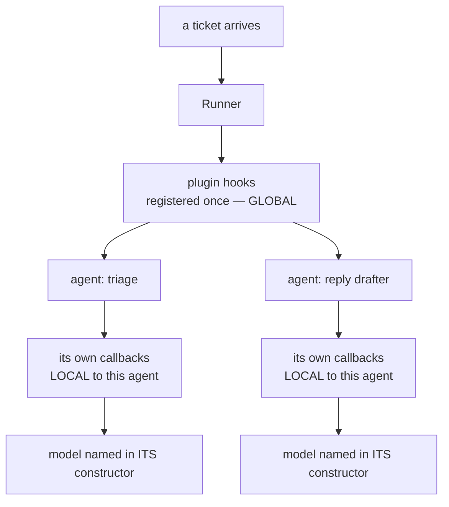

# 3.1 — Where a router has to stand

## One-line answer

A scheduler can only schedule what it can see, so the router cannot live in an agent's configuration
— chosen once, before any request exists — and cannot live in one agent's own callback, which is
local to that agent: it has to be a **plugin registered on the `Runner`**, which is the one place in
ADK that sees every model call a run makes.

## The story

The power cuts at eight in the evening and the building's generator takes over. It can carry about
four flats' worth of load, and there are eight flats.

For the first few evenings nothing goes wrong. Then one night everything stops at once, with a bang
from the metal cupboard by the stairs, and the whole building is dark.

Nobody did anything wrong. The ground floor switched on the water pump. The first floor already had
two air conditioners running. The second floor put an iron on. Each flat knew exactly what it had
switched on, and not one of them knew what the others had.

The generator did not trip because somebody was greedy. It tripped because the only place in the
building where the **total** is a fact is the main board in that cupboard, and every line in the
building passes through it. The flats can each see their own switches. The board sees all of them.

There is a second half to that evening, and it matters more than the first. Somebody now stands at
the board with a notebook and writes down every time a floor draws more. The notebook fills up. The
generator trips again the following week, at exactly the same load, because writing down what is
happening and being able to stop it are two different jobs, and only one of them was given to the
person at the board.

## The idea in plain language

[2.1](../02-choosing-a-lane/2.1-headroom-is-not-a-preference.md) argued that routing is a
**scheduling** decision: a choice about which quota pool can serve this request right now, made from
live state, where every choice consumes something the next request will need. This part turns that
argument into an address in the code.

A scheduler has one absolute requirement. **It has to see every request.** A scheduler that sees
half of them is not conservative or approximate; it is wrong, because the half it cannot see is
spending the same allowance as the half it can. That single requirement disqualifies two of the
three obvious places to put the code.

Three terms first, because the rest of this section is built out of them.

- A **lane** is a quota pool with limits attached — a provider account with a per-minute and a
  per-day ceiling ([1.1](../01-what-headroom-is/1.1-a-ceiling-is-a-window-not-a-number.md)).
- A **callback** is a function the framework calls at a fixed point in a run, so that your code gets
  a say without you rewriting the framework.
  [Day 67's 2.1](../../../day-67-guardrail-callbacks/parts/02-where-a-check-stands/2.1-the-eight-places-you-can-stand.md)
  laid out the eight points ADK offers.
- A **`Runner`** is the object that actually executes a request: you hand it a message, and it drives
  the agent, its tools and its model until there are no more events to emit. Everything that happens
  during one message passes through it.

Now the three candidate locations, and what each of them can see:

| Where the choice could live | When it is made | What it can see |
| --- | --- | --- |
| `model=` in the `Agent` constructor | once, at start-up | nothing — no request, no counters, no fleet |
| `before_model_callback` on one agent | per call, for that agent only | that one agent's calls |
| a plugin on the `Runner` | per call, for every agent | every model call the run makes |

The first row is the preference-shaped router that 2.1 spent a whole part arguing against. It is
decided before any ticket exists, so it cannot possibly be scheduling.

The second row looks much better and is the one that traps people, because it *is* per request and it
*does* see live state. What it does not see is the other agents. Sutra's desk is not one agent
([Day 54](../../../day-54-sequential-parallel-loop/parts/04-where-they-meet/4.1-the-shape-of-the-triage-flow.md)
built a triage flow out of several), and they all draw on the same four lanes. A router bolted to one
of them is the ground-floor flat deciding about the water pump.

The third row is the answer, and ADK states the difference in one sentence.
<https://adk.dev/plugins/>, checked on 2026-09-06:

> Plugin hooks are *global*. You register a Plugin once on the `Runner`, and its hooks apply
> universally to every Agent, Model, and Tool it manages. In contrast, Agent Callbacks are *local*,
> configured individually on a specific agent instance.

**Global** and **local** are the entire argument of this part. Global is what a scheduler needs; local
is what a per-agent rule gives you. The same page lists what plugins are for, and *policy
enforcement* is on that list beside logging, metrics and caching — a quota router is a policy, and it
is enforced at the model boundary.

There is a second reason the Runner is the right place, and it is the one Sutra has been building
towards since Day 59. A control that the thing it governs can reach around is not a control.
[Day 59's 2.1](../../../day-59-runaway-agents-contained/parts/02-where-a-brake-goes/2.1-a-guard-is-only-a-guard-if-it-is-outside.md)
made the argument for brakes and
[Day 64's 1.1](../../../day-64-approval-gates-build/parts/01-the-policy-is-data/1.1-a-gate-is-a-decision-about-one-action.md)
made it for approval gates. An agent cannot decline to be routed by a plugin, because the routing
happens before the agent's model is ever called, and the agent has no hook that runs earlier —
adk.dev's plugins page says plugin callbacks run **before** agent callbacks.

## Why Sutra needs it

Every remaining part of this day assumes this location. [3.2](3.2-observe-block-answer-instead.md)
is about what the plugin may return, [3.3](3.3-the-field-that-does-not-reroute.md) is about the
tempting shortcut that does not work from there, and
[3.4](3.4-answering-instead-of-the-agent.md) runs the whole thing over 24 tickets. None of those
questions can even be asked until the code has a place to stand.

It also decides something about the shape of Sutra that will not be revisited: the routing logic is
written **once**, and no future agent has to remember to opt in. Day 73's ambient job, whatever
agents it adds, is routed the moment it runs on a Runner that carries this plugin. The alternative —
a callback copied into each new agent — is the bug
[Day 59's 3.1](../../../day-59-runaway-agents-contained/parts/03-brakes-that-do-not-hold/3.1-the-guard-the-agent-can-talk-past.md)
and [Day 64's 1.4](../../../day-64-approval-gates-build/parts/01-the-policy-is-data/1.4-the-guard-that-was-only-added-in-three-places.md)
both measure, arriving for the third time.

## The mechanism

A plugin is a class. You subclass `BasePlugin`, give it a name, and implement the hooks you care
about. Here is the top of the one in `lab/hooks.py`, which is the smallest router this day will
build:

```python
class Router(BasePlugin):
    """Answers the call itself from a chosen lane, instead of letting the agent's model run."""

    def __init__(self, lane: str, observe_only: bool = False) -> None:
        super().__init__(name="router")
        self.lane = lane
        self.observe_only = observe_only
        self.intercepted = 0
```

**Line by line:**

- `BasePlugin` comes from `google.adk.plugins.base_plugin`. Subclassing it is the whole registration
  contract — there is no decorator and no manifest, and the runtime discovers your hooks by looking
  for methods with the documented names. Verified against <https://adk.dev/plugins/> on 2026-09-06.
- `super().__init__(name="router")` is **not** boilerplate you can skip. The name is what the plugin
  manager logs and what appears when something goes wrong, and *When it breaks* below is what
  happens when this line is missing.
- `self.lane` is this toy router's entire policy: one lane name, decided by the caller. The real
  policy is `Router.choose` in `lab/_router.py`, which
  [2.4](../02-choosing-a-lane/2.4-everyone-read-the-same-board.md) explained; here it is deliberately
  a constant so that this part is about the *location* and nothing else.
- `self.intercepted` is a counter on the plugin **instance**. That is the property this whole part
  is about: the plugin is constructed once, handed to the Runner once, and its attributes therefore
  accumulate across every agent and every call the Runner drives. A per-agent callback has no such
  place to keep a total.
- `observe_only` is the switch this part measures with. It is the difference between watching and
  deciding, and it is one `if`.

Registering it is one keyword argument. From `lab/_fake.py`, the helper every experiment in this day
runs through:

```python
async def drive(agent: Any, text: str = "ticket 4610", plugins: Any = None) -> list[str]:
    """Run an agent once through a real Runner. Return every text part it emitted."""
    runner = InMemoryRunner(agent=agent, app_name=APP, plugins=plugins or [])
    session = await runner.session_service.create_session(app_name=APP, user_id="learner")
```

**Line by line:**

- `plugins=` is a parameter of the **Runner**, not of the agent. adk.dev's plugins page puts it
  plainly: you integrate plugins by registering them in your `Runner` class using the `plugins`
  parameter. There is nowhere else to put them, and that is the point.
- `InMemoryRunner` is the Runner with the session store held in memory. It is a real Runner in every
  other respect, which is why a measurement taken through it is worth something.
- `plugins or []` turns `None` into an empty list, so the same helper drives a run with no plugin at
  all. That default is what [3.4](3.4-answering-instead-of-the-agent.md) turns into an ablation
  switch.
- `agent=agent` is passed separately from `plugins=`, and the separation is the API telling you the
  truth: the agent and the plugin are attached to different things. Swap two agents in and out and
  the plugin does not move.

Here is the shape, with the two scopes drawn as what they are:



Read the fan-out. Anything written at `P` runs for both branches and can hold one total. Anything
written at `C1` runs for one branch and can only ever hold half a total.

Now run the plugin in the mode where it watches and does nothing else:

```bash
cd days/day-70-the-quota-router/lab
uv run python hooks.py --observe
```

**Line by line:**

- `cd` into `lab/` first because these scripts import their siblings by plain name — `_fake`,
  `_lane`, `_router` — so the directory has to be on the import path.
- `--observe` sets `observe_only=True`, which makes the hook return `None` every time. Nothing else
  about the run changes: same agent, same plugin, same Runner.

Measured on 2026-09-06:

```text
mode                          : observe only
the agent was built on lane   : gemini
the router chose lane         : groq
calls the router intercepted  : 0

lane that actually answered   : ['gemini']
  text -> answered by gemini (llm_request.model='fake/gemini')
```

Read the third and fifth lines together, because that pair is the finding.

**The router chose `groq`. `gemini` answered.** The plugin was in the right place, it ran at the
right moment, it had the request in its hands, and it formed an opinion — and the opinion had no
effect whatsoever, because a hook that returns `None` is a hook that has said *"carry on"*.

`calls the router intercepted: 0` is the notebook by the switchboard. Standing where every line
passes is **necessary** and it is not **sufficient**. Being able to see every model call is what
makes routing possible at all; doing something about it is a second decision, it is a different
return value, and it is [3.2](3.2-observe-block-answer-instead.md).

The last line is worth one more look. `answered by gemini (llm_request.model='fake/gemini')` is
printed by the model object itself, so it is a report from inside the call rather than a claim made
about it from outside. Every measurement in this section is built that way, and
[3.3](3.3-the-field-that-does-not-reroute.md) is the part where that distinction stops being
pedantic.

## When it breaks

The loud failure is the missing `super().__init__`. Write a plugin without it and the run dies before
a single agent starts:

```bash
cd days/day-70-the-quota-router/lab
python -c "
import asyncio
from _fake import agent_on, drive, reset
from google.adk.plugins.base_plugin import BasePlugin

class NoName(BasePlugin):
    def __init__(self):
        self.lane = 'groq'

reset()
print(asyncio.run(drive(agent_on('gemini'), plugins=[NoName()])))
"
```

Measured on 2026-09-06, the last frames:

```traceback
  File "C:\Users\nisha_gnzw\OneDrive\Desktop\Projects\sutra\days\day-70-the-quota-router\lab\_fake.py", line 60, in drive
    runner = InMemoryRunner(agent=agent, app_name=APP, plugins=plugins or [])
             ^^^^^^^^^^^^^^^^^^^^^^^^^^^^^^^^^^^^^^^^^^^^^^^^^^^^^^^^^^^^^^^^
  File "C:\Users\nisha_gnzw\AppData\Roaming\Python\Python312\site-packages\google\adk\runners.py", line 295, in __init__
    self.plugin_manager = PluginManager(
                          ^^^^^^^^^^^^^^
  File "C:\Users\nisha_gnzw\AppData\Roaming\Python\Python312\site-packages\google\adk\plugins\plugin_manager.py", line 121, in register_plugin
    logger.info("Plugin '%s' registered.", plugin.name)
                                           ^^^^^^^^^^^
AttributeError: 'NoName' object has no attribute 'name'
```

Read where it happened, because the location is the lesson twice over. The failure is inside
`Runner.__init__`, in a `PluginManager` that is built while the Runner is being constructed, on a
line that is only trying to write a log message. Nothing had run yet. No ticket, no agent, no model.
**A plugin is attached to the Runner at construction**, and this traceback is that sentence with a
stack under it.

The smallest fix is the line the lab file already has: `super().__init__(name="router")`.

The quiet failure is worse and has no traceback at all: build the plugin, never pass it to the
Runner, and everything works. The tickets are answered, the logs look normal, and the router simply
never runs. That is exactly the shape
[Day 67's 2.4](../../../day-67-guardrail-callbacks/parts/02-where-a-check-stands/2.4-the-guardrail-that-never-ran.md)
measured for a guardrail, and the defence is the same: the plugin must count what it did, and
something must assert that the count is not zero. `intercepted` exists for that reason.

## In production

**What a professional writes instead.** They put the *counter* on the plugin as well, not only the
decision. It is tempting to give each agent its own tally of what it has spent, and it is wrong for
the reason [1.1](../01-what-headroom-is/1.1-a-ceiling-is-a-window-not-a-number.md) gave: the free
tiers meter a **pool** — a project, an organization, an account — not a model and certainly not an
agent. Four agents keeping four honest tallies produce four numbers, none of which is the number the
provider is enforcing, and the error is always in the dangerous direction, because each agent
believes it has more headroom than the fleet does. One plugin instance, constructed once and handed
to the Runner, is one meter for one pool. That is what `lab/desk.py` does in
[3.4](3.4-answering-instead-of-the-agent.md): the plugin holds the `Router`, the `Router` holds the
lanes, and the lanes hold the windows.

**What degrades at scale.** A plugin instance is global to a Runner, and a Runner is local to a
process. That word "global" therefore has a boundary, and the boundary is the one place people
forget: two web replicas mean two Runners, two plugin instances and two meters, each of which
believes it owns the whole allowance. The fleet's real capacity has not doubled, but the system's
belief about it has. This is [2.4](../02-choosing-a-lane/2.4-everyone-read-the-same-board.md)'s
staleness at its most extreme — not a snapshot that is slightly old, but two snapshots that never
converge — and the fix is not a better plugin. The counter has to move behind a shared store with an
atomic increment, which is [6.1](../06-in-production/6.1-one-till-two-cashiers.md). The plugin stays
exactly where it is; only the thing it reads changes.

**The failure that only appears with real traffic.** One process is enough to hide this completely.
Every test, every local run, every demo has one Runner, so the meter is correct and the design looks
finished. The first deployment with two replicas halves the accuracy of every routing decision in
the system, and the symptom is not an error — it is `429`s from lanes the router was confident about,
which reads like a provider problem rather than an arithmetic one.

**The review comment a senior engineer leaves:** *"This is registered on the Runner, which is right,
but the quota counters are instance attributes on the plugin. That is one meter per process. We run
three replicas, so we are enforcing thirty requests a minute against a ceiling of ten and blaming
the provider. Either pin the counter to a shared store or say in the README that this only holds for
a single instance."*

**The interview question:** *"Where in your agent framework did you put the rate limiting, and
why?"* An answer that has built one: *"In a plugin on the Runner, not in the agents. Rate limiting is
scheduling, and a scheduler that only sees some of the requests is not conservative, it is wrong —
the requests it cannot see are spending the same allowance. In ADK a plugin hook is global to the
Runner and an agent callback is local to one agent, so the plugin is the only place that sees every
model call, and it is also the only place with somewhere to keep the total. The limit of that
argument is the process boundary: one plugin instance is one meter, so the moment you run two
replicas you have two meters and you need the counter behind something shared."*

## Check yourself

```bash
cd days/day-70-the-quota-router/lab
uv run python hooks.py --observe
```

Now open `hooks.py` and change `Router("groq", observe_only=observe)` to name a different lane. Run
it again with `--observe` and note which line of the output changes and which does not.

**Out loud, without scrolling up:** say what "global" and "local" mean for an ADK plugin hook versus
an agent callback, and give the one reason a scheduler cannot be local. Then say what
`calls the router intercepted: 0` proves and what it does not.

**Next:** [3.2 — Observe, block, answer instead](3.2-observe-block-answer-instead.md).
