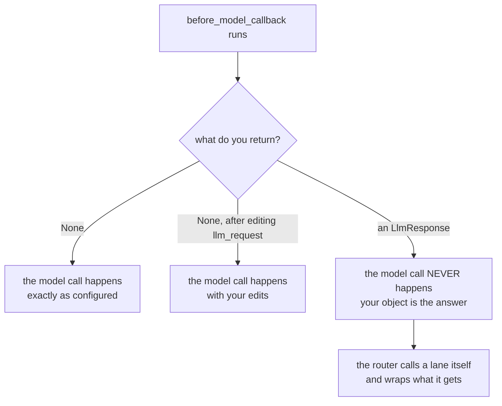

# 3.2 — Observe, block, answer instead

## One-line answer

`before_model_callback` has exactly three outcomes — return `None` and the call happens, edit the
request and the edited version goes, return an `LlmResponse` and **the model call never happens** —
and a router is built entirely on the third, because answering instead is how the plugin gets to
choose which lane did the work.

## The story

You ring a friend's landline to ask whether the shop at the end of his street is open today.

His mother picks up. You ask her. She says yes, it opens in the morning and it is open today. You say
thank you and you put the phone down.

You have your answer, and it is a good answer, and it saved you a walk. Your friend never knew the
phone rang.

Look at your call log afterwards and it says his number, connected, forty seconds. That is all it
says. There is no field in a call log for *who actually spoke*, and nothing anywhere in your phone
will ever tell you that the person you rang was not the person who answered.

## The idea in plain language

`before_model_callback` is the hook that runs in the moment between "this agent has decided it needs
a model" and "the request goes to a provider". [3.1](3.1-where-a-router-has-to-stand.md) established
where to write it — on a plugin, registered on the `Runner`, so that it sees every such moment in the
run. This part is about what you are allowed to do once you are standing there.

The answer is three things, and the runtime tells them apart by the **type** of what you return.

**Observe — return `None`.** You looked, you have nothing to say, the call proceeds exactly as it
would have without you. This is `hooks.py --observe`, and
[3.1](3.1-where-a-router-has-to-stand.md) measured it: the plugin chose `groq`, `gemini` answered.

**Edit — change `llm_request` in place, then return `None`.** The request object you were handed is
the object that will be sent, so mutating it is the mechanism; there is no "return the modified
request" step. From the runtime's point of view this is indistinguishable from observing, because you
returned `None` either way. [3.3](3.3-the-field-that-does-not-reroute.md) is what happens when a
would-be router reaches for this one.

**Answer instead — return an `LlmResponse`.** An `LlmResponse` is the object the runtime normally
receives back from a provider. Build one yourself and the provider is never contacted at all.
<https://adk.dev/callbacks/types-of-callbacks/>, checked on 2026-09-06, says it in two sentences:

> If the callback returns an `LlmResponse` object, then the call to the LLM is **skipped**. The
> returned `LlmResponse` is used directly as if it came from the model.

*As if it came from the model.* That is the sentence a router runs on. It means the plugin can pick a
lane by itself, call that lane by itself, wrap the answer in an `LlmResponse`, and hand it back — and
everything downstream, the events, the session history, the next agent in the flow, treats it as the
model's reply. The agent asked for a model call and received a model answer. It just was not the
model the agent named.

An honest note about where you have met this before.
[Day 67's 2.2](../../../day-67-guardrail-callbacks/parts/02-where-a-check-stands/2.2-allow-block-rewrite.md)
taught these same three outcomes and called them allow, block and rewrite, for a **guardrail**: there,
returning an `LlmResponse` meant refusing a poisoned ticket, and the whole argument was that blocking
is honest because it is loud. This day uses the identical hook and the identical return type for the
opposite purpose — not to stop work happening, but to make it happen somewhere else. One hook, two
completely different jobs, and it is worth noticing that ADK gives you no way to distinguish them
from the outside. Both look like "the model call was skipped".



## Why Sutra needs it

Sutra's router has to send a request to a lane the agent did not name. There is no other hook in ADK
that lets it do that, and [3.3](3.3-the-field-that-does-not-reroute.md) is the measurement that
closes off the obvious alternative. Without "answer instead", section 2's entire policy — capability
filter, cold lanes, sampling two, spending against the tighter window — has nowhere to be applied.

It is also the mechanism behind the refusal Sutra owes its callers.
[4.3](../04-when-a-lane-says-no/4.3-every-lane-dry.md) has to tell a caller that no lane could serve
them and why, and `AllDry` cannot simply be raised into the runtime and hoped for: it has to come
back as a response object, because that is the shape the hook is allowed to return.
[3.4](3.4-answering-instead-of-the-agent.md) shows both branches in one plugin.

## The mechanism

The whole hook, from `lab/hooks.py`. It is a method on the `Router` plugin that
[3.1](3.1-where-a-router-has-to-stand.md) built, so it is indented here exactly as it is in the file:

```python
    async def before_model_callback(
        self, *, callback_context: CallbackContext, llm_request: LlmRequest
    ) -> LlmResponse | None:
        if self.observe_only:
            return None
        self.intercepted += 1
        NamedLlm.answered.append(self.lane)
        return LlmResponse(
            content=types.Content(
                role="model", parts=[types.Part(text=f"answered by {self.lane} via the router")]
            )
        )
```

**Line by line:**

- `async def` — plugin hooks are coroutines. A synchronous method of the same name is not called;
  the hook names and their shapes are listed on <https://adk.dev/plugins/>, checked on 2026-09-06.
- The `*` before the parameters makes them **keyword-only**, and the names `callback_context` and
  `llm_request` are not yours to choose. ADK passes callback arguments by keyword, which is the rule
  [Day 67's 2.4](../../../day-67-guardrail-callbacks/parts/02-where-a-check-stands/2.4-the-guardrail-that-never-ran.md)
  measured the cost of getting wrong: a mistyped parameter name does not raise, it silently means
  your hook never runs.
- The return annotation `LlmResponse | None` is the three outcomes written as a type. There is no
  third type in the union because there is no third thing you may return, and *When it breaks* below
  is what the runtime does with one anyway.
- `if self.observe_only: return None` is the entire ablation switch for this part. One branch, one
  return value, and it is the difference between the two runs below.
- `self.intercepted += 1` counts on the plugin instance rather than anywhere else, for the reason
  [3.1](3.1-where-a-router-has-to-stand.md) gave: the plugin is constructed once and lives as long as
  the Runner, so it is the only object in the picture that can hold a total across agents.
- `NamedLlm.answered.append(self.lane)` is the plugin writing into the same list the fake model
  writes into. Read that line twice, because it is doing something uncomfortable on purpose: in this
  branch **no model runs at all**, so the only reason the run can report that `groq` answered is that
  the router said so. That is not a flaw in the fixture; it is the honest miniature of the production
  problem, and it is what the *In production* section below is about.
- The `LlmResponse(content=types.Content(role="model", parts=[types.Part(text=...)]))` nest is not
  ceremony. It is the exact shape a provider's reply has: a response wrapping a content wrapping a
  list of parts. `role="model"` matters because the session history is a conversation, and a turn
  with the wrong role is a turn the next model call will misread.
- The text says `via the router` so that a reader of the output can tell this string apart from the
  one the fake model produces. When both are possible, an answer that cannot say where it came from
  is not evidence.

Run it both ways. First the router doing its job:

```bash
cd days/day-70-the-quota-router/lab
uv run python hooks.py
```

**Line by line:**

- No flag, so `observe_only` is `False` and the hook takes its second branch.
- The agent is still built on `gemini` and the router still names `groq`. Nothing in the wiring
  changed between this run and the next one — only which `return` statement executes.

Measured on 2026-09-06:

```text
mode                          : router answers
the agent was built on lane   : gemini
the router chose lane         : groq
calls the router intercepted  : 1

lane that actually answered   : ['groq']
  text -> answered by groq via the router
```

And the same script with the hook returning `None`:

```bash
uv run python hooks.py --observe
```

**Line by line:**

- `--observe` flips one boolean. The plugin is still registered, still called, still forms the same
  opinion about which lane it wants.

Measured on 2026-09-06:

```text
mode                          : observe only
the agent was built on lane   : gemini
the router chose lane         : groq
calls the router intercepted  : 0

lane that actually answered   : ['gemini']
  text -> answered by gemini (llm_request.model='fake/gemini')
```

**The two runs differ by one return value.** Not by a different agent, a different model, a different
Runner or a different plugin — by whether `before_model_callback` returned `None` or an object. That
one choice moves the work from `gemini` to `groq` and changes the answer the caller receives.

Two details in those outputs are worth pulling out.

`lane that actually answered: ['groq']` has exactly one entry. If the model had also run, the list
would hold two names, because the fake model appends its own lane on every call
(`lab/_fake.py`). One entry is the measurement that the provider call did not happen — not an
inference from the documentation, but the model's own counter staying still.

The answer text differs in kind, not just in wording. `answered by gemini
(llm_request.model='fake/gemini')` is printed from inside the model object, so it is a report by the
thing that did the work. `answered by groq via the router` is a string the plugin composed. Both
arrive at the caller through the same field, and nothing in the response distinguishes them.

## When it breaks

Answering instead is not free, and the price has three parts.

**The agent's model configuration becomes decorative.** `Agent(model=...)` still has to be there, it
still has to be a valid model, and it is now describing something that never runs. A new engineer
reading `model=NamedLlm(model="fake/gemini", lane="gemini")` will reasonably conclude that this agent
talks to gemini. In the run above it did not, and nothing in the agent's own file says so. The
configuration has become a decision that is made somewhere else entirely.

**Anything downstream that trusts `llm_request.model` is now wrong.** Cost attribution, per-model
metrics, a dashboard that groups latency by provider, a log line that records which model served a
turn — all of them read the field the agent set, and all of them will name a model that did no work.
[3.3](3.3-the-field-that-does-not-reroute.md) is the same coin the other way up: there the field is
changed and the model is not, here the model is changed and the field is not, and in both cases the
field and the work have come apart.

**The response object has to be shaped exactly right.** The runtime does not validate what you
return; it uses it. Return a plain string that reads perfectly well and the run dies somewhere else
entirely:

```bash
cd days/day-70-the-quota-router/lab
python -c "
import asyncio
from _fake import agent_on, drive, reset
from google.adk.plugins.base_plugin import BasePlugin

class Str(BasePlugin):
    def __init__(self):
        super().__init__(name='str_router')

    async def before_model_callback(self, *, callback_context, llm_request):
        return 'answered by groq via the router'

reset()
print(asyncio.run(drive(agent_on('gemini'), plugins=[Str()])))
"
```

Measured on 2026-09-06, the last frames:

```traceback
  File "C:\Users\nisha_gnzw\AppData\Roaming\Python\Python312\site-packages\google\adk\flows\llm_flows\base_llm_flow.py", line 1197, in _postprocess_async
    async for event in agen:
  File "C:\Users\nisha_gnzw\AppData\Roaming\Python\Python312\site-packages\google\adk\flows\llm_flows\base_llm_flow.py", line 1385, in _postprocess_run_processors_async
    async for event in agen:
  File "C:\Users\nisha_gnzw\AppData\Roaming\Python\Python312\site-packages\google\adk\flows\llm_flows\_nl_planning.py", line 81, in run_async
    or not llm_response.content
           ^^^^^^^^^^^^^^^^^^^^
AttributeError: 'str' object has no attribute 'content'
```

The string was **accepted**. It was taken as the answer, carried through post-processing, and only
blew up when the natural-language planning processor reached for a field it did not have. Nothing in
the message mentions your plugin. This is the same failure
[Day 67's 2.2](../../../day-67-guardrail-callbacks/parts/02-where-a-check-stands/2.2-allow-block-rewrite.md)
met from the guardrail side, and it is worth meeting twice, because the rule behind it is what makes
the three outcomes work at all: **any non-`None` return is treated as "I am answering"**, whatever
its type. The type is load-bearing, and the smallest fix is the nest the lab file already writes:
`LlmResponse(content=types.Content(role="model", parts=[types.Part(text=...)]))`.

## In production

**What a professional writes instead.** They emit their own record, every time, before returning the
response. The plugin knows three things nobody else in the system will ever know — which lane the
agent asked for, which lane the router used, and why — and if it does not write them down they are
gone the moment the hook returns. In Sutra that means one structured line per routing decision, in
the format [Day 22's 1.2](../../../day-22-structured-logging/parts/01-a-line-you-can-query/1.2-one-json-object-per-line.md)
established, carrying the requested lane, the chosen lane, the headroom that justified the choice and
the correlation id of the turn. `Router.log` in `lab/_router.py` is the same idea in miniature: a
`Decision` per request, kept so the run can be read back afterwards.

**What degrades at scale.** Your traces stop meaning what they say. A tracing tool draws a span for
the model call, and that span is derived from the request the agent built, so at a thousand
invocations you have a thousand spans confidently attributing work to a provider that did none. This
is not a bug you can find by reading the trace, because the trace is internally consistent — it is
the call log that says forty seconds and cannot say who spoke. The only fix is that the routing
record and the model span have to be joined on a shared id, and somebody has to have decided that
before the incident rather than during it.

**The failure that only appears with real traffic.** A response the plugin builds is a response no
provider validated. In the lab the text is a formatted string, so it is always well-formed. In
production the plugin is wrapping whatever the chosen lane returned, and lanes differ: one returns a
plain completion, one returns a structured tool call, one streams. The first time a lane returns a
shape your wrapper did not anticipate, the failure surfaces exactly where the traceback above
surfaced — deep in the runtime, in a processor that reached for a field, with no mention of the
plugin that built the object.

**The review comment a senior engineer leaves:** *"This returns an `LlmResponse` from the plugin, so
the model in the agent config never runs. That is fine and it is the whole point, but right now the
only place that fact exists is in this function. Log the requested lane and the served lane on every
interception, and put the served lane in the response metadata too — otherwise our per-model cost
report is measuring a model we never called."*

**The interview question:** *"How would you make an agent framework call a different provider than
the one the agent was configured with?"* An answer that has done it: *"I intercept the model call in
a plugin's `before_model_callback` and return an `LlmResponse` I built myself, which makes the
runtime skip the provider call entirely and use my object as if it came from the model. The plugin
picks the lane, calls it, and wraps the answer. The part people underestimate is the bookkeeping
debt: the agent's own model config is now decorative, and every downstream consumer of the request's
model field is now naming a provider that did no work, so the plugin has to log which lane it
actually used or your cost and latency attribution is quietly fiction."*

## Check yourself

```bash
cd days/day-70-the-quota-router/lab
uv run python hooks.py
uv run python hooks.py --observe
```

Now edit the hook so that it counts the interception but still returns `None`, and run it without
`--observe`. Read what `calls the router intercepted` and `lane that actually answered` say to each
other in that run, and then say which of the two you would put in an alert.

**Out loud, without scrolling up:** name the three outcomes of `before_model_callback` and the type
that selects each one, and say which one a router needs and why the other two cannot do its job.

**Next:** [3.3 — The field that does not reroute](3.3-the-field-that-does-not-reroute.md).
