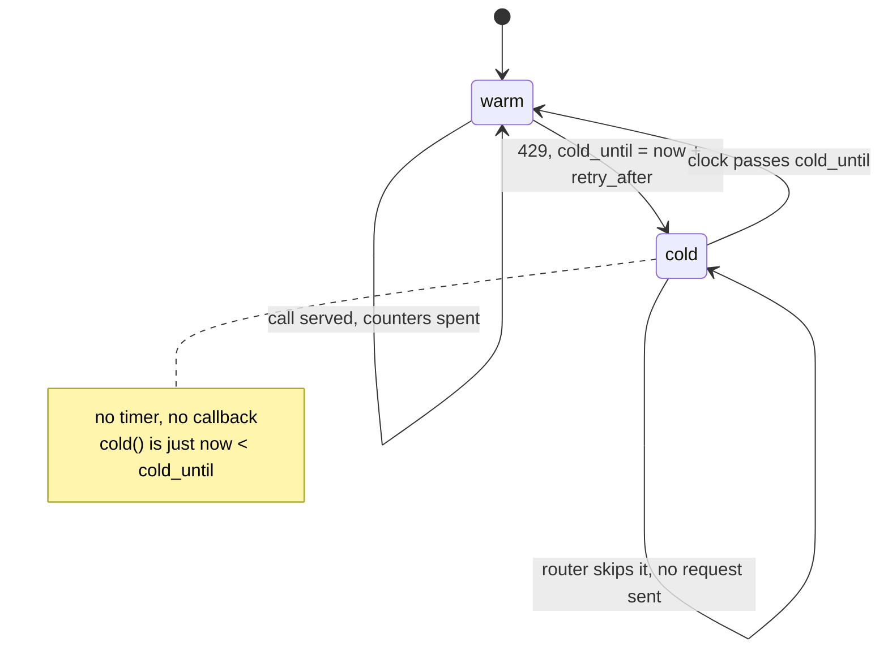

# 4.2 — A cold lane, not a broken one

## One-line answer

A refused lane is a lane with a time on it, so the router marks it **cold**, stops sending, and
probes back when the time elapses — and the proof is that honouring the refusal serves **10**
requests and ignoring it serves **10**, so the twenty-nine extra attempts bought nothing at all.

## The story

You want warm bread, so you get to the bakery before the evening rush and the trays behind the
counter are empty.

The man behind the counter tells you the next batch went into the oven a little while ago and comes
out at five. That is the answer. You have it, it is true, and it will not change.

The patient version of this evening is that you go and do the rest of your errands and come back at
five, and the bread is warm.

The other version is the one everybody has actually done. You are already standing there, so at
twenty to five you ask again. He opens the oven door and looks and says not yet. At quarter to, you
ask him to just check. He opens it again. At ten to you lean over the counter and ask whether it
might be ready early today, and he opens it a third time, and heat rolls out of it into the shop.

At five the bread is not ready. When it does come out it is paler than it should be.

You did not make the oven faster. Bread takes as long as bread takes, and the batch was never going
to notice how many times it was asked about. What your asking did was take the heat out of the one
thing that was actually doing the work, three times, and put it into the shop instead. Every question
was free to ask. Not one of them was free to answer.

He told you five. Five was information, and it came from the person who put the trays in. You spent
your evening re-asking a question that had already been answered, and the answer never changed,
because the answer was never about how often it was asked.

## The idea in plain language

A lane that refuses is not a lane that is broken. It is a lane with an instant written on it — the
moment it will serve again. That number came
out of the refusal itself ([4.1](4.1-reading-the-refusal.md)), and the only sensible thing to do
with it is to write it down and stop sending until it passes.

Call that lane **cold**. Cold is a state, not an error: the lane is healthy, its credentials are
fine, its model is up, and it will serve the very next request that arrives after the stated
instant. Until then the router simply does not consider it. It is not in the candidate set, so it is
not compared on headroom, so it cannot be chosen.

You may have met a **circuit breaker** — the pattern where a client stops calling a dependency after
it fails repeatedly, waits, and then lets one call through to see whether it recovered. A cold lane
is the same shape with one large difference, and the difference is worth saying out loud: a circuit
breaker has to **infer** how long to wait, because a service that is failing does not tell you when
it will stop. A refusal tells you. So the cold period is not a tuning parameter here; it is a number
somebody else computed from their own records and handed you.

The alternative — ask again immediately, and keep asking — is the version everybody writes first,
because it feels like effort. It is asking him to open the oven at quarter to. It cannot make the
window open sooner, because the window is a function of time, not of how often it was asked. And
what it costs is not nothing: every one of those attempts is a real request that reaches the
provider and is answered.

## Why Sutra needs it

Sutra's desk runs on four lanes, and the whole argument of section 2 was that the router should move
work to a lane with room. That argument only holds if the router **knows** which lanes have no room.

Without a cold state, the knowledge lasts exactly one request. The lane refuses, the router routes
elsewhere, and the very next request finds the same lane sitting in `candidates()` with a counter
that still believes there is space — so it goes straight back and takes another refusal. The router
would relearn the same fact once per request for the whole minute.

It also matters for what comes next in this section.
[4.3](4.3-every-lane-dry.md) reports when the fleet will next be able to serve anything, and it
computes that from the cold times recorded here. A router that never marks a lane cold cannot say
when anything recovers, because it never wrote down what it was told.

## The mechanism

The lane carries one extra field, `cold_until: float = 0.0`, and one method that reads it:

```python
def cold(self) -> bool:
    """True while a refusal's `retry-after` is still in force."""
    return self.clock.now < self.cold_until
```

**Line by line:**

- The state is stored as an **instant**, not as a duration or a countdown. `cold_until` is a point on
  the clock; nothing has to tick it down, nothing has to be cancelled, and there is no timer to leak.
  A lane becomes warm again because time passed, which is the only thing that was ever going to make
  it warm.
- `0.0` as the default means "never refused", and it works because the comparison is `now <
  cold_until`: at any clock reading at or after zero, a lane with `cold_until = 0.0` is warm. It
  needs no separate boolean, and a boolean would be a second thing to keep in step with the first.
- The method takes no arguments and consults `self.clock`, so *nobody has to remember to expire it*.
  The alternative design — a `mark_warm()` that something calls when the time passes — is a design
  with a bug in it the first time nothing calls it.

The router sets that field when it catches a refusal, and then re-routes:

```python
def send(self, skill: str) -> str:
    """Route one request. Raise `AllDry` when no lane can take it."""
    lane = self.choose(skill)
    if lane is None:
        raise AllDry(skill, self._waits(skill))
    before = lane.headroom()
    try:
        result = lane.call()
    except Refused as refusal:
        self.spilled += 1
        lane.cold_until = self.clock.now + refusal.retry_after
        self.log.append(Decision(self.clock.now, skill, lane.name, before, "429"))
        if self.strict:
            return self.send(skill)
        raise
    self.served += 1
    self.log.append(Decision(self.clock.now, skill, lane.name, before, "ok"))
    return result
```

**Line by line:**

- `lane.cold_until = self.clock.now + refusal.retry_after` is the whole part in one line: *now* plus
  what the provider said. Not a constant, not a tuned backoff, not a multiple of anything. The number
  the refusal carried, converted from a duration into an instant, once, at the edge.
- `self.spilled += 1` records that a request was routed to a lane that then refused it — a decision
  the router's own numbers approved and the provider did not
  ([2.4](../02-choosing-a-lane/2.4-everyone-read-the-same-board.md) is where that counter earns its
  keep).
- The `Decision` appended with outcome `"429"` means the refusal lands in the ledger as a routing
  event, not only in a log. That matters in [4.4](4.4-the-part-that-will-do.md), where what is *not*
  in this ledger becomes the failure.
- `return self.send(skill)` retries the **request**, not the lane. That is the distinction the whole
  part turns on: the request is retried immediately, which is correct, because `choose()` will now
  skip the cold lane and pick a different one. Retrying the same lane immediately would be asking to
  have the oven opened again; retrying the request against a different lane is walking to the next
  bakery along the road.
- The recursion is bounded by the fleet emptying: each refusal marks one more lane cold, and when
  none are left `choose()` returns `None` and [4.3](4.3-every-lane-dry.md)'s `AllDry` is raised. It
  terminates because the set of candidates strictly shrinks.
- `raise` under `if self.strict` is the non-strict path, which belongs to section 5's bug and is not
  this part's subject.

`lab/cold.py` isolates the behaviour on a single lane, so nothing about routing between lanes can
confuse the measurement:

```python
for i in range(40):
    clock.now = i * 0.5
    if not hammer and lane.cold():
        continue
    attempts += 1
    try:
        lane.call()
        served += 1
    except Refused as refusal:
        refusals += 1
        if refusals <= 3:
            print(f"  t={clock.now:>5.1f}s  {refusal}")
        if hammer:
            lane.cold_until = 0.0
```

**Line by line:**

- `clock.now = i * 0.5` walks the clock forward in half-second steps, forty of them, so the run
  covers the first twenty seconds of a minute window. It never reaches sixty, which is deliberate:
  the window never reopens during the run, so the only thing being measured is behaviour while the
  answer is *no*.
- `if not hammer and lane.cold(): continue` is the entire cold-lane discipline in one line. The
  attempt is not made at all — this is not a caught exception, it is a request that never left.
  `attempts` is not incremented, because nothing reached the provider.
- `if hammer: lane.cold_until = 0.0` is the failure, written out honestly rather than hidden. It does
  not disable the cold check, it **erases what the refusal said** — which is precisely what a client
  does when it catches the exception and loops without reading `retry_after`.
- Only the first three refusals are printed. Otherwise the hammer run would print thirty lines of the
  identical instruction, which is itself a fair picture of what that run does.

Run both:

```bash
cd days/day-70-the-quota-router/lab
uv run python cold.py
uv run python cold.py --hammer
```

**Line by line:**

- No flag honours `retry-after`. `--hammer` ignores it and retries on the next half-second tick.
  Everything else is identical: same lane, same clock, same forty ticks.

Measured on 2026-09-06, honouring the refusal:

```text
lane gemini: 10/min, 250/day
mode: honour retry-after

  t=  5.0s  429 gemini: minute window exhausted, retry-after 55s

  attempts reaching the provider   11
  served                           10
  refusals                         1
  day window used                  10/250

  The router stopped asking until retry-after elapsed. One refusal taught it
  the window was shut; every later attempt in that window was never made.

  the backoff ladder a caller uses on top of this, from Addendum 02 section 6:
    attempt 1: wait    1s   cumulative     1s
    attempt 2: wait    2s   cumulative     3s
    attempt 3: wait    4s   cumulative     7s
    attempt 4: wait    8s   cumulative    15s
    then escalate. Never invent a result (Principle 10).
```

Measured on 2026-09-06, ignoring it:

```text
lane gemini: 10/min, 250/day
mode: retry immediately, ignore retry-after

  t=  5.0s  429 gemini: minute window exhausted, retry-after 55s
  t=  5.5s  429 gemini: minute window exhausted, retry-after 54s
  t=  6.0s  429 gemini: minute window exhausted, retry-after 54s

  attempts reaching the provider   40
  served                           10
  refusals                         30
  day window used                  10/250

  Every refusal above was a request the provider counted and answered with 429.
  The minute window was never going to open sooner because it was asked more often.

  the backoff ladder a caller uses on top of this, from Addendum 02 section 6:
    attempt 1: wait    1s   cumulative     1s
    attempt 2: wait    2s   cumulative     3s
    attempt 3: wait    4s   cumulative     7s
    attempt 4: wait    8s   cumulative    15s
    then escalate. Never invent a result (Principle 10).
```

Put the two side by side and read the row that matters.

| | honour `retry-after` | `--hammer` |
| --- | --- | --- |
| attempts reaching the provider | 11 | 40 |
| **served** | **10** | **10** |
| refusals | 1 | 30 |
| day window used | 10/250 | 10/250 |

**Served is identical.** Ten in both. Forty attempts in the hammer run and eleven in the
patient one produced exactly the same amount of work done, because the minute window opens on a
schedule and nothing about asking changes the schedule. The hammering bought precisely nothing and
cost twenty-nine extra refused requests, every one of which reached the provider and had to be
answered.

Notice the last row before anyone objects that the lab is loading the argument. `day window used` is
`10/250` in **both** runs: this simulator refuses before it counts, so the twenty-nine wasted
requests are not even charged against the daily allowance. The lab is being generous to hammering,
and hammering still gains nothing. A real provider is under no obligation to be that generous —
[Day 24 4.1](../../../day-24-token-accounting-and-budgets/parts/04-failure-lab/4.1-the-retry-that-spent-the-budget.md)
measured a retry loop spending a real daily budget three requests at a time — and repeated refusals
from one client are also exactly the signal a provider uses to decide whether to lengthen your
cool-off.

Here is the state the lane is in, and the whole of it:



## The relationship to the backoff ladder

Both runs print the same four lines at the bottom — `1s, 2s, 4s, 8s, then escalate` — and it is
worth being exact about why that ladder is *not* what this part built, because the two are
constantly confused.

They are two different mechanisms operating at two different levels.

- The **cold lane** is a fact about a shared resource, held by the router, and it applies to every
  request. One refusal from Gemini tells the router something true about Gemini for the next
  fifty-five seconds, and *all* traffic is steered accordingly. It is not about any one request.
- The **backoff ladder** is a schedule for a single request, held by whoever is waiting for an
  answer. It decides how long that one caller waits between attempts and when it gives up and
  escalates instead of inventing a result.

You need both, and they compose: the caller waits one second and asks again, the router still finds
every capable lane cold, and it says so; the caller waits two, then four, then eight, and then stops
and escalates. The router never invents a lane and the caller never invents a result.

Day 72 — *Backoff with honesty* — owns the second mechanism, including the honest part at the end of
the ladder. This part owns the first. If you take one sentence from the pair: **the ladder decides
how long you wait, and the cold lane decides where you look while you are waiting.**

## When it breaks

The break is the `--hammer` run above, and its most instructive property is that **it does not
raise anything you could catch**. There is no traceback, no crash, no failed run. The program does
what it was told, forty times, and reports the same total as the correct version. A monitoring
dashboard watching `served` sees two identical systems.

The one line that causes it is the one that looks like housekeeping:

```python
if hammer:
    lane.cold_until = 0.0
```

**Line by line:**

- Resetting `cold_until` to `0.0` does not clear an error state. There is no error state. It erases
  the only piece of information the refusal contained, which is why the loop then has nothing left
  to do except ask again.
- In a real codebase this line rarely looks like this. It looks like a `finally: lane.reset()`, or a
  fresh lane object built per request, or a retry decorator wrapped around the call that knows
  nothing about lanes. Any of those throws the time away just as completely.

There is a second failure in the opposite direction, and a router that fixes only the first will
meet it. `cold_until` set from a **daily** refusal is roughly `86400` seconds away
([1.4](../01-what-headroom-is/1.4-two-windows-and-the-one-that-bites-last.md) saw `retry-after
86200s`), so the lane is out for the rest of the day. That is correct. What is not correct is having
no way to reconsider: if the provider resets earlier than it said, or somebody topped up the
account, or the daily window turns out to roll at a boundary rather than sliding, the lane sits
unused with the router entirely certain it is empty. **A cold lane must be probed, not merely
waited out** — one request, occasionally, to see whether the answer changed. Never the whole
backlog, which is the next section.

## In production

**The thundering herd is the failure this creates.** Mark a lane cold at a stated instant, hold
every request that wanted it, and at that instant every one of them becomes eligible at once. The
lane's minute window opens with ten slots and two hundred queued requests arrive together; ten are
served and one hundred and ninety are refused, which marks the lane cold again, which re-forms the
queue. The system now oscillates, and each oscillation is a burst of refusals. This is
[2.4](../02-choosing-a-lane/2.4-everyone-read-the-same-board.md)'s stampede with a timer instead of
a screen: everybody acting correctly on the same instant.

**Jitter is the standard answer, and it is one line.** Instead of `now + retry_after`, use
`now + retry_after + random(0, spread)` — a small random amount added per waiter, so the herd
arrives spread out rather than together. The widely used form is *full jitter*: the wait is a random
value between zero and the computed delay, which spreads arrivals across the whole interval rather
than clustering them at the end of it. It costs a little latency for the waiter that draws a high
number and it removes the synchronised burst entirely. Jitter without a floor is a bug, though: the
random value must be added to the provider's stated time, never allowed to shorten it, or you are
back to guessing a number smaller than the one you were given ([4.1](4.1-reading-the-refusal.md)).

**Probe with one request, not with the queue.** The circuit-breaker vocabulary for this is
*half-open*: when the cold period ends, allow exactly one request through and hold the rest until it
answers. Success reopens the lane; another refusal extends the cold period. The lab does not need
this because its clock is exact and its provider is a simulator, and every real deployment does,
because the recovery instant is approximate and the cost of being wrong about it is a second herd.

**What degrades at scale** is that `cold_until` lives in one process's memory. Ten replicas mean ten
independent opinions about whether Gemini is cold, and a refusal that one replica learns costs the
other nine a refusal each to learn separately. The state belongs where the counters belong — in the
shared store of [6.1](../06-in-production/6.1-one-till-two-cashiers.md) — so that one refusal
educates the whole fleet. Until it is shared, the cost of a refusal is multiplied by your replica
count.

**The failure that only appears with real traffic** is the cold lane that never comes back because
nothing was ever measured about it. A lane refuses, gets marked cold for a day, and quietly stops
being part of the fleet; traffic redistributes, nothing errors, and the capacity plan is now wrong by
one provider with nobody aware. The detector is a metric on **time spent cold per lane**, alongside
served and refused. A lane at ninety per cent cold is an outage that is being successfully routed
around, which is exactly the kind of success that hides a problem for months.

**The review comment a senior engineer leaves:** *"the retry loop catches `Refused` and calls again
on the next iteration. That will not make the window open sooner — I measured the same shape in the
lab and it served ten requests either way, with thirty refusals instead of one. Set `cold_until` from
`retry_after`, skip the lane in `candidates()`, and add jitter before you ship it, or every waiter
will come back at the same instant and re-form the queue."*

**The interview question:** *"A provider rate limits you. What does your retry logic look like?"* The
answer that has measured it: *"I separate two things that get mixed up. The lane gets marked cold
until the instant the refusal named, so the router stops sending there entirely and puts the traffic
on another provider — that is a fact about the resource and it applies to everyone. The individual
request gets a backoff ladder, one, two, four, eight seconds, and then it escalates rather than
inventing an answer. What I do not do is retry the same lane immediately, because I have measured
that: honouring the refusal served ten requests with one refusal, and hammering served the same ten
with thirty. The extra twenty-nine bought nothing and every one of them was real traffic to a
provider that had already said no. And when the cold period ends I let one request through rather
than the whole queue, and I jitter the resume, otherwise everything that was waiting arrives at the
same instant and refills the queue."*

## Check yourself

```bash
cd days/day-70-the-quota-router/lab
uv run python cold.py
uv run python cold.py --hammer
```

Now change `range(40)` to `range(200)` in `cold.py` and run both again. The clock now passes sixty
seconds, so the window reopens during the run. Before you look: say which of the two runs improves,
and whether the gap between them gets wider or narrower.

**Out loud, without scrolling up:** explain what a cold lane is to somebody who has only ever written
a retry loop, and say which of the two mechanisms — the cold lane or the backoff ladder — decides
*where* the next attempt goes.

**Next:** [4.3 — Every lane dry](4.3-every-lane-dry.md).
