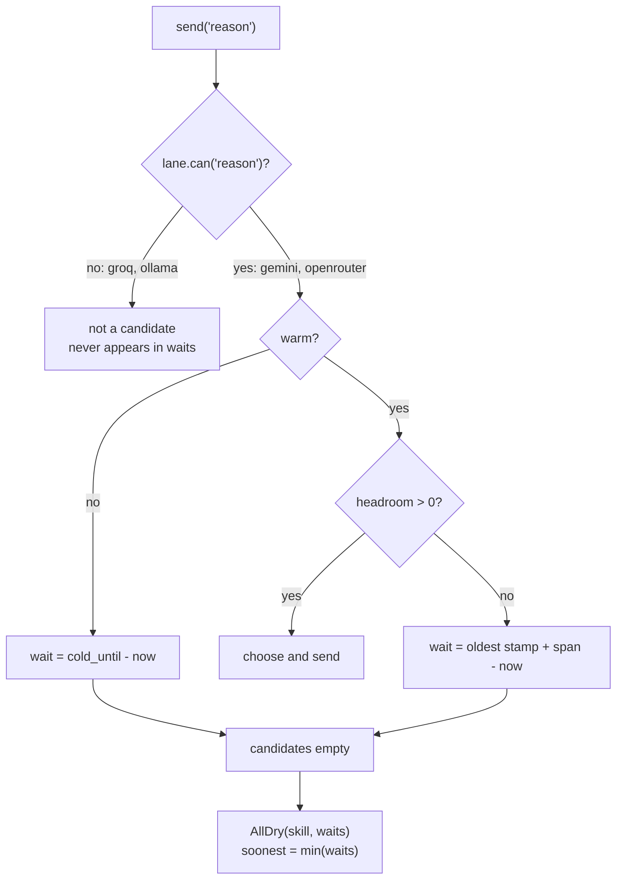

# 4.3 — Every lane dry

## One-line answer

When no lane can serve the request the router raises — and it raises **with a number**,
`soonest headroom in 60s`, which is the field that turns an exception into an instruction the caller
can act on instead of a sentence it can only log.

## The story

Everyone wants to see the same film on the Saturday it comes out, and you have left it late.

You open the booking app on your phone. Every showtime for tonight is greyed out. You tap one
anyway, in case the app is being slow. **Sold out.** You go back, tap the next one, tap the last one,
then start again at the top in case somebody has cancelled in the last half a minute. The app says
*sold out* in the same grey it has been saying all evening, and it says nothing else, so you keep
tapping, because tapping is the only thing it has given you to do.

What it could have said is one sentence: *the next seats for this film are in the eleven o'clock show
tomorrow morning.* That is all. With that sentence you stop tapping, you book the morning show or you
watch something else, and your evening belongs to you again.

Now the other half, which the grey also hid. That cinema has five screens and four of them are half
empty tonight. They are showing other films. They were never going to have a seat for you, at any
time, on any evening, because they are not showing yours.

So *the cinema is full* would have been a true-sounding sentence with a false picture inside it. The
cinema is half empty. One film is sold out — and those are completely different facts, and they send
you to completely different places next.

## The idea in plain language

There are two ways for a system to say no, and only one of them is useful.

**"No."** The caller knows it did not get an answer. It knows nothing else. Everything it does next
is a guess: retry now, retry later, give up, tell the user something vague.

**"Not until 60 seconds from now."** The caller can do arithmetic. If it has a person waiting and a
response is expected inside a few seconds, sixty is too long and it should say so and hand the
problem to a human. If it is a background job with the night ahead of it, sixty is nothing and it
sleeps. The same refusal, with a number on it, produces two correct and completely different
behaviours.

That is the whole of this part: **the router refuses honestly, and the honesty includes a number.**

The condition being reported is narrower than it first sounds, and getting the wording right is what
separates a good exception from a misleading one. The router keeps a **candidate set** for each
request — the lanes it is allowed to choose between — and it is built by three filters in this
order:

1. **Can this lane do this kind of work?** Capability, from
   [2.2](../02-choosing-a-lane/2.2-the-lane-that-cannot-do-the-job.md). Sutra labels work with three
   skills, `classify`, `draft` and `reason`, and each lane declares which it can do. This filter is
   *hard*: no amount of free capacity gets a lane past it.
2. **Is it warm?** A lane that refused recently is cold until the instant it named
   ([4.2](4.2-a-cold-lane-not-a-broken-one.md)).
3. **Does it have headroom?** Room left in the tighter of its two windows
   ([1.1](../01-what-headroom-is/1.1-a-ceiling-is-a-window-not-a-number.md)).

When that set comes out empty, the fleet is not empty. Lanes may be sitting completely idle. What is
empty is the set of lanes that could honestly have served *this* request — which is the four other
screens again: they were never candidates, and counting them as full would misdescribe both the
shortage and the fleet.

The name for this in the lab is `AllDry`, and it is Principle 10 as a design constraint: **fail
honestly, and never fabricate a result to cover an error**. The router does not answer from
somewhere else, it does not
return a canned string, and it does not quietly succeed. It raises, and it says when.

## Why Sutra needs it

Sutra's reasoning step — working out why a ticket resembles an earlier one — can only be served by
two of the four lanes. Section 2 measured what that asymmetry does: fifteen reasoning calls out of
270 compete for a pair of lanes that all the other work is also allowed to use, and
[1.4](../01-what-headroom-is/1.4-two-windows-and-the-one-that-bites-last.md) watched OpenRouter's
whole daily allowance disappear inside the first few minutes of a shift.

So running out of reasoning capacity is not a hypothetical for Sutra. It is a scheduled event, and
what the desk does at that moment is a design decision somebody makes either deliberately or by
default.

It also matters upward. Section 3 put the router inside an ADK plugin, underneath every model call
Sutra makes. Whatever `AllDry` carries is what the agent, the graph and eventually the person
waiting on a ticket will have to work with. A refusal that reaches them as `Exception` is a refusal
that has thrown away the only thing that made it actionable.

## The mechanism

The exception is where the number is assembled:

```python
class AllDry(Exception):
    """Every capable lane is out of headroom or cold. The router refuses rather than inventing.

    This is Principle 10 at the routing layer. A router that silently answers from a worse lane,
    or returns a canned string, has turned an outage into a wrong answer.
    """

    def __init__(self, skill: str, waits: dict[str, float]) -> None:
        soonest = min(waits.values()) if waits else 0.0
        detail = ", ".join(f"{k} in {v:.0f}s" for k, v in sorted(waits.items()))
        super().__init__(
            f"no lane can serve {skill!r}; soonest headroom in {soonest:.0f}s ({detail})"
        )
        self.skill = skill
        self.waits = waits
        self.soonest = soonest
```

**Line by line:**

- `waits` is a dict of lane name to seconds, and it only ever contains **capable** lanes. That is the
  four other screens: the ones showing a different film are not listed as sold out, because they were
  never candidates. A caller reading `waits` is reading the true shape of the shortage.
- `soonest = min(waits.values())` is the single number a caller actually branches on. Everything else
  in the exception is for the human reading the log; `soonest` is for the program.
- `if waits else 0.0` is a defensive default that turns out to be a trap, and *When it breaks* is
  about it. Read it now and remember it: an empty `waits` produces a `soonest` of zero.
- `detail` is sorted by lane name rather than by wait. Sorting by name makes two refusals comparable
  by eye across log lines; sorting by wait would put a different lane first each time and defeat
  that.
- `soonest`, `waits` and `skill` are attributes as well as text, for the same reason
  [4.1](4.1-reading-the-refusal.md) put them on `Refused`: a caller must be able to branch on the
  number without parsing the sentence.

The numbers come from a walk over the capable lanes:

```python
def _waits(self, skill: str) -> dict[str, float]:
    """How long until each capable lane could serve again."""
    out: dict[str, float] = {}
    for lane in self.lanes:
        if not lane.can(skill):
            continue
        if lane.cold():
            out[lane.name] = lane.cold_until - self.clock.now
        elif lane.headroom() <= 0:
            stamps = lane.minute.stamps or lane.day.stamps
            span = 60.0 if lane.minute.remaining() <= 0 else 86400.0
            out[lane.name] = (stamps[0] + span - self.clock.now) if stamps else 0.0
    return out
```

**Line by line:**

- `if not lane.can(skill): continue` is the first line of the loop, and it is the whole argument of
  [2.2](../02-choosing-a-lane/2.2-the-lane-that-cannot-do-the-job.md) reappearing at the moment of
  failure. A lane that cannot do the work contributes nothing to this dict — not a zero, not an
  entry, nothing. It is not part of the shortage because it was never part of the supply.
- The `cold()` branch uses the provider's own stated time,
  `cold_until - now` ([4.2](4.2-a-cold-lane-not-a-broken-one.md)). When the router has been told when
  a lane recovers, that number is better than anything it could compute, so it wins.
- The `headroom() <= 0` branch computes the wait the same way the lane does: the oldest timestamp in
  the window plus the window's span. This is the router estimating for itself, in the case where no
  refusal has arrived to tell it.
- `span = 60.0 if lane.minute.remaining() <= 0 else 86400.0` picks which window is the binding one,
  and the two answers differ by a factor of over a thousand
  ([1.4](../01-what-headroom-is/1.4-two-windows-and-the-one-that-bites-last.md)). Reporting sixty
  when the truth is a day would be worse than reporting nothing, because the caller would act on it.
- `lane.minute.stamps or lane.day.stamps` falls back to the daily deque when the minute one is
  empty, which happens when a lane has spent its whole day but nothing recently.
- `if stamps else 0.0` is the same trap as `AllDry`'s default, in the same shape: no evidence
  produces a zero, and a zero reads as "right now".

`lab/dry.py` drains the fleet of everything that can reason and then lets the refusal happen:

```bash
cd days/day-70-the-quota-router/lab
uv run python dry.py
```

**Line by line:**

- The script loops on `router.send("reason")` until `AllDry` is raised, so the number of requests it
  serves is not chosen by the script — it is whatever the fleet turns out to hold.
- The clock is never advanced, so the whole drain happens at one instant. That is deliberate: it
  isolates the *ceiling* from the recovery, and it means the window that bites is the minute one.

Measured on 2026-09-06:

```text
draining every lane that can reason

  served 30 reasoning requests before the fleet ran out
  spread {'gemini': 10, 'groq': 0, 'openrouter': 20, 'ollama': 0}

  AllDry raised:
    no lane can serve 'reason'; soonest headroom in 60s (gemini in 60s, openrouter in 60s)

  the router stops here. The caller gets an error it can act on:
    retry after 60s, or escalate to a human
```

Two things in that output, and the second is the one that makes the first honest.

**Thirty, and where it comes from.** Gemini served ten and OpenRouter twenty, which are exactly their
per-minute ceilings. Nothing was left on the table by the routing: the sampling policy from
[2.4](../02-choosing-a-lane/2.4-everyone-read-the-same-board.md) filled both lanes to the brim. Thirty
is the fleet's entire reasoning capacity for one minute, and the run consumed all of it at a single
instant of the clock. It is also worth noticing that **no request in this run was ever refused by a
provider**: `choose()` filters on `headroom() > 0`, so the router stopped before spending anything.
The counters section 1 built are what turned a wasted `429` into a local decision that cost nothing.

**Zero, and why it is not the same zero.** `groq: 0` and `ollama: 0` do not mean those lanes were
busy, unlucky or empty. Groq has thirty a minute and a thousand a day and was completely idle;
Ollama runs on your own machine. Neither was ever a candidate, because neither declares the `reason`
skill, and the capability filter removed them before headroom was consulted at all.

That distinction is the difference between an honest refusal and a lie with correct arithmetic in
it. A router that reported *"all four lanes are empty"* would be describing a fleet-wide outage that
is not happening. What is happening is that the two lanes qualified to do this particular work are
full, and half the fleet is idle and irrelevant — which is a completely different operational
situation and leads to completely different decisions. The cinema is half empty. One film is sold
out. An operator woken up by the first sentence goes looking for a provider outage; an operator told
the second one goes looking at how much reasoning work the desk is sending.



## When it breaks

The defensive default in `AllDry` — `soonest = min(waits.values()) if waits else 0.0` — has a case
that reaches it, and the case is a typo:

```bash
cd days/day-70-the-quota-router/lab
uv run python - <<'PY'
from _lane import Clock, fleet
from _router import AllDry, Router

clock = Clock(0.0)
router = Router(lanes=fleet(clock), clock=clock)
try:
    router.send("reasoning")
except AllDry as dry:
    print("message:", dry)
    print("waits:  ", dry.waits)
    print("soonest:", dry.soonest)
PY
```

**Line by line:**

- `"reasoning"` instead of `"reason"`. The fleet's skills are `classify`, `draft` and `reason`, so no
  lane declares this one and the capability filter removes all four.
- The fleet is completely fresh: nothing has been spent, no lane is cold, every counter is at its
  ceiling. There is no shortage here of any kind.

Measured on 2026-09-06:

```text
message: no lane can serve 'reasoning'; soonest headroom in 0s ()
waits:   {}
soonest: 0.0
```

`soonest headroom in 0s`, from a fleet with a hundred per cent of its capacity available. The empty
parentheses at the end of the message are the only honest thing in that line, and nothing branches
on parentheses.

Read what a caller does with it. `soonest` is zero, so the sensible policy — *wait until the router
says there will be room, then retry* — retries immediately. It gets `0s` again. And again. A
permanent configuration error, one that no amount of waiting can fix, is now wearing the costume of
a transient shortage, and the system spins on it at full speed until somebody notices the CPU.

The failure is that **two conditions have been given one exception**:

| Condition | Truth | Correct response |
| --- | --- | --- |
| capable lanes exist, all are full or cold | temporary | wait `soonest`, then retry |
| no lane declares this skill at all | permanent | raise, page somebody, never retry |

The smallest honest fix is to separate them at the top of `send`: if no lane in the fleet can do the
skill, that is a different exception with a different name and no retry advice on it. The better fix
is earlier still — validate the skill names against the fleet's declared skills when the router is
constructed, so a typo fails at startup rather than at the first request that needs it. A capability
table that only reveals its gaps under load is a table that will reveal them at the worst moment.

## In production

**Queue or refuse, and the answer is per workload rather than per system.** When everything is dry
there are two exits, and both are legitimate. *Refuse* is right for anything with a person waiting:
a caller with a two second budget gains nothing from being held for sixty. *Queue* is right for
batch work with a horizon — the nightly re-triage of Day 73 can happily wait. What is not legitimate
is an unbounded queue, because that is a refusal you have hidden from yourself: memory grows, latency
grows, and the system reports success right up to the moment it falls over. A production queue has a
maximum depth and a per-item deadline, and when either is exceeded it does exactly what this part
does — refuses, with a number.

**What the caller should actually do with `soonest`.** Compare it against the time the request has
left, not against a constant. That comparison has three outcomes and they are all different: if
`soonest` is well inside the budget, sleep and retry with jitter
([4.2](4.2-a-cold-lane-not-a-broken-one.md)); if it is beyond the budget, stop now and escalate
rather than waiting to fail later; and if it is on the order of a day — which it will be when the
daily window is the binding one — do not wait at all, because no request-level policy survives that
and the correct action is to tell somebody the fleet is out for the day.

**The refusal must reach a human path, not a retry loop.** This is the part teams get wrong, and the
reason is that a retry loop is easier to write than an escalation. A loop makes the outage invisible:
the request never fails, so no alert fires, so nobody learns that the reasoning capacity of the whole
fleet has been exhausted since mid-afternoon. Sutra already has the machinery for the alternative —
[Day 62](../../../day-62-human-in-the-loop/LESSON.md) built the interrupt-and-ask path and
[Day 64](../../../day-64-approval-gates-build/LESSON.md) built the gate a person answers — and an
`AllDry` with `soonest` beyond the request's budget is exactly the shape of thing that path exists
for. The ticket is not answered, a person is told why and when, and the fact is recorded. Compare
that with [Day 24 5.2](../../../day-24-token-accounting-and-budgets/parts/05-in-production/5.2-degrading-not-failing.md)'s
third exit, the one that pretends: the difference between them is entirely whether anybody can find
out.

**What degrades at scale** is that `soonest` is a fleet-wide number handed to every caller at once,
which is [4.2](4.2-a-cold-lane-not-a-broken-one.md)'s herd in a new costume. Two hundred callers
told *sixty seconds* will all return in sixty seconds. The same jitter applies, and at high volume
the refusal should also carry a hint of the queue in front of the caller, so that the hundredth
waiter is told a larger number than the first.

**The failure that only appears with real traffic** is per-tenant starvation hiding behind a
fleet-wide refusal. One heavy consumer drains the two reasoning lanes and every other tenant gets
`AllDry` with a perfectly honest number that describes a shortage they did not cause and cannot
influence. The refusal is true and useless. What makes it actionable is dividing the daily budget
per tenant before the fleet is exhausted, which is
[6.2](../06-in-production/6.2-the-gauge-shows-what-is-left.md)'s subject, and it is the difference
between an incident that names a cause and one that names a symptom.

**The review comment a senior engineer leaves:** *"`AllDry` is right to raise rather than fall back,
but the caller catches it and logs `router unavailable`. That drops `soonest` and `waits`, which are
the only two things in it worth having. Put `soonest` on the retry decision and let the handler
escalate when it exceeds the request deadline. And please split the no-capable-lane case out — right
now a typo in a skill name produces `soonest 0s` from a completely idle fleet, and the retry loop
will spin on that forever."*

**The interview question:** *"What does your system do when every provider is rate limited?"* The
answer that has been there: *"It refuses, and the refusal carries a number. My router raises with the
soonest time any capable provider will have room again, plus the per-provider breakdown, so the
caller can compare that against its own deadline: inside the budget it sleeps and retries with
jitter, beyond it, it escalates to a person rather than waiting to fail later. The detail I care
about most is which lanes are in that breakdown — only the ones that can actually do the work. Two
of my four providers cannot do the reasoning step, so when the reasoning lanes are dry, half the
fleet is idle and irrelevant. If I reported that as 'all lanes empty' I would be describing a
fleet-wide outage that is not happening, and somebody would go looking in the wrong place. What I
will not do is answer from one of the idle ones and say nothing about it."*

## Check yourself

```bash
cd days/day-70-the-quota-router/lab
uv run python dry.py
uv run python -c "
from _lane import Clock, fleet
c = Clock(0.0)
for lane in fleet(c):
    print(f'{lane.name:<11} rpm {lane.rpm:<4} reason: {lane.can(\"reason\")}')
"
```

Add up the `rpm` of the lanes whose last column says `True`, and check it against the `served` line
from the first command. Then say what number you would expect instead if `dry.py` advanced the clock
by one second between sends.

**Out loud, without scrolling up:** explain why two of the four lanes show zero in the spread without
having refused anything, and say what a caller is supposed to do with `soonest`.

**Next:** [4.4 — The part that will do](4.4-the-part-that-will-do.md).
