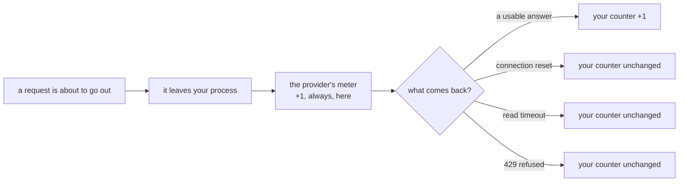

# 5.1 — The tally that counts only sales

## One-line answer

A router that decrements its headroom inside the success branch is counting a different event from
the one the provider counts, and the measurement is brutal: **sixty requests reach a limit of
thirty, thirty of them come back refused, and the router's own tally says it has used twenty.**

## The story

You are printing a sixty-page form at home, on a printer that has been streaking for a week.

You load a fresh packet of paper — a hundred sheets — and press print. Most pages land in the tray
looking fine. Some come out with a black band down one side. Twice the rollers pull two sheets
together and one of them arrives blank. You take the bad ones out, drop them in the bin beside the
desk, and send those pages again.

When the job finishes you have your sixty pages, and you pick up the packet to put it away. It is
much lighter than it should be. Eighteen sheets are left, so eighty-two went through the printer to
give you sixty you can use.

Nothing is broken and nobody miscounted. You were counting **pages worth keeping**. The printer was
counting **sheets it pulled off the stack**. Those are two numbers about two different events, and
only one of them decides when the paper runs out. The bin does not give the paper back.

## The idea in plain language

Your router keeps a number: how much of this minute's allowance it has spent. The provider keeps a
number too. The bug in this part is that the two numbers are counting different things.

Two words, and the whole part hangs on the difference.

- An **attempt** is a request that left your process and arrived at the provider's edge. The
  provider's meter goes up here, before anything is decided about the answer.
- A **success** is a request that came back with a usable result.

Every success is an attempt. Not every attempt is a success, and the ones in between are where the
quota goes. A connection reset by the network, a read timeout, a reply your parser choked on, a
`500` from the provider's own backend: each of those reached the provider, was counted by the
provider, and produced nothing you can use. They are the sheets in the bin.

Now put the counter in the wrong place. **Headroom** — the number of requests you may still send
right now without breaking the rule, from [1.1](../01-what-headroom-is/1.1-a-ceiling-is-a-window-not-a-number.md)
— is normally decremented at the end of a `try` block, after the call has returned, because that is
where the happy path is and that is where you were looking when you wrote it. So the decrement
never runs for a call that failed, and your tally drifts below the provider's by exactly the number
of failures.

That drift has a direction, and the direction is the dangerous one. The counter is **fail-open**: it
becomes *more* permissive the more things go wrong. On a calm afternoon it is roughly right. During
a provider incident, when the error rate is up and every third call is dying somewhere in the
network, it under-counts hardest — and it responds by letting through more traffic, into the
provider that is already struggling.

[1.2](../01-what-headroom-is/1.2-the-burst-every-counter-approved.md) reached this same place from
the other side. There the two counts disagreed because they were taken over **different spans of
time**; here they disagree because they are counts of **different events**. The shape is identical
and it is worth naming once so you recognise it everywhere: *your count and the provider's count are
not the same count, and the provider's is the one that decides.* Any time your dashboard is green
and the provider is refusing, you are looking at one of these two.

## Why Sutra needs it

Every routing decision this day builds reads `headroom()` and believes it.
[2.1](../02-choosing-a-lane/2.1-headroom-is-not-a-preference.md) chooses a lane by comparing
headroom, [2.4](../02-choosing-a-lane/2.4-everyone-read-the-same-board.md) samples two lanes and
keeps the emptier one by comparing headroom, and the plugin in
[3.4](../03-the-plugin/3.4-answering-instead-of-the-agent.md) refuses to call the model at all when
headroom is zero. A router built on a number that is wrong by a third is not a router that makes
slightly worse choices. It is a router that is confidently wrong about the one input it has.

[2.4](../02-choosing-a-lane/2.4-everyone-read-the-same-board.md) closed with the rule and deferred
the evidence to this part: *"the counter must be taken on attempt."* This is where that sentence
gets its numbers.

## The mechanism

`lab/failopen.py` sets a simulated provider beside a local counter and drives sixty requests through
both. Start with the provider, because it is the honest half:

```python
class Provider:
    """Counts every attempt that reaches it, exactly as a real endpoint does."""

    def __init__(self, limit: int, clock: Clock) -> None:
        self.window = Sliding(limit, 60.0, clock)
        self.attempts = 0
        self.refused = 0

    def call(self, n: int) -> str:
        self.attempts += 1
        try:
            self.window.take()
        except Refused:
            self.refused += 1
            raise
        if n % EVERY_NTH_FAILS == 0:
            raise ConnectionError("connection reset by peer")
        return "ok"
```

**Line by line:**

- `self.attempts += 1` is the **first** statement in `call`, before the window is consulted and
  before any decision is made about the answer. That placement is the whole model of a real
  endpoint: the request arrived, so it is counted, whatever happens next.
- `self.window.take()` sits inside a `try` that re-raises. The provider counts the attempt *and*
  refuses it — a refused request is not a free request, which is why a client that keeps hammering a
  `429` stays refused rather than working its way back in.
- `raise ConnectionError("connection reset by peer")` fires **after** `take()` has already
  succeeded. This is the sheet that jammed: the window has been spent, the caller gets nothing. The
  string is the real one a socket error carries, so that searching for it later finds this page.
- `EVERY_NTH_FAILS = 3` makes one call in three fail. That is a high error rate on purpose. It is
  not a claim that a provider drops a third of your traffic; it is a rate that makes the arithmetic
  legible at sixty requests instead of at sixty thousand.

Now the caller, which is where the bug lives. The entire difference between a correct router and a
broken one is which side of the `try` one line sits on:

```python
    for n in range(1, ATTEMPTS + 1):
        if local.remaining() <= 0:
            blocked += 1
            continue
        if strict:
            local.take()
        sent += 1
        try:
            provider.call(n)
        except Refused:
            spill += 1
            continue
        except ConnectionError:
            errors += 1
            continue
        if not strict:
            local.take()
        ok += 1
```

**Line by line:**

- `if local.remaining() <= 0: blocked += 1` is the router doing its job — holding a request back
  because its own counter says there is no room. Watch the `blocked` number in the two runs below;
  it is the clearest single symptom.
- `if strict: local.take()` is the **fix**, and it is placed before `provider.call`. The slot is
  taken at the moment the request is about to leave, on the assumption that it will reach the
  provider, because it will.
- `if not strict: local.take()` is the **bug**, and it is the same call moved four lines down, past
  two `except` blocks that both `continue`. Nothing about it looks wrong in a diff. It reads as
  "record the request we made", and the failure is entirely in the word *made*.
- The two `except` clauses are separate on purpose. `Refused` is the provider saying no on quota
  grounds; `ConnectionError` is everything else that goes wrong. Collapsing them into one handler
  would hide the fact that they are counted identically by the provider and differently by you.
- `sent` is incremented once, in one place, for both modes. It is the honest count of what reached
  the provider, and it is the number the two runs are compared on.

Run the broken version first, because it is the one that gets written:

```bash
cd days/day-70-the-quota-router/lab
uv run python failopen.py
```

**Line by line:**

- No flag means `strict` is false — count on success only. The default is the bug deliberately: this
  is the version you are most likely to already have in a repository somewhere.

Measured on 2026-09-06:

```text
local limit 30/min, 60 attempts, every 3rd call errors
mode: count on success only

  reached the provider      60
  succeeded                 20
  errored (not quota)       10
  refused by the provider   30
  the router held back      0

  provider counted          60 attempts against a limit of 30
  the router believed it had used 20
  gap                       40

  30 requests were refused by the provider while the router said it was fine
```

Read the last line slowly, because it is the finding. **Thirty requests were refused by the provider
while the router said it was fine.** Not thirty requests that the router knowingly gambled on —
thirty that its own arithmetic approved, one after another, with `the router held back 0` recorded
on the same screen. There is no moment in that run where the router declined to send. It never had a
reason to.

The `gap` line is the same fact as a subtraction. The provider counted sixty attempts. The router
believed it had used twenty. Forty is the distance between two numbers that were both computed
correctly, from the same traffic, about different events.

Now the fix, which is that one line moved back above the `try`:

```bash
uv run python failopen.py --strict
```

**Line by line:**

- `--strict` is the only difference. Same provider, same failure pattern, same sixty attempts
  offered. If anything else changed between the runs the comparison would prove nothing.

Measured on 2026-09-06:

```text
local limit 30/min, 60 attempts, every 3rd call errors
mode: count on attempt

  reached the provider      30
  succeeded                 20
  errored (not quota)       10
  refused by the provider   0
  the router held back      30

  provider counted          30 attempts against a limit of 30
  the router believed it had used 30
  gap                       0
```

Four numbers moved and one did not, and the one that did not is the important one.

| | count on success | count on attempt |
| --- | --- | --- |
| reached the provider | 60 | 30 |
| **succeeded** | **20** | **20** |
| refused by the provider | 30 | 0 |
| the router held back | 0 | 30 |
| gap between the two counters | 40 | 0 |

**Twenty useful answers either way.** The fix does not cost a single successful request. What it
removes is thirty refusals, thirty `429`s in the logs, thirty entries in the incident channel and
thirty requests' worth of goodwill with a provider whose free tier you are living on. The broken
router did twice the work to produce exactly the same result, and got told off for it thirty times.

Here is where the two counters diverge, drawn as the path a single request takes:



Three of the four outcomes leave your counter untouched and the provider's counter incremented. The
`+1` on the left happens before the branch; the `+1` on the right happens on one branch out of four.
That asymmetry is the bug, and it is visible in the diagram without any numbers at all.

## When it breaks

The failure that starts the drift is not a quota error and does not look like one. It is this,
raised from inside the provider's `call` after the window has already been spent:

```bash
cd days/day-70-the-quota-router/lab
uv run python -c "
from _lane import Clock
from failopen import Provider

provider = Provider(30, Clock(0.0))
provider.call(3)
"
```

Measured on 2026-09-06:

```traceback
Traceback (most recent call last):
  File "<string>", line 6, in <module>
  File ".../days/day-70-the-quota-router/lab/failopen.py", line 38, in call
    raise ConnectionError("connection reset by peer")
ConnectionError: connection reset by peer
```

`connection reset by peer` is a network message. Nothing in it mentions quota, and the handler you
wrote for it is almost certainly a retry or a log line and a `continue`. That is the correct
handling of the error and it is still where the quota leaked, because by the time this exception
exists the provider has already counted the request. **A non-quota error still spends quota.**

The second break is the one that actually reaches you, and it arrives much later, from the other
direction:

```text
429 gemini: minute window exhausted, retry-after 55s
```

You go looking for the bug in your rate limiter. The limiter is fine — it is the sliding window from
[1.3](../01-what-headroom-is/1.3-the-counter-that-remembers-when.md) and it enforces exactly the rule
it claims to. The bug is that nobody is telling it about two thirds of the traffic. This is why the
investigation is slow: the component that is wrong is not the component that is misbehaving.

The tell that separates this from every other cause of an unexplained `429` is the arithmetic in the
run above. Take your own count of requests sent in the last minute and the count of errors you
logged in the last minute, add them, and compare the total against the limit. If the sum is over the
limit and your counter alone is under it, you have this bug and you do not need to read any further.

## In production

**The same bug in retries, and it is worse there.** Sutra's own router, the one
[4.4](../04-when-a-lane-says-no/4.4-the-part-that-will-do.md) finished, retries a spilled request by
calling itself: `if self.strict: return self.send(skill)`. That is the right behaviour — a refusal
from one lane should be tried on another — but it means a single logical request can be two, three
or four attempts, and the provider counts every one. A retry with backoff on a flaky endpoint is a
multiplier on the drift: three attempts to get one answer is a counter that runs at a third of the
truth. Any wrapper that retries — an HTTP client's built-in retry policy, a `tenacity` decorator, a
framework's transparent re-send — is a place where attempts are manufactured that the layer above
never sees. The rule that follows is short: **count where the retries are, or below them, never
above them.**

**Where the counter belongs.** At the point the request leaves your process, and nowhere else. In
practice that is the one function that owns the outbound call — the client wrapper, the transport
adapter, the ADK plugin hook that fires before the model call rather than after it. Putting it in
the business logic guarantees that some future code path calls the model without going through it,
and putting it in a success handler guarantees this part's bug. The shape a professional writes is
**reserve, then confirm or release**: take the slot before the call, and give it back only when you
know the request never went out at all. `_lane.py` has the second half of that already —
`Sliding.release()` exists, and its docstring says why: *"Give back the most recent request when the
call it counted never happened."* Note the precision of *never happened*. A connection reset is not a
call that never happened; it is a call that happened and failed, and it does not get a release.

**What degrades with real traffic.** The drift is proportional to your error rate, so it is small
exactly when you are testing and large exactly when you are in trouble. A provider having a bad hour
raises your error rate, which widens the gap, which raises your send rate, which raises the load on
the provider having a bad hour. That is a feedback loop with the sign pointing the wrong way, and it
is the reason this is a `production` part rather than a footnote: a fail-open counter is a system
that helps least when it is needed most. There is a second-order version too. Timeouts are the worst
case of all, because a request that times out on your side may still be being served on theirs — the
attempt is counted, the answer may even be generated, and you have paid the full price for nothing
while your counter records a zero.

**The review comment a senior engineer leaves:** *"`local.take()` is after the `try`, so it only
runs on the happy path. Every timeout and every reset is a request the provider counted and we
didn't. Move it above `provider.call` and add a `release()` on the one path where the request
genuinely never left the process — a serialisation error before the socket opens. Otherwise our
headroom is a count of successes and the provider's is a count of attempts, and those numbers can
sit a third apart during an incident, which is exactly when we most need them to agree."*

**The interview question:** *"Where in the call path do you decrement a rate-limit counter?"* The
answer that has been bitten: *"Before the call, not after. If you decrement in the success branch you
are counting successes and the provider is counting attempts, so every timeout, every reset and
every `429` is quota you spent and never recorded. I measured it on a lane with a limit of thirty a
minute and one call in three failing: counting on success let sixty requests through, thirty of them
came back refused, and the router's own tally said it had used twenty — a gap of forty, and it never
once held a request back. Moving the decrement above the `try` gave the same twenty successful
answers with zero refusals. The follow-on is retries: a retried call is two attempts, so the counter
has to sit at or below the retry layer, otherwise the retry policy invents traffic the limiter
cannot see."*

## Check yourself

```bash
cd days/day-70-the-quota-router/lab
uv run python failopen.py
uv run python failopen.py --strict
```

Now change `EVERY_NTH_FAILS` in `failopen.py` from `3` to `10` and run the default mode again. The
gap shrinks and the run looks much healthier. Then say what that proves about the counter, and what
it proves about your test environment.

**Out loud, without scrolling up:** name the two events the two counters are counting, and say which
direction the error points when the network is having a bad day.

**Next:** [5.2 — The counter that starts full](5.2-the-counter-that-starts-full.md).
