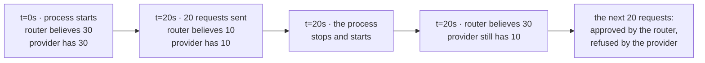

# 5.2 — The counter that starts full

## One-line answer

The router's headroom lives in the process and the provider's window does not, so a restart twenty
seconds into a minute hands the router **thirty** units of headroom when the provider has **ten**,
and the router spends the difference confidently.

## The story

Your phone updates itself overnight, and in the morning the screen under Settings that shows how
much mobile data you have used this month says **0 MB**.

Your plan gives you ten gigabytes a month. It is the eighteenth. Before last night that screen said
just over eight gigabytes, which is why you had been careful for a week — downloading things on the
office wifi, watching video only at home.

Now it says zero, and you are on the train, and you stop being careful. You let the videos play. By
the evening the connection has slowed to the point where a message will not send, and there is a
text from the operator saying you have used your full allowance.

Nothing was wrong with the number your phone showed you. The phone was counting honestly from the
moment it started counting, which was five o'clock this morning. The operator was counting from the
first of the month and never stopped. Two counters, both correct, and only one of them was ever
going to decide whether the video played.

## The idea in plain language

Your router keeps its headroom in **process memory** — variables inside the running program, which
exist from the moment the program starts until the moment it stops, and not one instant longer. When
the process ends, those variables are gone. When a new process starts, they are created fresh, at
whatever value the code initialises them to, which for a rate-limit counter means **empty: nothing
used, everything available**.

The provider's window does not work like that. From [1.1](../01-what-headroom-is/1.1-a-ceiling-is-a-window-not-a-number.md):
a ceiling is a limit paired with a span of time, and *"ten requests per minute"* means no
sixty-second stretch anywhere on the timeline holds more than ten of your requests. That timeline
belongs to the provider. It does not know your process exists, it did not notice your process stop,
and it will not restart when your process does.

So there are two things that both look like a clock, and they are unrelated:

| | starts when | is reset by |
| --- | --- | --- |
| the router's headroom | the process starts | a restart, a crash, a deploy, a `Ctrl-C` |
| the provider's window | the request that opened it | time passing, and nothing else |

A restart in the middle of a minute puts the two maximally out of step. Your counter says you have
spent nothing. The provider's window says you have spent most of it. And unlike
[5.1](5.1-the-tally-that-counts-only-sales.md), where the counter drifted a little at a time with
each failed call, here it snaps to full in one step, at the exact moment nobody is watching it.

This has the **same root cause** as [6.1](../06-in-production/6.1-one-till-two-cashiers.md), and it
is worth being precise about the relationship rather than treating them as two bugs. The cause in
both is *headroom held in process memory*. The two symptoms differ on which axis you break it:

- **6.1 breaks it across space.** Two processes run at the same time, each with its own copy of the
  counter, each believing it owns the whole allowance.
- **5.2 breaks it across time.** One process, running alone, stops and starts — and the copy it
  built the second time knows nothing about what the copy before it spent.

The fix is the same fix, and it belongs to
[6.1](../06-in-production/6.1-one-till-two-cashiers.md), which is where the counter gets moved
somewhere that outlives a process. This part's job is to make you believe you need it even when you
are certain you will only ever run one worker.

## Why Sutra needs it

Sutra restarts constantly, and almost none of the restarts are dramatic. Every `uv run python
desk.py` is a fresh process. Every save while an ADK dev server is watching files is a reload. Every
edit-and-rerun loop while you are working through [3.4](../03-the-plugin/3.4-answering-instead-of-the-agent.md)
is a router that starts with a full allowance against a Gemini minute you were already halfway
through spending on the previous run.

That is the everyday version. The expensive version is a deploy, and Day 73's ambient job makes it
worse: a scheduled run that wakes, sends a burst and exits is a process whose whole lifetime is
shorter than the provider's minute. Such a job can never learn anything about its own quota from
memory, because it has no memory that lasts long enough to learn in.

## The mechanism

There is no separate script for this one. The failure is not in any file — it is in the fact that a
`Router` is an object and objects do not survive their process, so the way to see it is to build two
routers over one clock and ask them the same question.

```bash
cd days/day-70-the-quota-router/lab
uv run python -c "
from _lane import Clock, fleet
from _router import Router

clock = Clock(0.0)
live = fleet(clock)
router = Router(live, clock)
for _ in range(20):
    router.send('reason')
    clock.tick(1.0)

restarted = Router(fleet(clock), clock)

print(f'the process has been up for {clock.now:.0f}s and served {router.served} requests')
print()
print('  lane          the old router knew   the restarted one believes')
for old, new in zip(live, restarted.lanes):
    print(f'  {old.name:<12}{old.headroom():>14}{new.headroom():>28}')
believed = sum(ln.headroom() for ln in restarted.lanes if ln.can('reason'))
truth = sum(ln.headroom() for ln in live if ln.can('reason'))
print()
print(f'  reason headroom: the restarted router believes {believed}, the provider has {truth}')
"
```

**Line by line:**

- `clock = Clock(0.0)` creates **one** clock, and it is the single most important line in the
  experiment. `Clock` is the hand-moved clock from
  [1.1](../01-what-headroom-is/1.1-a-ceiling-is-a-window-not-a-number.md), and both fleets are built
  on this same instance. That is what makes the second fleet a **restart** rather than a new day: no
  time passes between the last request and the new router, so every window the provider is metering
  is still open.
- `live = fleet(clock)` is the four-lane fleet from `_lane.py`, and for this experiment it plays the
  part of **the provider**. Its `Sliding` windows hold the timestamps of every request that has
  actually been made. They are the truth, and they are what a restart cannot touch, because in real
  life they live on the other side of a network.
- `router.send('reason')` twenty times, with `clock.tick(1.0)` between them, spends twenty requests
  across the two lanes that can do the `reason` job — Gemini at ten a minute and OpenRouter at
  twenty a minute. Twenty ticks of one second put the clock at twenty seconds, comfortably inside
  the sixty-second window, so nothing has expired.
- `restarted = Router(fleet(clock), clock)` is the restart, in one line. A brand new `Router` over a
  brand new `fleet`, which is exactly what `python desk.py` does every time you type it: fresh
  objects, fresh counters, zero used. The clock is passed unchanged, because a restart does not move
  time.
- `zip(live, restarted.lanes)` walks the two fleets in parallel. `fleet()` builds its lanes in a
  fixed order, so position `i` in one is the same provider as position `i` in the other, and the two
  columns are comparable row by row.
- `sum(... if ln.can('reason'))` totals only the lanes capable of the job, because that is the number
  a routing decision actually uses — [2.2](../02-choosing-a-lane/2.2-the-lane-that-cannot-do-the-job.md)
  established that a lane which cannot do the work is not a lane, however much headroom it has.

Measured on 2026-09-06:

```text
the process has been up for 20s and served 20 requests

  lane          the old router knew   the restarted one believes
  gemini                   2                          10
  groq                    30                          30
  openrouter               8                          20
  ollama                   6                           6

  reason headroom: the restarted router believes 30, the provider has 10
```

**Thirty against ten.** The restarted router believes it may send three times what the provider will
accept, and it believes it at the instant it starts, before it has done anything wrong. Twenty of
those thirty requests are refusals waiting to happen.

Two details in that table are worth pausing on.

The `groq` and `ollama` rows are identical in both columns — thirty and thirty, six and six. Those
lanes cannot do `reason`, so no request was routed to them, so there was nothing for the restart to
forget. That is the control in the experiment: the rows that were never spent do not move, which
tells you the disagreement is caused by spending and not by the act of constructing a second fleet.

The `gemini` row says two, not zero. Gemini's minute limit is ten and twenty requests went out, so
it did fill up — and when it refused, the router did what
[4.4](../04-when-a-lane-says-no/4.4-the-part-that-will-do.md) taught it to do: it marked the lane
cold and retried elsewhere. Two of gemini's ten slots were freed again by requests that OpenRouter
absorbed. The point is that the truth column is not a tidy zero. It is whatever a real run left
behind, and the restarted router has no way to find it out.

Drawn on one timeline, with the restart in the middle:



The only edge in that diagram where the two numbers come apart is the restart, and no request
crosses it.

## When it breaks

It breaks as a `429` on a lane the router has never used, which is a sentence that should be
impossible and is the whole reason this is hard to debug. Send what the restarted router believes it
may send, against the window the provider is actually keeping:

```bash
cd days/day-70-the-quota-router/lab
uv run python -c "
from _lane import Clock, fleet
from _router import Router

clock = Clock(0.0)
live = fleet(clock)
router = Router(live, clock)
for _ in range(20):
    router.send('reason')
    clock.tick(1.0)

for _ in range(fleet(clock)[0].headroom()):
    live[0].call()
"
```

**Line by line:**

- `fleet(clock)[0].headroom()` is the restarted router's belief about the first lane, gemini: a fresh
  lane, ten a minute, nothing spent, so ten. It is computed rather than typed so that the loop asks
  for exactly what a restarted process would ask for.
- `live[0].call()` sends into the lane that has the **real** window on it. Ten calls are attempted
  against the two slots the truth column above says are left.

Measured on 2026-09-06:

```traceback
Traceback (most recent call last):
  File "<string>", line 13, in <module>
  File ".../days/day-70-the-quota-router/lab/_lane.py", line 171, in call
    raise Refused(self.name, "minute", wait)
_lane.Refused: 429 gemini: minute window exhausted, retry-after 40s
```

Two calls succeeded. The third raised. `retry-after 40s` is the provider telling you where the edge
of *its* window is — forty seconds from now, which is sixty seconds after the first request of a
minute that began before your process did.

Now the version that hurts. **A deploy restarts every worker at once**, and that is both the moment
this is at its worst and the moment nobody is looking at quota.

🎬 **The scene:** a release goes out at four in the afternoon. Eight workers are replaced. The
deployment is green in ninety seconds and the dashboard shows request latency unchanged, so
everybody moves on to the next ticket.

😬 **The naive fix:** none, because nothing looks broken. If anyone does notice a spike of `429`s
they will attribute it to the provider, since the deploy "was just a version bump" and the rate
limiter was not part of the change.

💥 **Why it fails:** all eight workers came up inside the same few seconds, and every one of them
started with a full allowance in a minute the old workers had already spent. The fleet's believed
headroom went from near zero to eight times the limit in one step. It is worse than eight separate
restarts because they are **correlated**: a rolling restart spreads the resets across several
minutes and each new worker only has one predecessor's spending to be wrong about, while an
all-at-once replacement multiplies the error by the number of replicas.

💡 **The insight:** a counter that resets on restart makes your deploy a traffic spike. The size of
the spike is the number of replicas times the limit, and it lands during the one window when the
on-call attention is pointed at the deployment rather than at the provider.

There is a third case that is quieter and worse than either. A worker in a **crash loop** restarts
every few seconds, and each restart re-arms a full allowance. A process that cannot stay up for one
window can never learn that it is over quota, so it will send a burst, die, and send another burst,
indefinitely — and every burst is approved by its own arithmetic.

## In production

**Where the counter has to live instead.** Somewhere that outlives the process, which in practice
means one of three places, in increasing order of how much you should want them. A shared store with
an atomic increment — Redis, or the equivalent in whatever you already run — is the standard answer
and is [6.1](../06-in-production/6.1-one-till-two-cashiers.md)'s subject; it fixes the time axis and
the space axis in one move, because a counter that two processes can share is by definition a
counter that survives one of them dying. Persisting the window to local disk on every request fixes
only the time axis and costs a write per request, which is a real price for a partial fix. Doing
nothing but **starting cold** — assuming on startup that the current window is fully spent, and
waiting one span before sending — costs you one window of throughput at every restart and requires
no infrastructure at all. That last one is unglamorous and it is the right answer for a scheduled
job that runs once an hour.

**Better than any counter you keep: the provider's own.** Every counter in this day is a **model** of
the provider's state, and a model can be wrong in the two ways this section and
[5.1](5.1-the-tally-that-counts-only-sales.md) have now measured. The provider's own count cannot
be. Several providers hand it to you on every response: Addendum 02 records that Groq's `429`
responses carry an exact `retry-after` together with remaining-quota headers, which is why the
addendum calls it *"perfect for teaching backoff"*. When a response tells you how many requests
remain in the current window, the correct thing to do with your local counter is to **overwrite it**,
not to reconcile it. Your number is a guess between responses; theirs is the answer. That turns the
local counter from an authority into a cache with a correction on every call, and a cache that is
corrected on every call cannot drift for long — including across a restart, because the first
response after the restart repairs it.

**What to do when the provider does not send them.** Many do not, and free tiers are the least
likely to. Three honest options, and the choice is a real trade rather than a best practice.

| Option | What it costs | When it is right |
| --- | --- | --- |
| start cold — assume the window is spent, wait one span | one window of throughput per restart | short-lived and scheduled jobs, where a lost minute is nothing |
| persist the window and reload it at startup | a write per request, and a stale file after a crash | long-running single-process workers |
| probe — send one request and read the refusal | one `429` you caused deliberately, per restart | when the refusal carries `retry-after`, so one probe buys the exact answer |

The one option that is never right is the default you already have: start full and find out. That is
not a trade-off, because it spends other people's refusals to learn something a five-second wait
would have told you for free.

**What degrades at scale.** The damage from a restart is the limit times the number of processes
that restart together, so it grows linearly with replica count and superlinearly with deployment
frequency — more replicas per deploy, and more deploys per day, multiply. A system on a free tier
that deploys ten times a day with eight replicas is spending a meaningful fraction of its daily
allowance on the act of deploying. Autoscaling makes it structural rather than occasional: scaling
up is a restart that nobody triggered, and it happens precisely when traffic is high, which is
precisely when the windows are already full.

**The review comment a senior engineer leaves:** *"The lane counters are constructed in `__post_init__`
with empty windows, so every process starts believing it owns the full minute. Our deploy replaces
eight pods inside a few seconds, which means eight full allowances against one provider window — that
is where last Thursday's `429` spike came from, not from them. Either move the counter into the
shared store or make startup conservative and wait a window before the first send. And read the
remaining-quota headers on the response: their number is authoritative and ours is a guess, so we
should be overwriting from theirs rather than trusting an integer that a restart can reset."*

**The interview question:** *"Your rate limiter is correct and you still see `429`s after every
deploy. What is happening?"* The answer that has debugged it: *"The limiter's state is in process
memory and the provider's window is not, so every restart hands each worker a full allowance in a
window that is already partly spent. I measured it on a four-lane router: twenty requests in, the
process restarts twenty seconds into the minute, and the new router believes it has thirty units of
headroom where the provider has ten — three times the truth, at the instant it starts. It is the same
root cause as running two workers, just on the time axis instead of the space axis, so the fix is the
same: put the counter somewhere that outlives the process. Where the provider returns remaining-quota
headers I would overwrite the local counter from the response rather than reconcile it, because our
count is a model of theirs and theirs is the one that decides. And where it does not, I would start
cold rather than start full — losing one window per restart is cheaper than a spike of refusals every
time we ship."*

## Check yourself

```bash
cd days/day-70-the-quota-router/lab
uv run python -c "
from _lane import Clock, fleet
from _router import Router

clock = Clock(0.0)
live = fleet(clock)
router = Router(live, clock)
for _ in range(20):
    router.send('reason')
    clock.tick(1.0)

restarted = Router(fleet(clock), clock)
for old, new in zip(live, restarted.lanes):
    print(f'  {old.name:<12}{old.headroom():>6}{new.headroom():>6}')
"
```

Now change `clock.tick(1.0)` to `clock.tick(61.0)` and run it again. Every request now sits in a
minute of its own, so nothing is left in any window by the time the restart happens and the two
columns agree exactly. Then try `clock.tick(4.0)`, where they neither agree nor differ by as much as
they did. Say what the middle case measures, and why the run that agrees is not evidence that the
counter is correct.

**Out loud, without scrolling up:** name the two things that both look like a clock and say which one
a restart resets. Then say which axis this part breaks and which axis
[6.1](../06-in-production/6.1-one-till-two-cashiers.md) breaks.

**Next:** [5.3 — Two cards, one household](5.3-two-cards-one-household.md).
