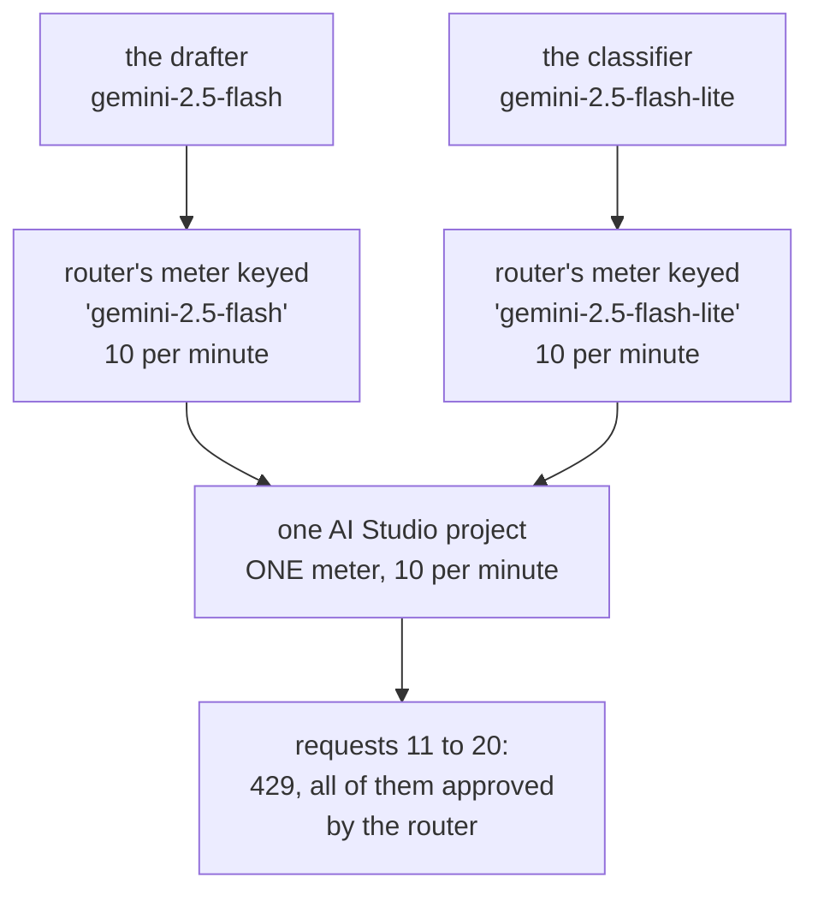

# 5.3 — Two cards, one household

## One-line answer

A free tier meters per project, organization or account and **not** per model string, so pointing
the classifier at one model and the drafter at another does not buy a second allowance — and a
router keyed on the model name sends twenty requests into a limit of ten, holds nothing back, and
believes both of its meters.

## The story

Your family has a health insurance policy for five lakh, and everybody in the house has their own
card for it. Yours has your name printed on it and the number five lakh printed under it. Your
father's card has his name on it and the same five lakh under it.

In March your father is in hospital for four days. The bill comes to a little over four lakh and the
insurer settles it directly with the hospital. Everyone is relieved and nobody thinks about the card
again.

In July you need a small procedure yourself. You hand over your card at the admissions desk, the
clerk types the number in, and she tells you there is about one lakh left. You point at your card,
because the card says five, and it is your card, with your name on it.

She is not wrong and the card is not lying. The five lakh was never yours. It was the household's,
and there is one pot of it, and everyone was given a card so that any of you could reach the same
pot. Two cards, one pot. You had been reading your card as a promise about you, when it was only a
way in.

## The idea in plain language

[1.1](../01-what-headroom-is/1.1-a-ceiling-is-a-window-not-a-number.md) introduced the **quota pool**
in one sentence and left it there: the pool is the thing the limit is attached to. This part is
about what happens when you get it wrong, and the wrong answer is always the same wrong answer.

When you call a model you send two quite different things. You send the **model string** — the name
of the product you would like, `gemini-2.5-flash` or `gemini-2.5-flash-lite` — and you send a
**credential**, the key that says who is asking. The provider prices and routes on the first one. It
**meters** on the second one, or rather on the account behind it.

So the model string is what you are ordering, and the pool is who is paying. Two model strings on
one key are two cards on one policy.

This is not obvious, and the reason it is not obvious is that a model string is the only part of the
arrangement you can see in your own code. A router that keeps a counter per model looks tidy and
reads well:

> a dictionary from model name to headroom, one entry per model we use.

Every line of that is defensible except the assumption underneath it, which is that a name that
appears twice in your config corresponds to something the provider counts twice. It does not. Two
names, one meter.

Worse, the mistake makes your router **more** confident rather than less. Adding a second model
string to the config visibly increases the fleet's total headroom on your own dashboard. It looks
like you bought capacity. What you did was give the same pot a second card.

## Why Sutra needs it

Sutra runs on Gemini as its primary brain, and Addendum 02 names two Gemini free models it may use:
`gemini-2.5-flash` and `gemini-2.5-flash-lite`. The natural design — and the one this curriculum
would otherwise drift into — is to send the cheap classification work to Flash-Lite and the harder
drafting to Flash, and to track them separately because they are separately configured. Both of
those calls go out on one `GOOGLE_API_KEY`, against one AI Studio project, against one meter.

`_lane.py` already takes the other position, and its docstring is where the day states it:

> A lane is not a model. It is a *quota pool*, which is the unit the free tiers actually meter (…)
> Two agents pointed at two Gemini models share one Gemini lane, and a router that forgets this will
> double-count its own headroom.

That is why `fleet()` returns four lanes for four providers rather than one lane per model. This
part is the measurement behind that design decision, and it is the reason the router's configuration
in section 3 is keyed the way it is.

## The mechanism

`lab/pool.py` builds the provider's meter and the router's belief side by side, and the flag that
switches between the bug and the fix changes nothing except how many `Sliding` windows exist:

```python
    # What the provider actually meters: one window for the whole project.
    provider = Sliding(RPM, 60.0, clock)

    # What the router believes it has.
    if pooled:
        flash = lite = Sliding(RPM, 60.0, clock)
    else:
        flash = Sliding(RPM, 60.0, clock)
        lite = Sliding(RPM, 60.0, clock)
```

**Line by line:**

- `provider` is constructed once, above the branch, and both runs share it unchanged. It is the pot:
  one window, one limit, for the whole project. Nothing the router believes can change it, which is
  the entire relationship being modelled.
- `flash = lite = Sliding(...)` is the fix, and it is worth reading twice because Python's assignment
  makes it easy to miss. This binds **two names to one object**. There is no second counter; there
  are two ways to refer to the same one, which is exactly the truth about two model strings on one
  project.
- The `else` branch builds **two** `Sliding` objects with identical arguments. They are equal in
  every respect and they are not the same object, and that difference — two counters instead of one
  counter with two names — is the whole bug. It is four characters of Python between correct and
  wrong.
- Both branches use the same `RPM` for the believed windows. The bug is not that the router guessed
  the wrong limit; each individual number is right. The bug is arithmetic: the router adds two
  correct tens and gets twenty, and the provider never agreed to the addition.

The loop then alternates between the two model strings, which is what a real system does when two
agents with different jobs are running side by side:

```python
    for i in range(REQUESTS):
        clock.now = i * 0.5
        believed = flash if i % 2 == 0 else lite
        if believed.remaining() <= 0:
            held += 1
            continue
        believed.take()
        sent += 1
        try:
            provider.take()
        except Refused:
            refused += 1
```

**Line by line:**

- `clock.now = i * 0.5` puts twenty requests inside ten seconds, well within one minute, so the
  window never rolls and nothing expires. Any refusal you see is a real over-send and not a boundary
  artefact of the kind [1.2](../01-what-headroom-is/1.2-the-burst-every-counter-approved.md) found.
- `believed = flash if i % 2 == 0 else lite` alternates strictly. That is deliberately the *kindest*
  possible traffic pattern for the bug: perfectly balanced between the two model strings, so neither
  believed counter is stressed before the other. The bug does not need unlucky traffic.
- `believed.remaining() <= 0` is the router's own gate — the same check every routing decision in
  this day makes. Watch `held` in the two runs: it is the count of times the router did its job.
- `believed.take()` and `provider.take()` are two separate calls to two separate counters, in that
  order, and the `try` sits on the second one. That ordering is the honest model of reality: your
  counter is decremented by code you control, and the provider's is decremented by the request
  arriving, and you find out what the provider thinks only afterwards.

Run the version keyed on the model string:

```bash
cd days/day-70-the-quota-router/lab
uv run python pool.py
```

**Line by line:**

- No flag means one meter per model string, which is the default because it is the design a
  reasonable person writes when the only identifier in front of them is the model name.

Measured on 2026-09-06:

```text
project limit 10/min. The router keeps: one meter per model string

  the router sent            20
  the router held back       0
  the provider refused       10

  router's belief: flash 10/10 used, lite 10/10 used
  the provider saw 20 requests against one limit of 10

  Two model strings are one allowance. The second meter was imaginary.
```

**Twenty sent, zero held back, ten refused.** And look at the belief line: `flash 10/10 used, lite
10/10 used`. The router did not overrun either of its counters. It filled both of them exactly to
the brim and stopped, which is the behaviour of a limiter working perfectly. It is just that the two
tens were never twenty.

*The second meter was imaginary* is the sentence to carry out of this part. Not "inaccurate" —
imaginary. There was nothing on the provider's side for it to correspond to. It was created by the
shape of the config.

Now key it on the pool:

```bash
uv run python pool.py --pooled
```

**Line by line:**

- `--pooled` changes one line of construction, as shown above. The traffic, the limit, the clock and
  the alternating pattern are identical, so any difference in the output is caused by the keying and
  by nothing else.

Measured on 2026-09-06:

```text
project limit 10/min. The router keeps: one meter for the project

  the router sent            10
  the router held back       10
  the provider refused       0

  router's belief: flash 10/10 used (shared)
  the provider saw 10 requests against one limit of 10

  One pool, one meter, no refusals.
```

Ten held back, and every one of those is a request that would otherwise have been refused. The
router did not become more cautious; it became **correct**, and correctness here looks exactly like
caution from the outside, which is why nobody notices the bug until the refusals start.



## The pool key is a page you read, not a rule you derive

There is no principle from which you can work out what a provider meters. It is a business decision,
written on a documentation page, and it differs between providers who are otherwise very similar.
Here is what Sutra's own record says, and note that the record is a **reading with a date on it**,
exactly as [Day 69's part 3.2](../../../day-69-pii-and-data-boundaries/parts/03-the-line-at-the-provider/3.2-the-page-that-does-not-answer.md)
insisted for training terms:

| Provider | What the free tier meters | What the record says |
| --- | --- | --- |
| Gemini | the **project** | Addendum 02 §3, verified 2026-08-12: *"Limits are per project, not per key."* |
| Groq | the **organization** | Addendum 02 §3, verified 2026-08-12: *"≈ 30 RPM … per organization"* |
| OpenRouter | **not stated in the record** | Addendum 02 §3 gives the numbers — *"20 RPM / ~50 RPD on the free floor"* — and does not name the unit they are metered against |
| Ollama | nothing | it runs on your machine; the limit is your hardware |

Three things in that table are worth more than the numbers.

**"Per project, not per key" is the row that saves you a wasted afternoon.** The obvious move when
you run short of Gemini quota is to make a second API key. It buys you nothing at all, because the
key is not the pool. Addendum 02 §7 makes the same point from the other direction and adds the rule
that matters: creating extra accounts or keys to dodge limits *"violates provider terms (and
Groq/Gemini meter per org/project anyway, so it barely works)"*, and **the legitimate version of that
idea is the router across different providers** — which is the whole of this day.

**The OpenRouter row is the honest one.** The record states the limits and does not state the unit
they attach to. That is not a gap to be filled in with a guess; it is the `n/a` verdict from Day 69
applied to quota instead of to training terms. The row that says *the document did not answer* is
worth writing precisely because it looks like the row nobody filled in, and the correct next action
is written on the addendum's own lookup rule: check the models page filtered to `:free`, and record
what you found with the date.

**The dates are load-bearing.** Free rosters and quotas move — Addendum 02 records a December 2025
precedent for exactly that — so this table is what was true on the day it was read, and Sutra's
phase-gate freshness check is where it gets re-read. A pool key that was correct last quarter is a
claim, not a fact, and it is the sort of claim that fails silently.

## When it breaks

It breaks as a refusal from a window your router is certain is only half spent:

```bash
cd days/day-70-the-quota-router/lab
uv run python -c "
from _lane import Clock, Sliding

clock = Clock(0.0)
project = Sliding(10, 60.0, clock)
for i in range(11):
    clock.now = i * 0.5
    project.take()
"
```

Measured on 2026-09-06:

```traceback
Traceback (most recent call last):
  File "<string>", line 8, in <module>
  File ".../days/day-70-the-quota-router/lab/_lane.py", line 114, in take
    raise Refused("sliding", f"{self.span:.0f}s", wait)
_lane.Refused: 429 sliding: 60s window exhausted, retry-after 55s
```

Eleven requests into a window of ten, and the eleventh is refused with fifty-five seconds to wait.
In `pool.py`'s broken run this happens ten times in five seconds while the router's own two counters
are both reporting room.

The reason this is hard to recognise in a real system is that the refusals are **attributed to the
wrong model**. Requests alternate between the two model strings, so the `429`s do too, and the
support ticket you write says *"we are getting rate limited on Flash and on Flash-Lite"*. That
sentence contains the answer and reads like a coincidence. Two models failing together at exactly
half your expected capacity is not two problems; it is one meter.

The tell is arithmetic, and it is one addition. Add up the requests you sent across
**every** model string on one key in the last minute. If that total is at or over the documented
limit for one of them, while no individual model's count is, you have this bug.

## In production

**The pool key in a multi-tenant deployment.** As soon as one deployment serves several customers,
"which pool" becomes a question with two answers and you must pick deliberately. If each tenant has
their own provider project, the pool key is the tenant's project id and your counter must be keyed on
it, which means the key travels with the request rather than sitting in a config file. If they all
share one project — which is what happens by default, because it is one environment variable — then
the pool key is the deployment, and every tenant is drawing on one pot. The consequence is a blast
radius, and Principle 13 says the blast radius arrives with the capability: one tenant's batch job
refuses another tenant's interactive request, and the second tenant has no way to see why. If you
share a pool you owe every tenant a share of it, which means a per-tenant sub-budget enforced by you,
underneath the provider's meter. The provider will not do it for you; it cannot see your tenants.

**What happens when two teams share a project.** The same thing, minus the vocabulary that would help
you notice. Two teams on one AI Studio project have one minute between them, and nothing in either
team's code mentions the other. The failure is not that they run out — it is that each team's
investigation is conducted entirely inside its own service, where every number is correct. The
practical requirements are unglamorous: the pool must have a name that appears in both teams' logs,
the counter must be shared or at least reported centrally, and somebody must own the pot. A shared
quota with no owner is a shared quota that gets consumed by whoever ships first.

**Why the config names the pool and not the model.** Three reasons, in increasing order of how
annoying they are to discover late. First, correctness: this part's measurement. Second, churn — model
strings change, free rosters move, and a config keyed by model means that adding a model silently
creates a meter, so a routine model upgrade doubles your believed headroom with no review comment
attached to it. Third, review: a config that says `gemini_project: 10 rpm` can be checked against a
provider's documentation page by anybody, while a config that says `gemini-2.5-flash: 10 rpm,
gemini-2.5-flash-lite: 10 rpm` is only checkable by somebody who already knows this bug exists. The
shape that survives is a pool declared once, with the models listed **under** it as members, so that
adding a model is visibly an addition to a pot that already has a size.

**What degrades at scale.** The error is multiplicative in the number of model strings sharing a
pool, not additive: three models on one project means the router believes it has three times the
truth, and there is no point at which this self-corrects. It also interacts badly with everything
else in this section. The fail-open counter of [5.1](5.1-the-tally-that-counts-only-sales.md)
under-counts by your error rate, the restart of [5.2](5.2-the-counter-that-starts-full.md) resets to
full, and a split pool multiplies whatever is left, so a system with all three is not wrong by a
little in three places — it is wrong by a large factor in one direction.

**The review comment a senior engineer leaves:** *"`RATE_LIMITS` is a dict keyed by model string with
two Gemini entries in it, so we think we have twenty a minute. Both of those go out on one
`GOOGLE_API_KEY` against one project and the project's limit is ten — the second entry is not a
second allowance, it is the same one counted twice. Key this on the pool: one entry for the Gemini
project with the models listed under it. And while you are in there, put the pool identifier in the
`429` log line, because right now a refusal tells us which model was called and not which pot it came
out of, and the pot is the thing that ran out."*

**The interview question:** *"You are rate limited on a free tier. Can you use a second model to get
more throughput?"* The answer that has tried it: *"Almost certainly not, and the reason is that the
provider meters the account and not the model. Gemini's free limits are per project rather than per
key, so a second key does not help either, and Groq meters per organization. I measured the mistake:
a router with one counter per model string sent twenty requests into a project limit of ten, held
nothing back, and finished with both of its counters reading exactly ten out of ten used — it never
overran a counter, the second counter simply did not correspond to anything. Keyed on the pool
instead, it held ten back and took zero refusals, with no change to the traffic. The part I would
stress is that you cannot derive the pool key from first principles; it is a line on a documentation
page, so it gets read, written down with a date, and re-read at a regular checkpoint. And the
legitimate way to get more throughput is a second provider, not a second name for the first one."*

## Check yourself

```bash
cd days/day-70-the-quota-router/lab
uv run python pool.py
uv run python pool.py --pooled
```

Now change `REQUESTS` in `pool.py` from `20` to `30` and run both modes again. Predict the four
numbers before you look. Then say which of them grows, which stays fixed, and why the fixed one is
fixed.

**Out loud, without scrolling up:** say what a provider meters when you send it a request, and name
the one thing on Sutra's pool table that the record does not answer.

**Next:** [6.1 — One till, two cashiers](../06-in-production/6.1-one-till-two-cashiers.md).
