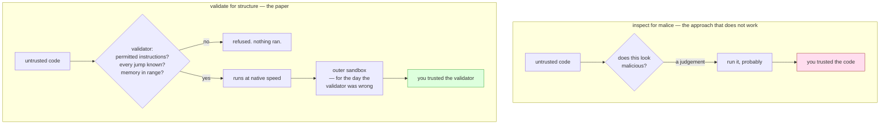

# Native Client: A Sandbox for Portable, Untrusted x86 Native Code

> *Native Client: A Sandbox for Portable, Untrusted x86 Native Code* · `doi:10.1109/SP.2009.25` ·
> 2009 30th IEEE Symposium on Security and Privacy, pages 79–93, IEEE
> · <https://doi.org/10.1109/SP.2009.25>
>
> Record checked live on 2026-09-06 via `https://api.crossref.org/works/10.1109/SP.2009.25`; the
> title, proceedings, pages, year and publisher above are copied from that record. The record carries
> **no abstract**, and this document was written from it and from the runnable demo below rather than
> from the full text — so it quotes no constants, no performance figures and no theorem statements,
> and *When it breaks* says again where that line is.

## One-line answer

Running code somebody else wrote had two settled answers — trust it and run it, or refuse it and run
nothing — and this is the document that established a third: **check it against a small set of
structural rules before it runs, refuse anything that does not fit, and put the trust in the checker
rather than in the code**.

## The story

A community hall gets given things. Somebody clears out a flat and the hall ends up with a kettle. A
school replaces its heaters and two of the old ones arrive in the back of a car. A fan, a toaster, a
lamp with a shade that does not match.

The caretaker has to decide what to do with them, and for a long time there were only two answers,
and both of them were bad.

The first answer is to plug them in. They are probably fine — most things are — and the hall gets a
kettle, which is what everybody wanted. The trouble is that "probably fine" is the whole of the
reasoning, and the one time it is wrong, it is wrong in the worst possible way, in a building full of
people, at a children's party.

The second answer is to refuse everything. Nothing donated gets plugged in. That is genuinely safe
and the hall has no kettle, no heaters and no fan, and the committee buys new ones out of money it
does not have.

So everybody reaches for the obvious middle, which is to have a look at it first. And this is the
part worth slowing down on, because the middle is where the difficulty actually lives. What makes an
appliance dangerous is inside it. A cracked live wire touching a metal case looks like a kettle. A
plug wired with the live and earth swapped looks like a plug. There is nothing on the outside to see,
and the caretaker is not going to open twenty appliances, and even if he did he would not know what
he was looking at. Looking harder does not converge on an answer, because the thing he is trying to
decide is not written on the outside of the thing he is looking at.

What actually solved this is not a better look. It is an electrician who comes round with a tester
and does the **same short procedure** on every single item, whatever it is and whoever gave it. Is
the earth connected to the case? Is the insulation sound? Is the plug wired the right way round? Is
the fuse the right rating? Four questions, the same four every time, each with a yes or a no. Pass
gets a sticker with a date on it. Fail goes in the skip, and nobody asks what the donor intended.

Two things about that arrangement are the whole of this document.

The first: the electrician is not deciding whether the kettle is *good*. He is deciding whether it
has a property he can measure. Those are different questions and only one of them has an answer.

The second: what the hall now trusts is not the kettle. It is the tester and the procedure — a small
thing, the same for everything, that one person can be trained on and another person can check.

## The idea in plain language

Some terms first, in plain words, because the paper's own title uses three of them.

**Native code** is instructions the processor in your machine executes directly. Not Python, which is
read by an interpreter that can stop it doing things; not JavaScript in a browser tab, which is
running inside a program that decides what it may touch. Native code is the machine's own language,
and by default it can do whatever the machine can do.

**x86** is the family of instruction sets used by most desktop and laptop processors. It matters here
only because it is complicated: instructions vary in length, so where one ends and the next begins
depends on where you started reading, and that fact turns out to be the awkward part of the whole
problem.

**Untrusted** means you did not write it and cannot vouch for it. Somebody sent it to you, or a web
page did.

**A sandbox** is an arrangement in which untrusted code can run without being able to reach the
things you care about.

Now the claim, and it comes in three pieces.

**Piece one: the question people were asking has no answer.** *Is this code malicious?* is not a
question you can settle by examining the code, in the way that *does this kettle have a connected
earth* can be settled by touching two probes to it. Any check that tries to decide intent can be
approached with something that behaves innocently while it is being checked, or that does nothing
recognisable at all until it is running. There is no amount of cleverness that converts *look at it
and decide* into a reliable procedure. That is the caretaker opening the kettle.

**Piece two: a different question does have an answer.** Instead of *is this code malicious*, ask *is
this code built out of a restricted set of shapes I have decided are safe to run?* That question is
about **structure** rather than about intent, and structure is a thing you can check exhaustively
before anything executes. Code that is not built that way is refused — not analysed further, not run
carefully, refused — exactly as the failed toaster goes in the skip rather than into a
watch-it-carefully pile.

**Piece three: this moves what you have to trust, and moves it somewhere small.** With the first
approach you trust the code. With this one you trust the **checker** — and the checker is a fixed
program you wrote, that does not change when new code arrives, and that is small enough for a person
to read all of. That substitution is the paper's real product. It did not make untrusted code safe.
It made the safety of the system depend on a component whose correctness you can actually argue
about.

There is a fourth piece, and it is the one that gets forgotten when the idea is quoted: the paper
does not stop at one checker. It assumes the checker will one day be wrong, and puts a **second,
independent boundary** behind it. That is the residual current device in the hall's fuse box: a
switch that cuts the power in a fraction of a second if electricity starts going somewhere it should
not. The appliance was tested. The RCD is there for the day the test was wrong.

## Why Sutra needs it

This day built exactly the arrangement the paper argues for, and built it without knowing that is
what it was doing — which is Principle 4 at the scale of a day, and the reason this document is at
the end rather than at the front.

**Sutra's day has two layers, and they are the paper's two layers.**

The inner one is your own: part
[3.1](../parts/03-the-door/3.1-the-check-outside-every-tool.md) put a check outside every tool — one
`BasePlugin` on the `Runner` — that reads each action the model asks for and compares the URL's
authority against a permitted origin. It decides **before** anything reaches the browser. It does not
ask whether the request looks dangerous; it asks whether it has a property, and the property is
structural. On the identical five-action script, three of five actions reached the browser with it
and five of five without.

The outer one is not yours: part
[3.2](../parts/03-the-door/3.2-the-guard-adk-already-shipped.md) is the guard ADK already ships on
`navigate`, refusing hosts that are not publicly routable, on by default and enforced in the
framework's code rather than in yours. Two boundaries, written by different people, enforcing
overlapping rules, neither aware of the other. That is defence in depth arrived at by accident, and
this document is where it stops being an accident and becomes a design you can defend.

**And this day found the paper's failure mode too.** Part
[4.1](../parts/04-in-production/4.1-the-action-nobody-enumerated.md) drove it: the door's `_verdict`
ends in `return ""`, so an action it has never heard of is allowed, and the list of actions it has
heard of belongs to a framework that adds to it. That is precisely the trap the paper's structural
approach avoids and a name-matching approach does not. The paper's rules describe **what code must
look like**, so a program nobody has ever seen is still covered. The door's rules name **which actions
they apply to**, so an action nobody has ever seen is not covered at all. Same architecture, opposite
default, and the difference is the whole reason part 4.1 exists.

Day 72 onward keeps needing this shape, because every remaining phase adds something that runs code
or drives a machine on somebody else's behalf. The sentence to carry is: *decide before it runs, from
rules small enough to read.*

## The mechanism

Written out as a method rather than paraphrased, the design has three moving parts and one
substitution.

**The setup.** A program arrives as machine instructions. It must be allowed to run fast — native
speed is the point; otherwise you would use an interpreter and be done. It must not be able to reach
memory, files, devices or network except where you decide.

**The move: static validation ahead of execution.** *Static* means the code is examined as data,
without being run. Before a single instruction executes, a **validator** walks the program and checks
it against a fixed set of structural rules. The rules are not about what the program is trying to do.
They are about the form it is written in:

1. **A constrained instruction subset.** Certain instructions simply may not appear. Anything that
   changes the machine's protection state, or that talks directly to hardware, is not part of the
   permitted vocabulary. Untrusted code that wants such a thing is not written wrong; it is written in
   a language the validator does not accept.
2. **Every jump must be to a place the validator has seen.** This is the rule that makes the others
   hold, and it is the one that needs x86's awkwardness to explain. Because instructions vary in
   length, the same bytes decode differently depending on where you start reading — so a jump into the
   *middle* of an instruction produces a completely different instruction that the validator never
   examined. Allow that and every other rule is decoration, because forbidden instructions can be
   assembled out of the tails of permitted ones. So the code is required to be laid out such that the
   validator can determine every possible destination, and any destination it cannot determine is a
   refusal.
3. **Memory references must fall inside the region the program was given.** Not *should*; must, by
   construction, in a way the validator can confirm by reading the instruction rather than by watching
   it run.

Anything that fails any rule is **refused before execution**, whole. There is no partial run, no
sandboxed-but-watched mode, no heuristic score. It fits or it does not.

**The property that matters.** After validation, the thing you are trusting is not the program. It is
the validator, and the validator has three qualities that make that a good trade: it is **fixed**, so
it does not change when new programs arrive; it is **small**, so a person can read all of it and
another person can argue about it; and it is **the only thing** that has to be right, so review effort
concentrates in one place instead of spreading across every program you will ever run.

**And then the second layer.** The design does not rest on the validator being correct. It puts an
independent **outer sandbox** behind the inner one, enforced by a different mechanism, so that a bug
in the validator is not the end of the story. Two boundaries, deliberately not sharing an
implementation, on the assumption that either might be wrong.



The two halves differ in one place: whether the question asked of the code has an answer. Everything
else — the code, the machine, the speed you wanted — is identical.

## The paper in one demo

The contribution, stripped to nothing but itself: **the same untrusted action stream, run twice,
differing only in whether anything decided before executing.**

```text
days/day-71-computer-use-and-the-sandbox/lab/papers/native-client/
├── validator.py   # the rules, and a machine that runs a stream through them or around them
└── demo.py        # one untrusted stream, with --off as the ablation
```

Two files. No x86, no browser, no agent, no model, no network — the paper's claim is about *where the
decision happens*, and everything else in the directory would be arguing a different point. Addendum
02 is satisfied trivially: nothing here calls a provider, so there is no key, no quota and no HTTP 429
to handle.

The obvious objection first, because it is the right one to have: this is not a validator for x86
machine code, and it does not pretend to be. It is the paper's **shape** at a scale a reader can hold
— a small fixed rule set, applied to an untrusted stream, ahead of execution, with refusal as the
outcome for anything that does not fit. What it can demonstrate honestly is the difference that shape
makes; what it cannot demonstrate is instruction decoding, and *When it breaks* says so.

`validator.py` opens by saying what property it exists to have:

```python
"""The paper's one idea: decide before it runs, from a small set of rules you can read.

Native Client's argument is not that untrusted code should be inspected for malice. It is that
untrusted code should be *statically validated* against a small set of structural rules, ahead of
execution, and refused if it does not fit - so that the thing you have to trust is the validator
rather than the code, and the validator is small enough to audit.

This file is that validator, for a toy action stream instead of x86. It is deliberately short,
because "small enough to read in one sitting" is the property being demonstrated.
"""

from __future__ import annotations

from dataclasses import dataclass

# The one switch. With validation off, every action executes and the sandbox is decoration - which
# is the state of any system that inspects after the fact instead of deciding before.
ENFORCE = True

# The permitted action set. Anything not named here is refused, which is deny-by-default: the
# validator does not need to know what `spawn` does in order to refuse it.
ALLOWED = frozenset({"read", "click", "scroll"})

# Where `read` is permitted to point. An allowlist of prefixes rather than a blocklist of bad ones,
# for the reason the paper gives about the enumerable-badness trap.
ALLOWED_PREFIXES = ("site://status", "site://history")
```

**Line by line:**

- The docstring's last two lines are the demo's actual claim. Not "this code is secure" — *"small
  enough to read in one sitting"* is the property, and it is checkable by counting the file.
- `ENFORCE = True` is the ablation switch, and it is a **module-level name** rather than a parameter
  so that `demo.py` can flip it without either file changing shape. Its comment names the failure it
  represents: a system that inspects after the fact instead of deciding before.
- `ALLOWED = frozenset({...})` is the permitted vocabulary — the paper's constrained instruction
  subset, three opcodes instead of a subset of x86. **A `frozenset` rather than a `set`** because
  nothing should be able to widen the rules at run time; the moment an untrusted stream can add to
  this, the validator is no longer fixed and the trust argument collapses.
- The comment on `ALLOWED` carries the sentence this whole document is about: *the validator does not
  need to know what `spawn` does in order to refuse it.* That is the difference between structural
  validation and judgement. A checker that had to understand `spawn` would have to understand every
  future action; this one has to understand three.
- `ALLOWED_PREFIXES` is a tuple of permitted destinations rather than a list of forbidden ones. A
  blocklist here would be a bet that you thought of `file://`, `ftp://`, `//`, backslashes, percent
  encoding and everything else; an allowlist is a bet that you know where your own pages are.
- A tuple rather than a list because `str.startswith` accepts a tuple directly, which is why the check
  below is one expression rather than a loop.

The rules themselves — one dataclass and one function with two `if`s, which is the paper reduced
to something you can read in a sitting:

```python
@dataclass(frozen=True)
class Action:
    """One instruction in the untrusted stream."""

    op: str
    operand: str = ""


def validate(action: Action) -> str:
    """Return the reason this action is refused, or an empty string if it may run.

    Two rules, in this order, and the order matters: an unknown opcode is refused before anything
    looks at its operand, so a new action cannot smuggle itself in by having a well-formed argument.
    """
    if action.op not in ALLOWED:
        return f"opcode {action.op!r} is not in the permitted set {sorted(ALLOWED)}"
    if action.op == "read" and not action.operand.startswith(ALLOWED_PREFIXES):
        return f"operand {action.operand!r} is outside {list(ALLOWED_PREFIXES)}"
    return ""
```

**Line by line:**

- `Action` is `frozen=True`, so an instruction cannot be edited after it has been validated. That is
  not tidiness. A validator that approves one thing and hands on something else has proved nothing,
  and time-of-check-to-time-of-use is the classic way a real sandbox is defeated.
- `validate` returns a **string**: empty means allowed, non-empty is the reason. That is the same
  protocol as the door's `_verdict` in part
  [3.1](../parts/03-the-door/3.1-the-check-outside-every-tool.md) — deliberately, so the two can be
  read against each other.
- **The `return ""` at the end of this function means something different from the one in
  `_verdict`.** Here it is reached only *after* the opcode has been confirmed to be in `ALLOWED`, so
  it means *checked and clear*. There, it is reached by any name the function did not mention, so it
  means *no rule*. Identical line, opposite default, and part
  [4.1](../parts/04-in-production/4.1-the-action-nobody-enumerated.md) is the part about the
  difference.
- `if action.op not in ALLOWED` runs **first**, and the docstring says why: an unknown opcode is
  refused before anything looks at its operand. That ordering is the small echo of the paper's jump
  rule — you do not begin reasoning about the parts of an instruction you have not established you
  are allowed to be reading.
- The refusal messages contain `sorted(ALLOWED)` and `list(ALLOWED_PREFIXES)`, so the output says
  *what the rule was*, not only that a rule fired. A refusal a reader cannot check is a refusal that
  gets ignored.
- There is **no exception class here**, and the absence is deliberate. `validate` returns a *reason*
  and the machine below collects it, because this demo wants to count refusals rather than stop at
  the first one. That is a real difference from the paper and it is stated rather than hidden: a
  validator's refusal is fatal and whole-program — the binary does not load — whereas this one is per
  action. *When it breaks* returns to it.

The machine that runs a stream, and the one line the ablation touches:

```python
class Machine:
    """Executes an action stream, through the validator or around it."""

    def __init__(self) -> None:
        self.executed: list[Action] = []
        self.refused: list[tuple[Action, str]] = []

    def run(self, stream: list[Action]) -> None:
        for action in stream:
            reason = validate(action) if ENFORCE else ""
            if reason:
                self.refused.append((action, reason))
                continue
            self.executed.append(action)

    def reached(self, op: str) -> bool:
        return any(a.op == op for a in self.executed)
```

**Line by line:**

- `reason = validate(action) if ENFORCE else ""` is the **entire ablation**, on one line, inside the
  loop. With `ENFORCE` false the expression short-circuits to the empty string, which is the value
  that means *allowed* — so switching the paper off is literally "assume everything passed". That is
  a fair statement of the alternative the paper was arguing against.
- The validation happens **before** the action is appended to `executed`. There is no execution to
  undo, no partial effect, no rollback. That ordering is the paper's contribution in one statement,
  and it is why this loop looks so unremarkable: the whole point is that the interesting decision has
  already been made by the time anything happens.
- `self.refused` stores the action **and** the reason, as a pair. A sandbox that leaves no record of
  what it stopped has stopped nothing anybody can audit — the same argument the day's own `Trace`
  makes in `lab/_computer.py`.
- `continue` rather than `break`: one refused action does not end the stream. That is a modelling
  choice this demo makes and a real validator does not — see *When it breaks* — and it is made so
  that the two runs can be compared action by action rather than stopping at different points.
- `reached(op)` exists so the verdict at the end can ask about the *outcome* rather than about the
  console output. A demo that greps its own printout is checking its formatting.

`demo.py` is the untrusted stream and the switch:

```python
"""One untrusted action stream, validated ahead of execution and then not.

    uv run python demo.py         # the validator runs first
    uv run python demo.py --off   # the ablation: the same stream, executed unchecked

The stream is identical in both runs, and it is not obfuscated - it contains one action that is
plainly outside the permitted set and one whose operand points outside the permitted region. The
only thing that changes is whether anything decided before executing.

Zero budget: no model, no network, no browser. This demo is about the shape of the decision.
"""

from __future__ import annotations

import sys

import validator
from validator import Action, Machine

STREAM = [
    Action("read", "site://status"),
    Action("click", "incident-title"),
    Action("read", "file:///etc/passwd"),
    Action("scroll", "down"),
    Action("spawn", "curl https://example.invalid/collect"),
    Action("read", "site://history"),
]
```

**Line by line:**

- The docstring says *"it is not obfuscated"* and that sentence is doing real work. The demo is not
  winning by hiding something clever; the bad actions are plainly bad and would be obvious to any
  reader. The whole difference between the two runs is whether **anything looked**.
- `import validator` **and** `from validator import Action, Machine` — both forms, on purpose. The
  module object is needed so that `validator.ENFORCE = False` mutates the flag the `Machine` actually
  reads; a `from validator import ENFORCE` would bind a local copy and the ablation would silently do
  nothing. That is a real Python trap and it is exactly the kind of bug that makes a demo prove the
  opposite of what it claims.
- The six actions are chosen so that each one has a job. Two are ordinary reads of permitted pages and
  one is a scroll — they exist so that the enforced run is not simply "everything refused", which
  would prove nothing about a working system.
- `Action("read", "file:///etc/passwd")` is a **permitted opcode with a forbidden operand**. It is the
  interesting case: the first rule passes it and the second one stops it, which is why the validator
  needs both rules rather than just an opcode list.
- `Action("spawn", "curl https://example.invalid/collect")` is a **forbidden opcode**, and it is the
  future action from part
  [4.1](../parts/04-in-production/4.1-the-action-nobody-enumerated.md) arriving in the paper's world
  instead of the door's. `spawn` is not on the permitted list, was never anticipated, and is refused
  for exactly that reason. Under the door's default it would have been allowed.
- The `example.invalid` domain is reserved by specification to never resolve, so nothing in this
  repository can accidentally contact a real host.

```python
def main() -> int:
    if "--off" in sys.argv:
        validator.ENFORCE = False

    machine = Machine()
    machine.run(STREAM)

    print(f"validation: {'ON' if validator.ENFORCE else 'OFF (ablation)'}")
    print(f"stream: {len(STREAM)} actions, identical in both runs\n")
    for action in STREAM:
        refused = next((r for a, r in machine.refused if a is action), "")
        mark = "X " if refused else "  "
        shown = f"{action.op}({action.operand!r})" if action.operand else f"{action.op}()"
        print(f"  {mark}{shown}")
    print()
    print(f"  executed  {len(machine.executed)} of {len(STREAM)}")
    print(f"  refused   {len(machine.refused)}")
    for action, reason in machine.refused:
        print(f"    - {action.op}: {reason}")
    print()
    escaped = machine.reached("spawn") or any(
        a.op == "read" and not a.operand.startswith(validator.ALLOWED_PREFIXES)
        for a in machine.executed
    )
    print(f"  something outside the sandbox ran: {'YES' if escaped else 'no'}")
    return 1 if escaped else 0


if __name__ == "__main__":
    raise SystemExit(main())
```

**Line by line:**

- `validator.ENFORCE = False` sets the attribute **on the module object**, which is the only spelling
  that works — see the import note above.
- The header line prints which arm produced the output, so a pasted transcript can never be misread as
  the other one. Output that does not say which arm it came from is not evidence.
- `next((r for a, r in machine.refused if a is action), "")` matches by **identity** (`is`), not
  equality. `Action` is a frozen dataclass, so two identical reads of the same page compare equal; if
  this matched by `==` the marker could attach to the wrong line. Small, and the kind of thing that
  quietly corrupts a demo's output.
- `escaped` is computed from `machine.executed` rather than from the printed lines, and it asks two
  questions: did a forbidden opcode run, and did any permitted opcode run with a forbidden operand.
  Those are the two rules, checked at the end against the outcome instead of against the decision — an
  independent verdict rather than a restatement of what `validate` already said.
- `return 1 if escaped else 0` turns the claim into an exit code, so this demo is an eval that can go
  RED (Principle 11) rather than a transcript somebody reads. The ablation is therefore also the test.
- `raise SystemExit(main())` rather than `sys.exit(main())` inside a function — same effect, and it
  keeps the exit status visible at the file's last line.

Run it both ways, from inside the demo's own directory because `demo.py` imports `validator` by plain
name:

```bash
cd days/day-71-computer-use-and-the-sandbox/lab/papers/native-client
uv run python demo.py; echo "exit: $?"
uv run python demo.py --off; echo "exit: $?"
```

**Line by line:**

- `cd` first: `import validator` resolves against the current directory, so running this from the
  repository root fails with `ModuleNotFoundError: No module named 'validator'`.
- The two commands differ by one flag. Same file, same stream, same rules, same machine — the only
  thing that changes is whether `validate` is called.
- `echo "exit: $?"` prints the exit status of the command just run, which is this demo's verdict: `0`
  means nothing outside the sandbox ran, `1` means something did.

Measured on 2026-09-06, validation **on**:

```text
validation: ON
stream: 6 actions, identical in both runs

    read('site://status')
    click('incident-title')
  X read('file:///etc/passwd')
    scroll('down')
  X spawn('curl https://example.invalid/collect')
    read('site://history')

  executed  4 of 6
  refused   2
    - read: operand 'file:///etc/passwd' is outside ['site://status', 'site://history']
    - spawn: opcode 'spawn' is not in the permitted set ['click', 'read', 'scroll']

  something outside the sandbox ran: no
exit: 0
```

Measured on 2026-09-06, the ablation — validation **off**:

```text
validation: OFF (ablation)
stream: 6 actions, identical in both runs

    read('site://status')
    click('incident-title')
    read('file:///etc/passwd')
    scroll('down')
    spawn('curl https://example.invalid/collect')
    read('site://history')

  executed  6 of 6
  refused   0

  something outside the sandbox ran: YES
exit: 1
```

**What the ablation proves.** Read the two runs against each other line by line. The stream is the
same six actions in the same order, the rules are the same two rules, the machine is the same class,
and the stream is **not obfuscated in either run** — `spawn` is spelled `spawn` and
`file:///etc/passwd` is spelled `file:///etc/passwd`, in plain sight, in both. Nothing was hidden and
nothing needed to be found. The only difference in the entire program is whether one function was
called before the loop appended to `executed`.

With it: four of six executed, two refused, each refusal naming the rule that produced it, and the
exit code `0`. With it switched off: six of six, no refusals, exit code `1`.

That is the paper's claim reduced to the smallest thing that can carry it. **The bad actions were not
subtle, and being unsubtle did not help.** In the ablation run nothing inspected them, so their
obviousness was worth nothing at all — which is the argument against the middle answer from *The
story*, stated as a measurement. Looking harder is not what separates the two columns, because in one
of them nobody looked at any point, and in the other one the looking was four lines long and finished
before anything happened.

And notice what the enforced run is **not**: it is not four refusals out of six. Two ordinary reads, a
click and a scroll all ran, at full speed, unchanged. The validator did not make the system safe by
making it useless, which is the second answer from *The story* and the one every over-strict sandbox
collapses into.

## When it breaks

The design is sound and the claim is narrower than the way it is usually repeated. Five honest limits,
and the first one is about this document rather than about the paper.

**What is not verified here.** This part was written from the Crossref record — which carries no
abstract — and from the demo above, not from the full text. So there are **no constants, no
performance figures, no theorem statements and no benchmark results** in this document, and there is
no claim about how the paper measured its overhead or what it reported. Those belong to the paper, and
*Check yourself* ends with the lookup. Principle 7 applies to the literature exactly as it applies to a
version pin: a remembered number is an invented number.

**Validation constrains what code *is*, not what it *asks for*.** This is the most important
qualification and it is the one that most directly concerns Sutra. A program can pass every structural
rule — permitted instructions only, every jump accounted for, every memory reference in range — and
then request an operation through the permitted channel that you did not want performed. The validator
has no opinion about that, because it was never a question about structure. So a validated program
still needs a **separate policy** at the boundary where it asks the outside world for things, and that
policy is a different piece of software with different rules. Day 68's whole argument sits in that gap:
a deputy that is allowed to be running can still be talked into applying its authority to a target
somebody else chose.

The demo shows both halves in miniature, which is why it has two rules rather than one. `spawn` fails
the structural rule — it is not in the vocabulary. `read('file:///etc/passwd')` passes the structural
rule and fails on the *operand*, which is a request. Delete the second rule and the demo is a pure
structure checker, and `file:///etc/passwd` executes.

**A validator with a bug is a single point of failure**, and it is exactly the failure the paper's own
design anticipates. Concentrating trust in one small component is a real improvement only while that
component is correct; when it is not, everything that passed through it inherits the mistake at once.
This is not an objection the paper missed. It is the stated reason for the second layer, and it is why
quoting the design as "validate the code and run it" leaves out the half that makes it survivable.

**The demo is a model, not an implementation.** It validates named actions with string operands. The
paper validates machine instructions, where the hard part is the one this demo cannot show: instruction
boundaries. An action list has no equivalent of jumping into the middle of an instruction and getting a
different one, so the demo demonstrates the paper's *shape* — fixed small rules, applied before
execution, refusal as the outcome — and not its hardest technical content. A reader who wants that has
to read the paper, and should.

**And the demo's `continue` is a modelling choice a real validator does not make.** Here a refused
action is skipped and the stream carries on, so the two runs can be compared line by line. A real
static validator refuses the **whole program** before any of it runs; there is no "the rest of it was
fine". Partial acceptance would reintroduce exactly the problem structural validation exists to remove,
because the refused part could have been the part that set up the rest.

## In production

**What survived: the shape, completely, and under other names.** *Check untrusted input against a
small fixed rule set before doing anything with it, refuse what does not fit, and put your trust in the
checker rather than in the input* is now simply how this class of problem is approached. You meet it as
schema validation at an API boundary, as a parser that refuses malformed input rather than repairing
it, as an allowlist of permitted values, as a policy engine evaluated before an action rather than
audited after it. Very few of the people doing it have read this paper. The idea won so thoroughly that
it stopped being attributed.

**What also survived: the two layers.** Defence in depth is older than this document, but the specific
version here — a *fast, precise inner boundary* plus an *independent outer one that assumes the inner
one has a bug* — is the arrangement modern isolation is built out of, and it is the reason a
container's seccomp filter and its user namespace are different mechanisms rather than one thorough
one. Part [4.2](../parts/04-in-production/4.2-isolation-you-can-buy.md) is the layering argument in
this day's own terms.

**And it survived into this day, twice.** Sutra's browser sandbox is the same architecture: the
`Sandbox` plugin from part
[3.1](../parts/03-the-door/3.1-the-check-outside-every-tool.md) is the inner boundary, deciding before
the action reaches Chromium; ADK's own `navigate` guard from part
[3.2](../parts/03-the-door/3.2-the-guard-adk-already-shipped.md) is the outer one, in somebody else's
code, on by default, enforcing a rule you did not write and cannot accidentally disable by editing
yours. Two independent boundaries with overlapping coverage is not redundancy. It is the design.

**What did not survive: the product, in its original form.** Native Client shipped, ran in a browser,
and was eventually superseded. What replaced it is **WebAssembly** — a bytecode designed from the start
to be validated and to run in a sandbox, rather than a scheme for taming an instruction set that was
never intended to be tamed. The idea was kept and the substrate was changed: WebAssembly's validation
pass, its structured control flow, its linear memory model, and its explicit list of what a module may
import are the same three rules from *The mechanism*, expressed in a format where they are natural
instead of hard-won. Nobody validates x86 for the web now. Everybody validates before executing.

That is the most useful thing a reader can take from a paper part, and it is why this section exists:
the design was right and the vehicle was wrong, and those two judgements are separable. A team that
had adopted the *idea* in 2009 was still correct in 2026. A team that had bet on the *runtime* had to
move.

**What a senior engineer does with this in a review.** They ask one question about any new
untrusted-input path: *where is the decision, and is it before or after?* If the answer is "we check it
as we go" or "we log it and review anomalies", the design is the middle answer from *The story*, and it
will fail the way the middle answer fails. If the answer is "there is a validator, it runs first, it
refuses whole, and here it is" — then the follow-up is the paper's own: *what is behind it, for the day
that validator is wrong?*

**The interview question:** *"How do you safely run something you don't trust?"* An answer with the
architecture in it: *"You don't try to work out whether it's malicious, because that's not a question
you can answer by looking — anything that judges intent can be approached with something that behaves
while it's being judged. You define a small set of structural rules about what acceptable input looks
like, you check against them before anything executes, and you refuse the whole thing if it doesn't
fit. That moves what you're trusting from the input to the checker, and the checker is fixed and small
enough that a person can read all of it. Then you assume the checker has a bug and put an independent
boundary behind it, enforced by a different mechanism. That's Native Client's design, and it's what I
built on our browser agent without realising it: our plugin decides before the action reaches the
browser, and the framework's own navigate guard sits behind it as a second layer neither of us can
disable by editing the other. The place I'd push on my own version is that the structural check
constrains what the code *is* and not what it *asks for* — so the argument-level policy is a separate
concern, and our default for an action we've never seen was allow, which is the opposite of what the
paper argues."*

## Check yourself

```bash
cd days/day-71-computer-use-and-the-sandbox/lab/papers/native-client
uv run python demo.py; echo "exit: $?"
uv run python demo.py --off; echo "exit: $?"
```

Now break the validator the way a real sandbox gets broken: not by defeating it, but by **widening
it**. Add `"spawn"` to `ALLOWED` and run the enforced arm again. Record the exit code and say which of
the two rules is now doing all of the work, and what that tells you about how many rules a validator
needs before it stops being small enough to read.

Then invert the demo's default on purpose, so you can feel the difference part
[4.1](../parts/04-in-production/4.1-the-action-nobody-enumerated.md) measured. Change `validate` so an
unknown opcode returns `""` instead of a reason — an allow-by-default validator — and run both arms.
Note that the two runs now agree. Leave it as a `TODO(me)` to write the one sentence explaining why a
demo whose arms agree has stopped proving anything.

`TODO(me)` — read the full text at <https://doi.org/10.1109/SP.2009.25> and write down, in your own
notes, three things this document deliberately does not state: the exact rules the validator enforces,
the overhead the paper reported, and how the outer sandbox was implemented. This part is written from
the bibliographic record and the demo, and the gap is yours to close rather than to trust.

**Out loud, without scrolling up:** *what did this paper actually claim, and what do we do differently
now?* The claim is that untrusted native code can be run safely by validating it against a small fixed
set of structural rules before execution and refusing anything that does not fit, so that the trusted
component is a small validator rather than the code — with a second, independent boundary behind it for
the day the validator is wrong. What we do differently is the substrate: nobody validates x86 for the
web any more, because WebAssembly took the idea and built a format around it. The idea itself is
everywhere, including in the two layers this day put in front of a browser.

**Next:** back to the hub, [Day 71](../LESSON.md), and its §11 ledger.
