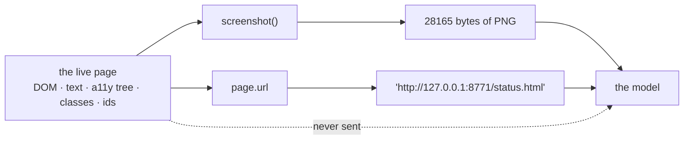

# 1.2 — Pixels and a URL

## One-line answer

`current_state()` hands the model **two** things — a screenshot and a URL — and nothing else: no
HTML, no text, no accessibility tree, so every fact the model has about the page is one it recovered
from an image, and on this day's status page that image is **28 165 bytes** of PNG.

## The story

You are renting a flat and the landlord agrees to send the agreement before you sign. What arrives
on your phone is not a document. It is eleven photographs of a document, taken at an angle, on his
desk, with his thumb in two of them.

You can read it. That is not the problem. The problem is everything you would normally do with an
agreement and now cannot: you cannot search it for the word "deposit", you cannot copy the account
number into your banking app, you cannot check that the number on page four is the same number as
the one on page one without scrolling back and forth between two photographs and holding both in
your head.

So you retype the account number by hand, and you get one digit wrong, because in his handwriting a
1 and a 7 are the same mark with a different mood.

Two more things went missing and you do not notice either of them for a week. The last photograph
cuts off about two centimetres from the bottom of the page, so the clause that continues onto the
next line is simply not in your possession. And the original has some lines marked in yellow
highlighter, which in his kitchen light photographed as slightly-warmer white — so the parts he
wanted you to pay attention to arrived looking exactly like the parts he did not.

What you do have, for free and perfectly reliably, is which flat this is about. He said so in the
message. The *address* came through as text. The *content* came through as pictures.

## The idea in plain language

Three terms first, because the rest of this part is subtraction and you need to know what is being
subtracted.

- The **DOM** — the Document Object Model — is the browser's live, structured version of a page: a
  tree of elements, each with its tag, its classes, its id, its text and its position. It is what
  [1.1](1.1-the-page-with-no-json.md) showed you when it printed `id="incident-title"`, and it is
  what a scraper reads.
- The **text layer** is the plain words of the page with the markup stripped out — what you get when
  you select everything and copy.
- The **accessibility tree** is a second structured view that browsers build for screen readers:
  every control with its role ("button", "link", "heading") and its label. It exists precisely so
  that software can understand a page without looking at it.

All three of those are sitting in the browser at the moment the agent acts. **Computer use uses none
of them.**

What it uses is a **screenshot**: an image of the browser's visible area, encoded as PNG, handed
over as raw bytes. Plus the **URL**, which is a string. That pair is the whole input side of the
interface, and this part exists to make you feel how small it is.

Two consequences follow immediately, and they run through the rest of the day.

**Everything is recovered, nothing is read.** The model does not *know* the incident headline; it
looks at a rectangle of pixels and forms a belief about what letters are in it. That is a different
kind of operation from `element.text`, with a different kind of failure: an HTML selector either
matches or raises, while an image is always readable and sometimes read wrong.

**Position is the only handle there is.** With a DOM you say "click the element with
`id="history-link"`". With pixels you say "click at (74, 512)", because a coordinate is the only way
to point at something in an image. Everything about section 2's action loop follows from that
sentence.

The URL is worth pausing on, because it is the exception and the day leans on it. It is the one piece
of the model's input that is **structured, exact and not inferred**. `http://127.0.0.1:8771/status.html`
is a fact, not a guess — and being a fact is what lets a sandbox make a decision about it, which is
where section 3 lives. The landlord's message told you which flat, in words. The rest was
photographs.

## Why Sutra needs it

Every number this day measures is a number about that pair.

Section 2 drives the page and each step of the loop is *look at the screenshot, decide, act, look
again* — so the size of the screenshot is the size of the loop's fuel bill.
[1.3](1.3-fifteen-doors-one-used.md) counts the actions the model is offered, and the reason there
are so many of them is that pixel-driving needs a full vocabulary of physical gestures where a DOM
needed one selector. Sections 3 and 4 build a door that decides what may be reached, and the only
argument that door gets to inspect on a navigation is the URL — the one part of the model's world
that is a string rather than a picture.

It also settles the design question the desk will face in Phase 14. Any part of Sutra that reaches
for a browser is buying a per-step image cost, and that is a budget line —
[Day 24's 3.1](../../../day-24-token-accounting-and-budgets/parts/03-counting-before-spending/3.1-the-ledger.md)
built the ledger this desk counts tokens in — not a rounding error.

## The mechanism

Start with the type, because it settles the argument in one line. `ComputerState` is the object
`current_state()` returns, and you can ask it what it holds:

```bash
uv run python -c "from google.adk.tools.computer_use.base_computer import ComputerState;
print(list(ComputerState.model_fields))"
```

**Line by line:**

- `ComputerState` lives in `google.adk.tools.computer_use.base_computer`, the module that also
  defines `BaseComputer`. Verified against the installed `google-adk` 2.7.1 and the ADK computer-use
  page, <https://adk.dev/integrations/computer-use/>, checked on 2026-09-06.
- `model_fields` is pydantic's own map of the fields a model declares. Asking the class rather than
  reading the docs is the point: this is the type as installed, not the type as remembered.
- `list(...)` prints just the names. There are two of them, and the whole of this part is that
  sentence.

Measured on 2026-09-06:

```text
['screenshot', 'url']
```

The declarations behind those two names, read from the installed package, are
`screenshot: bytes` and `url: Optional[str]` — the PNG as raw bytes, and the address as a string
that is allowed to be absent. That is the entire contract.

Now the method that fills it, verbatim from `lab/_computer.py`. It is a method on `SiteComputer`,
so it is indented here exactly as it is in the file:

```python
    async def current_state(self) -> ComputerState:
        """A screenshot and the current URL - everything the model gets to see.

        This is the whole input side of computer use, and it is worth staring at: no DOM, no text
        layer, no accessibility tree. Pixels and a URL.
        """
        shot = await self._page.screenshot()
        return ComputerState(screenshot=shot, url=self._page.url)
```

**Line by line:**

- `async def` — `BaseComputer`'s methods are coroutines because the runtime awaits them, which is
  why `_computer.py` uses Playwright's **async** API rather than its synchronous one. Mixing the two
  is a common first-day mistake and produces an event-loop error rather than a browser.
- `self._page` is the Playwright page object, created in `initialize()`. It is the live browser: at
  this moment it holds the DOM, the text, the accessibility tree, the cookies and the history.
- `await self._page.screenshot()` throws all of that away and returns bytes. Note what is **not**
  passed: `full_page=True`. Playwright's default captures the **viewport** — the visible rectangle —
  and not the whole scrollable document, which is the failure *When it breaks* measures below.
- `self._page.url` is read straight off the page rather than remembered from the last `navigate()`
  call, and that difference matters more than it looks: if the site issued a redirect, the URL the
  model is told about is where the browser **actually ended up**, not where it was aimed. A sandbox
  that checked the requested URL and reported the arrived-at one would be checking the wrong string.
- `ComputerState(screenshot=shot, url=...)` constructs the object with both fields. There is no
  third argument to pass. If you wanted to hand the model the page title, or the visible text, or a
  list of the links, there is nowhere to put it.

`lab/look.py` opens both pages of the fixture and prints what came back:

```bash
uv run python days/day-71-computer-use-and-the-sandbox/lab/look.py --both 2>/dev/null
```

**Line by line:**

- `look.py` starts the fixture server with `_site.serving()`, drives a real headless Chromium through
  `SiteComputer`, calls `navigate()` for each path and records `len(state.screenshot)` and
  `state.url`. Nothing is simulated: this is the same class the agent will use in section 2.
- `--both` adds `/history.html` to the list, so there are two rows to compare rather than one number
  to take on trust.
- `2>/dev/null` discards standard error, and you should know exactly what you are discarding before
  you make a habit of it — see the warning below, which is a fact about this feature you must not
  miss.

Measured on 2026-09-06:

```text
viewport 1280x936

  page              screenshot bytes   url the model sees
  /status.html                 28165   http://127.0.0.1:8771/status.html
  /history.html                14323   http://127.0.0.1:8771/history.html

  what current_state() returns: screenshot (bytes), url (str)
  what it does not return: the DOM, the text, the headings, the table, the link targets
```

Now do the subtraction, slowly, because this is the whole part.

The status page is a heading bar, one red banner with a title and three sentences, a table with a
header row and four data rows, one link and a footer line. As markup it is well under two thousand
bytes and every element in it is labelled. As the thing the model receives it is **28 165 bytes of
PNG**, from which the model's entire job is to work out that Object Storage in eu-west is degraded
and that uploads are affected while reads are not.

The history page is the control. It has less on it — a heading and two list items — and it comes to
**14 323 bytes**. The bytes track how much ink is on the screen, not how much meaning is on the page,
which is the clearest possible statement that this channel does not know what a page *is*.

And in both rows, the only exact thing is on the right: the URL, in text, unambiguous.



One more thing you will see the moment you run any script in this day without discarding standard
error. Computer use is not a settled part of ADK, and ADK says so on every run:

```text
C:\Users\nisha_gnzw\OneDrive\Desktop\Projects\sutra\.venv\Lib\site-packages\google\adk\features\_feature_decorator.py:72: UserWarning: [EXPERIMENTAL] feature FeatureName.COMPUTER_USE is enabled.
  check_feature_enabled()
```

That is a `UserWarning` raised by ADK's own feature decorator, and it is telling you the truth: the
computer-use toolset is **Preview**. ADK's integration page says it in words —
*"The Computer Use model and tool is a Preview release"* (<https://adk.dev/integrations/computer-use/>,
checked on 2026-09-06). Preview means the interface may change under you between releases, so the
version pin in `docs/PACKAGES.md` is not a formality here, and *"we built our incident workflow on a
preview feature"* is a sentence somebody will have to say out loud in a review. The commands in this
day append `2>/dev/null` so that a measured table is not buried in warnings — not because the
warning is noise.

## When it breaks

**The thing you need is below the fold.** The screenshot is the viewport, so anything further down
the page does not exist as far as the model is concerned — and, worse, the model cannot tell the
difference between "not on this page" and "not on this screen". You can measure the boundary
directly by shrinking the window and asking for the same page:

```bash
uv run python -c "
import asyncio
import _computer
from _computer import SiteComputer, Trace
from _site import serving


async def shot(base, size):
    _computer.SCREEN = size
    c = SiteComputer(base, Trace())
    await c.initialize()
    try:
        state = await c.navigate(f'{base}/status.html')
        return len(state.screenshot)
    finally:
        await c.close()


with serving() as base:
    for size in [(1280, 936), (1280, 240)]:
        n = asyncio.run(shot(base, size))
        print(f'viewport {size[0]}x{size[1]}  ->  {n} screenshot bytes')
"
```

Run it from inside `days/day-71-computer-use-and-the-sandbox/lab/`. It sets the module-level
viewport constant before building the computer, so nothing in the lab is edited. Measured on
2026-09-06:

```text
viewport 1280x936  ->  28165 screenshot bytes
viewport 1280x240  ->  11922 screenshot bytes
```

The page did not change. The document is identical, the incident is identical, the table is
identical. The evidence handed to the model dropped by more than half, because a screenshot is a
photograph of a window and not a copy of a page — the landlord's last photograph, cut off two
centimetres from the bottom. The fix is that the model must **scroll and look again**, which is one
of the fifteen actions [1.3](1.3-fifteen-doors-one-used.md) counts, and it is a fix that costs
another screenshot every time it is used.

**The characters are read wrongly.** There is no error for this. A rendered `1` and a rendered `7`
in a condensed font at small size, an `l` against a `1`, a `0` against an `O`, a table cell whose
text is clipped with an ellipsis — each of these produces a confident, well-formatted, wrong answer,
and it is your ticket reference or your account number that is wrong. Note the asymmetry against the
scraper: a selector that stops matching **raises**, and you find out. A misread digit **returns**,
and you find out later, from a customer.

**The status is a colour.** This is the one to look at hardest, because the fixture was built to
carry it. Here are two rows of the table, verbatim from `lab/site/status.html`:

```html
    <tr><td>Object Storage</td><td>eu-west</td><td class="bad" id="s-obj-euw">Degraded</td></tr>
    <tr><td>Object Storage</td><td>us-east</td><td class="ok">Operational</td></tr>
```

A scraper does not read colours. It asks for `.bad` and gets the degraded row, deterministically,
in every theme, at every window size, for a colour-blind user and a screen reader alike. The model
gets red text and green text and has to notice which is which.

This fixture is being kind, because it also writes the words `Degraded` and `Operational` next to
the colour. Real dashboards frequently do not: a green dot, an amber dot and a red dot in a column
with no words at all is an extremely common design, and it is a design that is perfectly clear to a
person with normal colour vision, invisible to a screen reader, and a coin toss for a model looking
at a compressed screenshot. When you find yourself telling a model *"red means degraded"* in a
prompt, you have discovered that the page's only encoding of its most important fact is a colour.

## In production

**The cost is an image, on every single step.** This is the number that decides whether a
browser agent is affordable, so do the arithmetic honestly. Gemini charges images by tiles: an image
with both sides at 384 pixels or less costs 258 tokens, and *"larger images are tiled into 768x768
pixel tiles, each costing 258 tokens"* (<https://ai.google.dev/gemini-api/docs/image-understanding>,
checked on 2026-09-06). The viewport in this lab is 1280×936, which exceeds 768 in **both**
directions, so a single screenshot is a multiple of 258 tokens before the model has read a word of
your prompt. Then the loop: look, decide, act, look again. A task that takes a person six clicks is
six of those images, each one sent *in addition to* the growing conversation behind it.

**What degrades at scale.** The image cost does not stay flat as the task gets longer — it
compounds, because each turn's screenshot joins the history that every later turn carries. Twenty
steps is not twenty images; it is twenty images accumulating in a context that is re-sent each time,
unless somebody has deliberately dropped the older ones. That is
[Day 20's 1.2](../../../day-20-context-engineering-compaction/parts/01-notes-not-transcript/1.2-summaries-are-lossy.md)
— compaction is lossy — with the most expensive possible payload, and the first mitigation everybody
reaches for — keep only the latest screenshot — quietly removes the agent's ability to notice that
the page did not change after it clicked.

**The failure that only appears with real traffic.** Your test page renders instantly, so the
screenshot always shows the finished page. A real page shows a spinner, a skeleton loader, or a
half-drawn table for as long as its slowest request takes, and `screenshot()` is perfectly happy to
capture that. The model then reasons carefully about a loading placeholder and reports that the
status is unknown. There is no error anywhere in that sequence, and the fix — wait, look again — is
another image and another turn.

**The review comment a senior engineer leaves:** *"What is the per-step token cost of this loop, and
what is the step cap? A screenshot of a 1280×936 viewport is several image tiles, we send one per
turn, and the history keeps them. Put a number on a typical run and a hard ceiling on the number of
steps before this goes anywhere near the ticket queue. And when you get a wrong reading, log the
screenshot — otherwise the bug report is 'it said the wrong thing' with no evidence."*

**The interview question:** *"What does a computer-use model actually receive?"* The answer that
shows you have used it: *"A screenshot and a URL. That is genuinely all — no DOM, no text layer, no
accessibility tree. I measured it on a two-page fixture: the status page came back as 28 165 bytes
of PNG and the URL as a string, and the same page in a shorter viewport came back as 11 922 bytes,
which is the part people miss — the screenshot is the visible window, not the document, so anything
below the fold has to be scrolled into view and photographed again. It changes how you think about
cost and about reliability at the same time: every step carries an image, and every fact is
recovered by reading pixels rather than by selecting an element, so failures come back as confident
wrong answers instead of exceptions."*

## Check yourself

```bash
uv run python days/day-71-computer-use-and-the-sandbox/lab/look.py --both 2>/dev/null
```

Now run it once more **without** `2>/dev/null` and read the warning ADK prints. Then open
`lab/_computer.py` and find the one line in `current_state` that decides how much of the page is
captured.

**Out loud, without scrolling up:** name the two fields of `ComputerState` and say what each one is
worth to a sandbox. Then say why a status shown only as a coloured dot is harder for a model than
for a scraper, and what that tells you about which pages are safe to drive.

**Next:** [1.3 — Fifteen doors, one used](1.3-fifteen-doors-one-used.md).
