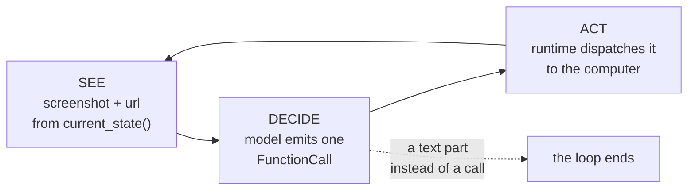

# 2.1 — See, decide, act

## One-line answer

Computer use is the loop you already hand-rolled on Day 3, with exactly one substitution: the
observation that comes back after each action is a **screenshot** rather than a line of text — look
at the screen, choose one action, take it, look again.

## The story

There is water under the kitchen sink and you do not know why. So you ring somebody who does, and
they answer on video.

You lie on the floor with the phone in one hand. He is on the other end of the call, twenty miles
away, and the only thing he has is whatever your camera happens to be pointed at.

"Show me the pipe on the left." You move the phone. He looks for a moment. "There is a grey ring
there. Turn it towards you, half a turn." You put the phone down on the tiles, turn the ring, pick
the phone back up. "Show me again."

Notice what that conversation is not. He does not get the room. He gets one photograph at a time, of
whatever you aimed at. He does not give you a list of six things to do while he waits; he gives you
one, and then he wants to see. And his hands are never in your cupboard — yours are. He can only
ever ask.

Notice also how it ends. It ends because at some point he says *"that's it, you're done."* If he
never says it, you are still lying on the tiles holding a phone.

## The idea in plain language

An **agent** is a loop wrapped around a model that can only produce text. Day 3 built that loop by
hand and called the two halves the navigator and the driver:
[Day 3's 1.1](../../../day-03-loop-hand-rolled/parts/01-loop-anatomy/1.1-the-navigator-and-the-driver.md)
is where the shape is defined, and
[Day 3's 4.1](../../../day-03-loop-hand-rolled/parts/04-running-the-loop/4.1-assembling-the-loop.md)
is where the twenty lines of it are assembled. The three beats are:

1. **See.** Everything known so far is put in front of the model as its input.
2. **Decide.** The model replies with *one proposed action* — a tool name and its arguments. It has
   not done anything; it has asked.
3. **Act.** Your code runs that action, takes the result, and appends the result to the input. Then
   beat 1 happens again with the result included.

That pattern has a name in the literature — a **ReAct-style loop**, reason and act interleaved — and
[Day 3's paper document](../../../day-03-loop-hand-rolled/papers/01-react.md) is where this
curriculum teaches it.

**Computer use changes exactly one item on that list, and it is item 3's result.** On Day 3, running
a tool produced a string: you called a search function and got back a paragraph of text. Here,
running `click_at` produces a **PNG of the entire browser window plus the URL that is now in the
address bar**. That is the whole substitution. The model still cannot touch anything, still proposes
one action at a time, still gets told what happened before it proposes the next one.

Which is worth saying plainly, because computer use is usually presented as a new kind of thing. It
is not a new kind of thing. It is the loop from Day 3 with a photograph where the sentence used to
be, and naming it that way is what makes everything else in this day ordinary rather than magical —
including the parts where you have to stop it.



## Why Sutra needs it

[1.3](../01-no-api/1.3-fifteen-doors-one-used.md) established the situation Sutra's desk is actually
in: the vendor's status page carries the incident text a ticket needs, and there is no API behind it
to ask instead. A browser is the only way in.

The moment you accept that, this loop is the thing you are running, and every remaining question in
this day is a question about one of its three beats. Section 3's door sits between *decide* and
*act*, and it can only sit there because those are two separate beats — the model proposing and the
runtime dispatching are not the same event, and something can stand in the gap. Section 4's sandbox
is a set of rules about which actions beat 3 is allowed to carry out at all.

So this part is the frame the rest of the day hangs on. A reader who cannot say where the door goes
cannot review the door.

## The mechanism

ADK ships the loop. You supply two things: a **model**, and a **computer** — an implementation of
`BaseComputer` whose methods are the actions the model may propose. `ComputerUseToolset` turns that
computer into the tool declarations the model sees. Verified against
<https://adk.dev/integrations/computer-use/>, checked on 2026-09-06, which is also explicit about
how finished this surface is:

> The Computer Use model and tool is a Preview release.

That sentence matters for the same reason a version pin does. Preview means the shape can move, so
everything this day measures is measured against `google-adk==2.7.1` and dated, rather than
remembered.

**One component in this lab is simulated, and it is not the one you would guess.** The browser is a
real Chromium. The page is served over real HTTP. `SiteComputer` is a real `BaseComputer`, the
toolset is a real `ComputerUseToolset`, and the run goes through a real `Runner`. The **model** is
the fake. `lab/_fake.py` gives two reasons for that, and both of them are load-bearing:

- **Cost.** Addendum 02 makes quota the currency of this curriculum. A computer-use loop takes a
  screenshot every single step and sends it, so a day of experiments here would be the most
  expensive day in the whole plan by a wide margin.
- **Reproducibility.** A real model picks its own coordinates. Run the same script twice and you get
  two different traces, and then nothing in section 4 can be *measured* — only described. With a
  scripted model the question stops being "what did the model decide" and becomes "what did the door
  do about it", which is the question this day is actually asking.

Say that out loud before reading any number in this day: **the browser is real, the toolset is real,
the runtime is real, the model is scripted.** A reader who thinks the whole thing is a simulation
has no reason to believe section 3's measurements, and they should believe them.

Here is the model, in full, from `lab/_fake.py`:

```python
    async def generate_content_async(
        self, llm_request: LlmRequest, stream: bool = False
    ) -> AsyncGenerator[LlmResponse, None]:
        if not ScriptedActor.offered:
            # The runtime puts every declared tool in `tools_dict` on the request. Reading it here
            # is how this day learns the attack surface from the framework instead of from a guess.
            ScriptedActor.offered = sorted(llm_request.tools_dict or {})
        if self.step < len(self.script):
            name, args = self.script[self.step]
            self.step += 1
            call = types.Part(function_call=types.FunctionCall(name=name, args=args))
            yield LlmResponse(content=types.Content(role="model", parts=[call]))
            return
        text = "done"
        yield LlmResponse(content=types.Content(role="model", parts=[types.Part(text=text)]))
```

**Line by line:**

- `generate_content_async` is the one method a `BaseLlm` has to provide. Because `ScriptedActor`
  subclasses `BaseLlm` rather than pretending to be a model from the outside, the runtime treats it
  as one in every respect: it hands it the real `LlmRequest`, with the real tool declarations the
  toolset generated, and it dispatches whatever comes back. Nothing here is intercepted or patched.
- It is an `AsyncGenerator` and the body `yield`s rather than `return`s, because the runtime
  consumes model output as a stream. One `yield` is a complete non-streamed reply, which is all a
  scripted model needs.
- `llm_request.tools_dict` is the request's map of every tool the runtime declared to the model.
  Reading it on the first turn is how the run below learns the action surface from the framework
  instead of from a guess.
- `if self.step < len(self.script)` is beat 2 of the loop, and the important word is **one**. Each
  call to this method serves exactly one entry of the script and increments the counter. It never
  yields two actions at once, because the whole point of the loop is that the model does not get to
  plan ahead of what it has seen.
- `types.Part(function_call=types.FunctionCall(name=name, args=args))` is what "deciding" physically
  is: a part of the reply that is not text but a **named function and its arguments**. `name` has to
  match a declared tool exactly — *When it breaks* below is what happens when it does not.
- `yield ...; return` ends this turn. The runtime now runs the action, appends the result to the
  conversation, and calls this method again. `self.step` has moved on, so the next call serves the
  next action. That is beat 3 handing control back to beat 1.
- The final `yield` — a **text** part rather than a function call — is beat 2 saying *that's it,
  you're done*. This is the loop's termination condition, and it is a decision the model makes. Hold
  on to that, because *In production* is about what happens when nobody else gets a vote.

Now the substitution itself. When an action finishes, the toolset has to turn what the computer
returned into something the model can be shown. From `computer_use_tool.py` in the installed
`google-adk==2.7.1`:

> Quoted verbatim from the installed `google-adk==2.7.1`. The two-space indentation is that
> project's own style, so the block is tagged `text` rather than `python` to keep it exact.

```text
      response = result
      if isinstance(result, ComputerState):
        response = {
            "image": {
                "mimetype": "image/png",
                "data": base64.b64encode(result.screenshot).decode("utf-8"),
            },
            "url": result.url,
        }
```

**Line by line:**

- The indentation is two spaces because this is ADK's own source, copied as it is on disk rather
  than reformatted. Reading the installed file is the only honest way to know what a Preview surface
  does today.
- `result` is whatever your `BaseComputer` method returned. Every action in `lab/_computer.py` ends
  with `return await self.current_state()`, so `result` is a `ComputerState`.
- `isinstance(result, ComputerState)` is the branch that makes computer use different from every
  other tool in ADK. A normal function tool's return value is passed along as it is; a
  `ComputerState` is unpacked into an image and a URL.
- `base64.b64encode(result.screenshot).decode("utf-8")` is the screenshot going into the
  conversation as text-encoded bytes, tagged `image/png` so the model reads it as a picture.
- `"url": result.url` is the only structured fact that travels with it. Not the DOM, not the page
  text, not the link targets — a picture and an address.
- **This dictionary is the tool result.** On Day 3 a tool result was a sentence you appended to a
  transcript. Here it is this. That is the whole of what "a screenshot in place of a tool result"
  means, and it is nine lines of framework code.

### The run

`lab/surface.py` drives one turn of the loop and prints both halves of it: what the runtime offered
the model, and what the computer was actually asked to do.

```bash
uv run python days/day-71-computer-use-and-the-sandbox/lab/surface.py 2>/dev/null
```

**Line by line:**

- Run from the repo root. The script adds its own directory to the import path the way any Python
  script does, so `from _computer import ...` resolves to its sibling in `lab/`.
- `2>/dev/null` discards standard error, which is not empty here: enabling the feature prints
  `UserWarning: [EXPERIMENTAL] feature FeatureName.COMPUTER_USE is enabled.`, and the runtime adds a
  `Skipping missing token usage metadata` note per turn because a scripted model reports no token
  counts. Neither is a failure, and both would bury a four-line measurement.

Measured on 2026-09-06:

```text
tools the runtime declared to the model: 15
  click_at
  current_state
  drag_and_drop
  go_back
  go_forward
  hover_at
  initialize
  key_combination
  navigate
  open_web_browser
  scroll_at
  scroll_document
  search
  type_text_at
  wait

actions the computer was actually asked for this run:
  navigate           http://127.0.0.1:8771/status.html

  declared 15, used 1
  the sandbox has to have an answer for all of the first number, not the second
```

Read that as one turn of the loop, because that is what it is. The model was shown fifteen possible
actions. It chose one — `navigate` — and the runtime dispatched it to the computer, which is the row
in the second block. `navigate` in `lab/_computer.py` ends by calling `current_state()`, so the
result that went back into the conversation was a fresh screenshot of the page that had just loaded.
Then the loop came round again, the script was exhausted, the model emitted the text `done`, and the
run ended.

One action, one look, one decision, one action. The fact that only one of the fifteen was used is
the sentence the script closes on, and it is section 3's problem rather than this part's.

## When it breaks

The two halves of "decide" and "act" are joined by a **name**, and a name is a string. If the model
proposes a function that was never declared, the two halves come apart.

You can produce that on purpose. The scripted model will emit any name you give it, which is exactly
what a real model does when it invents a plausible-sounding action:

```bash
cd days/day-71-computer-use-and-the-sandbox/lab
uv run python -c "
import asyncio
from _computer import SiteComputer, Trace
from _fake import agent_with, drive, reset
from _site import serving
from google.adk.tools.computer_use.computer_use_toolset import ComputerUseToolset

async def run(base):
    computer = SiteComputer(base, Trace())
    toolset = ComputerUseToolset(computer=computer, allow_private_network_access=True)
    agent = agent_with(toolset, [('click_link', {'text': 'Past incidents'})])
    try:
        await drive(agent)
    finally:
        await computer.close()

reset()
with serving() as base:
    asyncio.run(run(base))
"
```

Measured on 2026-09-06, the end of the traceback:

```traceback
  File "C:\Users\nisha_gnzw\OneDrive\Desktop\Projects\sutra\.venv\Lib\site-packages\google\adk\flows\llm_flows\functions.py", line 1223, in _get_tool
    raise ValueError(error_msg)
ValueError: Tool 'click_link' not found.
Available tools: click_at, current_state, drag_and_drop, go_back, go_forward, hover_at, initialize, key_combination, navigate, open_web_browser, scroll_at, scroll_document, search, type_text_at, wait

Possible causes:
  1. LLM hallucinated the function name - review agent instruction clarity
  2. Tool not registered - verify agent.tools list
  3. Name mismatch - check for typos

Suggested fixes:
  - Review agent instruction to ensure tool usage is clear
  - Verify tool is included in agent.tools list
  - Check for typos in function name
```

`click_link` is not an action a browser computer has, and it is the single most natural thing for a
model to ask for. There is no such beat in this loop: you cannot say "click the link that says Past
incidents", because the model was never given the link — it was given a picture, which is
[1.2](../01-no-api/1.2-pixels-and-a-url.md)'s whole subject. The only way to
reach that link is to work out where it is on the screen and ask for `click_at` with two numbers,
which is [2.2](2.2-the-coordinates-are-not-your-pixels.md)'s subject and is harder than it sounds.

Two things to take from the error rather than from the fix.

**The runtime raises rather than continuing.** The bad name is not turned into an observation the
model could recover from; the run stops. That is the opposite of the choice
[Day 3's 2.3](../../../day-03-loop-hand-rolled/parts/02-tools-and-dispatch/2.3-a-failed-tool-is-an-observation.md)
made for a *failed* tool, and the distinction is worth holding: a tool that ran and failed produces
information, while a tool that does not exist produces nothing to say.

**`Available tools:` lists all fifteen.** ADK prints the surface in the error message, which is a
convenience here and a fact worth noticing. The list is not a subset of what this agent needs; it is
everything the computer can do, offered on every turn.

## In production

**The termination condition is the thing to look at first, and in this lab it belongs to the
model.** Read the last `yield` in `ScriptedActor` again: the loop ends when the model chooses to
emit text instead of a function call. That is fine when the model is a fixed list of five actions.
It is not fine anywhere else, because the component deciding whether to keep going is the component
that might be wrong — which is exactly the argument
[Day 3's 5.1](../../../day-03-loop-hand-rolled/parts/05-containment/5.1-the-step-budget.md) made for
a step budget enforced by a `for` over a range that nothing in the body can extend.

Without a second opinion, a computer-use loop does not fail loudly. It keeps looking. A page that
did not change because the click landed on nothing looks, to the model, exactly like a page it has
not finished reading, so it clicks again, and screenshots again. This is
[Day 59's 1.2](../../../day-59-runaway-agents-contained/parts/01-four-runaways/1.2-the-critic-who-is-never-satisfied.md)
wearing a browser: a loop with no external cap, going round on a condition that will never be met.
The cap itself is
[Day 59's 2.2](../../../day-59-runaway-agents-contained/parts/02-where-a-brake-goes/2.2-the-loop-counter.md),
including the ordering rule that makes it hold — the counter is consulted **before** the quality
question, so that it still works on the run where the quality question is what broke.

**What that costs here is unlike anything earlier in the curriculum**, and it is the reason to fit
the cap on the first day rather than the tenth. Every single turn of this loop sends a full-page
screenshot. The status page in this lab measures 28165 bytes as a PNG — the figure is measured in
[2.3](2.3-a-site-you-own.md) — and base64 encoding adds about a third on top of that before it
becomes tokens. A text loop that goes round fifty times too many is
an annoyance on the bill. A screenshot loop that goes round fifty times too many is fifty full-page
images, and it will empty a free-tier day's quota without ever producing an answer. Addendum 02 is
not a style preference on this day.

**What degrades at scale** is the observation itself, in a way a small fixture hides. The two pages
here fit in one viewport, so one screenshot is the whole page. A real vendor status page during a
real incident is longer than the window, which means the model sees the top of it, must ask to
scroll, and gets another screenshot — and the loop's length is now a function of how much bad news
there is that day. The number of turns is not a property of your agent; it is a property of
somebody else's page, on the worst morning of their quarter.

**The review comment a senior engineer leaves:** *"This is the Day 3 loop and I'm glad it's written
that way, but the only thing that ends it is the model deciding to stop, and the model is the part I
trust least. Put a hard turn cap on the Runner, checked before anything else, and log the turn count
and the cumulative screenshot bytes per run. If a run hits the cap I want the trace to say so
explicitly rather than the run just ending — a silent stop and a successful stop have to look
different in the logs, because on this loop they cost the same and mean opposite things."*

**The interview question:** *"How does a computer-use agent actually work — what is the model
receiving?"* An answer that has run one: *"It is an ordinary reason-and-act loop and the only new
thing is the observation. Each turn the model gets a screenshot of the browser plus the current URL
— in ADK that is a `ComputerState`, and the toolset base64-encodes the PNG into the tool
result — and it replies with exactly one function call from a fixed action set. In the version I
built, the runtime declared fifteen actions: navigate, click_at, type_text_at, scroll, drag and so on. The
model never touches the browser; it asks, and the runtime dispatches. Two things surprised me. The
first is that there is no DOM and no text layer at all, so 'click the Past incidents link' is not an
action that exists — you get click_at with two coordinates or nothing. The second is that the loop
ends when the model emits text instead of a call, which means by default your stop condition is the
model's opinion. I cap the turns outside the agent and check the cap first, because on this loop
every extra turn is a whole screenshot, and a runaway costs image tokens rather than a few
sentences."*

## Check yourself

```bash
uv run python days/day-71-computer-use-and-the-sandbox/lab/surface.py 2>/dev/null
```

Look at the two numbers on the last line, `declared 15, used 1`. Now change the script in
`lab/surface.py` from one action to three of your own choosing, run it again, and say which of the
two numbers moved and why the other one could not have.

Then answer this from the trace rather than from memory: between the model emitting `navigate` and
the browser going anywhere, how many separate things happened, and which one of them is the place a
rule could be enforced?

**Out loud, without scrolling up:** name the three beats of the loop, and say what is different
about beat 3's result here compared with the loop you built on Day 3.

**Next:** [2.2 — The coordinates are not your pixels](2.2-the-coordinates-are-not-your-pixels.md).
