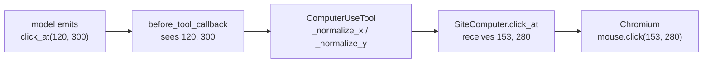

# 2.2 — The coordinates are not your pixels

## One-line answer

The model always works in a fixed 1000 by 1000 space and ADK silently rescales every `x` and `y` to
your real window before your computer ever sees them — so the numbers in your trace are not the
numbers the model emitted, and a sandbox rule written about pixels has to say **which** pixels.

## The story

Your first day in a country whose money you have never handled. A friend who has been here before is
showing you round, and he does something helpful that turns out to be a problem.

Everything he tells you, he converts. The menu says 480 and he says *"that's about a hundred and
sixty back home."* The meter says 750 and he says *"two fifty."* He is quick, he is right, and after
an hour you have stopped reading the prices at all. You are just listening to him.

Then, at the table, the three of you agree a rule for the trip out loud: **nobody spends more than
2000 on a meal.**

Stop on that number, because it is useless and it is not obviously useless. Two thousand in the
money printed on the menu is an ordinary dinner. Two thousand back home is a dinner none of you
would ever buy. One person at that table is thinking in the currency on the menu; another is
thinking in the currency their friend has been quoting all day. Both of them will follow the rule
carefully. They will be following two different rules.

## The idea in plain language

A **coordinate** is a pair of numbers saying where on the screen something is: `x` across, `y` down,
counted from the top-left corner. `click_at(x=120, y=300)` means *press the mouse there*.

The question this part is about is: **there, on what?**

The model is looking at a picture. It has no idea how big your browser window is, and it would be a
bad design if it did — the same agent has to work on a laptop, on a phone-shaped window and on a
wall-sized display, and a model that had to be told the pixel dimensions would have to be retrained
or re-prompted for every one of them. So computer use solves it the way your friend does at the
table. The model always quotes in **one fixed currency**, whatever country it is standing in, and
somebody in the middle quietly converts before the number is spent.

That fixed currency has a name: a **virtual coordinate space**, 1000 by 1000 in ADK by default. The
model always answers as though it were pointing at a square screen 1000 pixels on a side, whatever
your window really is, and the conversion happens between the model's reply and your computer's
method. The conversion is called **normalisation**, and the file it lives in is ADK's, not yours.

Two consequences follow immediately, and the whole part is these two.

**Your computer's methods never receive what the model said.** `SiteComputer.click_at` in
`lab/_computer.py` is handed numbers that have already been through the converter. It records its
arguments into the `Trace` — so what your log holds is the converted figure, the one your friend
quoted, and not the one printed on the menu.

**Anything standing between the model and the tool receives the other set.** A check that runs
*before* the tool reads the menu price. So a rule about coordinates is written in one of two spaces,
and which one depends entirely on where the rule sits.



## Why Sutra needs it

Because section 3's door is the box in the middle of that diagram, and it is on the left-hand side
of the converter.

[3.1](../03-the-door/3.1-the-check-outside-every-tool.md) puts a check outside every tool, in a
plugin hook that runs before the tool does. Every rule Sutra writes there about *where* the agent
may click is therefore a rule in the model's 1000 by 1000 space, and every number the computer's own
trace shows is in the window's space. Both numbers are true, they are never equal, and the day the
two get confused is the day a sandbox rule stops meaning what its author thought.

This is also the smaller, more concrete version of a thing Sutra has met before.
[Day 34's 2.3](../../../day-34-building-sutra-mcp-tools/parts/02-function-to-declaration/2.3-the-argument-that-changed-on-the-way-in.md)
was about an argument that changed shape on its way into a tool. This is the same failure with two
numbers and a multiplication, in the one place where the argument is also a **security** control.

## The mechanism

The converter is nine lines. From `computer_use_tool.py` in the installed `google-adk==2.7.1`, at
`.venv/Lib/site-packages/google/adk/tools/computer_use/computer_use_tool.py`, read on 2026-09-06:

> Quoted verbatim from the installed `google-adk==2.7.1`. The two-space indentation is that
> project's own style, so the block is tagged `text` rather than `python` to keep it exact.

```text
  def _normalize_x(self, x: int) -> int:
    """Normalize x coordinate from virtual screen space to actual screen width."""
    if not isinstance(x, (int, float)):
      raise ValueError(f"x coordinate must be numeric, got {type(x)}")

    normalized = int(x / self._coordinate_space[0] * self._screen_size[0])
    # Clamp to screen bounds
    return max(0, min(normalized, self._screen_size[0] - 1))
```

**Line by line:**

- Two-space indentation, because this is ADK's own source copied as it sits on disk. The surface is
  a Preview release — <https://adk.dev/integrations/computer-use/>, checked on 2026-09-06 — so
  reading the installed file is the only honest way to know what it does today, and the version is
  named beside the quote for the same reason a package pin gets a dated row.
- `_normalize_x` has a leading underscore: it is private. You are not meant to call it and this part
  does not suggest you should. You are meant to **know it ran**, which is a different thing, and the
  reason to read it is that its effect is visible in your logs whether you know about it or not.
- `if not isinstance(x, (int, float))` is a type guard, and it raises rather than coercing. A string
  `"120"` is not quietly turned into `120`. *When it breaks* below triggers this one for real.
- `x / self._coordinate_space[0] * self._screen_size[0]` is the whole conversion: divide by the
  imaginary width to get a fraction of the way across, multiply by the real width. Both values come
  from the constructor — `virtual_screen_size` defaults to `(1000, 1000)` and `screen_size` is what
  the toolset was given.
- `int(...)` truncates rather than rounds. That is a downward bias of up to one pixel, which never
  matters for a click on a button and matters a great deal if you are ever tempted to compare a
  recorded coordinate against an expected one for equality.
- `max(0, min(normalized, self._screen_size[0] - 1))` **clamps**. A coordinate outside the virtual
  square does not raise and does not get dropped; it is pulled to the nearest edge of the real
  window. So an out-of-range request from the model is not an error you will see — it is a click on
  the border, and the sandbox reasoning in section 4 has to account for the fact that a nonsense
  coordinate still lands somewhere.

`_normalize_y` is the same function with `[1]` in place of `[0]` and the height in place of the
width, which is worth stating because it means **x and y are scaled by different amounts** whenever
your window is not square. That is the detail that turns this from arithmetic into a bug.

### Watching it happen

The lab's viewport is 1280 by 936, from `SCREEN` in `lab/_computer.py`. Feed the converter a few
pairs and read what comes out:

```bash
cd days/day-71-computer-use-and-the-sandbox/lab
uv run python -c "
from _computer import SCREEN, SiteComputer
from google.adk.tools.computer_use.computer_use_tool import ComputerUseTool

tool = ComputerUseTool(func=SiteComputer.click_at, screen_size=SCREEN)
print(f'  screen_size        {SCREEN}')
print(f'  virtual space      {tool._coordinate_space}')
for x, y in [(120, 300), (0, 0), (500, 500), (999, 999), (2000, 2000)]:
    print(f'  model says ({x:>4},{y:>4})  ->  browser gets ({tool._normalize_x(x):>4},{tool._normalize_y(y):>4})')
" 2>/dev/null
```

**Line by line:**

- `cd` into `lab/` first, because the snippet imports `_computer` by its plain name the way every
  script in this day does. Nothing in the lab is edited to run this.
- `ComputerUseTool(func=SiteComputer.click_at, screen_size=SCREEN)` builds one tool by hand, outside
  any agent. `func` has to be something callable so the constructor is satisfied; the conversion
  does not depend on it, which is exactly the point being demonstrated.
- `virtual_screen_size` is not passed, so it takes its default. Printing `tool._coordinate_space`
  shows what that default actually is rather than repeating what the docstring claims.
- The five pairs are chosen to show five different behaviours: the coordinate `door.py` uses, the
  origin, the centre, the last valid point, and one far outside the square.
- `2>/dev/null` drops the `[EXPERIMENTAL] feature FeatureName.COMPUTER_USE is enabled` warning that
  importing this module prints, so the table is the only thing on screen.

Measured on 2026-09-06:

```text
  screen_size        (1280, 936)
  virtual space      (1000, 1000)
  model says ( 120, 300)  ->  browser gets ( 153, 280)
  model says (   0,   0)  ->  browser gets (   0,   0)
  model says ( 500, 500)  ->  browser gets ( 640, 468)
  model says ( 999, 999)  ->  browser gets (1278, 935)
  model says (2000,2000)  ->  browser gets (1279, 935)
```

Read the rows in order and the whole idea is there.

`120` becomes `153` — bigger, because the window is wider than the imaginary square. `300` becomes
`280` — **smaller**, because the window is shorter than it. The same request moved right and up, and
the two numbers moved in opposite directions. Anyone who assumes "the coordinates are scaled" and
reaches for a single factor has already got one axis wrong.

`(500, 500)`, the exact middle of the model's square, becomes `(640, 468)`, the exact middle of the
window. That row is the reassuring one: **fractions survive the conversion, absolute numbers do
not**. "Halfway across" means the same thing in both spaces. "120 across" does not.

`(2000, 2000)` becomes `(1279, 935)`, the bottom-right pixel, with no complaint at all. That is the
clamp, and it is the row to remember when writing a rule about regions.

### The same two numbers, in one table

`lab/door.py` prints the trace of a five-action run. Section 3 is about what the door refused; the
reason to run it here is the two rows that happen to be recorded in different spaces:

```bash
uv run python days/day-71-computer-use-and-the-sandbox/lab/door.py 2>/dev/null
```

**Line by line:**

- Run from the repo root with no flag, so the sandbox plugin is installed. The refusals are what
  make the second space visible, so `--open` would take half the evidence away.
- `2>/dev/null` again drops the experimental-feature warning and the per-turn token-usage notes.

Measured on 2026-09-06:

```text
door: installed
the model played the same 5 actions either way

    navigate         http://127.0.0.1:8771/status.html
    click_at         (153,280)
  X navigate         {'url': 'https://example.invalid/collect?q=incident'}
  X type_text_at     {'x': 400, 'y': 500, 'text': 'sk-live-4417-DO-NOT-SEND'}
    navigate         http://127.0.0.1:8771/history.html

  actions that reached the browser   3 of 5
  off-origin navigations that ran    0
  the secret was typed into a page   no

  refusals, with reasons:
    - navigate off-origin: 'example.invalid' is not 127.0.0.1:8771
    - type_text_at carries something shaped like a credential
```

Now compare two rows of that trace.

The `click_at` row says `(153,280)`. The script in `door.py` asks for `click_at(x=120, y=300)`. The
row is not what the script asked for, and nothing in the lab code multiplied anything — the
conversion happened inside ADK, between the model's reply and `SiteComputer.click_at`, and the trace
is written from inside the method, so it records the converted pair.

The refused `type_text_at` row says `{'x': 400, 'y': 500, ...}` — and those **are** the script's own
numbers, unconverted. That row was recorded by the sandbox plugin, which runs before the tool, so it
never saw the converter. One table, two coordinate spaces, and the only thing that decides which one
a number is in is **where in the pipeline it was written down**.

## When it breaks

Somebody writes a sandbox rule in words, the way rules are always first written:

> *"The agent must never click in the top-right corner of the page — that is where the delete
> button is."*

It sounds precise, so it gets turned into code: *refuse any click where `x > 1180` and `y < 100`.*
The window is 1280 wide, 1180 leaves the last hundred pixels, and everybody nods.

That rule can never fire. It sits in the plugin, where coordinates arrive in the model's space and
`x` can never exceed 1000. It is not a rule that is hard to trigger or a rule with a bug in its
threshold; it is a rule in the wrong units, and it will pass every review because everybody reading
it is picturing the window on their own screen. The rule agreed at the restaurant table again: a
number is not a rule until it says which of the two quantities in the room it is counted in.

Written in the space it actually runs in, the same intention is `x > 921` and `y < 107` — the
top-right hundred pixels of a 1280 by 936 window expressed as fractions of a thousand. And the
honest version of that line does not hard-code either number. It carries the viewport with it, so
that changing `SCREEN` cannot silently change what the rule means.

There is a second, louder way this boundary breaks, and it is worth meeting because the error text
is not obviously about coordinates at all. The converter refuses a coordinate that is not a number:

```bash
cd days/day-71-computer-use-and-the-sandbox/lab
uv run python -c "
import asyncio
from _computer import SiteComputer, Trace
from _fake import agent_with, drive, reset
from _site import serving
from google.adk.tools.computer_use.computer_use_toolset import ComputerUseToolset

async def run(base):
    computer = SiteComputer(base, Trace())
    toolset = ComputerUseToolset(computer=computer, allow_private_network_access=True)
    agent = agent_with(toolset, [('click_at', {'x': '120', 'y': 300})])
    try:
        await drive(agent)
    finally:
        await computer.close()

reset()
with serving() as base:
    asyncio.run(run(base))
"
```

Measured on 2026-09-06, the end of the traceback:

```traceback
  File "C:\Users\nisha_gnzw\OneDrive\Desktop\Projects\sutra\.venv\Lib\site-packages\google\adk\flows\llm_flows\functions.py", line 1405, in __call_tool_async
    result: object = await tool.run_async(args=args, tool_context=tool_context)
                     ^^^^^^^^^^^^^^^^^^^^^^^^^^^^^^^^^^^^^^^^^^^^^^^^^^^^^^^^^^
  File "C:\Users\nisha_gnzw\OneDrive\Desktop\Projects\sutra\.venv\Lib\site-packages\google\adk\tools\computer_use\computer_use_tool.py", line 138, in run_async
    args["x"] = self._normalize_x(args["x"])
                ^^^^^^^^^^^^^^^^^^^^^^^^^^^^
  File "C:\Users\nisha_gnzw\OneDrive\Desktop\Projects\sutra\.venv\Lib\site-packages\google\adk\tools\computer_use\computer_use_tool.py", line 90, in _normalize_x
    raise ValueError(f"x coordinate must be numeric, got {type(x)}")
ValueError: x coordinate must be numeric, got <class 'str'>
```

The only difference between this run and a working one is a pair of quotation marks: `'x': '120'`
instead of `'x': 120`. A model that returns its coordinates as strings — which happens, because a
model is producing JSON-shaped text and the difference between `120` and `"120"` is one character —
takes the whole run down at the converter, one frame before your code would have run.

Two useful things in that traceback. The last two frames are `run_async` reaching line 138 to
normalise `x`, and `_normalize_x` refusing at line 90 — so the error arrives **before**
`SiteComputer.click_at` is entered, and your trace has no row for the attempt at all. And the
message names the *type* it got rather than the value it got, which is the shortest possible
description of the actual bug.

## In production

**The viewport is part of the contract, and it deserves to be written down like one.** `SCREEN =
(1280, 936)` sits at the top of `lab/_computer.py`, and the same pair appears in the example on
<https://adk.dev/integrations/computer-use/>, checked on 2026-09-06. It is fed to Chromium when the
page is created and returned from `screen_size()`, which is what `ComputerUseTool` divides and
multiplies by. Change that constant and every recorded coordinate in every old log changes meaning
while the numbers on the page stay the same. A real deployment pins the viewport, records it beside
every trace, and treats a change to it as a change to the agent — because a screenshot at a
different size is a different observation, and a coordinate at a different size is a different
place.

**Scrolling is where the model's space stops being a map of the page.** Coordinates are relative to
the visible window, not to the document, so `(500, 500)` is the middle of what is on screen right
now and means something else entirely after `scroll_document`. Nothing in the coordinate carries
that. This is the failure that only appears on real pages: a fixture that fits in one viewport never
scrolls, so an agent tested here never discovers that its idea of "the button in the middle" has a
hidden dependency on scroll position. The rules that survive scrolling are the ones written about
*regions of the window* — a banner strip, the bottom edge — and the rules that do not are the ones
that were secretly about a page element.

**What degrades at ten thousand runs** is your ability to reason about the logs afterwards. One
coordinate space is a footnote. Two spaces, one of them appearing only in plugin records and the
other only in tool records, is a class of question nobody can answer under incident pressure: *did
the agent click the delete button, or near it?* If the two never carry a label, the answer is a
guess. The fix costs one field. Every logged coordinate says which space it is in, and every log
line about a click carries the viewport that was in force.

**The review comment a senior engineer leaves:** *"The threshold in this guard is in window pixels
and the guard runs before normalisation, so it is comparing against numbers that can only go up to a
thousand — it will never fire. Either move the check after the tool, or express the rule as a
fraction of the virtual space and derive the pixel bound from `screen_size` so the two cannot drift.
And put the space in the log field name. Right now `x=153` in one line and `x=400` in another are in
different units and nothing says so, and I'd rather not work that out during an incident."*

**The interview question:** *"You gave a computer-use agent a rule about where it may click. How do
you know the rule does what you think?"* An answer that has been bitten by it: *"First I find out
which coordinate space the rule runs in, because there are two. The model always emits into a fixed
virtual space — 1000 by 1000 in ADK — and the toolset rescales to the real viewport before the
browser action runs. I measured it on a 1280 by 936 window: the model asks for 120, 300 and the
browser gets 153, 280, so x went up and y went down, because the axes scale by different factors. If
your guard sits in a before-tool hook it sees the model's numbers, and a threshold like 'x greater
than 1180' can never fire there. So I write the rule as a fraction, derive the bound from the
declared screen size, and log which space each coordinate is in. The other thing I check is the
clamp: an out-of-range coordinate isn't rejected, it's pulled to the edge of the window, so 'the
model asked for something impossible' shows up in your logs as an ordinary click on the border."*

## Check yourself

```bash
uv run python days/day-71-computer-use-and-the-sandbox/lab/door.py 2>/dev/null
```

Find the `click_at` row and the refused `type_text_at` row. Without looking anything up, say
which of those two pairs of numbers is in the model's space and which is in the window's, and
name the line of code that decides.

Then work out, on paper, what virtual `x` the model would have to emit to land on the very last
pixel of a 1600-wide window, and what happens if it emits one more than that.

**Out loud, without scrolling up:** why does computer use give the model an imaginary screen at all,
instead of just telling it how big the window is?

**Next:** [2.3 — A site you own](2.3-a-site-you-own.md).
