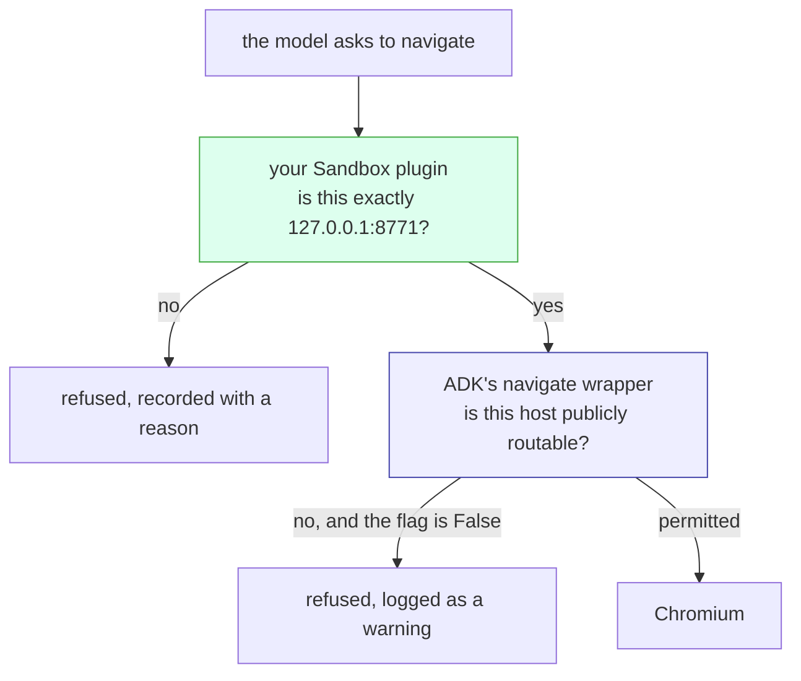

# 3.3 — All or nothing

## One-line answer

`allow_private_network_access` is a boolean, so switching it off to reach your own fixture on
`127.0.0.1:8771` also opens the cloud metadata endpoint and every admin panel on `localhost` — a flag
with the right default and the wrong shape, which is why your own door has to supply the precision
the framework's cannot.

## The story

You want to buy one thing from a shop abroad. The card is declined.

You ring the bank. The person explains that international online use is switched off on every card
they issue, and that this is deliberate, and that they can turn it on for you right now.

You say: fine — but only for this one shop.

There is a pause, and then the honest answer. It is one switch. It does not know about shops. Turn it
on and the card works on that shop's checkout page and on every other checkout page in the world.

So you say yes, because you want the thing, and it arrives, and you forget the conversation entirely.
The switch stays on. Eleven months later somebody in another country puts your card number into a
payment page, and the reason it goes through is a two-minute phone call about a pair of shoes.

There was a second thing on that call you did not do. The same app has a field where you set your own
spending limit on that card — a number you choose, that the bank's switch knows nothing about. You
could have set it to the price of the shoes.

## The idea in plain language

[3.2](3.2-the-guard-adk-already-shipped.md) read ADK's `navigate` guard and found it default-closed:
`allow_private_network_access: bool = False`, and it refuses any URL whose host is not publicly
routable. That is a good default. This part is about its **shape**, which is a different question
from its **default**, and the shape is where it fails you.

The flag is a boolean. A boolean has two settings, so the guard has two settings:

- `False` — refuse *every* address that is not publicly routable.
- `True` — permit *every* address that is not publicly routable.

There is no third setting and no argument to narrow it. And the thing you actually need is a third
setting, because this day's fixture lives on `127.0.0.1:8771`, which is not publicly routable, which
means the only way to reach it is to permit the entire class it belongs to. That class contains:

- your fixture on `127.0.0.1:8771`;
- every other port on `127.0.0.1` — a database admin console on 8080, a debug endpoint on 5000, an
  internal dashboard on 9000 that has no login because it was never meant to be reachable;
- the whole of `169.254.0.0/16`, the **link-local** range, which is where the major clouds put their
  instance metadata service;
- every private range routable from wherever the browser is running — `10.x`, `192.168.x`, and the
  services on them.

You wanted one origin. You were given an address class.

An **origin** is scheme, host and port together, so `http://127.0.0.1:8771` and
`http://127.0.0.1:9000` are two origins and one address class. That gap between *an origin* and *a
class of addresses* is the entire subject of this part, and it is not a flaw somebody should have
caught in review. It is what happens when a general-purpose framework offers a control: the framework
knows about classes of address, because that is knowledge it can have about every user, and it cannot
know that your fixture is on port 8771, because that is knowledge only you have.

Which means the resolution is not *"file a bug against the flag"*. It is that the two controls do
different jobs and you need both — the framework's, which is about classes, and yours from
[3.1](3.1-the-check-outside-every-tool.md), which is about one origin.

## Why Sutra needs it

Because every script in this day's lab has already set the flag to `True`, and one of them is the one
you are about to copy.

`door.py` sets it. `surface.py` sets it, with a comment saying that the sandbox sections are about
*"what that flag is protecting you from everywhere else."* Both set it for a legitimate reason: the
fixture is on loopback and there is no other way to reach it. That is the exact shape of the phone
call in the story — a good reason, a real need, and a switch that does far more than the reason
required.

The desk is going to grow a browser worker, and that worker will run somewhere with a metadata
endpoint. So the question this part answers is the one that will be asked in that deployment review:
*if the flag has to be on, what stands between the agent and 169.254.169.254?* The answer has to be
something written down and reviewable, which is why `lab/gate.py` insists that
`sutra/browser_sandbox.py` export `ALLOWED_ORIGINS` as **data** rather than as a chain of `if`
statements — an origin rule you cannot print is an origin rule nobody reviews.
[3.4](3.4-what-a-refusal-leaves-behind.md) runs that gate.

## The mechanism

`lab/guard.py` navigates to three addresses, twice, changing one boolean. Here are the three:

```python
TARGETS = [
    ("the lab's fixture", "{base}/status.html"),
    ("cloud metadata", "http://169.254.169.254/latest/meta-data/"),
    ("an admin panel on localhost", "http://127.0.0.1:9000/admin"),
]
```

**Line by line:**

- `"{base}/status.html"` is the legitimate target — the local site from
  [2.3](../02-driving-it/2.3-a-site-you-own.md), on `http://127.0.0.1:8771`. This is the row you are
  turning the flag on *for*. It is the shoes.
- `"http://169.254.169.254/latest/meta-data/"` is the canonical SSRF target. `169.254.169.254` is a
  link-local address the major cloud providers answer on from inside an instance, and
  `/latest/meta-data/` is the path prefix under which that service publishes information about the
  instance — including, on a default configuration, temporary credentials for the role the instance
  is running as. It needs no authentication, because the only thing that can reach it is supposed to
  be code you deployed.
- `"http://127.0.0.1:9000/admin"` is the other half of the class, and the more common one in
  practice. It stands for every unauthenticated thing a team runs on loopback because loopback felt
  like a boundary — a queue dashboard, a metrics endpoint, a database console, a debug route.
  Nothing is listening on 9000 on the machine this was measured on, and that does not matter to what
  is being measured: the question is whether the browser was allowed to try.
- Only the first is somewhere this lab wants to go. The flag does not offer a way to say that.

With the default:

```bash
uv run python days/day-71-computer-use-and-the-sandbox/lab/guard.py 2>/dev/null
```

**Line by line:**

- No flag, so `allow_private_network_access=False`, which is what ADK ships.
- No plugin is registered in this run. Nothing from [3.1](3.1-the-check-outside-every-tool.md) is
  involved — this measures the framework's control on its own.

Measured on 2026-09-06:

```text
allow_private_network_access = False   (the default)
the model asked to navigate to 3 urls

  refused   the lab's fixture            http://127.0.0.1:8771/status.html
  refused   cloud metadata               http://169.254.169.254/latest/meta-data/
  refused   an admin panel on localhost  http://127.0.0.1:9000/admin

  navigations that reached the browser  0 of 3

  what ADK logged:
    Refusing navigate(): url failed safety validation.
    Refusing navigate(): url failed safety validation.
    Refusing navigate(): url failed safety validation.
```

Now the same three, with the flag the lab needs:

```bash
uv run python days/day-71-computer-use-and-the-sandbox/lab/guard.py --opt-out 2>/dev/null
```

**Line by line:**

- `--opt-out` sets `allow_private_network_access=True` and changes nothing else. Same three targets,
  same computer, same Runner, same fixture on the same port.
- This is one keyword argument, in one constructor call, in one file. The size of the edit and the
  size of its consequence are not related, which is the point of the whole part.

Measured on 2026-09-06:

```text
allow_private_network_access = True   (opted out)
the model asked to navigate to 3 urls

  reached   the lab's fixture            http://127.0.0.1:8771/status.html
  reached   cloud metadata               http://169.254.169.254/latest/meta-data/
  reached   an admin panel on localhost  http://127.0.0.1:9000/admin

  navigations that reached the browser  3 of 3
```

🎬 **The scene:** you needed row one. You flipped one boolean and got all three.

😬 **The naive fix:** it is fine, because this is a lab and there is no metadata service on a laptop.

💥 **Why it fails:** *reached* in that table means the browser was handed the URL and made the
request. Whether anything answered is a fact about the machine, not about the sandbox. Ask the trace
what actually happened to each one:

```bash
cd days/day-71-computer-use-and-the-sandbox/lab
uv run python -c "
import asyncio, sys
sys.path.insert(0,'.')
from _site import serving
from _fake import reset
import guard
reset()
with serving() as base:
    reached, warns = asyncio.run(guard.run(base, opt_out=True))
for n,d in reached: print(repr(n), repr(d))
" 2>/dev/null
```

**Line by line:**

- `cd` into `lab/` first, because these scripts import their siblings by plain name — `_site`,
  `_fake`, `_computer` — so the directory has to be on the import path.
- `reset()` clears the class-level record of declared tools that `_fake.py` keeps between
  experiments. `guard.main()` calls it for you; calling `guard.run` directly does not, and without it
  the run dies on an `AttributeError` before the first navigation.
- `guard.run(base, opt_out=True)` returns the trace rows rather than the summary table, so the
  *detail* column is visible — which is where `SiteComputer.navigate` records what became of each
  attempt.

Measured on 2026-09-06:

```text
'navigate' 'http://127.0.0.1:8771/status.html'
'navigate' 'http://169.254.169.254/latest/meta-data/  -> net::ERR_CONNECTION_TIMED_OUT at http://169.254.169.254/latest/meta-data/'
'navigate' 'http://127.0.0.1:9000/admin  -> net::ERR_CONNECTION_REFUSED at http://127.0.0.1:9000/admin'
```

The metadata request timed out and the admin request was refused by the operating system, because
this is a laptop: there is no metadata service on it and nothing is listening on port 9000. Both
requests were made. On a cloud instance the first one answers in a few milliseconds with a document,
and on a machine where somebody has a dashboard running the second one answers with a page. **The
sandbox did not stop either of them. The environment happened not to have anything there.** That is
the same reading [3.1](3.1-the-check-outside-every-tool.md) insisted on for
`net::ERR_NAME_NOT_RESOLVED`, and it is worth being stubborn about: a control whose measured success
depends on nothing being at the address is not a control, it is a coincidence you are about to deploy
somewhere else.

💡 **The insight:** the flag is not too permissive by mistake. It is answering a different question
from the one you have. It knows about classes of address; you have a rule about one origin.

Put the two rules side by side and the division of labour is obvious. Each row is what the two
controls independently decide about one URL:

| target | ADK's guard, at its default | the origin allowlist from 3.1 |
| --- | --- | --- |
| the fixture, `http://127.0.0.1:8771/status.html` | refused — loopback is not publicly routable | **allowed** — it is the one origin |
| cloud metadata, `http://169.254.169.254/…` | refused — link-local | refused — off-origin |
| admin panel, `http://127.0.0.1:9000/admin` | refused — loopback | refused — same host, different port, different origin |
| `https://example.invalid/collect?q=incident` | refused — the name does not resolve, so vetting it raises | refused — off-origin |
| a collection endpoint on a domain that does resolve | **allowed** — publicly routable is exactly what it permits | refused — off-origin |

Read the first and last rows together, because they are the two holes and they are in different
walls. ADK's guard cannot let your fixture through, and it will happily let data leave to any host on
the open internet — it is an SSRF control, not an exfiltration control, and it never claimed to be
one. Your origin allowlist has the opposite shape: it does not know or care what class an address
belongs to, and it stops everything that is not one exact origin.

This is why the answer is both, and `door.py` is already the both:

```python
    trace = Trace()
    computer = SiteComputer(base, trace)
    toolset = ComputerUseToolset(computer=computer, allow_private_network_access=True)
```

**Line by line:**

- `allow_private_network_access=True` is the opt-out from the table's first column, taken
  deliberately and for the reason the docstring names: this agent is meant to drive a browser against
  localhost.
- `SiteComputer(base, trace)` is constructed with `base` — `http://127.0.0.1:8771` — and the same
  value is handed to `Sandbox(base, trace)` a few lines later, so the origin the computer opens at
  and the origin the door permits are one variable and cannot drift apart. That is small and it
  matters: two copies of an origin string is a bug waiting for somebody to edit one of them.
- The `trace` is shared between the computer and the door, which is why a refused action and a
  permitted one land in the same list — [3.4](3.4-what-a-refusal-leaves-behind.md)'s subject.

And [3.1](3.1-the-check-outside-every-tool.md) has already measured what the pair does. With the
framework's guard opted out and the origin door registered, the same five-action script produced
**0 off-origin navigations that ran**, and the fixture on loopback was reachable throughout. Neither
control gives you that alone: ADK's default gives you zero of three including the fixture, and the
opt-out alone gives you three of three including the metadata endpoint.

Call it what it is. This is **defence in depth**, not redundancy, and the difference is testable: two
controls are redundant when removing either leaves the same set of things refused. Remove your
allowlist and the open internet opens. Remove the framework's guard and nothing is checking address
classes any more — nothing refuses a hostname that resolves to `10.0.0.7`, because an origin
comparison never resolves anything.



Note the order, because it is not arbitrary. The plugin runs first — a plugin hook runs before the
tool, and ADK's check is inside the tool — so the cheap, exact, offline comparison happens before the
DNS lookup. That ordering is
[Day 67's 1.2](../../../day-67-guardrail-callbacks/parts/01-the-ladder/1.2-cheap-and-certain-first.md)'s
rule arriving in a different day: cheap and certain first.

And now the honest reading of that diagram, which is the sharpest thing in this part. **In this lab
the blue box does nothing**, because `door.py` sets the flag to `True` and the flag is global to the
toolset. There is no way to keep ADK's address check for every host *except* `127.0.0.1:8771`; the
opt-out is not scoped to the reason you took it. So a sandbox that reaches one internal origin has,
as a side effect, no address-class checking at all — and the only thing standing in front of
`169.254.169.254` is a string comparison you wrote.

That is the argument for the flag's shape being wrong, stated precisely. A per-origin opt-out
(*permit private addresses, but only this one*) would let the framework keep guarding the other four
billion. A boolean makes taking the exception mean abandoning the rule. Which is why the second
layer, in this configuration, has to be exact, has to be data somebody reviews, and has to leave a
record when it fires — the last of which is [3.4](3.4-what-a-refusal-leaves-behind.md).

## When it breaks

The flag is not usually set by the person who understands it. It is set once, by somebody solving a
real problem, and then it is inherited.

🎬 **The scene:** the browser worker needs to reach an internal status page on
`http://tools.internal:8080`. It cannot, because `tools.internal` resolves to `10.0.4.12` and that is
not publicly routable. Somebody adds `BROWSER_ALLOW_PRIVATE_NETWORK=true` to the deployment config,
with a comment naming the ticket. It works. The comment is accurate and the reason is good.

😬 **The naive fix:** the value gets copied into the staging config, then the shared base config,
because the worker is the same image everywhere and nobody wants an environment-specific difference
they will have to debug at midnight.

💥 **Why it fails:** eight months later the worker is doing something else. It reads customer-supplied
URLs, or it summarises a page a ticket linked to. The original ticket is closed, the person who
opened it has moved teams, and the config line is now a fact about the system that nobody has an
opinion about. Nothing changed on the day it became dangerous. The flag stayed exactly where it was
while the thing it was attached to changed underneath it. That is the same failure
[Day 66's 3.1](../../../day-66-injection-threat-model/parts/03-the-slow-fuse/3.1-written-monday-read-thursday.md)
measured for a stored payload: the write and the harm are separated by enough time that nobody
connects them.

💡 **The insight:** what makes this discoverable is not a stricter flag — you would set it again for
the same good reason. It is that the opt-out has to be **loud, local and asserted**:

- **Loud.** The service logs at start-up, once, that the framework's address guard is disabled and
  which origins the allowlist permits instead. A control that is off should say so where somebody
  reading a startup log will see it.
- **Local.** The flag lives beside the allowlist it is paired with, not in a base config three
  repositories away, so a reviewer reading one file sees both halves of the decision. Distance
  between a permission and its compensating control is how compensating controls get deleted.
- **Asserted.** A test says *the browser worker sets `allow_private_network_access=True` **and**
  `ALLOWED_ORIGINS` is non-empty and does not contain a wildcard.* Then flipping one without the
  other is a red build, which is a thing somebody has to read, rather than a diff that merges.

The mechanism that catches this in practice is the third one, and it is why `gate.py`'s allowlist
check exists at all.

## In production

**Why the metadata endpoint is the target and why an agent makes it worse.** Cloud instance metadata
services exist so that code running on an instance can find out about the instance without being
configured — and, on a default setup, can fetch temporary credentials for the role the instance runs
as. Two properties make `169.254.169.254` the first address any attacker tries: it is the same
address on every instance, so no reconnaissance is needed, and it has no authentication, because the
network position *is* the authentication. Any component that will fetch an attacker-chosen URL turns
that network position into a public one. The classic version of this bug is a web application with an
image-URL field. An agent is a worse version of it for a specific reason: the URL does not have to
come from a field somebody is watching. It can come from a sentence on a page the agent was asked to
read, which is [Day 66's](../../../day-66-injection-threat-model/parts/01-one-stream/1.1-the-note-taped-to-the-parcel.md)
whole subject, and the agent will fetch it while doing exactly the job it was given. The
countermeasures that actually hold are not in the agent: run the browser somewhere with no metadata
service reachable, use the session-token version of the metadata service where the provider offers
one, and give the instance a role worth nothing. The origin allowlist is what you have in the
meantime, and in the meantime is where most systems live.

**What a professional writes instead of a boolean.** They do not reimplement ADK's guard. They add
the missing granularity in the layer that can have it, and they write the pairing down as one object:
a policy that names the origins, the actions permitted on each, and — explicitly — that the
framework's address check is disabled and why. One file, reviewed as a unit, loaded by the runtime.
That is [Day 68's 2.4](../../../day-68-least-privilege-tools/parts/02-three-questions/2.4-the-table-you-can-diff.md)'s
property arriving for a network rule: the reviewer and the runtime read the same file, so a review is
evidence rather than an opinion.

**What degrades at scale.** One origin is easy to defend and rare in production. Real work grows
origins: an identity provider in the login flow, a document store on a second host, an internal API
the page calls. Each addition is a ticket, each is justified, and the list becomes a small firewall
policy — at which point it needs a firewall policy's discipline, which is that every entry carries
the reason it was added and gets removed when the reason ends. The one that will bite is the entry
somebody adds as a hostname when the underlying address moves into a private range, because your
allowlist compares origins and does not resolve anything: with the framework's guard opted out,
nothing in the system is checking address classes any more, and a host that used to be public is
quietly a route into the private network.

**The review comment a senior engineer leaves:** *"`allow_private_network_access=True` in the worker
config, and I can see why — you're driving an internal host. But that flag is not 'allow this host',
it is 'allow every private and link-local address', which includes 169.254.169.254 on the instance
this runs on. Two things: move the flag into the same file as `ALLOWED_ORIGINS` so a reviewer sees
the pair, and add a test that fails if the flag is true while the allowlist is empty or contains a
wildcard. Also, log at start-up that the framework guard is off. Right now the only place that
decision is written down is a YAML line in the base config."*

**The interview question:** *"You turned off a framework's security default. Defend that."* The
answer worth giving: *"I did, and I'll say what it cost. ADK's computer-use toolset refuses
`navigate` to anything not publicly routable, on by default. Our browser has to drive an internal
host, so we set `allow_private_network_access=True` — and that flag is a boolean, so the smallest
thing I could turn on was the whole class. I measured it: three targets, and at the default zero of
three got through including our own fixture, and with the flag on three of three got through
including `169.254.169.254/latest/meta-data/`. So the opt-out is not the end of the change. We paired
it with an origin allowlist in a plugin on the Runner — exactly one origin, compared on scheme, host
and port — and with that in place the same script did zero off-origin navigations while the internal
host stayed reachable. The two controls aren't redundant: the framework's is about classes of
address, ours is about one origin, and each of them lets through something the other stops. What I
watch for is the flag drifting away from the allowlist, so it's in the same file, it's asserted in a
test, and the service says at start-up that the framework guard is off."*

## Check yourself

```bash
uv run python days/day-71-computer-use-and-the-sandbox/lab/guard.py 2>/dev/null
uv run python days/day-71-computer-use-and-the-sandbox/lab/guard.py --opt-out 2>/dev/null
```

Now add a fourth entry to `TARGETS` — `("the fixture on the wrong port", "http://127.0.0.1:9999/")`.
Predict what each arm will say about it before you run either, then run both. Then say which of the
two doors in this section would have refused it, and which would not.

**Out loud, without scrolling up:** state what `allow_private_network_access=True` permits, in terms
of address classes rather than of one host. Then name one URL ADK's guard refuses and your allowlist
would not, and one URL your allowlist refuses and ADK's guard would not.

**Next:** [3.4 — What a refusal leaves behind](3.4-what-a-refusal-leaves-behind.md).
