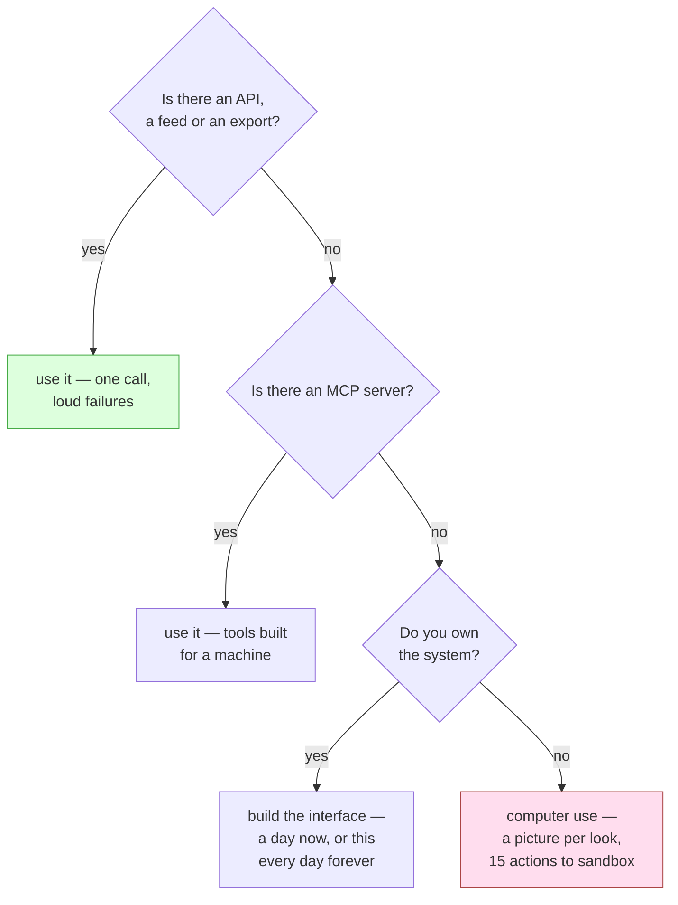

# 4.3 — What this is worth

## One-line answer

Computer use buys you one thing that nothing else buys — a system with no interface for machines
becomes reachable — and it charges for it in pictures, in fragility and in a fifteen-action surface
you now have to police, so the rule that falls out of the day is: reach for it only when there is no
API, no feed and no MCP server, and say out loud which of those you checked.

## The story

A small furniture shop takes an order for a wardrobe. The address is a village forty miles out, and
when the shop enters the postcode into the courier's system it comes back *not served*.

So the owner hires a van for the day.

It works. The wardrobe is delivered, the customer is happy, and there was no other way it was
happening. That is the honest first sentence and it should not be skipped, because everything else in
this part is a qualification of it.

Now the bill. The van for the day, the fuel, the deposit against damage, and the owner's own Saturday
— she is not in the shop, so the shop is shut. And notice the shape of that cost: it is the same
whether she delivers one wardrobe or nothing else. It does not spread. Ten deliveries to that village
is ten Saturdays.

Then the wobble. She went once before, two years ago, and thought she knew the way. The bridge on the
short road is closed for works, and the diversion adds forty minutes each way, and the satnav wants
to send her down a lane the van cannot fit through. Nothing about the wardrobe changed. The *world
between her and the wardrobe* changed, and she found out by being in it.

And the last line, which is the one worth carrying: when the courier finally does serve that
postcode, she will book the courier, and she will never think about the van again.

## The idea in plain language

This day built a browser agent and then spent a section arguing with it, so it owes the reader an
accounting rather than a verdict. The accounting has three columns and the third is the one people
skip.

**What it buys.** Reach. Part [1.1](../01-no-api/1.1-the-page-with-no-json.md) is the whole argument
and it is not a contrived one: some systems have no way in for a machine. Not "an awkward way in" —
none. An internal tool from 2009 with no API and nobody left who could add one. A supplier's portal
that shows you your own invoices and offers no export. A government service where the answer is a
page. For those, the only interface anybody built is the one for eyes and hands, and computer use is
the technique that lets a program use it. That is a real capability and no amount of criticism in
the rest of this part takes it away.

**What it costs.** Three things, and this day measured each one.

*A picture per look.* Part [1.2](../01-no-api/1.2-pixels-and-a-url.md) measured what
`current_state()` actually returns for the day's own two-page fixture: **28,165 bytes** of PNG for the
status page at a 1280×936 viewport, and 14,323 for the history page. That is per look, and the loop
in part [2.1](../02-driving-it/2.1-see-decide-act.md) looks after every action. A task that takes ten
steps sends ten of those. What it costs in tokens is a provider question this day deliberately did
not measure, because measuring it means paying for it — which is itself the point, and which is why
`lab/_fake.py` runs a scripted model rather than a real one. Its docstring is blunt about the reason:
*"a computer-use loop takes a screenshot per step and sends it, so a day of experiments would be the
most expensive day in this curriculum by a wide margin."* Under Addendum 02, quota is the currency,
and this is the technique that spends the most of it per unit of work.

*Fragility, of a specific kind.* Part
[2.2](../02-driving-it/2.2-the-coordinates-are-not-your-pixels.md) is the measurement that makes this
concrete rather than a worry. The model works in a fixed 1000 by 1000 space and ADK rescales every
coordinate to your real window, so a click the model emitted at `(120, 300)` arrives at the browser
as `(153, 280)`. Nothing in that chain knows what is *at* those coordinates. Change the viewport and
the same instruction lands somewhere else; change the page — a banner added, a column widened, a
button moved eight pixels — and the same instruction lands somewhere else again. An API call breaks
loudly when a field is renamed, and you get a `KeyError` with the field name in it. A click breaks
silently by hitting the wrong thing.

*A surface to police.* Part [1.3](../01-no-api/1.3-fifteen-doors-one-used.md) counted it off the real
request: the runtime declared **fifteen** actions to the model and the day's script used **one**.
That is not a ratio you can improve by writing less code, because `BaseComputer` is abstract and
refuses to be instantiated with methods missing. Section 3 then built the door, and part
[3.1](../03-the-door/3.1-the-check-outside-every-tool.md) measured what it is worth on an identical
five-action script: **3 of 5** actions reached the browser with the door installed, 5 of 5 without
it; zero off-origin navigations against one; the secret typed into a page never against once. Real,
measurable, and — as part [4.1](4.1-the-action-nobody-enumerated.md) showed by driving it — a rule
about two names out of a list that is not yours.

**When not to reach for it.** This is the column that turns the other two into a decision, and it is
short. If there is an API, use the API. If there is an export, a feed, an RSS file, a nightly CSV
drop or a database you are allowed to read, use that. If there is an MCP server — the protocol Sutra
has been building against since Phase 6, which exists precisely so a system can offer tools to an
agent in a form meant for machines — use that, and if there is not one and you own the system, the
right day of work is writing one rather than pointing a browser at yourself.

The three costs are not arguments against computer use. They are the price, and the price is only
worth paying when the alternative is nothing.

The diagram has one shaded box at the bottom and three ways to avoid reaching it, which is the honest
shape of the technique.

## Why Sutra needs it

Because a reader who finishes this day excited about browser agents will point one at something that
has a perfectly good API, and the failure will not look like a mistake. It will look like a system
that works in the demo, costs a picture per step, and quietly starts clicking the wrong element three
months later when somebody in another company changes a stylesheet.

It also decides what `sutra/browser_sandbox.py` is **for**, which the build brief does not say and the
module docstring must. Sutra's support desk reads tickets, closes them and answers them, and every one
of those goes through tools Sutra owns. Nothing in the desk needs a browser. The browser is for the
one system Sutra has to reach that offers nothing else — and naming that system, in the docstring,
with the sentence *"we use a browser here because X has no API and we checked"*, is what stops the
technique spreading to the places where it is merely convenient.

And it is the last thing this day says before the paper, because the paper is the answer to the
question this accounting leaves open. Fifteen actions, a list that grows, and a check that has to be
right about every one of them: that is not a problem you solve by being more thorough. It is solved by
changing what happens to the things you did not enumerate.

## The mechanism

There is no new code here — the mechanism of this part is the arithmetic, and the honest way to write
it down is as a table where every number has a part behind it.

| What | Measured | Where |
| --- | --- | --- |
| bytes the model receives per look | 28,165 (status page, 1280×936) | [1.2](../01-no-api/1.2-pixels-and-a-url.md) |
| actions declared to the model | 15 | [1.3](../01-no-api/1.3-fifteen-doors-one-used.md) |
| actions the task actually used | 1 | [1.3](../01-no-api/1.3-fifteen-doors-one-used.md) |
| coordinate the model emitted → coordinate the browser got | (120, 300) → (153, 280) | [2.2](../02-driving-it/2.2-the-coordinates-are-not-your-pixels.md) |
| actions reaching the browser, door installed | 3 of 5 | [3.1](../03-the-door/3.1-the-check-outside-every-tool.md) |
| actions reaching the browser, door removed | 5 of 5 | [3.1](../03-the-door/3.1-the-check-outside-every-tool.md) |
| actions the door has an explicit rule for | 2 of 15 | [4.1](4.1-the-action-nobody-enumerated.md) |

Read the table as three separate claims, because they support different conclusions and get conflated
in every conversation about agents and browsers.

**Rows one and four are the cost of the technique.** They do not improve with a better sandbox, a
better model or a better framework. A screenshot is how the model sees, and a coordinate is how it
points; those are the technique. Any argument that computer use will become cheap has to explain what
replaces those two rows.

**Rows two, three and seven are the cost of *securing* the technique**, and they are the ones this
day's section 3 and 4 are about. Fifteen declared against one used is the gap a door has to close.
Two explicit rules out of fifteen is how far the door got. That gap is closable — invert the default,
lift the policy into data, snapshot the declared surface — and closing it is engineering work with a
known shape.

**Rows five and six are what the work bought.** Three of five instead of five of five, zero off-origin
navigations instead of one, the secret never typed instead of typed. That is a real reduction in what
a compromised or confused agent can do, measured on an identical script, and it is the number to quote
when somebody asks whether the door was worth writing.

What the table cannot tell you is whether the *whole thing* was worth doing, because that depends
entirely on the column the table does not have: what the alternative was. If the alternative was an
API call, every row above is a cost with no matching benefit. If the alternative was a person doing it
by hand forever, every row is cheap.

## When it breaks

The failure this part exists to prevent is not a crash. It is a decision, made once, that nobody
revisits.

🎬 **The scene:** a supplier's portal shows the invoices your finance team needs. There is a "download
CSV" button, but it is behind two clicks and a date picker, and somebody has just finished this day
and knows how to drive a browser.

😬 **The naive fix:** point the agent at the portal. It logs in, picks the dates, clicks the button.
It works on the first afternoon, which is the dangerous part.

💥 **Why it fails:** three months later the portal is redesigned. The button moves, the date picker
becomes a calendar widget, and the agent clicks whatever is now at the coordinate it learned. Part
[2.2](../02-driving-it/2.2-the-coordinates-are-not-your-pixels.md)'s measurement is exactly this: the
model emits a point in a 1000-by-1000 space and ADK maps it onto your window, and no layer in that
chain knows what is at the destination. There is no error. The run completes, a file is produced, and
somebody in finance is reconciling last quarter's numbers.

💡 **The insight:** the question was never *can a browser agent do this*. It was *does this system
have a machine-shaped way in*, and the answer was yes — the CSV button existed, it just needed a
session and two requests. Computer use is what you use when the answer is **no**, and treating it as a
general-purpose integration technique means adopting the fragility of the human interface on purpose,
for systems that did not require it.

**The second failure is the budget one, and it arrives faster than people expect.** Part
[1.2](../01-no-api/1.2-pixels-and-a-url.md) measured 28,165 bytes for one look at one small page — a
fixture with a banner, a four-row table, a link and a footer. Real pages are bigger, and every action
in the loop costs another one. Under Addendum 02 the budget is denominated in requests per minute and
per day rather than in money, and computer use is the technique that turns one task into a dozen
model calls, each carrying an image. A daily quota that comfortably serves a text agent all week can
be gone in an afternoon of browser work, and the failure is an HTTP 429 in the middle of a multi-step
task that has already clicked four things — which is a far worse place to stop than at the start.

**And the third is the one that has no measurement in this day and belongs in the accounting anyway.**
The `search` action from part [1.3](../01-no-api/1.3-fifteen-doors-one-used.md), the fifteen-action
surface, the door, part [4.1](4.1-the-action-nobody-enumerated.md)'s upgrade ritual, part
[4.2](4.2-isolation-you-can-buy.md)'s container and profile: that is all work that exists **only**
because the integration is a browser. An API call needs a credential and a scope. A browser needs a
sandbox, and now you own one.

## In production

**The decision rule a team writes down.** Not "prefer APIs" — everybody agrees with that and it stops
nobody. Something checkable, in the pull request template or the design document: *before a browser
agent is added, name the machine interface that was looked for and not found.* An API URL that
returned 404, a support ticket asking for an export and the reply, a search of the vendor's docs for
"MCP". A sentence a reviewer can disagree with beats a preference nobody can.

**What changes at ten thousand.** Everything in the cost column multiplies, and one thing in the
benefit column does not. The pictures multiply: ten thousand tasks at a dozen looks each is a hundred
and twenty thousand images through a model, and that is a line item somebody in finance will find. The
fragility multiplies badly rather than linearly: one agent against one portal is one thing to fix when
the portal changes, and forty agents against forty portals is a permanent maintenance function, because
the redesigns are not correlated and they never stop arriving. And the browsers themselves become
infrastructure — a pool of Chromium processes with memory limits, restarts, screenshots to store or
discard, and part [4.2](4.2-isolation-you-can-buy.md)'s isolation to configure for each one.

What does not multiply is the reach. Reach is per system: the wardrobe still only gets delivered once
per village.

**The migration that actually happens, and the one to plan for.** Teams that adopt computer use at
scale end up doing the same thing in the same order. First they wrap the browser flow in a function
with a stable name, so that callers do not know how it is implemented. Then, system by system, the
implementation gets replaced — a vendor ships an API, somebody finds an undocumented JSON endpoint
behind the page, an MCP server appears — and the callers do not change. The browser is the fallback
under the interface, never the interface itself. Designing it that way on the first day costs almost
nothing; retrofitting it after forty callers have grown to expect screenshots costs a quarter.

**What a security review asks about it.** Not "is the browser sandboxed", which invites the answer
part [4.2](4.2-isolation-you-can-buy.md) took apart. The useful question is *what does this agent
reach that the rest of the system cannot?* A browser with a session cookie is a deputy holding an
authority its caller does not have, which is Day 68's whole subject, and the reason the throwaway
profile in part [4.2](4.2-isolation-you-can-buy.md) is worth more than it costs.

**The review comment a senior engineer leaves:** *"I'm fine with the browser for the legacy portal —
I've checked, there is genuinely no export and the vendor's answer to the ticket was 'roadmap'. Three
conditions. Put it behind a function with a boring name so we can swap it out without touching
callers. Put the sentence 'no API, ticket #4412, checked 2026-09-06' in the module docstring, because
in eighteen months somebody will find this and assume it was a preference. And give me the per-run
model-call count in the metrics, not just success rate — this is the one integration in our system
whose cost is proportional to how many times it has to look at something, and I want to see that
number move before it shows up on a bill."*

**The interview question:** *"When would you use computer use, and when would you not?"* An honest
answer: *"I'd use it when a system has no interface for machines at all — no API, no export, no MCP
server — and I'd want to have checked all three before I said that, because 'it was easier' is the
reason people usually reach for it. The costs are specific and I've measured them: the model sees a
screenshot, about 28 kilobytes for one small page in our lab, and it gets a fresh one after every
action, so a ten-step task is ten images through a model. It points by coordinate — the model works in
a fixed 1000-by-1000 space and the framework rescales onto the real window — so a redesign moves the
target and nothing throws; the run completes and does the wrong thing. And the surface is large and
not mine: the runtime declared fifteen actions to the model on a task that used one, which is what has
to be sandboxed. We did sandbox it, with a plugin outside every tool, and it was worth doing —
identical five-action script, three of five actions reached the browser with it and five of five
without, and the credential was never typed into a page. But the honest summary is that all of that
work exists because the integration is a browser. If the vendor ships an API next year, I delete the
sandbox, the coordinate handling and the screenshot budget in one afternoon, and that is the strongest
statement anybody can make about what this technique is worth."*

## Check yourself

Take the last three integrations you built or used, and for each one write the four lines from the
decision rule: is there an API, is there an export, is there an MCP server, do you own the system. Any
integration where you reach the shaded box in the diagram is one you should be able to defend with a
sentence; any where you would not reach it and used a browser anyway is the failure this part is
about.

Then do the arithmetic for a task you actually have. Count the steps a person takes to do it — every
click, every scroll, every read. That is the number of screenshots. Multiply by the page size on your
own screen, not the lab's fixture. Then write the one sentence that decides it: *what would this cost
if the system had an API?*

**Out loud, without scrolling up:** name the one thing computer use buys, the three things it costs,
and the question that has to be answered before you are allowed to pay.

---

That leaves the day with a door it has measured, a set of gaps it has named, and a problem it cannot
solve by being more careful: a list of things to check, maintained by somebody else, with a default
that lets through everything nobody thought of.

Somebody had exactly that problem before, with untrusted code rather than untrusted actions, and their
answer was not a longer list. It was to decide **before** anything runs, from a set of rules small
enough that one person can read all of them — and to put a second boundary behind the first, on the
assumption that the reader of those rules will one day be wrong.

**Next:** [Native Client: A Sandbox for Portable, Untrusted x86 Native Code — the paper](../../papers/01-native-client.md).
