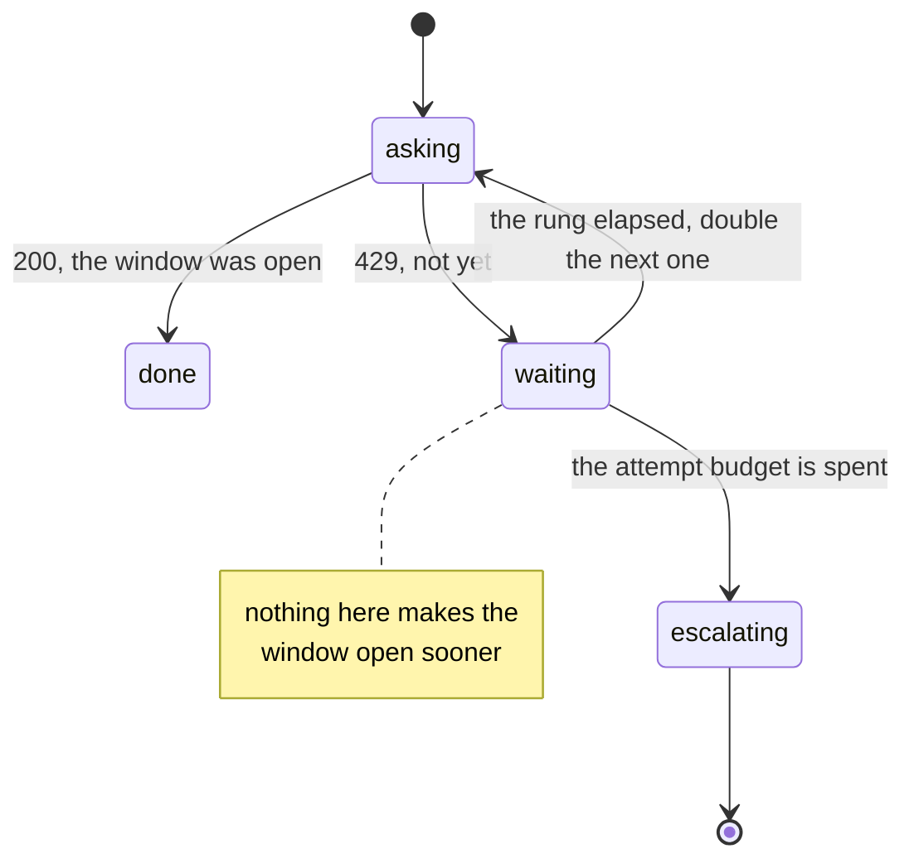

# 1.1 — Why doubling

## One-line answer

Doubling the wait between attempts is not politeness towards a busy server — it is a **search** for
an instant you cannot see, where each rung probes twice as far into the future as the one before it,
so a handful of attempts covers a long stretch of time while still answering quickly if the window
opens soon.

## The story

The water comes to your building's tap in the morning, and not at the same moment every morning.
Some days it is early. Some days you are still waiting when you should already have left.

You live on the fourth floor. The tap is down in the courtyard, next to the drums that need filling,
and there is no way to tell from upstairs whether the water has come. You have to go down and turn
it.

The first morning you do the obvious thing. You go down, turn the tap, and it coughs and gives you
nothing. You climb back up. A little later you go down again. Nothing. You go down again. Nothing.
By the time the water actually arrives, the trips are the thing you remember about that morning, not
the water.

So the next morning you do something different, without thinking of it as a strategy at all. You go
down once, early, because it might already be there. It is not. You wait a bit before going down the
second time — no sense checking again straight away. Still nothing. Now you wait longer than that
before the third trip, because two empty taps in a row tell you the water is not close. Then longer
still before the fourth.

You made the same number of trips as yesterday. Yesterday they covered the first few moments of the
morning. Today they covered the whole of it.

## The idea in plain language

A **retry** is what your code does after a request is refused: it asks again. **Backoff** is the
decision about *when* it asks again. **Exponential backoff** is one particular answer to that
question — wait about a second, then double the wait each time: one, two, four, eight.

The refusal this day is about is HTTP status **429**, which means *too many requests*. It is not a
crash and it is not a bug in your call. It means the provider is counting how much you have used,
you have reached the limit for the current period, and it will serve you again once that period
rolls over. That period is the **window**, and
[Day 70 part 1.4](../../../day-70-the-quota-router/parts/01-what-headroom-is/1.4-two-windows-and-the-one-that-bites-last.md)
showed that a free tier usually has two of them at once: one that clears every minute and one that
clears once a day.

[Day 70 part 4.2](../../../day-70-the-quota-router/parts/04-when-a-lane-says-no/4.2-a-cold-lane-not-a-broken-one.md)
built the *router's* half of the response: mark the refusing provider **cold**, meaning "do not send
anything here until the stated instant", and put the traffic on a different provider. That part
ended by saying plainly that the caller's ladder is a second, separate mechanism and that this day
owns it. So be exact about the division before going further. **The cold lane decides where the next
attempt goes. The ladder decides when it goes.** This part is entirely about *when*, for a single
caller that has already run out of places to look.

Now the point that the word "backoff" hides. Backing off sounds like courtesy — the server is
struggling, so you ease up. That is not what is happening. The window opens at a fixed instant on a
schedule the provider controls, and it does not open one moment sooner because you asked politely or
one moment later because you asked twice. Your asking has no effect on the answer at all.

What you are actually doing is **searching for an instant you cannot see**. Somewhere ahead of you on
the clock is the moment the window opens. You cannot read it, so the only way to find it is to try,
and each try tells you exactly one bit: *not yet*.

That search has two costs, and they pull in opposite directions.

- **Every probe costs a request.** It reaches the provider, is counted, and is answered with a
  refusal. Day 70's hammer run measured this: forty attempts and ten attempts served exactly the
  same ten requests, so the extra thirty bought nothing and were all real traffic.
- **Every moment you are late costs the person waiting.** If the window opened a moment after your
  last probe and your next probe is a long way off, you are sitting still in front of an open door.

A fixed interval — check every second, forever — is cheap on lateness and ruinous on probes. To
cover a stretch of thirty seconds it needs thirty probes. Doubling flips that. Four probes reach
fifteen seconds, seven probes reach a hundred and twenty-seven, ten reach past a thousand. The reach
grows as fast as the waits do, which is the whole trick: **the number of attempts grows like the
logarithm of the time you are covering, instead of in step with it.**

And doubling keeps the property the fixed interval was good at. The first rung is still one second,
so if the window opens almost immediately you find out almost immediately. It is cheap where the
answer is likely to be near, and it reaches far when the answer is not. That is the same thing you
worked out on the stairs: go down once early in case it is already there, then spread the rest of
your trips across the morning.

## Why Sutra needs it

Every model call Sutra makes goes to a free tier, and a free tier's whole business model is a
ceiling. Addendum 02 makes this a rule rather than an accident: quota is the currency, budgets are
counted in requests per minute and per day, and **every model call path handles 429 with a backoff
and then escalates**. A 429 in this repository is not an incident. It is Tuesday.

Day 70 built the router that spreads work across four providers so a single ceiling does not stop
the desk. But a router can only move a request to a provider that has room. When every capable
provider is cold at once —
[Day 70 part 4.3](../../../day-70-the-quota-router/parts/04-when-a-lane-says-no/4.3-every-lane-dry.md)
raises `AllDry` for exactly that case — the router has nothing left to offer and the caller has to
wait. The ladder is the schedule it waits on. Without it, the code in that situation has two
options, and both are bad: hammer, which Day 70 measured as pure waste, or fail immediately, which
turns a refusal that would have cleared in a few seconds into a failed ticket.

It also matters that this is written down **once**. Today's build brief asks for
`sutra/backoff.py`, a single helper every model call and every tool call routes through, and
`lab/gate.py` checks that it exists and takes an explicit attempt budget. A ladder that is
re-implemented at each call site is a ladder with four different opinions in it, and the day you
need to change the policy you will find three of them.

The day after tomorrow makes it sharper still. Day 73 opens Phase 11 with ambient agents — the
nightly job that re-indexes, runs the evals and writes a digest with nobody watching it. Everything
that happens interactively can be retried by a human who sees the error. Nothing that happens at
night can. The ladder, and what the code does when the ladder runs out, is the entire difference
between a transient refusal and a missing digest.

## The mechanism

The ladder itself is four numbers and one function, and both live in `lab/_provider.py`:

```python
LADDER = (1.0, 2.0, 4.0, 8.0)


def ladder_wait(attempt: int) -> float:
    """The delay before attempt `attempt`, counting from 1.

    Beyond the ladder's length the last rung repeats rather than doubling forever, because a ladder
    that keeps doubling reaches delays nobody meant to schedule - part 1.3.
    """
    return LADDER[min(attempt, len(LADDER)) - 1]
```

**Line by line:**

- `LADDER` is a **tuple**, not a list, so nothing can append a rung to it by accident at runtime. It
  is a policy, and a policy that a stray line of code can extend is not a policy.
- The values are `float` rather than `int` because they are handed to something that sleeps, and
  every later refinement of them — jitter in section 4, a `retry-after` honoured in section 2 — is
  fractional. Starting with `1.0` means no arm of this day ever has to think about integer division.
- The numbers are written out as four literals instead of computed as `2 ** (attempt - 1)`. That is
  deliberate and it is the more honest form: a **table you can read is a policy**, and a formula is
  a policy plus arithmetic you have to do in your head before you can review it. It also makes the
  cap in the next line possible to see rather than infer.
- `attempt` counts from **1**, and the docstring says so, because this is the single most common
  off-by-one in retry code — the loop variable in `for attempt in range(...)` starts at zero and the
  first attempt is the first attempt. *When it breaks* below is what happens when the two disagree.
- `min(attempt, len(LADDER)) - 1` is the cap. For attempts 1 to 4 it selects rungs 0 to 3. For
  attempt 5 and everything after it, `min` pins the value at `4` and the expression selects rung 3
  again — so **the last rung repeats rather than doubling forever**. Attempt ten waits eight
  seconds, not five hundred and twelve.
- Repeating rather than doubling is a decision, not an implementation detail, and
  [1.3](1.3-the-last-rung.md) is about what that decision costs. It is mentioned here only so the
  reader is not left thinking the ladder is infinite.

### What the provider's own guidance says

This shape is not folklore, and it is worth checking rather than believing. The Gemini API
troubleshooting guide, <https://ai.google.dev/gemini-api/docs/troubleshooting>, read on
**2026-09-06** and stamped *Last updated 2026-09-04 UTC*, says under its heading **Retry strategy**:

> If you receive an error indicating that you should retry your request (such as a
> `429 RESOURCE_EXHAUSTED` or `503 UNAVAILABLE`), we recommend implementing an exponential backoff
> strategy. This means you wait a short time before the first retry, and then gradually increase the
> wait time between subsequent retries.

And in the list of best practices for anyone writing their own retry logic, the first two items are:

> **Use exponential backoff:** Wait a short time before the first retry (for example, 1 second),
> then increase the delay exponentially (for example, 2s, 4s, 8s).
>
> **Add jitter:** Add random "jitter" to the delay to help prevent all clients from retrying at the
> exact same time.

That is `LADDER` exactly: one second, then two, four, eight. The second item is section 4's subject
and is left alone until then.

Two more things the same page says are worth carrying forward now, because they are limits on this
part rather than extensions of it. It says *"Retry on specific errors: Only retry on transient errors
(like `429`, `408`, or `5xx`). Do not retry on client errors (like `400` or `403`) as they indicate
issues like invalid API keys or bad syntax."* And it says *"Set maximum retries: Define a maximum
number of retry attempts to prevent infinite loops."* The first is *When it breaks* below; the second
is [1.3](1.3-the-last-rung.md).

One thing the page does **not** say, anywhere: it never mentions a `retry-after` header. It tells you
to compute your own delay. Hold that observation — section 2 is entirely about what happens when a
server does hand you the number, and
[2.2](../02-the-number-the-server-gave-you/2.2-when-it-is-absent.md) comes back to this page
specifically.

### The search, drawn

Here are the two strategies as probes on a timeline, with the window opening at ten seconds. Each
`|` is one attempt — one real request that reaches the provider.

```text
                    t=0        5s        10s       15s       20s
                    |----------|----------|---------|---------|
window opens                             ^ here

flat, every 1s      ||||||                          6 attempts, reach 5s   -> never gets there
ladder 1-2-4-8      |  |   |      |             |   5 attempts, reach 15s  -> arrives at t=15s
```

The flat row is not lazy — it is *working harder*. It made more requests than the ladder did and it
is still short of the door, because a fixed interval spends its whole budget near the start.

The state a single caller moves through is small enough to hold in your head:



`escalating` is deliberately drawn as a state and not as an arrow into `done`. What happens there is
[3.1](../03-after-the-last-retry/3.1-escalate-never-invent.md), and it is the part of this day that
actually matters.

## When it breaks

A refusal that nobody caught looks like this. Run it yourself:

```bash
PYTHONPATH=days/day-72-backoff-with-honesty/lab uv run python -c "
from _provider import Clock, Provider
clock = Clock(0.0)
Provider(opens_at=37.0, clock=clock).call()
"
```

Measured on 2026-09-06:

```traceback
Traceback (most recent call last):
  File "<string>", line 4, in <module>
  File ".../days/day-72-backoff-with-honesty/lab/_provider.py", line 78, in call
    raise Refused(429, remaining if self.says_retry_after else None)
_provider.Refused: 429: refused, retry-after 37s
```

`429: refused, retry-after 37s` is the whole message, and the useful half of it is the number at the
end. A ladder that starts at one second is about to spend five attempts approaching a door that is
thirty-seven seconds away, while holding, in the exception it just caught, the exact answer. That is
section 2.

The break that belongs to *this* part is subtler and produces no traceback at all: **doubling against
a refusal that will never clear.** A `400` means your request was malformed. A `403` means your key
is not allowed to do that. Neither is a window, so there is no instant to search for, and the ladder
patiently waits one, two, four and eight seconds to be told the same permanent thing four more times.
The guidance quoted above is explicit — *"Do not retry on client errors (like `400` or `403`)"* — and
the fix is a list of retryable statuses in one place rather than a bare `except Exception` around the
call. Which exception types may be retried at all is
[3.2](../03-after-the-last-retry/3.2-which-calls-are-safe-to-retry.md)'s subject, and it turns out
that `429` and a connection timeout do not belong to the same policy either.

The third break is the off-by-one the docstring warns about, and it is worth seeing because it fails
*quietly*:

```bash
PYTHONPATH=days/day-72-backoff-with-honesty/lab uv run python -c "
from _provider import ladder_wait
for attempt in (0, 1, 2):
    print(f'ladder_wait({attempt}) = {ladder_wait(attempt)}s')
"
```

Measured on 2026-09-06:

```text
ladder_wait(0) = 8.0s
ladder_wait(1) = 1.0s
ladder_wait(2) = 2.0s
```

`ladder_wait(0)` returns **8.0**, the top rung, because `min(0, 4) - 1` is `-1` and Python reads
`LADDER[-1]` as the last element rather than as an error. A caller that passes its zero-based loop
index gets the ladder's longest wait first and its shortest wait second. Nothing raises. The run is
simply eight seconds slower on its very first retry, for ever, and the reason is invisible in the
logs. [1.3](1.3-the-last-rung.md) is where that index is pinned down properly.

## In production

**What a professional writes instead.** Not a `time.sleep` at the call site. One helper — today's
`sutra/backoff.py` — that takes the callable, an attempt budget and a policy, and is the only place
in the repository that knows the rungs. Everything else calls it. There are two reasons and the
second is the one people miss: the obvious reason is that a policy in one place can be changed in
one place, and the real reason is that **a policy in one place can be measured in one place**. The
count of escalations, the count of wasted requests, and the distribution of how many attempts a
successful call actually needed all come out of that one function for free, and they are the numbers
[5.2](../05-in-production/5.2-what-to-alert-on.md) says you must watch. Ladders scattered across
call sites produce no numbers at all.

**What degrades at scale.** Doubling spreads *one* caller across time. It does nothing whatsoever to
spread callers apart from each other, because every one of them computes the same one, two, four,
eight from the same refusal. Forty callers refused at the same instant come back together at one
second, together at three, together at seven — which is why the guidance quoted above puts jitter
immediately next to the ladder rather than in a footnote. Section 4 measures exactly how bad this
gets and how small the fix is. Until you have read it, treat "we added exponential backoff" as an
incomplete sentence.

**The failure that only appears with real traffic.** A ladder is how a system stops reporting its own
problems. The first attempt fails, the second succeeds, the request is served, and no error is
logged anywhere — so the dashboard is green while the provider is refusing half of everything you
send. The system has not become healthy; it has become slower and quieter at the same time, and the
first outward sign is usually a latency complaint from somebody who has no idea they are describing a
quota problem. The detector is a counter on *retries* and on *wasted requests*, not on errors.

**The review comment a senior engineer leaves:** *"This sleeps a flat second and loops. Within the
same attempt budget that reaches five seconds, and our minute window can be up to sixty seconds away
— so on a bad minute we make six requests, waste all six and give up on something that would have
cleared on its own. Make it double, put it in one helper with an explicit attempt budget, and count
the wasted requests so we can see this from a dashboard instead of from a complaint."*

**The interview question:** *"Why exponential backoff rather than retrying at a fixed interval?"* The
answer that shows you have thought about it: *"Because I am not being polite to the server, I am
searching for an instant I cannot see, and the two things it costs me are requests and lateness. A
fixed interval covers a stretch of time with a number of probes proportional to that stretch;
doubling covers it with a number proportional to the logarithm of it, so the same six-attempt budget
reaches several times further. And it keeps the good property of the fixed interval, which is that
the first rung is still short — so if the window opens straight away I still find out straight away.
The two things I would add before shipping it are jitter, because every client computes the same
ladder from the same refusal and comes back in a herd, and a cap, because unbounded doubling
schedules waits nobody intended."*

## Check yourself

```bash
uv run python days/day-72-backoff-with-honesty/lab/ladder.py
```

Before you read [1.2](1.2-the-ladder-measured.md), answer this from the code alone: the window opens
at ten seconds and the budget is six attempts. At what times on the clock do the six attempts land,
and which of them is the first one that could possibly succeed?

**Out loud, without scrolling up:** explain to somebody who has only ever written `time.sleep(1)` in
a loop why doubling is not about being nice to the server, and say what the two costs of a probe
are.

**Next:** [1.2 — The ladder measured](1.2-the-ladder-measured.md).
