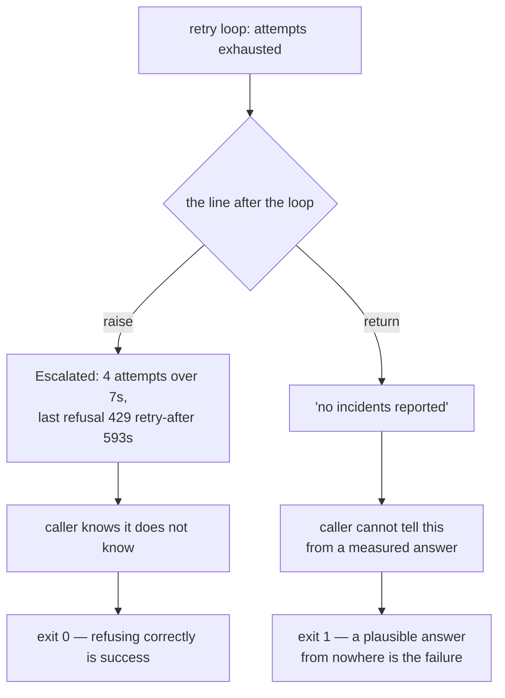

# 3.1 — Escalate, never invent

## One-line answer

Every retry loop has a line after it, and there are exactly two things that line can do — **raise**,
or **return something shaped like an answer** — and only the first is allowed: `honest.py` exits
**0** when it refuses to answer and **1** when it hands back `'no incidents reported'` from a default
nobody measured.

## The story

The man who reads the electricity meters comes round the flats on the first Monday of the month. Your
meter is inside the flat, by the kitchen door, so he has to be let in.

He knocks on the Monday. Nobody in. He comes back on the Wednesday evening, and again on the Friday,
and once more on the Saturday morning, and each time the flat is locked and quiet. Four visits, and
he never sees the meter.

Now he is standing on the landing with the form. The form has a column of flat numbers and, next to
each one, a box for the number on the dial. Every other box on the sheet has a reading in it. His has
to have something in it too, because the sheet goes to the billing office in the afternoon and the
office cannot process a sheet with a hole in it.

So he writes what the flat usually uses. It is not a wild guess — he has last month's sheet, and the
month before that, and the flat has been steady all year. He writes the number, hands in the form,
and goes home.

The bill that arrives is a perfectly ordinary bill. There is nothing on it that says nobody was let
in. There is nothing in the office's system that says anybody knocked four times. From the outside —
from the tenant's side, from the accounts department's side, from the meter data six months later
when somebody is looking for flats whose consumption jumped — the estimate and a reading taken off
the dial are the same thing: a number in a box.

He was not being dishonest. He was being *helpful*, on a form that had no box for **I could not
look**.

## The idea in plain language

A retry loop always ends. Part [1.3](../01-the-ladder/1.3-the-last-rung.md) established why: the
ladder has a last rung, because a ladder that doubles for ever reaches delays nobody meant to
schedule. So there is always a moment when the attempts are used up and the code moves on to the next
line.

That next line is the subject of this part, and it has exactly two options.

1. **Raise.** Tell the caller the work did not happen, and say enough about the attempt that somebody
   can act on it. This is **escalation**: passing a failure upwards to whoever can decide what to do
   about it, instead of deciding silently yourself.
2. **Return a value.** Hand back something the shape of an answer, so the caller carries on.

The second option is Principle 10 being broken, and it is worth saying carefully why, because it does
not feel like breaking anything when you write it. Principle 10 is *fail honestly*: errors surface,
escalate, and are logged, and **a result is never fabricated to cover an error**. The returned value
is a fabricated result. It is not marked as one, it does not raise, and nothing downstream of it can
tell it from a value the provider actually sent.

Two terms, before they get used:

- A **default** is a value chosen in advance, to be used when no real value is available. Defaults are
  a normal, good tool — a default port, a default page size, a default timeout. They are safe when the
  thing they stand in for is a *preference*.
- A **claim about the world** is a value that asserts something is true out there: *there are no
  incidents*, *the meter reads 4180*, *this customer has no prior tickets*. A default can never be one
  of these, because nobody looked.

The whole rule fits in one line: **a default may fill in a preference and may never fill in a fact.**

You have met the same failure once before, from a different direction. Day 67 part
[4.4](../../../day-67-guardrail-callbacks/parts/04-what-goes-out/4.4-the-error-hook-that-invents-a-result.md)
showed an ADK error hook — `on_tool_error_callback` — returning a dict, which stops the exception and
substitutes that dict as the tool's result. That was a framework surface doing something surprising:
the author reached for a hook that was documented to *see* errors, and discovered it could *answer* in
their place.

This part has no framework in it at all. There is no callback, no hook, no runtime, and nothing
surprising in any documentation. There is a `for` loop, and after it, in the author's own file, in
plain Python, a `return`. That is the point of teaching it twice. The first version was a trap laid by
an API; this one is a trap that needs no API, and it is the one that survives every framework
migration you will ever do.

## Why Sutra needs it

Because the desk asks other people's systems questions, and other people's systems refuse.

Sutra's support desk calls a vendor status endpoint to find out whether there is an incident affecting
a customer. Everything the day has built so far is about the refusal: section 1's ladder for when the
server says nothing about timing, section 2's rule for when it does. All of that is spending —
attempts, elapsed time, quota — on the hope that the refusal is temporary.

Sometimes it is not. The window in `honest.py` opens ten minutes out, and the budget is four attempts.
The spending fails, and now the desk has to say something to a customer who is waiting.

*"No incidents reported"* is a sentence the desk says honestly on most days. That is exactly what makes
it dangerous here: it is not an implausible output, it is the **most ordinary output the call has**.
The customer reads it, believes it, and stops looking for the cause of their problem — the same
afternoon the meter reader's estimate buys, spent by someone else.

And this is a security day, not just a reliability one, because the fabricated answer is also an
availability failure that hides itself. A vendor being down is an incident. A desk that responds to a
vendor being down by telling everyone there is no incident has converted an outage into a silence, and
silence is what an attacker probing a dependency wants to see.

## The mechanism

The exception first, because escalating is not just refusing to answer — it is refusing *with the
receipts*.

```python
class Escalated(Exception):
    """Raised when retries are exhausted. Carries what was tried, so the caller can act."""

    def __init__(self, attempts: int, waited: float, last: str) -> None:
        super().__init__(
            f"gave up after {attempts} attempts over {waited:.0f}s; last refusal was {last}"
        )
        self.attempts = attempts
        self.waited = waited
        self.last = last
```

**Line by line:**

- A class of its own, rather than re-raising the last `Refused`. The last refusal answers *what did
  the server say*; this answers *what did we do about it*, and the caller needs the second one to
  decide anything.
- `attempts`, `waited` and `last` are the three facts the meter reader had on the landing and did not
  write down: how many times he knocked, over how long, and what he found the last time. A form with
  those three boxes filled in is an actionable report. A form with an estimate in the reading box is
  not.
- They are stored as attributes **and** formatted into the message. The message is for the human
  reading a log; the attributes are for the code above, which may want to branch on `attempts` or
  alert on `waited` without parsing English out of a string.
- `waited:.0f` prints seconds with no decimals, because the number the reader cares about is
  *roughly how long did the caller sit there* and a value like `7.000000000000001` is noise in a log
  line.
- There is no `retry_after` field, deliberately. A single stated retry-after belongs to a single
  refusal, and by this point there have been several; `last` carries the most recent one whole,
  including its number, rather than lifting one field out of it.

Now the line the script exists for. This is the end of `fetch_status`, immediately after the `for`
loop has run out of attempts:

```python
    if invent:
        # The line this script exists to show. Nothing here is a lie the author intended; it is a
        # default, chosen so the caller "gets something", and it is indistinguishable downstream
        # from a real answer.
        return "no incidents reported", "a default in the except branch"
    raise Escalated(MAX_ATTEMPTS, clock.now, last)
```

**Line by line:**

- Read the comment first, because it is the argument of the whole part. *Nothing here is a lie the
  author intended.* Nobody sets out to fabricate a vendor status. Somebody sets out to stop a
  function from having an awkward code path, and a **default** is the ordinary, professional-looking
  way to do that. The failure is not an act of dishonesty; it is a habit applied one line past where
  it is safe.
- `return "no incidents reported"` is a claim about the world, arrived at without reaching the world
  once. Compare it against the definition above: it is not a preference, it is a fact, and no measurement
  produced it.
- The second element, `"a default in the except branch"`, is **provenance** — a record of where a
  value came from. It exists here only because this is a teaching script printing its own workings.
  In the code this is modelled on, the function returns one string and the provenance does not exist
  at all, which is precisely why nothing downstream can tell.
- `raise Escalated(MAX_ATTEMPTS, clock.now, last)` is the honest arm, and notice it is *shorter*. The
  honest arm is not the elaborate one. It is one line, and it is the one that gets deleted when
  somebody upstream complains about an exception in their logs.
- `clock.now` is the lab's hand-moved clock from `_provider.py`, advanced by `clock.sleep` rather
  than by real time, so the elapsed figure in the message is the ladder's arithmetic and reads the
  same on a fast machine and a slow one.
- `last` is the string form of the most recent `Refused`, captured in the `except` branch on every
  pass. If the loop never refused, it never reaches this line, so `last` is never empty here.

The fork, drawn:



Run the honest arm:

```bash
cd days/day-72-backoff-with-honesty/lab
uv run python honest.py
```

**Line by line:**

- `cd` into the lab first: the scripts import their siblings by plain name (`from _provider import
  ...`), so the lab directory has to be the working directory.
- No flag is the shipping configuration. `fetch_status(invent=False)` retries four times against a
  provider whose window opens at `t=600`, exhausts the budget, and raises.

Measured on 2026-09-06:

```text
provider will not open for 600s; budget is 4 attempts

  raised    Escalated: gave up after 4 attempts over 7s; last refusal was 429: refused, retry-after 593s
  caller    receives an error it can act on, and no answer
```

Then the inventing arm:

```bash
uv run python honest.py --invent
```

**Line by line:**

- `--invent` flips one boolean, which selects the `if invent:` branch above. Nothing else in the run
  changes: the same four attempts are made, against the same provider, over the same seven seconds.
  Every request that reached the provider was refused in both runs.

Measured on 2026-09-06:

```text
provider will not open for 600s; budget is 4 attempts

  returned  'no incidents reported'
  came from a default in the except branch

  Nothing downstream can tell this from a real answer. No exception was raised, no
  log line says the provider was never reached, and the desk will repeat it to a
  customer as fact.
```

Now the part that is easy to read past. **Check what the shell says about each run.**

```bash
uv run python honest.py > /dev/null; echo "honest.py -> $?"
uv run python honest.py --invent > /dev/null; echo "honest.py --invent -> $?"
```

**Line by line:**

- `> /dev/null` throws the printed output away, because the question here is not what the script said
  but what it *reported*.
- `$?` is the exit status of the previous command — the number a process hands back to whatever
  started it. `0` means success by universal convention, and anything else means failure. This is the
  only thing a shell script, a CI job, a cron wrapper or a container orchestrator reads.

Measured on 2026-09-06:

```text
honest.py -> 0
honest.py --invent -> 1
```

Sit with the asymmetry, because it is the day's argument compressed into two integers.

The run that produced **no answer at all** exits **0**: success. The run that produced a fluent,
grammatical, plausible answer exits **1**: failure. That is backwards from the instinct that a
function returning a value has gone well and a function raising has gone badly — and the instinct is
what writes the `if invent:` branch.

The exit codes encode the actual standard. The job of `fetch_status` is not *to produce a status*. It
is *to report the vendor's status if it can be obtained, and to report that it could not be obtained
otherwise*. Measured against that job, refusing correctly is the job done, and a confident answer from
nowhere is the job failed. The script exits `1` on `--invent` for the same reason a test suite exits
`1`: something happened here that a human has to look at.

## When it breaks

Take the guard rail away and let `Escalated` reach the top of a process, which is what happens when a
caller does not handle it:

```bash
cd days/day-72-backoff-with-honesty/lab
uv run python -c "from honest import fetch_status; fetch_status(invent=False)"
```

Measured on 2026-09-06:

```traceback
Traceback (most recent call last):
  File "<string>", line 1, in <module>
  File "C:\Users\nisha_gnzw\OneDrive\Desktop\Projects\sutra\days\day-72-backoff-with-honesty\lab\honest.py", line 58, in fetch_status
    raise Escalated(MAX_ATTEMPTS, clock.now, last)
honest.Escalated: gave up after 4 attempts over 7s; last refusal was 429: refused, retry-after 593s
```

Read the last line as an on-call engineer at eleven at night. It names the number of attempts, the
elapsed time, the status code and the server's own stated wait — `593s`, which is nearly ten minutes,
which immediately tells the reader that no plausible retry budget was ever going to cover this. Four
attempts over seven seconds against a ten-minute window was never going to work, and the message says
so without anybody having to reason it out.

That is what "an error you can act on" means concretely. The engineer does not need the code open to
know the next move: either wait ten minutes, or stop retrying this endpoint at this frequency.

The other arm has no error text at all, and that is the failure. Call it directly and nothing is
raised:

```bash
uv run python -c "from honest import fetch_status; print(fetch_status(invent=True))"
```

Measured on 2026-09-06:

```text
('no incidents reported', 'a default in the except branch')
```

No traceback. No warning. No log line. The provider was never reached, and the process ends with
status `0` when called this way, because from Python's point of view the function returned normally
and did what it was asked. **The absence of an error message is the symptom**, and there is no string
to search for — which is why this bug is found by reading code rather than by reading logs.

The smallest fix is a deletion. Remove the `if invent:` branch and the `raise` is what is left. That
is worth noticing on its own: the honest version of this code is the version with less code in it.

## In production

**What an escalation has to carry to be actionable.** An exception that says `RuntimeError: failed`
is not an escalation; it is a shrug with a stack trace. The five things a real one carries, all of
them present in `Escalated` or one field away from it:

| What | Why it is needed | In `Escalated` |
| --- | --- | --- |
| how many attempts | separates "one blip" from "we hammered it" | `attempts` |
| elapsed time across the attempts | says whether the budget was ever proportionate to the wait | `waited` |
| the last refusal, verbatim, with its status and stated wait | the only fact that came from the server | `last` |
| which call, on behalf of whom | so it can be attributed to a customer, a run and an endpoint | added by the caller: run id, ticket, endpoint |
| what the caller should do now | so the receiver is not re-deriving the decision at 2am | the retry-after in `last` implies it: wait, do not hammer |

The first three are the ones people forget, and they are the difference between an alert somebody can
triage and an alert somebody mutes.

**What changes at ten thousand of these.** One escalation an hour is a page. Ten thousand escalations
an hour is a denial of service you performed on yourself: every one of them is an exception object, a
stack trace, a log line and possibly a notification, and the cost of *reporting* the outage starts to
rival the cost of the outage. The production shape is to escalate **every** failure to the caller — that
part never changes — and to **aggregate** what leaves the process: count escalations per endpoint per
minute, alert on the rate and on the first occurrence, and log a full one only occasionally. Never
solve the volume problem by escalating less honestly; solve it after the honesty, on the way out.

**What degrades, and it degrades quietly.** Fabricated answers do not stay in one function. Somebody
adds a default to stop a noisy exception, a second team copies the pattern because it is in the
codebase, and after a year several layers each turn a failure into a plausible value. The composite is
a service that never reports being broken and slowly stops being right. The metric that would have
caught it — the error rate — is the metric the pattern deletes, so what moves instead is answer
quality, repeat-contact rate and customer trust: numbers that drift, have a dozen explanations, and
belong to a different team.

**The failure mode that only appears with real traffic.** Under normal load the vendor answers, the
retry loop returns on attempt one, and the line after the loop is never executed. It is dead code for
months. It runs for the first time during the exact incident it was going to make worse — when the
vendor is down, every request in flight arrives at that line together, and the fabricated answer goes
out at full traffic volume for as long as the outage lasts. **The line after the loop is only ever
exercised on your worst day**, which is why it has to be reviewed rather than tested into shape.

**The one legitimate exception, and its precondition.** A *fallback* may produce a value where the
primary failed — a cached answer, a replica, a second provider — because in that case something
really did happen and there really is a result. The precondition is that the substitution is
**visible in the data**: the result carries a field saying it is degraded and where it came from, an
event records that the primary failed, and the answer a customer sees can be traced back to the
degraded path. That is the same conclusion Day 67 part
[4.4](../../../day-67-guardrail-callbacks/parts/04-what-goes-out/4.4-the-error-hook-that-invents-a-result.md)
reached about error hooks, and it is the meter reader's `E` on the bill: an estimate is allowed, and
an estimate that is not marked as one is not.

**The review comment a senior engineer leaves:** *"The line after the retry loop returns a default. That
means a ten-minute vendor outage reaches the customer as 'no incidents reported', which is a claim
about the vendor that we never checked — and it exits zero, so nothing downstream or in CI will ever
notice. Raise instead, and put the attempt count, the elapsed time and the last refusal on the
exception so the on-call has something to act on. If product genuinely wants a friendly sentence when
the vendor is unreachable, that sentence is 'we can't check right now', it is rendered in the layer
that handles the failure, and it is not the same string we use when we did check. And if we ever add a
cached fallback, it carries a `degraded` flag or we will have this conversation again with a
nicer-looking bug."*

**The interview question:** *"Your retries are exhausted and the call still hasn't succeeded. What do
you return?"* An honest answer: *"Nothing — I raise. The line after a retry loop can either raise or
return something shaped like an answer, and returning is fabricating a result, because nothing measured
it. I've built the two-armed version of this: the same four attempts over the same seven seconds, one
arm raising an error that carries the attempt count, the elapsed time and the last refusal verbatim —
429, retry-after 593 seconds — and the other returning 'no incidents reported' from a default in an
except branch. The uncomfortable bit is the exit codes: the arm that gives no answer exits zero,
because refusing correctly is the job done, and the arm that gives a confident answer exits one. Nobody
writes that default to deceive anyone; they write it because the function felt untidy with a bare
raise at the bottom. In production I'd escalate every one of them to the caller and aggregate on the
way out — count and alert on the rate rather than page on each — and if we need a fallback, it comes
back with a degraded flag and provenance so the substitution is in the data instead of hidden in a
branch."*

## Check yourself

```bash
cd days/day-72-backoff-with-honesty/lab
uv run python honest.py; echo "exit $?"
uv run python honest.py --invent; echo "exit $?"
```

Change `OPENS_AT` in `honest.py` from `600.0` to `5.0` and run both arms again. Record which arm now
prints an answer and which raises, and then explain **why the `--invent` branch is still exactly as
dangerous as it was** even though it no longer executes.

Then write down, without running anything, what `Escalated` would have to carry for an on-call
engineer to decide between *retry in ten minutes* and *stop calling this endpoint today*, and say which
of those fields the lab's version is missing.

**Out loud, without scrolling up:** the run that produced no answer exited `0` and the run that
produced an answer exited `1`. Say why, in one sentence, using the word *measured*.

**Next:** [3.2 — Which calls are safe to retry](3.2-which-calls-are-safe-to-retry.md).
