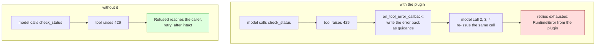

# 5.1 — The plugin that asks the model

## One-line answer

ADK ships a retry plugin, `ReflectAndRetryToolPlugin`, and it is a well-made mechanism pointed at a
different failure than this day's: it hands a tool's error back to the **model** so the model can call
the tool differently, which is exactly right when the call was wrong and exactly wrong for a 429,
where the call was fine and the window was shut — **4 model calls against 1**, for a refusal no
rephrasing could fix.

## The story

The internet at home goes off on a Tuesday evening. You ring the number printed on the bill.

The first thing you hear is a recording: *there is a known fault affecting your area, and engineers
are working on it.* Then some music. Then a person.

The person has a checklist, and every item on the checklist is about your flat. Unplug the box on the
wall, count to thirty, plug it back in. Read me the lights on the front, left to right. Take the
cable out of that socket and put it in the one next to it. Now plug the laptop straight into the box
with a wire, and tell me what the screen says.

You do all four. Each one costs you a walk to the other room and a few minutes on your knees behind a
cupboard. Then he checks something on his side and tells you what the recording told you before he
came on the line: a cable has been cut on your road, four hundred houses are off, and it should be
back tonight.

That checklist is not a bad checklist. Most evenings the fault really is in the flat — a plug half
out, a cable in the wrong socket, a box that has been switched on since last winter — and the
checklist fixes those evenings without anybody driving out to look. It was written for the common
case and it is right about the common case.

It was simply not about tonight. Tonight the answer arrived in the first ten seconds of the call, and
everything after that was work done on equipment that was never broken.

## The idea in plain language

Two tool failures can look identical from the outside — both come back as an exception — and need
opposite treatment.

**The call was wrong.** A date sent in the wrong format, a required field left out, a filter written
in a query language the service does not accept, an identifier that does not exist. Something about
the *call itself* has to change before it can succeed. A model is good at making that change, because
the error message usually says what was wrong and the model is the thing that wrote the arguments.

**The call was right and was refused.** The provider returned **HTTP 429** — the status code a server
sends to say *you have made too many requests, not now* — and, as part
[2.1](../02-the-number-the-server-gave-you/2.1-retry-after-beats-your-ladder.md) measured, it usually
attaches the time its window reopens. Nothing about the call has to change. Only the clock has to
move.

The whole of this day so far has been about the second kind. Now the framework offers help, and the
help is built for the first kind.

A **plugin**, in ADK, is a bundle of callbacks registered once for a whole run rather than on one
agent — Day 70 part
[3.1](../../../day-70-the-quota-router/parts/03-the-plugin/3.1-where-a-router-has-to-stand.md)
introduced them and explains why a cross-cutting rule belongs in one. One of the hooks a plugin can
implement is `on_tool_error_callback`, which the runtime calls when a tool raises. Day 21 part
[2.2](../../../day-21-errors-surface-not-swallow/parts/02-four-hooks/2.2-the-two-that-can-rescue.md)
named this hook as one of the two that can *rescue* a failure rather than merely witness it — it can
return a value and the run continues as if the tool had returned it.

`ReflectAndRetryToolPlugin` is that hook, used for self-healing. It catches the error, writes it back
into the conversation as guidance for the model, and lets the model try the tool again. Its checklist
is *the model got it wrong; give the model the error and let it correct itself*, and like the support
script it is right about the common case it was written for.

A 429 is not that case. The arguments were never the problem, so the model has nothing to correct,
and every round of correcting spends a model call. On a free tier a model call is the scarce thing
(Addendum 02, and the whole subject of Day 70), which makes this a measurable choice rather than a
matter of taste.

## Why Sutra needs it

Because the build brief in this day's hub asks you to write `sutra/backoff.py` by hand, and the first
question a reviewer will ask is the correct one: *ADK ships a retry plugin — why are we writing our
own?* "Because ours is better" is not an answer. This part is the answer with two numbers in it.

It also decides what tomorrow costs. Day 73 opens Phase 11 with **ambient agents** — the nightly job
that re-indexes, runs the evals and writes a digest with nobody watching it. An unattended job meets
429s more often than an interactive one, because it runs long and it runs in bulk. If every refusal
costs four model calls instead of one, a provider having a bad hour does not slow the nightly job
down; it consumes the next day's quota before the job has finished, and the person who finds out is
whoever needed the digest.

## The mechanism

Start by reading what the plugin says about itself, rather than what this document remembers about
it. Every fact below was read out of the installed package on 2026-09-06:

```bash
uv run python -c "import google.adk; print(google.adk.__version__)"
uv run python -c "import inspect; from google.adk.plugins import ReflectAndRetryToolPlugin as R; print(inspect.getdoc(R))"
uv run python -c "import inspect; from google.adk.plugins import ReflectAndRetryToolPlugin as R; print('ReflectAndRetryToolPlugin' + str(inspect.signature(R.__init__)))"
```

**Line by line:**

- The first command prints the installed version rather than a version somebody wrote down once. It
  answered **`2.7.1`**, so everything in this part is about `google-adk==2.7.1` and nothing else
  (Principle 7: never invent a version number).
- `inspect.getdoc` reads the docstring **off the class object that is actually imported**, which is a
  stricter check than a documentation page: the page describes a release, and this describes the code
  that will run in your process tonight.
- `inspect.signature(R.__init__)` prints the constructor's real parameters and defaults. Guessing a
  constructor is Principle 8's exact prohibition, and a plugin with four keyword arguments is a
  plugin where the defaults matter.
- All three are `python -c` one-liners rather than a script, because a fact you verify should not
  require a file that then rots next to the fact.

The docstring's opening, verbatim:

> Provides self-healing, concurrent-safe error recovery for tool failures.
>
> This plugin intercepts tool failures, provides structured guidance to the LLM for reflection and
> correction, and retries the operation up to a configurable limit.

Read *self-healing* and *reflection and correction* carefully. The plugin is not claiming to be a
backoff. It is claiming to make a wrong call into a right one, and it says so in its first two
sentences.

The constructor it printed:

```text
ReflectAndRetryToolPlugin(self, name: 'str' = 'reflect_retry_tool_plugin', max_retries: 'int' = 3, throw_exception_if_retry_exceeded: 'bool' = True, tracking_scope: 'TrackingScope' = <TrackingScope.INVOCATION: 'invocation'>)
```

Four knobs, and two of them decide the shape of everything below. `max_retries` defaults to **3**,
which the ADK documentation page for this plugin —
<https://adk.dev/integrations/reflect-and-retry/>, fetched on 2026-09-06 — states as *"up to 3
retries per tool, for a maximum of 4 attempts"*. That sentence is where this part's headline number
comes from, and it is why the measurement below prints a 4. `throw_exception_if_retry_exceeded`
defaults to `True`, which means that when the retries run out the plugin raises rather than returning
a tidy default — the right default, and the same rule part
[3.1](../03-after-the-last-retry/3.1-escalate-never-invent.md) argued for.

Now the lab. `builtin.py` gives the plugin the one failure this day is about — a provider whose
window will not open for ten minutes:

```python
CLOCK = Clock(0.0)
PROVIDER = Provider(opens_at=600.0, clock=CLOCK)


def check_status() -> dict:
    """Ask the vendor whether it is up. Raises while the quota window is shut.

    Returns:
        The vendor's status.
    """
    return {"status": PROVIDER.call()}
```

**Line by line:**

- `Provider(opens_at=600.0, clock=CLOCK)` is the `Provider` from `_provider.py`, set to refuse every
  request until the clock reaches 600. Ten minutes is chosen so that **no** retry strategy in this
  day can win: whatever the caller does, the answer inside this run is *not now*. That is what makes
  the comparison about cost rather than about luck.
- `check_status()` takes **no arguments at all**, and that is the argument of the whole part
  compressed into a signature. There is nothing here for a model to get wrong, nothing to rephrase
  and nothing to correct. Every reflection the plugin performs is therefore provably about nothing.
- The docstring is written for the model, not for you — ADK builds the tool declaration the model
  sees from the function's signature and docstring, which Day 10 part
  [1.1](../../../day-10-function-tools/parts/01-the-form-fills-itself/1.1-the-declaration-you-no-longer-write.md)
  is about. It says *raises while the quota window is shut*, so the model has even been told in
  advance that the failure is not its fault.
- `return {"status": PROVIDER.call()}` never returns on this run. `PROVIDER.call()` raises `Refused`,
  the exception from `_provider.py` that carries the status and the `retry_after` the server stated.
  Keeping the raise inside the tool is deliberate: this is the shape a real client library has, where
  the HTTP layer turns a 429 into an exception before your code sees it.

The two arms of the measurement are one line apart:

```python
async def run(*, with_plugin: bool) -> tuple[int, list[str], int]:
    reset()
    PROVIDER.attempts.clear()
    plugins = [ReflectAndRetryToolPlugin(max_retries=3)] if with_plugin else []
    agent = agent_with(check_status)
    try:
        texts = await drive(agent, plugins=plugins)
    except Exception as error:
        texts = [f"raised {type(error).__name__}: {str(error).splitlines()[0]}"]
    return CountingLlm.calls, texts, len(PROVIDER.attempts)
```

**Line by line:**

- `*, with_plugin: bool` is keyword-only, so no call site can pass the ablation switch by accident.
  It is the only difference between the two runs: same tool, same provider, same model, same runtime.
- `reset()` zeroes the fake model's call counter and `PROVIDER.attempts.clear()` zeroes the
  provider's attempt log, both before anything happens. Two runs that share module-level state and do
  not reset it produce a second number that silently includes the first.
- `plugins = [ReflectAndRetryToolPlugin(max_retries=3)] if with_plugin else []` constructs the plugin
  with the same `max_retries=3` the documentation's own example uses, and the other arm gets an empty
  list rather than `None`. An empty list is *no plugins*, which is a configuration; `None` would
  leave the runtime to decide, which is a question.
- `drive(agent, plugins=plugins)` hands the list to `InMemoryRunner`, which is where `_fake.py`
  registers it. The documentation page shows plugins being attached to an `App` object instead; both
  reach the same plugin manager, and the runner form is what this lab verified by running it.
- `except Exception as error` is broad on purpose and is not swallowing anything — the very next line
  records `type(error).__name__`, because **the type of the exception that escapes is one of the two
  findings of this part**. Outside a measurement harness this is the pattern Day 21 part
  [4.1](../../../day-21-errors-surface-not-swallow/parts/04-failure-lab/4.1-the-swallowed-exception.md)
  argues against.
- `return CountingLlm.calls, texts, len(PROVIDER.attempts)` returns the two costs and the outcome:
  model calls spent, what the caller ended up with, and requests that reached the provider. Counting
  **attempts** rather than successes is the habit Day 70 part
  [5.1](../../../day-70-the-quota-router/parts/05-failure-lab/5.1-the-tally-that-counts-only-sales.md)
  built, and part [5.2](5.2-what-to-alert-on.md) is about to make it a metric.

What the plugin does with a refusal, next to what happens without it:



Run both arms:

```bash
cd days/day-72-backoff-with-honesty/lab
uv run python builtin.py
uv run python builtin.py --plain
```

**Line by line:**

- `cd` first, because `builtin.py` imports `_fake` and `_provider` by plain name and those resolve
  against the working directory.
- The two commands differ by one flag, and the flag chooses the empty plugin list. Everything else —
  the tool, the provider, the ten-minute window, the fake model — is identical.

Measured on 2026-09-06, with the plugin:

```text
plugin: ReflectAndRetryToolPlugin(max_retries=3)
the tool raises 429 every time; the window will not open for 600s

  model calls spent        4
  requests to the provider 4
  what the caller got      ["raised RuntimeError: Error in plugin 'reflect_retry_tool_plugin' during 'on_tool_error_callback' callback: 429: refused, retry-after 600s"]

  Every retry went back through the model, because the plugin's job is to let the
  model correct itself. Nothing about the arguments was wrong, so the model calls
  bought nothing - and on a free tier they are the scarce thing.
```

Measured on 2026-09-06, the same tool with no retry plugin at all:

```text
plugin: no retry plugin
the tool raises 429 every time; the window will not open for 600s

  model calls spent        1
  requests to the provider 1
  what the caller got      ['raised Refused: 429: refused, retry-after 600s']

  The failure surfaced immediately. No model call was spent on a refusal that no
  rephrasing could fix.
```

**Four against one.** The 4 is not a surprise — it is the documentation's *"maximum of 4 attempts"*,
arrived at from the other direction. What the two blocks make concrete is what those extra three
attempts bought: three more requests to a provider that was already refusing, three more model calls,
and the same refusal at the end. On the free tiers in Addendum 02 the budget is denominated in
requests per minute and per day, so this is not an abstraction. It is four units of the only currency
this repository has, spent to learn something the first unit already said.

## When it breaks

The cost is the smaller half. This is the larger half, and it appears in the last line of both blocks
above.

Without the plugin the caller receives `Refused` — the exception class from `_provider.py`, with
`.status` and `.retry_after` as attributes. That is a fact your code can use: part
[2.1](../02-the-number-the-server-gave-you/2.1-retry-after-beats-your-ladder.md) honours
`refusal.retry_after` and turns a six-attempt failure into a two-attempt success by doing so.

With the plugin, retries exhausted, this is what actually comes out — the tail of the real traceback,
copied from the run:

```traceback
  File "C:\...\google\adk\plugins\plugin_manager.py", line 322, in _run_callbacks
    raise RuntimeError(error_message) from e
RuntimeError: Error in plugin 'reflect_retry_tool_plugin' during 'on_tool_error_callback' callback: 429: refused, retry-after 600s
```

The refusal is still in there, as text, at the end of a sentence about a callback. As a **type** it is
gone. `except Refused as refusal: sleep(refusal.retry_after)` no longer matches, because what arrives
is a `RuntimeError` whose message happens to mention a number. The only way back to the ten minutes
the server told you is to parse that string, and a retry policy that depends on the wording of
another project's error message is a policy with a release-note-shaped hole in it.

This is the same failure Day 67 part
[4.4](../../../day-67-guardrail-callbacks/parts/04-what-goes-out/4.4-the-error-hook-that-invents-a-result.md)
found from the other side: an error hook that stands between a failure and the caller decides what the
caller is allowed to know. That one replaced a failure with a result. This one keeps the failure and
throws away its shape.

Two smaller edges worth knowing before you reach for the plugin:

- `throw_exception_if_retry_exceeded=False` makes it stop raising. It is offered, and on a 429 it is
  the worst of the settings on display here: the run continues with the model told to stop using the
  tool, which means the desk answers the user from whatever it has rather than from the provider it
  could not reach. That is part [3.1](../03-after-the-last-retry/3.1-escalate-never-invent.md)'s
  invented result arriving through a configuration flag instead of an `except` branch.
- `tracking_scope` defaults to `TrackingScope.INVOCATION`, so the failure count resets each
  invocation. Under a sustained refusal — the case part [5.2](5.2-what-to-alert-on.md) is about —
  every new request starts a fresh budget of three retries, and the four-to-one multiplier applies to
  every one of them for as long as the incident lasts.

## In production

**When you should adopt it, plainly.** Point it at tools whose failures really are the model's doing:
a search tool with a filter syntax, anything that takes a query language, a code runner, an API with
an enum argument the model has to choose from, a strict date or currency format. For those, the loop
this plugin implements is the correct loop and writing it yourself is duplicated work — it is
concurrency-safe, it tracks failures per tool so a success with one tool does not clear another's
count, and `extract_error_from_result` lets you catch services that report failure inside a
`200 OK`. All of that is real engineering you would otherwise redo badly.

**The rule that keeps both.** They are not competitors; they belong at different heights. Classify
the failure first, then choose:

| The failure | Who can fix it | What handles it |
| --- | --- | --- |
| Bad argument, bad syntax, unknown identifier | the model, by calling differently | `ReflectAndRetryToolPlugin` |
| 429 or 503 — refused, window shut | nobody, until time passes | `sutra/backoff.py`, inside the tool |
| Connection lost, no verdict | depends whether the call is idempotent | part [3.2](../03-after-the-last-retry/3.2-which-calls-are-safe-to-retry.md) |

The backoff lives **below** the plugin, inside the tool function, wrapping the client call. A 429
handled there never becomes a tool error at all, so it never reaches the plugin, and the plugin is
left doing the job it is good at. Get the order wrong and the expensive layer sees the failure first.

**What changes at ten thousand.** The multiplier compounds in the worst possible direction. A 429
means the provider is already under pressure; multiplying your model calls by four at that moment
means your response to congestion is more traffic. Put that next to part
[4.1](../04-everyone-at-once/4.1-the-herd.md)'s finding — forty clients computing the same ladder
arrive at six distinct instants, forty requests in each — and the shape is clear: a retry policy that
spends model calls turns a provider's bad minute into your bad day, and the free tier's daily ceiling
is a wall you hit once and then live behind until midnight.

**What degrades quietly.** Nothing errors. That is the trouble. Every one of these extra calls looks
like normal traffic in a usage dashboard, and the only trace that they were wasted is the ratio
between model calls and completed requests. That ratio is exactly what part
[5.2](5.2-what-to-alert-on.md) turns into a number you can watch.

**The review comment a senior engineer leaves:** *"Keep the plugin, but not on this tool. Register it
for the search and query tools where a retry can actually change the outcome, and handle 429 and 503
inside the client wrapper with `sutra/backoff.py` so they never surface as tool errors. Two things I
want in the PR description: the four-against-one number, so nobody re-opens this in six months, and a
note that the plugin re-raises as `RuntimeError` and we lose the typed `Refused` — that is the real
reason, because it costs us `retry_after`, and `retry_after` is worth more than the retries."*

**The interview question:** *"Your framework ships a retry mechanism. Why did you write your own?"* An
answer with evidence in it: *"We didn't replace it, we put it above ours. ADK's plugin is
reflect-and-retry: it hands the tool's error back to the model so the model can call it differently,
and its own docstring calls that self-healing. That is the right mechanism when the model got the
arguments wrong. A 429 isn't a wrong call — the arguments were fine and the window was shut — so
reflecting on it spends a model call to rephrase something that was never the problem. I measured it
on a tool that takes no arguments at all: with the plugin, four model calls and four provider
requests and it still ends in a `RuntimeError`; without it, one and one. On a free tier those four
calls are the scarce resource, and the second cost is worse than the first — the plugin re-raises as
a `RuntimeError`, so the typed exception carrying `retry-after` is gone and we'd be parsing an error
string to find out when to come back. So: backoff sits inside the tool where the 429 never becomes a
tool error, and the plugin stays registered for the tools whose failures a model can actually fix."*

## Check yourself

```bash
cd days/day-72-backoff-with-honesty/lab
uv run python builtin.py
uv run python builtin.py --plain
```

Then change `max_retries=3` to `max_retries=1` in `builtin.py` and, **before you run it**, write down
the two numbers you expect: model calls spent, and requests to the provider. Run it and check. If
your prediction was wrong, the sentence in the documentation you need is the one about attempts
versus retries, and getting it wrong here is cheaper than getting it wrong on a provider's daily
ceiling.

Then look at the last line of each output and answer, in one sentence: **which of the two runs could
part 2.1's `retry-after` code still work on?**

**Out loud, without scrolling up:** *a tool call fails — how do you decide whether a model can fix
it?* If a different set of arguments could succeed right now, the model can fix it. If no arguments
would succeed until time passes, the model cannot, and asking it to try spends the one thing a free
tier cannot spare.

---

The plugin comparison is really a monitoring argument in disguise: four model calls that nothing
reports as an error, and a refusal whose shape was lost on the way out. Both of those are invisible
to the metric most teams alert on.

**Next:** [What to alert on](5.2-what-to-alert-on.md).
