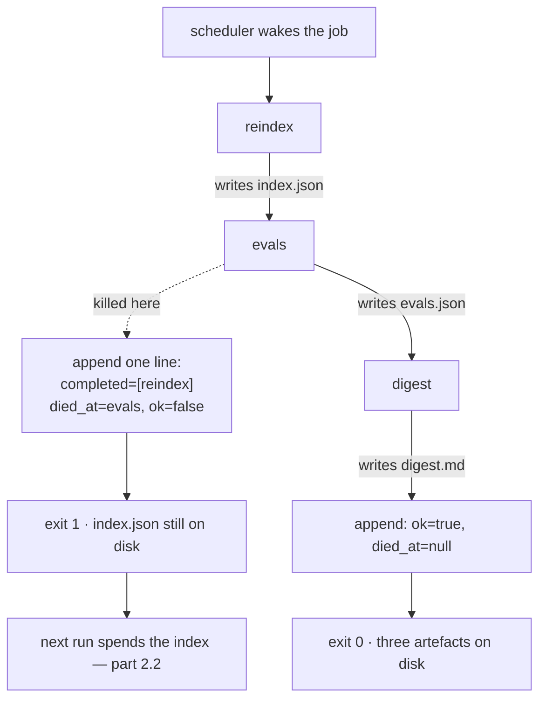

# 2.1 — The run that dies

## One-line answer

An ambient job will stop half-way, and the design question is not how to prevent that but **what the
half-finished run leaves behind**: killed during the eval stage, Sutra's nightly leaves `index.json`
on disk, **no** `evals.json`, **no** `digest.md`, an exit code of **1**, and one line in the run log
saying `"died_at": "evals"` — and that leftover index is not mess to be cleaned up, it is the only
progress the night made.

## The story

🎬 **The scene.** You send an eighty-page document to the office printer and walk away. When you come
back the machine is sitting there with an orange light on and a message about the paper tray. Forty
pages are in the output tray, warm, stacked, in order, numbered 1 to 40. Pages 41 to 80 do not exist
anywhere. The printer is not broken and nothing is on fire. It simply ran out of paper part-way
through a job nobody was standing next to.

Now you have a decision, and it is the only decision this part is about. There are forty finished
pages in the tray. Are they rubbish, or are they half the job?

😬 **The naive fix.** The tidy instinct says: a job either happens or it does not. Wrap the whole
thing in one big attempt, and if anything goes wrong, undo it — bin the forty pages, clear the
queue, reset the printer to how it was before anybody pressed print. Then the world is in a clean,
known state, and you start again from page 1 with a full tray. In code this is the `try` that wraps
everything and the `except` that deletes what was written.

💥 **Why it fails.** The forty pages cost something to make. Toner, time on the machine, and — in the
version of this that matters — a stage of work that read the whole archive and rebuilt an index.
Binning them does not put you back where you started. It puts you *behind* where you started,
because you have spent the effort and thrown away the result. Do it every time the tray runs dry and
the job never finishes at all: each attempt burns the same first half and discards it. Worse, once
the pages are gone there is nothing left to tell anybody *where* it stopped. A cleared tray and a
job that was never sent look exactly the same in the morning.

💡 **The insight.** The forty pages are not mess. They are **progress**, and they are progress
precisely because each one is a finished, valid page — not a half-printed one. The right move is to
leave them in the tray, write down that the job stopped at page 41, refill the paper, and carry on
from there. Everything in this section follows from that: leave what completed, record where it
stopped, and let the next run spend it.

Hold on to the tray. It comes back twice.

## The idea in plain language

A **stage** is one step of the job with a name and an output file. Sutra's nightly has three of
them, in a forced order, which part [1.2 and
1.3](../01-the-agent-nobody-watches/1.3-the-first-clean-run.md) established: `reindex` writes
`index.json`, `evals` reads it and writes `evals.json`, `digest` reads that and writes `digest.md`.
An **artefact** is one of those output files: the thing that outlives the process.

An **ambient** job — one nobody started and nobody is watching — gets killed. Not occasionally, and
not because your code is bad. The machine reboots for an update. The container is evicted because
something else on the node wanted the memory. A deploy restarts the host. Somebody's laptop, which
is where the scheduler actually lives, gets closed. None of these are bugs you can fix in the job,
and all of them arrive in the middle of a stage rather than politely between two.

So "how do I stop it dying" is not a design question, because you cannot. The design question is the
one the printer asked: **what is on disk afterwards, and can anybody tell what happened?**

There are exactly three postures a job can take, and only one of them is defensible.

| Posture | What is on disk afterwards | Why it is wrong, or right |
| --- | --- | --- |
| Pretend it finished | whatever got written, plus a success record | The worst. The morning's digest is missing or stale, and the log says the night went fine |
| Clean up after itself | nothing — every artefact deleted | Throws away the only progress made, and erases the evidence of where it stopped |
| Leave the progress, record the stop | the completed artefacts, plus a log line naming the stage that died | Right. The next run can spend the progress, and a person can see what happened |

The first posture is Principle 10 broken outright — a fabricated result covering an error. Day 72
part
[3.1](../../../day-72-backoff-with-honesty/parts/03-after-the-last-retry/3.1-escalate-never-invent.md)
took that apart in the small: a function that returns a plausible answer nobody measured. This is
the same failure at the size of a whole run.

The second posture is the interesting one, because it *looks* professional. Rolling back on failure
is a real and good pattern — it is what a database transaction does. The reason it is wrong here is
worth stating precisely, and it is not "rollback is bad":

> Roll back when the partial state is **invalid**. Keep the partial state when it is **valid and
> named**.

Half a bank transfer is invalid: money has left one account and not arrived at the other, and no
reader of that state can do anything sensible with it. Half a nightly job is not like that. A
completed `index.json` is a complete, correct index. It does not know or care that the eval stage
never ran. It is a finished page in the tray.

This part only shows the death and what it leaves. Spending the leftovers is part
[2.2](2.2-stages-you-can-iterate.md), which is a single `if`.

## Why Sutra needs it

Sutra's nightly job re-indexes the support archive, runs the full eval set against it, and writes a
digest for whoever opens the repository next. Nobody starts it and nobody sits with it.

The re-index is the stage that does real work: it reads every ticket in the archive and rebuilds the
retrieval index Days 49 and 50 built. In the lab that is five tickets, so it is instant. In the
version this is a model of, it is the whole archive, and it is the reason the job runs at night
rather than on demand.

Now consider a run killed during the *second* stage, which is the eval stage. A job that cleans up
after itself deletes the freshly built index on the way out. The next night's run rebuilds exactly
the same index from exactly the same archive, having thrown away an identical copy a few hours
earlier. If the thing that killed it is not a one-off — an eviction that recurs, a machine that
reboots on a schedule — then the job burns the expensive stage every single night and never once
reaches the digest. Nobody notices, because there is no digest to notice the absence of, and part
[3.3](../03-the-morning-after/3.3-nobody-notices-silence.md) is about exactly how comfortable that
silence is.

Sutra also needs the *record*, separately from the artefacts. The three artefacts say what exists.
They do not say what was attempted. A run that died at `evals` and a run that was never woken at all
leave the same `index.json` on disk if last night's index is still sitting there — and that
ambiguity is the whole subject of part [3.1](../03-the-morning-after/3.1-the-run-log.md).

## The mechanism

`nightly.py` takes a `--fail-at <stage>` flag, which stops the run when the loop reaches the stage
with that name. Here is the branch, exactly as it is on disk, inside the `for` loop in `main()` —
quoted at its own indentation, four levels in, which is why the fence is tagged as text rather than
as Python:

```text
        if name == fail_at:
            print(f"  DIED     {name:<9} the process was killed part-way through this stage")
            _state.append_run(
                {"started": started, "completed": completed, "died_at": name, "ok": False}
            )
            print("\n  the run log records where it stopped; nothing pretends this run finished")
            return 1
```

**Line by line:**

- `if name == fail_at:` compares the stage's name against the string from the command line. It sits
  **before** the stage is called, not inside it, so the stage's output file is never written. That
  is the shape of a kill: the work does not half-happen, it does not happen. (A kill that lands
  *mid-write* is the harder case, and `When it breaks` is honest about it.)
- The `DIED` line is printed before anything is written, so the transcript reads in the order events
  actually occurred. `{name:<9}` left-pads the stage name to nine characters so `reindex`, `evals`
  and `digest` line up in a column, which matters more than it sounds: this output is read by
  somebody scanning for the one line that is not `ok`.
- `_state.append_run({...})` appends **one line of JSON** to `state/runs.jsonl`. Append-only, never
  rewritten — a file you only ever add to cannot lose a row to a later bug, which is the argument
  Day 69 made about audit records. The whole log is written here, at the end, rather than being held
  in memory and flushed later, because the process is about to stop existing.
- `"completed": completed` is the list of stage **names** that finished, not a count. This is the
  line most people write as `len(completed)` and it is worth the paragraph below.
- `"died_at": name` is the stage the run stopped **in**. It is the printer's "stopped at page 41": a
  location, not a verdict.
- `"ok": False` is the verdict, and it is a separate field from `died_at` on purpose. Also below.
- `return 1` is the exit code. `main()` is invoked as `raise SystemExit(main())`, so this becomes
  the process's status. `0` means success by universal convention and anything else means failure,
  and it is the **only** thing a scheduler, a CI job or a container runtime reads. A job that dies
  and exits `0` is invisible to every piece of infrastructure above it.

**Why `completed` is a list of names and not a count.** A count is only meaningful if you also know
the stage list, and know that it has not changed since the line was written. Insert a stage, rename
one, or reorder them, and `"completed": 2` silently means something different on Tuesday than it
meant on Monday — and the log is append-only, so Monday's rows are still there being misread. Names
do not have that problem: `["reindex", "evals"]` says what it says forever. Names also survive the
case a count cannot express at all, which arrives in the very next part — a resumed run **skips**
stages it did not perform, and `completed` then means "these are on disk", not "these ran tonight".
Finally, this file is read by a person at breakfast. `["reindex"]` needs no lookup table.

**Why `ok` is a separate field from `died_at`.** You could derive it: `ok = died_at is None`. Two
reasons not to. First, a derivation is a rule the reader has to know, and the first query anybody
writes against this log at speed is `grep '"ok": false'`, not a nested condition. Second, and more
importantly, the derivation is only correct while dying inside a named stage is the *only* way a run
can go badly, and it is not. Part [2.3](2.3-two-runs-at-once.md) adds a run that is refused before
it starts a single stage: `died_at` is `null` because it never got into a stage, and `ok` is `false`
because the run did not happen. Deriving would have called that a success. **`died_at` answers
where, `ok` answers whether** — and a field that answers "whether" should never be reconstructed
from a field that answers "where".

Now run it. Kill the run in the second stage:

```bash
cd days/day-73-ambient-agents/lab
uv run python nightly.py --fail-at evals; echo "exit: $?"
```

**Line by line:**

- `cd` into the lab first. `nightly.py` does `import _state` by plain name, so the lab directory has
  to be the working directory or the import fails.
- No `--resume`, so `main()` calls `_state.fresh()` and empties `state/` before starting. Every
  transcript on this page therefore begins from nothing, which is what makes them reproducible.
- `--fail-at evals` names the stage to stop in. `reindex` runs and writes its file; `evals` does
  not.
- `; echo "exit: $?"` prints the exit status of the command that just finished. Semicolon rather
  than `&&`, because `&&` would not run after a failure and the failure is the entire point.

Measured on 2026-09-06:

```text
nightly run, started 2026-09-06T03:00:00+00:00

  ok       reindex   rows=5
  DIED     evals     the process was killed part-way through this stage

  the run log records where it stopped; nothing pretends this run finished
exit: 1
```

Read the last two things first. The process said, in words, that it did not finish, and it said it
again in the only language a scheduler understands: `exit: 1`.

The same shape one stage further on, so you can see that nothing about it is special to `evals`:

```bash
uv run python nightly.py --fail-at digest; echo "exit: $?"
```

**Line by line:**

- Same command, one different string. There is no per-stage failure handling anywhere in the file —
  the branch is inside the loop, so every stage gets the identical treatment. That is why this is a
  loop over `STAGES` and not three hand-written calls, which is part
  [2.2](2.2-stages-you-can-iterate.md)'s subject.
- No `cd` this time: the working directory persists from the previous command.

Measured on 2026-09-06:

```text
nightly run, started 2026-09-06T03:00:00+00:00

  ok       reindex   rows=5
  ok       evals     passed=3 total=5
  DIED     digest    the process was killed part-way through this stage

  the run log records where it stopped; nothing pretends this run finished
exit: 1
```

Two stages of progress in the tray this time, and the same honest ending. Three of five eval cases
passed, which is the deliberately failing eval set part 1.3 introduced.

Here is the table the whole part exists to fill in — the same job, two endings, compared by what a
person or a later run finds on disk:

| On disk | After a clean run | After `--fail-at evals` |
| --- | --- | --- |
| `state/index.json` | 5 rows | **5 rows** — written before the death |
| `state/evals.json` | 5 scored cases | absent |
| `state/digest.md` | present | absent |
| `state/runs.jsonl` | `"died_at": null, "ok": true` | `"died_at": "evals", "ok": false` |
| exit code | `0` | `1` |

The one row that carries the argument is the first. `index.json` is not a fragment. It is the same
file, byte for byte, that a clean run produces, because `reindex` finished. That is the forty pages
in the tray.

Now the log itself:

```bash
cat state/runs.jsonl
```

**Line by line:**

- `cat` rather than a JSON tool, because the file is **JSON Lines**: one complete JSON object per
  line, appended, never re-serialised as a whole. That format exists precisely so a process that
  dies cannot corrupt the rows already written — the worst it can do is leave a truncated final
  line.

Measured on 2026-09-06, after the `--fail-at digest` run above and then a resumed run:

```text
{"started": "2026-09-06T03:00:00+00:00", "completed": ["reindex", "evals"], "died_at": "digest", "ok": false}
{"started": "2026-09-06T03:00:00+00:00", "completed": ["reindex", "evals", "digest"], "died_at": null, "ok": true}
```

The first line is this part's run: it got through `reindex` and `evals`, and died in `digest`. The
second line belongs to part [2.2](2.2-stages-you-can-iterate.md)'s resumed run, and it is here only
to show that the two are distinguishable at a glance. Do not read anything into *how* it resumed
yet.

Two things in that output are honest simplifications, and both are worth naming now rather than
being discovered later:

- **Both lines carry the same `started` value.** `main()` uses a hard-coded `datetime(2026, 9, 6, 3,
  0, tzinfo=UTC)` so that every transcript on this day is reproducible. A real job uses
  `datetime.now(UTC)`, and then `started` is the field that tells two runs apart. Part
  [3.1](../03-the-morning-after/3.1-the-run-log.md) leans on that.
- **A non-resumed run deletes the log.** `_state.fresh()` empties the whole `state/` directory,
  `runs.jsonl` included. That is a reproducibility device for a teaching lab and it is exactly wrong
  for a real one: the run log is the one file you never delete, because its value is entirely in the
  rows from nights you have forgotten. The two lines above survive only because the second run was a
  `--resume`, which skips `fresh()`.

The shape, drawn:



## When it breaks

**`--fail-at` is a simulation, and it is the optimistic one.**

This matters enough to state bluntly, because everything above was produced by a flag rather than by
a kill. When `--fail-at` fires, the process is alive and cooperative. It gets to print a line. It
gets to open `runs.jsonl` and append a row. It gets to choose its own exit code. None of that is
available to a process that is actually killed.

A real death comes in several flavours, and they are not equally polite:

| How it dies | Does the job get to run any code? | What reaches the run log |
| --- | --- | --- |
| An exception inside a stage | yes — `except` and `finally` both run | whatever you wrote in the handler |
| `SIGTERM` (a polite stop, a deploy draining) | yes, if you installed a handler; otherwise the process ends | a row, only if you asked for one |
| `SIGKILL`, a power loss, a container eviction, an OOM kill | **no** | **nothing at all** |

The last row is the honest case, and it is the one this lab does not reproduce. `SIGKILL` cannot be
caught, blocked or handled — that is its definition. No `finally` runs. No buffer is flushed. The
kernel reclaims the process and the shell reports the status as `137`, which is the convention `128
+ 9` for "terminated by signal 9". On Windows the same thing arrives as a hard `taskkill /F` or a
machine losing power, with the same result: nothing runs.

So the pessimistic case looks like this: the run started, some artefacts appeared, and **the log has
no row for it at all**. Not a row saying it died. No row. In the lab as written, `append_run` is
only ever called at the end of the run, so a real kill leaves `runs.jsonl` exactly as the previous
night left it. A run that died and a run the scheduler never fired produce the same log.

That gap is not a bug to fix here, it is the reason two later parts exist:

- Part [3.1](../03-the-morning-after/3.1-the-run-log.md) is the fix — write a row when the run
  **starts**, not only when it ends, so an unterminated row is itself the evidence of a kill.
- Part [3.3](../03-the-morning-after/3.3-nobody-notices-silence.md) is what happens when you do not:
  absence is not an alert, and nobody is paged by a file that failed to change.

Take the printer back. `--fail-at` is the printer showing an orange light and a message saying *out
of paper at page 41*. The real case is the printer losing power: forty pages in the tray, no
message, no light, and nothing anywhere that says a job was ever sent.

**The second thing this lab does not reproduce: a kill during a write.** The branch fires between
stages, so every artefact is either absent or complete. A real kill can land inside
`path.write_text(...)`, leaving a `index.json` that is half a JSON document — a file that exists,
has a plausible name and a recent timestamp, and explodes on the next read. Chop the lab's own
`index.json` off mid-token and ask the evals stage for it:

```bash
cd days/day-73-ambient-agents/lab
uv run python -c "
import _state, nightly
_state.fresh()
nightly.reindex()
raw = _state.INDEX.read_text(encoding='utf-8')
_state.INDEX.write_text(raw[:58], encoding='utf-8')
nightly.run_evals()
"
```

**Line by line:**

- `nightly.reindex()` writes a complete, valid `index.json` first, so what follows damages a real
  artefact rather than a made-up one.
- `raw[:58]` keeps the first 58 characters and throws the rest away. That is what a kill during
  `write_text` leaves: a prefix, ending wherever the process happened to stop.
- `nightly.run_evals()` is the next stage doing what it always does. It is not being tricked; it is
  reading the file its guard just told it was present.

Measured on 2026-09-06, the last line of the traceback:

```text
json.decoder.JSONDecodeError: Unterminated string starting at: line 5 column 5 (char 52)
```

That is the truncated-page case, and it is the one that breaks the "valid and named" rule the idea
section leaned on: a half-written artefact is *not* a finished page. `_state.write` says so in its
own docstring — it writes directly, and atomicity is Day 60's subject rather than this day's. The
production fix is one line and it is named below.

## In production

**What changes at scale is the price of the discarded half.** Three stages over five tickets is a
teaching size, and at that size rolling everything back and starting again costs nothing, which is
exactly why the wrong posture survives review in a small system. A real nightly has stages that read
the whole archive, call a model per eval case, or push a rebuilt index somewhere. Then "throw away
what completed" is not a tidiness preference, it is a decision to re-spend the largest cost in the
system, and to re-spend it *again* on the next attempt. If the killer recurs — a nightly eviction
window, a host that patches on a schedule — the job that cleans up after itself converges on doing
the first stage forever and never reaching the last one. The job that leaves its progress converges
on finishing.

**What a professional adds, in the order they add it.**

| Addition | What it buys | Where it lands |
| --- | --- | --- |
| A row written when the run *starts* | a kill becomes visible as a row with no ending | part [3.1](../03-the-morning-after/3.1-the-run-log.md) |
| Atomic artefact writes | no half-written file can ever be mistaken for a complete one | write to `index.json.tmp`, then `os.replace` |
| Stages that are safe to redo | a resumed or retried stage cannot double-apply anything | the day's [paper](../../papers/01-idempotence.md) |
| An alert on `ok: false` and on *no row at all* | somebody finds out without opening the repository | part [3.3](../03-the-morning-after/3.3-nobody-notices-silence.md) |
| Bounded automatic retries of the whole run | most kills are transient and fix themselves | Day 72's ladder, applied to a job rather than a call |

The atomic write deserves its one line, because it is the cheapest thing on the list and the one
most often missing. `os.replace` is atomic on POSIX and on Windows: after it, readers see either the
old file whole or the new file whole, never a partial one. Writing to a temporary name in the same
directory and then replacing turns "a kill during a write" from a corrupt artefact into a no-op,
which puts the real system back into the clean situation the lab simulates.

**The trap that appears only at scale: stage granularity.** Three stages means resume can only ever
restart from three places. A stage that processes a million rows and is killed at row 900,000
restarts at row zero, and no run log will save you from that. The production answer is to make the
unit of completion smaller than the unit of work — checkpoint per batch, per shard, per partition —
and to accept that you now have far more small artefacts and need to know which of them belong to
which run. That trade is real: fine checkpoints cost bookkeeping and buy recovery, and the right
granularity is the one where redoing a single unit is cheap enough to shrug at.

**What degrades quietly.** The failure this part guards against does not announce itself. A job that
silently rolls back looks *healthier* than one that leaves half-built state around, because the
directory is always clean and nothing ever looks weird. The symptom is not an error, it is that the
last stage's artefact keeps having yesterday's content, and the person who would notice is the
person who reads the digest — who has no reason to check whether it is new. Every cost of this bug
is paid by somebody other than the author of the `except` block.

*The review comment a senior engineer leaves:* **"The `except` around the whole run deletes the
artefacts on the way out, so a kill during the eval stage throws away an index that finished
correctly. Rollback is right when the partial state is invalid — half a transfer — and wrong here,
because a completed `index.json` is a complete index and the next run can use it. Leave it, and
record where the run stopped. Two more things while you are in there. `append_run` is only called at
the end, so a `SIGKILL` leaves no row at all and a run that died is indistinguishable from one the
scheduler never fired — write a row when the run starts. And `write()` uses `write_text` directly,
so a kill mid-write leaves a truncated JSON file that the next stage will read; write to a temp name
in the same directory and `os.replace` it, which is atomic on both platforms we run on."**

*The interview question:* **"Your nightly job gets killed half-way through. What does it leave
behind?"** An honest answer: **"Whatever the completed stages wrote, on purpose, plus one
append-only line in a run log saying which stage it stopped in and that the run was not ok, plus a
non-zero exit code. The instinct is to roll everything back so the state is clean, and that is wrong
here: each stage's artefact is individually valid, so the leftovers are progress and the next run
skips straight past them. I've built this — killed during the eval stage it leaves the index, no
scores, no digest, exit 1, and a row reading `completed: [reindex], died_at: evals, ok: false`. Two
details I'd defend in review: `completed` is a list of stage names rather than a count, because a
count silently changes meaning the day somebody inserts a stage and the log is append-only; and `ok`
is stored rather than derived from `died_at`, because a run refused by a lock never enters a stage
and would otherwise be logged as a success. The thing I'd flag about my own version is that the flag
I use to demonstrate it is a simulation. A cooperative failure gets to write that log row. A
`SIGKILL` or an eviction does not, so in production I write a row when the run starts as well as
when it ends — otherwise a run that died and a run that never started look identical, and the second
one is the failure nobody notices."**

## Check yourself

```bash
cd days/day-73-ambient-agents/lab
uv run python nightly.py --fail-at reindex; echo "exit: $?"
ls state/
cat state/runs.jsonl
```

Before you run it, write down what `ls state/` will print and what `completed` will be. Then run it
and check. If you predicted an empty `completed` list, say what that empty list means to the *next*
run.

Then simulate the pessimistic case by hand. Start a run, kill it from another terminal or from Task
Manager rather than letting `--fail-at` do it politely, and record two things: what `state/`
contains, and what `runs.jsonl` contains. Then write one sentence naming the exact field that would
have made that kill visible, and say which part adds it.

**Out loud, without scrolling up:** a run killed in the eval stage leaves `index.json` behind. Say
in one sentence why that file is progress rather than mess, and name the property of `index.json`
that makes the distinction hold.

**Next:** [2.2 — Stages you can iterate](2.2-stages-you-can-iterate.md).
