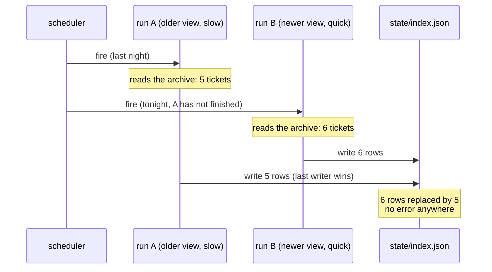

# 2.3 — Two runs at once

## One-line answer

A scheduler fires on a clock, not on whether the last run finished — so two runs can be alive at the
same time writing the same files, and the one that finishes **last** wins regardless of which one is
**newer**: measured, a 6-row index is silently replaced by a 5-row one with nothing anywhere
reporting an error, and the fix is a lock taken before the first stage whose important property is
that the loser **refuses and says so**.

## The story

🎬 **The scene.** There is a whiteboard in the shared kitchen at work with the week's rota on it —
who is opening up, who is doing the coffee run, who is locking the cupboard. It is a scruffy grid in
marker pen, and it is the only place that information exists.

On Monday you take a photo of it on your phone, because you always do.

On Tuesday somebody swaps two names on the board: they cannot do Thursday any more, so a colleague
has taken it and the board now says so. You were not there. Then on Wednesday you notice the board
is getting smudged and unreadable, so you do the helpful thing. You wipe it clean and rewrite it
neatly — copying carefully, line by line, from the photo on your phone.

The board is now beautiful. It is also wrong. Thursday has the old name on it again, and the swap
that was agreed on Tuesday has stopped existing.

😬 **The naive fix.** "So be careful when you rewrite it." Check the board looks right. Read it back
against the photo. Do the copying slowly.

💥 **Why it fails.** Every one of those checks compares the board against **your photo**, and your
photo is the stale thing. There is nothing on the board that says when it was last changed, and
nothing in your hand that says when the photo was taken. Both look equally authoritative. You did
the work correctly and completely; you simply did it from an old view of the world, and the board
has no way to notice, because a whiteboard's rule is that the last person to write on it wins. The
person who made the Tuesday swap will find out on Thursday morning when nobody turns up.

💡 **The insight.** The mistake was not the copying. It was that two people were allowed to be
mid-edit of the same board, and the board could not tell a fresh edit from a stale one. Two fixes
exist and they are different in kind. You can put the date on the board and refuse to overwrite
something newer than your photo — that fixes the **data**. Or you can hang a marker pen on a single
hook and let only the person holding it write — that fixes the **access**. This part builds the
second one, and it deliberately keeps the whiteboard in mind for what happens when somebody walks
off with the pen.

## The idea in plain language

Part [2.1](2.1-the-run-that-dies.md) asked what one run leaves behind when it stops, and part
[2.2](2.2-stages-you-can-iterate.md) made the next run able to spend those leftovers. Both of them
quietly assumed that there is only ever **one run**.

There is not, and the reason is one sentence: **a scheduler fires on a clock, not on whether the
last run finished.** That is not a bug in any particular scheduler. It is what a schedule *is* — a
list of instants at which to start a command. Nothing in `cron`, in Windows Task Scheduler, or in
the trigger sources ADK offers looks at whether the previous invocation is still running before
starting the next one, and part [4.2](../04-what-wakes-it/4.2-the-scheduler-you-already-have.md)
lists that among the things the scheduler will not do for you.

Most nights this is invisible, because the job finishes long before the next trigger. Then one night
it does not: the archive has grown, a provider is slow, the machine is busy with something else. The
next trigger fires anyway. Now two processes are alive, both convinced they are the nightly job, and
both about to write `state/index.json`.

Here is the part people get wrong. The instinct is that the older run will lose, because it started
first and its work will be overwritten by the newer one. The opposite is true, and it is true for a
dull mechanical reason:

> Writing a file does not merge, compare or check. The content of the file afterwards is whatever
> the **last writer** put there. And the last writer is the **slowest** run, not the newest one.

That rule has a name — **last-writer-wins** — and it is the default behaviour of every filesystem,
every plain `PUT` to object storage, and every `UPDATE` that does not carry a condition. Being newer
buys nothing. Being slow buys everything. The slow run is precisely the run whose view of the world
is oldest, so last-writer-wins hands the file to the most out-of-date participant available. That is
the whiteboard: the person copying from Monday's photo is the person who writes last.

Two more terms, because the rest of the part leans on them.

A **race condition** is a bug whose appearance depends on the *order* in which two things happen,
where nothing in the program controls that order. It is called a race because the two participants
are effectively racing, and the outcome changes depending on who arrives first. Race conditions are
miserable to debug for one reason above all others: they are correct most times you run them.

A **lock** is the fix for a race that you cannot reorder: a marker that a participant takes before
touching the shared thing and gives back afterwards. If the marker is already taken, you did not get
it, and you have to do something about that. Only one participant can hold it at a time, which is
why the property is called **mutual exclusion** — the two are excluded from the resource by each
other.

The interesting half of a lock is not the taking. It is the branch that runs when you **did not** get
it, and there are only two answers:

| When the lock is already held | What the second run does | What it costs |
| --- | --- | --- |
| Refuse | exits immediately, saying which run it lost to | tonight's second run does not happen at all |
| Wait | blocks until the holder releases, then runs | runs pile up behind a slow or stuck holder |

This part refuses, and the refusal is the thing to notice. A refused run is not a failure that got
swallowed — it is a run that **announced** that it did not happen, which is Principle 10 applied to
a whole process rather than to a function call.

## Why Sutra needs it

Sutra's nightly job re-indexes the support archive, runs the full eval set, and writes the digest
somebody reads in the morning. Three stages, three artefacts, all of them files under `state/`.

Every one of those files is written with a plain `write_text`, which `_state.write` does directly.
That means every one of them is last-writer-wins, and the `index.json` that survives is the one the
slowest run happened to produce.

There is a specifically Sutra-shaped reason this is not hypothetical. Part 2.2 made the job
resumable, which is a real improvement and does nothing at all about this. A resumed run is still a
run, still started by the same schedule, and now there is a second way for two of them to overlap:
the operator who re-runs a failed job by hand, at the moment the scheduler was going to fire anyway.
Resume shortens a run; it does not stop two runs coexisting.

And the blast radius is not the index. The index feeds the eval stage, and the eval stage feeds the
digest, which part [3.2](../03-the-morning-after/3.2-the-digest-that-reassures.md) calls the entire
interface between this job and the people who own it. A ticket that vanishes from the index vanishes
from the evals and never appears in the digest. Nobody reads the index. Everybody reads the digest,
and the digest will be internally consistent, cheerful, and built on a view of the archive that
somebody deleted by finishing slowly.

## The mechanism

`lock.py` puts the two runs side by side and lets you switch the lock on. It is deliberately narrow:
one shared artefact, two runs, one flag.

The mechanism is nine lines, and one string in it is doing all the work:

```python
def take_lock() -> bool:
    """Create the lock file, or report that somebody else holds it.

    `x` mode is the whole mechanism: create-exclusive fails if the file is already there, and the
    check-and-create is one syscall rather than two, so two processes cannot both pass it.
    """
    _state.STATE.mkdir(parents=True, exist_ok=True)
    try:
        with LOCK.open("x", encoding="utf-8") as handle:
            handle.write("held")
        return True
    except FileExistsError:
        return False
```

**Line by line:**

- `-> bool` is the first design decision and the least obvious one. This function **reports**, it
  does not decide. The caller gets a yes or a no and chooses what to do about it, which is how the
  *policy* — refuse, or wait — stays out of the *mechanism*. A `take_lock()` that raised on failure
  would have baked "refuse" into the plumbing, and the day you want to wait instead you would be
  editing the lock rather than the caller.
- `_state.STATE.mkdir(parents=True, exist_ok=True)` makes sure `state/` exists before trying to
  create a file inside it. `exist_ok=True` means "do not complain if it is already there", which is
  the only sane behaviour for a directory two runs might both be creating.
- `LOCK.open("x", ...)` is the entire mechanism. `"x"` is **create-exclusive** mode: create this
  file, and fail if it already exists. Not "open it", not "truncate it" — create it or fail.
- Here is why `"x"` and not the version almost everybody writes first:

  ```python
  if not LOCK.exists():  # ← check
      LOCK.write_text("held")  # ← create
  ```

  That is **two** operations with a gap between them. Run A asks "does it exist?" and is told no. The
  operating system is free to run run B at that instant, which also asks "does it exist?" and is also
  told no. Both then write, both believe they hold the lock, and the lock has protected nothing. The
  gap between checking a condition and acting on it is the race condition defined above, and this
  particular shape of it is common enough to have its own name: **time-of-check to time-of-use**.
  `"x"` closes the gap because the check and the create happen inside a **single system call** — a
  single request to the operating system, which the kernel completes for one process before it
  considers the other. There is no instant in between for a second process to occupy.
- `handle.write("held")` puts a body in the file. Nothing reads it today, and part
  [2.4](2.4-the-lock-nobody-released.md) is about what should have gone in there instead.
- `except FileExistsError: return False` is the losing branch. The file already existing is not an
  accident to be logged and retried past — it **is** the answer to the question the function asks, so
  it is caught precisely and converted into a `False`. Catching it narrowly matters: a broad
  `except Exception` here would turn a full disk or a permissions problem into "somebody else holds
  the lock", which is a lie about a different failure.
- `return False` rather than `raise`. Same point as the return type, from the other end: the caller
  is the one with enough context to know whether losing the lock is a disaster or a Tuesday.

**Line by line** for the inner block above: the two lines are shown to be rejected, not adopted —
`LOCK.exists()` returns the state of the world at the moment it is called, and `LOCK.write_text`
acts on the state of the world at the moment it is called, and nothing in the language guarantees
those are the same moment.

Now the caller, which is where the policy lives:

```python
def run(label: str, rows: dict[str, str], *, locked: bool) -> str:
    """One run's attempt to rebuild the index from its own view of the archive."""
    if locked and not take_lock():
        return f"{label}: refused, another run holds the lock"
    index = {ref: sorted(set(text.split())) for ref, text in rows.items()}
    _state.write(_state.INDEX, index)
    return f"{label}: wrote {len(index)} rows"
```

**Line by line:**

- `if locked and not take_lock():` is the whole ablation. `locked` comes from the `--lock` flag, so
  with the flag absent `take_lock()` is never even called and the two runs behave exactly as they did
  before any of this existed. Python's `and` short-circuits, which is what makes that true rather
  than merely intended.
- The check sits **before** the index is built and before anything is written. That ordering is the
  point of the phrase "taken before the first stage": a lock taken after the work is done has
  protected nothing, because the work is what conflicts.
- `return f"{label}: refused, another run holds the lock"` returns the refusal as a **normal result**,
  not an exception. This is worth being deliberate about, because "raise on the unexpected" is the
  house rule and this looks like it breaks it. It does not, for two reasons. First, another run
  holding the lock is not unexpected — it is one of the two outcomes this function is written to
  have, and it is expected on exactly the nights this whole part is about. An exception is for a
  situation the code did not plan for; a refusal is planned for. Second, a return value composes with
  the caller's reporting and an exception does not: `main()` prints both runs' results on adjacent
  lines, and the refusal has to appear in that transcript rather than unwinding the stack past it. A
  real job would carry the same idea one step further and write a run-log row with `ok: false` and
  `died_at: null`, which is exactly the row part [2.1](2.1-the-run-that-dies.md) explained the
  `ok` field existing for.
- `rows` is a parameter rather than a global, so each run can be handed a **different view of the
  archive**. That is what makes the two runs distinguishable at all: `main()` gives run A the five
  tickets the archive had when it started, and run B those five plus `ticket:4700`.
- `_state.write(_state.INDEX, index)` is the unconditional overwrite. No comparison with what is
  already there, no timestamp, no merge. Last writer wins, in one line.

Run it with no lock first — the state of the world before the fix:

```bash
cd days/day-73-ambient-agents/lab
uv run python lock.py
```

**Line by line:**

- `cd` into the lab first. `lock.py` does `import _state` by plain name, so the lab has to be the
  working directory or the import fails.
- No flag, so `locked` is `False`, `take_lock()` is never called, and both runs write.
- `main()` calls `_state.fresh()` first, which empties `state/`, so the transcript below is
  reproducible from any starting state.

Measured on 2026-09-06:

```text
lock: NONE

  run B (tonight, sees 6 tickets): wrote 6 rows
  run A (last night, still going, sees 5): wrote 5 rows

  rows in the index afterwards   5
  ticket:4700 present            NO

  The slow run finished last and overwrote the newer index with its older view.
  Nothing errored. The digest tomorrow is built on an index missing a ticket.
```

Read those four lines in order, because the order is the whole finding. Run B did its job: it saw six
tickets and wrote six rows, correctly. Run A did its job: it saw five tickets and wrote five rows,
correctly. Both reported success. Neither did anything wrong by its own lights, and the index on disk
afterwards has **five** rows and no `ticket:4700`.

That is the whiteboard, wiped and rewritten from Monday's photo. The newer information was not
rejected, argued with, or logged — it was simply painted over by somebody working carefully from an
old copy.

Now the same collision with the lock switched on:

```bash
uv run python lock.py --lock
```

**Line by line:**

- One flag different. `--lock` sets `locked = True`, which turns on the `if locked and not
  take_lock()` branch in `run()` and nothing else in the file.
- No `cd`: the working directory persists from the previous command.
- `_state.fresh()` runs again and deletes `state/`, `nightly.lock` included, so this run starts with
  the lock free. That deletion is doing more work than it looks like, and it is the seam part
  [2.4](2.4-the-lock-nobody-released.md) prises open.

Measured on 2026-09-06:

```text
lock: taken before the first stage

  run B (tonight, sees 6 tickets): wrote 6 rows
  run A (last night, still going, sees 5): refused, another run holds the lock

  rows in the index afterwards   6
  ticket:4700 present            yes

  The slow run was refused, so the newer index survived. The refusal is the point:
  the second process did not wait, it declined and said why.
```

The two runs, laid against each other:

| What you find in the morning | No lock | With a lock |
| --- | --- | --- |
| rows in `state/index.json` | **5** | **6** |
| `ticket:4700` present | **NO** | yes |
| did anything error | no — both runs reported writing successfully | no — but one run reported refusing |
| what tomorrow's digest is built on | an index missing a ticket | the newer, complete index |

The third row is the one to sit with. **Neither** column contains an error, and that is not an
oversight in the lab — it is the finding. A missing lock does not produce a traceback, a non-zero
exit code, a warning, or an odd-looking file. It produces a perfectly valid index with one fewer
row in it. There is no monitoring you can bolt on that catches this by watching for failures,
because nothing fails.

The difference between the two columns is not that one errored and one did not. It is that in the
right-hand column, one process **said out loud that it did not run**. That sentence is the artefact
the fix produces.

The shape of the collision, drawn:



## When it breaks

Three things about the fix above are weaker than they look, and one of them is weak enough that the
next part is entirely about it.

**A lock file is not a distributed lock.** Everything above works because both runs are looking at
the same `state/nightly.lock` on the same filesystem, and the kernel that owns that filesystem is the
thing serialising the two create-exclusive calls. Take that away and the mechanism evaporates. Two
containers with separate volumes each have their own `state/` directory, so both create the file,
both are told they got it, and both proceed — the lock now protects each process from itself, which
is a guarantee nobody needed. The same is true of two machines, and it is *subtly* true of a network
filesystem, where exclusive-create semantics depend on the protocol and the server rather than on
Python. What real systems reach for instead is a **lease**: a row in a shared database, or a key in a
coordination service, that one holder owns and that **expires on its own** after a set period. The
expiry is the part that matters and the part a file cannot easily have. This document has not
measured any of that, and is not going to pretend otherwise — the claim here is only that the
file-based mechanism stops working the moment the filesystem stops being shared.

**The lab's two runs are sequential, not concurrent.** `lock.py` calls `run()` twice, one after the
other, inside a single process. Nothing races. That is a deliberate choice, because a genuinely
concurrent demonstration is non-deterministic and would print something different each time, and a
transcript that changes between runs teaches nothing about which mechanism produced it. The ordering
you see — B writes, then A overwrites — is imposed by the order of the two calls in `main()`.

What survives that simplification, and what does not, is worth being exact about. The **mechanism**
under test is unchanged: `"x"` mode is the same system call whether the two callers are two functions
or two processes, and the second call fails with `FileExistsError` for exactly the same reason. The
**collision** is simulated: two real runs on a real machine would interleave in ways this file cannot
reproduce, including the case where one is killed between taking the lock and writing anything. Say
it plainly — this demo shows you what the outcome is, not that a race occurred.

**Refusing is a policy choice, and it has a price.** The refused run does not happen. Tonight's
re-index, evals and digest simply do not exist for that invocation, and the only reason that is
acceptable here is that the work is a **rebuild**: the next trigger does the same job over the same
archive and nothing is lost but a night. Point the same policy at a job whose work cannot be skipped
— consuming a queue, sending the invoices, exporting the day's records — and refusing is not
politeness, it is data loss with a friendly message attached.

The obvious alternative is to **wait** for the lock instead of refusing, and it trades one failure
for another. A waiting run consumes a process, a container slot and a scheduler worker while it does
nothing, and if the holder is stuck rather than slow, every subsequent night's run joins the queue
behind it. What was one hung process becomes a growing pile of hung processes, all of them waiting
for a lock that is never coming back, and the pile is usually discovered when something unrelated
runs out of memory. Neither answer is free. The honest version of this decision is to pick the one
whose failure you would rather explain, and to write down which one you picked and why.

And one thing the fix above does **not** address at all: nothing in `lock.py` ever deletes
`nightly.lock`. The only reason the second command worked is that `_state.fresh()` wiped the
directory first. A lock that is taken and never released is not a smaller problem than the one it
solved — it is a bigger one, and it is part [2.4](2.4-the-lock-nobody-released.md).

## In production

**What changes at scale is that the overlap stops being rare.** Overlap is a relationship between two
numbers: how long a run takes, and how often the trigger fires. The second number is written once
into a schedule and then never revisited. The first number grows with your data. A job that
comfortably finishes between triggers when the archive is small will, as the archive grows, creep up
until one night it crosses the interval — and the first night it crosses, it does not fail. It
silently overlaps. Then it overlaps most nights. Then it overlaps always, and the system settles into
a steady state where every night's index is written by the previous night's run. Everything still
"works". The data is just quietly stale by one night, forever, and the graph that would have shown
you this is a graph of run duration against schedule interval that nobody drew.

**What a professional adds, in the order they add it.**

| Addition | What it buys | Why the file lock alone does not |
| --- | --- | --- |
| `concurrencyPolicy: Forbid` on the scheduled job | the platform never starts a second run | the strongest fix, because the second process never exists |
| A lease with an expiry in a shared store | works across machines and containers | a file lock is only as shared as its filesystem |
| Owner details written into the lock — host, process id, start time | the refusal names who holds it | this lock's body is the string `held`, which identifies nobody |
| A guaranteed release, including on a kill | one crash does not refuse every night after it | nothing here releases anything — part 2.4 |
| A generation number on the artefact, checked before writing | an older run cannot overwrite a newer file even if it gets through | fixes the data, where the lock fixes the access |
| An alert when a run is refused | somebody finds out that runs are being skipped | a refusal is currently one line of output nobody reads |

The last two are the ones people skip. A refusal that nobody sees is indistinguishable from a run
that succeeded, which puts you back in the failure this whole part is about, one level up. And the
generation number is worth understanding as a genuinely different fix rather than a nicety: instead
of controlling *who may write*, it makes the write itself conditional — read the current file's
generation, refuse to replace it with content derived from an older one. That is the whiteboard with
the date written in the corner, and it survives the case where two writers both believe they hold
the lock, which is exactly the case the container-with-its-own-volume produces.

**What degrades quietly.** Notice which of these failures has an owner. A crashed run wakes somebody
up. A refused run appears in a log. A silently overwritten index has no owner at all: the run that
caused it exited zero, the run whose work was destroyed also exited zero, and the person who would
notice is reading a digest that describes the stale index accurately and confidently. Part
[3.3](../03-the-morning-after/3.3-nobody-notices-silence.md) is the general form of that — the
failures with no one to report them are the ones that live longest.

**The review comment a senior engineer leaves:** *"Three stages that all write to fixed paths, and
nothing stops two runs doing it at once. The scheduler doesn't check whether last night's is still
going — that's not what a schedule does — and the run that wins is the slow one, which is the one
with the oldest view of the archive. So the failure is a newer index being replaced by an older one
with no error, which we will find weeks later when a ticket is missing from search. Take a lock
before the first stage and refuse if you don't get it; use create-exclusive so the check and the
create are one operation, because the `exists()`-then-`write()` version has a gap in it. Two follow-
ups in the same change, please. Set `concurrencyPolicy: Forbid` on the scheduled job so the platform
handles the common case and the lock is only a backstop. And tell me what releases the lock when the
pod is evicted mid-run, because right now I think the answer is nothing, and that turns one bad night
into every night."*

**The interview question:** *"Your nightly job is scheduled to run every night. What happens the
night it takes longer than a night?"* An honest answer: *"The scheduler fires anyway — it's a clock,
not a supervisor — so you get two runs alive at once writing the same files. The counter-intuitive
part is who wins: writes are last-writer-wins, so the file ends up with whatever the slowest run
put there, and the slowest run is the one with the oldest view of the data. I built this: a run that
saw six tickets wrote six rows, the older run finished after it and wrote five, and the index was
left with five and no error anywhere. Both processes exited zero. The fix is a lock taken before the
first stage — a file opened in create-exclusive mode, so the check-and-create is one syscall and
there's no gap for the second process to slip through — and the important property isn't that the
loser waits, it's that it refuses and says so, because a run that didn't happen has to be visible.
Two things I'd flag about my own version. A lock file only works while both runs share a filesystem;
across containers or machines you need a lease with an expiry in a shared store. And a naive lock is
arguably worse than none, because nothing releases it if the process is killed — one crash and every
subsequent night refuses. In production I'd let the platform forbid concurrent runs and keep the lock
as a backstop, and I'd also put a generation number on the artefact so an old run physically can't
overwrite a newer one even if it does get through."*

## Check yourself

```bash
cd days/day-73-ambient-agents/lab
uv run python lock.py
cat state/index.json | head -20
uv run python lock.py --lock
ls state/
```

Before running the first pair, predict two numbers: how many rows the index will have, and how many
of the two runs will report an error. Then run it and check. If you predicted six rows, write one
sentence naming the assumption you made that the code does not.

Then look at what `ls state/` prints after the `--lock` run, and answer this: the file `nightly.lock`
is still sitting there. What happens on the **next** run if `_state.fresh()` is not called first?
Write your answer down before reading the next part — it is the whole of it.

**Out loud, without scrolling up:** two runs of the same job overlap, one started last night and one
started tonight. Which one's data ends up in the file, and why is it not the newer one?

**Next:** [2.4 — The lock nobody released](2.4-the-lock-nobody-released.md).
