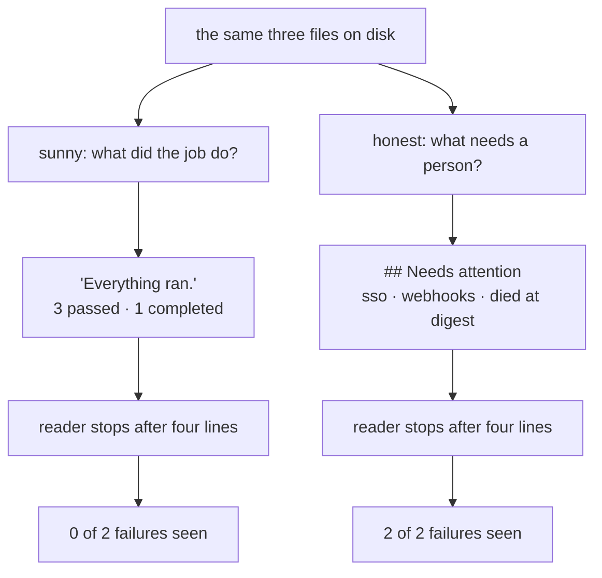

# 3.2 — The digest that reassures

## One-line answer

The digest is the **entire interface** between a job nobody watched and the people who own it, and
its failure mode is not being wrong — it is being **reassuring**: measured, the success-only digest
names **0** of the **2** failing eval cases while every number in it is true, and the attention-first
digest names **2** from the same three files, because the fix is not more information, it is
**ordering**.

## The story

🎬 **The scene.** You leave the car at the garage for its annual service and pick it up in the
evening. Waiting on the counter is the job sheet: oil and filter changed, air filter replaced, wipers
replaced, tyres rotated, washer fluid topped up, washed and vacuumed. Seven lines, each with a price
next to it, and a total at the bottom. You read it, it all makes sense, you pay and you drive home
feeling good about the car.

Three weeks later the brakes start making a noise on a hill. You take it back, and the mechanic
looks up your service and turns the screen round. The front pads were measured that day. They were
down to two millimetres. Nobody wrote it on your sheet, because the sheet was a list of **work that
was done**, and measuring a pad and finding it thin is not work that was done. It is work that
somebody now has to book in.

Nothing on that sheet was false. Every line on it happened, at the price printed beside it. The one
thing you needed to know was not on it.

😬 **The naive fix.** Next time, you ask for the full picture: everything they looked at, not just
everything they changed.

💥 **Why it fails.** The sheet comes back with twenty-three lines instead of seven. Every check they
performed is on it. And *front pads 2mm* is line nineteen, under a heading called **Notes**, after
eighteen lines of completed work, in the same font and the same size as *washer fluid topped up*. You
read the first few lines the way anybody reads a bill they are about to pay, see work done and
prices, and hand over the card. The line that mattered is in there. It is further down than it was
before.

💡 **The insight.** The garage that has this right hands you a sheet with a short block at the very
top: **needs attention — front brake pads, 2mm, book it in.** Then, underneath, the same list of
work as before. Nothing was added. Nothing was hidden. **The order changed**, and the order is what
decides whether a reader who stops after four lines has seen the thing that mattered.

Hold on to those two blocks — *needs attention* at the top, *what was done* below. They are the two
headings in the code for the rest of this part.

## The idea in plain language

A **digest** is a short written summary that a program produces for a person to read later. Sutra's
nightly job writes one, `state/digest.md`, as its third and final stage.

For an ambient job the digest is not one output among several. It is the **interface** — the whole
of what passes between the job and the people responsible for it. Part
[1.1](../01-the-agent-nobody-watches/1.1-nobody-is-watching.md) took away the person who would have
been watching the console; the digest is what replaces them, and there is nothing else. The run log
from part [3.1](3.1-the-run-log.md) exists too, but nobody opens a log file over breakfast. A log is
read by somebody who has already decided something is wrong. The digest is what tells them.

That makes it the most safety-critical file the job writes, and the danger is not the one people
expect. Nobody worries much about the digest printing a wrong number, because a wrong number is a
bug, and bugs get found. The danger is the digest being **completely truthful and completely
reassuring at the same time**, which is not a bug in any line of it and therefore gets found by
nobody.

Two shapes, and the difference between them is one decision:

- A **success-only digest** answers *what did the job do?* It is written by listing the things the
  job performed and counting how many of them went well. Every sentence in it is a report of work
  completed. This is the garage's first sheet.
- An **attention-first digest** answers *what does a person have to do?* It begins with the things
  that need somebody, names them individually, and only then reports what happened. This is the
  sheet with the block at the top.

The first shape is not written by careless people. It is written by whoever is closest to the code,
because *what did the job do* is the question the author of the job has in their head while they are
writing it. The reader has a different question, and the reader is not in the room.

There is one more term, because the rest of the part turns on it. An **eval case** is a single named
test of the retrieval index — a query and the ticket it is supposed to find. Part
[1.3](../01-the-agent-nobody-watches/1.3-the-first-clean-run.md) ran the set: five cases, three of
which pass and two of which do not, deliberately, because a nightly job whose evals always pass is
one nobody would notice breaking.

## Why Sutra needs it

Because two of Sutra's eval cases are failing right now, and the question is whether anybody finds
out.

Everything section 2 built has an obvious symptom. A stage that dies leaves artefacts missing. Two
runs colliding leave an index one ticket short. A stale lock leaves yesterday's files sitting there
unchanged. Each of those is something you can look at and see. This one has no symptom at all: the
job ran perfectly, wrote all three artefacts, exited zero, and produced a cheerful file.

Sutra needs the attention-first shape for the same reason Day 72 part
[3.1](../../../day-72-backoff-with-honesty/parts/03-after-the-last-retry/3.1-escalate-never-invent.md)
refused to let a retry loop return `'no incidents reported'` after four failed attempts: **a system
must never hand a person a comfortable answer it did not earn.** That day's failure was a fabricated
value — a claim about the world that nothing had measured. This day's failure is stricter and
stranger, because nothing here is fabricated. Every number in the reassuring digest was measured, and
the reassurance comes from what was *left out*. Two ways to arrive at the same place: a reader who
believes everything is fine when it is not.

And Sutra needs it because of what happens to a file that never says anything. A digest that reports
successes is read carefully for a few mornings, skimmed for a few more, and then filed unread
forever, because the reader has learned — correctly — that it has never once told them to do
anything. When it finally has something to say, nobody is looking. That is the same ending part
[3.3](3.3-nobody-notices-silence.md) reaches from the opposite direction: **a digest nobody reads and
a digest that never arrives fail in exactly the same way**, because in both cases the information
existed and no person received it.

## The mechanism

Both versions live in `lab/digest.py`. Start with the one a well-meaning person writes first.

```python
def sunny(evals: list[dict], index: dict, runs: list[dict]) -> list[str]:
    """The digest a well-meaning person writes first."""
    passed = sum(1 for r in evals if r["passed"])
    return [
        "# Nightly digest",
        "",
        "Everything ran.",
        "",
        f"- index rebuilt: {len(index)} rows",
        f"- evals: {passed} passed",
        f"- runs completed: {sum(1 for r in runs if r['ok'])}",
    ]
```

**Line by line:**

- `def sunny(evals, index, runs)` takes **exactly the same three arguments as `honest` below**. Read
  that again, because it is the whole reason this part exists. This function is not missing any
  information. The failing cases are in `evals`, the dead run is in `runs`, and both are sitting in
  local variables while the function decides what to say. It has everything and chooses different
  sentences. That is what makes this a **design** failure rather than a plumbing one — no extra data
  source, no new field, no logging change would fix it.
- `passed = sum(1 for r in evals if r["passed"])` is the line that decides the character of the whole
  file. It computes the number that **flatters**. One `not` away is the number that **helps**:
  `failed = [r["case"] for r in evals if not r["passed"]]`, which is exactly what `honest` computes
  from the same list. Same data, same loop, opposite question — *how many went well* against *which
  ones did not*.
- `return [...]` of strings rather than one blob of text, so the caller can print them with a prefix
  and, in `main`, count how many of them mention a failing case. The list is the unit the measurement
  at the bottom of the script works on.
- `"Everything ran."` is a true sentence. The job did run all three stages. It is also the sentence
  that tells the reader to stop reading, and it is placed second, before any figure, where a skimming
  eye lands.
- `f"- evals: {passed} passed"` prints `3 passed` with no denominator. Three out of five and three
  out of three are the same string. A number with nothing to compare it against cannot be wrong,
  which is another way of saying it cannot be informative.
- `f"- runs completed: {sum(1 for r in runs if r['ok'])}"` is the most interesting line in the
  function and it gets its own paragraph after the output below.

Run it. `--sunny` is the day's ablation switch for this part: the same script, the same files on
disk, one flag.

```bash
cd days/day-73-ambient-agents/lab
uv run python digest.py --sunny
```

**Line by line:**

- `cd` into the lab first, because `digest.py` does `import _state` by plain name and `_state.py`
  resolves the artefact paths relative to its own location. Run it from the repository root and the
  import fails.
- `--sunny` selects `sunny` in `main` via `style = sunny if "--sunny" in sys.argv else honest`. It
  changes which function formats the lines and **nothing else**: no file is re-read, no stage is
  re-run, no artefact is rewritten. Whatever this run prints, the honest run below prints from
  byte-identical inputs.

Measured on 2026-09-06:

```text
style: success-only

  # Nightly digest
  
  Everything ran.
  
  - index rebuilt: 5 rows
  - evals: 3 passed
  - runs completed: 1

  failing eval cases that exist   2
  failing cases the digest names  0

  Every number above is true. Two eval cases are failing and the digest does not
  mention them, because it was written to report what the job did rather than what
  the reader has to do.
```

**Now the line worth stopping on: `runs completed: 1`.** It is true. It is also the most misleading
line in the file, and it is misleading in a way that no test would catch. There were **two** runs in
`state/runs.jsonl` — the one part [3.1](3.1-the-run-log.md) printed, which died at the digest stage,
and the one that resumed it and finished. `sum(1 for r in runs if r['ok'])` counts only the second.
The reader sees a positive number where the honest version reports `runs: 2, of which 1 died`.

Generalise it, because this is the trap and it has a name in the shape of the code rather than in the
data. **A count of successes is not a report on the runs.** `sum(1 for r in ... if r["ok"])` throws
the failures away at the moment of counting, and once they are gone there is no line further down
where they can come back. The failures are not filtered out of the *output*; they are filtered out of
the *arithmetic*. Any expression of the form "how many of these were fine" produces a number that
cannot represent the thing you needed to know, and it produces it while looking like diligent
reporting.

Now the other version. This is the first half of `honest`, up to the end of the block that lists dead
runs:

```python
def honest(evals: list[dict], index: dict, runs: list[dict]) -> list[str]:
    """The digest that leads with what needs a person."""
    failed = [r["case"] for r in evals if not r["passed"]]
    died = [r for r in runs if not r["ok"]]
    lines = ["# Nightly digest", ""]
    if failed or died:
        lines.append("## Needs attention")
        lines.append("")
        for case in failed:
            lines.append(f"- eval `{case}` is failing")
        for run in died:
            lines.append(f"- a run died at stage `{run['died_at']}`")
```

**Line by line:**

- The signature is identical to `sunny`'s, argument for argument. Nothing was passed in that was not
  available before.
- `failed = [r["case"] for r in evals if not r["passed"]]` keeps the **names**, not a count. `sunny`
  wrote `sum(1 for r in evals if r["passed"])`; this is the same comprehension with `not` in it and a
  field taken out instead of a `1`. A count tells you *how bad*. A name tells you *what to do* — you
  can search for `sso` in the eval set, you can open the ticket it is meant to find, you can tell
  whether it is the same case that failed last week. There is nothing you can do with a `2`.
- `died = [r for r in runs if not r["ok"]]` keeps the whole row rather than the count, for the same
  reason and one more: the row carries `died_at`, so the digest can say *where* it stopped. This is
  the run log from part [3.1](3.1-the-run-log.md) being spent. The log was written so that a run
  which died is distinguishable from one that never started; this is the line where that distinction
  finally reaches a person.
- `lines = ["# Nightly digest", ""]` builds the file by appending rather than by returning one
  literal list. That is not a style preference. **The order of the blocks is now something the code
  decides**, and the whole point of the function is that the order is the mechanism.
- `if failed or died:` — one condition over both kinds of problem, because from the reader's side a
  failing eval and a dead run are the same category: *something here needs a person*. They are
  different to the job and identical to the reader, and the digest is written for the reader.
- `lines.append("## Needs attention")` comes **before** the `## What ran` block that follows it in
  the function. A reader who stops after four lines must have seen the bad news; putting the same
  facts in the other order gives them four lines of completed work. Nothing is hidden in either
  version. Only one of them survives a reader in a hurry.
- The two `for` loops emit **one line per problem**, named individually. Five failing cases produce
  five lines. That is deliberately not compressed into `5 evals failing`, because the compressed form
  is `sunny`'s mistake wearing a frown instead of a smile.
- ``f"- a run died at stage `{run['died_at']}`"`` puts the stage name in backticks so it reads as an
  identifier rather than as English, and it is the field rather than a sentence about it. The reader
  can take that word straight to `nightly.py`.

The `else` is the half people leave out, so it is worth quoting on its own:

```python
        lines.append("")
    else:
        lines += ["Nothing needs attention.", ""]
```

**Line by line:**

- `lines.append("")` closes the attention block with a blank line, so the Markdown renders as two
  separate sections rather than one run-on list.
- `else: lines += ["Nothing needs attention.", ""]` states the empty case **explicitly** instead of
  leaving an absent section. The difference looks cosmetic and is not. With no `else`, a clean night
  produces a digest that simply starts at `## What ran`, and the reader has to work out that the
  missing heading means everything is fine — which is inferring safety from **silence**, and part
  [3.1](3.1-the-run-log.md) spent its whole story on why an absence is not evidence. With the `else`,
  "nothing needs attention" is a **claim the digest makes**, produced by a branch that was actually
  evaluated against `failed` and `died`. A claim can be wrong and can therefore be tested. A silence
  cannot be either.

Run it with no flag, which is the shipping configuration:

```bash
uv run python digest.py
```

**Line by line:**

- No `--sunny`, so `style = sunny if "--sunny" in sys.argv else honest` falls to `honest`. That
  default is a decision: the safe shape is what you get when nobody passes anything.
- No `cd` this time — you are still in `lab/` from the previous command, and no stage was re-run
  between them. `state/evals.json`, `state/index.json` and `state/runs.jsonl` are the same bytes they
  were for the sunny run.

Measured on 2026-09-06:

```text
style: attention-first

  # Nightly digest
  
  ## Needs attention
  
  - eval `sso` is failing
  - eval `webhooks` is failing
  - a run died at stage `digest`
  
  ## What ran
  
  - index rebuilt: 5 rows
  - evals: 3 of 5 passed
  - runs: 2, of which 1 died

  failing eval cases that exist   2
  failing cases the digest names  2
```

Put the two side by side, fact by fact. Every row of this table is one thing that was true on disk
during both runs:

| The fact on disk | Success-only digest | Attention-first digest |
| --- | --- | --- |
| `index.json` holds 5 rows | `index rebuilt: 5 rows` | `index rebuilt: 5 rows` |
| 3 of 5 eval cases passed | `evals: 3 passed` | `evals: 3 of 5 passed` |
| `sso` and `webhooks` are failing | *nothing* | two named lines, at the top |
| 2 runs, 1 of which died at `digest` | `runs completed: 1` | `runs: 2, of which 1 died` |

Rows one and two are where people expect the difference to be, and rows three and four are where it
actually is. The missing denominator in row two is a small sin. Row three is the whole part: the
column on the left has no entry, not because the data was unavailable but because no line of `sunny`
asked the question.

The two figures at the bottom of each run are the measurement, and they are computed by the same code
in both runs:

| Run | Failing cases that exist | Failing cases the digest names |
| --- | --- | --- |
| `--sunny` | 2 | 0 |
| default | 2 | 2 |

The left column never moves. It is a property of `state/evals.json` and neither digest can change it.
The right column goes from **0 to 2** with the underlying facts held fixed — same `evals.json`, same
`index.json`, same `runs.jsonl`, same process, one flag. Nothing was hidden from the sunny version
and nothing was revealed to the honest one. **The sunny version simply never asked the question.**

The ordering, drawn as the reader experiences it:



Both readers stop in the same place. That is the assumption the whole design rests on, and it is a
safe one: nobody reads a routine file to the end. Ordering is the only lever that works on a reader
who stops early, which is why "add more detail" — the garage's twenty-three-line sheet — makes
things worse rather than better. A longer digest pushes the two lines that mattered further down.

## When it breaks

**The reassuring digest is itself the deliberate failure of this part**, and the run above is the
evidence: zero of two named, every number true, exit status zero, no error text anywhere. There is no
traceback to paste because nothing went wrong. That is the point — this failure has no error message
by construction, so it can only be found by reading the code or by asking the file a question it was
never designed to answer, which is precisely what `main` does with its two counters.

**The measurement is cruder than it looks, and you should know how.** The counter in `main` is:

```python
    named = sum(1 for line in lines if any(c in line for c in failed)) if failed else 0
```

**Line by line:**

- It counts **lines that mention some failing case**, not distinct cases named. A digest that
  mentioned `sso` on two lines and never mentioned `webhooks` would score `2` and look perfect
  against a `failed` list of length two. The honest fix is a set of cases named, compared against the
  set of cases failing.
- `if failed else 0` guards the `any(...)` against an empty `failed` list, where `any` over nothing
  is `False` and the count would be zero anyway. It is a guard that changes no result and states an
  intention.
- It is left crude on purpose, and the hub says so: the eval in the build brief reads the *source* of
  your `write_digest` for the same property. Both are proxies. A proxy you know the shape of is
  usable; a proxy you have mistaken for the real thing is how a green test coexists with a digest
  nobody can act on.

**`honest` will print ``a run died at stage `None` `` for a run that failed without dying in a
stage.** Part [3.1](3.1-the-run-log.md) established that `ok: false` with `died_at: null` is a real
and recordable outcome — a run refused by the lock from part
[2.4](../02-when-it-dies-at-three-am/2.4-the-lock-nobody-released.md) is exactly that. Read the
f-string: `died` selects on `ok`, and the line interpolates `died_at` unconditionally, so a null
stage renders as the word `None` in backticks. The digest is still telling the truth in the sense
that a run did fail, and it is still telling the reader something they cannot use. Verify it yourself
rather than taking this on trust; the Check yourself block below does it in three lines. A row with
no `died_at` key at all is worse — `run['died_at']` raises `KeyError` and the digest stage dies,
which turns a formatting bug into a run that leaves no digest.

**A digest that always has a `## Needs attention` block stops working too.** Sutra's has one every
night at the moment, because two eval cases are permanently failing on purpose. A block that is
always there is furniture, and furniture is not read. This is the same decay as the success-only
digest arriving at from the other side: what makes a line get read is that it is *not always there*.
A real system either fixes the two cases or moves known-failing ones to a separate, explicitly
acknowledged list, so that the attention block returns to being exceptional.

**Nothing in either digest says when it was written.** Both files above would look identical if the
job had last run a fortnight ago and the scheduler had been broken ever since. That is not this
part's failure to fix, and it is the largest one on the page — part
[3.3](3.3-nobody-notices-silence.md) is where it gets taken apart.

## In production

**What changes at scale is that the digest grows until nobody reads it.** One nightly job with three
stages produces the file above. Fifty jobs across a dozen services produce a page nobody finishes,
and the growth is not linear in usefulness — every added section makes every existing section
slightly less likely to be read. The failure is gradual and has no moment where it happens. There is
no morning on which the digest became too long.

**Per-recipient digests are the answer, and "send it to everyone" is how the whole thing dies.** A
digest addressed to everybody is addressed to nobody: each reader sees mostly other people's
sections, learns that most of the file is not theirs, and starts skimming for their name, which is
the same behaviour as not reading it. The production shape is one digest per owner, containing only
what that owner can act on, routed from the same underlying facts — the job computes the failures
once and the delivery layer decides who needs which. The rule to hold on to is that **the reader's
attention is the scarce resource being spent**, not the job's ability to report. Every line you add
to a person's digest is drawn from the same fixed budget as the line that will matter next month.

**What a professional adds is a digest that is empty when nothing needs attention.** Not a digest
saying "all clear" — no message at all. The arrival of a message then *is* the signal, and it costs a
reader nothing on the nights it does not arrive. That is the strongest version of everything above:
ordering taken to its limit, where the attention block is not merely first but is the only thing that
exists.

**And it collides head-on with part [3.3](3.3-nobody-notices-silence.md), which must be said rather
than papered over.** A digest that only arrives when something is wrong is, on a quiet morning,
indistinguishable from a job that stopped running, a scheduler that was disabled, a mail route that
broke, or a credential that expired. You have made silence carry meaning, and silence is exactly what
a dead system produces. The two designs cannot both be satisfied by one channel, and pretending
otherwise is how teams end up with both failures at once. The honest resolution is **two channels
with two different jobs**: the digest is exceptional and stays quiet when there is nothing to say,
and a separate liveness check — one that fires when the expected signal *fails* to arrive — watches
whether the job ran at all. Part 3.3 builds the second one. What you must never do is merge them by
sending a cheerful daily message to prove the pipe still works, because that is the success-only
digest again, reintroduced as a heartbeat, and it will be filtered into a folder within a fortnight.

**Two more things a real digest carries**, both of which follow from the same reasoning:

| What it adds | The question it answers |
| --- | --- |
| the failing cases from the previous run, alongside this one's | is this new, or the same two that have been failing all week |
| a link or path per item — the eval file, the run id, the log line | what do I open next, without having to find it myself |

The first is the one that changes behaviour, because *new* and *still* are different words and only
one of them means somebody broke something last night. The second is the difference between a digest
that reports a problem and a digest that starts the work.

**The review comment a senior engineer leaves:** *"Every number in this is true and I still can't use
it. It leads with 'Everything ran', it reports three evals passed without saying out of how many, and
it counts completed runs — which means a night where four runs die and one succeeds prints a
one. Two eval cases are failing right now and this file names neither. Restructure it, don't extend
it: a `Needs attention` block first, one line per failing case with the case name in it, one line per
dead run with the stage it died at, and the work summary underneath where it belongs. Emit the
'nothing needs attention' sentence explicitly on a clean night so the empty state is a claim we can
test rather than an absence I have to interpret. And put a timestamp on it, because right now I have
no way to tell this morning's digest from one written a fortnight ago."*

**The interview question:** *"Your nightly job writes a summary for the team. What goes in it?"* An
honest answer: *"The thing that needs a person, first — and I'd argue about the word 'summary'. A
digest is the entire interface between an unattended job and the people who own it, so its failure
mode isn't being wrong, it's being reassuring. I've measured this: two digests built from the same
three files, one written as a list of what the job did and one written as a list of what needs
attention. The first names zero of two failing eval cases and every number in it is true. The second
names both. Nothing was hidden from the first one — it received exactly the same arguments — it just
computed how many evals passed instead of which ones failed, which is the same comprehension with a
`not` in it. The subtle line is the run count: it printed 'runs completed: 1' when there were two runs
and one of them died, because a count of successes is not a report on the runs. So the rules I'd hold
to are: order by what the reader has to do rather than by what the job did, name failures
individually instead of counting them, and state the clean case explicitly rather than leaving an
absent section. At scale the same logic pushes you to per-recipient digests and eventually to sending
nothing at all on a good night, so the arrival of a message is the signal — and the moment you do
that you owe a separate liveness check, because otherwise a job that stopped running looks exactly
like a quiet night."*

## Check yourself

```bash
cd days/day-73-ambient-agents/lab
uv run python digest.py --sunny
uv run python digest.py
uv run python - <<'PY'
import _state
_state.append_run({"started": "2026-09-06T03:00:00+00:00", "completed": [], "died_at": None, "ok": False})
PY
uv run python digest.py
```

The third command appends one row for a run that failed without dying in a stage — the shape part
[2.4](../02-when-it-dies-at-three-am/2.4-the-lock-nobody-released.md) produces when a lock refuses a
run. Before you run the last line, write down what you expect the `## Needs attention` block to say
about it. Then run it, paste what it actually printed, and write the one-line change to `honest` that
makes that row useful to a reader instead of merely present.

Then take the measurement apart. Edit `honest` so that it prints ``- eval `sso` is failing`` twice
and never mentions `webhooks`, run it, and record what `failing cases the digest names` reports.
Write the three-line replacement counter that would have caught you, and say in one sentence what
kind of check the original was measuring instead.

**Out loud, without scrolling up:** the sunny digest received exactly the same three arguments as the
honest one and named zero of two failing cases. Say what it computed instead, and why no amount of
extra detail added to it would have fixed the problem.

---

The digest now leads with what needs a person, and every number in it is true. It still cannot tell
you whether it was written this morning or a fortnight ago — and neither can anything else the job
leaves behind.

**Next:** [3.3 — Nobody notices silence](3.3-nobody-notices-silence.md).
