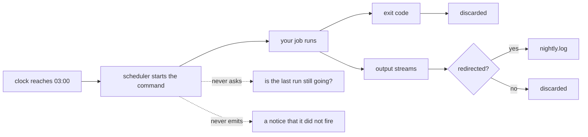

# 4.2 — The scheduler you already have

## One-line answer

🅿️ **Parked — awareness-level, interview-ready, deliberately not built here.** Every machine you own
already has a scheduler that will run a command at a set instant for free, which is why this day uses
it instead of the two hosted triggers part [4.1](4.1-what-adk-offers.md) parked behind a billing
account — but a scheduler is a very small, very dumb thing that does *exactly* that one job, and the
four jobs people assume it also does are all yours: it does not check whether the last run finished,
it does not keep the output, it does not retry a failed run, and it does not tell you when the
command was not run at all.

## The story

🎬 **The scene.** There is a plastic dial on the wall next to the hot water tank, the kind with a
ring of little tabs around the edge that you push in to mark the hours you want. Somebody set it
years ago: the tabs are pushed in for the small hours, so the immersion heater comes on in the middle
of the night when electricity is cheaper, and the tank is hot by breakfast.

The dial has done its job every night since. Nobody has looked at it.

One winter morning the water runs cold. You check the dial and it is fine — it is turning, the tabs
are where they always were, and at the marked hour it will close the circuit exactly as it has for
years. The heating element inside the tank, on the other hand, burned out a fortnight ago. The dial
switched the power on. The power went nowhere.

😬 **The naive fix.** Buy a better timer. One with a display, a battery backup, a second channel.

💥 **Why it fails.** The timer was never wrong. A mechanical timer closes a circuit at a set hour,
and that sentence is the whole specification. It cannot tell whether the tank is already hot from
yesterday, so it will happily heat it again. It cannot tell whether the element on the other side of
its contacts is alive or dead, because it has no way to look. It cannot tell whether anybody is home
to want hot water. And when the power cut on Tuesday stopped the dial for four hours, it did not
catch up, apologise or leave a note — it simply came back on running late, and the only person who
found out was whoever got in the shower. A better timer with a display is still a timer. You would
have bought a nicer version of the one thing that was already working perfectly.

💡 **The insight.** The failure was never in the switching. It was in the gap between what the timer
does — close a circuit at an hour — and what the household *assumed* it does: keep us in hot water.
Everything in that gap has no owner. Nobody checks the element, nobody notices a night that was
skipped, nobody knows the tank was already hot. The device is not going to grow into that role, so
the household has to fill the gap itself or keep having cold mornings.

Hold that dial in your head for the rest of this part. `cron` is the dial. Your nightly job is the
element. Everything this day has built — the lock, the resume, the run log, the digest — lives in the
gap between them.

## The idea in plain language

A **scheduler** is a program that sits in the background, watches the clock, and runs a command when
a time you wrote down arrives. That is the entire definition, and holding yourself to it is most of
this part.

You already have one. On a Unix-like system — Linux, macOS — it is **cron**, a daemon (a program that
runs in the background with no window and no user attached) that has been doing this job since the
1970s. The list of what to run and when is called a **crontab**, short for *cron table*: a plain text
file of one line per scheduled command, where each line is a time specification followed by the
command itself. On Windows it is **Task Scheduler**, which does the same job through a graphical
console and through a command-line tool called `schtasks`.

**This part is 🅿️ parked, and it is worth being exact about what that means.** You will read it,
you will be able to answer questions about it, and this document installs nothing and schedules
nothing. There is no transcript of a scheduler firing below, because none was run here — the entry
for your own machine is a `TODO(me)`. Parking it is not laziness in two different directions at once.
Part [4.1](4.1-what-adk-offers.md) parked ADK's two hosted trigger sources because both of them need
a cloud project with a billing account attached, which Addendum 02 rules out for this curriculum. The
replacement is the scheduler already sitting on the machine you are reading this on, and it costs
nothing at all — no account, no project, no quota. What is parked here is only the *installation*,
because a scheduled task is a change to your machine rather than to this repository, and the
repository cannot verify it for you.

Now the part that matters, and the spine of everything below. A scheduler runs a command at a time.
People assume it does four more things. It does none of them, and each one is a part of this day:

| What people assume | What actually happens | Which part of this day owns it |
| --- | --- | --- |
| overlapping runs are prevented | the next run starts regardless of whether the last one finished | part [2.3](../02-when-it-dies-at-three-am/2.3-two-runs-at-once.md) — the lock |
| the output is kept somewhere | it is discarded unless you redirect it to a file yourself | part [1.1](../01-the-agent-nobody-watches/1.1-nobody-is-watching.md) and part [3.2](../03-the-morning-after/3.2-the-digest-that-reassures.md) — the digest |
| a failed run is retried | it is not; the command's exit code is ignored | part [2.2](../02-when-it-dies-at-three-am/2.2-stages-you-can-iterate.md) — resume |
| you are told if it did not run | nothing at all is emitted | part [3.3](../03-the-morning-after/3.3-nobody-notices-silence.md) — nobody notices silence |

Read that table as four things you now owe, not as four complaints about cron. Part 2.3 already put
the first row plainly — *a scheduler fires on a clock, not on whether the last run finished* — and
built the lock that survives it. This part is the general form of the same observation applied to
the other three rows, and the reason the day is shaped the way it is: the trigger is ten characters
of configuration, and every hard problem on this day lives on the other side of it.

One term the third row depends on, because the rest of the part uses it. An **exit code** is a small
whole number that a program hands back to whatever started it when it finishes. By convention `0`
means it succeeded and anything else means it did not. That is how one command tells another that it
failed — and it is exactly what the day's own gate uses when it prints `exit: $?`. The scheduler
receives that number and, in the plain configurations below, does nothing with it whatsoever.

## Why Sutra needs it

Sutra's nightly job is the first thing in this repository that nobody starts. Everything before it
was run by a person sitting at a terminal who could read a traceback; this one has to be woken by
something, and the choice of what wakes it is the last open decision on the day.

Part 4.1 read the accepted values off the installed package and found exactly two, both of them
hosted cloud services. That leaves the operating system's own scheduler, and it is a genuinely good
answer rather than a consolation prize: it is already installed, it needs no credentials, it makes no
network call, and it is the same mechanism that runs backups and log rotation on virtually every
server in production today. Zero budget is a feature here in the strict sense — the free option is
also the one with the fewest moving parts.

But the four rows above land directly on `lab/nightly.py`, and they land harder on it than they would
on a backup script.

The job takes a `--resume` flag, and nothing will ever pass it. A run that dies part-way through the
eval stage leaves an index on disk and no scores, and the fix part 2.2 built is one flag away — but
the scheduler will fire tomorrow with the same command line it fired with today, which does not carry
that flag. Nothing retries. Nothing escalates. The dead run is simply a gap.

The job writes a digest, and the digest is the only thing a person reads. Everything else it prints —
`ok reindex rows=5`, `DIED evals`, the artefact table at the end — goes to the process's output
streams, and those streams have nowhere to go when there is no terminal attached. Unless you point
them at a file, the sentence describing the failure is written into nothing.

And the job takes a lock, which means it has a branch that prints `refused, another run holds the
lock` and exits. That line is worth exactly as much as the place it was written to. Redirect it to a
log and it is evidence; leave it alone and it is the dial clicking in an empty house.

## The mechanism

Two schedulers, two configurations. Neither is installed by this document.

### cron, on a Unix-like system

A crontab is edited with `crontab -e` and listed with `crontab -l`. One line is the whole
configuration for one job:

```text
0 3 * * *  cd /path/to/sutra && uv run python -m sutra.nightly >> /path/to/nightly.log 2>&1
```

**Line by line:**

- The line has exactly two parts: a time specification of five whitespace-separated fields, and then
  everything after them, which is the command. There is no third part. There is no place on this line
  to say "retry on failure", "do not overlap", or "email me if it does not run", because those are
  not things cron does.
- `0 3 * * *` is the five fields. In order: **minute** (`0`), **hour** (`3`), **day of month** (`*`),
  **month** (`*`), **day of week** (`*`). An asterisk means *every value of this field*, so this
  reads: at minute zero of hour three, on every day of the month, in every month, on every day of the
  week — that is, at `03:00` daily. The fields are positional, and getting the first two the wrong way
  round is the classic cron mistake: `3 0 * * *` is a perfectly valid line that runs at three minutes
  past midnight.
- `cd /path/to/sutra` is not tidiness, it is required. Cron starts your command in your home
  directory with a deliberately minimal environment, so anything you would normally rely on the shell
  for is absent. A relative path resolves against the wrong directory, and the job's own state files
  land somewhere you will not find them. Use an absolute path here; cron will not expand a `~` for
  you in every field, and guessing is how this line silently stops working.
- `&&` runs the second command only if the first one succeeded — that is the exit code from the
  previous section being used, for the only time on this line. If the `cd` fails because the path is
  wrong, the job does not run at all, which is better than running it in the wrong directory.
- `uv run python -m sutra.nightly` is the command itself, written the way the rest of this repository
  writes it. `uv run` is what makes the project's pinned dependencies the ones that get exercised.
  Note the risk hiding in the first word: `uv` has to be findable, and cron's `PATH` — the list of
  directories a shell searches for a program name — is a short default that very likely does not
  include wherever `uv` was installed. This is the single most common reason a scheduled job that
  works by hand fails at night, and *When it breaks* returns to it.
- `>> /path/to/nightly.log` sends the command's normal output to the end of a file rather than to a
  terminal that does not exist. Two chevrons rather than one: `>>` appends, `>` truncates the file
  first, and a nightly job configured with `>` keeps only the most recent night and destroys the
  evidence of every night before it.
- `2>&1` is the half people leave off, and it is not optional. A program has two output streams:
  **standard output**, the normal one, and **standard error**, a separate stream reserved for
  complaints — error messages, warnings, the whole of a Python traceback. `2>&1` means *send stream 2
  (standard error) to wherever stream 1 (standard output) is currently going*, which by this point in
  the line is the log file. Without it, everything the job says **when it fails** goes to the stream
  nobody redirected, and that stream has no terminal behind it. The traceback is written into
  nothing. That is part 1.1's finding — *reports failure to nowhere* — reproduced exactly, by an
  omission of four characters.
- Order matters in that last pair: `2>&1` must come **after** the `>>`, because it copies wherever
  stream 1 is pointing *at that moment*. Written first, it would faithfully copy the terminal that is
  not there.

Installing it is yours:

```bash
crontab -e     # opens your crontab in an editor; add the line above, with real absolute paths
crontab -l     # prints your crontab back, which is how you confirm it saved
```

**Line by line:**

- `crontab -e` opens *your* user's table, not the system's. That distinction matters: a job in your
  crontab runs as you, with your file permissions, which is what you want for a job writing into a
  repository in your home directory.
- `crontab -l` is the verification step, and it is the only one available here. It proves the line is
  saved. It proves nothing at all about whether the command in it works.
- `TODO(me)`: write your line, install it, and then — separately — check tomorrow that
  `nightly.log` grew. The second half is the real test and it is not something a command can hurry.

### Task Scheduler, on Windows

The same job, expressed for the scheduler Windows already has:

```text
schtasks /create /tn "sutra-nightly" /tr "cmd /c cd /d C:\path\to\sutra && uv run python -m sutra.nightly >> nightly.log 2>&1" /sc daily /st 03:00
```

**Line by line:**

- `schtasks /create` is the command-line front end to the same Task Scheduler you can open as a
  graphical console. The console is easier to explore; the command line is the version you can put in
  a document, which is why it is here.
- `/tn "sutra-nightly"` is the **task name** — the handle you will use to query, change or delete the
  task later. Give it a name you will recognise in a list of several hundred system tasks.
- `/tr "..."` is the **task run** string: the command to execute. Everything inside those quotes is
  what actually runs.
- `cmd /c ...` wraps the command in a shell, and this wrapper is the whole reason the line looks
  odd. `>>`, `2>&1` and `&&` are features **of a shell**, not of `schtasks`. Handed straight to
  `/tr`, they are just characters in a program name, and the task either fails to start or runs
  without the redirection you thought you had configured. `cmd /c` means *start a command shell, run
  this one command, then exit*, which gives those symbols something that understands them.
- `cd /d C:\path\to\sutra` changes directory the way `cmd` needs it. The `/d` switch is required when
  the target is on a different drive from the shell's current one — without it the drive letter is
  ignored and you end up in the right folder on the wrong disk.
- `/sc daily` is the **schedule type**. This is the field that corresponds to the five cron fields,
  and it is the clearest difference between the two tools: cron gives you one expressive grammar,
  Task Scheduler gives you named schedule types and separate switches.
- `/st 03:00` is the **start time**, written as `HH:MM` on the clock the machine keeps, and it is
  what `/sc daily` needs in order to mean anything.
- `TODO(me)`: run this on your own machine, with your real path, and then query it back with
  `schtasks /query /tn "sutra-nightly"`. **No task was created by this document**, so there is no
  output pasted here — inventing one would be exactly the fabrication Principle 10 forbids. Read the
  next section before you type either command, because on Windows *where* you type it decides whether
  it works.

### What the two configurations have in common



Every arrow that ends in *discarded* is a job you now own, and the two dotted arrows are the
questions the dial on the wall cannot ask. That is the complete picture: one solid path from the
clock to your command, and everything else falling on the floor.

## When it breaks

**`schtasks` from Git Bash mangles its own arguments.** Every command in this repository's day
documents is written for Git Bash on Windows (`days/README.md` carries the PowerShell equivalents
table), and this is one of the few places where you have to leave it. Measured on 2026-09-06,
querying a task from a Git Bash prompt produced exactly this:

```text
ERROR: Invalid argument/option - 'C:/Program Files/Git/query'.
Type "SCHTASKS /QUERY /?" for usage.
```

**Line by line:**

- Read the path in the error before anything else. Nothing in the command that was typed contained
  `C:/Program Files/Git` — that string was manufactured between the keyboard and `schtasks`.
- Git Bash runs on a compatibility layer that translates between Unix-style and Windows-style paths,
  because most of the commands it hosts expect Unix paths and the operating system underneath expects
  Windows ones. An argument that begins with `/` looks exactly like an absolute Unix path, so the
  layer helpfully converts `/query` into the Windows path it would be — the Git installation root
  plus `query`.
- `schtasks` never saw `/query`. It was handed a path and told you, accurately, that it is not a
  valid option. The error is correct and the tool is innocent; the argument was rewritten before it
  arrived.
- Every switch in the `/create` command above starts with `/` too, so this is not a quirk of one
  subcommand. The whole tool is unusable this way.
- The fix is to run `schtasks` from **PowerShell** or from **cmd**, where `/query` is just `/query`.
  Nothing about the command changes; only the shell you type it into does.

**The machine has to be awake.** A schedule is an instruction to a program that is running on a
computer, and a computer that is asleep, hibernating or switched off at the scheduled instant does
not run your job. Nothing is queued and nothing errors — the instant passes. This is the power cut
that stopped the dial. The two schedulers differ here, and the difference is worth knowing rather
than memorising: Task Scheduler exposes settings for waking the machine and for running a task that
was missed while the machine was off, whereas cron traditionally does not, and the usual answer on a
Unix-like system is a separate tool that exists specifically to catch up missed runs. Do not take
option names from this document — open your own scheduler's settings and read them, because they
differ by version and this document has not verified them. What you must take away is the behaviour:
**a laptop that sleeps is not a host for a nightly job**, and the reason people put these jobs on a
machine that is always on is this paragraph and nothing more sophisticated.

**The environment is not your shell.** This is the most common cause of "it works when I run it and
fails every night", and it is worth stating in full. When you run a command yourself, you have a
`PATH` assembled by your login profile, possibly an activated virtual environment, and any
environment variables your shell configuration exports — including, in this repository, whatever
`.env` handling the job relies on. A scheduler starts your command with a minimal environment and no
profile. So `uv: command not found` at three in the morning is not a mystery: `uv` is on your `PATH`
and not on cron's. The defences are dull and effective — give the absolute path to the program rather
than its bare name, set what you need explicitly at the top of the crontab, and never assume a
virtual environment is active. And once the failure happens, `2>&1` is what decides whether you ever
see the words. Without it, this section's most common failure is also completely invisible.

**Two schedulers on two machines are part 2.3's collision with nothing to lock on.** Move the job to
a second host for redundancy and you have two dials wired to the same tank. Part 2.3's fix is a lock
file created with exclusive mode, and its guarantee comes entirely from a single kernel arbitrating
two calls against one filesystem. Two machines have two filesystems: both create their own lock file,
both are told they hold it, and both proceed to write. The lock has not failed noisily — it has
quietly started protecting each machine from itself, which nobody needed. This document has measured
none of that; the claim is only the one part 2.3 already made, that the mechanism stops working the
moment the filesystem stops being shared.

## In production

**Why teams outgrow cron.** Nothing above is wrong, and small systems run on exactly these lines for
years. What breaks is the second job, and then the fifth. A crontab is a list of independent
commands, and real work is not independent:

| What a growing system needs | What a crontab offers |
| --- | --- |
| job B runs only after job A succeeded | two lines, two times, and a hope that A finishes first |
| a failed run is retried, then escalated | the exit code is discarded |
| a history of what ran, when, and for how long | one log file per job, if you remembered the redirect |
| a view of what is running right now | a process list, if you can get onto the machine |
| a schedule that lives in review, not on a host | a file edited in place on one server |

The row people feel first is the top one. The moment two jobs have a dependency, a crontab expresses
it as *guess an interval big enough* — job A at `03:00`, job B at `04:00`, and a silent assumption
that an hour is always enough. It is, until the archive grows. That is the same arithmetic part 2.3
described for overlap, and it fails the same way: not with an error, but with job B running
confidently against yesterday's output.

**What replaces it** is a **workflow orchestrator**: a system whose unit is not a command at a time
but a graph of tasks with dependencies between them. It keeps a record of every run, retries a failed
task under a policy you write down, refuses to start a run while the previous one is going, and shows
you all of it in one place. The category is well populated and the choice is not this document's to
make.

**And what you lose is real, so say it out loud in the review where the decision is taken.** A cron
line is one line. You can read it, reason about it completely, and delete it. An orchestrator is a
service: it has a scheduler component, a database of run history, workers, an upgrade path, and its
own outages — and now the thing that runs your nightly job can itself be the thing that is down at
three in the morning. You have not removed the problem of an unattended system; you have added a
second unattended system to look after the first. That trade is usually worth making, and it is worth
making *deliberately*, once the dependencies between jobs are real rather than anticipated.

**The review comment a senior engineer leaves:** *"The cron line is fine, and it is doing less than
the pull request description implies. Three things before this ships. First, `2>&1` — you have `>>`
but not the error stream, so the only night this log matters is the night it will be empty. Second,
the schedule assumes the run finishes before the next one starts, and nothing enforces that; the
lock in the job is the real defence, so let us make sure it is taken before the first stage and that
the refusal is written into the same log. Third, and this is the one I actually care about: nothing
in this change tells anybody when the job did not run. A machine that is rebuilt, a crontab that is
lost, a host that is decommissioned — all of those look exactly like a quiet week. Add the heartbeat
now, while the job is small, rather than after the first month we did not notice."*

**The interview question:** *"How would you schedule an agent to run every night, and what goes
wrong?"* An honest answer: *"The scheduling itself is the easy part and I would not spend much of the
design on it — a cron line or a Task Scheduler entry, one command at a fixed hour, redirected to a
log with the error stream included. Everything interesting is in what the scheduler does not do,
and there are four of them. It does not check whether the last run finished, so two runs can be alive
at once writing the same files, and the one that finishes last wins even though it is the one with
the oldest data — that needs a lock in the job, taken before the first stage. It does not keep the
output, so unless you redirect both streams the traceback goes nowhere, which for an unattended job
means the failure never existed. It does not retry, because it ignores the exit code — so if you want
a dead run to be picked up, resumability has to be built into the job and something other than the
scheduler has to invoke it. And it does not tell you when it did not fire, which is the one that
bites hardest: a machine that was asleep, or a crontab lost in a rebuild, produces silence, and
silence looks exactly like success. So my answer is that I would pick the boring scheduler on purpose
and put all the engineering into the job — lock, resume, run log, and a heartbeat so that somebody
finds out when nothing happened at all."*

## Check yourself

```bash
crontab -l                      # on Linux or macOS: what, if anything, is already scheduled for you
cat /etc/crontab                # the system-wide table; often a good example to read
ls -la ~/                       # look for stray *.log files - somebody's redirect landed here
```

**Line by line:**

- `crontab -l` prints your own table and exits non-zero with a message if you have none, which is
  itself a useful answer.
- `/etc/crontab` is the system's table rather than yours, and on most machines it is already
  populated — a real, working example of the five fields you can read instead of trusting this
  document.
- The third command is a small piece of forensics: log files in a home directory are usually the
  footprint of a scheduled job whose `cd` did not do what its author expected.

Two exercises.

1. Write the cron line for your own machine — real absolute paths, both streams redirected — and
   before you install it, answer this in one sentence: if the command inside it exits non-zero
   tonight, what happens tomorrow? Then say which part of this day you would have to build to change
   that answer.
2. Take the four-row table from *The idea in plain language* and, for your own `nightly.py`, write
   down which of the four your job currently survives and which it does not. One of them the job
   already handles. One of them nothing in this repository handles yet.

**Out loud, without scrolling up:** your nightly job died with a traceback at `03:00` and your
scheduler entry ends in `>> nightly.log`. What is in the log the next morning, and why?

**Next:** [5.1 — What a nightly job spends](../05-in-production/5.1-what-a-nightly-job-spends.md).
