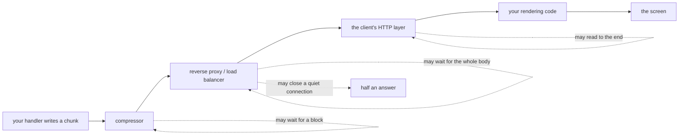

# 3.3 — What sits in between

## One-line answer

Your process writes chunks and the reader's screen shows chunks, and between those two things sit
several pieces of software you did not write — each of which is entitled to hold your bytes until it
has enough of them — so a stream can be quietly re-assembled into one response **with no error
anywhere and nothing changed on your side**, which makes this the hardest streaming bug there is:
the code is correct, the tests are green, and the feature does not work in one environment.

**Read this next sentence before anything else, because it changes how you should read the rest.**
Nothing in this part was measured. The lab on this day has no network, no proxy and no browser —
every number quoted so far, including part [3.2](3.2-the-newline-in-your-payload.md)'s ninety
characters sent and seventy-seven received, came from a stream built and read back inside one Python
process. This page therefore contains no command output, no log line, no header value and no
configuration setting, because producing any of those would mean inventing them, and Principle 10
forbids that as firmly for a document as for an agent. What follows is reasoning and field
knowledge: 🅿️ awareness-level material about a class of failure you will meet, plus a method for
finding out which member of the class you are looking at. The method is the part that transfers.

## The story

🎬 **The scene.** You keep a small stall at one market and your cousin keeps one at another market
across town. Through the morning you pack boxes for him: the first is ready early and you carry it
straight out to the goods tempo waiting at the kerb, the second an hour later, the third before
midday. Each one goes over as soon as it is sealed. That is the whole arrangement, and it exists
precisely so that he can put your stock on his table as it comes rather than sitting on an empty
table all morning.

He rings you in the afternoon, mildly annoyed. All three boxes have just arrived, together. He has
had nothing to sell since he opened.

😬 **The naive fix.** Pack faster. Seal the first box earlier, get it out to the kerb before the
market fills up, maybe send a message when each one goes so he knows it is coming.

💥 **Why it fails.** Nothing you do at your end reaches the problem, because the problem is not at
your end. The tempo driver does not set off with one box in the back. He has a load bed to fill and
one tank of fuel to spend, and driving across the city three times for three boxes would be absurd —
so he parks, takes your first box, waits, takes your second, waits, and leaves when the bed is full
or when he is done for the day. Every box arrives. Every box arrives undamaged, in the order you
sent it. And every box arrives at once, late.

The cruel part is that neither end can see him. From your side the boxes left the moment they were
ready; from your cousin's side they turned up in one lot, which looks exactly like a supplier who
packed everything at the last minute. You are each looking at your own end of a chain and drawing a
conclusion about the other person. The one participant whose behaviour explains the whole thing is
standing at a kerb neither of you can see, doing something entirely sensible.

💡 **The insight.** The batching was introduced by a link in the middle, for a good reason of its
own, and it is invisible from both ends. So no amount of staring at your end will find it, and no
amount of asking your cousin what he received will find it either. The only way to find it is to
walk the route — go out to the kerb and look.

Keep the tempo at the kerb. For the rest of this part, your streaming server is you, the reader's
screen is your cousin's table, and everything in between is a vehicle with its own opinion about
when a load is worth moving.

## The idea in plain language

When you write a chunk into an open HTTP response — part [3.1](3.1-what-sse-actually-is.md)'s
response that never ends — you are not writing to the reader. You are writing to the first of
several programs, each of which passes the bytes on to the next. Each of those programs is called a
**hop**: one link in the chain between your process and the screen. In a real deployment there are
usually between two and five of them, and you wrote none of them.

Three terms, all of which this part needs.

**Buffering** is the habit of collecting data until there is a worthwhile amount of it, and only
then passing it on. It is not a bug and it is not laziness. Almost everything that moves bytes
buffers, because moving bytes has a fixed cost per move and buffering amortises that cost — the
tempo driver's tank of fuel, exactly. The trouble is that buffering and streaming are opposites by
definition: one waits until it has enough, the other exists to send before there is enough.

A **reverse proxy** is a server that sits in front of your application and takes the requests on its
behalf. "Reverse" because an ordinary proxy sits in front of the *client* and speaks to the world
for them, while this one sits in front of the *server* and speaks to the world for it. A **load
balancer** is a reverse proxy that also chooses which of several copies of your application gets
each request. Nearly every deployed web application has at least one of these in front of it, doing
termination of encrypted connections, routing, rate limiting and logging — and it is the single most
likely place for your stream to be collected into a lump.

An **idle timeout** is a limit on how long a connection may go without any bytes crossing it before
the hop decides the connection is dead and closes it. Every hop has one. It exists because
connections do genuinely die without saying so, and something has to reclaim them. A **heartbeat**
is the standard answer: a tiny, meaningless piece of traffic sent on purpose during a quiet spell,
whose only job is to be bytes so that nobody concludes the connection has died. Part 3.1 already
named the form SSE uses for this — a comment line, a bare `:` — and this is the reason it exists.

Now the four things that sit between you and the reader, and what each one looks like from where you
are standing:

| The hop | Why it holds your bytes | What you see from your side | What the reader sees |
| --- | --- | --- | --- |
| a reverse proxy or load balancer | wants a complete body: to know its length, to inspect it, to be able to retry it | nothing — your writes all succeed | one delivery at the end |
| a compressor | works on blocks, and cannot emit anything until it has a block's worth of input | nothing — you enabled a performance feature | chunks arrive in clumps, or one lump |
| an idle timeout on any hop | a quiet stretch mid-answer looks exactly like a dead connection | the connection closes mid-turn, from the other end | half an answer, then nothing |
| the client's own layer | a fetch wrapper, HTTP library or test harness reads the whole body before returning it | nothing — the server streamed perfectly | one blob, at the end |

Read the third column. It is the same in every row, and it is the entire difficulty of this part: on
your side, in three of the four cases, absolutely nothing happens. No exception, no status code, no
warning, no slow query, no metric moving. The bug has no symptom at the place you would look for it.

## Why Sutra needs it

Everything measured on this day was measured in one process. `_fake.py` is a real `BaseLlm` subclass
running inside the real runner, so the event counts in
[1.3](../01-the-blank-screen/1.3-one-event-or-six.md) and the character counts in
[3.2](3.2-the-newline-in-your-payload.md) are real measurements of real code — and every one of them
was taken on the near side of every hop described above. The day's `lab/wire.py` builds a stream as
a Python string and reads it back in the same process. There is no network in it at all, by design,
because the format is the subject and a provider request would have taught nothing about framing.

That is a sound way to learn the format and a completely inadequate way to learn whether a deployed
system streams. The moment `sutra/stream.py` is put behind an HTTP handler and that handler is put
behind anything at all, the day's evidence stops covering the interesting question.

And the stakes are specifically the ones part [1.1](../01-the-blank-screen/1.1-the-blank-screen.md)
set out. Streaming makes nothing faster; the same tokens are produced at the same rate and the
answer finishes at the same instant either way. The single thing it buys is *when the reader is
first served* — thirteen per cent of the answer instead of a hundred. A hop that collects your
chunks and delivers them in one piece takes back exactly that, and only that. Every character still
arrives, in order, uncorrupted, and the feature is nonetheless gone. There is no partial credit
here: a stream that is re-assembled before it reaches the screen is not a degraded stream, it is a
non-streaming response with extra machinery behind it.

## The mechanism

Here is the path, with the hops that are entitled to hold bytes marked:



Four dotted arrows, four independent ways for the same symptom to appear. Take them one at a time.

### A reverse proxy or load balancer

The hop in front of your application is trying to be helpful, and each of its reasons for collecting
a whole body is defensible on its own terms. It may want the length, so it can declare it to the
client. It may want to inspect the body — for a security rule, for a content check, for a filter
that somebody in a different team configured. It may want to be able to **retry**: if your
application dies part-way through producing a response, a proxy that still holds the whole thing can
quietly ask another copy of your app and the client never learns anything went wrong, which is an
excellent property for an ordinary request and an impossible one for a stream it has already started
forwarding.

Every one of those wants the same thing — the complete body before anything leaves — and the result
from the reader's side is one delivery at the end. Your writes all succeeded. Your logs are clean.

The settings that control this exist, and they are named differently by every component. This
document will not name them, because naming a directive for a product you have not checked is the
literature version of inventing a version pin. `TODO(me)`: find the buffering-related settings for
whatever sits in front of your application — the category is *response buffering* and, separately,
*proxy read and send timeouts* — and read what the default is rather than what you assume it is.

### Compression

A **compressor** replaces repeated patterns in your data with shorter references to earlier
occurrences. To find a repetition it has to have seen enough data to have something to repeat, so it
works on blocks: accumulate input, compress the block, emit it. That accumulate step is buffering by
construction, not by configuration.

This is the cruellest one, because turning compression on is a good idea everywhere else in your
system and nobody reviews it as a streaming decision. Somebody enables compression at a hop to make
pages smaller, which it does, and the streaming endpoint that travels through the same hop quietly
starts arriving in clumps. Text compresses extremely well, so the saving is real; it is just being
paid for with the one property the endpoint existed to provide.

`TODO(me)`: find out whether anything on your path compresses responses, and whether it can be
disabled for one content type. The setting you are looking for is per-content-type compression, and
`text/event-stream` is the type you want excluded. Look it up for your own component.

### Timeouts

Every hop has an idle timeout, and a streaming turn has quiet stretches in the middle of it. The
obvious one is a tool call: the model asks for a function, your agent runs it, the function talks to
a database or another service, and for that whole stretch there is nothing to send. There is no
protocol-level way for a hop to distinguish "the server is thinking" from "the server is gone",
because at the level of bytes on a connection those two states are identical. So a hop that has seen
nothing for its configured interval does what it is supposed to do and closes the connection.

The reader gets half an answer and then nothing. Note that this failure is not silent on your side —
your write eventually fails, or the client disappears — which puts it in a different class from the
other three. It is the only one of the four that leaves a mark.

That is the whole reason heartbeats exist, and it is why part 3.1 listed one as a thing a
professional adds. A periodic byte during a quiet stretch keeps every hop's timer reset without
producing a message the client has to handle.

`TODO(me)`: for each hop on your path, find its idle timeout and write the number down next to your
heartbeat interval. The heartbeat has to be comfortably shorter than the smallest of them, and you
cannot know that until you have looked all of them up.

### The client's own layer

The last hop is on the reader's machine and it is often the guilty one. An HTTP library's ordinary
job is to give you a response as a value — a string, a parsed object — which means reading until the
body ends before returning anything. A convenience wrapper around it inherits that behaviour. A test
harness almost always has it, because a test that returns the whole response is far easier to write
assertions against.

So the server can be streaming perfectly, every hop in the middle can be forwarding immediately, and
the reader still sees one blob, because the code that asked for the response is waiting for the last
byte before handing anything to the code that renders it. This is worth knowing before you go
hunting, because the network is the intimidating place to look and the client is the cheap place to
look.

`TODO(me)`: for whatever your frontend and your tests use to make the request, find out whether it
exposes the body as a stream you read incrementally or as a value it returns once. If it is the
second, no server-side change will ever fix your symptom.

### The method: bisect the path from the outside in

This is the transferable skill, and it is the reason this part is worth reading rather than being a
list of things to worry about. You cannot reason your way to which hop is buffering, because they
all produce the same symptom. You find out by removing hops one at a time, starting from the
outside, until the symptom disappears — the hop you removed last is the one holding your bytes.

Four rungs, in order:

1. **Your process alone.** Already done on this day: the events, the chunks, the framing, all
   measured in-process with no network. If the stream is wrong here, stop; nothing downstream is
   involved.
2. **A raw HTTP client straight at your application**, on the machine it runs on, bypassing
   everything in front of it. This is the decisive rung. If the bytes arrive progressively here,
   your server is correct and the problem is downstream of it — and you have just saved yourself
   from editing code that was never wrong.
3. **The same raw client at the public address**, through the whole path. If rung 2 was progressive
   and rung 3 is not, the answer is somewhere in the hops between them, and you can bisect again
   inside that range if there is more than one.
4. **The real client.** If rungs 2 and 3 are both progressive and the screen still fills in one go,
   the buffering is in the client's own layer or in your rendering.

Rung 2 and rung 3 are the same command pointed at two different addresses. It looks roughly like
this:

```bash
curl -N -s -i -H 'Accept: text/event-stream' https://your-host/your-streaming-endpoint
```

**Line by line:**

- `curl` is a plain HTTP client with no rendering layer, no framework and no opinions. That is
  exactly why it is rung 2: it removes every piece of software between the socket and your eyes, so
  what you see is what the server sent.
- `-N` is `--no-buffer`, and it is the flag the whole command depends on. It turns off curl's own
  buffering of the output stream so that each piece prints as it arrives. Leave it off and curl
  becomes the fourth intermediary in the table above — you will have reproduced the exact bug you
  are hunting, on your own desk, and concluded that the server does not stream.
- `-s` silences the progress meter. Without it curl redraws a transfer-progress display over the
  same region of the terminal as your output, which makes a slow trickle of text hard to read.
- `-i` includes the response headers before the body. You want to see the content type — part 3.1's
  `text/event-stream` — and whether the response declares a length, because a declared length is a
  strong hint that something has the whole body already.
- `-H 'Accept: text/event-stream'` sets a request header asking for the stream format. Some servers
  will hand you a non-streaming representation of the same resource if you do not ask.
- The URL is yours. Rung 2 points it at the application directly on its own host; rung 3 points it
  at the public address. Nothing else about the command changes between the two, which is what makes
  the comparison worth anything.
- Note what is **not** here: no compression flag. Curl does not ask for a compressed response unless
  you tell it to, so this command tests the uncompressed path. If you want to test the compressed
  path — and you should, if compression is on anywhere — add the flag your client uses for it
  deliberately and compare. `TODO(me)`: look up that flag for your client rather than taking one
  from this page.
- `TODO(me)`: run this against your own endpoint, on both rungs. **No server was contacted by this
  document and no output is pasted below**, because there is nothing to paste; a transcript here
  would be fabricated, and a fabricated transcript of the one command whose entire purpose is to
  produce evidence would be a special kind of dishonest.

One refinement worth having, described rather than prescribed. What you are judging on rungs 2 and 3
is *when* each line appeared, and eyes are poor at that once a stream is quick. The category of tool
you want is a **line-timestamping filter**: something you pipe the output through that prefixes each
line with the instant it arrived, turning a judgement into a column of numbers. Several exist and
availability differs by machine. `TODO(me)`: find the one available on yours, and pipe rung 2 and
rung 3 through it so you are comparing figures rather than impressions.

## When it breaks

**There is no error text to quote, and that is the finding.** Every other *When it breaks* on this
day has a verbatim traceback, status line or count behind it. This one cannot, and not because the
page was lazy: three of the four hops in the table produce no error at all, at either end. The bytes
are complete, the order is right, the response is valid, and the only thing that changed is when the
pieces arrived — which no component in the chain considers its business to report. A failure whose
signature is the absence of a signature is exactly the kind you have to go and look for on purpose.

**It reproduces in one environment and nowhere else.** This is the practical shape the bug takes.
Locally you run the application directly, with nothing in front of it, so rung 2 is the only rung
you have and it works perfectly. In staging or production there is a proxy, possibly a load
balancer, possibly compression, and the feature stops. Or worse: it works in your deployment and
fails inside one customer's network, because their outbound path has an inspecting proxy of its own
that you will never see the configuration of. The bug is a property of the path, not of the
repository, and the repository is where everybody looks.

**The temptation this creates is to fix it in application code, and that is how it gets worse.**
There is a predictable sequence and it is worth recognising early because you will feel the pull of
every step. Somebody adds a retry, because the symptom looks like something that did not arrive.
Somebody pads each chunk, because a hop that waits for a block might be satisfied by a bigger chunk
— which sometimes appears to help, which is the worst possible outcome, because now the codebase
carries a superstition that seemed to work once. Somebody adds a flush call in a place where the
framework was already flushing. Each of these is a change to code that was correct, made in response
to a problem that lives in a component nobody has looked at, and every one of them costs a
reviewer's time forever. Before any of it, do rung 2. It is one command, and it tells you which half
of the world to stop editing.

**A streaming endpoint that works today can stop streaming with no change to your repository.**
Somebody puts a new component on the path — an inspecting layer for a compliance requirement, a
compression setting enabled globally to make pages smaller, a load balancer swapped for a different
one during an infrastructure migration. None of that touches your code, none of it appears in a
review anyone asked you to attend, and every one of it can flip a working stream into a single
delivery. This is the argument against treating buffering as a thing you diagnose once and write
down in a runbook. It is a thing you need a **test** for, and the next section is what that test has
to be.

## In production

**The only test that catches this asserts progressive delivery, and it cannot be a unit test.** Say
that plainly, because it is the whole professional content of this part. A unit test proves that
your handler yields several chunks; every hop in the table above will happily pass that test while
destroying the feature, since none of them changes the final body. The check you need makes a real
request to a **deployed** address — through whatever is actually in front of the application — and
asserts something about *when*: that some part of the response was readable before the response was
complete. Assert the shape of the guarantee and nothing tighter: that at least one piece arrived
strictly before the end, not that a particular piece arrived at a particular instant, or the test
becomes something that fails on a busy afternoon and gets deleted. Run it against every environment
you deploy to, because the whole point is that environments differ, and run it after infrastructure
changes as well as after code changes — it is one of the few tests whose job is to fail when nothing
in the repository has moved.

**Heartbeats, and an explicit end-of-turn message.** These are two separate defences against two
separate hops and they are often confused. The heartbeat is for the timeout row of the table: a
small periodic byte during a quiet stretch, sized comfortably under the shortest idle timeout on the
path, so that nothing concludes your connection is dead while a tool call is running. The explicit
end-of-turn message is for the client: part 3.1 made the case and it applies with more force once
intermediaries are in the picture, because if the only signal that a turn is finished is the
connection closing, then *finished*, *timed out by a hop* and *dropped* are three different events
that arrive at the client as the same event. A sentinel message turns that guess into a branch — and
it is also what makes a progressive-delivery test able to tell a complete answer from a truncated
one.

**And the architectural point, which cuts both ways.** Part 3.1 gave the reason SSE survives despite
websockets being better at almost everything: it is an ordinary HTTP response, so it travels through
everything HTTP already travels through, with no upgrade handshake to negotiate with any hop. That
is a genuine advantage and it is why the format is still everywhere. It is also, precisely, the
source of this part's entire problem. Ordinary HTTP is exactly what all these intermediaries feel
entitled to handle — to buffer, to compress, to inspect, to retry, to time out — because handling
ordinary HTTP responses well is their job, and they have no way to know that this particular
ordinary response has a property that ordinary responses do not have. A websocket has to be
explicitly permitted by every hop, which is a cost at setup and a guarantee afterwards. SSE needs no
permission from anybody, which is why it works everywhere and why it stops working quietly. You are
trading a negotiation for an assumption. Part
[5.2](../05-in-production/5.2-what-a-real-streaming-system-adds.md) picks up what a real system puts
around that assumption.

**The review comment a senior engineer leaves:** *"The handler is right and I have no comment on it.
My problem is that nothing in this change would notice if it stopped working. Every test here runs
in-process, and every mechanism I am worried about lives outside the process and leaves the final
body identical — so all of these stay green through a proxy that buffers, through compression turned
on at the edge next quarter, through a client library that reads to the end. Add one end-to-end
check against a deployed URL that asserts something arrived before the response finished; assert
only that, nothing about timing beyond it. And before this ships, put a two-line runbook entry in:
hit the app directly first, then hit the public address, and whichever hop the difference appears at
is the one to go and read the configuration of. Right now the first person on call for this is going
to spend a day in our code, and our code is fine."*

**The interview question:** *"A customer says your streaming endpoint is not streaming for them. It
works for everybody else. What do you do?"* An honest spoken answer: *"I would not have a hypothesis
yet, and I would say that up front, because the honest position is that at least four different
things produce this exact symptom and three of them leave no error anywhere — a proxy that buffers a
whole body so it can retry it, compression that has to fill a block before emitting anything, an
idle timeout that kills a quiet turn, or the client's own HTTP layer reading to the end before it
returns. The final body is identical in all of them, which is why nothing alerts. So I would not
guess, I would bisect the path from the outside in. First a raw HTTP client with buffering turned
off pointed straight at the application on its own host — if the bytes arrive progressively there,
my server is correct and I stop reading my own code, which is the most valuable thing that check
buys. Then the same command at the public address, through everything, and if that one is a single
lump the answer is in the hops between the two and I go and read their buffering and compression
settings. If both of those are progressive, it is the client's layer or the rendering, and for the
customer-specific case it is very likely something on their outbound path that I will never get to
see, so I would ask them to run the same two commands from inside their network. The thing I would
refuse to do is add retries or padding in the application, because that is changing code that the
second rung already proved was right. And separately I would ask why nobody found this before the
customer did — the answer is that we have no test that asserts progressive delivery against a
deployed path, and every unit test we own passes while the feature is dead."*

## Check yourself

```bash
curl -N -s -i -H 'Accept: text/event-stream' http://localhost:PORT/your-endpoint
curl -N -s -i -H 'Accept: text/event-stream' https://your-host/your-endpoint
```

**Line by line:**

- The two commands are identical except for the address, and that is the entire experiment: the
  first is rung 2, straight at the application with nothing in front of it, and the second is rung
  3, through the whole deployed path.
- `-N` is doing the load-bearing work in both. Without it you are measuring curl's own buffering and
  both commands will lie to you in the same direction.
- `-s` and `-i` are as described above: no progress meter redrawing over the stream, and the
  response headers printed first so you can check the content type and whether a length was
  declared.
- `TODO(me)`: there is nothing to run these against yet, because `sutra/stream.py` is this day's
  build brief and it has no HTTP handler. Write them down now, in the module's docstring or your
  runbook, as the first two things to try when somebody reports that the answer appears all at once.
  **Neither command was run by this document and no output is shown**, deliberately.

Two exercises.

1. Take the four-row table from *The idea in plain language* and, for each row, write one sentence
   saying what the **bisect ladder** would show — specifically, at which rung the progressive
   delivery disappears for that hop. Two of the four rows are distinguishable by the ladder alone.
   Say which two, and say what you would have to look at to separate the other pair.
2. Your progressive-delivery check has just gone red in one environment. No code changed in your
   repository this week. Write down, in order, the first three things you would look at, and for
   each one say what result would clear it and let you move on. If your list is all in the
   repository, you have not read this part.

**Out loud, without scrolling up:** a reader reports that your answer appears all at once instead of
word by word. Your unit tests are green and your server logs show nothing unusual. What is the first
command you run, where do you point it, and what does a good result from it prove — and, just as
importantly, what does it prove you should stop doing?

**Next:** [4.1 — What a live session is made of](../04-the-bill-for-voice/4.1-what-a-live-session-is-made-of.md).
