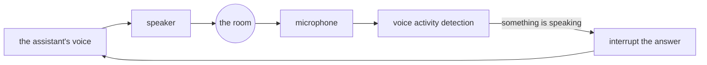

# 4.3 — What a real voice system adds

## One-line answer

The lab drives a real bidirectional session correctly, and the distance between it and something you
would let a person speak to is not vague "polish" — it is a **list of nine specific things**, each
one nameable, priceable and arguable, and two of them are deliberately parked because this
curriculum will not pay for a model that holds an audio session open.

## The story

The prize-giving is in the hall at the end of the road, and somebody has borrowed a small public
address system for it — a microphone, a box with a knob on it, a speaker on a stand.

You set it up in the afternoon while the hall is empty and it is perfect. Microphone into the box,
box into the speaker, tap the top of the microphone twice, hear the taps come out of the speaker.
Done. You go home pleased.

In the evening the hall is full, and the person handing out the prizes walks up with the microphone
in her hand, turns to face the room, and the whole hall howls. A rising whistle that everybody feels
in their teeth. She pulls the microphone away and it stops. She brings it back and it starts again.
Two hundred people are watching her hold a microphone at arm's length like something that bites.

Nothing is broken. The microphone is fine. The speaker is fine. The cable is fine. What has changed
is that she is now standing in front of the speaker, so the microphone can hear the speaker, and the
speaker is playing whatever the microphone hears — and round it goes, louder each time round.

The person who has done a hundred of these does five things before anyone arrives, and not one of
them is expensive. The speaker goes in front of where the microphone will be, and pointed away from
it. The knob comes down and stays down. There is a strip of tape on the floor showing where not to
stand. There is a spare microphone in the bag, because one of them will fail. And somebody stands at
the back, listening rather than watching, because the only person who can hear the room is a person
in the room.

The afternoon setup and the evening setup are the same equipment. They are not the same system. What
the second one has is a list, and the only way anybody ever gets that list is by being the one
holding the microphone the night it howled.

## The idea in plain language

The lab works, and it works on the real runtime. `session.py` drives an actual `run_live` session and
proves that closing the request queue does not end it. `barge_in.py` interrupts a real answer and
counts three chunks against twelve. `audio.py` prices two seconds of held-open microphone at sixty-four
thousand bytes. `vad.py` sends turn markers through the runtime and watches the far end receive five
things, two of which are not sound. None of that is a toy in the sense of being wrong.

But *"the loop is correct"* and *"I would let a customer speak to this"* are two different claims, and
what sits between them is a **list** — not a mood, not a quality bar, not "make it production-ready".
An enumerable set of items, each of which you can point at, cost, and decide about. Here is the whole
of it for this day's voice loop.

| What the lab has | What a real one adds | What it costs |
| --- | --- | --- |
| text in, text out | 🅿️ actual speech in both directions, and a **wire format agreed per direction** — what the caller sends up and what comes back down are two separate agreements | the parked half: a model that will hold an audio session open, which Addendum 02 will not pay for |
| a speaker and a microphone that do not exist | 🅿️ **echo cancellation** — the microphone hears the speaker, and without this the system interrupts itself | a signal-processing stage on the client, and the reason the same loop is harder on a laptop than on a headset |
| an interruption detected because a message arrived in a queue | interruption detected **from sound**, which is voice activity detection (part [3.2](../03-what-goes-down-the-wire/3.2-who-says-the-turn-ended.md)) | false starts and missed ones, and a threshold somebody has to tune |
| one deadline | a **latency budget** split across capture, network, model and playback, so a regression is attributable | measuring four things instead of one |
| events counted in a list | a **transcript** of what was actually said and what was actually heard, which are different (part [2.3](../02-talking-over/2.3-what-the-client-does.md)) | storage, and the decision about interrupted turns |
| nothing recorded | a decision about whether the audio is retained at all, and for how long | the whole of Day 69's data-boundary argument, applied to a recording of somebody's voice |
| one caller, one process | concurrency limits, and a queue in front of them (part [4.1](4.1-a-connection-per-caller.md)) | capacity planning in a unit you have to measure before you can plan in it |
| a session that ends when the script says so | hang-up on client disconnect, on deadline **and** on error, in a `finally` (part [4.2](4.2-the-session-that-never-ended.md)) | three code paths instead of one |
| no failure handling at all | what the caller **hears** when the model fails mid-sentence | a spoken fallback, which is content somebody has to write |

Three terms in that table are used here for the first time, so they get plain definitions before
anything else happens.

**Echo cancellation** is a step on the client that removes the assistant's own voice from what the
microphone picked up, so that the only thing left is the person. **A latency budget** is a total
allowance for how long the caller waits, divided up in advance among the stages that consume it, so
that each stage has a share it is expected to stay inside. **A transcript** is the written record of
what was said in a conversation — and on a voice loop that turns out to be at least three different
records, which is the third extended item below.

**Voice activity detection** appeared in part 3.2 and is worth restating here in one line: it is the
decision, made from sound alone, about whether somebody is speaking right now.

Three rows deserve more than a table cell, because all three look like details and none of them is.

## Why Sutra needs it

Because the hub's §4 hands you a build brief for `sutra/voice.py`, and the brief is not this list. It
asks for a `call(...)` that closes both ends, a handler for the `interrupted` event, a deadline, a
decision about turn markers, and a decision about the interrupted transcript. That is five items,
and they are the five this day actually measured. It is deliberately smaller than what you would
deploy, because a build brief containing all nine of these would bury the teaching somewhere inside
a large piece of work.

There is also a Phase 11 reason, and it is uncomfortable. The phase gate is *nightly job plus voice
standup within free quota*, and Day 74 part 4.2 recorded that it could not verify a free path for a
model that holds an audio session open. So the voice half of that gate is 🅿️ parked. This part is
the list the parked half will need on the day a free path exists — written now, while the failures
are fresh and measured, rather than reconstructed later from memory.

And it is the bag with the spare microphone in it. Everything in the table is something a person who
has run a voice system knows and might never write down. The reason to write it as a list is that a
list can be argued with. A reader who finishes this day believing `barge_in.py` is production-shaped
has learned the mechanism and is going to learn the rest of it while two hundred people watch.

## The mechanism

There is one new code fragment today, and it is quoted for what is missing from it rather than for
what it does. The rest of this section is three rows of the table, argued properly.

### Echo cancellation, and why the system interrupts itself

Start with the physical arrangement, because everything follows from it. On a laptop the speaker and
the microphone are a few centimetres apart, in the same piece of plastic, and both are on at the same
time. That is the whole problem.

The assistant starts speaking. Its voice comes out of the speaker, travels across the room and back,
and arrives at the microphone — which is open, because the caller is allowed to interrupt at any
moment, and a microphone that closes while the assistant talks is a system nobody can interrupt.

Now look at what part 2.1 established about detection. In the lab, "the caller interrupted" means a
message arrived in a queue: an unambiguous, discrete event. On a real call it means *something is
making speech-shaped sound in the microphone*. And there is something making speech-shaped sound in
the microphone. It is the assistant.



Follow the arrows once and the failure is obvious: the assistant speaks, the microphone hears it, the
detector says somebody is speaking, the answer is cut off — and the answer that was cut off was the
sound that triggered the cut. The system has interrupted itself. What the caller experiences is an
assistant that starts a sentence, stops after a few words, starts again, and stops again, while they
sit in silence saying nothing at all.

Echo cancellation is the stage that prevents it. The client already knows exactly what it sent to the
speaker, so it can subtract that signal from what the microphone picked up and pass on only the
remainder. When the remainder is near silence, nobody is talking. When the remainder is a voice, the
caller is.

Two consequences are worth carrying away.

**This is why voice demos are done with headphones.** Headphones solve the problem by geometry: the
speaker is in somebody's ear and the microphone cannot hear it, so the loop in the diagram is broken
before any code runs. A demo built and tested that way works flawlessly, ships, and then feels
completely broken the first time somebody uses it on a laptop in a quiet room — with no error, no
log line and no change to your code. The room changed. That is the hall in the story: the same
equipment, a different system.

**And it is why this row is marked 🅿️.** This part is describing a well-known problem, not reporting
a measurement. The lab has no microphone, no speaker and no room. Nothing here was observed on this
day, no threshold was tuned, and no number is offered — because a number produced without a
microphone would be a number about `_live.py`, which sends its chunks through a queue in the same
process. Naming the problem is the honest move. Pasting a figure for it would not be.

### The latency budget, and why one number is not enough

Day 74's paper — *Response time in man-computer conversational transactions*,
`doi:10.1145/1476589.1476628` — gave the thresholds this whole phase is built on: below about a tenth
of a second a system feels instantaneous, and up to about a second a person's train of thought
survives the wait. Above that, the wait becomes something they notice and start explaining to
themselves.

A voice loop has to hit that on every single turn, and unlike a text stream it cannot cheat by
showing the first word early: sound is either playing or it is not. And the wait is not produced in
one place. Four separate stages consume it, and a total that has gone bad tells you nothing about
which one did.

So the useful move is to hand each stage a share in advance. The numbers below are an **example
allocation**, not a measurement — nothing on this day measured any of these stages, and the point is
the shape of the arithmetic rather than the particular figures.

| Stage | What is happening | Example share of a one-second budget |
| --- | --- | --- |
| capture and detect | the caller stops speaking, and the client decides that they have | 0.20s |
| network, client to server | the last of the audio and the end-of-turn marker leave | 0.10s |
| model, to first sound out | the far end has heard the question and starts answering | 0.50s |
| network back, and start playing | the first audio arrives and reaches the speaker | 0.20s |

The shares add up to the budget, which is the only property that matters about them. Now a regression
is **attributable**: the total went to one and a half seconds, capture is inside its share, network
both ways is inside its share, the model took most of a second more than it was given. That is a
sentence somebody can act on. Without the split, the same regression is "voice feels slow lately",
which is a sentence that produces a discussion rather than a fix.

Notice which stage is the awkward one. **Capture and detect** is the largest share you have any
control over, and it is not network or hardware — it is a *decision* about how long a pause has to
last before it counts as the end of a sentence. Shorten it and the assistant starts answering while
the caller is still thinking mid-sentence. Lengthen it and every turn feels sluggish for everybody.
Part 3.2 is where that decision was framed; the budget is where its cost becomes a number rather than
a preference.

And the honest part: this lab cannot measure any of it. The exact command is in *Check yourself*, and
so is the reason its output would not mean anything.

### What is said, what is heard, and what is stored

Part 2.3 established that after one interrupted turn there are four different questions with four
different answers — what the model produced, what the connection sent, what the caller heard, and
what the transcript says — and that the third is the one nobody on the server can observe.

Here is what the lab keeps instead. From `lab/_live.py`, the connection's constructor, dedented from
the file's own class-body indentation to column 0:

```python
self.inbox: asyncio.Queue[str] = asyncio.Queue()
self.interruptible = interruptible
self.history_turns = 0
self.contents_in = 0
self.blobs_in = 0
self.bytes_in = 0
self.chunks_out = 0
self.interruptions = 0
self.markers_in = 0
self.realtime_log: list[str] = []
```

**Line by line:**

- `self.inbox` is the only field that ever holds anything the caller said, and it is a queue: things
  go in, they come out once, and afterwards they are gone. Nothing reads from it twice, so nothing
  can be asked later what was in it.
- The seven `= 0` fields are the day's evidence. Every measured claim in every part of this day comes
  out of one of them — `chunks_out` is the three against twelve, `bytes_in` is the sixty-four
  thousand, `markers_in` is the two things that are not sound. They are **counters**, and a counter
  answers *how many* and can never answer *what*.
- `self.realtime_log` looks like the exception and is not. It appends `"blob"` for audio and the type
  name for a marker — a list of shapes, not of contents. It could tell you that twenty pieces of
  sound went past. It could not tell you that one of them was a postcode.
- Ten fields, and **not one of them holds a word that was said.** That is not an oversight in the
  lab. It is what makes the lab cheap and safe: nothing is retained, so nothing has to be protected.
  It is also exactly what a real system cannot get away with.

Because at production scale the transcript stops being a design question and becomes a support one.
Somebody rings up and says the assistant told them the wrong thing. The question you have to answer
is *"what did the caller actually hear?"* — and it is not the model's output. The model's output is
what it produced. The caller heard whatever reached a speaker before playback stopped, which on an
interrupted turn is less, and the difference is not small: part 2.2 measured a caller receiving three
chunks of a six-chunk answer, and part 2.3's third row points out that even those three might not all
have been played.

So a real system records three different things, and knows they are three:

| Record | Where it can be produced | What it is evidence of |
| --- | --- | --- |
| what the model produced | the server, from the response stream | cost, and what the model believes it said |
| what was delivered | the server, from the connection | the upper bound on what could have been heard |
| what was heard | **only the client**, reported back deliberately | the support answer, and the only one a caller recognises |

The middle row is nearly free — you are already handling those events. The bottom row is the one
teams skip, and it is the only one that answers the phone call. It costs a message from the client
saying how far playback got, and the discipline to send it on the interrupted path, which is exactly
the path where everything else is already going wrong.

And then the storage question, which is Day 69's subject arriving with a new object. Day 69 argued
about personally identifying information crossing a boundary. A recording of somebody speaking is
that argument at its hardest setting: it carries the words, and it carries the voice, and a voice
identifies a person the way a fingerprint does. Deciding *"we keep the text, we never keep the
audio"* costs nothing on the day the loop is written, because there is no audio yet. Deciding it
after a service has been running is an archive somebody has to go and delete.

## When it breaks

**The shape of this list is the interesting thing about it.** Every item is cheap on the day the loop
is written and expensive on the day it is needed. Echo cancellation is a client stage you would have
added anyway; discovered later, it is an assistant that stutters at everybody who does not own
headphones. A latency budget is four timestamps now and an unattributable regression later. Recording
what the caller heard is one message from the client now and an unanswerable support ticket later,
for ever, because the fact only existed on somebody's laptop and nobody wrote it down.

And almost no first version has any of them — including this one. That is not laziness. It is that
**each item is individually skippable and only collectively necessary.** Take any row alone and the
case for skipping it is genuinely good: the demo is done on headphones, the loop feels fast on the
office network, the model does not fail, one caller is never a capacity problem. Every one of those
is true. What is false is the conclusion you reach by making all nine arguments in a row, which is a
voice loop that demos beautifully and cannot be operated.

**Two rows are parked, and parked is not forgotten.**

🅿️ **Real speech in both directions, and the wire format that carries it.** Addendum 02 pays for no
model that holds an audio session open, and Day 74 part 4.2 recorded that the free-tier status of
such a model could not be verified. Everything this day measured about audio is synthetic silence
against a **stated** rate, which part 3.1 says in its own comment. The byte counts are real
arithmetic on an assumption; the assumption is not a measurement, and no run on this day has ever
carried a sound anybody made.

🅿️ **Echo cancellation, and anything else needing a microphone, a speaker or a browser.** The room is
the subject and the lab has no room. This part describes the failure and draws the loop; it reports
no threshold, no measurement and no number, because there is nothing here to measure one with.

**And the honest thing about the list itself.** It is not a standard. There is no specification
anywhere that says a voice endpoint shall have these nine properties. It is drawn from the failures
this day actually measured — the session that would not end, the twelve chunks against three, the
sixty-four thousand bytes of silence — plus ordinary field knowledge about what voice systems grow
once real people speak to them. So treat it as a checklist to **argue with** rather than one to
comply with. If you can say why a row does not apply to your system, that is a better outcome than
ticking it, and a row you cannot argue about is a row you have not understood.

## In production

**There is a zeroth item, and it is not a build at all.** Decide the retention question — whether
audio is kept, and for how long — before the first recording exists. It is free at that moment,
because there is nothing to delete and nobody has come to depend on it. Every later moment it costs
more, and the most expensive version is deciding it after somebody asks you to. That is the whole of
Day 69's argument and it does not need a ticket, only a sentence in a docstring and somebody willing
to write it down.

**Then three to build, in this order, and the order is argued rather than asserted.**

1. **The session lifetime — disconnect, deadline and error, all in a `finally`.** First because it is
   the only row on the list whose failure is a *leak* rather than a bad experience, and because part
   4.2 measured it on this day: nothing raises, nothing logs, and the first symptom arrives from a
   component with nothing to do with voice. It is also the cheapest of the three. Everything else on
   the list makes the product better; this one stops it falling over, and those are not the same kind
   of item.
2. **Recording what was delivered and what was heard, separately.** Second because it is the only
   item that becomes *unrecoverable*. A latency budget added late still measures today's latency. An
   echo canceller added late fixes every future call. But what a caller heard last week existed for a
   moment on their device and is gone, and no amount of server logging brings it back. Items that
   decay while you wait outrank items that merely stay expensive.
3. **Echo cancellation.** Third — high, despite being the one this curriculum cannot test — because
   without it every other measurement is contaminated. You cannot tune the pause threshold that owns
   the largest share of the latency budget in a room where the assistant's own voice is arriving at
   the microphone, because you would be tuning against your own output. It is a prerequisite for
   honest numbers, not just a fix for a symptom.

The latency budget itself sits fourth, honestly so: it needs a real capture path and a real model to
divide up, and dividing a budget among four stages you cannot yet measure is arithmetic rather than
engineering. The one thing to do about it early is leave the seam — record a timestamp at each of the
four boundaries from the first version, even while all four numbers are meaningless, because adding
instrumentation to a live voice path later is a change to the path you are trying to measure.

**And the thing none of this day's exit codes can see.** Every claim in every part of Day 75 is
backed by a counter and an exit code: seven events, three chunks against twelve, sixty-four thousand
bytes, `exit: 1` when nothing said stop. Not one of them measures whether the thing is pleasant to
talk to. A voice system is judged on how it **feels** — whether it waits long enough before answering,
whether it stops quickly when you cut in, whether the pause before it speaks is short enough that you
do not start repeating yourself. Those are the properties that decide whether somebody uses it twice,
and the only instrument that reads them is a person with the microphone in their hand. The gate can
tell you the loop is correct. It cannot tell you the hall is not howling, and the day it does howl,
your tests will all be green.

**The review comment a senior engineer leaves:** *"The loop is right and I'm happy with the
interruption handling. Three things before anybody outside the team talks to it. Put the closes in a
`finally` with a deadline and an error path, because right now a caller who closes a laptop leaves us
holding a session and nothing tells us. Report from the client how far playback actually got, and
store it next to what we sent — the first time support asks what a caller heard, 'here's what the
model produced' is not an answer, and by then the real answer is gone. And do not demo this on
headphones again: with an open microphone next to a speaker we will detect our own voice as an
interruption and cut ourselves off mid-sentence, which will look like a bug in the barge-in code and
will not be one. After that I want four timestamps rather than one total, so the next time it feels
slow we can say which stage, and a written decision about whether we keep the audio at all — that one
gets cheaper the earlier we make it and we are already late."*

**The interview question:** *"You have a voice loop working in a demo. What's left before a customer
talks to it?"* An honest spoken answer: *"I'd answer with a list rather than 'harden it', because the
gap is specific and most of it isn't code. First, lifetime: the demo ends because the script ends,
and a real one has to hang up on client disconnect, on a deadline and on an error, all in a
`finally`. I measured that on the framework — closing the request queue makes the runtime hang up on
the model and the event loop is still waiting, so a loop that only closes the queue leaks a session
per caller and never raises anything. Second, echo cancellation, and this is the one that surprises
people: the microphone has to stay open so the caller can interrupt, and it's a few centimetres from
the speaker, so it hears the assistant. If interruption is detected from sound, the system interrupts
itself — it starts a sentence, hears its own voice, stops, and does it again, while the caller says
nothing. That's why demos are done on headphones and why the same build feels broken on a laptop.
Third, the transcript, and I'd be careful about which one: what the model produced, what we delivered
and what the caller actually heard are three different records, and the third only exists on the
client. In my lab an interrupted caller got three chunks of a six-chunk answer, so 'what the model
said' overstates it — and if the client doesn't report how far playback got, that fact is gone for
good. After that: a latency budget split across capture, network, model and playback so a regression
is attributable instead of arguable, a decision about whether we retain audio at all, which is a data
question rather than an engineering one because a voice identifies a person, concurrency limits
because capacity here is connections held open rather than requests a second, and something for the
caller to hear when the model fails mid-sentence — which is a line of copy somebody has to write, not
a code path. The last thing I'd say is that none of my tests measure whether it's nice to talk to,
and that's what it'll actually be judged on."*

## Check yourself

```bash
cd days/day-75-the-bidi-voice-loop/lab
grep -rn "echo\|latency\|transcript\|retention\|budget" *.py; echo "grep exit: $?"
```

Read the exit code before you read the hits. Then take the four terms this part defined — echo
cancellation, latency budget, transcript, voice activity detection — and say, for each one, whether
its absence from this lab is a gap in the teaching or a consequence of having no microphone. They are
not all the same answer.

Then the measurement that is missing from this part, and is missing on purpose. `TODO(me)`:
instrument the four boundaries of the latency budget around an existing run —

```bash
cd days/day-75-the-bidi-voice-loop/lab
uv run python barge_in.py; echo "exit: $?"
```

— and then say why the four numbers you get are not evidence of anything. The answer is in `_live.py`:
the connection is in the same process, its only wait is `asyncio.sleep(0)`, and there is no capture
stage and no playback stage at all, so three of your four boundaries land on top of each other. Write
the instrumentation anyway; the seam is worth having. Believing its output is not.

Then two exercises.

1. Cut the nine-row table to three. Not the three that are easiest — the three you would insist on
   before a customer speaks to this, with one sentence each saying what goes wrong without it. Then
   check them against this part's *In production* order and write down where you disagree and why. A
   different three with a reason behind it is a better answer than the same three copied.
2. Take the echo row and write the failure report a user would send you. They do not know what a
   microphone loop is; they know the assistant "keeps cutting itself off". List the three things you
   would ask them, in order, that would tell you whether this is the echo problem or a genuine
   barge-in bug — and note which of the three you could have answered from your own logs if the
   client reported how far playback got.

Finally, run the day's eval and read what it asks for:

```bash
uv run python gate.py; echo "exit: $?"
```

Measured on 2026-09-06:

```text
Day 75 gate - the voice session the build brief asks for

  ....  sutra/voice.py is not importable (No module named 'sutra.voice')

  FAIL  sutra.voice exists  - write it, per the hub's section 4
  FAIL  it exports call(...)  - one place that owns a session from hello to hang-up; see part 1.3
  FAIL  it closes the event stream, not only the queue  - closing the queue does not end the session; see part 1.3
  FAIL  it handles the interrupted event  - the only signal that tells a client to stop playing audio; see part 2.2
  FAIL  the session has a deadline  - a session with no deadline is a session per caller, held open for ever; see part 4.2
  FAIL  tests/test_voice.py exists  - the hang-up and the interruption both need a test that can go red

findings: 6
  - sutra.voice exists - write it, per the hub's section 4
  - it exports call(...) - one place that owns a session from hello to hang-up; see part 1.3
  - it closes the event stream, not only the queue - closing the queue does not end the session; see part 1.3
  - it handles the interrupted event - the only signal that tells a client to stop playing audio; see part 2.2
  - the session has a deadline - a session with no deadline is a session per caller, held open for ever; see part 4.2
  - tests/test_voice.py exists - the hang-up and the interruption both need a test that can go red
exit: 1
```

Six red, because `sutra/voice.py` is the build brief. Now hold those six against this part's table and
notice which column they come from: closing the stream, handling `interrupted`, having a deadline —
every one is a row the lab already has. **Not one is from the "what a real one adds" column.** No check
here asks whether echo is cancelled, whether the latency budget is split, or whether anything was
decided about retaining a recording of somebody's voice, because a gate can verify that a function
exists and not that a judgement was made. That is why this part is prose rather than a seventh check.

**Out loud, without scrolling up:** the microphone stays open so the caller can interrupt, and the
speaker is next to it. Say what goes wrong, what the caller experiences, and why none of your tests
would have caught it.

---

The day built the open line, measured who is actually allowed to end it, priced an interruption that
nothing reported, and found that a session is billed by its duration rather than by its sentences —
all of it about a conversation with a coordinator in the middle, deciding whose turn it is. The study
of how two ordinary people manage exactly the same problem with no coordinator at all is a paper from
1974 about conversation, and it is the last thing to read today. Its demo puts the two side by side:
locally managed turn-taking produces **0 gaps**, and a central rota handing out turns produces **3
gaps and 2 overlaps** on the same exchange.

**Next:** [A simplest systematics for the organization of turn-taking for conversation — the paper](../../papers/01-turn-taking.md).
