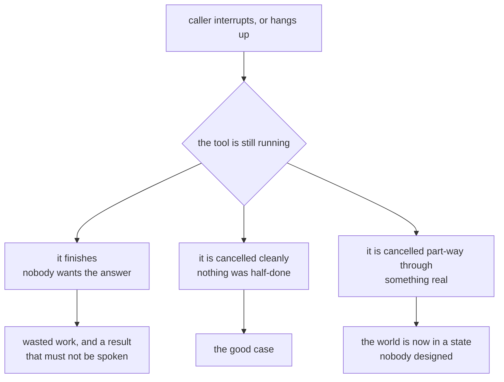

# 4.2 — What a real one adds

## One-line answer

The lab runs a tool inside a live session correctly, and the distance between that and a tool layer
you would let a stranger talk to is not vague "hardening" — it is a **list of nine specific things**,
and almost every one of them is about what happens when a tool is slow, cancelled or wrong, which is
exactly the ground the happy path never walks over.

## The story

Somebody you know cooks well. Not professionally — they cook for friends, and they are good at it,
and everyone says so. A pot of something on the hob, a big dish out of the oven, eight people round
a table that seats six.

Then they decide to do a stall at the weekend market. Same food. Same hands. Same recipes, written
on the same index cards.

Watch what appears in the kitchen over the next few weeks, and notice that none of it makes the food
taste better.

A probe thermometer, so "hot enough" stops being an opinion held by the person who is already tired
and becomes a number somebody else could check. Containers with labels on them — what is inside, and
the day it was made — because the tub you can identify by sight on Tuesday is the tub you are
guessing about on Sunday. A notebook with what went into each batch, because sooner or later a woman
at the front of the queue is going to ask whether there are nuts in it, and *"I don't think so"* is
not an answer you are allowed to give a stranger. And a rule, agreed in advance and written down,
about what gets thrown away rather than sold when nobody can say for certain how long it has been
standing there.

Not one of those is about cooking. Every one of them is about the times it goes wrong — and cooking
for friends never produces those times. If dinner is late your friends have another drink. If
something tastes off somebody says so at the table and you all laugh about it. Nobody at that table
is a stranger, nobody is allergic to anything you do not already know about, and nobody is going to
be ill on Monday and have no idea what they ate.

The cooking was never the gap. The gap was the thermometer, the labels, the notebook and the rule.

## The idea in plain language

The lab is not a toy. `freeze.py` drives a real `run_live` session on the installed runtime, the
model asks for a tool, the runtime runs it, the result goes back through the connection, and the
answer comes out — and part [1.3](../01-the-tool-in-the-middle/1.3-the-line-that-goes-dead.md)
measured the one word inside that tool which decides whether the caller's audio arrives during it or
never arrives at all. Four slices against zero. That is a real measurement on a real loop.

But *"the tool call works"* and *"I would let a customer phone this"* are two different claims, and
what sits between them is a **list**. Not a mood, not a quality bar, not "make it production-ready".
An enumerable set of items, each of which can be pointed at, priced, and argued about. Here is the
whole of it for a tool layer on an open line.

| What the lab has | What a real one adds | What it costs |
| --- | --- | --- |
| an awaited tool, and nothing else competing for the thread | blocking work moved **off the loop into a thread**, so a synchronous dependency cannot freeze the session (part [1.3](../01-the-tool-in-the-middle/1.3-the-line-that-goes-dead.md)) | one wrapper per blocking dependency, and knowing which ones they are |
| one deadline for the whole session | a **timeout per tool**, because a session deadline fires long after the caller gave up | a number per tool, chosen rather than inherited |
| a tool that always runs to the end | **cancellation** — what happens to a running tool when the caller interrupts or hangs up | tools that *can* be cancelled, which not all can |
| `response_scheduling` left unset | a scheduling **declared** per tool (part [2.1](../02-when-the-answer-comes-back/2.1-three-schedulings.md)) | a decision per tool, made once and inherited for years |
| silence during the wait | filler that is true whether or not the tool succeeds (part [2.3](../02-when-the-answer-comes-back/2.3-what-to-say-while-you-wait.md)) | written, reviewed content — not a sentence generated on the spot |
| a tool that always succeeds | what the caller **hears** when a tool fails or times out | a spoken failure path, which is content rather than code |
| one tool at a time | several in flight at once, and the `name` field on the response becoming load-bearing | correlation, and a decision about ordering |
| a tool that is safe to run twice by luck | **idempotency stated per tool**, because a retried or resumed session may run it again | thought, mostly — Day 73's paper on idempotence is the whole argument |
| nothing recorded about the call | which tool ran, how long it took, and whether the caller spoke during it (part [4.1](4.1-the-silence-you-cannot-see.md)) | two counters and a field |

Four words in that table are doing heavy lifting and get plain definitions before anything else
happens.

**A timeout** is a limit you set in advance on how long you are willing to wait for something, after
which you stop waiting — whether or not the thing you were waiting for has finished. Stopping
waiting is not the same as stopping the work, which turns out to be the whole of the third row.

**Cancellation** is telling a piece of work that is already running to stop, rather than merely
walking away from it. In an asynchronous runtime this arrives at the running code as an exception
raised at its next `await`, so a task that never awaits anything cannot be cancelled at all — which
is part 1.3's blocking tool, showing up a second time in a different costume.

**A side effect** is anything a tool changes outside itself: a row written, a card charged, an email
sent, a parcel dispatched. A tool with no side effects only reads. A tool with side effects leaves
the world different afterwards, and the difference is still there whether or not anybody wanted the
answer.

**Idempotency** is the property that running the same operation twice leaves the same result as
running it once. Day 73's paper on idempotence is where this curriculum argues it properly, and Day
72 part 3.2 is where it first bit: a refusal means the request was never performed, a timeout means
you do not know, and the same retry loop that credits a card once after the first credits it twice
after the second.

Three rows of that table deserve more than a cell, because all three look like details and none of
them is.

## Why Sutra needs it

Because the hub's build brief for `sutra/livetools.py` is six items and this list is nine, and the
difference between those two numbers is deliberate. The brief asks for what this day actually
measured plus the two decisions the day argued about: awaitable tools, no `time.sleep`, a declared
scheduling, a decision about filler, and a per-tool timeout. That is a build somebody can finish. A
brief containing all nine would bury the teaching inside a large piece of work.

Because the gate is six checks and **not one of them is from the right-hand column.** It checks that
`TOOLS` exists, that every tool is a coroutine function, that none contains `time.sleep`, that one
declares how its result comes back, and that a test file exists. Every one of those is a fact a
script can read off the source. None of them asks whether a timeout was chosen, whether a running
tool can be cancelled, or whether anybody wrote the sentence the caller hears when the lookup fails
— because those are judgements, and a gate can verify that a function exists but not that a decision
was made. That is why this part is prose rather than a seventh check.

And because it is the notebook with what went into each batch. Everything in that table is something
a person who has operated a voice system knows and would probably never write down. Writing it as a
list is what makes it arguable. A reader who finishes this day believing `freeze.py` is
production-shaped has learned the mechanism and will learn the rest of it with a stranger on the
line.

## The mechanism

One fragment of code, and then the three rows argued properly.

Here is the only deadline anywhere in this lab. From `lab/freeze.py`, dedented from its function
body to column 0 — the four leading spaces are removed and nothing else is changed:

```python
ended = True
try:
    await asyncio.wait_for(consume(), timeout=DEADLINE)
except TimeoutError:
    ended = False
```

**Line by line:**

- `asyncio.wait_for(...)` wraps **the whole of `consume()`** — the entire loop that reads events
  until the turn completes. Its `timeout=DEADLINE` is therefore a limit on the session, not on
  anything inside the session. `DEADLINE` is `5.0` at the top of the file, and the lookup takes
  `0.5`, so on every run in this day this deadline has never once fired.
- `except TimeoutError` is the *only* place the lab notices that something took too long, and what
  it records is a single boolean: `ended`. It cannot say what took too long, because it was never
  watching any particular thing.
- `ended = False` is what the run prints as `the session ended  NO`. One flag for the entire call.
  If the warehouse lookup hung for ever, this is the line that would eventually notice — after the
  session's whole allowance had run out, with the caller sitting in silence for all of it.
- And here is the thing the fragment does not say out loud: when `wait_for` fires it **cancels** the
  coroutine it was waiting on. Cancellation is already in this lab, unnamed, in one line, applied to
  the wrong scope. Whether that cancellation reaches a tool the runtime is running inside its own
  task is not something this day measured, and the honest position is that it was never tested.

The only thing this lab ever cancels deliberately is the fake caller — `talker.cancel()`, a few
lines further down, stopping the task that pushes audio. Never a tool. Everything in the second
extended item below is reasoning about a mechanism this day did not exercise, and it says so again
where it matters.

### The session deadline is not a tool timeout

These look like the same quantity written twice. They are two different numbers, owned by two
different people, protecting two different parties.

**The session deadline protects your infrastructure from a caller who never leaves.** Day 75 part
4.2 built the whole argument: a session that nobody closes holds a connection open for ever, no
event ever arrives saying *this call is over*, and the only thing standing between a voice service
and a slow leak of connections is a deadline somebody chose. That deadline is generous on purpose. A
real conversation with several questions in it has to fit inside, so it is set well above the
longest call anybody expects.

**A tool timeout protects the caller from a dependency that has stopped answering.** It is small,
because it is measured against a person's patience rather than against a conversation's length.

Now put a system that has only the first one on a phone line and follow it through. The caller reads
out an order reference. The desk asks for the lookup. The warehouse system accepts the connection
and then says nothing at all — no error, no refusal, just an open socket that never replies, which
is the most common way a dependency fails and the one that produces no exception anywhere. The tool
is correctly written: it is `async def`, it awaits, the loop is free, the caller's audio is still
arriving. Everything in part 1.3 is satisfied.

And the caller is sitting in silence, on an open line, waiting for a session deadline that was sized
for a whole conversation.

| | the session deadline | the tool timeout |
| --- | --- | --- |
| what it protects | your connections, your workers, your capacity | the person on the line |
| who notices it firing | you, in a dashboard | the caller, immediately |
| how big it is | as long as a whole conversation | as long as somebody will wait for one answer |
| what it is measured against | the longest call you expect | how long a person tolerates dead air |
| where it lives | one number for the service | one number per tool |
| what it does when it fires | ends the call | ends **one** step, and leaves the call alive |

Read the last row twice, because it is the one that decides the argument. A session deadline firing
is the call being over. A tool timeout firing is a step being over, with the conversation still
running and the desk now able to say something — which is only possible because the timeout was
small enough to fire while somebody was still listening.

**The tool timeout is the one the caller experiences.** The session deadline is a number you look at
afterwards. And nothing in the framework will pick either of them for you: there is no default
per-tool timeout to inherit, which is why the build brief asks for one explicitly and marks it as a
number you choose rather than a setting you find.

### Cancellation, and the third outcome

The caller interrupts. Day 75 part 2.2 established that exactly one thing in the stream says the
answer is no longer wanted, and part
[3.3](../03-deciding-when-they-stopped/3.3-interruption-is-a-setting.md) established that whether
the caller speaking counts as an interruption at all is a setting with a name. Either way, something has just decided that what the desk was doing is no longer wanted.

Meanwhile a tool is still running. It does not know anything has happened. It is halfway through a
lookup, or a write, or a call to somebody else's service, and its `await` is going to come back in
its own time regardless of what the caller just did.

There are exactly three ways that ends.



**It finishes and nobody wants the answer.** Harmless in one sense and dangerous in another. The
work was wasted, which costs a request against somebody's quota and nothing else. The danger is the
result: it is going to arrive at the model, and part 2.1's scheduling field is what decides whether
the model reacts to it. A stale result arriving with `INTERRUPT` set is the desk answering a
question the caller abandoned, out loud, over whatever they are saying now.

**It is cancelled cleanly.** The task was awaiting something, the cancellation arrived at that
`await`, the tool stopped, and nothing outside the tool is different from before it started. This is
the good case and it is the case for every tool that only reads.

**It is cancelled part-way through something real.** This is the one worth being careful about, and
it is only a problem for tools with **side effects** — the definition above, and the exact
distinction Day 72 part 3.2 drew between a refusal and a timeout. A refusal tells you the work never
happened. A cancellation half-way through tells you nothing: the order may have been placed, the
message may have been sent, the row may have been written, and the code that would have recorded
what it did never got to that line. The tool has left the world in a state nobody designed, and the
only evidence is whatever it managed to write before it stopped.

Which is why the second column of that row in the table is *tools that can be cancelled, which not
all can*. Cancellability is a property a tool has to be **built** with, not a switch on the runtime:

| Kind of tool | Safe to cancel? | What has to be true |
| --- | --- | --- |
| a read — a lookup, a search, a status check | yes | nothing; stopping changes nothing outside |
| a write behind a request identifier the far end de-duplicates | yes | the identifier, and a far end that honours it |
| a multi-step write with no identifier | no | there is no safe point; it needs redesigning first |
| a call into a blocking dependency | **it cannot be cancelled at all** | it never awaits, so cancellation has nowhere to arrive |

The last row is part 1.3's failure appearing for the second time, and it is worth saying plainly: a
tool that blocks the event loop is not merely rude to the caller's audio, it is also **immune to
being stopped**. There is no `await` for the cancellation to land on, so the runtime asks it to stop
and it carries on to the end regardless.

**And the honest part.** This lab never cancels a tool. `talker.cancel()` cancels the fake caller;
`asyncio.wait_for` cancels the consumer if the session deadline fires, which on this day it never
did. No run measured what happens to a running lookup when the caller interrupts, because the lab's
caller is a scripted task that does not interrupt and the model is scripted too. Everything above is
the mechanism reasoned through, and every number in this part's other sections comes from a run
while this section has none.

### What the caller hears when a tool fails

This is the row people skip, and the reason they skip it is that on every other kind of agent it
does not look like a row at all.

In a text agent a failed lookup is an error. It goes into a log with a traceback, it becomes a
status code, and something in the interface renders it — a red banner, a retry button, a line of
apology written into a template somebody set up once. The failure has a shape and the shape is
visual.

On a voice line the failure has to be **said**. Out loud. In words, in the desk's own voice, at the
moment the caller is waiting. And there are only two places those words can come from: somebody
wrote them in advance, or the model made them up.

If nobody wrote them, the model will make them up — and it will do it well, because that is what it
is for. It will produce a warm, grammatical, plausible sentence about the order, and the sentence
will be about a lookup that raised a connection error. That is Day 72 part 3.1's failure exactly:
the ban on returning *"no incidents reported"* after the retries have all failed to reach anything.
Part [2.3](../02-when-the-answer-comes-back/2.3-what-to-say-while-you-wait.md) moved that same rule
one step earlier in time, to the filler said *before* the result is known. This row is the same rule
one step later, at the moment the result turned out to be an error — and it is the version with a
speaker attached, which changes three things about it.

**It is heard rather than read.** Nobody scrolls back. There is no banner still on screen while the
caller thinks about what to do; there is a sentence that happened and is gone.

**It arrives in the middle of a conversation, not at the end of one.** The caller is going to reply
to it. So the sentence has to leave them somewhere to go — a thing to try, a number to ring, an
offer to take a message — which means it is not one sentence but a small piece of flow, and flow is
written by whoever owns what the product says rather than by whoever wrote the tool.

**And it is the sentence with the widest audience your product owns.** Every caller whose lookup
fails hears the same words, which makes it worth more review than most of the answers.

So the cost in the table is *a spoken failure path, which is content rather than code*. The code is
an `except` and a string constant. The work is the string, and it has a lead time, because somebody
who is allowed to say no has to read it — and that person does not work at the speed of a deploy.

## When it breaks

**Look at the shape of the list rather than at its rows.** Every item is cheap on the day the tool
is written and expensive on the day it is needed. A per-tool timeout is one argument to one call
now, and a caller in silence for the length of a whole session later. Cancellation is a design
constraint on a tool nobody has written yet now, and an order placed for somebody who hung up later.
A spoken failure sentence is a string constant now, and an invented status read out to a stranger
later. Not one of them becomes cheaper by waiting, and several of them become impossible: a tool
built as a multi-step write with no identifier cannot be made cancellable without being rewritten.

**And almost no first version has any of them — including this one.** That is not laziness. Each
item is **individually skippable and only collectively necessary.** Take any row alone and the case
for skipping it is genuinely good: the lookup is fast, nobody hangs up mid-tool, the warehouse
system does not fail, one tool at a time is all we call. Every one of those is true today. What is
false is the conclusion you reach by making all nine arguments in a row.

**Some of it is parked, and parked is not forgotten.**

🅿️ **Anything that requires a live audio model.** Addendum 02 pays for no model that holds an audio
session open, and Day 74 part 4.2 recorded that it could not even verify the free-tier status of one
— a question that is still open on this day. So three things in this part are described rather than
measured: what a caller actually hears during a wait or a failure, whether `response_scheduling`
changes anything observable (part 2.1 quoted a docstring that says the field is ignored outright by
models without asynchronous function calling), and what a real interruption does to a tool that is
still running.

🅿️ **Cancellation of a tool, specifically.** The lab has the machinery — a deadline, a `wait_for`, a
`cancel()` — and points none of it at a tool. Nothing here was measured, no exception was observed
arriving inside a lookup, and no number is offered, because a number produced by cancelling
`asyncio.sleep` would be a fact about `asyncio.sleep`.

**And the honest thing about the list itself.** It is not a standard. No specification anywhere says
a live tool layer shall have these nine properties. It comes from the failures this day actually
measured — four audio slices against zero, a scheduling field that is ignored without saying so, a
filler sentence that is false the moment the tool raises — plus ordinary field knowledge about what
tool layers grow once real people are on the line. So treat it as a checklist to **argue with**
rather than one to comply with. A row you can say does not apply to your system, with a reason, is a
better outcome than a row you ticked. A row you cannot argue about either way is a row you have not
understood yet.

## In production

**Three first, and the order is argued rather than asserted.**

1. **A timeout on every tool.** First because it is the cheapest thing on the list and the only one
   whose absence is *unbounded*: without it, the worst case is not "slow", it is the full session
   deadline spent in silence, and the session deadline was sized for a conversation. It is also the
   only one of the three that needs nothing from anybody else — no content, no redesign of a tool,
   no model. One number per tool, written next to the tool, with a comment saying what it was
   measured against.
2. **The sentence the caller hears when a tool fails.** Second, and above cancellation, because it
   has a **lead time that nothing else on the list has.** Everything else is work you can do; this
   is work somebody else has to approve, and the queue for that is not yours. It is also the item
   whose absence gets filled in automatically and badly — an unwritten failure sentence is not a
   gap, it is an invented one, and it will be fluent. And it pairs with the first: a timeout with
   nothing to say when it fires is a timeout that produces silence slightly sooner.
3. **Cancellation, starting with the classification rather than the code.** Third, not because it
   matters least but because it is the most expensive and the least useful to rush. The first
   deliverable is not a mechanism, it is a table: every tool, and whether it has side effects. That
   costs one careful read of the tool module, and it is the artefact everything else hangs on — you
   cannot decide
   what to do about a cancelled tool until you know which ones leave the world different. Then make
   the read-only ones cancellable, which is free, and treat the rest as a redesign with a ticket
   each.

The interesting thing about that ordering is that items one and three are **coupled**, and it is
worth being explicit about it. A timeout that stops waiting without cancelling has not stopped the
work; it has stopped watching it. For a read that is exactly right and completely sufficient. For a
write it means you have told the caller you gave up while the write is still in flight, which is the
worst of both — Day 72 part 3.2's *you do not know*, produced deliberately by your own code. So ship
timeouts everywhere and cancellation on the reads first, and know which tools are in neither
category yet.

Recording — the last row, and part [4.1](4.1-the-silence-you-cannot-see.md)'s whole subject — sits
fourth here only because 4.1 already made its case. Two counters and a field is genuinely almost
free, and if it is not already done when you reach this list, do it before any of the three.

**And the thing that makes this layer different from every other one you have built.** In seventy-six
days this curriculum has put failures in a lot of places: a retry loop, a queue, a nightly job, a
data boundary, a session that would not end. Every one of them fails into a **log**. Somebody reads
it later, or a dashboard notices, or nobody notices at all — which was part 4.1's entire complaint.

The tool layer on a voice line is where that stops being true. A tool that is slow is a person
sitting in silence. A tool that fails is a sentence somebody hears. A tool that is cancelled
half-way is a question the caller has to be told something about. This is the layer where a system's
failures become **audible**, and the audience is one person at a time, holding a phone. That is why
so much of the right-hand column of the table is content rather than code, and why the review below
spends more of its words on a string constant than on a mechanism.

**The review comment a senior engineer leaves:** *"The tools are awaitable and I'm satisfied nothing
blocks the loop — good. Three things before a customer number points at this. Every tool gets its
own timeout, and it is not the session deadline: the session deadline is sized for a whole
conversation, so a warehouse system that accepts the connection and then never answers leaves the
caller in dead air for the length of a call while we wait for a number that was never about them.
Second, write the sentence we say when a lookup fails, get it approved, and put it in a constant —
right now there is no failure path, which does not mean the caller hears nothing, it means the model
writes it live and it will sound completely convincing. Same rule as never inventing a result after
the retries are exhausted, except this one is spoken and nobody can scroll back. Third, before we
write any cancellation code I want a table of every tool and whether it has side effects, because a
timeout that stops waiting without cancelling is fine for a read and is 'we told them we gave up
while the write was still going' for anything else. And note that the blocking-dependency rule bites
twice — a tool that never awaits can't be cancelled either, so those two problems have the same
fix."*

**The interview question:** *"Your voice agent calls tools. What's on your checklist before a
customer uses it?"* An honest spoken answer: *"I'd answer with a list, because the gap is specific
and a lot of it isn't code. The first one is that blocking work has to be off the event loop — I
measured this: identical tool, `async def` both ways, and with `await asyncio.sleep` four slices of
the caller's audio reached the model's connection during the lookup while with `time.sleep` none did
at all, and neither run raised anything. So `async def` doesn't mean non-blocking, and a synchronous
database driver behaves exactly like the ablation. Second, a timeout per tool, and I'd separate that
from the session deadline — the session deadline protects our connections from callers who never
leave, so it's sized for a whole conversation, and if that's the only limit you have then a
dependency that stops answering leaves a person in silence for the whole of it. The tool timeout is
the one the caller actually experiences. Third, cancellation: when someone interrupts or hangs up
the tool is still running, and there are three outcomes — it finishes and nobody wants the answer,
which matters because that stale result still reaches the model and can be spoken over whatever
they're saying now; it's cancelled cleanly, which is fine; or it's cancelled part-way through
something real, which is only a problem for tools with side effects, and that's the same distinction
as a refusal versus a timeout — a refusal tells you it never happened, a cancellation tells you
nothing. So the first deliverable there is a list of which tools write, not a mechanism. Fourth,
what the caller hears when a tool fails, and I'd push this higher than people expect because it's
content with an approval queue in front of it, not code — if nobody writes it, the model writes it,
and it will produce something warm and plausible about a lookup that actually raised. After that:
declare the response scheduling on every tool rather than inheriting a default nobody chose, filler
that's still true if the tool throws, correlation once more than one tool is in flight, a stated
answer on whether each tool is idempotent because a resumed session may run it again, and enough
recording to know which tool ran, how long it took and whether the caller spoke during it — because
a frozen line raises nothing and ends cleanly. The thing I'd say last is that this is the layer
where failures become audible. Everything else we build fails into a log; this fails into somebody's
ear."*

## Check yourself

```bash
cd days/day-76-vad-and-non-blocking-tools/lab
grep -rn "timeout\|cancel\|sleep" *.py; echo "grep exit: $?"
```

**Line by line:**

- `grep -rn` prints file and line number for every hit, so each one is an address you can open
  rather than a count you have to trust.
- The three words are the three mechanisms this part is about. Read every hit and sort it into one
  of two piles: *this is about the session* or *this is about a tool*. The second pile is smaller
  than you expect, and that is the finding.
- `echo "grep exit: $?"` prints the exit code, which is `0` when there were hits and `1` when there
  were none — worth having, because a silent `grep` and a `grep` you mistyped look the same.

Then the measurement this part does not have, and cannot fabricate. `TODO(me)`: give the lookup its
own timeout, smaller than the session deadline, and watch which limit fires —

```bash
cd days/day-76-vad-and-non-blocking-tools/lab
uv run python freeze.py; echo "exit: $?"
```

**Line by line:**

- Run it once unchanged first, so you have the baseline in front of you: `DEADLINE` is `5.0`,
  `LOOKUP_SECONDS` is `0.5`, and the session limit has never fired on this day.
- Then raise `LOOKUP_SECONDS` in `_live.py` above `DEADLINE` and run it again. Predict, in writing,
  before you run it: which limit fires, what the run prints for *the session ended*, what the exit
  code is, and — the question this part is about — **what the caller was doing for the whole of that
  wait.**
- Then wrap the lookup itself in a per-tool timeout well under `DEADLINE`, run it a third time, and
  write down what changed about the answer to that last question. Put `LOOKUP_SECONDS` back
  afterwards.

Then two exercises.

1. Cut the nine-row table to three. Not the three that are easiest — the three you would insist on
   before a stranger phones this, with one sentence each saying what the caller experiences without
   it. Then hold your three against this part's *In production* order and write down where you
   disagree and why. A different three with a reason behind it is a better answer than the same
   three copied, and the sentence about what the caller experiences is the part that does the work:
   any row you cannot finish that sentence for is a row you have not understood.
2. Take every tool you have written in this repository — not just today's — and put each one in one
   of the four rows of the cancellability table: a read, a write with a de-duplicating identifier, a
   multi-step write without one, or a call into a blocking dependency. Then answer one question
   about each of the last two categories: if the caller hangs up while it is running, what do you
   tell the next person who asks what happened? If you cannot answer, you have found a tool that
   needs redesigning rather than a timeout adding.

Finally, run the day's eval and read what it is actually asking for:

```bash
uv run python gate.py; echo "exit: $?"
```

Measured on 2026-09-06:

```text
Day 76 gate - the live tools the build brief asks for

  ....  sutra/livetools.py is not importable (No module named 'sutra.livetools')

  FAIL  sutra.livetools exists  - write it, per the hub's section 4
  FAIL  it exports a non-empty TOOLS list  - the tools a live session may call, in one place; see part 2.3
  FAIL  every tool is awaitable  - a tool that is not awaited blocks the whole session; see part 1.3
  FAIL  no tool blocks the event loop with time.sleep  - the blocking lookup is part 1.3's ablation, and it is the shape real code has
  FAIL  at least one tool declares how its result comes back  - is_long_running or response_scheduling; leaving both unset is a decision by default
  FAIL  tests/test_livetools.py exists  - the blocking rule needs a test that can go red

findings: 6
  - sutra.livetools exists - write it, per the hub's section 4
  - it exports a non-empty TOOLS list - the tools a live session may call, in one place; see part 2.3
  - every tool is awaitable - a tool that is not awaited blocks the whole session; see part 1.3
  - no tool blocks the event loop with time.sleep - the blocking lookup is part 1.3's ablation, and it is the shape real code has
  - at least one tool declares how its result comes back - is_long_running or response_scheduling; leaving both unset is a decision by default
  - tests/test_livetools.py exists - the blocking rule needs a test that can go red
exit: 1
```

Six red, because `sutra/livetools.py` is the build brief. Now hold those six against this part's
nine-row table and notice which column they come from. Awaiting rather than blocking, no `time.sleep`,
a declared scheduling — every one is a row the lab already demonstrates. **Not one is from the "what a
real one adds" column.** No check here asks whether a tool has its own timeout, whether it can be
cancelled, or what the caller hears when it fails, because a gate can verify that a function has a
shape and not that a judgement was made about a person on the other end of a line. That is why this
part is prose rather than a seventh check.

**Out loud, without scrolling up:** your session has a deadline and your tool does not have a
timeout. The dependency accepts the connection and then never answers. Say what the caller
experiences, and say which of the two numbers was ever about them.

---

The day made a tool call audible: it found the one word inside a tool that decides whether the line
survives it, read off the three answers to *when* a result should come back, and turned voice
activity detection from a property of the service into a panel of settings that somebody has to
turn. Those settings — how long a silence has to last, how sensitive the start and the end of speech
are, how much audio to keep from before somebody began — are all approximations of one problem,
named and attacked in 1975. Its demo is the argument for why any of the knobs exist: an energy
threshold alone clips **8 frames** off a 24-frame word, and recovers every one of them when its
second measurement is put back.

**Next:** [An Algorithm for Determining the Endpoints of Isolated Utterances — the paper](../../papers/01-endpoint-detection.md).
