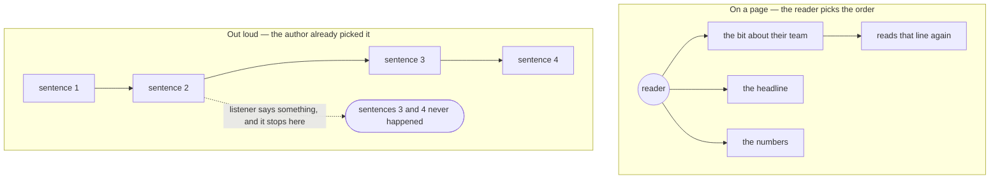

# 1.1 — A report with one chance

## One-line answer

A written report is finished by its **reader** — they choose where to start, go back over a line,
skip the part that is not theirs and stop when they have what they came for — while a spoken report
arrives **in one order, at one speed, once**, so every convenience the page hands out for free has to
be supplied by the **author** instead, and the first and biggest of them is deciding *what comes
first*.

## The story

You are driving to work and the news comes on.

You did not choose the running order. Somebody in a newsroom did, before you got in the car. So it
opens with a political story, then something from abroad, then a long piece about a report you have
never heard of, then the sport. Right at the end, in the travel bulletin, comes the one thing that
was actually going to change your morning: the road you take is shut and the diversion goes the long
way round.

Except you did not hear it, because by then you were reversing into a space with the radio half in
your ear, and you turned the engine off before they got to it.

Now picture the same stories on the kitchen table in a newspaper. You would never have read them in
that order. You would have opened it flat, run your eye down the page, gone straight to the local
section because that is the bit that affects you, ignored the piece about the report entirely, and
gone back over the sentence with the road name in it because you wanted to be sure you had read it
right. Same journalism. Same facts. Completely different experience — and, crucially, a completely
different **outcome**, because on the page you got the useful thing and in the car you did not.

Look at what the car took away from you, one item at a time. You could not start where you wanted:
you got whatever they were on when you switched it on. You could not go back: the presenter said a
street name once and it was gone, and there is no asking a radio to say it again. You could not skip
ahead: you had to sit through the sport or reach for the dial. You could not search: there is nothing
to scan, no way to find your road except to wait and hope it comes up. And when you stopped — which
you always do, because the journey ends — what you lost was not "the rest", it was specifically
*whatever they had not got to yet*, and somebody else decided what that was.

That is the whole of today. The newsroom's running order is not presentation laid over the news. For
a listener who leaves early, the running order **is** the news, because it decides which stories
exist and which ones do not. Put the road closure first and every driver in the county gets it. Put
it last and you have broadcast it perfectly and told nobody.

Your standup agent is the radio. It is not the newspaper.

## The idea in plain language

Two words first.

A **standup** is a short report a team gives itself on the state of the work: what moved, what is
stuck, what needs a decision from somebody. The name comes from teams giving it standing up so it
stays short. In this curriculum it is the desk's report on its own queue — a **queue** being the pile
of open **tickets**, one ticket per customer problem that has not been closed yet. Today the desk
says that report **out loud**, to somebody who is also filling a kettle.

Now the claim, in one sentence: **a written report is a shared job, and a spoken report is not.**

When you write, you supply the facts and the reader supplies everything else. The reader decides the
order. The reader decides what to skip. The reader re-reads the bit they did not follow. The reader
stops when they are satisfied, and because they were steering, they stop having got what they needed.
Half the quality of a written report is contributed by somebody who is not you, for free, and you
never see the bill.

Out loud, that second person is gone. Nobody is steering but you. The listener gets your order, at
your pace, exactly once, and then it is over — so every one of those reader powers either gets
supplied by you or does not happen at all.



The top half has many arrows because the reader draws them. The bottom half has one, because you
drew it, and everything past the point where the listener speaks or walks off is not a shorter report
— it is a report that was never delivered.

Here is the trade written out. Read the middle column as the honest answer, not the polite one.

| What a reader of a written report can do | Can a listener do it? | What the author must therefore supply |
| --- | --- | --- |
| Choose where to start | No. They start where you started | The first sentence has to be the most important one, chosen deliberately |
| Re-read a line they did not catch | No. It went past once and it is gone | Short sentences that survive one pass — no nested clauses, no long lists of numbers |
| Skip a section that is not theirs | No. They sit through it, or they interrupt | Leave it out, or put it after everything they actually need |
| Search for a word — a ticket number, a name | No. There is nothing to scan | Say the reason next to the thing, because there is no second look-up |
| Stop early without losing the important part | Only by luck. What they lose is whatever you had not reached | An order in which stopping early is safe |

Every row in the right-hand column is work that a page does for you and a voice line does not. That
is the craft this day is about, and it is genuinely a different craft from the one you use for a
dashboard or a status email — not a harder one, but one where the decisions land somewhere else.

One warning, because the obvious conclusion from that table is the wrong one. The answer is **not
"make it shorter"**. A shorter report is still a report in some order, and if the order is wrong you
have simply broadcast fewer of the wrong things first. The answer is *earlier*, which is a claim this
part is deliberately not proving — part [2.3](../02-the-order-is-the-product/2.3-words-before-it-matters.md)
measures it.

## Why Sutra needs it

The desk has been writing reports for days. Day 73 built the nightly job and its digest — a written
summary, produced while nobody was watching, waiting in a file for somebody to open in the morning.
Day 73 part 3.2 is the direct ancestor of today's problem: it argued that a digest which says nothing
on a good night is indistinguishable from a job that never ran. That is already a question about what
a report *communicates* rather than what it contains. But it was still a written report, and a
written report has a reader who will skim it, jump to the failures, and scroll back up if the first
line was confusing.

Days 74, 75 and 76 then took the reader away. Day 74 made an answer arrive in pieces while somebody
waited. Day 75 held a connection open so both ends could speak at any moment. Day 76 made sure a tool
call in the middle did not kill the line. None of those days had anything to say about *content* —
they were about the pipe.

Today the pipe carries a report, and the pipe has changed what a report is.

That is why the hub's build brief asks for something that looks over-specified for such a small
program. It wants one function, `lines(queue, night)`, returning a list of `(text, attention)` pairs
**in the order they would be spoken**. Not a function that prints. Not a template. A list, in order,
with a flag on each item saying whether it is one of the ones somebody has to act on — because if the
order is the thing that decides what gets delivered, then the order has to be a value you can look at,
test and get wrong in exactly one place. The shape of that return type is this part's claim turned
into code, and part [2.1](../02-the-order-is-the-product/2.1-one-function-one-order.md) is where it
gets built.

There is a second reason, and it outlives voice agents entirely. Anything that reaches a person in a
fixed sequence they do not control inherits this problem: a phone call, an alert that reads itself
out, a notification that shows one line, an assistant on a speaker in a kitchen. In every one of them
the author owns the order, and in every one of them the standard engineering instinct — *be complete,
be accurate, be neutral about what matters* — produces something that is correct and useless.

## The mechanism

There is no ordering code in this part. What there is instead is the one design decision the ordering
will later depend on, and it lives in the day's fixture — `lab/_state.py`, the file that holds the
twelve tickets and last night's job so that every script on this day is talking about the same
morning. A **fixture** is exactly that: data pinned in place so a measurement is about the code and
not about the mood of the data.

Here is the ticket. It is quoted exactly as it sits in the file; the decorator and the class start at
the left margin already, so nothing has been dedented, and the indentation you see inside is Python's
own.

```python
@dataclass(frozen=True)
class Ticket:
    """One open ticket on the desk.

    Attributes:
        ref: what a person would read out.
        category: the three buckets the desk sorts by.
        days_open: how long it has been sitting there.
        needs_person: whether it is stuck on a decision only somebody human can make. This is the
            field the whole day turns on, and it is deliberately not derivable from the others - a
            ticket can be old and fine, or new and blocked.
    """

    ref: str
    category: str
    days_open: int
    needs_person: bool
    why: str = ""
```

**Line by line:**

- `@dataclass(frozen=True)` — a **dataclass** is Python's way of declaring a small record by listing
  its fields; the decorator writes the constructor and the comparison methods for you. `frozen=True`
  makes an instance read-only: assign to a field after it is built and Python raises
  `dataclasses.FrozenInstanceError`. That is not defensive habit here, it is a measurement
  requirement. This day compares two orderings of the same twelve tickets across several scripts, and
  the comparison only means anything if the tickets are identical in both arms. A fixture that any
  script can quietly nudge is a fixture that can drift, and a drifting fixture turns a measurement
  into an anecdote.
- `ref: str` — the ticket's reference, and the docstring calls it *"what a person would read out"*.
  That phrasing is a spoken-report decision hiding in a field comment. A database identifier that
  nobody can say aloud — a long random string, a hyphenated code — is fine on a screen where the eye
  copies it, and unusable in a sentence somebody hears once.
- `category: str` — the bucket the desk sorts by, and worth noticing precisely because it is the
  structure the *data* has. It is the obvious way to organise a report, it is how a dashboard would
  group the queue, and it is not the same thing as the order a listener needs. Holding those two
  apart is the day.
- `days_open: int` — how long it has been sitting there, and the tempting proxy for importance.
- `needs_person: bool` — the field the day turns on, and the docstring is blunt about why it exists
  as a stored fact rather than a rule computed from the others: *"a ticket can be old and fine, or new
  and blocked."* Read that twice. It says that "old" and "blocked" are **different things**, and that
  only one of them is a judgement. Age is arithmetic: subtract two dates and you have it, and it is
  the same answer for everybody, forever. Whether a ticket is stuck on a decision that only a human
  can make is not arithmetic at all — somebody looked at it and decided. Any rule you invent to
  recover that judgement from the other fields (*"anything older than a week needs a person"*) will be
  wrong in both directions on the very first real queue: it will chase somebody about a ticket that is
  old and perfectly fine, and it will stay silent about the refund that was raised this morning and
  cannot move without an approval. So the judgement is **carried on the ticket**, made once, by
  whoever was in a position to make it. Everything downstream reads a flag instead of guessing.
- `why: str = ""` — free text, defaulting to empty, and this is the field that separates a report from
  a list. Without it the best sentence the standup can produce is *which* tickets need a person. With
  it, the standup can say **why** — *"refund over the limit, needs an approval"* — and the difference
  is not decoration. A listener who hears a number can only write it down and go and look. A listener
  who hears the reason can decide, in the same breath, whether it is theirs, whether it can wait, and
  what they would do about it. On a page the reader would have gone and looked the reason up. Out
  loud, there is nowhere to look, so the reason travels with the number or it does not arrive. That is
  row four of this part's table, made concrete in a single default argument.

Two things this part is deliberately not doing. It is not showing you how the agent gets hold of this
state over a live session — three tools, called in one turn, each answered before the next is asked
for, which is part [1.2](1.2-the-three-tools.md). And it is not showing you what the agent said, or
what the listener actually walked away with, which is part
[1.3](1.3-what-the-listener-got.md). The one number worth carrying forward from those pages is that
the day's two orderings come out at **5 sentences against 14**, and **0 words against 25** before the
first thing that needs a person — same facts, same tools, nothing left out of either.

## When it breaks

The failure this part sets up produces no traceback, no non-zero exit from anything you would
normally run, and no unhappy user you can point at in a log. It is a report that is entirely correct
and does not work.

🎬 **The scene.** You have the queue in hand, so you write the standup the way you would write
anything else that reports on data: you walk the structure. Open with the total, because that is the
headline number. Then go through the tickets, in the order the queue holds them, one sentence each —
reference, category, how long it has been open. Then last night's job at the end, because it is a
different subject and it belongs in its own section. It is complete: nothing is omitted. It is
accurate: every sentence is true. It is neutral: no item is dressed up as more important than
another, which feels like the professional thing to do.

😬 **The naive fix.** Somebody says it feels long, so you trim it. You cut the category from each
line, you merge two sentences, you add a tidy summary at the end that says which tickets need
somebody. It is now shorter and it has a conclusion, which is how you would fix a written report.

💥 **Why it fails.** The listener is making tea, and after a couple of sentences they say something —
*"hang on"*, *"which one?"*, or just the start of a question. On an open line that is not an
interruption of a paragraph, it is the end of the report. Your summary was at the end. Your two
tickets that needed a decision were somewhere in the middle, arranged by nothing more meaningful than
the order the queue happened to be sitting in. The listener now has an accurate total and no reason to
do anything. Every fact you were graded on is correct, and the person you wrote it for has learned
nothing they could act on. The day's queue-order run exits non-zero for exactly this reason, and the
count is part [2.3](../02-the-order-is-the-product/2.3-words-before-it-matters.md)'s.

💡 **The insight.** You wrote a dashboard and read it out. A dashboard is ordered by the shape of the
data — totals, then breakdown, then detail — because a dashboard has a reader whose eye lands where it
likes. A spoken report has to be ordered by the shape of the listener's **decision**, because the
listener has no eye and no second pass. Same facts, different ordering principle.

And now the part that makes this expensive rather than merely wrong: **you cannot see this failure in
review.**

Think about how the report above gets reviewed. It arrives as a diff, or as a paste in a channel, or
as a test fixture. The reviewer *reads* it. And a reader has every power in the left-hand column of
this part's table: their eye goes to the summary at the bottom, they scan back up for the ticket
numbers, they skip the six lines that all look the same, and they form the judgement *"yes, this is a
complete and accurate standup"* — which it is. They have reviewed the content, in the medium where
content is easy, and reported back that it is fine. The one property that decides whether the report
works — what a person who cannot skim gets before they stop listening — is invisible in the medium in
which it was reviewed, because the reviewer was never subjected to the constraint.

The honest test is uncomfortable and takes no tooling: **have somebody read it to you while you do
something else, and stop them after two sentences.** Whatever you know at that point is the report.
Everything else was a rehearsal.

## In production

**The author owns the order, and there is no above the fold.** In written reporting, "above the fold"
is the part visible before anybody scrolls, and burying something below it is a soft failure: the
information is still there, the reader's own eye often rescues you, and if they miss it you can point
at the line and say it was sent. Out loud there is no fold. There is only *before* and *after*, and
after may not exist at all. That changes what an omission is. In a written report, putting something
last is a ranking. In a spoken one, putting something last is a bet that the listener is still there,
and you will never find out how the bet went, because a listener who stopped listening does not file a
complaint — they just do not know the thing, and you never learn which sentence they got to.

**What a professional does before writing a single sentence.** Not "what do we know about the queue".
Two different questions, in this order:

| The question | Why it is different out loud | What it costs to skip |
| --- | --- | --- |
| Who exactly is listening to this? | The page serves several readers at once, because each one skips differently. A voice line serves one order, so it serves one person | You write for an imaginary average person and produce a report that is nobody's first sentence |
| What would they actually *do* about each item? | A listener cannot triage while listening; they get your triage or none | Items land in the order the data happened to sit in, which is a ranking by accident |
| What happens if they stop after the first sentence? | On a page, nothing — they scroll back. Out loud, the report ends there | You find out by not finding out: no error, no complaint, just a decision nobody made |

The first row is the one that surprises people, and it is why part
[4.2](../04-in-production/4.2-who-it-is-for.md) exists: the same twelve tickets make three genuinely
different standups for an engineer, for whoever is on support, and for a manager, and a single
standup that serves all three is a compromise. It can be a perfectly good compromise. It just has to
be one somebody made **on purpose**, written down, rather than one that fell out of iterating on the
wording until everybody stopped complaining.

The second row is where most of the engineering effort actually goes, and it is not writing effort. If
the report is to be ordered by what the listener would do, then something in the data has to record
what needs doing — which is the `needs_person` field above, and the reason it is a stored judgement
rather than a rule. Ordering by importance is easy. Knowing what is important is a data-modelling
problem, and it is solved upstream of the report or not at all.

**Reports that get heard become smaller, and the cut is not where you expect.** Teams shortening a
spoken report almost always cut *detail* first, because detail is obviously the long part: they drop
the reason, keep the reference, and end up reading out a list of numbers, which is the one form a
listener genuinely cannot use. The right cut is by **audience**: remove whole items this listener
would do nothing about, and keep the reason attached to the ones that survive. Fewer items, each said
fully, beats every item, each said in four words.

**The review comment a senior engineer leaves:** *"I read this and it is completely correct, which is
why I nearly approved it. Then I remembered nobody reads it. Read it to me tomorrow and stop after two
sentences and tell me what I know at that point — I think the answer is a ticket count and nothing
else, and a ticket count has never caused anybody to do anything. Two things I want in the diff.
First, who is this for? Not 'the team'. One person, named by role, written in the module docstring,
because everything about the order follows from that answer and right now the order follows from the
queue's iteration order, which is an accident we are shipping as a decision. Second, the two blocked
ones are in the middle. Move them to the front, and bring the reason with them — 'refund over the
limit, needs an approval' does work that '4688' does not, and out loud there is no clicking through.
And the summary at the bottom needs to go to the top or go away. A summary at the end of something
people interrupt is a summary for the author."*

**The interview question:** *"Your team has a status report that everybody agrees is accurate, and
nobody acts on it. It is about to be delivered by voice instead of email. What do you change?"* An
answer that shows the work: *"The first thing I would change is who the report thinks its second
author is. A written report is co-produced: I supply facts and the reader supplies the order, the
skipping, the re-reading and the stopping point, and because they are steering they usually stop
having got what they came for. Out loud that person is gone, so I own all of it. Practically that
means the first sentence is the whole design. I would ask who is listening — one person, by role, not
'the team' — then, for each item, what that person would actually do about it, and I would put the
items they would act on first, with the reason said next to the item, because there is no looking
anything up while you are being talked at. Then I would check the data can even support that, because
ordering by importance needs importance to be a field somebody set, not a rule like 'older than a
week' — old and blocked are different things and only one of them is a judgement. The failure I would
warn about is that none of this shows up in review. The report reads perfectly on a screen, because a
reviewer reading it has all the powers the listener does not have, and they will tell you it is
complete and accurate, and they will be right. The only honest test is having it read to you while you
are doing something else and being cut off part way through — and then asking what you would now go
and do."*

## Check yourself

```bash
cd days/day-77-the-standup-agent/lab
uv run python standup.py
```

**Line by line:**

- `cd` into the lab first, because the day's scripts do `import _state` as a sibling module and will
  not find it from the repository root.
- `uv run` executes inside this project's pinned environment. Nothing here contacts a provider: this
  script only builds sentences from the fixture, so the run costs no quota.
- **Read only the sentences and cover the numbers underneath them.** Better still, read them out loud
  at speaking pace and stop yourself after the second one. The question this part can answer is just:
  *would somebody who heard only that much know what to do?* The counts printed at the bottom belong to
  parts [1.3](1.3-what-the-listener-got.md) and
  [2.3](../02-the-order-is-the-product/2.3-words-before-it-matters.md), and reading them here spoils a
  result you should meet as a surprise.

Two exercises.

**One.** Find the last written status update you sent to a real person — a message, a ticket comment,
a weekly note. Do not edit it. Read it aloud at the speed you would say it to somebody, and stop dead
at the end of the second sentence. Write down, in one line, what a listener would now go and do.
Then write down what you had *wanted* them to do. If those two lines differ, you have reproduced this
part's failure on your own writing, in the medium where it is visible.

**Two.** Take the fourth row of this part's table — the reader who can search for a word. A listener
cannot. Write the single change to a spoken report that replaces search, then find the field in
`_state.py` that makes that change possible, and say in one sentence what the standup could say
without it. The answer is short, and it is the difference between a report and a list.

**Out loud, without scrolling up:** *a written report and a spoken one contain exactly the same facts,
so what precisely does the page give you that the voice line does not — and why does that make
"accurate and complete" a failing grade for the spoken one?*

**Next:** [1.2 — The three tools, called for real](1.2-the-three-tools.md).
