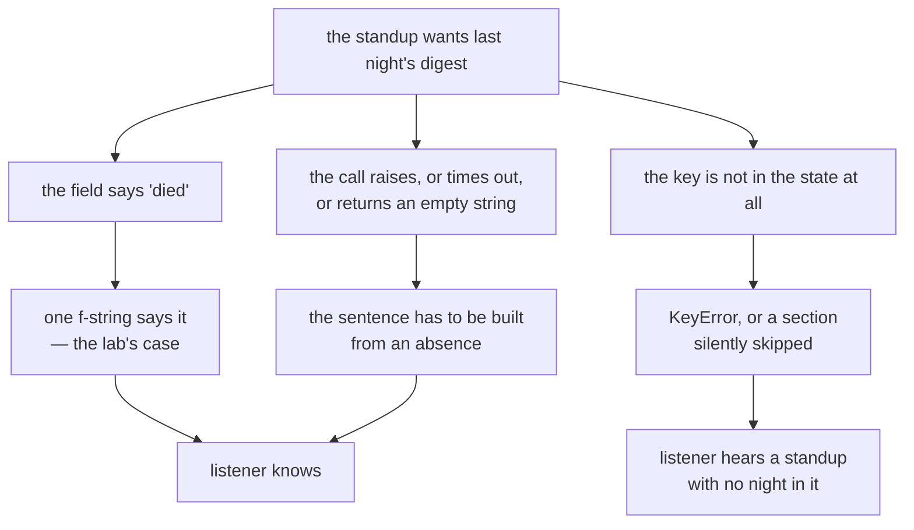

# 3.2 — Saying what you do not know

## One-line answer

Last night's job died before it wrote the digest, so one of the three things this standup reports on
**does not exist** — and the dangerous version of that is not a wrong sentence, it is **no sentence**,
because a section quietly left out of a spoken report is heard as *nothing to report*: omitting the
digest does not omit anything, it **asserts a good night**.

## The story

You want two shelf brackets of a size that is never in stock, so you go to the hardware shop on the
Saturday morning rather than order them and wait.

The man behind the counter types the code into the stock screen. You can see it side on: a row for
the item, then a column for how many are here, then a column for the other branch across town. The
other branch has a 6 in it. This branch has nothing in it. Not a nought — nothing, an empty box, the
same empty box every other row on that screen would have if nobody had ever counted anything.

He looks at it and says: *we've none of those, try the branch at the retail park, they've got six.*
So you drive across town, and the six are the wrong pattern, and you come home with nothing and the
shelf stays in the hall for another week.

Here is what was actually true. The empty box did not mean none. It meant the stock count for that
aisle had not been run since the Thursday, because the handheld scanner went off to be fixed and
nobody has done that aisle by hand since. There were four brackets in the drawer under the display,
in the right pattern, the whole time you were standing there.

Nobody lied to you. The screen had no way of printing *I have not been told*, and the man at the
counter had a customer in front of him and every other row on his screen carrying a number. A blank
in a column of numbers does not read as a blank. It reads as a nought. And a nought is a fact about
the world — *there are none here* — which nobody had established, and which sent you across town.

## The idea in plain language

Part [3.1](3.1-nothing-needs-you.md) took the morning when the standup has nothing to flag, and
established that **silence and "nothing needs you" are different reports**. This part takes the
harder version of the same morning: the standup has something to flag, and it **cannot see it**.

Three things can be behind a report with no value in it, and they are not the same thing at all.

- **A measured nothing.** Somebody looked, and there was nothing there. Two of these are in today's
  fixture: an aisle with no brackets on the shelf, a queue with no ticket needing a person. This is
  part 3.1's case, and the sentence for it is *nothing needs you*.
- **A value that exists and was not asked for.** The report is fine; it is just narrower than the
  state. Held over to *When it breaks*, because this lab has one.
- **No value, because the thing that produces it did not run.** Nobody looked. This is the digest
  this morning, and it is the subject of this part.

The first and the third produce identical output in almost every report anybody writes, and that is
the whole failure. On a page you at least get a hole to look at — a blank cell, an empty section
heading, a dash where a number should be — and a careful reader can ask what the hole means. **In
speech there is not even a hole.** The sentences simply run on from the one before to the one after.
The listener has no way to notice the absence of a sentence they have never heard, so they do what
people always do with an absence: they fill it with the ordinary case. And the ordinary case for a
nightly job is *it ran*.

So the rule for a spoken report is stronger than the rule for a written one, and it is worth saying
in one line: **an absence has to be spoken, or it does not exist.**

Four ways a standup can handle a fact it could not read. Only one of them is defensible, and the
fourth is worse than saying nothing.

| How the standup handles state it could not read | What the listener concludes | What it costs |
| --- | --- | --- |
| Says nothing about it | The night went fine. Every other morning's standup mentions the night, and this morning nothing contradicted them | An assertion nobody wrote and nobody can search for. There is no wrong value, no flag, no log line — the cost lands later, on whoever opens the digest expecting it to be there |
| Says "no data" | Something is missing. Not what, not whether it is new, not whether it matters | A sentence spent, and a question created: the listener has to go and look, which is the errand the standup existed to save them. Honest but not actionable — and still far better than the row above |
| Says what failed and when | The reindex ran, the evals ran, the digest stage died last night, so there is no digest this morning | One sentence, plus one judgement somebody has to make: is a dead stage a thing that needs a person? That judgement is the only cost, and it is the cost worth paying. This is the lab's row |
| Reads out the last digest it has | They have this morning's digest | Day 72 part 3.1's invented answer, now with a voice. Worse than the first row: a vague good impression can be corrected, but a specific stale number gets repeated in a meeting as today's. Speech carries no provenance — **provenance** being a record of where a value came from — so there is no date next to the sentence, nothing to hover over, and no way for the listener to tell yesterday's numbers from this morning's |

## Why Sutra needs it

Because the state this standup reads was written by a job that died, and this is the only place a
person finds out.

Day 73 built that job, and its part 2.1 measured exactly what a half-finished run leaves behind: the
index on disk, no evals file, no digest, an exit code of `1`, and one line in the run log saying
`"died_at"`. Today's fixture is the morning after precisely that. `_state.LAST_NIGHT` says `reindex`
was `ok`, `evals` got as far as `3 of 5 passed`, and `digest` is the string `died`. A **digest**, from
Day 73 part 3.2, is the short written summary a nightly job leaves for the people who own it — the
entire interface between work nobody watched and the humans who have to act on it.

That job ran at night with nobody watching. Its own honest reporting — the run log, the exit code,
the `died_at` field — is sitting in files that nobody will open before the day starts. **The standup
is the first and possibly only human-facing surface the failure has to cross.** If it crosses that
surface silently, every honest layer underneath it was wasted work: the log wrote the truth, the exit
code carried the truth, and the report laundered it.

There is a second, sharper reason. Day 73 part 3.2 already fought this fight one layer down. It
measured a digest that listed only what succeeded, and found it named **0** of the **2** failing eval
cases while every number in it was true. The fix there was ordering, not more information. Today's
standup inherits both the failing cases and the lesson, and — as *When it breaks* admits — it does not
yet say either of their names.

## The mechanism

Here is the whole of the helper, copied as it stands in `lab/standup.py`. It already sits at column 0
in the file, so nothing has been dedented and nothing has been trimmed:

```python
def _night() -> Line:
    night = _state.LAST_NIGHT
    return (
        f"Last night the evals were {night['evals']} and the digest stage {night['digest']}.",
        False,
    )
```

**Line by line:**

- `night = _state.LAST_NIGHT` binds the fixture dictionary once. `Line` is the day's alias for
  `tuple[str, bool]` — a sentence and a flag saying whether somebody has to act on it — introduced in
  part [2.1](../02-the-order-is-the-product/2.1-one-function-one-order.md).
- `{night['digest']}` is the honest line, and the reason it is honest is worth being precise about.
  There is **no special case for failure here**. The function does not test whether the digest died,
  it does not have an `if` in it, and nobody wrote a branch that says *and if the digest is missing,
  mention it*. It interpolates whatever is in the field. That is why the word `died` reaches the
  listener: for exactly the same reason the word `ok` would. **The honesty is structural rather than
  handled** — which is the only kind that survives, because a special case for failure is a special
  case somebody can forget to write.
- `{night['evals']}` is a **shortcut this lab took, and a real implementation cannot**. `'3 of 5
  passed'` is a pre-formatted English string sitting in the fixture. A real standup gets two numbers
  from an eval run, and formatting them is the easy half; the hard half is what the sentence says when
  the run produced no numbers at all. Because the evals stage happened to finish last night, this
  function never has to answer that, and the reader should not mistake *it did not come up* for *it
  was designed*.
- `False` is the attention flag on the night sentence, and it is a **judgement, not a fact**. It says a
  dead digest stage is background, not something the listener has to decide about. That is arguable
  and I would argue the other way: *do we rerun the digest before people start asking for it, or do we
  skip a morning?* is a decision, only a person can take it, and the flag's meaning — established in
  part 2.1 — is exactly *somebody has to decide something*. Flag it `True` and the standup says the
  right thing about its own blind spot.
- The uncomfortable detail about that flag: **flipping it changes neither of the day's headline
  numbers.** In `attention_first()` the night sentence is last and the first sentence is already
  flagged, so words-before-the-first-flagged-line stays `0`. In `flat()` the night sentence is also
  last and both blocked tickets come before it, so the count stays `25`. A decision that moves no
  measurement is a decision nobody is forced to make — which is precisely how it ends up never being
  made at all.
- One more thing this function does not do, and it is the quiet one. `_state.LAST_NIGHT` also carries
  `"failing": ("sso", "webhooks")` — the names of the two eval cases that failed. `_night()` never
  reads that key, so **those two names are in the state and are not in the standup**. The listener
  hears that three of five passed and is told nothing about which two did not.

Three different worlds produce "there is no digest this morning", and only the first is the one this
lab is in:



Pull the night sentence out of a run without reprinting the transcripts that parts 1.3 and 2.3 own:

```bash
cd days/day-77-the-standup-agent/lab
uv run python standup.py | grep digest
```

**Line by line:**

- `cd` into the lab first: `standup.py` imports its sibling by plain name (`import _state`), so the lab
  directory has to be the working directory.
- No flag is the attention-first ordering. `grep digest` keeps the single sentence this part is about
  and drops the rest, which belongs to the parts that measured it.
- Running it with `--flat` prints the **same sentence**, because `_night()` is called by both
  orderings. The order changed; the honesty did not.

Measured on 2026-09-06:

```text
    Last night the evals were 3 of 5 passed and the digest stage died.
```

Read that sentence against the story. It **says** the thing the stock screen could not: not a blank
where a digest should be, but four words — *the digest stage died* — that a person can act on before
they have finished their tea. Nobody had to write a failure path to get them.

Now the version this part exists to warn about, which is not in the lab and which you should write:

```bash
cd days/day-77-the-standup-agent/lab
# TODO(me): add a --quiet-night flag that drops the night sentence when the digest died,
# then run both and read them side by side.
uv run python standup.py
uv run python standup.py --quiet-night
```

**Line by line:**

- The second command is the **ablation** for this part — the same system with one idea switched off,
  as defined in part [2.3](../02-the-order-is-the-product/2.3-words-before-it-matters.md). The idea
  being switched off here is *say the absence*.
- It is marked `TODO(me)` because the flag does not exist yet and this document will not invent an
  output for a run that has not happened. Write it, run it, and read the second standup out loud to
  somebody who has not seen the fixture.
- What you are listening for is that the second standup is **not obviously worse**. It is shorter, it
  is fluent, every sentence in it is true, and nothing in it sounds wrong. That is the whole danger:
  the broken version passes every check a listener can perform.

## When it breaks

**The fixture makes this failure far too easy.** `"digest": "died"` is a string sitting in a
dictionary waiting to be interpolated, so the honest sentence is one f-string away. A real standup
does not get that. It asks a system for last night's digest and gets an exception, or a request that
never comes back, or an empty string, or a file that is not there. The honest sentence then has to be
**constructed from an absence** rather than read out of a field, and that is a different and much
worse job, because there is nothing to interpolate.

Ask this fixture for something it does not have and you get the ordinary shape of that problem.
Measured on 2026-09-06:

```bash
cd days/day-77-the-standup-agent/lab
uv run python -c "import _state; print(_state.LAST_NIGHT['summary'])"
```

**Line by line:**

- `-c` runs one statement, so the failure is the dictionary lookup and nothing else.
- `'summary'` is a key that no version of this fixture has ever had. It stands in for the real case:
  a section of the report asking the state for something the state cannot give it.

```text
Traceback (most recent call last):
  File "<string>", line 1, in <module>
KeyError: 'summary'
```

That is the good outcome, and it is worth saying so plainly. `KeyError: 'summary'` is loud, it stops
the report, and somebody fixes it. The bad outcome is the one that never raises: a section wrapped in
`try` and `except`, or in `night.get('digest', '')`, which turns a missing field into an empty string,
an empty string into an empty sentence, and an empty sentence into a standup with no night in it.
**That is where implementations quietly drop the section** — not out of dishonesty, but because a
report that crashes at seven in the morning gets a `try` round it by the afternoon, and the `except`
branch has to do *something*, and doing nothing looks like the polite option.

**The two failing eval cases are a real gap in this lab's own report.** `_state.LAST_NIGHT` names
`sso` and `webhooks`, and the standup says neither of them, in either ordering. This is not a
hypothetical: it is the second of the three shapes from *The idea in plain language* — a value that
exists and was not asked for — sitting in the middle of the part that complains about omissions. Worse,
it is a **regression against Day 73 part 3.2**, which measured a digest naming 0 of 2 failing eval
cases, called that the failure, and fixed it. Today's standup names 0 of 2 again, one layer up. The
lesson did not travel with the data, and nothing in the gate would have caught that, because no test
asserts that anything the state knows is failing gets said out loud.

**And there is a limit in the other direction.** A standup that says *I don't know* about eight things
is a standup nobody listens to, and it fails in a way that is harder to fix, because the listener
learns to tune out an entire report rather than one sentence. Every unknown costs a sentence out of a
budget the listener sets, which is part 4.1's subject. The judgement is which unknowns are
**load-bearing** — which ones, if the listener assumes the ordinary case, lead them to do something
they would not otherwise do. A digest that is not there is load-bearing: somebody is going to open it,
or quote it, or make a call on the strength of it. The exact number of seconds the reindex took is
not. The test is not *is this fact missing*, it is **would the listener act differently if they knew
it was missing**.

## In production

**A report is built from sections, and every section knows whether it has data.** The shape that makes
this stop being a matter of discipline is to give each section two jobs: fetch, and describe its own
state. Then a section with no data produces a **sentence** rather than producing nothing, and the
report has no way to be silently short.

```python
def night_section(state: dict[str, object]) -> Line:
    """One sentence about last night, whether or not last night's job left anything."""
    digest = state.get("digest")
    if digest is None:
        return ("I could not read last night's digest, so I do not know how the night went.", True)
    if digest == "died":
        return ("Last night the digest stage died, so there is no digest this morning.", True)
    return (f"Last night finished and the digest is ready: {digest}.", False)
```

**Line by line:**

- The function returns a `Line` on **every** path. There is no branch that returns `None`, and no
  branch that returns an empty list — which is the structural version of the rule, because a section
  that cannot produce nothing cannot be silently dropped.
- `state.get("digest")` deliberately does not raise. The distinction being drawn here is between
  *absent* and *present but bad*, and both need a sentence, so this is one of the rare places a `.get`
  default is correct: it is being used to **choose a sentence**, not to fill in a fact.
- `digest is None` is the case the lab never reaches and production always does. Notice the sentence
  says *I could not read*, not *there is no digest* — it reports the reading, not the world, because
  the world is exactly what this branch failed to observe.
- Both failure branches carry `True`. That is the judgement from *The mechanism* actually taken: a
  night the report cannot vouch for is a thing somebody has to decide about, and flagging it puts it
  in front of the listener under part 2.3's ordering rather than at the end.
- The success branch carries `False` and reads the digest out. Same function, same shape, no separate
  failure path bolted on later.

**Name the pattern, because this is its third appearance in five days.** Day 72 part 3.1: when the
retries are exhausted, **raise** — never return a value nothing measured. Day 73 part 3.2: when a
stage did not run, the digest **says so** — never list the successes and stop. Day 77 part 3.2: when
the report cannot read a section, it **says a sentence about the gap** — never leave the section out.
Three different layers — the call, the artefact, the spoken report — and one rule underneath all of
them, which is Principle 10 pointed at absence rather than at error: **a gap has to be said out loud.**
It arrives again at the call, the file and the voice because it is not a property of any of them; it
is a property of every boundary where one thing tells another thing what happened.

**What changes at ten thousand mornings.** One missing digest is a sentence. A fleet of nightly jobs
across many teams produces missing sections every single morning, and a report that dutifully narrates
each one becomes the report nobody plays. The production answer is not to say fewer of them; it is to
make the gap a **first-class value in the data** rather than a phrasing decision in the report — a
section carries `status: missing` with a reason and a run identifier — so the same fact can be counted,
alerted on at a rate, and rendered as one summary sentence (*three sections did not report this
morning; the digest is one of them*) instead of ten. Aggregate the delivery, never the honesty. That is
the same conclusion Day 72 part 3.1 reached about escalations, and part
[4.3](../04-in-production/4.3-what-a-real-one-adds.md) puts the freshness of every fact in the standup
on the same footing.

**The review comment a senior engineer leaves:** *"`_night()` is right for the wrong reason — it says
'died' because it prints the field, not because anybody decided what to do when the night fails, and
the moment we swap the fixture for a real call this becomes a `try` with an `except` that drops the
sentence. Make the night a section that returns a line on every path, including the path where the
call raised, and say 'I could not read it' rather than nothing. Two smaller things: the night line is
flagged `False`, which asserts that a dead digest needs nobody, and I don't believe that — flag it and
let the ordering put it up front. And we have `failing: ('sso', 'webhooks')` in the state and we never
say either name, which is exactly the digest bug from Day 73 wearing a different hat. Add a test that
asserts every failing case the state knows about appears in the output, because that is the test that
would have caught it in both places."*

**The interview question:** *"Your morning report depends on a job that sometimes doesn't finish. What
does the report say when it can't get the data?"* An honest answer: *"It says a sentence. The instinct
is to leave the section out, and that's the bug, because a missing section in a report — especially a
spoken one — isn't read as missing, it's read as nothing to report. On the day I built this, last
night's job had died before writing its digest, and the standup that quietly skipped the digest wasn't
omitting anything; it was telling somebody the night went fine. The version I shipped says 'the digest
stage died', and the thing I'd stress is that it says it because the code prints whatever's in the
field, not because there's a special case for failure — a special case for failure is one somebody
forgets to write. In production I'd make each section return a line on every path, including the path
where the call raised, so a section that has no data can't be silently dropped, and I'd carry the
missing-ness in the data as a status rather than as a phrasing choice, so it can be counted and
alerted on when there are hundreds of these a morning. What I'd flag as still wrong in mine is that
the state named the two failing eval cases and the report never said them — same class of bug, one
layer up, and no test asserted it."*

## Check yourself

```bash
cd days/day-77-the-standup-agent/lab
uv run python standup.py | grep digest
uv run python standup.py --flat | grep digest
uv run python -c "import _state; print(_state.LAST_NIGHT['failing'])"
```

**Line by line:**

- The first two show the same night sentence surviving both orderings — the honesty is in `_night()`,
  not in the order.
- The third prints the two failing eval case names, so you can see with your own eyes that the state
  holds something the standup never says.

Add the failing eval cases to the standup. Read `_state.LAST_NIGHT["failing"]`, write the sentence,
and put it wherever your ordering says it belongs — then make the decision this part accuses `_night()`
of dodging: is that sentence flagged for attention or not? Write down the reason, in one line, in terms
of *would the listener act differently*, and then run `standup.py` and `standup.py --flat` and record
whether either headline number moved. If neither did, say what that tells you about how much the gate
is protecting this decision.

Then take the fixture's easy road away. Change `_state.LAST_NIGHT` so the `digest` key is **absent**
rather than the string `died`, run `standup.py`, and record exactly what happens. Then fix `_night()`
so it produces a sentence on that path too — and say which of the two sentences it should produce,
*there is no digest* or *I could not read the digest*, and why they are not the same claim.

**Out loud, without scrolling up:** the standup that omits the dead digest says nothing false. Say, in
one sentence, what it asserts anyway — and who makes that assertion, given that nobody wrote it.

**Next:** [4.1 — What a standup costs](../04-in-production/4.1-what-a-standup-costs.md).
