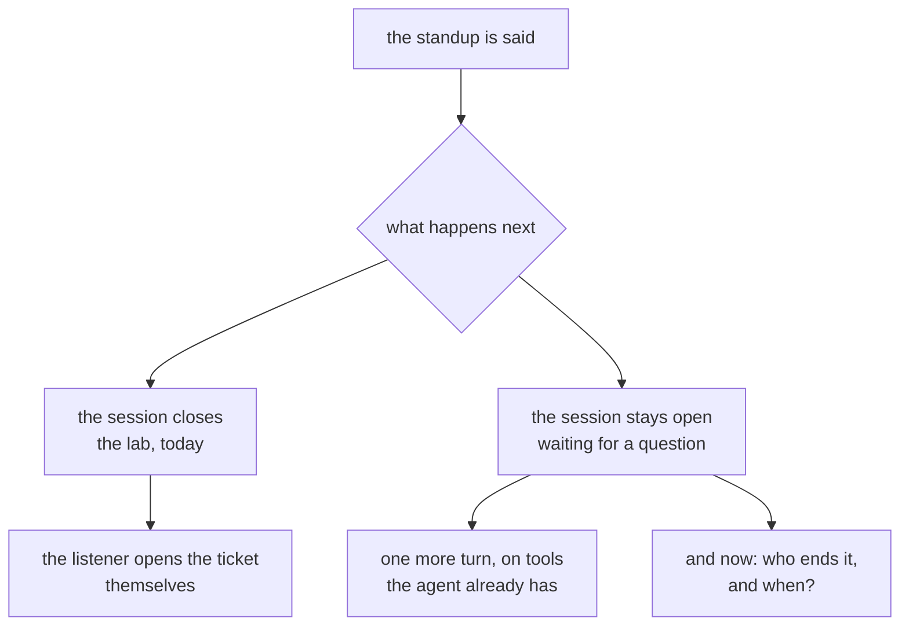

# 4.3 — What a real one adds

## One-line answer

The lab's standup is a correct one-way announcement, and the distance between that and a report a
team would actually rely on is not vague "polish" — it is a **specific, enumerable list of nine
things**, and almost all of it is about two subjects the lab does not contain a single line of:
**what changed since yesterday and how old the state is**, and **dialogue** — the fact that a
standup is the opening of a conversation rather than a broadcast.

## The story

A car park on a Saturday morning, thirty-odd people from the community centre going out for the day.
Some are still arriving. Two are on their phones. Somebody's children are running between the cars.
Three people are deep in a conversation about somebody's knee.

The woman with the folder has done this before, and you can tell, because she does not try to get
everybody quiet. She raises her voice once and says two things, and she says both of them twice.

*"We are leaving from this same car park at half past four. If you are not here, we go without you."*
And: *"We are not eating at the place we went to last year — it has closed. Lunch is at the pub on
the square, and it is booked in the centre's name."*

That is it. That is the whole announcement. Everything else she knows — where the toilets are on the
way, whether there is a cash machine, whether the walk is steep, whether the dog can come, who is in
whose car — she says to nobody, because she knows exactly what is about to happen. As people drift
off towards the cars, four or five of them will peel past her, one at a time, and ask her one thing
each. She will answer each of them in a sentence. She has planned for that. It is not a failure of
the announcement; it is the second half of it.

Notice which two facts she chose. Not the most important facts about the day — the most important
fact about the day is that it is a nice trip out, and she never mentions it. She chose the one thing
somebody would get badly wrong if they missed it, and the one thing that is **different from last
time**. Everyone already knows what a day out is. What they do not know is what has changed since
the version of this they have in their heads.

And notice what she is not doing. She is not reading out the folder.

## The idea in plain language

Part [1.3](../01-a-report-somebody-hears/1.3-what-the-listener-got.md) measured the lab's standup and
found it correct: three tools called over a live session, the queue read accurately, nothing false
said in either ordering. Parts [2.1](../02-the-order-is-the-product/2.1-one-function-one-order.md) to
2.3 fixed the order so that the part needing a decision arrives first. Part
[3.1](../03-the-quiet-morning/3.1-nothing-needs-you.md) made the quiet morning a report of its own,
and part [3.2](../03-the-quiet-morning/3.2-saying-what-you-do-not-know.md) made the missing half of
the night audible. That is a real thing, and it works.

It is also, still, an **announcement**: one voice, one direction, one morning, said into a room and
then over. The woman in the car park gives an announcement too, and the difference between hers and
the lab's is not that hers is better written. It is that hers is about **what changed**, and that she
is standing there afterwards to be asked things.

So here is the whole list. Not a mood, not "make it production-ready" — an enumerable set of items,
each of which can be pointed at, priced and argued about.

| What the lab has | What a real one adds | What it costs |
| --- | --- | --- |
| a snapshot of one morning | **what changed since yesterday** — what is new, what closed, what is newly blocked | keeping yesterday's state, and deciding what counts as a change |
| state read with no timestamp on it | **freshness**: how old each source is, said out loud when it is old (part [3.2](../03-the-quiet-morning/3.2-saying-what-you-do-not-know.md)) | a timestamp per source, and a rule for when it is worth mentioning |
| a fixed queue, read once and unchanging | a queue that is **being changed while the standup is being said** | a decision about whether the standup is a consistent snapshot or a live read |
| a one-way announcement | **follow-ups**: the listener says *"why is 4740 still waiting?"* and the agent can answer | the tools already exist (part [1.2](../01-a-report-somebody-hears/1.2-the-three-tools.md)); what is missing is the session staying open (Day 75 part 1.3) |
| sentences written by hand | wording **generated from the state**, with the ordering still decided in code | one request per morning, and a new way to be fluent and wrong |
| one listener, assumed and never named | the listener **named**, and the flag computed for them (part [4.2](4.2-who-it-is-for.md)) | an argument on `lines`, and a decision about who else gets it |
| a report that always runs | a rule for **when it is worth saying at all** (part [4.1](4.1-what-a-standup-costs.md)'s attention budget), against part [3.1](../03-the-quiet-morning/3.1-nothing-needs-you.md)'s argument for always saying something | a genuine tension, resolved on purpose rather than by default |
| nothing recorded about the delivery | **what was delivered before the listener stopped it** (part [1.3](../01-a-report-somebody-hears/1.3-what-the-listener-got.md)) | one field, and it is the only attention signal you will ever get |
| 🅿️ no voice at all | actual speech, over a live model | the parked half — Day 74 part 4.2's unresolved free-tier question |

Three words in that table are doing the heavy lifting, and they get plain definitions before anything
else happens.

**A snapshot** is a reading of some state taken at one moment and then held still. The lab's
`_state.QUEUE` is a snapshot: twelve tickets as they stood, frozen in a file, identical on every run.
A photograph of a queue, not a recording of one.

**Freshness** is how long ago a piece of state was actually read from the thing that owns it. A
number in your hand has two separate properties — whether it is *correct*, and whether it is
*current* — and they fail independently. A ticket count that was true when it was fetched and is now
several hours old is not wrong. It is stale, which is a different accusation and needs a different
sentence.

**A follow-up** is the listener's next sentence: a question about something the report just said,
asked while the report is still fresh in their head and while the connection is still open. It is not
a new session and it is not a new report. It is the same conversation, continuing.

Three rows of that table deserve more than a cell, because all three look like details and none of
them is.

## Why Sutra needs it

Because the hub's [build brief](../../LESSON.md) is six `TODO(me)` items and this list is nine, and
the difference between those numbers is deliberate. The brief asks for what this day measured plus
the decisions this day argued about: the `lines(queue, night)` shape, the carried flag, attention
first, the quiet morning, the missing night, and the named listener. That is a build somebody can
finish. A brief containing all nine would bury the teaching inside a large piece of work.

Because the gate is six checks and **not one of them is from the right-hand column.** It can read
off the source that a function exists, that it returns pairs, that the first pair is flagged. It
cannot ask whether anybody kept yesterday's queue, whether the session was left open for a question,
or whether somebody decided on purpose that this report goes out every morning regardless. Those are
judgements, and a gate verifies shapes.

And because this is the last part of the day, which means it is the last chance to say the thing the
day's central claim quietly leaves out. *The order is the product* is true and it is half a truth:
ordering decides **what lands**, and it says nothing about whether what lands was worth saying. A
perfectly ordered report of a queue that has not moved since yesterday is a well-delivered piece of
nothing. Order is about the listener's attention; **change** is about whether you had a claim on it
in the first place.

## The mechanism

One fragment of code, then the three rows argued properly.

Here is the aggregate the whole standup rests on. From `lab/_state.py`, at column 0 in the file, so
nothing has been dedented and nothing trimmed:

```python
def by_category() -> dict[str, int]:
    """How many open tickets in each bucket, in a fixed order."""
    counts: dict[str, int] = {}
    for ticket in QUEUE:
        counts[ticket.category] = counts.get(ticket.category, 0) + 1
    return counts
```

**Line by line:**

- `-> dict[str, int]` is the entire finding, and it is in the type signature rather than in the body.
  A category maps to **a number**. There is no room anywhere in that type for *was four yesterday*,
  for *two of these arrived overnight*, or for *this was read at some particular moment*. To report
  change rather than state, this return type has to change first, and every caller with it. That is
  why "add what changed since yesterday" is never a small edit.
- The docstring says *"in a fixed order"*, and the order meant is insertion order — the order the
  tickets happen to sit in, which part 2.2's ablation reads out sentence by sentence. Fixed is doing
  double duty here: fixed within a run, and fixed across runs, because the fixture never moves.
- `for ticket in QUEUE` reads the module-level tuple directly. The function takes **no argument**, so
  there is nowhere to pass *as of when*, and no seam where a caller could hand in yesterday's queue
  for comparison. Part [4.2](4.2-who-it-is-for.md) found the same absence on `needs_a_person` along a
  different axis: there the missing argument was the listener, here it is the moment.
- `counts.get(ticket.category, 0) + 1` is counting, which is the cheapest aggregate there is and the
  one that destroys the most. After this line runs, the identity of every ticket is gone. You cannot
  ask which four they were, so you cannot ask which of them are the same four as yesterday, so you
  cannot compute a change from this number and last night's copy of it — only a difference, which is
  not the same thing. *"Billing is still four"* is true on a morning when three closed and three
  opened.
- And the honest note about what is not here: no `datetime`, no `import time`, no date on any
  record. `Ticket.days_open` looks like time and is not — it is an integer typed into the fixture by
  hand, not derived from a clock, so nothing in this lab can tell you what day it is or when any of
  this was read.

### What changed since yesterday

This is the highest-value item on the list and the one most often skipped, and those two facts have
the same cause.

Go back to the car park. She did not say *"lunch is at the pub on the square"* as a fact about the
day. She said *"we are **not** eating where we went last year — it has closed"*, because half the
people standing there had last year in their heads and were going to drive to the wrong place. The
useful content of her sentence was the difference between what people already believed and what is
now true. Take the difference out and you get a fact that is correct and lands on nobody.

A report of state is easy. The lab does it: read the queue, count it, say it. Every input is
available at the moment you need it, the function is pure, and it can be tested from a fixture. A
report of **change** is a different kind of program, because change is not a property of this
morning. It is a property of this morning **and** some other morning, and the other morning is
already gone unless somebody kept it.

That is the whole cost, and it is worth being blunt about how it lands on a schedule: **you cannot
build "what changed" today.** You can only build it if the keeping started earlier. The first day you
write the store, the report says nothing, because there is nothing to compare against. The feature
does not exist until the second run.

The desk already has somewhere to put it. Day 73's nightly job writes a run log — the whole point of
that day was that a job which leaves no trace of itself cannot be told apart from a job that never
ran, and the log is the trace. A run log is exactly the shape this needs: an append-only record,
written once per run, by something that already runs once a night on the desk's own schedule. Adding
the morning's queue to what that job records is a smaller change than building a new store, and it
puts yesterday somewhere the standup can read it.

Then the second cost arrives, and it is the one people are surprised by: **deciding what counts as a
change.** This is not obvious and it is not free.

| Candidate rule | What it reports | Why it is not enough on its own |
| --- | --- | --- |
| the totals moved | "twelve yesterday, thirteen today" | a queue where three closed and three opened is reported as calm |
| a ticket appeared or disappeared | new and closed tickets, by reference | says nothing about a ticket that has been open all week and became blocked overnight |
| any field on any ticket differs | every edit, including a typo in a subject line | more noise than the report it is meant to shorten |
| a field somebody would act on differs | newly blocked, newly unblocked, newly overdue | somebody has to decide which fields those are, and defend the list |

The last row is the answer and it is a judgement, not an algorithm. Which is the pattern for this
entire part: the expensive half of almost every row is a decision somebody has to make and write
down, and the cheap half is the code.

**And a change report has a failure mode a state report does not have.** If the store is missing, or
corrupt, or yesterday's run died before writing, then the honest output is *"I cannot tell you what
changed, because I do not have yesterday"* — and the tempting output is to fall back to reporting
state and say nothing about the fallback. That is part
[3.2](../03-the-quiet-morning/3.2-saying-what-you-do-not-know.md)'s failure precisely, arriving one
layer up: a report that quietly drops the half it could not compute sounds exactly like a report
where that half was empty. A morning with no changes and a morning with no history read identically
unless somebody wrote the sentence that tells them apart.

### Follow-ups

The lab's standup ends and the session closes. Read `live.py` and that is the whole shape of it: the
model speaks, the listener says one thing, the connection closes, the script prints its numbers and
exits.

A real one stays open, and the reason is in the story. Everybody who wanted something from that
woman got it **after** the announcement, one at a time, walking past her on the way to the cars. Her
announcement was not the delivery mechanism for what people needed. It was the thing that told them
what to ask about.

The same is true of the lab's five sentences, and you can see it by reading them as a listener rather
than as their author. *"4740, waiting on a reply from us since the eleventh day."* Anybody hearing
that has a next sentence, and it is not *"thank you"*. It is **"waiting on a reply from whom?"** or
**"eleven days — has anyone chased it?"** or **"is that the one from the export migration?"**. A
report that provokes a question and then hangs up has done half its job and made the second half
somebody's manual work: they now go and open the ticket themselves, which is the thing the standup
was supposed to save them.

Now the part worth noticing, and it is the reason this row is on the list rather than in a wishlist.
**The tools that answer the follow-up are the tools that produced the report.** Part
[1.2](../01-a-report-somebody-hears/1.2-the-three-tools.md) attached three of them:
`queue_by_category`, `tickets_needing_a_person`, `last_night`. *"Why is 4740 waiting?"* is answered by
the second one. *"Did the job run?"* is answered by the third. Nothing new has to be built, nothing
new has to be authorised, and no new failure mode is introduced — the agent already has exactly the
reach it needs for the questions its own report generates.

So what is actually missing?



The missing thing is a **decision**, not a component. Every piece is already in the phase:

- Day 75 part 1.3 established that a live session is held open by somebody, and that the somebody has
  to be named — a session nobody closes is a connection leaking quietly, and a session closed the
  instant the model stops talking cannot be asked anything.
- Day 75 part 2.2 established what an interruption does to an answer in flight, which is the whole of
  part [1.3](../01-a-report-somebody-hears/1.3-what-the-listener-got.md)'s measurement.
- Day 76 established that a tool called during an open session does not have to freeze it, so the
  agent can go and look something up while the line is still live and the listener is still there.

Put those together and the follow-up is a turn on machinery that already exists and has already been
measured. What has to be decided is the cost side: an open line is billed by how long it is open
(part [4.1](4.1-what-a-standup-costs.md)'s third budget), so *how long do you wait for a question
that may not come?* Wait too briefly and you have built the announcement again. Wait too long and
every morning holds a line open for a silence.

That is a number somebody picks, defends and writes down. It is not a number the framework has an
opinion about, and it is the actual content of "add follow-ups".

### Generated wording, and the honesty risk

Every sentence in the lab was written by hand. `_night()` produces one, `_queue_shape()` produces
another, `attention_first()` assembles the rest. That is why the hub's §6 can record zero provider
requests and why part [4.1](4.1-what-a-standup-costs.md) had to price the standup in words rather
than tokens.

A real one hands the state to a model and asks for the sentences. What you buy is fluency: the report
stops sounding like a template, it can say *"the refund on 4688 has been sitting with you since last
week"* instead of the same clause every morning, and it can vary phrasing so that people do not stop
hearing it. That is a genuine gain and this part is not arguing against it.

What you sell is a guarantee. And the design worth arguing for is that **you do not have to sell all
of it**, because the report has two separable halves:

| | decided in code | generated |
| --- | --- | --- |
| which sentences exist | ✅ | |
| what order they are said in | ✅ | |
| whether a sentence is flagged for attention | ✅ | |
| the actual words | | ✅ |
| the tone, the joins, the phrasing | | ✅ |

Keep the left column and part [2.1](../02-the-order-is-the-product/2.1-one-function-one-order.md)
survives intact: `lines(queue, night, listener)` still returns pairs in the order they will be spoken,
a test can still assert that `lines(...)[0][1] is True`, and the ordering rule is still one function
in one place that somebody can read. The model is then given a list that is already in order and
asked to say it well — which is a task it is extremely good at and one where being wrong is visible,
because the facts it is phrasing are right there in the input.

**Now say plainly what happens if the ordering goes into the prompt as well.** *"Here are twelve
tickets and last night's job; give the morning standup, most important first."* It will work. It will
produce something good. And three things are gone.

**It is untestable**, which is part 2.1's argument arriving with a model attached. There is no
`lines()` to call, no list of pairs to assert against, no first element to check. The only way to find
out what the report says is to generate one and read it, which is exactly the "you can only find out
the order by holding the concert" failure that part 2.1 spent its whole length on. The test you can
still write — *does the output mention 4688 near the top* — is a string search over generated prose,
which is part [2.2](../02-the-order-is-the-product/2.2-carry-the-flag.md)'s bug re-created on purpose:
recovering structure from wording, when the structure was known upstream and thrown away.

**It can silently reorder.** Not on a code change — on a **model** change, a prompt tweak, a
temperature setting, or a morning when the queue happens to look slightly different. Nothing fails,
no test goes red, and no line in any diff corresponds to the report having quietly put the blocked
refund fourth. Part [1.3](../01-a-report-somebody-hears/1.3-what-the-listener-got.md) measured what
that costs: 0 of 2, on a correct, complete, accurate report.

**And nobody can answer "why".** Part [4.2](4.2-who-it-is-for.md) made this point about
personalisation and it is the same point here: *"why was 4740 second today and fourth yesterday"* has
no answer beyond *the model thought so*, and a report whose structure nobody can account for is a
report nobody can improve.

There is one further risk that belongs to generated wording specifically, and it is Principle 10 with
a microphone in front of it. A model handed a queue will phrase what it is given, and it will also
smooth over what it was not given. Hand it a state where the digest stage died and it may well write
*"last night ran through"*, because that is the shape of the sentence that usually goes there. The
lab's `_night()` cannot do that — it is an f-string, and an f-string cannot be tactful. The moment the
sentences are generated, the honesty of the report stops being a property of the code and becomes a
property of the prompt plus whatever came back, and it needs checking rather than assuming.

## When it breaks

**Look at the shape of the list rather than at its rows.** Every item is cheap while the standup is
being built and expensive once people rely on it. Keeping yesterday's queue is one write at the end
of a job that already runs now, and a feature you cannot ship for a week later. A timestamp per source
is a field now, and a rewrite of every reader later. Naming the listener is a line at the top of a
file now, and a negotiation with three teams later. Recording where the listener stopped is one
integer now, and a month of missing history later, because the one thing you cannot backfill is
attention nobody measured.

**And each item is individually skippable and only collectively necessary.** Take any row alone and
the case for skipping it is genuinely good: the queue does not move much overnight, the state is read
at the moment it is said, nobody asks questions anyway, we all know who it is for. Every one of those
is true on the first morning. What is false is the conclusion you get by making all nine arguments in
a row, which is a report that is correct, unchanging, unaddressed, unanswerable and unread.

**Two of these are parked, and parked is not forgotten.**

🅿️ **Actual speech, over a live model.** Addendum 02 pays for no model that holds an audio session
open, and Day 74 part 4.2 recorded that it could not even verify the free-tier status of one — a
question still open on this day. So everything on this day was measured over a scripted connection
with the runtime real and the model's side written in advance. The tools were genuinely called and
the interruption genuinely stopped the turn; what nobody has heard is the standup out loud, and a
sentence that reads well is not the same object as a sentence that sounds right at speaking pace.

🅿️ **The browser client.** The hub's §8 read `get_fast_api_app` off the installed runtime and found
it takes `agents_dir` and `web` — the server that would put this agent in front of a person with a
microphone. It needs a live model to be worth running, so this day builds the agent and parks the
front of it. The consequence for this list is that the last row's cost is not an estimate anybody
here has checked.

**And the honest thing about the list itself.** It is not a standard. No specification says a
scheduled spoken report shall have these nine properties. It comes from the failures this day
actually measured — 3 of 3 against 0 of 2 on identical facts, 0 words against 25 before the first
thing needing a person, a flag recovered from prose that reported the wrong number, a night whose
missing half sounded like a good night — plus ordinary field knowledge about what daily reports grow
once people are relying on them. So treat it as a checklist to **argue with** rather than one to
comply with. A row you can say does not apply to your desk, with a reason, is a better outcome than a
row you ticked. A row you cannot argue about either way is a row you have not understood yet.

## In production

**Three first, and the order is argued rather than asserted.**

1. **What changed since yesterday.** First, and not because it is the cheapest — it is not — but
   because it is the only one on the list with a **waiting period built into it**. Everything else on
   the list can be built on the day somebody decides to build it. This one cannot: it needs a
   yesterday, and a yesterday can only be obtained by having started. Start the keeping first,
   whatever else you do, because the first write buys nothing and every write after it is what the
   feature is made of. And put it where Day 73's nightly run log already goes, so the thing that
   writes it is a job that already exists and already has a schedule.
2. **Follow-ups.** Second, because it is the largest gain per unit of new machinery on the whole
   list. The tools are attached, the session mechanics were built on Days 75 and 76, and the tools
   that answer the questions are the ones that produced the report. What is missing is a decision
   about who holds the line open and for how long — which is an afternoon of arguing and a number in
   a config file, not a component. Second rather than first only because it can be done at any time,
   while the first cannot.
3. **Recording what was delivered.** Third, and it is the cheapest thing here by a distance: one
   field saying which sentence the listener was on when they spoke, which part
   [1.3](../01-a-report-somebody-hears/1.3-what-the-listener-got.md) already showed is free on a voice
   session because the interruption is an event you are already handling. It is third rather than
   first only because parts 1.3 and 4.1 have each already made its case. Put it in before either of
   the other two if it is not there yet, because it is the only evidence you will ever get about
   whether those two helped.

**And notice what the first two do together.** Each of them alone is an improvement. Taken together
they change what kind of object the standup is. *What changed* means the report has a claim on the
listener's attention — it is telling them something they do not already know, which is the woman's
*"it has closed"* and not her folder. *Follow-ups* mean the report is the start of something rather
than the end of it. A broadcast that says only what you already knew and cannot be replied to is a
notification. Add those two rows and it becomes a **briefing**, which is a thing people attend on
purpose.

**The measure nobody on this day has taken.** A standup is judged, in the end, on whether people are
still listening to it after a month. Not on whether it is correct — part 1.3 established that
correctness does not separate a good standup from a useless one — and not on any number this day
produced. Every measurement here is of a single delivery: sentences, words, position, 3 of 3 against
0 of 2. The thing that decides whether the feature was worth building is a slope across many
deliveries, and it is invisible in every one of them. Part 4.1 named the closest available proxy
(where in the report people stop, tracked over weeks) and part 4.2 named the other one (who quietly
turns it off). Both require the recording in item three, and both take a month to say anything, which
is why they are almost never started.

**The review comment a senior engineer leaves:** *"This is a good report and I can't tell whether
anything happened. Everything in it is a level — twelve open, four billing, three of five evals — and
levels are what people already have a feeling for. Start writing the morning queue into the nightly
job's run log this week, even though the report can't use it yet, because we can't build 'what
changed' until we've got a yesterday and every day we don't start is a day we can't get back. Second,
don't close the session the moment it stops talking. It says '4740, waiting on a reply since the
eleventh day' and the obvious human reply is 'from whom?' — and we already have the tool that answers
that, so what we're missing is a decision about who hangs up, not code. Pick how long we hold the
line, write down why, and remember the line is billed by the second. Third, if you're going to
generate the wording, generate the wording — keep `lines()` deciding what's said and in what order,
because the day the ordering moves into the prompt is the day I can't test it, can't explain why 4688
was fourth this morning, and won't be told when a model upgrade quietly reorders it. And log which
sentence they were on when they interrupted. It's one integer and it's the only number we'll ever
have about whether anyone is listening."*

**The interview question:** *"You've got a working standup agent. What's left?"* An honest spoken
answer: *"Almost everything, and it's specific rather than vague. What we had was a correct one-way
announcement — it called three tools over a live session, read the queue right, and said true things
in the order we chose, and I'd measured that the order was the whole product: same facts, same tools,
and attention-first delivered all three sentences that needed a decision before the listener spoke
while queue order delivered none of two. But the gaps are mostly about two things the thing didn't
have at all. The first is time. It reported a snapshot — twelve open, four billing — and a snapshot
is a level, and people already know the levels. What they don't know is what moved: what's new, what
closed, what became blocked overnight. That's the highest-value thing on the list and it's the one
people skip, because a report of state is a pure function and a report of change needs you to have
kept yesterday. You cannot build it today. You can only have started it. So I'd start writing the
queue into the nightly job's run log immediately, before anything else, and I'd expect to argue for a
while about what actually counts as a change — totals moving is the naive rule and it reports a queue
where three closed and three opened as calm. Alongside that, freshness: nothing in ours had a
timestamp, so the report couldn't say 'this is the queue as of some hours ago', and stale isn't the
same accusation as wrong. The second thing is dialogue. Ours said its piece and closed the session,
and the listener's actual next sentence is always a question about something we just said — 'waiting
on a reply from whom?' — and the tools that answer that are the exact three tools that built the
report. So there's no new capability needed; what's missing is a decision about who holds the session
open and for how long, and that's a real decision because an open line is billed by duration. After
those two: name the listener, because 'needs you' is a fact about a ticket and a person and ours
never said which person; decide whether it goes out every morning or only when there's something,
which is a genuine tension because a report that goes quiet is indistinguishable from one that died;
and record which sentence they were on when they interrupted, because that's one field and it's the
only attention signal that exists. The one I'd be careful about is generating the wording. I'd do it
— it reads better and stops being a template — but I'd keep the ordering in code, because the moment
'most important first' lives in a prompt I can't test it, I can't explain why a ticket moved down the
report, and a model change can reorder it with nothing going red. And the thing I'd say last is that
none of my numbers measure the only question that matters, which is whether anyone is still listening
to it in a month."*

## Check yourself

```bash
cd days/day-77-the-standup-agent/lab
grep -rn "timestamp\|yesterday\|changed" *.py; echo "grep exit: $?"
```

**Line by line:**

- `grep -rn` prints file and line number for every hit, so a hit is an address you can open rather
  than a count you have to trust.
- The three words are the three things this part says the lab has none of: when the state was read,
  what it was before, and what moved. Read whatever comes back — and if nothing does, that is the
  finding, not a mistyped command.
- `echo "grep exit: $?"` prints the exit code, which is `0` when there were hits and `1` when there
  were none. It is worth having precisely because a silent `grep` and a broken `grep` look identical
  on the terminal, and here the silence is the whole point.
- Then run it again for `days_open` and read what you find carefully. There *is* a notion of elapsed
  days in this lab, and it is an integer typed into the fixture by hand. It is a number that looks
  like time and is not derived from any clock, which is a different failure from having no time at
  all and a more dangerous one.

Then the measurement this part does not have and will not invent. `TODO(me)`: give the standup a
yesterday and see what the report becomes —

```bash
cd days/day-77-the-standup-agent/lab
uv run python standup.py; echo "exit: $?"
```

**Line by line:**

- Run it once unchanged first, so the baseline is in front of you: five sentences, 53 words, the
  first line flagged.
- Then copy `_state.QUEUE` into a second module as `YESTERDAY`, and change it — close one ticket, add
  two, and make one that was fine into one that needs a person. Change nothing else.
- Then write the three sentences your standup would say about the difference, by hand, before you
  write any code. Which of them is the first line? Is it the same first line as today's? If a ticket
  became blocked overnight and another has been blocked all week, say which one you put first and
  defend it.
- Finally, delete `YESTERDAY` and run the report again. Write down what it says now, and whether a
  listener could tell that from a morning on which nothing changed. That is part 3.2's failure in the
  new feature, and finding it in your own design is the exercise.

Two more exercises.

1. Cut the nine-row table to three. Not the three that are easiest — the three you would insist on
   before your own team relied on this every morning, with one sentence each saying what the
   *listener* loses without it. Then hold your three against this part's *In production* order and
   write down where you disagree and why. A different three with a reason is a better answer than the
   same three copied, and the sentence about what the listener loses is the part that does the work:
   a row you cannot finish that sentence for is a row you have not understood.
2. Take the two rows this part put in tension — *always say something* (part 3.1) and *only say it
   when it is worth hearing* (part 4.1) — and resolve them for one specific desk you know. Write the
   rule in one sentence: when does the full standup go out, and what, exactly, goes out on the other
   mornings? Then answer the question that decides it, which neither part can answer for you: how bad
   is a missed morning here? If your rule does not change when you change that answer, you have not
   resolved the tension, you have picked a side.

Finally, run the day's eval and read what it is asking for:

```bash
uv run python gate.py; echo "exit: $?"
```

Measured on 2026-09-06:

```text
Day 77 gate - the standup the build brief asks for

  ....  sutra/standup.py is not importable (No module named 'sutra.standup')

  FAIL  sutra.standup exists  - write it, per the hub's section 4
  FAIL  it exports lines(queue, night)  - one function that turns state into what will be said; see part 2.1
  FAIL  it returns (text, attention) pairs  - the flag is carried, not searched for in the text; see part 2.2
  FAIL  what needs a person is said first  - a listener who hears one sentence must hear that one; see part 2.3
  FAIL  it still says something when nothing needs a person  - silence and 'nothing needs you' are different reports; see part 3.1
  FAIL  tests/test_standup.py exists  - the order is the product, so it needs a test that can go red

findings: 6
  - sutra.standup exists - write it, per the hub's section 4
  - it exports lines(queue, night) - one function that turns state into what will be said; see part 2.1
  - it returns (text, attention) pairs - the flag is carried, not searched for in the text; see part 2.2
  - what needs a person is said first - a listener who hears one sentence must hear that one; see part 2.3
  - it still says something when nothing needs a person - silence and 'nothing needs you' are different reports; see part 3.1
  - tests/test_standup.py exists - the order is the product, so it needs a test that can go red
exit: 1
```

Six red, because `sutra/standup.py` is the build brief. Now hold those six against this part's
nine-row table. A function that exists, returns `(text, attention)` pairs, puts the flagged one first
and still speaks on a quiet morning — every one of them is a row the lab already demonstrates.
**Not one is from the "what a real one adds" column.** No check asks what changed since yesterday,
how old the state is, or whether the listener can ask a follow-up, because a gate can verify the
shape of a report and not whether anybody would still be listening to it in a month. That is why this
part is prose rather than a seventh check.

**Out loud, without scrolling up:** your standup is correct, well ordered, and says the same twelve
tickets it said yesterday. Name the two subjects it contains no line about, and say which one of them
you cannot start building today without having already started.

---

The day built an agent that calls three tools over a live session and says true things, and then
found that its correctness was never the question. What needed a decision had to come **first**,
because the listener stops the report whenever they like, and a report is only delivered as far as
somebody else lets it get. The paper adds the other constraint on the same sentence, from the other
end: the report must also arrive in few enough pieces to be **held**. Its demo carries the same twelve
tickets two ways and counts what the listener is asked to keep in their head — **4 units** against
**12**.

**Next:** [The magical number seven, plus or minus two — the paper](../../papers/01-chunking.md).
