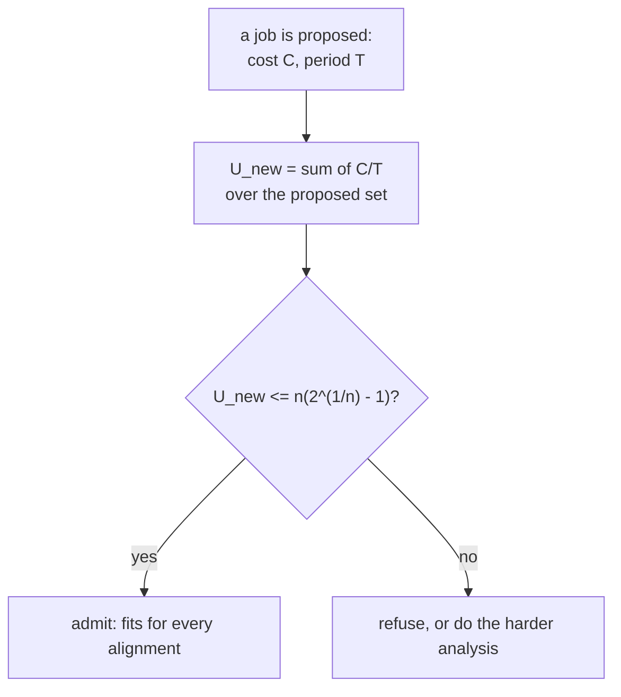

# Paper 01 — Does it fit? The 1973 utilisation test

> **Scheduling Algorithms for Multiprogramming in a Hard-Real-Time Environment**
> Journal of the ACM, Volume 20, Issue 1, January 1973, pages 46–61
> `doi:10.1145/321738.321743` · <https://doi.org/10.1145/321738.321743>
> *Record checked on 2026-09-06 via `api.crossref.org/works/10.1145/321738.321743`; the ACM Digital
> Library page returns HTTP 403 without a session, so the title, journal, volume, issue, pages and
> year above are copied from the Crossref record rather than from memory (§17.4.1 rule 5).*

## One-line answer

A set of jobs, each running every so often and costing a fixed amount, can be checked against a shared
resource **before any of them runs** by adding up one fraction per job — and the demo below shows that
check refusing one job to keep a schedule at 14 of 20 requests, where switching it off admits
everything and lands at 62 of 20.

## The story

Before this paper, the question *"will all of this fit?"* had no answer you could compute.

Picture the situation it was written for, without any of its vocabulary. A machine has several things
it must do over and over. One of them has to happen twenty times a second. Another has to happen once
a second. A third, four times a second. Each one takes a known, small amount of the machine's time, and
each one has a deadline — not "should be quick", but *it must be finished before the next one is due*,
because if it is not, something physical has already gone wrong.

Now somebody wants to add a fourth thing.

The way this was answered was by trying it. You added the fourth task, you ran the system, you watched
it for a while, and if nothing missed a deadline you shipped it. If something did, you moved things
around and tried again. That is a perfectly honest engineering method and it has one enormous hole:
**a schedule that has not missed a deadline yet is not a schedule that cannot**. Whether it misses
depends on the exact instant each task happens to start, and the bad alignment might not occur for
hours, or on the day the machine is under load, or once a month.

So the question people actually wanted answered — *can I add this fourth thing?* — was being answered
by observation of a system whose worst case had not necessarily happened yet. What was missing was a
sum you could do on paper, before building anything, that would tell you the answer for **every**
alignment rather than the ones you happened to see.

## The idea in plain language

The paper's setting is a set of **periodic tasks**. Each task has two numbers:

- **C**, its *cost* — how much of the resource one run consumes;
- **T**, its *period* — how often it runs.

The **utilisation** of one task is `C / T`: the fraction of the resource that task alone needs. The
utilisation of a whole set is the sum of those fractions. A set with total utilisation above 1 needs
more than exists and is hopeless; that much is obvious and needs no paper.

The paper's contribution is what happens **below** 1, because the obvious guess — *anything under 100%
fits* — is wrong. Whether a set of periodic tasks all meet their deadlines depends on how they line up
in time, and there are sets at 90% utilisation that miss deadlines. So the useful question is: how far
below 1 do you have to be for the answer to be *yes, always, whatever the alignment*?

The paper gives the number. For a set of **n** tasks, the safe bound is:

```text
U  <=  n * (2 ** (1/n) - 1)
```

For one task that is 1.00 — a single task can use the whole resource. For two it is 0.83. For three,
0.78. For ten, 0.72. As n grows it settles at about **0.693** — natural log of 2. Stay under it and the
set is schedulable no matter how the tasks line up. Go over it and you have not proved failure; you
have merely left the region where the simple sum can promise anything, and you now need a more careful
analysis or a test.

Two words for what that means, because they are the vocabulary this idea travels under:

- The bound is **sufficient**, not necessary: under it, definitely fine; over it, maybe fine.
- It is a **schedulability test**: a thing you compute about a schedule rather than something you
  observe about a running system.

There is a second, separate result in the same paper — that when tasks are ordered by how often they
run, with the most frequent going first, that ordering is the best fixed ordering there is. That is
where the phrase *rate-monotonic* comes from. It is not the half this day uses, and the **When it
breaks** section below says why.

## Why Sutra needs it

Because part [1.2](../parts/01-the-allowance/1.2-a-schedule-is-a-spending-plan.md) arrived at exactly
this shape from a completely different direction. Sutra's jobs are periodic tasks: the nightly costs 12
requests once a day, the desk costs 4 requests every second hour, and the resource they share is a
daily allowance rather than a processor. `cost ÷ period` is the same fraction; the sum is the same sum.

Part [1.3](../parts/01-the-allowance/1.3-counting-what-it-actually-spends.md) computes that sum for
Phase 11 and part [4.4](../parts/04-the-gate/4.4-criterion-3-the-phase-fits.md) turns it into the gate
criterion. What this paper adds, and what those parts do not have on their own, is the idea of an
**admission test**: a question asked of a *proposed* job before it joins the schedule, rather than a
report on the schedule you already have. That is the difference between a budget and a bill.

Day 82 will need it directly. Adding the full eval suite to the nightly is proposing a new periodic
task, and the useful question at that moment is not "what does the schedule cost now" but "does this one
fit".

## The mechanism

The whole test is two functions. From `lab/papers/schedulability/fit.py`:

```python
@dataclass(frozen=True)
class Task:
    """One periodic job: `cost` requests, once every `period` hours."""

    name: str
    cost: int
    period_hours: float

    def utilisation(self, allowance_per_day: int) -> float:
        """The share of a day's allowance this task alone commits."""
        runs_per_day = 24 / self.period_hours
        return (self.cost * runs_per_day) / allowance_per_day
```

**Line by line:**

- `cost` and `period_hours` are the paper's **C** and **T**, named in the units this problem actually
  has. Keeping the paper's letters would have been shorter and would have made every reader translate.
- `utilisation` takes `allowance_per_day` as an argument rather than reading a constant, because
  utilisation is a fraction *of something* and the something is the resource. The paper's C/T is a
  fraction of a processor whose capacity is 1 by definition; here the capacity is a number somebody
  measured, so it has to be passed in.
- `runs_per_day = 24 / self.period_hours` converts a period into a frequency. This is the one line
  where the analogy is doing work: the paper's resource is time and its capacity per unit time is
  fixed, while ours is a count per window. Dividing by the window length makes them the same shape.

```python
def bound(n: int) -> float:
    """The paper's least upper bound on utilisation for n tasks: n * (2**(1/n) - 1)."""
    return n * (2 ** (1 / n) - 1)


def admits(tasks: list[Task], candidate: Task, allowance_per_day: int) -> bool:
    """Would adding `candidate` keep the set inside the bound?"""
    proposed = [*tasks, candidate]
    return utilisation(proposed, allowance_per_day) <= bound(len(proposed))
```

**Line by line:**

- `bound(n)` is the paper's formula, transcribed. `2 ** (1 / n)` is the nth root of two; subtracting one
  and multiplying by n gives the value that falls from 1.00 at n=1 towards ln 2 ≈ 0.693.
- `bound` takes `n` and nothing else. The bound depends only on **how many** tasks there are, not on
  what they cost or how often they run — which is the surprising part of the result and the reason it
  is quotable at all.
- `admits` computes the bound for the **proposed** set size, `len(proposed)`, not the current one.
  Using the current size is the natural mistake and it is optimistic in the wrong direction: adding a
  task lowers the bound, so a test that checks the new utilisation against the old bound admits sets it
  should refuse.
- It returns a plain `bool` and takes the candidate separately from the set, which is what makes it an
  *admission* test rather than a report. `utilisation(...)` alone would tell you where you are;
  `admits(...)` answers a question about a job that does not exist yet.



## The paper in one demo

Two files, and the only thing they do is the utilisation test.

```text
lab/papers/schedulability/
├── fit.py     # Task, bound(n), utilisation(), admits()  - the paper, and nothing else
└── demo.py    # four jobs offered to a 20-request allowance, with and without the test
```

`fit.py` is quoted whole in **The mechanism** above — the dataclass, `bound`, `utilisation` and
`admits` are its entire contents. There is no I/O in it, no configuration, no model call and no
framework. If it were deleted, nothing in this demo would work; if anything else were deleted, the
claim would still land.

`demo.py`:

```python
ALLOWANCE_PER_DAY = 20  # requests, gemini-3.7-flash, read off a live 429 on 2026-08-25

# Four jobs somebody wants scheduled, in the order they were asked for.
WANTED = [
    Task("standup", cost=1, period_hours=24),
    Task("digest", cost=1, period_hours=24),
    Task("reindex", cost=12, period_hours=24),
    Task("triage", cost=4, period_hours=2),
]


def main(argv: list[str]) -> int:
    testing = "--off" not in argv
    print(f"allowance: {ALLOWANCE_PER_DAY} requests per day")
    print(f"admission test: {'utilisation bound' if testing else 'none (ablation)'}\n")

    admitted: list[Task] = []
    for task in WANTED:
        if testing and not admits(admitted, task, ALLOWANCE_PER_DAY):
            proposed = utilisation([*admitted, task], ALLOWANCE_PER_DAY)
            print(
                f"  {task.name:<9} refused  U would be {proposed:.2f}, "
                f"bound for {len(admitted) + 1} tasks is {bound(len(admitted) + 1):.2f}"
            )
            continue
        admitted.append(task)
        print(
            f"  {task.name:<9} admitted U now {utilisation(admitted, ALLOWANCE_PER_DAY):.2f}, "
            f"bound {bound(len(admitted)):.2f}"
        )

    spend = sum(t.cost * (24 / t.period_hours) for t in admitted)
    print(f"\n  admitted {len(admitted)} of {len(WANTED)} jobs")
    print(f"  requests committed per day: {spend:.0f} of {ALLOWANCE_PER_DAY}")
    if spend > ALLOWANCE_PER_DAY:
        over = spend - ALLOWANCE_PER_DAY
        print(f"  over the allowance by {over:.0f} requests, which arrive as 429 and are not work")
        return 1
    print("  inside the allowance")
    return 0
```

**Line by line:**

- `ALLOWANCE_PER_DAY = 20` is this repository's own measured number, with the date and the source in the
  comment. The demo is zero-budget in the strictest sense: it sends no request to anything, because the
  paper's claim is about a *plan* and testing a plan requires no execution.
- `WANTED` is in **the order somebody asked for the jobs**, which is how an admission test is actually
  used — jobs arrive over months and each one is tested against what is already running.
- `testing and not admits(...)` is the ablation. `--off` skips the test entirely and admits everything,
  which is what a scheduler with no admission test does by definition.
- The refusal branch prints the bound and the utilisation it would have reached, so a refusal is an
  explanation rather than a verdict. A test that says "no" without saying how far over is a test people
  disable.
- `spend` is recomputed at the end from the admitted set in plain requests per day, deliberately **not**
  from the utilisation figure. The utilisation is the paper's abstraction; the request count is the
  thing the provider will actually refuse, and the demo has to close the loop back to it or it has only
  demonstrated arithmetic.

Run it:

```bash
cd days/day-78-inside-free-quota/lab/papers/schedulability
uv run python demo.py; echo "exit: $?"
```

**Line by line:**

- `cd` into the demo's own directory: `demo.py` imports `fit` by plain name.
- No flag means the admission test is on.

Measured on 2026-09-06:

```text
allowance: 20 requests per day
admission test: utilisation bound

  standup   admitted U now 0.05, bound 1.00
  digest    admitted U now 0.10, bound 0.83
  reindex   admitted U now 0.70, bound 0.78
  triage    refused  U would be 3.10, bound for 4 tasks is 0.76

  admitted 3 of 4 jobs
  requests committed per day: 14 of 20
  inside the allowance
exit: 0
```

Now switch the paper's idea off:

```bash
uv run python demo.py --off; echo "exit: $?"
```

**Line by line:**

- `--off` is the ablation: same four jobs, same allowance, same costs, no admission test.

Measured on 2026-09-06:

```text
admission test: none (ablation)

  standup   admitted U now 0.05, bound 1.00
  digest    admitted U now 0.10, bound 0.83
  reindex   admitted U now 0.70, bound 0.78
  triage    admitted U now 3.10, bound 0.76

  admitted 4 of 4 jobs
  requests committed per day: 62 of 20
  over the allowance by 42 requests, which arrive as 429 and are not work
exit: 1
```

**The two runs differ in exactly one line of behaviour and the outcomes are 14 of 20 against 62 of 20.**
Watch the `reindex` row in the first run: `U now 0.70, bound 0.78`. It is admitted, and it is admitted
by a *margin of eight hundredths*. That is what a schedulability bound feels like in practice — not a
comfortable yes, but a yes with the next job's answer already visible in it, because adding a fourth
task drops the bound to 0.76 while raising the utilisation.

And notice that the ablation's failure is not subtle or delayed. It commits three times the available
allowance, on the fourth job, immediately. The value of the test is not that it catches a marginal
case; it is that without it **nobody computes the number at all**, so a threefold overcommitment is
indistinguishable from a fine one until the requests start being refused.

## When it breaks

The claim above does not hold as literally as the arithmetic suggests, and three of the gaps matter for
the way this day uses it.

**The paper is about a processor, and a request allowance is not one.** The 1973 model assumes a
resource that is *continuously* available and *preemptible*: a task can be interrupted mid-run and
resumed, and time keeps arriving at a constant rate. An API allowance is a pool that drains and refills
in one step at the end of a window, and a request cannot be half-sent. The utilisation sum transfers
because it is just arithmetic about averages. **The deadline guarantee does not.** Under this paper's
model, staying below the bound proves every task meets its deadline; under a quota, staying below the
bound proves only that the average demand fits — a burst inside the window can still exhaust the
allowance early, which is exactly part
[1.1](../parts/01-the-allowance/1.1-an-allowance-not-a-speed-limit.md)'s rate-versus-allowance
distinction reappearing.

**The bound is sufficient, not necessary, and the demo's refusal is not proof of anything.** `triage`
would have to be refused on any reading — it alone wants 48 requests against 20 — so the demo does not
happen to show the interesting case. A set at, say, U = 0.80 with three tasks is *over* the 0.78 bound
and may well be perfectly schedulable. Treating the bound as a hard boundary refuses work that would
have been fine, and a scheduler that does that will be quietly worked around by whoever needs the job
to run.

**The rate-monotonic half is not used here, and should not be.** The paper's other result — order tasks
by frequency, most frequent first, and that is the optimal fixed priority order — is about meeting
deadlines. Sutra's priority order in part
[2.4](../parts/02-asking-before-spending/2.4-the-job-that-ran-anyway.md) is `reindex, digest, triage`,
which is close to the *opposite* of rate-monotonic: `triage` is by far the most frequent task and it is
last. That is not an error. It is a different objective. Rate-monotonic optimises for nobody missing a
deadline; Sutra's order optimises for the thing a person will notice the absence of, which the 1973
model has no concept of at all.

There is also a plain assumption the paper states and reality does not honour: tasks are independent
and do not block each other. Sutra's stages are strictly ordered — the digest cannot run before the
evals — which is a dependency the model does not carry.

## In production

**What survived.** The utilisation sum survived completely, and it is now so ordinary that most people
who use it do not know it has a source. Every capacity planner that adds `rate × cost` across a set of
jobs and compares it to a limit is doing this. The idea that schedulability is something you **compute
before running** rather than observe afterwards is the paper's real legacy, and it is the half this day
uses.

The vocabulary survived too. Cost, period, utilisation, admission test, sufficient bound — that is the
standard language of capacity work in operating systems, real-time control, network scheduling and API
quota management alike, and it came from here.

**What did not.** The specific bound `n(2^(1/n) − 1)` is rarely used as a decision rule any more, for
the reason the previous section gives: it is conservative, and refusing work that would have been fine
is expensive. Later analysis — exact response-time tests, which check each task against the actual
interference it can suffer — gives a precise yes-or-no where this gives a safe maybe-no, and where
precision matters people use those instead. The bound survives as an **intuition** and a first-pass
filter: if you are under 69%, stop worrying; if you are over, do the harder analysis.

The rate-monotonic priority result has had the more interesting fate. It is still correct and still
taught, and in most systems outside hard real-time it has been displaced by priorities that encode
*business* importance rather than frequency — exactly the substitution part
[2.4](../parts/02-asking-before-spending/2.4-the-job-that-ran-anyway.md) makes. The paper proved which
ordering is optimal for a goal (nobody misses a deadline) that most systems do not have.

**And the assumption that quietly broke.** The 1973 model has one resource with one owner. Part
[5.1](../parts/05-in-production/5.1-the-nightly-competes-with-the-day.md) is about a resource shared
with parties your scheduler cannot see, and no amount of utilisation arithmetic touches that: you can
be at 0.30 of your own plan and be refused, because the sum you computed was over the wrong set of
tasks.

## Check yourself

```bash
cd days/day-78-inside-free-quota/lab/papers/schedulability
uv run python demo.py; echo "exit: $?"
uv run python demo.py --off; echo "exit: $?"
```

In the first run, `reindex` is admitted at U 0.70 against a bound of 0.78. Work out on paper what
`bound(5)` is, and say whether a fifth one-request-a-day job would still be admitted. Then add it to
`WANTED` and check.

Now find the sentence in **When it breaks** that says why staying under the bound does **not** promise
you what it promised in 1973. Say which of Sutra's two limits — the rate or the allowance — that gap
belongs to.

**Out loud:** what did this paper actually claim, and what do we do differently now? The answer has two
halves: which of its two results this day uses, and which one it deliberately inverts.

**Back to:** [the hub](../LESSON.md).
