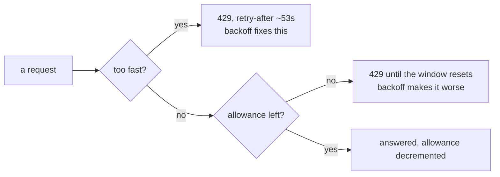

# 1.1 — An allowance, not a speed limit

## One-line answer

A provider hands you two completely different limits — **how fast you may ask** and **how much you
may ask for in a day** — and a scheduler that plans against the first one will always look
comfortable while running out of the second.

## The story

You buy a mobile pack. The shop tells you two things about it, and you remember one.

The one you remember is the speed: *"You'll get proper speed on this one, video plays fine."* The
other one is printed smaller, and it is the amount: **so many gigabytes for the month**.

For the first fortnight the phone is lovely. Nothing is ever slow. Video starts instantly. You have
no complaints at all, so you have no reason to look at anything.

On the eighteenth or nineteenth the phone stops. Not slowly — it stops. Pages will not open, the
messages sit with one tick, and the video that started instantly yesterday now shows a grey circle
that never fills. Nothing about the phone got slower first. There was no warning stage. It worked
exactly as well as it always had, right up to the moment there was nothing left.

And here is the part worth sitting with: everything you did all month was well within the speed you
were sold. Not once did you go too fast. You were never once told off for going too fast. You just
did a normal amount of a normal thing, every day, and the total ran out.

## The idea in plain language

Two words, and they are not two ways of saying the same thing.

- A **rate limit** says *how fast*. It is usually written as **RPM** — requests per minute. Go over
  it and the provider refuses the extra requests **for a moment**; wait a little and you are fine
  again. It protects the provider's machines from a burst.
- An **allowance** says *how much*. It is usually written as **RPD** — requests per day. Spend it
  and the provider refuses everything **until the window resets**. Waiting a moment does nothing.
  Waiting until tomorrow is the only thing that works. It protects the provider's bill.

A **window** is the stretch of time an allowance is counted over. For a daily allowance the window
is a day, and one of this part's less obvious points is that *whose* day it is turns out to matter —
that is part [2.3](../02-asking-before-spending/2.3-whose-midnight-resets-it.md)'s subject.

Sutra has already met the rate limit properly. [Day 24](../../../day-24-token-accounting-and-budgets/LESSON.md)
built the token accounting, [Day 72](../../../day-72-backoff-with-honesty/LESSON.md) built the
backoff that answers a refusal by waiting and trying again, and both of them are about *speed*: too
many requests arrived too close together, so the answer is to spread them out.

**Backoff cannot answer an allowance.** That is the whole reason this part exists. If you have spent
the day's requests, waiting one second, then two, then four, then eight does not create more of
them. Every one of those retries is refused too. A backoff ladder against an exhausted daily
allowance is a machine for turning one failure into six failures and a longer wait, and then
reporting the last one.

The two limits also *feel* completely different when you hit them, which is why teams confuse them
for so long:

| | Rate limit (RPM) | Allowance (RPD) |
| --- | --- | --- |
| What it measures | requests per minute | requests per day |
| What fixes it | waiting a moment | waiting for the window to reset |
| Does backoff help? | yes, that is exactly what it is for | no, every retry is refused too |
| What it feels like | the system is slow today | the system is dead today |
| Who notices first | whoever sent the burst | whoever asked last |

That last row is the one that hurts. A rate limit punishes the greedy request. An allowance punishes
**whatever happens to come last**, which on a schedule is usually the small, cheap, important job at
the end of the night — see part
[2.4](../02-asking-before-spending/2.4-the-job-that-ran-anyway.md).

## Why Sutra needs it

Because Phase 11 put two things on a clock, and a clock cannot be argued with. The nightly job from
[Day 73](../../../day-73-ambient-agents/LESSON.md) wakes whether or not the day has anything left,
and the standup from [Day 77](../../../day-77-the-standup-agent/LESSON.md) is spoken to a person who
will notice its absence. Nothing else in this repository spends without a human present.

Every measurement in this day rests on telling these two limits apart, and the phase gate's own
sentence — *"nightly job + voice standup within free quota"* — is a claim about the **allowance**.
Part [1.3](1.3-counting-what-it-actually-spends.md) prices the phase and part
[4.4](../04-the-gate/4.4-criterion-3-the-phase-fits.md) turns that price into the criterion that
decides whether Phase 11 is green.

You will also need it again immediately. Day 79 opens Phase 12, and an eval suite is the largest
single consumer of requests this curriculum will ever schedule: one request per case, sixty cases,
run more than once. Addendum 02 §5's row for days 79–83 is written entirely in this vocabulary.

## The mechanism

Take the five jobs Phase 11 leaves running and price them **both ways**, using the same numbers, and
see which pricing answers the question.

The fixture is `lab/_phase.py`. Nothing in it is generated and nothing is random: every cost is a
count of what the days 73 to 77 labs actually do.

```python
@dataclass(frozen=True)
class Job:
    """One thing a scheduler runs on its own, and what one run of it costs."""

    name: str
    provider: str
    model: str
    runs_per_day: int
    requests_per_run: int
    basis: str

    @property
    def requests_per_day(self) -> int:
        return self.runs_per_day * self.requests_per_run
```

**Line by line:**

- `@dataclass(frozen=True)` — a job is a fact about the schedule, not an object with a life of its
  own. Frozen means nothing can quietly rewrite `requests_per_run` half-way through a planning run,
  which matters because everything downstream is a sum over these.
- `runs_per_day` and `requests_per_run` are **kept apart on purpose**. It would be shorter to store
  one `requests_per_day` number, and that shortcut costs you part
  [2.4](../02-asking-before-spending/2.4-the-job-that-ran-anyway.md) entirely: a scheduler admits
  *runs*, one at a time, as a clock fires them. A job with 12 runs of 4 requests is a completely
  different thing to admit from one run of 48, and a single total cannot tell them apart.
- `provider` and `model` are both here because an allowance belongs to a **pair**, not to a company.
  Two models from the same provider have two separate buckets, which is the whole reason Addendum 02
  can suggest moving eval traffic to Flash-Lite at all.
- `basis` is a sentence saying where the number came from. It is not decoration: a cost with no
  stated basis is a guess, and six months later nobody can tell which of these numbers were measured
  and which were typed. Principle 7 applied to arithmetic rather than to version pins.
- `requests_per_day` is a `@property` rather than a stored field so it can never disagree with the
  two numbers it comes from.

Now run the pricing:

```bash
cd days/day-78-inside-free-quota/lab
uv run python spend.py
```

**Line by line:**

- `cd` first: every script in this lab imports `_phase` by plain name, so the lab directory has to be
  the working directory. This is the same convention days 73 to 77 use.
- No flag means "price it as an allowance", which is the pricing the rest of the day uses.

Measured on 2026-09-06:

```text
Phase 11, priced per day

  job       lane                         runs  req/run  req/day
  reindex   gemini/gemini-3.7-flash         1       12       12
  evals     gemini/gemini-2.5-flash-lite    1       60       60
  digest    gemini/gemini-3.7-flash         1        1        1
  standup   gemini/gemini-3.7-flash         1        1        1
  triage    gemini/gemini-3.7-flash        12        4       48

  lane                         demand/day  allowance/day  verdict
  gemini/gemini-3.7-flash              62             20  over
  gemini/gemini-2.5-flash-lite         60        unknown  cannot say

  where the allowances came from:
  gemini/gemini-3.7-flash       read off a live 429, 2026-08-25 (docs/PACKAGES.md)
  gemini/gemini-2.5-flash-lite  not published without an AI Studio session; not measured

  exit 2
```

Now price exactly the same jobs as a rate:

```bash
uv run python spend.py --rpm
```

**Line by line:**

- `--rpm` divides each job's daily cost by the number of minutes in a day, which is what "requests per
  minute" means when the requests are spread evenly. It changes no input at all — same jobs, same
  costs, same fixture.

Measured on 2026-09-06:

```text
  priced as a rate instead:
  reindex      0.008 requests per minute, averaged over the day
  evals        0.042 requests per minute, averaged over the day
  digest       0.001 requests per minute, averaged over the day
  standup      0.001 requests per minute, averaged over the day
  triage       0.033 requests per minute, averaged over the day

  Every job is under 1 RPM. Not one of these numbers answers the question.
```

**Read those two blocks against each other, because they are the whole part.** The same five jobs are
**catastrophically over** one limit and **nowhere near** the other. Priced as a rate, the busiest job
in the entire phase asks for one request every twenty-four minutes and the scheduler looks
positively idle. Priced as an allowance, one lane wants 62 requests against the 20 this repository
has actually observed, and the other cannot be decided at all.

A team that watches RPM dashboards will see nothing wrong on any day of the week, right up to the
morning the standup does not happen.



## When it breaks

The two limits do not announce which one you hit. On 2026-08-25 this repository recorded the
following against `gemini-3.7-flash`, and the row is in `docs/PACKAGES.md`:

```text
free tier; 20 requests per day on
generativelanguage.googleapis.com/generate_content_free_tier_requests
```

The refusal that produced it carried a `Please retry in ~53s` hint. **That hint is a lie about which
limit you hit** — not a deliberate one, but a lie all the same. It is the shape of a rate-limit
message, and a reasonable client reads it, waits 53 seconds and tries again. Day 2's part 1.5
recorded what happens when you believe it: **28 requests across a quarter of an hour, each obeying the stated
wait, all refused.** The quota name in the error body is the only part of that message that tells you
the truth, and it says `_free_tier_requests` **per day**.

The smallest fix is not a code change. It is reading the **quota name** out of the error before
deciding what to do about it, and treating `..._per_day` as a signal to stop rather than to sleep.
Day 72 built the backoff ladder; this is the branch that must sit above it.

## In production

**What a professional writes instead.** Not one number called "the rate limit", but a small table
keyed on `(provider, model)` with **two** numbers in each row and a date beside each. The date is
the part people leave out and the part that ages. A limits table with no dates is indistinguishable
from a limits table full of last year's values, and the difference only shows up on the night the
schedule doubles.

**What degrades at scale.** Allowances are almost never per key. Addendum 02 records that Gemini's
are **per project**, which means every service, every developer's laptop, every stray notebook and
every CI run share one bucket. The failure this produces is genuinely nasty: your scheduled job
starts failing because of somebody else's experiment, on a different machine, in a different
repository, and there is nothing in your logs about it. The rate limit does not behave like this —
it recovers by itself in seconds — so teams that have only ever met rate limits have no habit of
asking "who else is spending this?"

**The failure that only shows with real traffic.** An allowance is spent by the *sum* of everything,
and most systems grow their sum in small, individually reasonable steps: a retry added here, a second
model call for a summary there, an extra eval case. Each change is reviewed and each is fine. What
nobody reviews is the total, because the total is not in any pull request. It shows up as a job that
has run every night for eight months and stops on a Tuesday.

**The review comment a senior engineer leaves:** *"You've got one constant called `RATE_LIMIT` and
the retry uses it for both cases. Split it. Requests-per-minute is a wait; requests-per-day is a
decision about whether to run at all, and they belong at different layers — the first inside the
client, the second above the scheduler. Also please put the date you observed each number next to it
in the table. In six months nobody will know whether 20 was measured or hopeful."*

**The interview question:** *"Your nightly job has run fine for months and now fails every night at
the same stage. The client retries three times with backoff and reports a 429. Where do you look?"*
The answer that shows experience is: at the **quota name** in the error body, not at the retry logic.
If it is a per-day quota, the retries were never going to help, and the real question is what else
started spending from the same bucket.

## Check yourself

```bash
cd days/day-78-inside-free-quota/lab
uv run python spend.py --rpm
uv run python spend.py
```

Before you run the second one, look at the first one's output and write down whether you would sign
off on this schedule. Then run the second and see what you signed off on.

Now open `_phase.py` and change `triage` from `runs_per_day=12, requests_per_run=4` to
`runs_per_day=1, requests_per_run=48`. Re-run both commands and say which of the four numbers moved.
The answer tells you which pricing is capable of noticing the difference between a job that runs once
and a job that runs twelve times, and that difference is the whole of part
[2.4](../02-asking-before-spending/2.4-the-job-that-ran-anyway.md).

**Out loud, without scrolling up:** your job is refused with a 429. What is the one thing you read
before deciding whether to retry, and why does the wait-and-retry answer make one of the two cases
strictly worse?

**Next:** [1.2 — A schedule is a spending plan](1.2-a-schedule-is-a-spending-plan.md).
