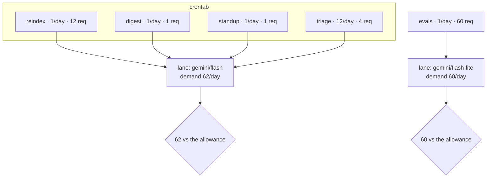

# 1.2 — A schedule is a spending plan

## One-line answer

The moment you put a job on a clock you have committed an amount of the day's allowance to it, every
day, without being asked again — so a crontab is not a list of times, it is a **standing order**, and
the only honest way to read one is to add it up.

## The story

Sunday evening, and somebody in the house writes the week's grocery list.

It is not a dramatic document. Milk every day. Bread twice. Vegetables on Tuesday and Friday because
that is when the cart comes. Rice this week because the tin is low. Nobody sits down and *decides* to
spend anything; they just write down what has to happen, item by item, each one obviously necessary
on its own.

On Thursday the money runs out.

Nothing on that list was extravagant. Nobody bought anything silly. Every line was defensible on its
own line, and if you had asked about any single item — the milk, say — the answer would have been
*of course, we need milk.* What nobody did was add the list up before starting, because a list of
things to do does not look like a bill. It looks like a plan.

The uncomfortable part is what happens on Thursday. It is not the milk that gets dropped, and not the
rice. It is whatever was left at the bottom of the list — which, on most people's lists, is the small
thing that mattered for a reason nothing else on the list knows about.

## The idea in plain language

A **schedule** is a set of jobs, each with two properties: how often it runs, and what one run costs.

Write that as a pair and a whole vocabulary opens up. For each job:

- its **period** is the gap between runs — once a day, once an hour, four times an hour;
- its **cost** is what a single run spends — one request, twelve, sixty.

The job's **daily demand** is then simply `cost × runs per day`. The **schedule's** demand is the sum
of its jobs' demands, per lane — and a *lane*, from part
[1.1](1.1-an-allowance-not-a-speed-limit.md), is one `(provider, model)` pair, because that is the
granularity an allowance is counted at.

Now the important step, and it is a step of attitude rather than of arithmetic. **Adding a line to a
crontab is a spending decision.** Not "a decision that might lead to spending later" — a decision, made
once, that spends every day from then on until somebody removes the line. Nobody is asked again. There
is no second approval. A human being will never again be present at the moment the money goes.

That is what makes an ambient system different from an interactive one, and
[Day 73 part 1.1](../../../day-73-ambient-agents/parts/01-the-agent-nobody-watches/1.1-nobody-is-watching.md)
named three things it removes: the person who could be asked, the person who would notice, and the
person who would decide. This part is about the third one, priced. When Sutra's desk answers a ticket,
somebody wanted that answer badly enough to file the ticket. When the nightly re-index runs, nobody
wanted anything at 00:30; a line in a file wanted it, once, months ago.

Two consequences follow, and both are counter-intuitive the first time:

1. **A schedule can be over budget with every individual job well inside it.** This is the grocery
   list. There is no job you can point at and call the problem, which is exactly why nobody points.
2. **The order of the crontab is a priority order, whether or not anybody meant it to be.** If the
   allowance runs out part-way through the day, what survives is what ran first, and what ran first is
   whatever happened to be scheduled earliest. That is an accident being used as a policy — part
   [2.4](../02-asking-before-spending/2.4-the-job-that-ran-anyway.md) measures what it costs.

## Why Sutra needs it

Because Phase 11 added exactly two standing orders, and it added them one at a time. Day 73 put the
nightly on a clock. Day 77 put a standup on a morning. Neither day priced the *other* one, and neither
day priced the daytime desk that was already running, because on the day you add a job the only thing
in front of you is that job.

The gate's sentence — *"nightly job + voice standup within free quota"* — is a claim about the sum of
all three, and the sum is not written down anywhere in days 73 to 77. Part
[1.3](1.3-counting-what-it-actually-spends.md) writes it down, and criterion 3 in part
[4.4](../04-the-gate/4.4-criterion-3-the-phase-fits.md) makes it a command with an exit code.

It matters again immediately after this day. Addendum 02's row for days 79–83 says to *"schedule full
runs as the Day 73 ambient nightly job so daily quota resets work for you"* — that sentence is a
spending plan, and Day 82 will have to add its line to the same crontab.

## The mechanism

The whole of a spending plan is two functions, and neither is clever. From `lab/_phase.py`:

```python
def lanes() -> list[tuple[str, str]]:
    """Every (provider, model) pair the jobs actually spend against, in first-seen order."""
    seen: list[tuple[str, str]] = []
    for job in JOBS:
        key = (job.provider, job.model)
        if key not in seen:
            seen.append(key)
    return seen


def demand(lane: tuple[str, str]) -> int:
    """Requests per day the schedule commits to one lane."""
    return sum(j.requests_per_day for j in JOBS if (j.provider, j.model) == lane)
```

**Line by line:**

- `lanes()` builds the list of lanes **from the jobs**, not from a hand-written list of providers.
  That direction matters: a lane nobody spends against does not need an allowance, and — far more
  importantly — a job whose lane you forgot to add cannot silently vanish from the plan. If somebody
  adds a job on a new model, a new lane appears on its own and gets checked.
- It returns a `list` in **first-seen order** rather than a `set`, so two runs of the same fixture
  print the same table in the same order. A planning tool whose output reorders itself between runs is
  a tool nobody diffs.
- `demand(lane)` is a one-line sum, and the plainness is the point. There is no scheduling theory in
  it, no weighting, no smoothing. The reason a schedule surprises people is never that this sum is
  hard; it is that nobody computes it at all.
- The filter is on `(j.provider, j.model)` and not on `j.provider`. Spending on Flash and spending on
  Flash-Lite come out of different buckets, so adding them together would report a fictional number
  that is wrong in both directions at once.

The shape of the whole thing:



Every arrow into a lane is a line somebody added to a crontab on a day when it was the only thing
they were thinking about. The two diamonds at the bottom are questions nobody asked until this day.

## When it breaks

The failure mode of a spending plan is not an error. It is a plan that is quietly **not the schedule**.

The plan lives in `_phase.py`. The schedule lives in a crontab, a systemd timer or a CI file. Nothing
connects them, so they drift, and the drift is silent in the most dangerous direction: somebody adds a
job to the crontab and forgets the plan, so the plan under-reports and looks healthy.

You can see it happen in one command. Add a sixth job to `JOBS` and re-run `spend.py` — the numbers
move. Add a sixth line to a crontab and re-run `spend.py` — nothing moves at all, and the exit code
stays exactly the same:

```text
  lane                         demand/day  allowance/day  verdict
  gemini/gemini-3.7-flash              62             20  over
```

That output is what a plan that has fallen behind its schedule looks like. It is not wrong about
anything it knows. It simply does not know about the sixth job, and there is no line anywhere saying
so. This is
[Day 73 part 3.3](../../../day-73-ambient-agents/parts/03-the-morning-after/3.3-nobody-notices-silence.md)'s
subject arriving from a new direction: the absence of a line is not visible.

The smallest fix is to make one of them generate the other. A `_phase.py` that **emits** the crontab
lines, or a checker that reads the crontab and compares job names against `JOBS`, turns a silent drift
into a failing command. Part [5.2](../05-in-production/5.2-what-a-real-scheduler-adds.md) lists this
as the first of the nine things a real one adds, and it is first because it is the one that makes
every other number on this page trustworthy.

## In production

**What a professional writes instead of a crontab full of times.** A single declared list of jobs —
name, schedule, cost estimate, lane, owner — from which the actual schedule is generated. The tools
differ wildly (Airflow, a Kubernetes `CronJob` set, a homemade YAML file) and the property that
matters is the same in all of them: **there is one place where the whole schedule can be added up**,
and adding a job means editing that place.

**What degrades at scale.** The cost figure ages faster than anything else in the row, and it ages
*upwards*. A job priced at "one request per changed ticket" was written when twelve tickets changed a
night. Nothing about that line is wrong two years later when four hundred change a night, and nothing
about it is right either. The dangerous version of this is a job whose cost is proportional to
something that grows on its own — a corpus, a backlog, an eval suite — because that job's demand grows
with no commit at all.

**The failure that only shows with real traffic.** Two teams' schedules share a lane. Yours is priced
and reviewed; theirs is a notebook somebody promoted to a cron entry. Your plan is correct and your
job still fails, because a spending plan is only as good as the **completeness** of the list it sums
over, and nothing in your repository can see theirs. The fix is organisational before it is technical:
one allowance, one owner, one list.

**The review comment a senior engineer leaves:** *"Nice — but this reads the cost from a constant.
Read it from last night's run log instead and print both, so the day the actual spend drifts away from
the planned spend, the plan tells us rather than the provider. And put an owner on each row. When this
goes over budget at 3am, the useful question is not which job is biggest, it is who can decide to turn
one off."*

**The interview question:** *"How would you tell, before deploying, whether a new scheduled job fits
inside your API quota?"* An answer that shows experience computes `cost × frequency` per quota bucket,
sums it with everything already scheduled, and compares it against a **measured** allowance — and then
adds the part most people miss: it says what happens when the sum is over, because "we'd notice" is
not a plan and "we'd get alerts" is not either, if the alert fires at 3am on a job nobody is watching.

## Check yourself

```bash
cd days/day-78-inside-free-quota/lab
uv run python spend.py
```

Look at the `req/day` column and pick the job you would remove first if you had to remove one. Write
your reason down in one sentence **before** reading part
[2.4](../02-asking-before-spending/2.4-the-job-that-ran-anyway.md), because that part is an argument
that the obvious answer here — remove the biggest — is the wrong rule.

Then open your own machine's scheduler (`crontab -l`, or Task Scheduler on Windows) and count the
entries. For each one, say out loud what a single run costs. If you cannot answer for one of them,
you have found the same gap this part is about, in a system you own.

**Out loud, without scrolling up:** why can a schedule be over its allowance when no single job on it
is anywhere near the allowance, and what is the one number that would have shown it?

**Next:** [1.3 — Counting what it actually spends](1.3-counting-what-it-actually-spends.md).
