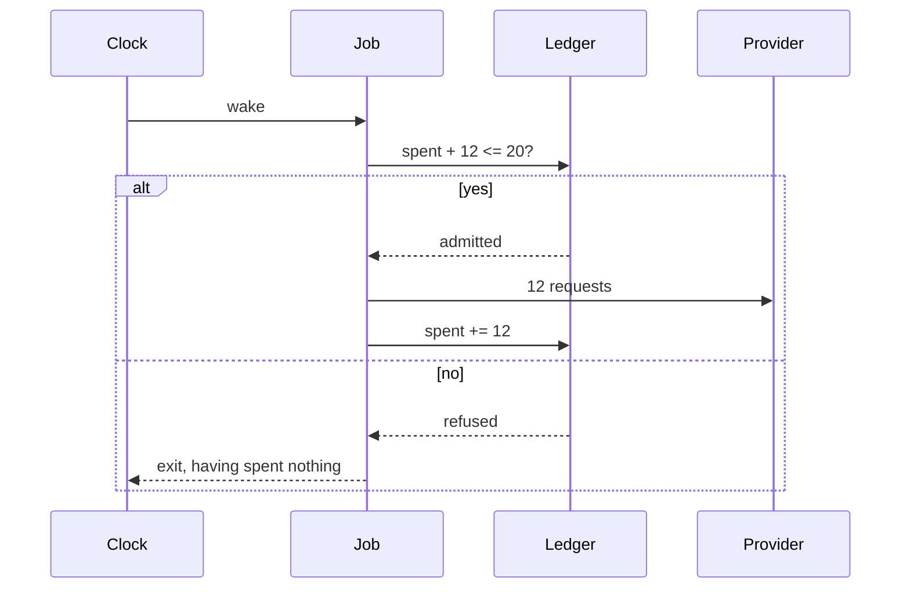

# 2.1 — Ask before you spend

## One-line answer

A quota-aware job asks one question before it starts — *is there enough left for all of me?* — and the
whole value of the question is that it is asked **once, before the first request**, not discovered
request by request half-way through.

## The story

You go to the chemist with a prescription for a course of tablets. Ten days' worth.

There are two ways this goes.

In the first, the man behind the counter reads the prescription, turns round, checks the shelf, and
says: *"I have four days' worth. Do you want the four, or shall I order the rest for tomorrow?"* You
decide. You might take the four and come back. You might go to the bigger shop on the main road. You
might take the four and start tomorrow so the course is not interrupted. It is your decision and you
are making it with the facts.

In the second, he starts putting strips in a bag. One, two, three, four. Then he stops, looks in the
drawer, looks behind him, and says: *"Only four."* You are now standing at a counter holding four
days of a ten-day course with your money already out. Nothing was lost, exactly — you can still go to
the other shop — but the decision you are making now is worse than the one you would have made two
minutes ago, because part of it has already happened.

The difference is not stock. He had four strips either way. The difference is **when you were told**.

## The idea in plain language

An **admission check** is a question a job asks before it does anything: *given what is left, can I
finish?*

Three pieces make one:

- a **ledger** — a small file that records what has been spent in the current window;
- a **cost** — what this run will need, in requests, known before it starts (part
  [1.2](../01-the-allowance/1.2-a-schedule-is-a-spending-plan.md) is why this is knowable);
- a **decision** — a branch that can genuinely end the run. Not a warning. Not a log line. A `return`.

The word doing the most work is **all**. A job that checks whether it can afford its *next* request
and proceeds one at a time is not doing an admission check; it is discovering the wall by walking into
it, which is the chemist's second counter. It ends with half a re-index on disk, a corpus that is
neither the old one nor the new one, and a digest describing an index that does not exist.

Two properties follow, and both matter more than they look:

**The check must be about the whole run.** `12 requests available, this run needs 12` is admissible.
`12 available, this run needs 60` is not, and the correct behaviour is to not start — which is a
different thing from starting and failing at request 13. Part
[3.1](../03-when-you-cannot-afford-it/3.1-three-things-a-job-can-do.md) is about what to do instead,
and it has three answers, none of which is "try and see".

**The check must be able to say no.** This sounds obvious written down. It is the single most common
thing missing from code that describes itself as quota-aware, because the check is easy and the branch
is not: the branch means somebody had to decide what happens when the answer is no, and deciding that
is work. Part [2.4](2.4-the-job-that-ran-anyway.md) measures a scheduler where every single run asked
the question properly and the night still did not happen.

Sutra has met this shape before under a different name. Day 68's least-privilege tools and Day 63's
approval gates both put a decision in front of an action rather than after it, and
[Day 63](../../../day-63-approval-gates-design/LESSON.md)'s argument was that a gate you can reach the
action without passing through is not a gate. A quota check is that same argument aimed at money
instead of at safety.

## Why Sutra needs it

Because part [1.3](../01-the-allowance/1.3-counting-what-it-actually-spends.md) established that
Phase 11's schedule is over its lane, which means **some run is going to be refused** — and the choice
is only whether that refusal happens in your code, where you control what comes next, or in the
provider's, where you do not.

It also decides what the nightly leaves behind. Day 73 built resumability around three stages that each
check for the file the previous one wrote; a stage that dies half-way through its own requests is a
case that design does not cover, because `index.json` either exists or does not, and there is no
third file meaning "half an index".

## The mechanism

The ledger is a file with two integers in it, and the check is one comparison. From `lab/admit.py`:

```python
def read() -> dict[str, int]:
    return json.loads(LEDGER.read_text(encoding="utf-8"))


def write(book: dict[str, int]) -> None:
    tmp = LEDGER.with_suffix(".tmp")
    tmp.write_text(json.dumps(book), encoding="utf-8")
    tmp.replace(LEDGER)


def check(cost: int) -> bool:
    """Answer whether there is room. Change nothing."""
    return read()["spent"] + cost <= ALLOWED
```

**Line by line:**

- The ledger is **a file, not a variable**. A scheduler's jobs are separate processes started by
  something outside them, so there is no shared memory to keep a counter in. This is the same
  constraint Day 73 hit with its lock and Day 60 hit with its checkpoint: if the process can die, the
  state has to be somewhere the next process can read.
- `write()` goes through a temporary file and `Path.replace`. `replace` is atomic on both POSIX and
  Windows, so a reader either sees the whole old ledger or the whole new one — never a half-written
  one. Writing directly to `LEDGER` opens a window where the file is truncated and a concurrent reader
  gets `json.decoder.JSONDecodeError: Expecting value: line 1 column 1 (char 0)`.
- `check()` **changes nothing**, and its docstring says so out loud, because that is precisely the
  property part [2.2](2.2-the-reservation-not-the-check.md) shows is a bug. It is written as an
  honest, correct, side-effect-free predicate. It is still wrong for this job, and the reason is
  worth its own document.
- `read()["spent"] + cost <= ALLOWED` asks about **the whole cost**, once. A version of this that took
  no argument and answered "is there at least one request left?" would be the chemist counting strips
  into the bag.

The sequence, with the decision where it belongs:



The `else` arm is the entire subject. It contains no provider at all — the run ends without a single
request having left the machine, which is what makes it different from failing.

Run the admitting arm:

```bash
cd days/day-78-inside-free-quota/lab
uv run python admit.py; echo "exit: $?"
```

**Line by line:**

- No flag means reserve-then-spend, which part [2.2](2.2-the-reservation-not-the-check.md) explains.
  For this part, read only the first three lines of output: two jobs wake at the same instant, both
  ask, and one is told no **before** it has sent anything.

Measured on 2026-09-06:

```text
allowance for gemini/gemini-3.7-flash: 20 requests per day
admission: reserve, then spend

  reindex   asks for  12 -> admitted
  triage    asks for  12 -> refused

  reindex   spent 12
  triage    did not run

  spent 12 of 20, inside the allowance
```

`triage did not run` is a line somebody has to be willing to write. It is not an error, it is not a
warning, and it is not a retry — it is a job deciding, on the evidence, that today is not its day. The
whole of section 3 is about making that line honest rather than silent.

## When it breaks

The check is fine and the ledger is a lie. Two ways it happens, and neither raises anything.

**Nothing ever decrements it.** A ledger with `spent` and no reset is correct for one day and refuses
everything for ever afterwards, which is precisely the shape of
[Day 73's part 2.4](../../../day-73-ambient-agents/parts/02-when-it-dies-at-three-am/2.4-the-lock-nobody-released.md)
— a lock taken in one line and released in none. The symptom is a job that stops running with no error
anywhere, because refusing is a successful outcome of the check. Part
[2.3](2.3-whose-midnight-resets-it.md) is where the reset gets decided properly.

**A run dies after spending and before recording.** The requests left the machine; the `spent += 12`
never happened. The ledger now under-reports for the rest of the window, so the next job is admitted on
a false balance and is refused by the provider instead. This is Day 65 part 3.4's effect window
exactly, in a new place, and the honest fix has the same shape: record the intent to spend *before*
spending, then reconcile — which part [2.2](2.2-the-reservation-not-the-check.md) does.

What the provider says when the ledger has been wrong for a while, from this repository's own Day 2
record:

```text
429 RESOURCE_EXHAUSTED
generativelanguage.googleapis.com/generate_content_free_tier_requests
Please retry in ~53s
```

The smallest fix for both is to make the ledger's own writes crash-safe first — `tmp.replace(LEDGER)`
above — and only then to argue about what the numbers in it mean.

## In production

**What a professional writes instead of a JSON file.** The counter lives wherever the processes can
already both reach: Redis with an `INCRBY` and an expiry set to the window, a row in the database with
an atomic update, or the scheduler's own accounting if it has any. The shape does not change — a
number, a window, an atomic increment — and the reason to reach for one of those is not speed. It is
that the increment and the read are one operation, which is part
[2.2](2.2-the-reservation-not-the-check.md).

**What degrades under concurrency.** Everything, and immediately. Two processes, one file, no locking:
both read `spent = 8`, both write `spent = 20`, and one of the two spends are gone from the record.
This is not a rare race that needs load to expose — Phase 11's own crontab wakes two jobs within
minutes of each other every night.

**The failure that only shows with real traffic.** The check passes and the provider refuses anyway,
because the ledger only knows about *this* system's spending. A colleague's notebook, a staging
environment pointed at the production key, a CI job — all of them spend from the same project-wide
bucket and none of them writes to your file. The system that handles this well does not try to predict
that spending; it treats a 429 as evidence that the ledger is wrong, corrects it, and says so.

**The review comment a senior engineer leaves:** *"The check is right and the branch is missing. You
log 'insufficient quota' at warning level and then carry straight on into the loop. Make it a return.
And while you are there: what should the exit code be? A run that declined to start is not the same as
a run that failed, and whatever is watching this needs to be able to tell them apart — otherwise the
first quiet night pages somebody."*

**The interview question:** *"Where would you put a quota check in a batch job, and why not just retry
on 429?"* The answer that shows experience puts it **before the first unit of work**, priced for the
whole run, and gives the reason that retrying cannot: a job that fails half-way has already changed
things, and the cost of an interrupted run is not the requests, it is the state it leaves behind.

## Check yourself

```bash
cd days/day-78-inside-free-quota/lab
uv run python admit.py; echo "exit: $?"
cat state/quota.json
```

The ledger file has two keys. One of them is not used at all by the code shown in this part. Find it,
and predict what it is for before reading part [2.2](2.2-the-reservation-not-the-check.md).

Then open Day 73's `nightly.py` and find the place a quota check would have to go for the eval stage.
Say out loud what the function would need to be given, and where that number would come from.

**Out loud, without scrolling up:** what is the difference between a job that was refused and a job
that failed, and which one is `triage did not run`?

**Next:** [2.2 — The reservation, not the check](2.2-the-reservation-not-the-check.md).
