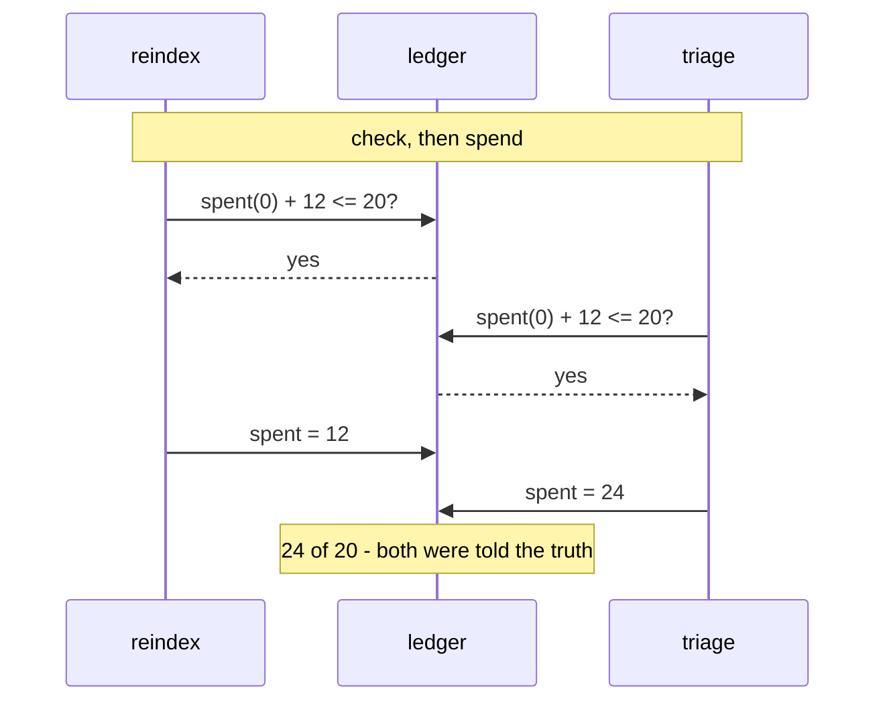

# 2.2 — The reservation, not the check

## One-line answer

Asking *is there room?* and then spending are two separate acts, and anything that happens between
them makes the answer stale — measured here as **24 requests spent against an allowance of 20**, by
two jobs that both asked first and both got a truthful yes.

## The story

One bank account, two people, two cash machines, a couple of streets apart.

Both machines are asked the same thing at almost the same moment: how much is in the account? Both
answer the same number, and both answers are correct. There is ₹6,000 in the account, and there was
₹6,000 in the account when each machine was asked.

One person takes ₹4,000. The other takes ₹4,000. Neither of them did anything wrong. Neither machine
was broken, neither reading was stale in any way a person could have noticed, and if you had asked
either of them afterwards they would both have said, honestly, *I checked first.*

The account is now ₹2,000 overdrawn, and the charge for that arrives a week later addressed to
whoever happens to be named first.

Nothing in the story is fixed by checking more carefully. The gap is not in the checking. It is in
the fact that **asking is not taking**, and between the asking and the taking the world was allowed
to move.

## The idea in plain language

Part [2.1](2.1-ask-before-you-spend.md) built an admission check that reads the ledger and answers a
question. This part is about the sentence that follows the answer.

Between "yes, there is room" and "the requests have been sent and recorded" there is a stretch of
time. During it, the ledger still says what it said before, because a check by definition changes
nothing. Any other run that asks during that stretch gets the same yes, and both of them are right.

This has a name in the literature and it is worth knowing it: **time-of-check to time-of-use**, TOCTOU
for short — a class of bug where a fact is verified and then acted on, and the fact is allowed to
change in between. Sutra met it once already, in
[Day 65 part 5.2](../../../day-65-kill-it-mid-run/parts/05-seven-criteria/5.2-the-gate-cannot-be-bypassed.md),
where an approved payload was checked and then a *different* payload was executed. Here it is money
rather than authority, and it is easier to see because the damage is a number.

The fix is not a better check. It is to **stop having two steps**. A **reservation** is a single
operation that answers the question and takes the room in the same write:

- a **check** reads `spent`, compares, and returns. The ledger is untouched.
- a **reservation** reads `spent + reserved`, compares, **increments `reserved`**, and returns. The
  ledger now records that this run intends to spend, and every later question sees it.

That second field is the whole idea. `reserved` is the room somebody has claimed but not yet used. It
means the ledger can answer honestly during the window that a check cannot cover, and it means a run
that dies mid-flight leaves a visible trace — *somebody claimed twelve requests and never came back* —
rather than leaving no trace at all.

## Why Sutra needs it

Because Phase 11's schedule genuinely does wake two things at once. Day 73's nightly and the daytime
desk are separate processes started by separate triggers, sharing one lane, and the whole of part
[1.3](../01-the-allowance/1.3-counting-what-it-actually-spends.md)'s count assumes the ledger is
telling the truth about what has been spent.

It also decides whether the gate criterion in part
[4.4](../04-the-gate/4.4-criterion-3-the-phase-fits.md) means anything. A criterion that measures a
plan is worth something; a criterion that measures a plan the runtime does not actually honour is a
document check wearing a command's clothes.

And it is the last piece Day 60's durability argument needs in this area. Day 60 made the *work*
crash-safe. This makes the *accounting* crash-safe, and a system where the work survives a crash and
the accounting does not will spend its next window paying for the last one.

## The mechanism

The two operations, side by side, from `lab/admit.py`:

```python
def check(cost: int) -> bool:
    """Answer whether there is room. Change nothing."""
    return read()["spent"] + cost <= ALLOWED


def reserve(cost: int) -> bool:
    """Answer whether there is room and take it in the same write."""
    book = read()
    if book["spent"] + book["reserved"] + cost > ALLOWED:
        return False
    book["reserved"] += cost
    write(book)
    return True
```

**Line by line:**

- `check` reads one field. `reserve` reads **two** and compares against their sum, because room that
  somebody has claimed is not room. Drop `book["reserved"]` from that comparison and you have written
  `check` again with extra steps — the increment still happens, but every reader ignores it.
- `book["reserved"] += cost` then `write(book)` is the increment, and it is the only line in either
  function that touches the file. This is what makes the second caller's answer different from the
  first caller's.
- `reserve` returns `False` **without writing**, so a refused run leaves the ledger exactly as it found
  it. A version that wrote unconditionally would slowly fill `reserved` with requests nobody ever made.
- The docstrings are one line each and they state the side-effect explicitly. In a file where two
  functions differ only in whether they write, the docstring is load-bearing.

And the spend, which is where the reservation is turned into a fact:

```python
def spend(cost: int, held: bool) -> None:
    """Turn a reservation into a spend, or spend with no reservation at all."""
    book = read()
    book["spent"] += cost
    if held:
        book["reserved"] -= cost
    write(book)
```

**Line by line:**

- `held` says whether this caller reserved first. When it did, the reservation is released in the same
  write that records the spend — so the two numbers move together and `spent + reserved` never
  double-counts the same twelve requests.
- When `held` is `False` — the check-then-spend arm — only `spent` moves, because there was never a
  reservation to release. Passing `held=True` there would drive `reserved` negative, which is a good
  thing to know: a ledger where `reserved` can go below zero is a ledger where somebody released
  something they never took.
- This function is still not atomic across processes, and that is deliberate for a lab. The
  *production* answer is one atomic increment in something built for it, which is the first item in
  the **In production** section below.

The two shapes, drawn:



Run both arms. The reserving one first:

```bash
cd days/day-78-inside-free-quota/lab
uv run python admit.py; echo "exit: $?"
```

**Line by line:**

- No flag selects `reserve`. Two jobs wake together; the second one asks after the first has already
  claimed its room.

Measured on 2026-09-06:

```text
admission: reserve, then spend

  reindex   asks for  12 -> admitted
  triage    asks for  12 -> refused

  reindex   spent 12
  triage    did not run

  spent 12 of 20, inside the allowance
exit: 0
```

Now switch the reservation off:

```bash
uv run python admit.py --check; echo "exit: $?"
```

**Line by line:**

- `--check` swaps `reserve` for `check` and passes `held=False` to `spend`. Nothing else in the file
  changes: same two jobs, same costs, same allowance, same ledger.

Measured on 2026-09-06:

```text
admission: check, then spend

  reindex   asks for  12 -> admitted
  triage    asks for  12 -> admitted

  reindex   spent 12
  triage    spent 12

  spent 24 of 20, over by 4
  the last 4 requests come back 429 and nothing in this file knows it
exit: 1
```

**Both jobs asked. Both were told yes. Both answers were correct at the moment they were given.** The
ledger ends 4 over, and — this is the part that makes it a real bug rather than a puzzle — there is
nothing in the check-then-spend run that looks wrong. No exception, no warning, no odd ordering. Two
jobs politely did the right thing and the account is overdrawn.

The 4 is worth pausing on too. It is not 12. The over-spend is `2 × 12 − 20`, which means the size of
the damage depends on the *cost of the second job*, not on the size of the allowance — so a system
that is fine at twelve-request jobs breaks worse, not more often, when somebody adds a sixty-request
one.

## When it breaks

The reservation itself has a failure, and it is the one every reservation system has: **a reservation
that is never released.**

`reserve` increments `reserved` and `spend` decrements it. A run that reserves, sends its requests, and
then dies before recording leaves `reserved` permanently high. Nothing raises. The ledger simply
believes, for ever, that twelve requests are spoken for. The next run reads `spent + reserved`, finds
less room than there is, and refuses itself. Then the one after that. Then every one after that.

You have seen this exact failure once before with a different noun:
[Day 73 part 2.4](../../../day-73-ambient-agents/parts/02-when-it-dies-at-three-am/2.4-the-lock-nobody-released.md)
is a lock taken in one line and released in none, and it refuses every run after the one that died.
This is the same bug with a number instead of a file, and it is worth noticing that adding
`reserved` **created** it — the check-then-spend version could not get stuck this way, because it had
nothing to get stuck holding.

That is the honest trade and it should be said plainly: reservations replace an over-spend you can
measure with a deadlock you have to expire. The fix is that reservations carry a time and are
reclaimed when they are older than the longest a run could possibly take:

```text
{"spent": 12, "reserved": 12, "reserved_at": "2026-09-06T19:00:11Z"}
```

A sweep that clears reservations older than, say, twice the longest observed run is the cheap version.
The expensive version is the correct one — a reservation identified by run, reconciled against what
that run actually spent, which is Day 60's event log doing the work it was built for.

## In production

**What a professional writes instead.** One atomic operation, in something that has one. Redis
`INCRBY` with `EXPIRE` set to the window is the common answer and the reason is not performance: it is
that the read and the write are a single instruction that two processes cannot interleave. A database
row with `UPDATE ... SET spent = spent + ? WHERE spent + ? <= allowance` does the same job with the
same property. If the number matters, do not compute it in your process.

**What degrades under concurrency.** The lab's version has a second race the output above does not
show: `reserve` itself is a read, a compare and a write in three separate steps, so two processes can
interleave *inside it* and both reserve. The lab gets away with it because it runs the two jobs
sequentially in one process. Anything real does not, and the failure is the same 24-of-20 with the fix
apparently already applied — which is worse than not having applied it, because now everybody believes
it is handled.

**The failure that only shows with real traffic.** Reservations that are correct and enormous. A run
that reserves its full worst-case cost holds room it will mostly not use — reserve 60 for an eval
stage that stops early at 12, and 48 requests are unavailable to everything else for the length of the
run. The system is not over-spending; it is under-using its allowance while reporting that it is full.
Nobody notices this, because the symptom is jobs being refused, which looks exactly like the thing the
reservation was added to cause.

**The review comment a senior engineer leaves:** *"You have a reserve and a release and no expiry. Add
one now rather than after the first stuck night — a reservation with no timeout is a lock with no
timeout. Second thing: reserve the expected cost, not the worst case, and top up if the run needs more.
Reserving 60 for a job that usually spends 12 will starve the desk for an hour every night and the
graph will show us at capacity while we are actually idle."*

**The interview question:** *"Two workers share a rate budget stored in Redis. Walk me through the
increment."* The answer that shows experience does the check and the increment in one operation and
then handles the case where the increment takes it over — `INCRBY` returns the new value, so you
increment first, and if the result exceeds the allowance you decrement back and refuse. Getting there
by yourself, rather than reaching for a lock around a read and a write, is the tell.

## Check yourself

```bash
cd days/day-78-inside-free-quota/lab
uv run python admit.py; echo "exit: $?"
uv run python admit.py --check; echo "exit: $?"
cat state/quota.json
```

The two runs differ by 12 requests. Before you look, say which of the two numbers in `quota.json`
is non-zero at the end of each run, and why the reserving arm's ledger is the one you would rather
find after a crash.

Now change `ARRIVALS` in `admit.py` so both jobs ask for 8 instead of 12, and run the `--check` arm
again. The over-spend disappears. Say why that does **not** mean the bug is fixed, and what number
you would have to change to bring it back.

**Out loud, without scrolling up:** both jobs asked before spending and both got a truthful answer.
Where exactly did the truth expire?

**Next:** [2.3 — Whose midnight resets it](2.3-whose-midnight-resets-it.md).
