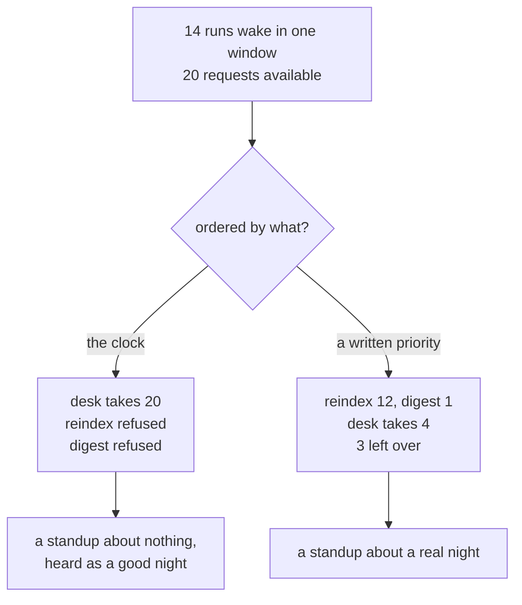

# 2.4 — The job that ran anyway

## One-line answer

💥 Every one of fourteen runs asked before spending, every answer was correct, not one request was
wasted — and the night still did not happen, because a scheduler with no priority order admits
whatever wakes first and a clock has no opinion about what matters.

## The story

The office printer, and the ream of paper somebody put in it on Monday morning.

At ten past nine, a colleague sends a three-hundred-page draft to it. He checks first, because he is
not thoughtless — he walks over, sees the tray is full, comes back and hits print. Perfectly
reasonable. The tray was full.

At half past eleven somebody prints a forty-page report. Also checks. Also fine.

At ten to five, the person who does the invoices comes over with the month's invoices, which have to
go in the post today because that is what "the month's invoices" means. There are eleven of them and
they are one page each.

There is no paper.

Nobody did anything wrong. Everybody checked. Nobody printed anything they were not supposed to
print. And the eleven pages that had a deadline, that cost eleven sheets out of five hundred, that
would have taken forty seconds — those are the ones that did not get printed, because they arrived
last and the tray does not know what an invoice is.

The person who empties the tray at ten past nine is not the person who suffers at ten to five, and
that is the whole shape of the problem.

## The idea in plain language

Part [2.1](2.1-ask-before-you-spend.md) built the admission check and part
[2.2](2.2-the-reservation-not-the-check.md) made it honest under concurrency. Both of them answer
*can this run afford itself?* Neither of them answers a second question, and until now this day has
not asked it:

**When there is not enough for everything, which one gets it?**

A scheduler that only has an admission check has an implicit answer, and the answer is **whoever asked
first**. That is not a policy. It is the order the clock happens to fire in, which is a consequence of
what time somebody typed into a crontab on some afternoon months ago, for reasons that had nothing to
do with importance.

The distinction is worth naming clearly, because the two are easy to confuse:

- **Admission** decides *whether* a run can afford to start. It compares one run against what is left.
- **Priority** decides *which* run gets what is left when they cannot all have it. It compares runs
  against each other.

A system with admission and no priority is not neutral. It has a priority order — the wall clock — and
it is using it without anybody having chosen it or being able to see it. Nothing in the code says
`priority`, so nothing in review can be argued with.

And the accidental order has a bias, which is the cruel part. Cheap jobs tend to be scheduled at the
edges of the day, because they are quick and nobody worries about them. Expensive jobs sit in the
middle where the work is. So the accidental order systematically favours **the expensive job that runs
in working hours** over **the cheap job that runs at the boundary** — which is precisely backwards from
how much anybody cares.

## Why Sutra needs it

Because Phase 11 is over its lane. Part
[1.3](../01-the-allowance/1.3-counting-what-it-actually-spends.md) counted 62 requests a day against
an observed 20, and that arithmetic guarantees something will not run. This part is about which.

There is a specific thing at stake and Day 77 already built it. The morning standup is the only output
of this whole phase that a person hears. If the night does not happen, the standup still runs — one
request, always affordable — and it reports on a job that produced nothing.
[Day 77 part 3.2](../../../day-77-the-standup-agent/parts/03-the-quiet-morning/3.2-saying-what-you-do-not-know.md)
is exactly this: a section quietly left out of a spoken report is heard as *nothing to report*, so
omitting the digest does not omit anything, it **asserts a good night**. That failure was designed
there as a reporting bug. Here it arrives through a quota, from a completely different direction, on a
morning where every line of code did what it was told.

## The mechanism

The arrivals come from the fixture, expanded into individual runs:

```python
def arrivals() -> list[tuple[float, str, int]]:
    """(hour, job, cost) for every run in one window, in the order a clock fires them.

    The desk runs through the day, the nightly wakes at half past midnight, the standup runs at
    seven. A job's daily cost is not one arrival - it is `runs_per_day` of them, and that is the
    difference between a schedule you can admit and a number in a spreadsheet.
    """
    per_run = {j.name: j.requests_per_run for j in JOBS}
    out = [(hour, name, per_run[name]) for name, hours in WAKE_HOURS.items() for hour in hours]
    return sorted(out)
```

**Line by line:**

- `per_run` reads `requests_per_run`, **not** `requests_per_day`. This is where part
  [1.1](../01-the-allowance/1.1-an-allowance-not-a-speed-limit.md)'s insistence on keeping the two
  numbers apart earns its place: admission happens per run, so twelve runs of four requests behave
  completely differently from one run of forty-eight, and a fixture that stored only the total could
  not express the difference.
- `sorted(out)` sorts by the first element of the tuple, which is the hour. That single call **is**
  the clock's opinion, and it is the thing the ablation replaces.
- The hours are UTC, from `WAKE_HOURS`: the desk at 03:30 through 14:30, the nightly at 19:00. Those
  are the same instants part [2.3](2.3-whose-midnight-resets-it.md) drew, so within one provider window
  the desk genuinely does go first.

The priority table is three lines, and it is the only opinion in the file:

```python
# What the morning depends on, lowest number first. This is the only line in the file that is a
# decision rather than a measurement, and it is the whole subject of the part.
PRIORITY = {"reindex": 0, "digest": 1, "triage": 2}
```

**Line by line:**

- The comment is part of the mechanism, not decoration. Everything else in this lab is counted; this
  is chosen, and a reader six months later needs to know which lines they are allowed to argue with.
- `reindex` above `digest` above `triage` is a claim: *the night is worth more than an hour of the
  desk*, because the desk's tickets will still be there tomorrow and the night will not. That claim is
  arguable and it should be argued with. What it must not be is unwritten.
- The dictionary is keyed by job name and holds an integer, so ties are impossible and the order is
  total. A priority scheme with ties needs a tie-break, and an unstated tie-break is the clock again.

The admission loop itself is unchanged from part [2.1](2.1-ask-before-you-spend.md) — same comparison,
same refusal — and only the order it walks changes:

```python
order = wake if fifo else sorted(wake, key=lambda a: (PRIORITY[a[1]], a[0]))
```

**Line by line:**

- `(PRIORITY[a[1]], a[0])` sorts by priority first and by hour second, so runs of the same job stay in
  clock order. Dropping `a[0]` would make the order of a job's twelve runs arbitrary, which matters the
  moment their costs differ.
- The `if fifo else` is the ablation, and it is one word. That is the honest measure of how easy this
  bug is to have: the buggy version is the version where somebody has not yet written the sort key.

Run the version with a stated priority:

```bash
cd days/day-78-inside-free-quota/lab
uv run python anyway.py; echo "exit: $?"
```

**Line by line:**

- No flag sorts by `PRIORITY` before admitting. The allowance, the costs and the fourteen runs are
  identical in both arms.

Measured on 2026-09-06:

```text
allowance for gemini/gemini-3.7-flash: 20 requests in the window
admission order: priority order
  14 runs arrive in this window

  job        runs  admitted  refused
  reindex       1         1        0
  digest        1         1        0
  triage       12         1       11

  17 of 20 requests spent, 3 unspent
  every run in this window asked before spending: 14 of 14
  both nightly stages ran, so the morning has something true to report
exit: 0
```

Now switch the priority off and let the clock decide:

```bash
uv run python anyway.py --fifo; echo "exit: $?"
```

**Line by line:**

- `--fifo` skips the sort. Nothing else changes: same fourteen runs, same costs, same allowance, same
  admission check, same reservation semantics.

Measured on 2026-09-06:

```text
admission order: wake order
  14 runs arrive in this window

  job        runs  admitted  refused
  reindex       1         0        1
  digest        1         0        1
  triage       12         5        7

  20 of 20 requests spent, 0 unspent
  every run in this window asked before spending: 14 of 14
  the night did not happen: reindex, digest never ran
  tomorrow's standup is a report about a job that produced nothing
exit: 1
```

**The line to stare at is `every run in this window asked before spending: 14 of 14`.** It is printed
in both arms and it is true in both. This system is quota-aware by any definition anybody would write
down. Every run checked. Every check was correct. Every refusal was polite and immediate and wasted
nothing. Not one request was sent that should not have been.

And the night did not happen.

Look at what the two arms did with the allowance, too, because it is not what you would guess. The
FIFO arm spent **20 of 20** — perfect utilisation, nothing wasted, a graph that looks excellent — and
produced no re-index and no digest. The priority arm spent **17 of 20** and left three requests on the
table, and it is unambiguously the better night. Utilisation is not the goal, and a dashboard that
watches it will prefer the broken run.



## When it breaks

There is no error text for this one, and that is the finding rather than an omission. Every process
exits `0`. The desk's five admitted runs are all successful. The nightly's refusals are handled
gracefully by the very check this day spent two parts building. `state/runs.jsonl` from Day 73 records
a run that did not start, which is a normal line.

What you would see the next morning is Day 77's standup, working perfectly, saying:

```text
  Two tickets need you: 4688, 4740.
  4688, refund over the limit - needs an approval.
  4740, waiting on a reply from us since the eleventh day.
  The queue is 4 sign-in, 4 billing, 4 export, 12 open in total.
```

Read that and count what is missing: the sentence about last night. Day 77's own good standup ends
`Last night the evals were 3 of 5 passed and the digest stage died` — a line that exists because the
night produced something to say. Here there is no such line, and the report is not wrong. It is
shorter.

The smallest fix is two things, and they are separate:

1. `PRIORITY`, written down, argued about once, in the repository. Three lines.
2. The standup asserting the *absence* — a sentence that says the night did not run, rather than a
   section quietly missing. That is
   [Day 77 part 3.2](../../../day-77-the-standup-agent/parts/03-the-quiet-morning/3.2-saying-what-you-do-not-know.md)'s
   build brief, and this part is the reason it is not optional.

## In production

**What a professional writes instead of a wake order.** Every scheduled job carries a class, and the
class decides what gets cut. The usual shape is three: *must run* (the report a person is waiting for,
the compliance job, the backup), *should run* (the re-index, the digest), *best effort* (the
speculative pre-computation, the cache warm). Two properties matter more than the names: it is written
in one place, and every job has one — because a job with no class defaults to whatever the code does,
which is the clock again.

**What degrades at scale.** Priorities inflate. Every team believes their job is *must run*, and each
individual argument is good. Within a year everything is top priority and the ordering has silently
gone back to the clock, with the added damage that everybody now believes it has not. The defence is a
budget rather than a label — *must run* work is capped at a fraction of the allowance, and adding to it
means taking something out.

**The failure that only shows with real traffic.** The desk's demand is not a constant. On a normal day
it takes 48 of the 20 and something is cut; on a quiet Sunday it takes 12 and nothing is, so the
system behaves perfectly for weeks. The cut arrives on the busiest day — the day the queue is longest,
the day the night's index matters most, the day somebody would most want the morning report — because
that is the day the competing job is hungriest. Every quota-contention failure is correlated with the
thing that made it matter.

**The review comment a senior engineer leaves:** *"Every job here checks its quota, which is more than
most do, and the schedule still has no stated priority — so right now our ordering policy is 'whatever
cron fires first'. Write the order down, even if the order you write is the one we already have by
accident. Second: the FIFO run spends 100% of the allowance and the good run spends 85%. Whatever
dashboard we build for this, do not put utilisation on it as a health metric, or the first thing
somebody will do is tune us back into the broken arm."*

**The interview question:** *"Your batch jobs share an API quota and one of them keeps missing its
window. How do you decide who gets cut?"* The answer that shows experience does not start with
technology. It asks who notices the absence and how quickly, orders the jobs by that, writes it down
somewhere reviewable, and then adds the part most people miss: the job that gets cut must **say** it
was cut, to somebody, in a way that is distinguishable from having run and found nothing.

## Check yourself

```bash
cd days/day-78-inside-free-quota/lab
uv run python anyway.py; echo "exit: $?"
uv run python anyway.py --fifo; echo "exit: $?"
```

Both runs print `every run in this window asked before spending: 14 of 14`. Say out loud what that line
proves and what it does not.

Now change `PRIORITY` so that `triage` is `0` and re-run the default arm. It becomes the FIFO arm.
That is the point of writing the order down: it can be wrong, and being wrong in a file is a
conversation, while being wrong in a crontab is a Tuesday.

**Out loud, without scrolling up:** one arm spent 20 of 20 requests and the other spent 17. Which one
was the good night, and what does that say about using utilisation as a health metric?

**Next:** [3.1 — Three things a job can do when it cannot afford itself](../03-when-you-cannot-afford-it/3.1-three-things-a-job-can-do.md).
