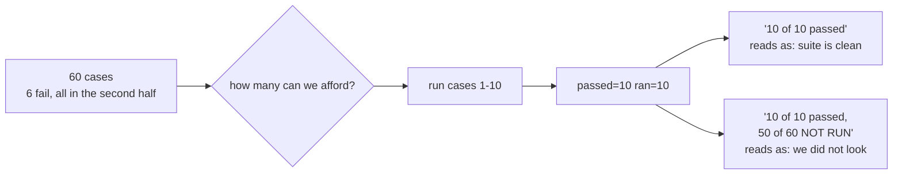

# 3.2 — The shrunken run that reports as full

## One-line answer

💥 `evals: 10 of 10 passed` — every word of it true, produced by a run that checked one sixth of the
suite and did not look at any of the six cases that fail.

## The story

A child brings home a report card.

Every subject on it has a good mark. Not suspiciously good — sensible marks, the kind you would
expect. Maths, science, the two languages, all fine. You sign it, you say well done, and you put it in
the drawer with the others.

What is not on the card is that there were seven subjects and only five exams were held. Two were
postponed when the teacher was off, and rescheduled for after the report went out. Nobody hid this.
Nobody wrote anything false. The card lists five subjects and gives five marks, all correct.

You read it as a report on the year, because that is what a report card is. The information that would
have told you otherwise is not a wrong number on the card. It is the **absence of two rows**, and rows
that are not there do not draw attention to themselves. You would have had to remember how many
subjects there were and count.

Six months later, when the two postponed exams turn out to have been the difficult ones, nobody can
point at anything on that card and call it a lie.

## The idea in plain language

Part [3.1](3.1-three-things-a-job-can-do.md) named three honest strategies and said each one must
report its size. This part is what happens when the size is left out.

The thing to understand is that the resulting report is **not false**. This is not a bug about lying.
Every number in `evals: 10 of 10 passed` is correct: ten cases ran, ten passed. If you audited it you
would find nothing wrong. If you tested it, the test would go green. The problem is entirely in what a
reader does with a true sentence, and readers do two things automatically:

- they read a **rate** as a claim about the whole population — "10 of 10" is heard as "all of them";
- they read the **absence of bad news as good news**, because a report that found problems would have
  mentioned them.

Both of those inferences are wrong here, and neither is unreasonable. That combination — true text,
reasonable reader, wrong conclusion — is the signature of the most durable class of reporting bug,
and Sutra has now met it three times from three directions:

- [Day 73 part 3.2](../../../day-73-ambient-agents/parts/03-the-morning-after/3.2-the-digest-that-reassures.md):
  the success-only digest names 0 of the 2 failing cases while every number in it is true.
- [Day 77 part 3.2](../../../day-77-the-standup-agent/parts/03-the-quiet-morning/3.2-saying-what-you-do-not-know.md):
  omitting the digest section does not omit anything, it **asserts a good night**.
- This part: the missing denominator.

There is a second effect stacked on top, and it is the one that makes the measurement below so bad.
The failures in a suite are **not evenly distributed**. Test cases are appended in the order the bugs
were found, so the recent, awkward, half-understood behaviours cluster at the end. Any shrink that
takes the *first* N cases is therefore not a random sample — it is a systematically easy one. The
sample is biased towards passing, and the report says nothing about that either.

## Why Sutra needs it

Because the shrink strategy is the one Addendum 02 tells days 79–83 to use, in so many words: *"keep
per-run evalsets small (10–15 cases dev, full 60+ only at phase gates)"*. That is correct advice and it
is exactly the configuration this part breaks.

The digest that carries the line is Day 73's, written by a job nobody watches, and the person who reads
it is reading Day 77's standup at seven in the morning with a cup of tea. There is no second reader.
Nobody is going to open `evals.json` and count. The sentence is the entire interface.

And it decides whether Phase 12 means anything at all. If a shrunken eval run can report as a full one,
then Day 83's phase gate — *"Sutra's eval suite green"* — is a claim that can be satisfied by running
fewer cases, which makes the gate easier to pass the more constrained the quota gets. That is a gate
pointing the wrong way.

## The mechanism

One flag, and the only thing it changes is the sentence:

```python
if quiet:
    print(f"    evals: {passed} of {ran} passed")
elif strategy == "skip":
    print(f"    evals: not run, {TOTAL_CASES} cases unchecked - the window had {AFFORDABLE}")
elif strategy == "defer":
    print(f"    evals: {passed} of {ran} passed, {deferred} cases queued for the next window")
else:
    print(f"    evals: {passed} of {ran} passed, {unrun} of {TOTAL_CASES} cases NOT RUN")
```

**Line by line:**

- The `quiet` branch and the `else` branch compute **the same two numbers** and differ by one clause.
  `passed` is 10 in both. `ran` is 10 in both. Nothing was recomputed, nothing was hidden, no data was
  discarded — the second half of the sentence was simply not written.
- `{unrun} of {TOTAL_CASES}` is the fix, and note what it needs: `TOTAL_CASES`. The honest sentence
  requires knowing the size of the whole suite, which the shrunken run **did not have to load**. That
  is why this bug is so easy to write: the natural implementation of "run the first ten cases" never
  needs to know there are sixty, so the denominator is not available unless somebody deliberately keeps
  it. The dishonest version is not the lazy version — it is the *natural* one.
- `NOT RUN` is in capitals on purpose. The failure this part describes is a reader skimming, and the
  clause that matters is at the end of the line where skimming ends.
- The `skip` branch says `60 cases unchecked` with no `passed` at all, which is why part
  [3.1](3.1-three-things-a-job-can-do.md) observed that the strategy doing the least work produces the
  least misleading sentence.

And the fixture that makes the damage visible:

```python
TOTAL_CASES = 60
FAILING = {34, 37, 41, 48, 55, 59}

AFFORDABLE = 10  # what is left in the window when the nightly reaches the eval stage
```

**Line by line:**

- All six failing case numbers are above 33 — every one of them in the second half. That is not a trick
  chosen to make the demo work; it is the shape real suites have, for the reason given above, and the
  comment in the source says so. Spread the six evenly and the shrink would catch one, which is a
  *different* and much less interesting failure.
- `AFFORDABLE = 10` is a constant standing in for what the ledger would return after the desk has spent
  its day. It is 10 rather than, say, 30 because 10 is what Addendum 02 actually recommends for a
  development run, so the numbers below are the recommended configuration and not a strawman.

Run the honest arm:

```bash
cd days/day-78-inside-free-quota/lab
uv run python degrade.py; echo "exit: $?"
```

**Line by line:**

- No flags: the shrink strategy, reporting its size.

Measured on 2026-09-06:

```text
the eval stage wants 60 requests and has 10
strategy: shrink

  the digest line this produces:

    evals: 10 of 10 passed, 50 of 60 cases NOT RUN

  the truth over all 60 cases: 54 passed, 6 failed
  failures inside the 10 cases that ran: 0
  failures nobody looked at: 6

  the line above says what was not checked
exit: 0
```

Now remove the denominator:

```bash
uv run python degrade.py --quiet; echo "exit: $?"
```

**Line by line:**

- `--quiet` selects the first branch. Same strategy, same ten cases, same six failures nobody looked
  at. One clause fewer.

Measured on 2026-09-06:

```text
strategy: shrink

  the digest line this produces:

    evals: 10 of 10 passed

  the truth over all 60 cases: 54 passed, 6 failed
  failures inside the 10 cases that ran: 0
  failures nobody looked at: 6

  the line above is true and reports a clean run of a suite that is not clean
exit: 1
```

**`evals: 10 of 10 passed`.** Read it the way somebody reads a digest at seven in the morning. It says
a hundred per cent. It has a numerator and a denominator, which is the shape of a complete measurement.
It contains no hedge, no ellipsis and no asterisk. There is nothing about it that invites a follow-up
question.

The suite it describes has six failures in it.

And now the compounding, which is the reason this is a `production` part rather than a note: this line
is **better** than a full run's line. A full run would have said `54 of 60 passed`, which is a worse
number, which someone would have had to look into. The shrunken report is more reassuring than the
truth, so the day the quota gets tighter is the day the morning digest gets *nicer*. Nothing in the
system is pushing back on that.



## When it breaks

There is no error, no exception and no failing test. The run exits 0 and the artefact on disk is
well-formed. What you would find, if you went looking, is `state/evals.json` from Day 73's nightly
containing ten results where it used to contain sixty — and nothing in the file saying which sixty it
was supposed to be.

The nearest thing to an error message is what arrives three weeks later, when somebody runs the full
suite at a phase gate:

```text
  evals: 54 of 60 passed
    FAILED case 34, case 37, case 41, case 48, case 55, case 59
```

Six failures, at a gate, with no way to tell when any of them started failing — because every digest
since has said `10 of 10 passed`. The bug is not that the failures exist. It is that the report
destroyed the ability to bisect them.

The smallest fix is one clause, and it is worth stating the general rule rather than the specific
patch: **a rate is only meaningful next to the population it was taken from**. Any report of the form
"N of M passed" where M is the sample rather than the suite must carry the suite size, and the two
numbers must be in the same sentence, because a denominator in a footnote is a denominator nobody
reads.

## In production

**What a professional writes instead.** A run result carries three numbers rather than two —
`passed`, `ran`, `total` — and the reporting layer refuses to render a percentage when `ran != total`.
Not "renders it with a warning". Refuses, and prints the coverage fraction instead. The reason to make
it structural rather than a convention is that conventions are maintained by whoever writes the next
formatter, and there is always a next formatter.

**What degrades at scale.** The suite grows and the affordable sample does not, so the coverage
fraction falls continuously and nothing in the pipeline is watching a falling fraction. Year one: 10 of
60, tight but visible. Year three: 10 of 400, and the nightly's green result now covers two and a half
per cent of what the system does. Each individual case that was added made the situation slightly worse
and each was obviously the right thing to add.

**The failure that only shows with real traffic.** Shrinking under quota pressure correlates with the
times you most need coverage. The window is tight because the desk was busy; the desk was busy because
something changed — a release, a spike, a bad deploy — and that is the night the eval run gets cut to
ten cases and reports clean. The sampling is not just biased towards easy cases; it is biased towards
being smallest exactly when the system is least normal.

**The review comment a senior engineer leaves:** *"This prints a pass rate for a partial run. Either
print coverage next to it or do not print a rate at all — right now a tighter quota makes our morning
report look better, which is the wrong direction for a signal to move. Also: the sample is
`cases[:10]`. That is our ten oldest cases every single night. If we are going to sample, sample
deterministically over a rotation so that six nights cover the suite, and put the rotation offset in
the digest so we can tell which sixth we looked at."*

**The interview question:** *"Your CI runs a subset of tests to save time and it has been green for
months. What worries you?"* The answer that shows experience worries about **which** subset, not about
the size of it — whether the selection is biased towards the fast, old, stable tests, whether the
report says what fraction was run, and whether anybody would notice the fraction falling. A candidate
who only says "we should run all of them" has not had to work inside a real constraint.

## Check yourself

```bash
cd days/day-78-inside-free-quota/lab
uv run python degrade.py; echo "exit: $?"
uv run python degrade.py --quiet; echo "exit: $?"
```

Two runs, identical work, exit codes 0 and 1. Say which single clause is the difference, and why the
run that exits 1 is the one that looks healthier.

Now change `FAILING` to `{2, 5, 8, 34, 55, 59}` so that three of the six failures fall inside the first
ten cases, and run the `--quiet` arm again. The digest line changes to `7 of 10 passed`, which somebody
would investigate. Say what that tells you about how much of this bug's danger comes from the missing
denominator and how much comes from where the failures happen to sit.

**Out loud, without scrolling up:** `evals: 10 of 10 passed` contains no false statement. Name the two
inferences a reader makes from it, and say which one the missing clause was supposed to block.

**Next:** [4.1 — What Phase 11 promised](../04-the-gate/4.1-what-phase-11-promised.md).
