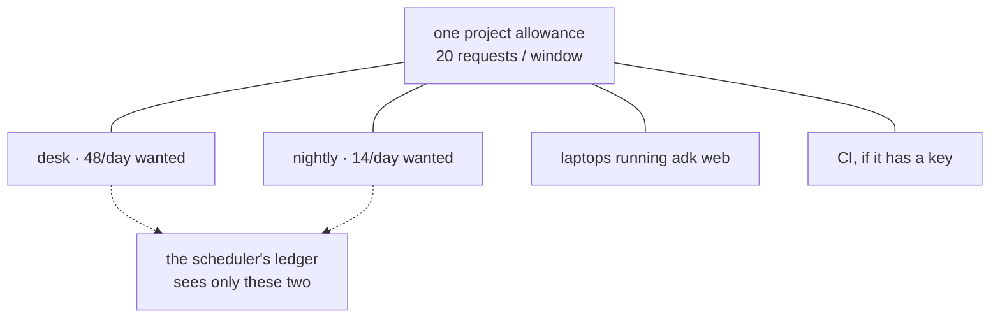

# 5.1 — The nightly competes with the day

## One-line answer

An allowance is not divided between your jobs — it is shared with everything else that touches the
same project, including the users you are trying to serve — so the nightly's 14 requests are taken
from somebody's afternoon, and the scheduler has no idea whose.

## The story

One water connection for the whole building, and a tank on the roof that fills for two hours in the
morning.

The flat on the ground floor has a motor. It is not against any rule and nobody hid it; it was fitted
when the flat was renovated and it does exactly what motors do — it pulls water faster than gravity
would. The people in that flat fill their tank, water the plants, wash the car, and by nine o'clock
they are done and have not thought about it once.

The flat on the fourth floor gets a dribble and then air.

The interesting thing about this arrangement is that nobody in it is behaving badly and nobody can see
the problem from where they are standing. The ground-floor flat sees a tap that works. The fourth-floor
flat sees a tap that does not, and has no way at all to find out why — nothing in their flat is
connected to anything in the other one except a pipe in a wall.

It only becomes solvable when somebody draws the building as one system with one supply, which nobody
does until there is an argument.

## The idea in plain language

Every part of this day so far has treated the allowance as something Sutra's schedule spends. It is
not. It is something **the project** spends, and Sutra's schedule is one of the things in the project.

Addendum 02 records the fact in one line: Gemini's limits are per *project*, not per key. That means
the same bucket is drawn on by:

- the scheduled jobs this day has been pricing;
- the interactive desk answering tickets while people are at work;
- every developer running `adk web` on their laptop against the same project;
- CI, if CI has a key;
- any experiment, notebook or half-finished branch anybody has pointed at it.

None of those know about each other. The scheduler's ledger from part
[2.1](../02-asking-before-spending/2.1-ask-before-you-spend.md) records what the scheduler spent, and
it is silent about everything else — so its `spent` field is not the project's spending, it is a lower
bound on it.

That has a consequence worth stating plainly, because it inverts how the nightly feels. **There is no
such thing as spare quota at night.** The allowance is a daily total; it does not renew at midnight in
some second, separate pool for background work. Requests the nightly spends at 00:30 are requests the
desk cannot spend at 14:00 the same window — and part
[2.3](../02-asking-before-spending/2.3-whose-midnight-resets-it.md) showed that 00:30 local is
*inside* the previous UTC window, so the nightly is not spending tomorrow's allowance at all. It is
spending the end of today's.

The night is quiet in *wall-clock* terms. It is not quiet in *quota* terms, and those two meanings of
"quiet" have been silently swapped throughout the design of every ambient system anybody has ever
built.

## Why Sutra needs it

Because part [1.3](../01-the-allowance/1.3-counting-what-it-actually-spends.md) counted 62 requests a
day against an observed 20, and 48 of those 62 are the daytime desk. Any conversation about cutting the
nightly is a conversation about 14 requests, which cannot fix a 42-request overage on its own. The
arithmetic forces the question this part is about: the two are competing, and the phase gate's sentence
covers only one of them.

It also decides what Day 82 is allowed to do. Addendum 02 says to schedule full eval runs as part of
the nightly *"so daily quota resets work for you"*. That advice is sound and this part is its
qualification: the reset works for you only if the window you are relying on is the provider's, and
only if the daytime traffic has not already taken it.

## The mechanism

Nothing new to build — the mechanism is a way of reading the numbers already measured. Take part
[2.4](../02-asking-before-spending/2.4-the-job-that-ran-anyway.md)'s two runs and read them as a
question about who paid:

```bash
cd days/day-78-inside-free-quota/lab
uv run python anyway.py
uv run python anyway.py --fifo
```

**Line by line:**

- The two arms differ only in admission order. Both have the same 14 runs and the same 20-request
  allowance, so the difference between them is entirely *who got the allowance*, which is the subject
  here.

Measured on 2026-09-06, priority order:

```text
  job        runs  admitted  refused
  reindex       1         1        0
  digest        1         1        0
  triage       12         1       11
```

and wake order:

```text
  job        runs  admitted  refused
  reindex       1         0        1
  digest        1         0        1
  triage       12         5        7
```

**Read the `triage` row in both.** Eleven refusals in the good arm; seven in the bad one. The arm this
day argues for is the arm in which **the users' work is refused more often**, and that is not a
side-effect to be tidied away. It is the trade, and it should be stated in those words to whoever owns
the product: *we are choosing to refuse eleven ticket-triage runs so that the night happens.*

That trade might be wrong. A desk whose tickets are answered by a person when the agent is refused is
losing very little; a desk with nobody behind it is losing a customer's afternoon. Nothing in
`PRIORITY` knows which of those Sutra is, and no scheduler can work it out. The value of writing the
order down is not that it makes the decision correct — it is that it makes the decision **visible to
somebody who can tell**.

Two ways out that are worth naming, since neither is a scheduling change:

**Move the lane.** The eval stage already runs on `gemini-2.5-flash-lite` rather than on Flash, which
is a different bucket. That is not a trick; it is the standard answer, and it is what Addendum 02 means
by *"Flash-Lite for high-volume/low-stakes calls"*. The cost is that Flash-Lite is a weaker model, and
the honest version of this move says which jobs can take that and which cannot.

**Separate the projects.** Batch work on its own project with its own key, so the allowances genuinely
are separate. This works, and it has a cost people discover later: two projects means two sets of
limits to measure, two ledgers, and a class of bug where staging is pointed at the production project
by a stale environment variable.



The dotted lines are what the ledger knows about. The two solid lines it does not touch are why a
correct ledger still gets a 429.

## When it breaks

The 429 arrives on a job that did everything right. This repository's own recorded refusal:

```text
429 RESOURCE_EXHAUSTED
generativelanguage.googleapis.com/generate_content_free_tier_requests
Please retry in ~53s
```

There is nothing in that body about who spent it. No caller, no key, no service name — the quota is
named after the *project's* free-tier request counter and that is the finest granularity available.
Your logs will show your job's requests. They will not show the notebook.

The specific way this becomes an unfixable-looking bug: the nightly starts failing intermittently.
Some nights it works. Some nights it does not. There is no pattern in your code, no pattern in your
deploys, and no pattern in your traffic — because the pattern is in somebody else's, and their busy
days are not your busy days.

The smallest fix is not code either. It is to treat a 429 on a request your ledger said was affordable
as **evidence that the ledger is incomplete**, log it as such with the ledger's own belief attached,
and stop retrying:

```text
quota refused: ledger believed 6 of 20 spent in window 2026-09-06; provider disagrees
```

That line is worth more than any number of retries, because it is the only artefact that will ever
point at the existence of another spender.

## In production

**What a professional writes instead of one shared bucket.** Separate projects or separate keys per
workload class, with the batch work isolated from anything a user is waiting for. Where the provider
supports it, per-key quotas do the same job with less operational weight. The principle is older than
any of these APIs: work with a person waiting on it and work with nobody waiting on it should not
compete for the same pool, because the queue has no way to tell them apart.

**What degrades at scale.** The interactive load is the one that grows, and it grows in a way nobody
plans: more customers, more tickets, more retries on a bad day. Batch work is planned and roughly
constant. So the share available to the nightly shrinks continuously, and the failure arrives as a
gradual increase in nights that did not finish — which reads like flakiness rather than like capacity,
and gets investigated as flakiness for months.

**The failure that only shows with real traffic.** Correlation. The desk is busiest on the day
something is wrong, which is the day the re-index matters most and the day the morning report would be
most useful. Quota contention does not strike at random; it strikes on the day you need both things.
Every capacity plan that assumes independent demand is wrong in this specific direction.

**The review comment a senior engineer leaves:** *"Our ledger tracks our own spending, so it is a lower
bound on the project's. Say that in a comment at the top of the file, because everybody who reads it
will assume otherwise. And when we get a 429 that our ledger said was impossible, log the ledger's
belief alongside it — that log line is the only way we will ever discover somebody else is on this
project."*

**The interview question:** *"Your batch job and your user-facing service share an API quota. What do
you do?"* The answer that shows experience separates them first — different projects, different keys —
and only then talks about priorities, because priority within one pool is a way of choosing who
suffers and separation is a way of nobody suffering. The follow-up tell is whether they mention that
the two loads are **correlated**: the busy day is the day both want more.

## Check yourself

```bash
cd days/day-78-inside-free-quota/lab
uv run python spend.py
```

Add up the two lanes' demand. Then say what fraction of it is work a person is waiting for, and what
fraction is work nobody asked for today. Say which one you would move to a separate project first, and
why it is not the bigger one.

Then look at `_phase.py` and find the assumption this part says the ledger makes. It is not written
anywhere in the file, which is the point — write the comment the senior engineer asked for, in your own
words.

**Out loud, without scrolling up:** the night is quiet. Quiet in what sense, and in what sense is it
the busiest part of the window?

**Next:** [5.2 — What a real quota-aware scheduler adds](5.2-what-a-real-scheduler-adds.md).
