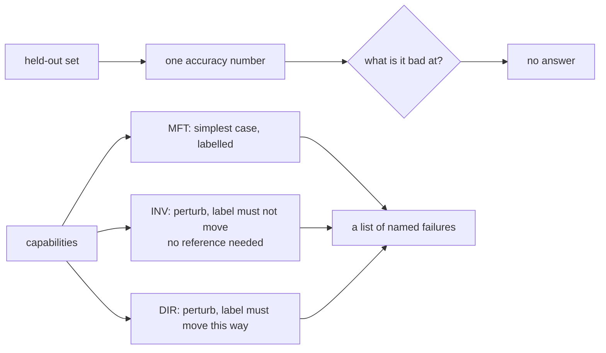

# Paper 01 — Beyond accuracy: testing behaviours, not averages

> **Beyond Accuracy: Behavioral Testing of NLP models with CheckList**
> `arXiv:2005.04118` · 2020 · <https://arxiv.org/abs/2005.04118>
> *Record opened on 2026-09-06; the title above is copied from the arXiv abstract page, and the first
> submission is dated 8 May 2020 (§17.4.1 rule 5).*

## One-line answer

A single accuracy number over a held-out set tells you how a model did on data that looks like your
data, and nothing about **what it can and cannot do** — and the demo below shows a classifier scoring
100% on its held-out set while two behavioural tests find two real bugs it will hit on Monday.

## The story

A team has a model and it is good. The number says so.

Ninety-something per cent on the held-out set, which was drawn from real tickets, which is exactly the
kind of evaluation everybody is told to do. It is better than the previous model, it is better than
the baseline, and when somebody asks how it is doing, there is a number and the number is high.

Then it goes out, and the complaints start arriving one at a time.

Somebody typed "pasword" and the ticket went to the wrong queue. Somebody wrote a message that
mentioned two things and it picked the wrong one. Somebody wrote in capitals. None of these is
mysterious once you see it, and all of them are one-off — you fix the one, and next week there is a
different one.

And this is where the team gets stuck. The number has not moved. Every complaint is a single ticket
out of thousands, so none of them changes the accuracy at all. There is no way to say *the model is
bad at typos* or *the model cannot handle two topics in one message*, because the only instrument
anybody has produces one number, and that number is fine.

Somebody eventually asks the question that has no answer: *what is it actually bad at?* And the honest
reply is that nobody knows, because nothing in the process ever asked.

## The idea in plain language

The paper's claim is that a held-out accuracy score is the wrong shape of instrument, and it proposes
a different one, borrowed openly from software testing: instead of measuring average performance on a
sample, test **capabilities**, one at a time, the way you would test a function.

Two words to define first, because the paper's own title uses them.

**Behavioural testing** means testing a system through its inputs and outputs only, with no access to
how it works inside. It is the black-box testing every programmer already does, applied to a model.
Nothing about the model's parameters, architecture or training is used or needed.

**A capability** is one thing the system ought to be able to do — handle negation, be robust to typos,
understand that a name is a name, get the direction of a comparison right. It is the model-shaped
version of part [1.3](../parts/01-a-test-with-a-score/1.3-the-case-is-the-unit.md)'s *behaviour*.

The method organises tests as a grid: capabilities down one side, and three **test types** across the
top. The three test types are the paper's most quoted contribution and the reason the method
travelled:

- **MFT — a minimum functionality test.** The simplest possible input that exercises one capability,
  with a label you are certain of. Like a unit test: if the model cannot do *this*, it cannot do the
  capability at all.
- **INV — an invariance test.** Change the input in a way that **must not** change the label — a typo,
  a change of case, swapping a name for another name — and assert the prediction is unchanged. The
  crucial property is that it needs **no label at all**: you are asserting that two outputs agree, not
  that either is right, so you can generate thousands of these from unlabelled data.
- **DIR — a directional expectation test.** Change the input in a way that **should** move the
  prediction in a stated direction, and assert it moves. Add a sentence about a refund to an export
  ticket and the answer should now involve billing.

The grid is what makes it a method rather than a list of clever test ideas. Filling in a row forces the
question *what would it mean for the model to be good at this?*, and filling in a column forces *what
kinds of change should and should not matter?* Most of the value the paper reports comes from people
being **prompted** in this structured way, which is why it is a methodology paper and not an algorithm
paper.

The claim it makes about outcomes, from the abstract: practitioners using the tool created about twice
as many tests and found nearly three times as many bugs as those without it.

## Why Sutra needs it

Because part [1.3](../parts/01-a-test-with-a-score/1.3-the-case-is-the-unit.md) arrived at the same
shape from the other end. Sutra's six cases are one per behaviour, each with a reason, deliberately
chosen so no two fail for the same cause — which is a capability grid with one column filled in.

The three test types are the columns that are missing, and two of them cost nothing to add:

- Sutra has **MFTs**: all six cases are minimum functionality tests.
- Sutra has **no INV tests**. Nothing checks that "how long has 4740 been open?" and "how long has
  4740 been open" (no question mark) route to the same tool. INV tests need no reference answer, so
  they are immune to part [3.3](../parts/03-two-metrics-that-cost-nothing/3.3-response-match-and-the-word-not.md)'s
  entire problem — you compare two of the desk's own outputs, not an output against a reference.
- Sutra has **no DIR tests**, and it should. "Escalate this" appended to any ticket should move the
  answer towards a person, and asserting that is a claim about direction rather than about wording.

That second bullet is the one worth taking away. Part
[3.3](../parts/03-two-metrics-that-cost-nothing/3.3-response-match-and-the-word-not.md) measured that
word overlap scores 0 of 6 correct rewordings above threshold, and the reason is that it needs a
reference. **An invariance test does not need one.** It is a free assertion, in a day whose entire
theme is what assertions cost.

## The mechanism

The grid, as this paper defines it, applied to one capability of a ticket router:

| Capability | MFT | INV | DIR |
| --- | --- | --- | --- |
| routes billing language | "refund me" → billing | "refund me" and "REFUND ME" agree | adding "and I want a refund" moves it to billing |
| robust to typos | — | "password" and "pasword" agree | — |
| handles two topics | — | — | mentioning export should move it away from sign-in |

**Read the empty cells.** Not every capability has all three, and the grid's job is to make you notice
which are missing rather than to be filled in completely. The typo row has no MFT because "is the model
robust to typos" is not a thing one simplest-possible input can demonstrate; it is inherently a
comparison between two inputs, which is what INV is for.

The method in three assertions, which is genuinely all it is:

```python
def run_mft() -> list[str]:
    return [
        f"MFT  {text!r} -> {classify(text)}, expected {want}"
        for text, want in MFT
        if classify(text) != want
    ]


def run_inv() -> list[str]:
    return [
        f"INV  {a!r} -> {classify(a)} but {b!r} -> {classify(b)}"
        for a, b in INV
        if classify(a) != classify(b)
    ]


def run_dir() -> list[str]:
    return [
        f"DIR  {before!r} -> {classify(before)}; {after!r} -> {classify(after)}, expected {want}"
        for before, after, want in DIR
        if classify(after) != want
    ]
```

**Line by line:**

- `run_mft` compares a prediction against a **label**. It needs somebody to have decided the right
  answer, exactly like every case in this day's evalset.
- `run_inv` compares `classify(a)` against `classify(b)` — **two predictions, no label anywhere**.
  That is the whole reason invariance tests are cheap: you can generate a thousand of them from
  unlabelled tickets by perturbing each one, and every assertion is well-defined without anybody
  reading a single ticket.
- `run_dir` needs a label, but a weaker one than an MFT: not "what is the right answer for this
  input", only "which way should the answer move". That is a much easier question to get agreement on,
  which matters when the person answering it is a busy domain expert.
- All three return **lists of failure strings** rather than booleans, so a run reports which specific
  inputs failed. Part [1.1](../parts/01-a-test-with-a-score/1.1-a-test-that-answers-how-much.md)'s
  argument about aggregated results applies here too: a count of failures is not actionable and a list
  of them is.
- Each is a comprehension with the test inline. The three test types differ by exactly one expression,
  which is the honest measure of how simple the method is — the contribution is the **taxonomy**, not
  the code.



## The paper in one demo

Two files, and the only thing they do is put a held-out accuracy number next to the three test types.

```text
lab/papers/checklist/
├── desk.py    # the thing under test: a keyword classifier that routes a ticket
└── demo.py    # accuracy, then MFT + INV + DIR, with --off to remove the second half
```

`desk.py` is the subject. It is deterministic and local, so the demo costs nothing and stands in for a
model in exactly the way the paper's subject models did — a black box mapping text to a label:

```python
QUEUES = ("billing", "sign-in", "export")

# The rules, in order. The first match wins - which is the bug the behavioural tests find.
RULES: tuple[tuple[str, str], ...] = (
    ("refund", "billing"),
    ("invoice", "billing"),
    ("charge", "billing"),
    ("password", "sign-in"),
    ("log in", "sign-in"),
    ("login", "sign-in"),
    ("csv", "export"),
    ("download", "export"),
    ("export", "export"),
)


def classify(text: str) -> str:
    """Route one ticket. Returns a queue name, or 'billing' when nothing matches."""
    lowered = text.lower()
    for keyword, queue in RULES:
        if keyword in lowered:
            return queue
    return "billing"
```

**Line by line:**

- `RULES` is an ordered tuple and `classify` returns on the **first** match. That single design choice
  is one of the two bugs the demo finds, and it is a completely ordinary choice — first-match-wins is
  what everybody writes.
- `return "billing"` as the fall-through is the other one. A default queue is sensible product
  behaviour and it means a typo the rules do not recognise ends up in billing rather than being flagged
  as unroutable.
- `lowered = text.lower()` handles case, deliberately, so that the INV test on capitalisation passes.
  A demo where every invariance test fails would not show the method discriminating.
- No model, no network, no randomness. The paper's method is about a black box, and a deterministic box
  makes the demo reproducible and free — which is Addendum 02's constraint honoured rather than worked
  around.

`demo.py` holds the held-out set and the three test types:

```python
HELD_OUT = [
    ("I want a refund for last month", "billing"),
    ("the invoice is wrong", "billing"),
    ("please explain this charge", "billing"),
    ("I cannot log in", "sign-in"),
    ("my password does not work", "sign-in"),
    ("login page is blank", "sign-in"),
    ("the csv is empty", "export"),
    ("download failed halfway", "export"),
    ("export is stuck", "export"),
    ("I need my invoice as a csv", "billing"),
]

MFT = [("refund me", "billing"), ("password reset", "sign-in"), ("csv download", "export")]

INV = [
    ("I cannot log in", "I cannot LOG IN"),
    ("the csv is empty", "the csv is empty!!"),
    ("my password does not work", "my pasword does not work"),
]

DIR = [
    ("the csv is empty", "the csv is empty and I want a refund", "billing"),
    ("I cannot log in", "I cannot log in to download my export", "export"),
]
```

**Line by line:**

- `HELD_OUT` is drawn to look like the traffic, which is the paper's point about held-out sets: it
  inherits the traffic's blind spots. Nobody in this sample makes a typo, because the sample was
  written by somebody who was not thinking about typos.
- `MFT` entries are the simplest input that exercises one capability, each with a label anybody would
  agree with. Three words each.
- `INV` entries are **pairs with no label**. Capitalisation, punctuation and a typo — three
  perturbations that a person would say cannot change which queue a ticket belongs in.
- `DIR` entries are `(before, after, expected)`: add a refund request to an export ticket and it should
  now be billing; mention downloading an export in a sign-in ticket and it should move to export. The
  expected value is a *direction*, not a claim that the original was right.
- Eight behavioural tests in total, against ten held-out examples. The demo is deliberately not larger
  than the accuracy set, so the comparison cannot be dismissed as "you just ran more tests".

Run it:

```bash
cd days/day-79-evals-are-tests/lab/papers/checklist
uv run python demo.py; echo "exit: $?"
```

**Line by line:**

- `cd` into the demo's own directory: `demo.py` imports `desk` by plain name.
- No flag runs the accuracy number **and** the three test types.

Measured on 2026-09-06:

```text
held-out accuracy: 10/10 = 100%

behavioural tests: 3 MFT, 3 INV, 2 DIR
  FAIL INV  'my password does not work' -> sign-in but 'my pasword does not work' -> billing
  FAIL DIR  'I cannot log in' -> sign-in; 'I cannot log in to download my export' -> sign-in, expected export

2 failures across 8 tests
verdict: do not ship - the accuracy number did not see any of these
exit: 1
```

Now switch the paper's contribution off and keep only the number:

```bash
uv run python demo.py --off; echo "exit: $?"
```

**Line by line:**

- `--off` skips the behavioural tests entirely and reports the held-out accuracy alone, which is the
  evaluation the story's team was doing.

Measured on 2026-09-06:

```text
held-out accuracy: 10/10 = 100%

behavioural tests: none (ablation)
verdict: ship it
exit: 0
```

**One hundred per cent, and ship it.** Same classifier, same held-out set, same run — and the ablation
arm has nothing to report because the only question it asked was *how often is it right on data that
looks like my data*, and the answer to that question is genuinely, correctly, ten out of ten.

The two failures the full arm found are both real and both will happen:

- **The typo.** *"pasword"* matches none of the nine rules, so the fall-through sends it to billing. A
  sign-in problem lands in the billing queue, and it does so for a misspelling that occurs constantly.
  The INV test found it **with no label at all** — it only had to notice that two inputs that must
  agree, did not.
- **The compound ticket.** *"I cannot log in to download my export"* matches `log in` before it
  reaches `export`, because first-match-wins and `log in` is earlier in the tuple. The DIR test found
  it by asserting a direction rather than an answer.

Neither of these appears in the held-out set, and that is not an accident of this fixture — it is the
paper's whole claim. A held-out set is drawn from the same distribution as the training data, so it
contains what that data contains, and the model's blind spots and the sample's blind spots are the
same blind spots.

## When it breaks

The paper is a methodology, and its limits are the limits of any methodology.

**It does not tell you which capabilities to test.** The grid prompts you to enumerate them; it cannot
enumerate them for you. A team that does not know that typos matter will not write the typo row, and
CheckList will not tell them. It converts *"we do not know what is wrong"* into *"here is what we
thought to check"*, which is a real improvement and is not completeness.

**It reports failures, not importance.** The demo's two failures are equally red and are not equally
serious. A typo routing to the wrong queue happens many times a day; a compound ticket happens
occasionally. Nothing in the method weights them, and a long list of behavioural failures needs
triage that the method does not supply.

**Its evidence for effectiveness is a user study.** The "twice as many tests, three times as many
bugs" result comes from studying practitioners using the tool. That is the right kind of evidence for a
methodology claim and it is a different kind of evidence from a benchmark number: it is about people
using a process, on the tasks studied, in 2020.

**The templating apparatus was built for a world of classifiers.** The paper's tooling generates test
cases from templates with masked slots filled by a language model — sensible for sentiment analysis and
question answering with fixed label sets. Sutra's desk emits free text and makes tool calls, and the
generation half transfers less cleanly than the taxonomy half.

**And the perturbation has to be genuinely label-preserving.** An INV test asserts that two inputs must
agree. Choose a perturbation that actually does change the meaning — negating a clause, swapping a name
for a company name — and the test fails on a model that is behaving correctly. The method's cheapest
test type is also the one where a careless test writer produces false failures.

## In production

**What survived.** The three test types survived completely, and they survived far beyond NLP. MFT,
INV and DIR are now the standard vocabulary for testing any model-backed component — recommender
systems, vision models, and the LLM applications this curriculum is about — and the invariance test in
particular has become the default first thing anybody writes, precisely because it needs no labels.
The word **behavioural** attached to model testing comes from here.

The deeper idea that survived is the reframing: **evaluation is testing, not measurement.** Before this
line of work, evaluating a model meant producing a number to compare against another number. After it,
evaluating a model means the same thing evaluating a program means — a set of named checks, each of
which can fail on its own and tell you what is wrong. Sutra's Principle 11, *evals are tests*, is that
reframing stated as a rule.

**What did not.** The tooling. CheckList shipped a library and a visual interface for generating test
cases from templates, and almost nobody uses those today. The templating approach was designed for
fixed label sets and short inputs; the field moved to open-ended generation, where "perturb this
template slot" is a weaker fit. What people took was the taxonomy — three words and a grid — which is
usually what survives from a methodology paper.

**And one thing the field went past.** The paper assumes a model you can run many times cheaply, so
generating thousands of test cases is free. With an LLM behind an allowance, every test case is a
request, and part [4.1](../parts/04-what-it-costs-to-run/4.1-the-metrics-that-spend-nothing.md) priced
what that means: a sixty-case suite with judged metrics wants 1,800 requests against a measured daily
allowance of 20. The taxonomy transfers unchanged; the *"generate a large and diverse number of test
cases quickly"* half runs straight into a quota. Which is, not coincidentally, why the invariance test
is the most valuable of the three here — it needs no reference answer, so it can be scored by
comparison rather than by a judge.

## Check yourself

```bash
cd days/day-79-evals-are-tests/lab/papers/checklist
uv run python demo.py; echo "exit: $?"
uv run python demo.py --off; echo "exit: $?"
```

Both runs print `10/10 = 100%`. Say what that number is measuring and what it is not, in one sentence
each.

Now add one INV test to `demo.py` for a perturbation you are certain cannot change the queue — extra
whitespace, or a trailing "thanks" — and one DIR test of your own. Run it. Then find the sentence in
**When it breaks** about perturbations that only look label-preserving, and check your INV test against
it.

**Out loud:** what did this paper actually claim, and what do we do differently now? The answer has two
halves — which part of it is in Sutra's six cases today, and which of the three test types this
curriculum has not written a single one of.

**Back to:** [the hub](../LESSON.md).
