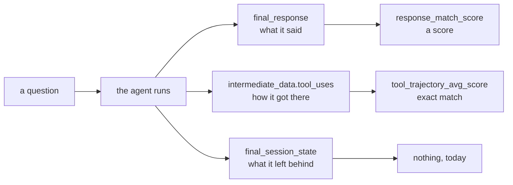

# 1.2 — Three surfaces you can assert on

## One-line answer

An agent gives you three separate things to be right or wrong about — **the answer it gave**, **the
path it took to get there**, and **the state it left behind** — and each needs its own assertion,
because a system can be perfect on any one of them while being badly wrong on the others.

## The story

A plumber comes to fix a dripping tap.

He is there an hour and a half. When he leaves, you check the tap. It does not drip. That is the
thing you asked for and it is done.

Then, over the next few days, two other things surface.

The first is how he did it. To reach the joint he took the pipe out through the wall of the next room
and ran it back along the skirting board, because that was quicker than going under the floor. The tap
works. The pipe is now somewhere it should not be, and the next person who has to touch it will spend
an afternoon working out why.

The second is what he left. There is a bag of old fittings under the sink, the isolation valve is
still turned a quarter closed, and the towel he used is in the bin with a screwdriver in it.

Three separate questions: **is the tap fixed**, **how did he get there**, and **what is the house like
now**. You cannot answer any of the three by answering another. And if you only ever check the first
one, you will be perfectly happy with this plumber until the day somebody opens the wall.

## The idea in plain language

An agent's run produces three observable things, and they are the three surfaces you can write a case
about.

**The final response.** What the agent said. It is the thing a user sees, so it is the thing everybody
asserts on first, and it is the hardest of the three to assert on well — because there are many
correct wordings, which is the whole reason part
[1.1](1.1-a-test-that-answers-how-much.md) had to introduce scores.

**The trajectory.** The sequence of tool calls the agent made on the way, with their arguments. It is
the pipe through the wall. Two runs can produce identical answers by completely different routes, and
the route is often the thing that matters: one lookup or twelve, the cheap tool or the expensive one,
the read-only tool or the one that writes. It is also, usefully, the surface where correctness is
**exact** — either it called `ticket(4740)` or it did not — which is why part
[3.1](../03-two-metrics-that-cost-nothing/3.1-tool-trajectory-avg-score.md)'s metric can be a plain
comparison.

**The state left behind.** Session state, the artefacts on disk, the rows in a database, the ticket
that got closed. It is the bag of fittings under the sink. Sutra has spent whole phases on this —
[Day 47](../../../day-47-persistent-sessions/LESSON.md) on persistent sessions,
[Day 60](../../../day-60-durable-execution/LESSON.md) on durable execution — and it is the surface
most eval suites never assert on at all.

Why three rather than one: **each surface has failures the other two cannot see.**

| The failure | Answer | Trajectory | State |
| --- | --- | --- | --- |
| Right answer, twelve tool calls where one would do | ✅ fine | ❌ caught | ✅ fine |
| Right answer, invented — no tool called at all | ✅ fine | ❌ caught | ✅ fine |
| Right tools, answer says the opposite | ❌ caught | ✅ fine | ✅ fine |
| Right answer, right path, ticket closed twice | ✅ fine | ✅ fine | ❌ caught |
| Right answer, right path, session left mid-flow | ✅ fine | ✅ fine | ❌ caught |

Row two is the one worth pausing on. An agent that answers *"Ticket 4740 has been open for eleven
days"* without calling anything has given a correct answer for a completely unacceptable reason —
it guessed, and it happened to be right this time. No amount of scoring the answer can see that. The
trajectory sees it immediately, because the list of tool calls is empty.

ADK's own vocabulary has all three. On the installed `google-adk==2.7.1`, an `Invocation` has fields
`invocation_id`, `user_content`, `final_response`, `intermediate_data`, `creation_timestamp`,
`rubrics` and `app_details` — the answer and the path — and an `EvalCase` adds `session_input` and
`final_session_state`, which is the third. That the library models all three, and that this
curriculum's first suite will only assert on two of them, is a fact worth being honest about now
rather than discovering later.

## Why Sutra needs it

Because Sutra's desk is a tool-using agent whose *route* is a design decision the previous days
argued about at length. [Day 68](../../../day-68-least-privilege-tools/LESSON.md) gave tools the
narrowest possible permissions; [Day 78](../../../day-78-inside-free-quota/LESSON.md) priced the desk
at four requests per ticket. Both of those are claims about the trajectory, and neither is checkable
by looking at the answer.

The `one_lookup` case in this day's fixture exists for exactly that reason. Its note says so:

```text
the desk must not read the whole queue to answer a question about one ticket
```

That is a cost claim and a privacy claim at once, and the only surface it lives on is the trajectory.
Part [3.1](../03-two-metrics-that-cost-nothing/3.1-tool-trajectory-avg-score.md) measures it going red.

## The mechanism

The three surfaces are three fields on one recorded turn:

```python
def invocation(question: str, tools: list[tuple[str, dict[str, str]]], said: str) -> Invocation:
    """One turn, in the shape ADK's evaluators read: what was asked, what was called, what was said."""
    return Invocation(
        user_content=genai_types.Content(parts=[genai_types.Part(text=question)], role="user"),
        final_response=genai_types.Content(parts=[genai_types.Part(text=said)], role="model"),
        intermediate_data=IntermediateData(
            tool_uses=[genai_types.FunctionCall(name=name, args=args) for name, args in tools]
        ),
    )
```

**Line by line:**

- `Invocation` is ADK's record of one turn, from `google.adk.evaluation.eval_case`. Verified against
  the installed `google-adk==2.7.1`, where `Invocation.model_fields` lists exactly
  `['invocation_id', 'user_content', 'final_response', 'intermediate_data', 'creation_timestamp',
  'rubrics', 'app_details']`.
- `user_content` and `final_response` are `google.genai.types.Content` — the same type the model API
  itself uses, with `parts` and a `role`. ADK does not invent a parallel representation for evals,
  which is why a recorded run and a live run are the same shape and a case can be captured from one.
- `role="user"` and `role="model"` are not decoration. A judged metric hands these to a model, and a
  turn with the wrong role reads as the model asking itself a question.
- `intermediate_data` carries the trajectory. `IntermediateData.model_fields` is `['tool_uses',
  'tool_responses', 'intermediate_responses']` — the calls, what came back, and any text the agent
  emitted between them.
- `tool_uses` is a list of `genai_types.FunctionCall`, each with a `name` and `args`. The args are in
  there, which matters: `ticket(ticket_id="4740")` and `ticket(ticket_id="4688")` are different
  trajectories, and a metric that compared only names would miss it.
- This function builds an `Invocation` by hand rather than capturing one from a running agent. That is
  deliberate for a lab that must cost nothing — and the trade-off it makes is part
  [2.2](../02-the-evalset-file/2.2-recording-a-case-or-writing-one.md)'s subject.

The third surface is on the case rather than the turn:

```python
EvalCase(eval_id=case.eval_id, conversation=[expected(case)])
```

**Line by line:**

- `conversation` is a list of `Invocation` — a case is a whole conversation, not a single question,
  even when today's cases all have one turn in them.
- `EvalCase.model_fields` on 2.7.1 is `['eval_id', 'conversation', 'conversation_scenario',
  'session_input', 'creation_timestamp', 'rubrics', 'final_session_state']`. `session_input` is the
  state the case starts from and `final_session_state` is the state it should end in — the third
  surface, present in the library and **not used by this day's suite**.
- Leaving `final_session_state` unset is a real gap and this part is where it gets named. Sutra's desk
  writes state; nothing in today's cases asserts on it. Part
  [5.3](../05-evals-are-tests/5.3-what-a-real-eval-suite-adds.md) lists it as the first thing a real
  suite adds.



## When it breaks

The failure this part exists to prevent has no error text, because it is a **missing assertion**
rather than a wrong one. What it looks like is a suite that is green on a desk that has stopped
looking anything up.

You can produce it exactly. The lab's `--buggy` desk changes only the trajectory — the answers are
byte-identical to the good arm — so the two metrics disagree completely about the same run:

```bash
cd days/day-79-evals-are-tests/lab
uv run python trajectory.py --buggy; echo "exit: $?"
uv run python respmatch.py; echo "exit: $?"
```

**Line by line:**

- The first command scores the **trajectory** of the faulty desk. The second scores the **answers** of
  the same desk, which the fault does not touch, so it runs the unmodified arm.

Measured on 2026-09-06, the two verdicts on the same system:

```text
  4 of 6 cases at or above 1.0
  2 case(s) took a different path from the one written down
exit: 1
```

```text
  6 of 6 cases at or above 0.8
exit: 0
```

**Same desk. One metric red, one metric green.** A team asserting only on answers ships this. A team
asserting only on trajectories misses part
[3.3](../03-two-metrics-that-cost-nothing/3.3-response-match-and-the-word-not.md)'s failure, where the
path is perfect and the sentence says the opposite of the truth.

There is no fix that is one metric. The fix is that a case declares which surfaces it is about, and
the suite runs every declared metric against every case — which is what `test_config.json`'s
`criteria` dictionary is for, and part
[3.4](../03-two-metrics-that-cost-nothing/3.4-the-threshold-is-the-test.md) reads it.

## In production

**What a professional asserts on that a tutorial does not.** The state. Not because the other two do
not matter, but because state failures are the expensive ones: a wrong answer is embarrassing, an
extra tool call is money, and a ticket closed twice is a customer who received two refunds. Day 65's
gate found precisely this — a run that closes the ticket twice exits `0` with a completely normal log —
and the assertion that catches it is on `final_session_state`, not on anything the agent said.

**What degrades at scale.** Trajectory assertions get brittle before answer assertions do, because
tool sets change. Rename a tool, split one tool into two, add a caching layer that skips a call, and
every trajectory case fails while nothing is broken. Teams respond by loosening the trajectory metric
until it checks nothing, and the honest alternative is to assert on **properties** of the trajectory —
no more than N calls, no calls to the write tool, this tool called at least once — rather than on the
exact sequence. Part [3.2](../03-two-metrics-that-cost-nothing/3.2-exact-match-right-default-wrong-metric.md)
is the argument.

**The failure that only shows with real traffic.** Answers and trajectories are recorded per turn;
state accumulates across turns and across sessions. A leak that adds one stale key to session state on
every run is invisible in any single-case eval and obvious after a thousand. That is a different kind
of test — a soak, not an eval — and it is worth knowing the difference so nobody expects the suite to
find it.

**The review comment a senior engineer leaves:** *"Your suite asserts on the answer and the path, and
this agent writes to the ticket store. Add one case that asserts on the state after the run, even if
it is only 'exactly one close row exists'. And the trajectory metric here is exact-sequence — that is
fine while we have four tools, but write down now what we will do when somebody renames one, because
the answer will otherwise be 'delete the assertion'."*

**The interview question:** *"An agent gives the right answer. What else would you check?"* The answer
that shows experience names the path and the side-effects, and then gives the reason rather than the
list: a right answer produced by a wrong route is a right answer you cannot rely on next time, and a
right answer that left the world changed is a bug that has already happened.

## Check yourself

```bash
cd days/day-79-evals-are-tests/lab
uv run python trajectory.py --buggy; echo "exit: $?"
uv run python respmatch.py; echo "exit: $?"
```

One exits 1 and one exits 0, on the same desk. Say which surface each is looking at, and which of the
two you would put in CI first.

Now open `_desk.py` and read the `note` field on the `one_lookup` case. Say which of the three surfaces
that note is a claim about, and write the note you would attach to a case that asserts on state.

**Out loud, without scrolling up:** an agent answers correctly without calling a single tool. Which
surface catches it, and why can no amount of scoring the answer ever do so?

**Next:** [1.3 — The case is the unit](1.3-the-case-is-the-unit.md).
