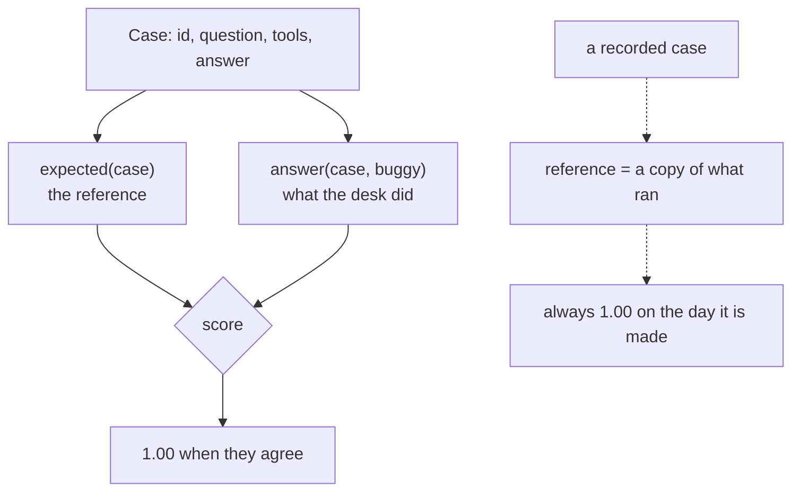

# 2.2 — Recording a case, or writing one

## One-line answer

A case captured from a real session records **what the agent did**, and a case written by hand records
**what it should do** — and the difference is not convenience, it is that one of them cannot fail on
the day you create it.

## The story

A shop has a camera, and it also has a diary.

The camera runs all day. When something happens — a delivery goes missing, an argument about change —
you go back and look at the recording. It shows what happened, exactly, with no argument possible.
Nobody has to remember anything.

The diary is different. Before the season starts, the owner writes down how the counter is supposed to
be run: the till is counted at opening and at closing, the deliveries are checked against the note
before the driver leaves, the fridge is written down twice a day.

Both are useful and they do opposite jobs. The camera tells you what happened. It never tells you that
what happened was wrong, because it has no opinion. The diary tells you what should happen, and it is
the only one of the two that can be *disagreed with* — which means it is the only one that can be
wrong, and also the only one that can catch anything.

The mistake is to install the camera and think you have written the diary.

## The idea in plain language

There are two ways a case gets into an evalset, and they produce cases with genuinely different
properties.

**Recorded.** Run the agent, like it, save the session as a case. ADK's dev UI does this — `adk web`
lets you take a session you have just had and add it to an evalset — and it is by far the fastest way
to get a suite that exists. What lands in the file is the agent's actual `final_response` and its
actual `intermediate_data`, verbatim.

**Written.** Decide what the agent should do, and type it. Slower, and needs somebody who knows the
right answer.

The crucial property, and it is easy to miss: **a recorded case passes by construction.** Its
reference is a copy of what the agent produced, so the very first run scores 1.00 on every metric. That
is not evidence of anything. The case has never been an assertion; it is a snapshot with an equals
sign after it.

That does not make recorded cases worthless — it makes them a different tool:

| | Recorded | Written |
| --- | --- | --- |
| Cost to create | seconds | minutes, plus somebody who knows |
| Passes on day one | always, by construction | only if the agent is already right |
| Catches | **regressions** — a change from today's behaviour | **defects** — a gap between behaviour and intent |
| Encodes | what the agent does | what somebody decided it should do |
| Fails when | the agent changes | the agent is wrong |
| Its reference can be | out of date | wrong |

Read the "catches" row twice. A recorded suite is a **regression** suite: it tells you when something
changed. A written suite is a **specification** suite: it tells you when something is wrong. Teams
usually want the second and build the first, because the first is the one you can have by Friday.

There is a third path worth naming because it is what good teams actually do: **record, then edit.**
Capture the session for its structure — the exact tool names, the argument shapes, the message roles,
all the things that are tedious and error-prone to type — and then *change the reference answer to
what it should have been*. The moment you edit it, it stops being a snapshot and becomes an assertion.

## Why Sutra needs it

Because this day's six cases are **written**, and that choice is why the suite could go red on the day
it was created. Part [3.1](../03-two-metrics-that-cost-nothing/3.1-tool-trajectory-avg-score.md)'s
`--buggy` arm fails two cases, and it can only do that because the references were not copied from the
faulty desk.

It also decides what Day 82 can promise. Addendum 02 puts the full eval run on Day 73's nightly, and a
nightly regression suite made of recorded cases will alert on every deliberate improvement to the desk
as loudly as on every bug. Knowing which kind of suite you have is what makes the alerts readable.

And it is the honest label for a limitation in this lab. The cases here are hand-built `Invocation`
objects, so `tool_responses` is empty in every one of them — part
[2.1](2.1-the-evalset-is-a-file.md) noticed it in the JSON. A recorded case would have those, because
the runtime actually got answers back. That is a real thing recording buys.

## The mechanism

A written case constructs its reference from the case's own fields:

```python
def expected(case: Case) -> Invocation:
    """The case as it was written down: the reference the actual run is scored against."""
    return invocation(case.question, list(case.tools), case.answer)
```

**Line by line:**

- Every argument comes from `case`, which is the frozen record from part
  [1.3](../01-a-test-with-a-score/1.3-the-case-is-the-unit.md). Nothing here has seen the desk run.
  That is the definition of "written": the reference exists before, and independently of, any
  behaviour.
- It returns a fresh `Invocation` on every call rather than caching one. Cheap, and it means the
  reference handed to a scorer can never be an object something else has mutated.

The desk's *actual* run is built by a different function, and the two are deliberately not the same
code path:

```python
def answer(case: Case, buggy: bool = False) -> Invocation:
    """What the desk actually did, as a recorded invocation."""
    tools = list(case.tools)
    said = case.answer
    if buggy:
        if case.eval_id == "one_lookup":
            tools = [("open_tickets", {}), *tools]
        ...
    return invocation(case.question, tools, said)
```

**Line by line:**

- `answer` and `expected` both start from `case`, which is what makes the good arm score 1.00 — and
  that is exactly the "passes by construction" property this part is warning about, present in this
  very lab. It is stated here rather than hidden because Principle 10 applies to teaching material:
  the green arm of `trajectory.py` proves the plumbing works and proves nothing about the desk.
- The `buggy` branch is what rescues it. It makes `answer` diverge from `expected` in two specific,
  realistic ways, so the suite has been *seen to fail*. A suite nobody has watched fail is part
  [2.3](2.3-the-case-that-cannot-fail.md)'s subject.
- The divergence is in the **trajectory only** — `said` is unchanged for `one_lookup` — which is what
  let part [1.2](../01-a-test-with-a-score/1.2-three-surfaces-you-can-assert-on.md) show one metric red
  and one green on the same run.

What the two paths produce, side by side:



Run both arms and read the first as evidence of plumbing rather than of correctness:

```bash
cd days/day-79-evals-are-tests/lab
uv run python trajectory.py; echo "exit: $?"
uv run python trajectory.py --buggy; echo "exit: $?"
```

**Line by line:**

- The first is the "recorded case" situation in miniature: reference and behaviour come from the same
  source, so it is 6 of 6.
- The second is what a written case buys: the behaviour moved, the reference did not, and the suite
  noticed.

Measured on 2026-09-06:

```text
  6 of 6 cases at or above 1.0
  every case took the path it was supposed to
exit: 0
```

```text
  4 of 6 cases at or above 1.0
  2 case(s) took a different path from the one written down
exit: 1
```

## When it breaks

The characteristic failure of a recorded suite is that it **alerts on improvements**, and there is no
error text because nothing has gone wrong.

Concretely: somebody improves the desk so it answers *"is 4652 blocked?"* without a lookup, using the
queue summary it already has in context. That is strictly better — one fewer request per ticket, which
Day 78 priced at four requests a ticket and 48 requests a day. A recorded suite reports:

```text
  one_lookup         0.00  FAILED   []
```

and somebody on call, at eight in the morning, has to decide whether that is a regression. The suite
cannot help them, because it never encoded intent — only history.

The written suite has the opposite failure and it is worse in a different way: **a reference that is
simply wrong**. Somebody typed "eleven days" and it is ten. Every run fails, forever, and the natural
response after the third morning is to change the reference to whatever the desk says — which
converts the written case into a recorded one without anybody deciding to.

The smallest defence against both is the same, and it is a field rather than a check: the `note` from
part [1.3](../01-a-test-with-a-score/1.3-the-case-is-the-unit.md). A case that says *why* its
reference is what it is gives the person at eight in the morning something to reason with:

```text
the desk must not read the whole queue to answer a question about one ticket
```

Read that next to `one_lookup FAILED []` — an empty trajectory — and the answer is immediate: the note
says "must not read the whole queue", the desk read nothing at all, and that is a different behaviour
which needs a decision rather than a revert.

## In production

**What a professional does.** Both, labelled. A recorded regression suite that runs on every commit and
is expected to churn when behaviour intentionally changes, and a much smaller written specification
suite that is expected never to change and whose failures are treated as defects. Mixing them in one
file is how a team ends up unable to say whether a red run is a bug or a diff.

**What degrades at scale.** Recorded suites rot towards agreement. Every time a recorded case fails
because of a deliberate change, the cheapest fix is to re-record it — and re-recording is a one-click
operation in most tooling. After a year, the suite asserts that the agent does what the agent does,
which is true of every agent. The tell is a suite that has never found a bug, only ever reported
changes.

**The failure that only shows with real traffic.** Recorded cases carry whatever was in the session,
which for a support desk means customer text. That file is then committed. Day 69's PII boundaries
apply and nothing in the recording flow enforces them, so the practical rule is that a recorded case
is redacted **before** it is saved, not after — because once it is in git history, removing it is a
history rewrite.

**The review comment a senior engineer leaves:** *"These six are written, which is why they could go
red on day one — say so in the file's description. When we start recording from the dev UI, put those
in a separate evalset and name it `regression`, so a red run tells us which question we are being
asked. And whatever we record gets its reference edited before it is committed, or we have built a
suite that agrees with us by definition."*

**The interview question:** *"Your eval suite has been green for six months. Good sign or bad sign?"*
The answer that shows experience asks where the cases came from. If they were recorded from the
system's own output, six months of green is exactly what you would expect from a suite that cannot
fail for any reason except change — and the follow-up is what the suite has ever caught, because a
suite with no catches is a suite with no calibration.

## Check yourself

```bash
cd days/day-79-evals-are-tests/lab
uv run python trajectory.py; echo "exit: $?"
uv run python trajectory.py --buggy; echo "exit: $?"
```

The first run is 6 of 6, and this part argues you should not be reassured by it. Say why, in one
sentence, using the words "reference" and "source".

Now do the recording experiment by hand. In `_desk.py`, change the `one_lookup` case's `tools` to
`(("open_tickets", {}), ("ticket", {"ticket_id": "4652"}))` — that is, make the reference match what
the buggy desk does. Re-run the `--buggy` arm. It goes from 4 of 6 to 5 of 6. You have just
re-recorded a case, and the suite now agrees with the bug. Put it back.

**Out loud, without scrolling up:** what does a recorded case catch that a written one does not, and
what can it never catch?

**Next:** [2.3 — The case that cannot fail](2.3-the-case-that-cannot-fail.md).
